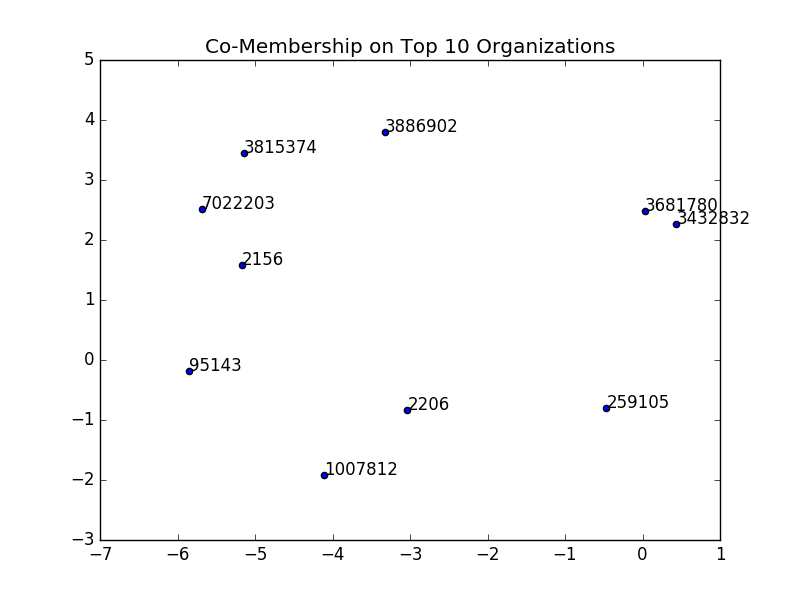
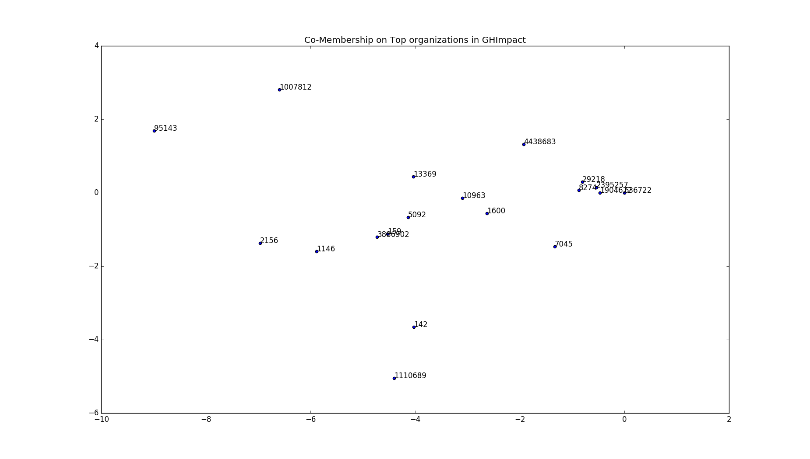
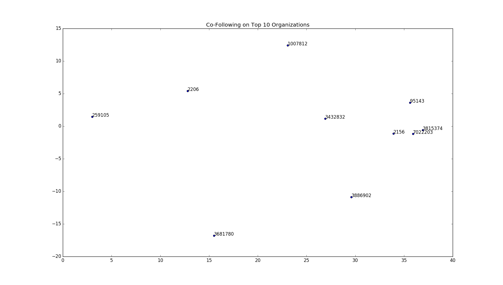
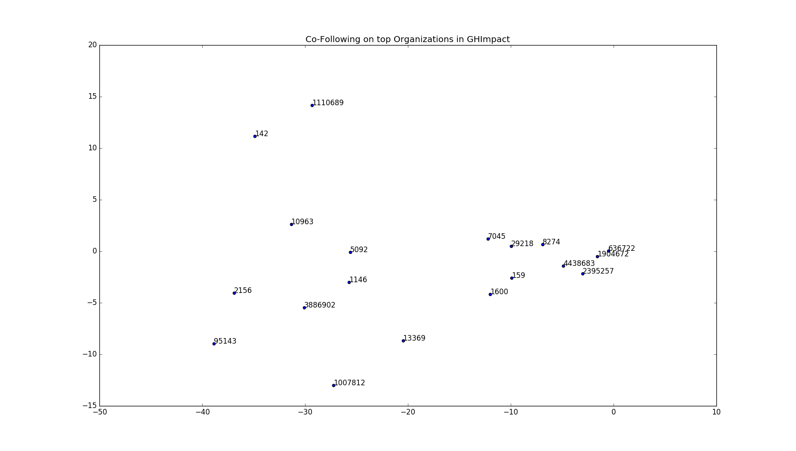
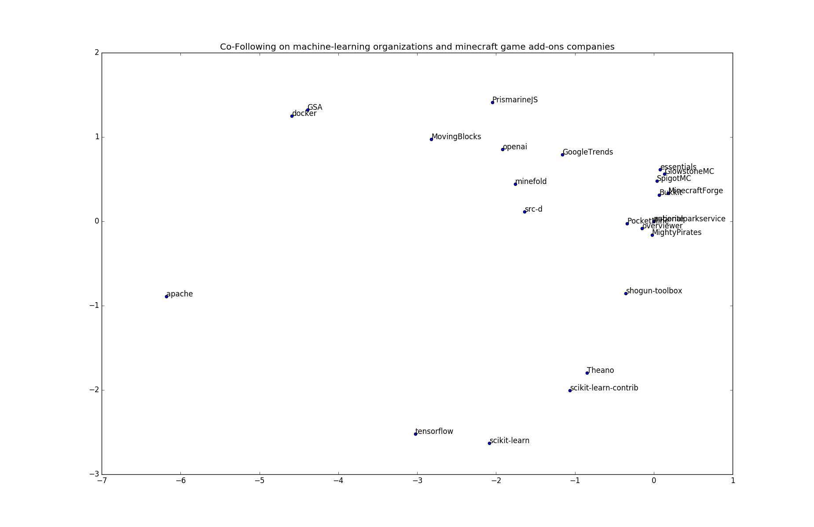

#CO-Following on GitHub
#### MIE1512 \ Jay Patel

## PREFACE

This project is based on a paper: Co-Following on Twitter By Venkata Rama Kiran Garimella and Ingmar Weber in 2014 in whcih they have presented a comprehensive study of co-following relationship in social network users, perticularly on Twitter.

The primary hypothesis is that Two twitter users whose followers have similar other followings (except those two users) are also similar. By using co-following users as feature vectors, the analysis shows the classification on binary preference and similarities in different users based on their follower's behaviour.

Here, We are using the same concept of Co-Following on different social media platform: GitHub.

The notebook is in following order.

1. Introduction
2. Importing Data
3. Data Wrangling
4. Data Preparation
5. Rationale of Features (Classification)
6. Main Analysis (PCA)
7. Interpretation of Results
8. Conclusion
9. Future Possible Work
10. References

## 1. INTRODUCTION
In paper on co-following on Twitter, Garimella and Weber have shown the coprehensive study on co-following relationship in social network based on Twitter users' data. They showed that how this observation contributes to (1) user classification on Twitter (2) eliciting opportunities for computational social science and (3) improving online marketing by identifying cross-selling opportunitues.

They started with classification of user based on co-following data to show how accurately we can predict one user's preference on following one from two organizations. Which also paved the way for the further analysis as the accuracy of classification shows nothing else but significance of co-following data.

After that they have found the cosine similarity among the organizations based on their co-following features and then mapped them into 2D plot with the help of Multidimensional Scaling (MDS).
Their result showed how two or more fundamentally different organizations falls near to each other (i.e. seemed similar) even though they don't share any explicit connection.


```python
from pyspark.sql.types import *
from pyspark.ml.feature import CountVectorizer
from pyspark.ml.feature import PCA
from pyspark.sql.functions import lit
from pyspark.mllib.classification import SVMWithSGD, SVMModel
from pyspark.mllib.regression import LabeledPoint
from pyspark.mllib.linalg import SparseVector
from pyspark.mllib.evaluation import BinaryClassificationMetrics
from pyspark.ml.linalg import Vector as MLVector, Vectors as MLVectors
from pyspark.mllib.linalg import Vector as MLLibVector, Vectors as MLLibVectors
from pyspark.sql import DataFrame

#non-spark library
from functools import reduce
import numpy as np
import matplotlib.pyplot as plt
```


<style scoped>
  .ansiout {
    display: block;
    unicode-bidi: embed;
    white-space: pre-wrap;
    word-wrap: break-word;
    word-break: break-all;
    font-family: "Source Code Pro", "Menlo", monospace;;
    font-size: 13px;
    color: #555;
    margin-left: 4px;
    line-height: 19px;
  }
</style>
<div class="ansiout"></div>


```python
def vectorizer(dataframe, inputCol, outputCol, vocabSize, minDF):
    '''
    function that converts the data to vectors in N space.
    INPUT - DATAFRAME, INPUT COLUMN (in which you have your list of user-data you want to convert into  Vectors)
            OUTPUT COLUMN (under what name you want to save Vectors in DATAFRAME),
            vocabSie - max size of vectors desired (recommended-2000 max for one cluster),
            minDF - min number of times the data should occur for it to be consider as a vector.
    OUTPUT - new DATAFRAME with added column of vectors
    '''
    
    #vectorizing the co-follower features
    vector = CountVectorizer(inputCol=inputCol, outputCol=outputCol,vocabSize=vocabSize, minDF=minDF)
    model = vector.fit(dataframe)

    df_featureLabel = model.transform(dataframe)
    #df_featureLabel.show(truncate=True)
    
    return df_featureLabel

def getPCA(dataframe, inputCol, Ndimension):
    '''
    Function for Dimension Reduction
    Use PCA - Principal Component Analysis
    INPUT - DATAFRAME with feature vector column.
            Ndimension (number of dimension you want to reduce your data into) (Ndimension = 2 for this project)
            inputCol (name of the input dataframe column with high dimensional data)
    OUTPUT - new dataframe with column 'pcaFeature'
    '''
    pca = PCA(k=Ndimension, inputCol=inputCol, outputCol="pcaFeatures")
    model = pca.fit(dataframe)
    return model.transform(dataframe)

def getLabelPoint(datatframe):
    '''
    Function for creating LabeledPoints
    INPUT - Dataframe with column names: 'label' and 'features'
    OUTPUT - RDD of LabeledPoints
    '''
  
    #creating LabeledPoint vectors from features and label columns 
    #dataframe to RDD
    df_to_rdd = datatframe.rdd.map(lambda y: (y.label, y.features))
    
    #labeledPoints
    labeledVectors = df_to_rdd.map(lambda y: LabeledPoint(y[0], MLLibVectors.fromML(y[1])))
    
    return labeledVectors
  
def Classification(labeledVectors):
    '''
    Function for Classification with SVM
    INPUT - RDD of LabeledPoint
    OUTPUT - [AUC-ROC, AUC-PR] type:list
    '''
    #splitting hte data into train and test 
    splits = labeledVectors.randomSplit([0.6, 0.4], 1234)
    train = splits[0]
    test = splits[1]
    # Build the model
    model = SVMWithSGD.train(train)

    # Evaluating the model on training data
    labelsAndPreds = test.map(lambda p: (p.label, model.predict(p.features)))
    #trainErr = labelsAndPreds.filter(lambda lp: lp[0] != lp[1]).count() / float(labeledVectors.count())
    #print("Training Error = " + str(trainErr))
    predictionAndLabels = test.map(lambda lp: (float(model.predict(lp.features)), lp.label))

    metrics = BinaryClassificationMetrics(predictionAndLabels)

    predictions = model.predict(test)
    #print("Area under PR = %s" % metrics.areaUnderPR)
    #print("Area under ROC = %s" % metrics.areaUnderROC)
    
    return [metrics.areaUnderROC, metrics.areaUnderPR]
  
#combining all three collection of organizations

def unionAll(*dfs):
    '''
    function derived from https://stackoverflow.com/questions/33743978/spark-union-of-multiple-rdds
    takes all the dataframes you want to concate as arguments and produce a giant dtaframe 
    only obvious condition is all the input dataframes must have same number of columns with same name. 
    '''
    return reduce(DataFrame.unionAll, dfs)
  
```


<style scoped>
  .ansiout {
    display: block;
    unicode-bidi: embed;
    white-space: pre-wrap;
    word-wrap: break-word;
    word-break: break-all;
    font-family: "Source Code Pro", "Menlo", monospace;;
    font-size: 13px;
    color: #555;
    margin-left: 4px;
    line-height: 19px;
  }
</style>
<div class="ansiout"></div>


##2. IMPORTING DATA

#### 2.1 IMPORTING DATASETS AND SAVING INTO LOCAL DIRECTORY

The dataset used here is from GHTorrent which is the largest offline mirror data from GitHub REST API which can be accessible through Google BigQuery interface. The latest SQL dump by the time of the project was from April 2018. The dataset imported here is from GHTorrent April 2018 mySQL dump.

Google account and credentials used for BigQuery: Shaily Patel (Team Member)


```python
%sh wget -P/FileStore/tables https://storage.googleapis.com/157watcher/organizations1.csv
```


<style scoped>
  .ansiout {
    display: block;
    unicode-bidi: embed;
    white-space: pre-wrap;
    word-wrap: break-word;
    word-break: break-all;
    font-family: "Source Code Pro", "Menlo", monospace;;
    font-size: 13px;
    color: #555;
    margin-left: 4px;
    line-height: 19px;
  }
</style>
<div class="ansiout">--2018-04-25 11:32:15--  https://storage.googleapis.com/157watcher/organizations1.csv
Resolving storage.googleapis.com (storage.googleapis.com)... 216.58.216.144, 2607:f8b0:400a:807::2010
Connecting to storage.googleapis.com (storage.googleapis.com)|216.58.216.144|:443... connected.
HTTP request sent, awaiting response... 200 OK
Length: 21007551 (20M) [application/octet-stream]
Saving to: ‘/FileStore/tables/organizations1.csv’

     0K .......... .......... .......... .......... ..........  0% 3.64M 5s
    50K .......... .......... .......... .......... ..........  0% 9.32M 4s
   100K .......... .......... .......... .......... ..........  0% 10.9M 3s
   150K .......... .......... .......... .......... ..........  0% 18.1M 3s
   200K .......... .......... .......... .......... ..........  1% 20.5M 2s
   250K .......... .......... .......... .......... ..........  1% 22.3M 2s
   300K .......... .......... .......... .......... ..........  1% 30.8M 2s
   350K .......... .......... .......... .......... ..........  1% 32.4M 2s
   400K .......... .......... .......... .......... ..........  2% 39.3M 2s
   450K .......... .......... .......... .......... ..........  2% 45.4M 1s
   500K .......... .......... .......... .......... ..........  2% 35.8M 1s
   550K .......... .......... .......... .......... ..........  2% 41.2M 1s
   600K .......... .......... .......... .......... ..........  3% 46.4M 1s
   650K .......... .......... .......... .......... ..........  3% 47.8M 1s
   700K .......... .......... .......... .......... ..........  3% 49.9M 1s
   750K .......... .......... .......... .......... ..........  3% 42.5M 1s
   800K .......... .......... .......... .......... ..........  4% 37.8M 1s
   850K .......... .......... .......... .......... ..........  4% 39.9M 1s
   900K .......... .......... .......... .......... ..........  4% 41.9M 1s
   950K .......... .......... .......... .......... ..........  4% 36.7M 1s
  1000K .......... .......... .......... .......... ..........  5% 35.4M 1s
  1050K .......... .......... .......... .......... ..........  5%  106M 1s
  1100K .......... .......... .......... .......... ..........  5%  119M 1s
  1150K .......... .......... .......... .......... ..........  5%  128M 1s
  1200K .......... .......... .......... .......... ..........  6%  142M 1s
  1250K .......... .......... .......... .......... ..........  6%  162M 1s
  1300K .......... .......... .......... .......... ..........  6%  121M 1s
  1350K .......... .......... .......... .......... ..........  6% 83.7M 1s
  1400K .......... .......... .......... .......... ..........  7% 86.3M 1s
  1450K .......... .......... .......... .......... ..........  7%  111M 1s
  1500K .......... .......... .......... .......... ..........  7% 81.8M 1s
  1550K .......... .......... .......... .......... ..........  7% 64.2M 1s
  1600K .......... .......... .......... .......... ..........  8% 83.8M 1s
  1650K .......... .......... .......... .......... ..........  8% 79.0M 1s
  1700K .......... .......... .......... .......... ..........  8%  105M 1s
  1750K .......... .......... .......... .......... ..........  8%  134M 1s
  1800K .......... .......... .......... .......... ..........  9%  161M 1s
  1850K .......... .......... .......... .......... ..........  9% 90.6M 1s
  1900K .......... .......... .......... .......... ..........  9%  149M 1s
  1950K .......... .......... .......... .......... ..........  9%  139M 1s
  2000K .......... .......... .......... .......... ..........  9%  125M 1s
  2050K .......... .......... .......... .......... .......... 10% 95.2M 1s
  2100K .......... .......... .......... .......... .......... 10% 89.2M 1s
  2150K .......... .......... .......... .......... .......... 10% 87.9M 0s
  2200K .......... .......... .......... .......... .......... 10%  128M 0s
  2250K .......... .......... .......... .......... .......... 11%  123M 0s
  2300K .......... .......... .......... .......... .......... 11% 86.7M 0s
  2350K .......... .......... .......... .......... .......... 11% 83.8M 0s
  2400K .......... .......... .......... .......... .......... 11%  104M 0s
  2450K .......... .......... .......... .......... .......... 12%  137M 0s
  2500K .......... .......... .......... .......... .......... 12% 99.4M 0s
  2550K .......... .......... .......... .......... .......... 12%  113M 0s
  2600K .......... .......... .......... .......... .......... 12% 74.9M 0s
  2650K .......... .......... .......... .......... .......... 13% 99.1M 0s
  2700K .......... .......... .......... .......... .......... 13%  116M 0s
  2750K .......... .......... .......... .......... .......... 13% 67.4M 0s
  2800K .......... .......... .......... .......... .......... 13%  101M 0s
  2850K .......... .......... .......... .......... .......... 14% 92.2M 0s
  2900K .......... .......... .......... .......... .......... 14% 89.9M 0s
  2950K .......... .......... .......... .......... .......... 14% 84.5M 0s
  3000K .......... .......... .......... .......... .......... 14%  124M 0s
  3050K .......... .......... .......... .......... .......... 15% 83.5M 0s
  3100K .......... .......... .......... .......... .......... 15%  130M 0s
  3150K .......... .......... .......... .......... .......... 15% 79.6M 0s
  3200K .......... .......... .......... .......... .......... 15%  104M 0s
  3250K .......... .......... .......... .......... .......... 16%  108M 0s
  3300K .......... .......... .......... .......... .......... 16%  114M 0s
  3350K .......... .......... .......... .......... .......... 16% 81.9M 0s
  3400K .......... .......... .......... .......... .......... 16% 92.4M 0s
  3450K .......... .......... .......... .......... .......... 17% 95.8M 0s
  3500K .......... .......... .......... .......... .......... 17% 84.8M 0s
  3550K .......... .......... .......... .......... .......... 17% 80.3M 0s
  3600K .......... .......... .......... .......... .......... 17%  127M 0s
  3650K .......... .......... .......... .......... .......... 18% 99.4M 0s
  3700K .......... .......... .......... .......... .......... 18%  128M 0s
  3750K .......... .......... .......... .......... .......... 18% 70.5M 0s
  3800K .......... .......... .......... .......... .......... 18%  123M 0s
  3850K .......... .......... .......... .......... .......... 19% 84.6M 0s
  3900K .......... .......... .......... .......... .......... 19%  121M 0s
  3950K .......... .......... .......... .......... .......... 19% 86.3M 0s
  4000K .......... .......... .......... .......... .......... 19%  132M 0s
  4050K .......... .......... .......... .......... .......... 19%  101M 0s
  4100K .......... .......... .......... .......... .......... 20% 88.9M 0s
  4150K .......... .......... .......... .......... .......... 20%  103M 0s
  4200K .......... .......... .......... .......... .......... 20% 75.9M 0s
  4250K .......... .......... .......... .......... .......... 20% 98.6M 0s
  4300K .......... .......... .......... .......... .......... 21%  123M 0s
  4350K .......... .......... .......... .......... .......... 21% 85.0M 0s
  4400K .......... .......... .......... .......... .......... 21%  131M 0s
  4450K .......... .......... .......... .......... .......... 21% 82.5M 0s
  4500K .......... .......... .......... .......... .......... 22% 52.3M 0s
  4550K .......... .......... .......... .......... .......... 22% 38.5M 0s
  4600K .......... .......... .......... .......... .......... 22% 54.0M 0s
  4650K .......... .......... .......... .......... .......... 22% 86.9M 0s
  4700K .......... .......... .......... .......... .......... 23% 94.9M 0s
  4750K .......... .......... .......... .......... .......... 23%  113M 0s
  4800K .......... .......... .......... .......... .......... 23% 84.1M 0s
  4850K .......... .......... .......... .......... .......... 23%  104M 0s
  4900K .......... .......... .......... .......... .......... 24% 91.3M 0s
  4950K .......... .......... .......... .......... .......... 24%  113M 0s
  5000K .......... .......... .......... .......... .......... 24% 97.9M 0s
  5050K .......... .......... .......... .......... .......... 24%  117M 0s
  5100K .......... .......... .......... .......... .......... 25% 90.5M 0s
  5150K .......... .......... .......... .......... .......... 25%  101M 0s
  5200K .......... .......... .......... .......... .......... 25% 87.6M 0s
  5250K .......... .......... .......... .......... .......... 25%  109M 0s
  5300K .......... .......... .......... .......... .......... 26% 93.3M 0s
  5350K .......... .......... .......... .......... .......... 26%  113M 0s
  5400K .......... .......... .......... .......... .......... 26% 98.8M 0s
  5450K .......... .......... .......... .......... .......... 26% 73.8M 0s
  5500K .......... .......... .......... .......... .......... 27% 92.6M 0s
  5550K .......... .......... .......... .......... .......... 27%  128M 0s
  5600K .......... .......... .......... .......... .......... 27%  184M 0s
  5650K .......... .......... .......... .......... .......... 27%  175M 0s
  5700K .......... .......... .......... .......... .......... 28%  183M 0s
  5750K .......... .......... .......... .......... .......... 28%  166M 0s
  5800K .......... .......... .......... .......... .......... 28%  182M 0s
  5850K .......... .......... .......... .......... .......... 28%  186M 0s
  5900K .......... .......... .......... .......... .......... 29%  182M 0s
  5950K .......... .......... .......... .......... .......... 29%  153M 0s
  6000K .......... .......... .......... .......... .......... 29%  183M 0s
  6050K .......... .......... .......... .......... .......... 29%  189M 0s
  6100K .......... .......... .......... .......... .......... 29%  191M 0s
  6150K .......... .......... .......... .......... .......... 30%  161M 0s
  6200K .......... .......... .......... .......... .......... 30%  182M 0s
  6250K .......... .......... .......... .......... .......... 30%  186M 0s
  6300K .......... .......... .......... .......... .......... 30%  180M 0s
  6350K .......... .......... .......... .......... .......... 31%  160M 0s
  6400K .......... .......... .......... .......... .......... 31%  153M 0s
  6450K .......... .......... .......... .......... .......... 31%  184M 0s
  6500K .......... .......... .......... .......... .......... 31%  183M 0s
  6550K .......... .......... .......... .......... .......... 32%  163M 0s
  6600K .......... .......... .......... .......... .......... 32%  180M 0s
  6650K .......... .......... .......... .......... .......... 32%  179M 0s
  6700K .......... .......... .......... .......... .......... 32%  179M 0s
  6750K .......... .......... .......... .......... .......... 33%  154M 0s
  6800K .......... .......... .......... .......... .......... 33%  189M 0s
  6850K .......... .......... .......... .......... .......... 33%  164M 0s
  6900K .......... .......... .......... .......... .......... 33%  163M 0s
  6950K .......... .......... .......... .......... .......... 34%  167M 0s
  7000K .......... .......... .......... .......... .......... 34%  178M 0s
  7050K .......... .......... .......... .......... .......... 34%  182M 0s
  7100K .......... .......... .......... .......... .......... 34%  166M 0s
  7150K .......... .......... .......... .......... .......... 35%  151M 0s
  7200K .......... .......... .......... .......... .......... 35%  191M 0s
  7250K .......... .......... .......... .......... .......... 35%  193M 0s
  7300K .......... .......... .......... .......... .......... 35%  184M 0s
  7350K .......... .......... .......... .......... .......... 36%  166M 0s
  7400K .......... .......... .......... .......... .......... 36%  180M 0s
  7450K .......... .......... .......... .......... .......... 36%  183M 0s
  7500K .......... .......... .......... .......... .......... 36%  201M 0s
  7550K .......... .......... .......... .......... .......... 37%  169M 0s
  7600K .......... .......... .......... .......... .......... 37%  203M 0s
  7650K .......... .......... .......... .......... .......... 37%  187M 0s
  7700K .......... .......... .......... .......... .......... 37%  187M 0s
  7750K .......... .......... .......... .......... .......... 38%  161M 0s
  7800K .......... .......... .......... .......... .......... 38%  186M 0s
  7850K .......... .......... .......... .......... .......... 38%  177M 0s
  7900K .......... .......... .......... .......... .......... 38%  168M 0s
  7950K .......... .......... .......... .......... .......... 38%  159M 0s
  8000K .......... .......... .......... .......... .......... 39%  187M 0s
  8050K .......... .......... .......... .......... .......... 39%  182M 0s
  8100K .......... .......... .......... .......... .......... 39%  189M 0s
  8150K .......... .......... .......... .......... .......... 39%  410K 0s
  8200K .......... .......... .......... .......... .......... 40% 47.2M 0s
  8250K .......... .......... .......... .......... .......... 40% 82.5M 0s
  8300K .......... .......... .......... .......... .......... 40%  129M 0s
  8350K .......... .......... .......... .......... .......... 40%  144M 0s
  8400K .......... .......... .......... .......... .......... 41%  123M 0s
  8450K .......... .......... .......... .......... .......... 41%  143M 0s
  8500K .......... .......... .......... .......... .......... 41% 90.5M 0s
  8550K .......... .......... .......... .......... .......... 41% 65.2M 0s
  8600K .......... .......... .......... .......... .......... 42% 56.9M 0s
  8650K .......... .......... .......... .......... .......... 42%  113M 0s
  8700K .......... .......... .......... .......... .......... 42% 78.5M 0s
  8750K .......... .......... .......... .......... .......... 42% 75.0M 0s
  8800K .......... .......... .......... .......... .......... 43% 64.1M 0s
  8850K .......... .......... .......... .......... .......... 43% 58.9M 0s
  8900K .......... .......... .......... .......... .......... 43% 77.5M 0s
  8950K .......... .......... .......... .......... .......... 43% 84.8M 0s
  9000K .......... .......... .......... .......... .......... 44% 75.0M 0s
  9050K .......... .......... .......... .......... .......... 44% 76.0M 0s
  9100K .......... .......... .......... .......... .......... 44% 62.6M 0s
  9150K .......... .......... .......... .......... .......... 44% 74.7M 0s
  9200K .......... .......... .......... .......... .......... 45% 55.2M 0s
  9250K .......... .......... .......... .......... .......... 45% 82.7M 0s
  9300K .......... .......... .......... .......... .......... 45%  152M 0s
  9350K .......... .......... .......... .......... .......... 45%  149M 0s
  9400K .......... .......... .......... .......... .......... 46%  126M 0s
  9450K .......... .......... .......... .......... .......... 46%  109M 0s
  9500K .......... .......... .......... .......... .......... 46%  193M 0s
  9550K .......... .......... .......... .......... .......... 46%  187M 0s
  9600K .......... .......... .......... .......... .......... 47%  163M 0s
  9650K .......... .......... .......... .......... .......... 47%  179M 0s
  9700K .......... .......... .......... .......... .......... 47%  186M 0s
  9750K .......... .......... .......... .......... .......... 47%  199M 0s
  9800K .......... .......... .......... .......... .......... 48%  170M 0s
  9850K .......... .......... .......... .......... .......... 48%  198M 0s
  9900K .......... .......... .......... .......... .......... 48%  193M 0s
  9950K .......... .......... .......... .......... .......... 48%  178M 0s
 10000K .......... .......... .......... .......... .......... 48%  150M 0s
 10050K .......... .......... .......... .......... .......... 49%  206M 0s
 10100K .......... .......... .......... .......... .......... 49%  203M 0s
 10150K .......... .......... .......... .......... .......... 49%  199M 0s
 10200K .......... .......... .......... .......... .......... 49%  193M 0s
 10250K .......... .......... .......... .......... .......... 50%  211M 0s
 10300K .......... .......... .......... .......... .......... 50%  215M 0s
 10350K .......... .......... .......... .......... .......... 50%  195M 0s
 10400K .......... .......... .......... .......... .......... 50%  168M 0s
 10450K .......... .......... .......... .......... .......... 51%  167M 0s
 10500K .......... .......... .......... .......... .......... 51%  204M 0s
 10550K .......... .......... .......... .......... .......... 51%  206M 0s
 10600K .......... .......... .......... .......... .......... 51%  191M 0s
 10650K .......... .......... .......... .......... .......... 52%  222M 0s
 10700K .......... .......... .......... .......... .......... 52%  205M 0s
 10750K .......... .......... .......... .......... .......... 52%  220M 0s
 10800K .......... .......... .......... .......... .......... 52%  146M 0s
 10850K .......... .......... .......... .......... .......... 53% 73.0M 0s
 10900K .......... .......... .......... .......... .......... 53% 51.3M 0s
 10950K .......... .......... .......... .......... .......... 53% 55.4M 0s
 11000K .......... .......... .......... .......... .......... 53% 85.6M 0s
 11050K .......... .......... .......... .......... .......... 54%  143M 0s
 11100K .......... .......... .......... .......... .......... 54%  142M 0s
 11150K .......... .......... .......... .......... .......... 54%  136M 0s
 11200K .......... .......... .......... .......... .......... 54%  116M 0s
 11250K .......... .......... .......... .......... .......... 55%  140M 0s
 11300K .......... .......... .......... .......... .......... 55%  141M 0s
 11350K .......... .......... .......... .......... .......... 55%  141M 0s
 11400K .......... .......... .......... .......... .......... 55%  123M 0s
 11450K .......... .......... .......... .......... .......... 56%  132M 0s
 11500K .......... .......... .......... .......... .......... 56%  135M 0s
 11550K .......... .......... .......... .......... .......... 56% 82.4M 0s
 11600K .......... .......... .......... .......... .......... 56% 51.9M 0s
 11650K .......... .......... .......... .......... .......... 57% 59.9M 0s
 11700K .......... .......... .......... .......... .......... 57% 52.3M 0s
 11750K .......... .......... .......... .......... .......... 57% 56.3M 0s
 11800K .......... .......... .......... .......... .......... 57%  117M 0s
 11850K .......... .......... .......... .......... .......... 58%  135M 0s
 11900K .......... .......... .......... .......... .......... 58%  143M 0s
 11950K .......... .......... .......... .......... .......... 58%  140M 0s
 12000K .......... .......... .......... .......... .......... 58%  119M 0s
 12050K .......... .......... .......... .......... .......... 58%  146M 0s
 12100K .......... .......... .......... .......... .......... 59%  144M 0s
 12150K .......... .......... .......... .......... .......... 59%  141M 0s
 12200K .......... .......... .......... .......... .......... 59% 62.7M 0s
 12250K .......... .......... .......... .......... .......... 59% 59.3M 0s
 12300K .......... .......... .......... .......... .......... 60% 72.5M 0s
 12350K .......... .......... .......... .......... .......... 60% 70.7M 0s
 12400K .......... .......... .......... .......... .......... 60% 82.0M 0s
 12450K .......... .......... .......... .......... .......... 60% 95.0M 0s
 12500K .......... .......... .......... .......... .......... 61% 94.8M 0s
 12550K .......... .......... .......... .......... .......... 61%  142M 0s
 12600K .......... .......... .......... .......... .......... 61%  125M 0s
 12650K .......... .......... .......... .......... .......... 61%  141M 0s
 12700K .......... .......... .......... .......... .......... 62%  138M 0s
 12750K .......... .......... .......... .......... .......... 62%  139M 0s
 12800K .......... .......... .......... .......... .......... 62%  117M 0s
 12850K .......... .......... .......... .......... .......... 62%  140M 0s
 12900K .......... .......... .......... .......... .......... 63% 68.6M 0s
 12950K .......... .......... .......... .......... .......... 63% 64.8M 0s
 13000K .......... .......... .......... .......... .......... 63% 71.3M 0s
 13050K .......... .......... .......... .......... .......... 63% 98.0M 0s
 13100K .......... .......... .......... .......... .......... 64% 89.2M 0s
 13150K .......... .......... .......... .......... .......... 64% 99.0M 0s
 13200K .......... .......... .......... .......... .......... 64% 72.8M 0s
 13250K .......... .......... .......... .......... .......... 64%  137M 0s
 13300K .......... .......... .......... .......... .......... 65%  141M 0s
 13350K .......... .......... .......... .......... .......... 65%  135M 0s
 13400K .......... .......... .......... .......... .......... 65%  124M 0s
 13450K .......... .......... .......... .......... .......... 65%  142M 0s
 13500K .......... .......... .......... .......... .......... 66%  142M 0s
 13550K .......... .......... .......... .......... .......... 66%  137M 0s
 13600K .......... .......... .......... .......... .......... 66% 61.5M 0s
 13650K .......... .......... .......... .......... .......... 66% 60.4M 0s
 13700K .......... .......... .......... .......... .......... 67%  134M 0s
 13750K .......... .......... .......... .......... .......... 67% 92.5M 0s
 13800K .......... .......... .......... .......... .......... 67% 85.6M 0s
 13850K .......... .......... .......... .......... .......... 67%  134M 0s
 13900K .......... .......... .......... .......... .......... 67%  235M 0s
 13950K .......... .......... .......... .......... .......... 68%  239M 0s
 14000K .......... .......... .......... .......... .......... 68%  104M 0s
 14050K .......... .......... .......... .......... .......... 68%  194M 0s
 14100K .......... .......... .......... .......... .......... 68%  207M 0s
 14150K .......... .......... .......... .......... .......... 69%  200M 0s
 14200K .......... .......... .......... .......... .......... 69%  126M 0s
 14250K .......... .......... .......... .......... .......... 69%  138M 0s
 14300K .......... .......... .......... .......... .......... 69%  140M 0s
 14350K .......... .......... .......... .......... .......... 70%  134M 0s
 14400K .......... .......... .......... .......... .......... 70%  118M 0s
 14450K .......... .......... .......... .......... .......... 70%  129M 0s
 14500K .......... .......... .......... .......... .......... 70% 62.2M 0s
 14550K .......... .......... .......... .......... .......... 71% 82.8M 0s
 14600K .......... .......... .......... .......... .......... 71%  101M 0s
 14650K .......... .......... .......... .......... .......... 71%  117M 0s
 14700K .......... .......... .......... .......... .......... 71% 74.9M 0s
 14750K .......... .......... .......... .......... .......... 72%  126M 0s
 14800K .......... .......... .......... .......... .......... 72% 84.5M 0s
 14850K .......... .......... .......... .......... .......... 72%  102M 0s
 14900K .......... .......... .......... .......... .......... 72%  124M 0s
 14950K .......... .......... .......... .......... .......... 73%  110M 0s
 15000K .......... .......... .......... .......... .......... 73%  123M 0s
 15050K .......... .......... .......... .......... .......... 73%  134M 0s
 15100K .......... .......... .......... .......... .......... 73%  134M 0s
 15150K .......... .......... .......... .......... .......... 74%  131M 0s
 15200K .......... .......... .......... .......... .......... 74% 58.4M 0s
 15250K .......... .......... .......... .......... .......... 74% 64.2M 0s
 15300K .......... .......... .......... .......... .......... 74%  134M 0s
 15350K .......... .......... .......... .......... .......... 75% 96.6M 0s
 15400K .......... .......... .......... .......... .......... 75% 72.2M 0s
 15450K .......... .......... .......... .......... .......... 75%  131M 0s
 15500K .......... .......... .......... .......... .......... 75%  132M 0s
 15550K .......... .......... .......... .......... .......... 76% 81.8M 0s
 15600K .......... .......... .......... .......... .......... 76%  116M 0s
 15650K .......... .......... .......... .......... .......... 76% 91.8M 0s
 15700K .......... .......... .......... .......... .......... 76%  139M 0s
 15750K .......... .......... .......... .......... .......... 77%  139M 0s
 15800K .......... .......... .......... .......... .......... 77%  118M 0s
 15850K .......... .......... .......... .......... .......... 77%  134M 0s
 15900K .......... .......... .......... .......... .......... 77%  104M 0s
 15950K .......... .......... .......... .......... .......... 77% 67.2M 0s
 16000K .......... .......... .......... .......... .......... 78% 73.3M 0s
 16050K .......... .......... .......... .......... .......... 78%  115M 0s
 16100K .......... .......... .......... .......... .......... 78%  118M 0s
 16150K .......... .......... .......... .......... .......... 78% 80.6M 0s
 16200K .......... .......... .......... .......... .......... 79%  127M 0s
 16250K .......... .......... .......... .......... .......... 79%  102M 0s
 16300K .......... .......... .......... .......... .......... 79% 88.6M 0s
 16350K .......... .......... .......... .......... .......... 79%  139M 0s
 16400K .......... .......... .......... .......... .......... 80% 77.1M 0s
 16450K .......... .......... .......... .......... .......... 80%  135M 0s
 16500K .......... .......... .......... .......... .......... 80%  142M 0s
 16550K .......... .......... .......... .......... .......... 80%  137M 0s
 16600K .......... .......... .......... .......... .......... 81%  120M 0s
 16650K .......... .......... .......... .......... .......... 81% 61.2M 0s
 16700K .......... .......... .......... .......... .......... 81% 79.2M 0s
 16750K .......... .......... .......... .......... .......... 81%  141M 0s
 16800K .......... .......... .......... .......... .......... 82% 82.2M 0s
 16850K .......... .......... .......... .......... .......... 82%  106M 0s
 16900K .......... .......... .......... .......... .......... 82%  102M 0s
 16950K .......... .......... .......... .......... .......... 82%  134M 0s
 17000K .......... .......... .......... .......... .......... 83% 86.0M 0s
 17050K .......... .......... .......... .......... .......... 83% 98.1M 0s
 17100K .......... .......... .......... .......... .......... 83% 98.3M 0s
 17150K .......... .......... .......... .......... .......... 83%  116M 0s
 17200K .......... .......... .......... .......... .......... 84%  119M 0s
 17250K .......... .......... .......... .......... .......... 84%  133M 0s
 17300K .......... .......... .......... .......... .......... 84%  142M 0s
 17350K .......... .......... .......... .......... .......... 84%  137M 0s
 17400K .......... .......... .......... .......... .......... 85% 59.2M 0s
 17450K .......... .......... .......... .......... .......... 85% 98.8M 0s
 17500K .......... .......... .......... .......... .......... 85%  140M 0s
 17550K .......... .......... .......... .......... .......... 85%  137M 0s
 17600K .......... .......... .......... .......... .......... 86%  119M 0s
 17650K .......... .......... .......... .......... .......... 86%  143M 0s
 17700K .......... .......... .......... .......... .......... 86%  134M 0s
 17750K .......... .......... .......... .......... .......... 86%  134M 0s
 17800K .......... .......... .......... .......... .......... 87%  122M 0s
 17850K .......... .......... .......... .......... .......... 87%  135M 0s
 17900K .......... .......... .......... .......... .......... 87%  136M 0s
 17950K .......... .......... .......... .......... .......... 87%  139M 0s
 18000K .......... .......... .......... .......... .......... 87%  115M 0s
 18050K .......... .......... .......... .......... .......... 88%  144M 0s
 18100K .......... .......... .......... .......... .......... 88%  142M 0s
 18150K .......... .......... .......... .......... .......... 88%  143M 0s
 18200K .......... .......... .......... .......... .......... 88%  125M 0s
 18250K .......... .......... .......... .......... .......... 89%  127M 0s
 18300K .......... .......... .......... .......... .......... 89%  140M 0s
 18350K .......... .......... .......... .......... .......... 89%  134M 0s
 18400K .......... .......... .......... .......... .......... 89%  117M 0s
 18450K .......... .......... .......... .......... .......... 90%  143M 0s
 18500K .......... .......... .......... .......... .......... 90%  128M 0s
 18550K .......... .......... .......... .......... .......... 90%  144M 0s
 18600K .......... .......... .......... .......... .......... 90%  127M 0s
 18650K .......... .......... .......... .......... .......... 91%  134M 0s
 18700K .......... .......... .......... .......... .......... 91%  141M 0s
 18750K .......... .......... .......... .......... .......... 91%  142M 0s
 18800K .......... .......... .......... .......... .......... 91%  109M 0s
 18850K .......... .......... .......... .......... .......... 92%  133M 0s
 18900K .......... .......... .......... .......... .......... 92%  134M 0s
 18950K .......... .......... .......... .......... .......... 92%  137M 0s
 19000K .......... .......... .......... .......... .......... 92%  120M 0s
 19050K .......... .......... .......... .......... .......... 93%  130M 0s
 19100K .......... .......... .......... .......... .......... 93%  136M 0s
 19150K .......... .......... .......... .......... .......... 93%  142M 0s
 19200K .......... .......... .......... .......... .......... 93%  116M 0s
 19250K .......... .......... .......... .......... .......... 94%  143M 0s
 19300K .......... .......... .......... .......... .......... 94%  141M 0s
 19350K .......... .......... .......... .......... .......... 94%  134M 0s
 19400K .......... .......... .......... .......... .......... 94%  121M 0s
 19450K .......... .......... .......... .......... .......... 95%  144M 0s
 19500K .......... .......... .......... .......... .......... 95%  135M 0s
 19550K .......... .......... .......... .......... .......... 95%  141M 0s
 19600K .......... .......... .......... .......... .......... 95%  116M 0s
 19650K .......... .......... .......... .......... .......... 96%  140M 0s
 19700K .......... .......... .......... .......... .......... 96%  145M 0s
 19750K .......... .......... .......... .......... .......... 96%  141M 0s
 19800K .......... .......... .......... .......... .......... 96%  122M 0s
 19850K .......... .......... .......... .......... .......... 97%  139M 0s
 19900K .......... .......... .......... .......... .......... 97%  135M 0s
 19950K .......... .......... .......... .......... .......... 97%  141M 0s
 20000K .......... .......... .......... .......... .......... 97%  121M 0s
 20050K .......... .......... .......... .......... .......... 97%  140M 0s
 20100K .......... .......... .......... .......... .......... 98%  142M 0s
 20150K .......... .......... .......... .......... .......... 98%  143M 0s
 20200K .......... .......... .......... .......... .......... 98%  126M 0s
 20250K .......... .......... .......... .......... .......... 98%  138M 0s
 20300K .......... .......... .......... .......... .......... 99%  138M 0s
 20350K .......... .......... .......... .......... .......... 99%  137M 0s
 20400K .......... .......... .......... .......... .......... 99%  119M 0s
 20450K .......... .......... .......... .......... .......... 99%  131M 0s
 20500K .......... .....                                      100%  142M=0.3s

2018-04-25 11:32:16 (58.9 MB/s) - ‘/FileStore/tables/organizations1.csv’ saved [21007551/21007551]

</div>


```python
%sh wget -P/FileStore/tables https://storage.googleapis.com/157watcher/followers1.csv
```


<style scoped>
  .ansiout {
    display: block;
    unicode-bidi: embed;
    white-space: pre-wrap;
    word-wrap: break-word;
    word-break: break-all;
    font-family: "Source Code Pro", "Menlo", monospace;;
    font-size: 13px;
    color: #555;
    margin-left: 4px;
    line-height: 19px;
  }
</style>
<div class="ansiout">--2018-04-25 11:32:16--  https://storage.googleapis.com/157watcher/followers1.csv
Resolving storage.googleapis.com (storage.googleapis.com)... 216.58.216.144, 2607:f8b0:400a:807::2010
Connecting to storage.googleapis.com (storage.googleapis.com)|216.58.216.144|:443... connected.
HTTP request sent, awaiting response... 200 OK
Length: 897506408 (856M) [application/octet-stream]
Saving to: ‘/FileStore/tables/followers1.csv’

     0K .......... .......... .......... .......... ..........  0% 3.72M 3m50s
    50K .......... .......... .......... .......... ..........  0% 8.46M 2m46s
   100K .......... .......... .......... .......... ..........  0% 10.8M 2m17s
   150K .......... .......... .......... .......... ..........  0% 19.0M 1m54s
   200K .......... .......... .......... .......... ..........  0% 11.5M 1m46s
   250K .......... .......... .......... .......... ..........  0% 40.0M 92s
   300K .......... .......... .......... .......... ..........  0% 33.5M 82s
   350K .......... .......... .......... .......... ..........  0% 35.9M 75s
   400K .......... .......... .......... .......... ..........  0% 37.5M 69s
   450K .......... .......... .......... .......... ..........  0% 25.8M 66s
   500K .......... .......... .......... .......... ..........  0% 28.0M 62s
   550K .......... .......... .......... .......... ..........  0% 29.8M 60s
   600K .......... .......... .......... .......... ..........  0% 24.4M 58s
   650K .......... .......... .......... .......... ..........  0% 23.9M 56s
   700K .......... .......... .......... .......... ..........  0% 46.5M 54s
   750K .......... .......... .......... .......... ..........  0% 46.0M 51s
   800K .......... .......... .......... .......... ..........  0% 42.8M 50s
   850K .......... .......... .......... .......... ..........  0% 59.5M 48s
   900K .......... .......... .......... .......... ..........  0% 43.1M 46s
   950K .......... .......... .......... .......... ..........  0% 60.6M 45s
  1000K .......... .......... .......... .......... ..........  0% 48.4M 43s
  1050K .......... .......... .......... .......... ..........  0%  118M 42s
  1100K .......... .......... .......... .......... ..........  0%  178M 40s
  1150K .......... .......... .......... .......... ..........  0%  144M 39s
  1200K .......... .......... .......... .......... ..........  0%  107M 37s
  1250K .......... .......... .......... .......... ..........  0%  112M 36s
  1300K .......... .......... .......... .......... ..........  0%  138M 35s
  1350K .......... .......... .......... .......... ..........  0%  161M 34s
  1400K .......... .......... .......... .......... ..........  0%  133M 33s
  1450K .......... .......... .......... .......... ..........  0%  134M 32s
  1500K .......... .......... .......... .......... ..........  0%  184M 31s
  1550K .......... .......... .......... .......... ..........  0%  155M 31s
  1600K .......... .......... .......... .......... ..........  0%  121M 30s
  1650K .......... .......... .......... .......... ..........  0%  186M 29s
  1700K .......... .......... .......... .......... ..........  0%  137M 28s
  1750K .......... .......... .......... .......... ..........  0%  145M 28s
  1800K .......... .......... .......... .......... ..........  0%  182M 27s
  1850K .......... .......... .......... .......... ..........  0%  178M 27s
  1900K .......... .......... .......... .......... ..........  0%  186M 26s
  1950K .......... .......... .......... .......... ..........  0%  104M 26s
  2000K .......... .......... .......... .......... ..........  0%  190M 25s
  2050K .......... .......... .......... .......... ..........  0% 82.3M 25s
  2100K .......... .......... .......... .......... ..........  0% 61.2M 24s
  2150K .......... .......... .......... .......... ..........  0%  112M 24s
  2200K .......... .......... .......... .......... ..........  0%  132M 24s
  2250K .......... .......... .......... .......... ..........  0%  124M 23s
  2300K .......... .......... .......... .......... ..........  0%  132M 23s
  2350K .......... .......... .......... .......... ..........  0% 80.2M 23s
  2400K .......... .......... .......... .......... ..........  0%  103M 22s
  2450K .......... .......... .......... .......... ..........  0% 95.6M 22s
  2500K .......... .......... .......... .......... ..........  0%  104M 22s
  2550K .......... .......... .......... .......... ..........  0% 87.2M 22s
  2600K .......... .......... .......... .......... ..........  0%  147M 21s
  2650K .......... .......... .......... .......... ..........  0%  181M 21s
  2700K .......... .......... .......... .......... ..........  0%  142M 21s
  2750K .......... .......... .......... .......... ..........  0% 90.0M 21s
  2800K .......... .......... .......... .......... ..........  0%  109M 20s
  2850K .......... .......... .......... .......... ..........  0%  111M 20s
  2900K .......... .......... .......... .......... ..........  0%  187M 20s
  2950K .......... .......... .......... .......... ..........  0% 96.5M 20s
  3000K .......... .......... .......... .......... ..........  0% 94.5M 19s
  3050K .......... .......... .......... .......... ..........  0% 99.6M 19s
  3100K .......... .......... .......... .......... ..........  0%  109M 19s
  3150K .......... .......... .......... .......... ..........  0% 75.5M 19s
  3200K .......... .......... .......... .......... ..........  0% 82.0M 19s
  3250K .......... .......... .......... .......... ..........  0% 99.8M 19s
  3300K .......... .......... .......... .......... ..........  0% 97.0M 19s
  3350K .......... .......... .......... .......... ..........  0% 81.1M 18s
  3400K .......... .......... .......... .......... ..........  0% 76.7M 18s
  3450K .......... .......... .......... .......... ..........  0% 74.7M 18s
  3500K .......... .......... .......... .......... ..........  0% 74.3M 18s
  3550K .......... .......... .......... .......... ..........  0% 66.1M 18s
  3600K .......... .......... .......... .......... ..........  0% 87.4M 18s
  3650K .......... .......... .......... .......... ..........  0%  102M 18s
  3700K .......... .......... .......... .......... ..........  0%  118M 18s
  3750K .......... .......... .......... .......... ..........  0% 87.2M 18s
  3800K .......... .......... .......... .......... ..........  0%  120M 17s
  3850K .......... .......... .......... .......... ..........  0%  115M 17s
  3900K .......... .......... .......... .......... ..........  0%  115M 17s
  3950K .......... .......... .......... .......... ..........  0% 99.9M 17s
  4000K .......... .......... .......... .......... ..........  0%  143M 17s
  4050K .......... .......... .......... .......... ..........  0%  109M 17s
  4100K .......... .......... .......... .......... ..........  0%  128M 17s
  4150K .......... .......... .......... .......... ..........  0%  109M 17s
  4200K .......... .......... .......... .......... ..........  0%  127M 16s
  4250K .......... .......... .......... .......... ..........  0%  110M 16s
  4300K .......... .......... .......... .......... ..........  0%  125M 16s
  4350K .......... .......... .......... .......... ..........  0%  108M 16s
  4400K .......... .......... .......... .......... ..........  0%  128M 16s
  4450K .......... .......... .......... .......... ..........  0%  124M 16s
  4500K .......... .......... .......... .......... ..........  0%  176M 16s
  4550K .......... .......... .......... .......... ..........  0%  115M 16s
  4600K .......... .......... .......... .......... ..........  0%  131M 16s
  4650K .......... .......... .......... .......... ..........  0%  128M 16s
  4700K .......... .......... .......... .......... ..........  0%  125M 15s
  4750K .......... .......... .......... .......... ..........  0%  132M 15s
  4800K .......... .......... .......... .......... ..........  0%  131M 15s
  4850K .......... .......... .......... .......... ..........  0%  169M 15s
  4900K .......... .......... .......... .......... ..........  0%  130M 15s
  4950K .......... .......... .......... .......... ..........  0%  107M 15s
  5000K .......... .......... .......... .......... ..........  0%  125M 15s
  5050K .......... .......... .......... .......... ..........  0%  118M 15s
  5100K .......... .......... .......... .......... ..........  0%  123M 15s
  5150K .......... .......... .......... .......... ..........  0% 94.2M 15s
  5200K .......... .......... .......... .......... ..........  0% 77.7M 15s
  5250K .......... .......... .......... .......... ..........  0% 93.9M 15s
  5300K .......... .......... .......... .......... ..........  0% 95.5M 15s
  5350K .......... .......... .......... .......... ..........  0%  114M 14s
  5400K .......... .......... .......... .......... ..........  0%  122M 14s
  5450K .......... .......... .......... .......... ..........  0%  122M 14s
  5500K .......... .......... .......... .......... ..........  0%  126M 14s
  5550K .......... .......... .......... .......... ..........  0%  107M 14s
  5600K .......... .......... .......... .......... ..........  0%  134M 14s
  5650K .......... .......... .......... .......... ..........  0%  133M 14s
  5700K .......... .......... .......... .......... ..........  0%  127M 14s
  5750K .......... .......... .......... .......... ..........  0%  115M 14s
  5800K .......... .......... .......... .......... ..........  0%  121M 14s
  5850K .......... .......... .......... .......... ..........  0%  122M 14s
  5900K .......... .......... .......... .......... ..........  0%  124M 14s
  5950K .......... .......... .......... .......... ..........  0%  107M 14s
  6000K .......... .......... .......... .......... ..........  0%  127M 14s
  6050K .......... .......... .......... .......... ..........  0%  131M 14s
  6100K .......... .......... .......... .......... ..........  0%  127M 14s
  6150K .......... .......... .......... .......... ..........  0%  113M 13s
  6200K .......... .......... .......... .......... ..........  0%  126M 13s
  6250K .......... .......... .......... .......... ..........  0%  123M 13s
  6300K .......... .......... .......... .......... ..........  0%  130M 13s
  6350K .......... .......... .......... .......... ..........  0%  104M 13s
  6400K .......... .......... .......... .......... ..........  0%  124M 13s
  6450K .......... .......... .......... .......... ..........  0%  133M 13s
  6500K .......... .......... .......... .......... ..........  0%  118M 13s
  6550K .......... .......... .......... .......... ..........  0%  111M 13s
  6600K .......... .......... .......... .......... ..........  0%  126M 13s
  6650K .......... .......... .......... .......... ..........  0%  124M 13s
  6700K .......... .......... .......... .......... ..........  0%  123M 13s
  6750K .......... .......... .......... .......... ..........  0%  107M 13s
  6800K .......... .......... .......... .......... ..........  0%  128M 13s
  6850K .......... .......... .......... .......... ..........  0%  129M 13s
  6900K .......... .......... .......... .......... ..........  0%  124M 13s
  6950K .......... .......... .......... .......... ..........  0%  111M 13s
  7000K .......... .......... .......... .......... ..........  0%  124M 13s
  7050K .......... .......... .......... .......... ..........  0%  124M 13s
  7100K .......... .......... .......... .......... ..........  0%  125M 13s
  7150K .......... .......... .......... .......... ..........  0%  104M 13s
  7200K .......... .......... .......... .......... ..........  0%  126M 13s
  7250K .......... .......... .......... .......... ..........  0%  130M 13s
  7300K .......... .......... .......... .......... ..........  0%  130M 12s
  7350K .......... .......... .......... .......... ..........  0%  115M 12s
  7400K .......... .......... .......... .......... ..........  0%  118M 12s
  7450K .......... .......... .......... .......... ..........  0%  124M 12s
  7500K .......... .......... .......... .......... ..........  0%  123M 12s
  7550K .......... .......... .......... .......... ..........  0%  106M 12s
  7600K .......... .......... .......... .......... ..........  0%  130M 12s
  7650K .......... .......... .......... .......... ..........  0%  131M 12s
  7700K .......... .......... .......... .......... ..........  0%  132M 12s
  7750K .......... .......... .......... .......... ..........  0%  112M 12s
  7800K .......... .......... .......... .......... ..........  0%  129M 12s
  7850K .......... .......... .......... .......... ..........  0%  124M 12s
  7900K .......... .......... .......... .......... ..........  0%  120M 12s
  7950K .......... .......... .......... .......... ..........  0%  106M 12s
  8000K .......... .......... .......... .......... ..........  0%  130M 12s
  8050K .......... .......... .......... .......... ..........  0%  129M 12s
  8100K .......... .......... .......... .......... ..........  0%  129M 12s
  8150K .......... .......... .......... .......... ..........  0%  968K 17s
  8200K .......... .......... .......... .......... ..........  0% 43.5M 17s
  8250K .......... .......... .......... .......... ..........  0% 59.7M 17s
  8300K .......... .......... .......... .......... ..........  0% 53.4M 17s
  8350K .......... .......... .......... .......... ..........  0% 50.9M 17s
  8400K .......... .......... .......... .......... ..........  0% 51.9M 17s
  8450K .......... .......... .......... .......... ..........  0% 45.0M 17s
  8500K .......... .......... .......... .......... ..........  0% 72.1M 17s
  8550K .......... .......... .......... .......... ..........  0%  119M 17s
  8600K .......... .......... .......... .......... ..........  0% 54.1M 17s
  8650K .......... .......... .......... .......... ..........  0% 64.6M 17s
  8700K .......... .......... .......... .......... ..........  0% 71.7M 17s
  8750K .......... .......... .......... .......... ..........  1% 50.9M 17s
  8800K .......... .......... .......... .......... ..........  1% 44.7M 17s
  8850K .......... .......... .......... .......... ..........  1% 92.5M 17s
  8900K .......... .......... .......... .......... ..........  1% 61.8M 17s
  8950K .......... .......... .......... .......... ..........  1% 58.3M 17s
  9000K .......... .......... .......... .......... ..........  1% 49.4M 17s
  9050K .......... .......... .......... .......... ..........  1% 69.8M 17s
  9100K .......... .......... .......... .......... ..........  1% 65.4M 17s
  9150K .......... .......... .......... .......... ..........  1% 79.1M 17s
  9200K .......... .......... .......... .......... ..........  1%  101M 17s
  9250K .......... .......... .......... .......... ..........  1% 92.0M 17s
  9300K .......... .......... .......... .......... ..........  1% 96.6M 17s
  9350K .......... .......... .......... .......... ..........  1%  137M 17s
  9400K .......... .......... .......... .......... ..........  1% 87.0M 17s
  9450K .......... .......... .......... .......... ..........  1%  102M 17s
  9500K .......... .......... .......... .......... ..........  1%  100M 17s
  9550K .......... .......... .......... .......... ..........  1%  123M 17s
  9600K .......... .......... .......... .......... ..........  1% 81.8M 17s
  9650K .......... .......... .......... .......... ..........  1%  104M 17s
  9700K .......... .......... .......... .......... ..........  1% 95.6M 16s
  9750K .......... .......... .......... .......... ..........  1%  145M 16s
  9800K .......... .......... .......... .......... ..........  1% 93.2M 16s
  9850K .......... .......... .......... .......... ..........  1% 83.8M 16s
  9900K .......... .......... .......... .......... ..........  1% 94.3M 16s
  9950K .......... .......... .......... .......... ..........  1%  136M 16s
 10000K .......... .......... .......... .......... ..........  1% 77.3M 16s
 10050K .......... .......... .......... .......... ..........  1%  106M 16s
 10100K .......... .......... .......... .......... ..........  1%  102M 16s
 10150K .......... .......... .......... .......... ..........  1%  148M 16s
 10200K .......... .......... .......... .......... ..........  1% 65.4M 16s
 10250K .......... .......... .......... .......... ..........  1%  124M 16s
 10300K .......... .......... .......... .......... ..........  1% 96.2M 16s
 10350K .......... .......... .......... .......... ..........  1%  152M 16s
 10400K .......... .......... .......... .......... ..........  1%  122M 16s
 10450K .......... .......... .......... .......... ..........  1%  103M 16s
 10500K .......... .......... .......... .......... ..........  1%  168M 16s
 10550K .......... .......... .......... .......... ..........  1%  145M 16s
 10600K .......... .......... .......... .......... ..........  1% 92.7M 16s
 10650K .......... .......... .......... .......... ..........  1%  157M 16s
 10700K .......... .......... .......... .......... ..........  1%  101M 16s
 10750K .......... .......... .......... .......... ..........  1%  160M 16s
 10800K .......... .......... .......... .......... ..........  1% 72.2M 16s
 10850K .......... .......... .......... .......... ..........  1%  145M 16s
 10900K .......... .......... .......... .......... ..........  1%  152M 15s
 10950K .......... .......... .......... .......... ..........  1%  105M 15s
 11000K .......... .......... .......... .......... ..........  1% 80.0M 15s
 11050K .......... .......... .......... .......... ..........  1%  144M 15s
 11100K .......... .......... .......... .......... ..........  1%  168M 15s
 11150K .......... .......... .......... .......... ..........  1% 95.2M 15s
 11200K .......... .......... .......... .......... ..........  1%  142M 15s
 11250K .......... .......... .......... .......... ..........  1%  104M 15s
 11300K .......... .......... .......... .......... ..........  1%  119M 15s
 11350K .......... .......... .......... .......... ..........  1%  159M 15s
 11400K .......... .......... .......... .......... ..........  1%  108M 15s
 11450K .......... .......... .......... .......... ..........  1% 97.9M 15s
 11500K .......... .......... .......... .......... ..........  1%  111M 15s
 11550K .......... .......... .......... .......... ..........  1%  138M 15s
 11600K .......... .......... .......... .......... ..........  1% 94.2M 15s
 11650K .......... .......... .......... .......... ..........  1%  125M 15s
 11700K .......... .......... .......... .......... ..........  1%  169M 15s
 11750K .......... .......... .......... .......... ..........  1%  116M 15s
 11800K .......... .......... .......... .......... ..........  1%  106M 15s
 11850K .......... .......... .......... .......... ..........  1% 97.7M 15s
 11900K .......... .......... .......... .......... ..........  1%  115M 15s
 11950K .......... .......... .......... .......... ..........  1%  164M 15s
 12000K .......... .......... .......... .......... ..........  1% 83.0M 15s
 12050K .......... .......... .......... .......... ..........  1%  114M 15s
 12100K .......... .......... .......... .......... ..........  1%  150M 15s
 12150K .......... .......... .......... .......... ..........  1% 97.0M 15s
 12200K .......... .......... .......... .......... ..........  1%  108M 15s
 12250K .......... .......... .......... .......... ..........  1%  120M 15s
 12300K .......... .......... .......... .......... ..........  1%  112M 15s
 12350K .......... .......... .......... .......... ..........  1%  105M 15s
 12400K .......... .......... .......... .......... ..........  1%  114M 14s
 12450K .......... .......... .......... .......... ..........  1%  112M 14s
 12500K .......... .......... .......... .......... ..........  1%  170M 14s
 12550K .......... .......... .......... .......... ..........  1%  169M 14s
 12600K .......... .......... .......... .......... ..........  1% 83.4M 14s
 12650K .......... .......... .......... .......... ..........  1%  123M 14s
 12700K .......... .......... .......... .......... ..........  1% 86.6M 14s
 12750K .......... .......... .......... .......... ..........  1%  166M 14s
 12800K .......... .......... .......... .......... ..........  1% 98.4M 14s
 12850K .......... .......... .......... .......... ..........  1%  158M 14s
 12900K .......... .......... .......... .......... ..........  1%  123M 14s
 12950K .......... .......... .......... .......... ..........  1%  103M 14s
 13000K .......... .......... .......... .......... ..........  1%  128M 14s
 13050K .......... .......... .......... .......... ..........  1% 80.1M 14s
 13100K .......... .......... .......... .......... ..........  1% 95.6M 14s
 13150K .......... .......... .......... .......... ..........  1%  113M 14s
 13200K .......... .......... .......... .......... ..........  1%  131M 14s
 13250K .......... .......... .......... .......... ..........  1% 87.9M 14s
 13300K .......... .......... .......... .......... ..........  1%  160M 14s
 13350K .......... .......... .......... .......... ..........  1%  167M 14s
 13400K .......... .......... .......... .......... ..........  1% 76.7M 14s
 13450K .......... .......... .......... .......... ..........  1%  153M 14s
 13500K .......... .......... .......... .......... ..........  1% 92.1M 14s
 13550K .......... .......... .......... .......... ..........  1%  138M 14s
 13600K .......... .......... .......... .......... ..........  1% 84.4M 14s
 13650K .......... .......... .......... .......... ..........  1%  150M 14s
 13700K .......... .......... .......... .......... ..........  1%  167M 14s
 13750K .......... .......... .......... .......... ..........  1%  114M 14s
 13800K .......... .......... .......... .......... ..........  1%  147M 14s
 13850K .......... .......... .......... .......... ..........  1%  146M 14s
 13900K .......... .......... .......... .......... ..........  1% 98.0M 14s
 13950K .......... .......... .......... .......... ..........  1%  142M 14s
 14000K .......... .......... .......... .......... ..........  1%  103M 14s
 14050K .......... .......... .......... .......... ..........  1%  167M 14s
 14100K .......... .......... .......... .......... ..........  1%  152M 14s
 14150K .......... .......... .......... .......... ..........  1%  103M 14s
 14200K .......... .......... .......... .......... ..........  1%  148M 14s
 14250K .......... .......... .......... .......... ..........  1% 91.7M 14s
 14300K .......... .......... .......... .......... ..........  1%  115M 13s
 14350K .......... .......... .......... .......... ..........  1%  148M 13s
 14400K .......... .......... .......... .......... ..........  1% 81.2M 13s
 14450K .......... .......... .......... .......... ..........  1%  125M 13s
 14500K .......... .......... .......... .......... ..........  1%  121M 13s
 14550K .......... .......... .......... .......... ..........  1%  165M 13s
 14600K .......... .......... .......... .......... ..........  1%  137M 13s
 14650K .......... .......... .......... .......... ..........  1% 99.3M 13s
 14700K .......... .......... .......... .......... ..........  1%  160M 13s
 14750K .......... .......... .......... .......... ..........  1%  112M 13s
 14800K .......... .......... .......... .......... ..........  1% 86.9M 13s
 14850K .......... .......... .......... .......... ..........  1%  104M 13s
 14900K .......... .......... .......... .......... ..........  1%  160M 13s
 14950K .......... .......... .......... .......... ..........  1%  133M 13s
 15000K .......... .......... .......... .......... ..........  1% 95.9M 13s
 15050K .......... .......... .......... .......... ..........  1%  154M 13s
 15100K .......... .......... .......... .......... ..........  1%  112M 13s
 15150K .......... .......... .......... .......... ..........  1%  112M 13s
 15200K .......... .......... .......... .......... ..........  1% 99.5M 13s
 15250K .......... .......... .......... .......... ..........  1%  120M 13s
 15300K .......... .......... .......... .......... ..........  1%  110M 13s
 15350K .......... .......... .......... .......... ..........  1%  122M 13s
 15400K .......... .......... .......... .......... ..........  1%  144M 13s
 15450K .......... .......... .......... .......... ..........  1%  108M 13s
 15500K .......... .......... .......... .......... ..........  1%  110M 13s
 15550K .......... .......... .......... .......... ..........  1%  123M 13s
 15600K .......... .......... .......... .......... ..........  1% 83.9M 13s
 15650K .......... .......... .......... .......... ..........  1%  110M 13s
 15700K .......... .......... .......... .......... ..........  1%  131M 13s
 15750K .......... .......... .......... .......... ..........  1%  169M 13s
 15800K .......... .......... .......... .......... ..........  1%  101M 13s
 15850K .......... .......... .......... .......... ..........  1%  135M 13s
 15900K .......... .......... .......... .......... ..........  1%  108M 13s
 15950K .......... .......... .......... .......... ..........  1%  103M 13s

*** WARNING: skipped 1283494 bytes of output ***

860150K .......... .......... .......... .......... .......... 98%  175M 0s
860200K .......... .......... .......... .......... .......... 98%  156M 0s
860250K .......... .......... .......... .......... .......... 98%  170M 0s
860300K .......... .......... .......... .......... .......... 98%  176M 0s
860350K .......... .......... .......... .......... .......... 98%  181M 0s
860400K .......... .......... .......... .......... .......... 98%  145M 0s
860450K .......... .......... .......... .......... .......... 98%  193M 0s
860500K .......... .......... .......... .......... .......... 98%  170M 0s
860550K .......... .......... .......... .......... .......... 98%  170M 0s
860600K .......... .......... .......... .......... .......... 98%  159M 0s
860650K .......... .......... .......... .......... .......... 98%  181M 0s
860700K .......... .......... .......... .......... .......... 98%  160M 0s
860750K .......... .......... .......... .......... .......... 98%  178M 0s
860800K .......... .......... .......... .......... .......... 98%  138M 0s
860850K .......... .......... .......... .......... .......... 98%  184M 0s
860900K .......... .......... .......... .......... .......... 98%  183M 0s
860950K .......... .......... .......... .......... .......... 98%  140M 0s
861000K .......... .......... .......... .......... .......... 98%  114M 0s
861050K .......... .......... .......... .......... .......... 98%  129M 0s
861100K .......... .......... .......... .......... .......... 98%  116M 0s
861150K .......... .......... .......... .......... .......... 98%  116M 0s
861200K .......... .......... .......... .......... .......... 98%  107M 0s
861250K .......... .......... .......... .......... .......... 98%  134M 0s
861300K .......... .......... .......... .......... .......... 98%  116M 0s
861350K .......... .......... .......... .......... .......... 98%  131M 0s
861400K .......... .......... .......... .......... .......... 98%  105M 0s
861450K .......... .......... .......... .......... .......... 98%  129M 0s
861500K .......... .......... .......... .......... .......... 98%  123M 0s
861550K .......... .......... .......... .......... .......... 98%  128M 0s
861600K .......... .......... .......... .......... .......... 98%  105M 0s
861650K .......... .......... .......... .......... .......... 98%  131M 0s
861700K .......... .......... .......... .......... .......... 98%  135M 0s
861750K .......... .......... .......... .......... .......... 98%  121M 0s
861800K .......... .......... .......... .......... .......... 98%  107M 0s
861850K .......... .......... .......... .......... .......... 98%  138M 0s
861900K .......... .......... .......... .......... .......... 98%  130M 0s
861950K .......... .......... .......... .......... .......... 98%  121M 0s
862000K .......... .......... .......... .......... .......... 98%  101M 0s
862050K .......... .......... .......... .......... .......... 98%  127M 0s
862100K .......... .......... .......... .......... .......... 98%  135M 0s
862150K .......... .......... .......... .......... .......... 98%  123M 0s
862200K .......... .......... .......... .......... .......... 98%  112M 0s
862250K .......... .......... .......... .......... .......... 98%  133M 0s
862300K .......... .......... .......... .......... .......... 98%  113M 0s
862350K .......... .......... .......... .......... .......... 98%  120M 0s
862400K .......... .......... .......... .......... .......... 98%  100M 0s
862450K .......... .......... .......... .......... .......... 98%  129M 0s
862500K .......... .......... .......... .......... .......... 98%  122M 0s
862550K .......... .......... .......... .......... .......... 98%  136M 0s
862600K .......... .......... .......... .......... .......... 98%  117M 0s
862650K .......... .......... .......... .......... .......... 98%  117M 0s
862700K .......... .......... .......... .......... .......... 98%  125M 0s
862750K .......... .......... .......... .......... .......... 98%  123M 0s
862800K .......... .......... .......... .......... .......... 98%  102M 0s
862850K .......... .......... .......... .......... .......... 98%  122M 0s
862900K .......... .......... .......... .......... .......... 98%  122M 0s
862950K .......... .......... .......... .......... .......... 98%  137M 0s
863000K .......... .......... .......... .......... .......... 98%  102M 0s
863050K .......... .......... .......... .......... .......... 98%  129M 0s
863100K .......... .......... .......... .......... .......... 98%  126M 0s
863150K .......... .......... .......... .......... .......... 98%  126M 0s
863200K .......... .......... .......... .......... .......... 98%  108M 0s
863250K .......... .......... .......... .......... .......... 98%  117M 0s
863300K .......... .......... .......... .......... .......... 98%  132M 0s
863350K .......... .......... .......... .......... .......... 98%  133M 0s
863400K .......... .......... .......... .......... .......... 98%  117M 0s
863450K .......... .......... .......... .......... .......... 98%  139M 0s
863500K .......... .......... .......... .......... .......... 98%  137M 0s
863550K .......... .......... .......... .......... .......... 98%  130M 0s
863600K .......... .......... .......... .......... .......... 98%  115M 0s
863650K .......... .......... .......... .......... .......... 98%  134M 0s
863700K .......... .......... .......... .......... .......... 98%  133M 0s
863750K .......... .......... .......... .......... .......... 98%  135M 0s
863800K .......... .......... .......... .......... .......... 98%  119M 0s
863850K .......... .......... .......... .......... .......... 98%  130M 0s
863900K .......... .......... .......... .......... .......... 98%  146M 0s
863950K .......... .......... .......... .......... .......... 98%  128M 0s
864000K .......... .......... .......... .......... .......... 98%  107M 0s
864050K .......... .......... .......... .......... .......... 98%  145M 0s
864100K .......... .......... .......... .......... .......... 98%  125M 0s
864150K .......... .......... .......... .......... .......... 98%  136M 0s
864200K .......... .......... .......... .......... .......... 98%  120M 0s
864250K .......... .......... .......... .......... .......... 98%  128M 0s
864300K .......... .......... .......... .......... .......... 98%  120M 0s
864350K .......... .......... .......... .......... .......... 98%  122M 0s
864400K .......... .......... .......... .......... .......... 98%  104M 0s
864450K .......... .......... .......... .......... .......... 98%  130M 0s
864500K .......... .......... .......... .......... .......... 98%  141M 0s
864550K .......... .......... .......... .......... .......... 98%  130M 0s
864600K .......... .......... .......... .......... .......... 98%  110M 0s
864650K .......... .......... .......... .......... .......... 98%  117M 0s
864700K .......... .......... .......... .......... .......... 98%  129M 0s
864750K .......... .......... .......... .......... .......... 98%  138M 0s
864800K .......... .......... .......... .......... .......... 98%  101M 0s
864850K .......... .......... .......... .......... .......... 98%  133M 0s
864900K .......... .......... .......... .......... .......... 98%  131M 0s
864950K .......... .......... .......... .......... .......... 98%  128M 0s
865000K .......... .......... .......... .......... .......... 98%  123M 0s
865050K .......... .......... .......... .......... .......... 98%  143M 0s
865100K .......... .......... .......... .......... .......... 98%  120M 0s
865150K .......... .......... .......... .......... .......... 98%  123M 0s
865200K .......... .......... .......... .......... .......... 98%  112M 0s
865250K .......... .......... .......... .......... .......... 98%  129M 0s
865300K .......... .......... .......... .......... .......... 98%  132M 0s
865350K .......... .......... .......... .......... .......... 98%  128M 0s
865400K .......... .......... .......... .......... .......... 98%  123M 0s
865450K .......... .......... .......... .......... .......... 98%  115M 0s
865500K .......... .......... .......... .......... .......... 98%  130M 0s
865550K .......... .......... .......... .......... .......... 98%  128M 0s
865600K .......... .......... .......... .......... .......... 98%  114M 0s
865650K .......... .......... .......... .......... .......... 98%  143M 0s
865700K .......... .......... .......... .......... .......... 98%  125M 0s
865750K .......... .......... .......... .......... .......... 98%  140M 0s
865800K .......... .......... .......... .......... .......... 98%  120M 0s
865850K .......... .......... .......... .......... .......... 98%  106M 0s
865900K .......... .......... .......... .......... .......... 98%  139M 0s
865950K .......... .......... .......... .......... .......... 98%  145M 0s
866000K .......... .......... .......... .......... .......... 98% 93.6M 0s
866050K .......... .......... .......... .......... .......... 98%  126M 0s
866100K .......... .......... .......... .......... .......... 98%  139M 0s
866150K .......... .......... .......... .......... .......... 98%  126M 0s
866200K .......... .......... .......... .......... .......... 98%  119M 0s
866250K .......... .......... .......... .......... .......... 98%  132M 0s
866300K .......... .......... .......... .......... .......... 98%  137M 0s
866350K .......... .......... .......... .......... .......... 98%  118M 0s
866400K .......... .......... .......... .......... .......... 98%  110M 0s
866450K .......... .......... .......... .......... .......... 98%  132M 0s
866500K .......... .......... .......... .......... .......... 98%  137M 0s
866550K .......... .......... .......... .......... .......... 98%  146M 0s
866600K .......... .......... .......... .......... .......... 98% 97.9M 0s
866650K .......... .......... .......... .......... .......... 98%  137M 0s
866700K .......... .......... .......... .......... .......... 98%  121M 0s
866750K .......... .......... .......... .......... .......... 98%  126M 0s
866800K .......... .......... .......... .......... .......... 98%  116M 0s
866850K .......... .......... .......... .......... .......... 98%  127M 0s
866900K .......... .......... .......... .......... .......... 98%  121M 0s
866950K .......... .......... .......... .......... .......... 98%  119M 0s
867000K .......... .......... .......... .......... .......... 98%  104M 0s
867050K .......... .......... .......... .......... .......... 98%  113M 0s
867100K .......... .......... .......... .......... .......... 98%  156M 0s
867150K .......... .......... .......... .......... .......... 98%  179M 0s
867200K .......... .......... .......... .......... .......... 98%  139M 0s
867250K .......... .......... .......... .......... .......... 98%  154M 0s
867300K .......... .......... .......... .......... .......... 98%  179M 0s
867350K .......... .......... .......... .......... .......... 98%  175M 0s
867400K .......... .......... .......... .......... .......... 98%  137M 0s
867450K .......... .......... .......... .......... .......... 98%  163M 0s
867500K .......... .......... .......... .......... .......... 98%  182M 0s
867550K .......... .......... .......... .......... .......... 98%  188M 0s
867600K .......... .......... .......... .......... .......... 98%  134M 0s
867650K .......... .......... .......... .......... .......... 98%  184M 0s
867700K .......... .......... .......... .......... .......... 99%  197M 0s
867750K .......... .......... .......... .......... .......... 99%  180M 0s
867800K .......... .......... .......... .......... .......... 99%  157M 0s
867850K .......... .......... .......... .......... .......... 99%  177M 0s
867900K .......... .......... .......... .......... .......... 99%  194M 0s
867950K .......... .......... .......... .......... .......... 99%  184M 0s
868000K .......... .......... .......... .......... .......... 99%  136M 0s
868050K .......... .......... .......... .......... .......... 99%  175M 0s
868100K .......... .......... .......... .......... .......... 99%  146M 0s
868150K .......... .......... .......... .......... .......... 99%  185M 0s
868200K .......... .......... .......... .......... .......... 99%  153M 0s
868250K .......... .......... .......... .......... .......... 99%  177M 0s
868300K .......... .......... .......... .......... .......... 99%  174M 0s
868350K .......... .......... .......... .......... .......... 99%  189M 0s
868400K .......... .......... .......... .......... .......... 99%  151M 0s
868450K .......... .......... .......... .......... .......... 99%  165M 0s
868500K .......... .......... .......... .......... .......... 99%  192M 0s
868550K .......... .......... .......... .......... .......... 99%  174M 0s
868600K .......... .......... .......... .......... .......... 99%  163M 0s
868650K .......... .......... .......... .......... .......... 99%  170M 0s
868700K .......... .......... .......... .......... .......... 99%  183M 0s
868750K .......... .......... .......... .......... .......... 99%  186M 0s
868800K .......... .......... .......... .......... .......... 99%  129M 0s
868850K .......... .......... .......... .......... .......... 99%  170M 0s
868900K .......... .......... .......... .......... .......... 99%  190M 0s
868950K .......... .......... .......... .......... .......... 99%  190M 0s
869000K .......... .......... .......... .......... .......... 99%  163M 0s
869050K .......... .......... .......... .......... .......... 99%  177M 0s
869100K .......... .......... .......... .......... .......... 99%  195M 0s
869150K .......... .......... .......... .......... .......... 99%  188M 0s
869200K .......... .......... .......... .......... .......... 99%  136M 0s
869250K .......... .......... .......... .......... .......... 99%  163M 0s
869300K .......... .......... .......... .......... .......... 99%  165M 0s
869350K .......... .......... .......... .......... .......... 99%  165M 0s
869400K .......... .......... .......... .......... .......... 99%  146M 0s
869450K .......... .......... .......... .......... .......... 99%  167M 0s
869500K .......... .......... .......... .......... .......... 99%  175M 0s
869550K .......... .......... .......... .......... .......... 99%  174M 0s
869600K .......... .......... .......... .......... .......... 99%  157M 0s
869650K .......... .......... .......... .......... .......... 99%  176M 0s
869700K .......... .......... .......... .......... .......... 99%  169M 0s
869750K .......... .......... .......... .......... .......... 99%  182M 0s
869800K .......... .......... .......... .......... .......... 99%  172M 0s
869850K .......... .......... .......... .......... .......... 99%  175M 0s
869900K .......... .......... .......... .......... .......... 99%  177M 0s
869950K .......... .......... .......... .......... .......... 99%  191M 0s
870000K .......... .......... .......... .......... .......... 99%  152M 0s
870050K .......... .......... .......... .......... .......... 99%  177M 0s
870100K .......... .......... .......... .......... .......... 99%  189M 0s
870150K .......... .......... .......... .......... .......... 99%  174M 0s
870200K .......... .......... .......... .......... .......... 99%  141M 0s
870250K .......... .......... .......... .......... .......... 99%  180M 0s
870300K .......... .......... .......... .......... .......... 99%  191M 0s
870350K .......... .......... .......... .......... .......... 99%  177M 0s
870400K .......... .......... .......... .......... .......... 99%  142M 0s
870450K .......... .......... .......... .......... .......... 99%  178M 0s
870500K .......... .......... .......... .......... .......... 99%  182M 0s
870550K .......... .......... .......... .......... .......... 99%  187M 0s
870600K .......... .......... .......... .......... .......... 99%  158M 0s
870650K .......... .......... .......... .......... .......... 99%  173M 0s
870700K .......... .......... .......... .......... .......... 99%  188M 0s
870750K .......... .......... .......... .......... .......... 99%  193M 0s
870800K .......... .......... .......... .......... .......... 99%  152M 0s
870850K .......... .......... .......... .......... .......... 99%  193M 0s
870900K .......... .......... .......... .......... .......... 99%  179M 0s
870950K .......... .......... .......... .......... .......... 99%  182M 0s
871000K .......... .......... .......... .......... .......... 99%  154M 0s
871050K .......... .......... .......... .......... .......... 99%  175M 0s
871100K .......... .......... .......... .......... .......... 99%  192M 0s
871150K .......... .......... .......... .......... .......... 99%  175M 0s
871200K .......... .......... .......... .......... .......... 99%  161M 0s
871250K .......... .......... .......... .......... .......... 99%  183M 0s
871300K .......... .......... .......... .......... .......... 99%  187M 0s
871350K .......... .......... .......... .......... .......... 99%  177M 0s
871400K .......... .......... .......... .......... .......... 99%  157M 0s
871450K .......... .......... .......... .......... .......... 99%  178M 0s
871500K .......... .......... .......... .......... .......... 99%  187M 0s
871550K .......... .......... .......... .......... .......... 99%  193M 0s
871600K .......... .......... .......... .......... .......... 99%  144M 0s
871650K .......... .......... .......... .......... .......... 99%  166M 0s
871700K .......... .......... .......... .......... .......... 99%  173M 0s
871750K .......... .......... .......... .......... .......... 99%  176M 0s
871800K .......... .......... .......... .......... .......... 99%  168M 0s
871850K .......... .......... .......... .......... .......... 99%  173M 0s
871900K .......... .......... .......... .......... .......... 99%  192M 0s
871950K .......... .......... .......... .......... .......... 99%  186M 0s
872000K .......... .......... .......... .......... .......... 99%  156M 0s
872050K .......... .......... .......... .......... .......... 99%  189M 0s
872100K .......... .......... .......... .......... .......... 99%  199M 0s
872150K .......... .......... .......... .......... .......... 99%  163M 0s
872200K .......... .......... .......... .......... .......... 99%  162M 0s
872250K .......... .......... .......... .......... .......... 99%  183M 0s
872300K .......... .......... .......... .......... .......... 99%  152M 0s
872350K .......... .......... .......... .......... .......... 99%  172M 0s
872400K .......... .......... .......... .......... .......... 99%  148M 0s
872450K .......... .......... .......... .......... .......... 99%  191M 0s
872500K .......... .......... .......... .......... .......... 99%  188M 0s
872550K .......... .......... .......... .......... .......... 99%  185M 0s
872600K .......... .......... .......... .......... .......... 99%  156M 0s
872650K .......... .......... .......... .......... .......... 99%  179M 0s
872700K .......... .......... .......... .......... .......... 99%  171M 0s
872750K .......... .......... .......... .......... .......... 99%  189M 0s
872800K .......... .......... .......... .......... .......... 99%  160M 0s
872850K .......... .......... .......... .......... .......... 99%  175M 0s
872900K .......... .......... .......... .......... .......... 99%  187M 0s
872950K .......... .......... .......... .......... .......... 99%  180M 0s
873000K .......... .......... .......... .......... .......... 99%  143M 0s
873050K .......... .......... .......... .......... .......... 99%  175M 0s
873100K .......... .......... .......... .......... .......... 99%  166M 0s
873150K .......... .......... .......... .......... .......... 99%  189M 0s
873200K .......... .......... .......... .......... .......... 99%  156M 0s
873250K .......... .......... .......... .......... .......... 99%  201M 0s
873300K .......... .......... .......... .......... .......... 99%  190M 0s
873350K .......... .......... .......... .......... .......... 99%  182M 0s
873400K .......... .......... .......... .......... .......... 99%  161M 0s
873450K .......... .......... .......... .......... .......... 99%  179M 0s
873500K .......... .......... .......... .......... .......... 99%  193M 0s
873550K .......... .......... .......... .......... .......... 99%  171M 0s
873600K .......... .......... .......... .......... .......... 99%  145M 0s
873650K .......... .......... .......... .......... .......... 99%  189M 0s
873700K .......... .......... .......... .......... .......... 99%  202M 0s
873750K .......... .......... .......... .......... .......... 99%  162M 0s
873800K .......... .......... .......... .......... .......... 99%  154M 0s
873850K .......... .......... .......... .......... .......... 99%  190M 0s
873900K .......... .......... .......... .......... .......... 99%  186M 0s
873950K .......... .......... .......... .......... .......... 99%  188M 0s
874000K .......... .......... .......... .......... .......... 99%  156M 0s
874050K .......... .......... .......... .......... .......... 99%  196M 0s
874100K .......... .......... .......... .......... .......... 99%  187M 0s
874150K .......... .......... .......... .......... .......... 99%  192M 0s
874200K .......... .......... .......... .......... .......... 99%  173M 0s
874250K .......... .......... .......... .......... .......... 99%  191M 0s
874300K .......... .......... .......... .......... .......... 99%  196M 0s
874350K .......... .......... .......... .......... .......... 99%  186M 0s
874400K .......... .......... .......... .......... .......... 99%  159M 0s
874450K .......... .......... .......... .......... .......... 99%  171M 0s
874500K .......... .......... .......... .......... .......... 99%  200M 0s
874550K .......... .......... .......... .......... .......... 99%  188M 0s
874600K .......... .......... .......... .......... .......... 99%  170M 0s
874650K .......... .......... .......... .......... .......... 99%  189M 0s
874700K .......... .......... .......... .......... .......... 99%  183M 0s
874750K .......... .......... .......... .......... .......... 99%  194M 0s
874800K .......... .......... .......... .......... .......... 99%  163M 0s
874850K .......... .......... .......... .......... .......... 99%  191M 0s
874900K .......... .......... .......... .......... .......... 99%  189M 0s
874950K .......... .......... .......... .......... .......... 99%  196M 0s
875000K .......... .......... .......... .......... .......... 99%  169M 0s
875050K .......... .......... .......... .......... .......... 99%  194M 0s
875100K .......... .......... .......... .......... .......... 99%  188M 0s
875150K .......... .......... .......... .......... .......... 99%  187M 0s
875200K .......... .......... .......... .......... .......... 99%  153M 0s
875250K .......... .......... .......... .......... .......... 99%  197M 0s
875300K .......... .......... .......... .......... .......... 99%  191M 0s
875350K .......... .......... .......... .......... .......... 99%  201M 0s
875400K .......... .......... .......... .......... .......... 99%  165M 0s
875450K .......... .......... .......... .......... .......... 99%  198M 0s
875500K .......... .......... .......... .......... .......... 99%  193M 0s
875550K .......... .......... .......... .......... .......... 99%  196M 0s
875600K .......... .......... .......... .......... .......... 99%  162M 0s
875650K .......... .......... .......... .......... .......... 99%  195M 0s
875700K .......... .......... .......... .......... .......... 99%  197M 0s
875750K .......... .......... .......... .......... .......... 99%  194M 0s
875800K .......... .......... .......... .......... .......... 99%  178M 0s
875850K .......... .......... .......... .......... .......... 99%  185M 0s
875900K .......... .......... .......... .......... .......... 99%  177M 0s
875950K .......... .......... .......... .......... .......... 99%  170M 0s
876000K .......... .......... .......... .......... .......... 99%  159M 0s
876050K .......... .......... .......... .......... .......... 99%  190M 0s
876100K .......... .......... .......... .......... .......... 99%  194M 0s
876150K .......... .......... .......... .......... .......... 99%  192M 0s
876200K .......... .......... .......... .......... .......... 99%  169M 0s
876250K .......... .......... .......... .......... .......... 99%  189M 0s
876300K .......... .......... .......... .......... .......... 99%  188M 0s
876350K .......... .......... .......... .......... .......... 99%  196M 0s
876400K .......... .......... .......... .......... .......... 99%  159M 0s
876450K .......... .......... .                               100%  270M=6.7s

2018-04-25 11:32:23 (128 MB/s) - ‘/FileStore/tables/followers1.csv’ saved [897506408/897506408]

</div>


```python
#explore the local directory
dbutils.fs.ls("file:/FileStore/tables/")
```


<style scoped>
  .ansiout {
    display: block;
    unicode-bidi: embed;
    white-space: pre-wrap;
    word-wrap: break-word;
    word-break: break-all;
    font-family: "Source Code Pro", "Menlo", monospace;;
    font-size: 13px;
    color: #555;
    margin-left: 4px;
    line-height: 19px;
  }
</style>
<div class="ansiout"><span class="ansired">Out[</span><span class="ansired">5</span><span class="ansired">]: </span>
[FileInfo(path=&apos;file:/FileStore/tables/organizations1.csv&apos;, name=&apos;organizations1.csv&apos;, size=21007551),
 FileInfo(path=&apos;file:/FileStore/tables/followers1.csv&apos;, name=&apos;followers1.csv&apos;, size=897506408)]
</div>


####2.2 CREATING SPARK DATAFRAMES
From the imported data in form of CSV, now we convert those data to spark readable format: <i>pyspark.sql.dataframe.DataFrame<i>

We also specify the schema manually as spark can not encode the timestamp in proper datatype from the BigQuery.


```python
#building Schema
organizationsSchema = StructType([StructField('org_id', StringType(), True, 
                                             {'description': 'unique organization id', 'type': 'integer'}), 
                                 StructField('user_id', StringType(), True, 
                                             {'description': 'unique member(user) id', 'type': 'integer'}), 
                                 StructField('created_at', TimestampType(), True, 
                                             {'description': 'when the user added as member', 'type':'timestamp',\
                                              'warning':'the date recorded if GHTorrent has recorded corresponding \
                                              event, otherwise the date will correspond to users or organizations \
                                              joining date.'})])

followersSchema = StructType([StructField('user_id', StringType(), True, 
                                             {'description': 'unique organization id', 'type': 'integer'}), 
                                 StructField('follower_id', StringType(), True, 
                                             {'description': 'unique member(user) id', 'type': 'integer'}), 
                                 StructField('created_at', TimestampType(), True, 
                                             {'description': 'when the user started following the follower_id',\
                                              'type':'timestamp', 'warning':'the date recorded if GHTorrent has \
                                              recorded corresponding event, otherwise the date will correspond \
                                              to users or followers joining date.'})])
```


<style scoped>
  .ansiout {
    display: block;
    unicode-bidi: embed;
    white-space: pre-wrap;
    word-wrap: break-word;
    word-break: break-all;
    font-family: "Source Code Pro", "Menlo", monospace;;
    font-size: 13px;
    color: #555;
    margin-left: 4px;
    line-height: 19px;
  }
</style>
<div class="ansiout"></div>


```python
organizations = spark.read.csv('file:/FileStore/tables/organizations1.csv',header=True, schema=organizationsSchema)
followers = spark.read.csv('file:/FileStore/tables/followers1.csv', header=True, schema=followersSchema)
organizations.printSchema()
followers.printSchema()
```


<style scoped>
  .ansiout {
    display: block;
    unicode-bidi: embed;
    white-space: pre-wrap;
    word-wrap: break-word;
    word-break: break-all;
    font-family: "Source Code Pro", "Menlo", monospace;;
    font-size: 13px;
    color: #555;
    margin-left: 4px;
    line-height: 19px;
  }
</style>
<div class="ansiout">root
-- org_id: string (nullable = true)
-- user_id: string (nullable = true)
-- created_at: timestamp (nullable = true)

root
-- user_id: string (nullable = true)
-- follower_id: string (nullable = true)
-- created_at: timestamp (nullable = true)

</div>


####2.3 Creating temporary table views for running query with magic SQL


```python
organizations.createOrReplaceTempView("organizations")
followers.createOrReplaceTempView("followers")
```


<style scoped>
  .ansiout {
    display: block;
    unicode-bidi: embed;
    white-space: pre-wrap;
    word-wrap: break-word;
    word-break: break-all;
    font-family: "Source Code Pro", "Menlo", monospace;;
    font-size: 13px;
    color: #555;
    margin-left: 4px;
    line-height: 19px;
  }
</style>
<div class="ansiout"></div>


##3. DATA-WRANGLING

####3.1 Basic Questions to access Structure

<b>Q1. Do all records in the dataset contain the same fields?</b>

Since the Schema is set manually,
1. dataset: organizations, contains (1) org_id -> string (2) user_id -> string (3) created_at -> Date
2. dataset: followers, contains (1) user_id -> string (2) follower_id -> string (3) created_at -> Date

<b>Q2. How can you access the same fields across records? By position? By name?</b>

Since the datasets are CSV type with the apprpriate headers, we can access the same field by position as well as by column name.

<b>Q3. How are the records delimited/separated in the dataset? Do you need sophosticated parsing logic  to separate the records form one another?</b>

Datasets procured from GHTorrent is readily available in form of CSV. So there was no need for parsing the data except to convert IDs to string in schema. Because, integer value might generate wrong graphs while querying. Moreover, the timestamp coversion is stated in section 3.3.1

<b>Q4. How are record fields encoded? Human readable strings? Binary numbers? Hash keys? Compressed? Enumerated codes?</b>

All the records are encoded as integer and timestamp(for created_at field). All the fields are human readable.

<b>Q5. What is the complexity of the encoding? Primitives elements like integers, decimal numbers, short strings and so on? Higher-order elements like key-value sets or array?</b>

The time component on dataset was troublesome in original form. Google BigQuery originally save timestamp in a certain format which is not recognised with spark SQL directly.

open issue on github: https://github.com/GoogleCloudPlatform/google-cloud-go/issues/942

However, there is a BigQuery function, brought to attention by group member <i>Mohammed Bubshait</i> convert the datetime format to spark recognizable format. For example, to acquire the organization table, the following query was required:

```sql
SELECT  
  org_id,
  user_id,  
  STRFTIME_UTC_USEC(created_at, '%Y-%m-%d %H:%M:%S') AS created_at  
FROM [ghtorrent-bq:ght_2018_04_01.organization_members]
```


<b>Q7. What are the reletionship types between records and the record fields? Singular (record should have one and only one value for a field, like customer date of birth)? Set-based (record could have many values for the field, like customer shipping addresses)?</b>

Most of the data in both dataset shows one to many relation between `org_id` to `user_id` (as there could be more than one member for an onrganization) and between `user_id` to `follower_id` (as a user could have followed more than one user) in `organizations` and `followers` respectively. Datasets represent these relationship as flat key-value pairs.

####3.2 Basic Questions to assess Data granularity

<b>3.2.1. What kind of thing (person, object, relationship, event, etc.) do the records represent?</b>


```python
%sql
/* 2.1 DATASET - organizations*/
SELECT * FROM organizations
```


<style scoped>
  .table-result-container {
    max-height: 300px;
    overflow: auto;
  }
  table, th, td {
    border: 1px solid black;
    border-collapse: collapse;
  }
  th, td {
    padding: 5px;
  }
  th {
    text-align: left;
  }
</style><div class='table-result-container'><table class='table-result'><thead style='background-color: white'><tr><th>org_id</th><th>user_id</th><th>created_at</th></tr></thead><tbody><tr><td>4128768</td><td>113527</td><td>2014-06-23T00:45:41.000+0000</td></tr><tr><td>4128768</td><td>622631</td><td>2016-10-14T22:35:02.000+0000</td></tr><tr><td>4128768</td><td>207438</td><td>2014-06-23T00:45:41.000+0000</td></tr><tr><td>5701632</td><td>13344457</td><td>2016-11-01T15:15:27.000+0000</td></tr><tr><td>5701632</td><td>850886</td><td>2014-10-15T02:26:51.000+0000</td></tr><tr><td>262400</td><td>31144</td><td>2012-08-30T14:48:40.000+0000</td></tr><tr><td>6160640</td><td>3641409</td><td>2014-12-10T13:05:50.000+0000</td></tr><tr><td>31785216</td><td>1450901</td><td>2016-10-19T07:20:44.000+0000</td></tr><tr><td>31785216</td><td>7730584</td><td>2018-02-26T07:20:10.000+0000</td></tr><tr><td>31785216</td><td>495484</td><td>2016-10-19T07:20:44.000+0000</td></tr><tr><td>1835520</td><td>2213924</td><td>2018-03-02T02:28:30.000+0000</td></tr><tr><td>3211776</td><td>3338229</td><td>2016-02-14T22:33:30.000+0000</td></tr><tr><td>3211776</td><td>32038620</td><td>2016-10-29T19:41:42.000+0000</td></tr><tr><td>3211776</td><td>6218597</td><td>2015-05-01T00:08:36.000+0000</td></tr><tr><td>3211776</td><td>2296363</td><td>2015-05-01T00:08:36.000+0000</td></tr><tr><td>3211776</td><td>2501073</td><td>2015-10-22T22:03:17.000+0000</td></tr><tr><td>5112320</td><td>8243184</td><td>2018-03-09T21:50:26.000+0000</td></tr><tr><td>1508096</td><td>766221</td><td>2018-03-01T04:07:19.000+0000</td></tr><tr><td>19268352</td><td>204412</td><td>2016-06-26T13:14:35.000+0000</td></tr><tr><td>2949888</td><td>4246388</td><td>2014-06-09T08:27:53.000+0000</td></tr><tr><td>2949888</td><td>2225261</td><td>2014-04-30T09:26:33.000+0000</td></tr><tr><td>11010816</td><td>6831482</td><td>2016-10-14T19:39:03.000+0000</td></tr><tr><td>11010816</td><td>103341</td><td>2016-02-28T01:25:04.000+0000</td></tr><tr><td>12583680</td><td>8966305</td><td>2016-10-22T14:40:36.000+0000</td></tr><tr><td>12583680</td><td>1455149</td><td>2016-10-22T14:40:36.000+0000</td></tr><tr><td>12583680</td><td>956011</td><td>2016-10-22T14:40:36.000+0000</td></tr><tr><td>787456</td><td>7792438</td><td>2015-04-21T06:31:49.000+0000</td></tr><tr><td>787456</td><td>18983</td><td>2012-09-18T18:41:46.000+0000</td></tr><tr><td>787456</td><td>743107</td><td>2012-09-18T18:41:46.000+0000</td></tr><tr><td>787456</td><td>748761</td><td>2012-09-18T18:41:46.000+0000</td></tr><tr><td>787456</td><td>743109</td><td>2012-09-18T18:41:46.000+0000</td></tr><tr><td>787456</td><td>781902</td><td>2012-09-18T18:41:46.000+0000</td></tr><tr><td>787456</td><td>1711785</td><td>2014-06-09T00:17:41.000+0000</td></tr><tr><td>787456</td><td>748772</td><td>2012-09-18T18:41:46.000+0000</td></tr><tr><td>2163712</td><td>940334</td><td>2014-06-15T02:29:55.000+0000</td></tr><tr><td>3802112</td><td>3802113</td><td>2014-04-22T18:58:29.000+0000</td></tr><tr><td>3802112</td><td>74098</td><td>2014-04-22T18:58:29.000+0000</td></tr><tr><td>3802112</td><td>269434</td><td>2014-04-22T18:58:29.000+0000</td></tr><tr><td>4391936</td><td>4448645</td><td>2016-02-16T23:33:31.000+0000</td></tr><tr><td>4391936</td><td>60905</td><td>2014-06-21T03:13:55.000+0000</td></tr><tr><td>4457472</td><td>20422</td><td>2014-06-28T01:10:03.000+0000</td></tr><tr><td>7078912</td><td>2778287</td><td>2015-10-22T02:20:04.000+0000</td></tr><tr><td>2032896</td><td>85148</td><td>2018-03-02T18:15:27.000+0000</td></tr><tr><td>10355968</td><td>9577321</td><td>2015-11-02T07:16:37.000+0000</td></tr><tr><td>460288</td><td>43126</td><td>2012-08-15T18:20:32.000+0000</td></tr><tr><td>3802624</td><td>1731995</td><td>2014-04-23T04:45:46.000+0000</td></tr><tr><td>3802624</td><td>11378260</td><td>2016-02-16T05:41:23.000+0000</td></tr><tr><td>984832</td><td>984831</td><td>2012-11-16T07:55:14.000+0000</td></tr><tr><td>3999488</td><td>228929</td><td>2014-05-22T10:22:09.000+0000</td></tr><tr><td>8587008</td><td>1714593</td><td>2015-10-19T06:38:22.000+0000</td></tr><tr><td>8587008</td><td>27820249</td><td>2016-10-27T01:35:33.000+0000</td></tr><tr><td>8587008</td><td>8062950</td><td>2015-10-19T06:38:22.000+0000</td></tr><tr><td>8587008</td><td>4253142</td><td>2016-02-09T16:41:09.000+0000</td></tr><tr><td>8587008</td><td>9752392</td><td>2015-10-19T06:38:22.000+0000</td></tr><tr><td>8587008</td><td>2498356</td><td>2015-10-19T06:38:22.000+0000</td></tr><tr><td>8587008</td><td>41740075</td><td>2018-03-01T16:46:51.000+0000</td></tr><tr><td>8587008</td><td>10852753</td><td>2016-02-24T17:20:27.000+0000</td></tr><tr><td>8587008</td><td>1881784</td><td>2015-10-19T06:38:22.000+0000</td></tr><tr><td>8587008</td><td>3054217</td><td>2016-10-27T01:35:33.000+0000</td></tr><tr><td>8718080</td><td>903675</td><td>2018-02-27T09:02:08.000+0000</td></tr><tr><td>8718080</td><td>3112810</td><td>2018-02-27T09:02:08.000+0000</td></tr><tr><td>329728</td><td>97976</td><td>2012-08-08T01:13:00.000+0000</td></tr><tr><td>329728</td><td>329730</td><td>2012-08-08T01:13:00.000+0000</td></tr><tr><td>329728</td><td>82767</td><td>2012-08-08T01:13:00.000+0000</td></tr><tr><td>329728</td><td>329731</td><td>2012-08-08T01:13:00.000+0000</td></tr><tr><td>329728</td><td>95712</td><td>2012-08-08T01:13:00.000+0000</td></tr><tr><td>329728</td><td>2077805</td><td>2015-02-14T00:24:25.000+0000</td></tr><tr><td>329728</td><td>43442</td><td>2012-08-08T01:13:00.000+0000</td></tr><tr><td>329728</td><td>14488</td><td>2012-08-08T01:13:00.000+0000</td></tr><tr><td>3803136</td><td>755450</td><td>2014-04-23T15:58:09.000+0000</td></tr><tr><td>10553344</td><td>1841689</td><td>2016-02-04T02:20:02.000+0000</td></tr><tr><td>10553344</td><td>557160</td><td>2016-02-04T02:20:02.000+0000</td></tr><tr><td>10553344</td><td>7314478</td><td>2016-02-04T02:20:02.000+0000</td></tr><tr><td>10553344</td><td>11545207</td><td>2016-02-22T06:23:39.000+0000</td></tr><tr><td>10553344</td><td>204492</td><td>2016-02-04T02:20:02.000+0000</td></tr><tr><td>2296064</td><td>943865</td><td>2014-06-08T15:23:03.000+0000</td></tr><tr><td>3803392</td><td>1139115</td><td>2014-04-23T20:36:42.000+0000</td></tr><tr><td>3803392</td><td>1496783</td><td>2014-04-23T20:36:42.000+0000</td></tr><tr><td>31328512</td><td>6567242</td><td>2018-03-12T04:56:54.000+0000</td></tr><tr><td>6752768</td><td>6752778</td><td>2015-04-16T10:57:01.000+0000</td></tr><tr><td>6752768</td><td>7582602</td><td>2015-04-16T10:57:01.000+0000</td></tr><tr><td>8980992</td><td>2507850</td><td>2015-08-28T00:44:25.000+0000</td></tr><tr><td>8980992</td><td>10327641</td><td>2018-02-25T23:24:04.000+0000</td></tr><tr><td>8980992</td><td>381623</td><td>2015-08-28T00:44:25.000+0000</td></tr><tr><td>8980992</td><td>2541318</td><td>2015-08-28T00:44:25.000+0000</td></tr><tr><td>8980992</td><td>1406079</td><td>2016-02-04T13:51:04.000+0000</td></tr><tr><td>8980992</td><td>7790037</td><td>2015-08-28T00:44:25.000+0000</td></tr><tr><td>11471360</td><td>551264</td><td>2016-02-05T13:31:30.000+0000</td></tr><tr><td>31328768</td><td>31326985</td><td>2016-11-21T18:24:03.000+0000</td></tr><tr><td>396032</td><td>396033</td><td>2012-08-09T19:34:27.000+0000</td></tr><tr><td>396032</td><td>72818</td><td>2012-08-09T19:34:27.000+0000</td></tr><tr><td>396032</td><td>33483243</td><td>2018-02-26T00:29:07.000+0000</td></tr><tr><td>396032</td><td>14754</td><td>2012-08-09T19:34:27.000+0000</td></tr><tr><td>396032</td><td>8838274</td><td>2015-10-15T07:33:18.000+0000</td></tr><tr><td>396032</td><td>1255889</td><td>2015-10-15T07:33:18.000+0000</td></tr><tr><td>34999040</td><td>42554</td><td>2018-02-24T17:01:36.000+0000</td></tr><tr><td>3607296</td><td>32048863</td><td>2016-10-30T13:05:44.000+0000</td></tr><tr><td>3607296</td><td>3607211</td><td>2014-06-14T18:37:58.000+0000</td></tr><tr><td>30739200</td><td>2125147</td><td>2018-03-03T00:46:13.000+0000</td></tr><tr><td>30739200</td><td>3820681</td><td>2016-08-29T15:45:29.000+0000</td></tr><tr><td>134144</td><td>160091</td><td>2012-08-14T19:36:31.000+0000</td></tr><tr><td>134144</td><td>70405</td><td>2012-08-08T01:40:41.000+0000</td></tr><tr><td>3410944</td><td>408772</td><td>2014-04-30T13:49:47.000+0000</td></tr><tr><td>31919104</td><td>1190075</td><td>2016-10-24T18:49:49.000+0000</td></tr><tr><td>31919104</td><td>10099579</td><td>2018-03-21T09:20:29.000+0000</td></tr><tr><td>199936</td><td>199942</td><td>2012-08-06T17:49:59.000+0000</td></tr><tr><td>199936</td><td>14720</td><td>2012-08-06T17:49:59.000+0000</td></tr><tr><td>199936</td><td>91037</td><td>2012-08-06T17:49:59.000+0000</td></tr><tr><td>199936</td><td>75043</td><td>2012-08-06T17:49:59.000+0000</td></tr><tr><td>199936</td><td>6894545</td><td>2015-10-13T08:17:16.000+0000</td></tr><tr><td>199936</td><td>75047</td><td>2012-08-06T17:49:59.000+0000</td></tr><tr><td>199936</td><td>199940</td><td>2012-08-06T17:49:59.000+0000</td></tr><tr><td>199936</td><td>11521670</td><td>2016-10-11T14:18:55.000+0000</td></tr><tr><td>199936</td><td>91039</td><td>2012-08-06T17:49:59.000+0000</td></tr><tr><td>199936</td><td>199941</td><td>2012-08-06T17:49:59.000+0000</td></tr><tr><td>199936</td><td>91042</td><td>2012-08-06T17:49:59.000+0000</td></tr><tr><td>199936</td><td>90983</td><td>2012-08-06T17:49:59.000+0000</td></tr><tr><td>199936</td><td>214</td><td>2012-08-06T17:49:59.000+0000</td></tr><tr><td>199936</td><td>1229221</td><td>2016-10-14T16:12:00.000+0000</td></tr><tr><td>199936</td><td>54973</td><td>2012-08-06T17:49:59.000+0000</td></tr><tr><td>199936</td><td>91056</td><td>2012-08-06T17:49:59.000+0000</td></tr><tr><td>199936</td><td>199943</td><td>2012-08-06T17:49:59.000+0000</td></tr><tr><td>199936</td><td>90720</td><td>2015-02-14T11:36:09.000+0000</td></tr><tr><td>199936</td><td>75048</td><td>2012-08-06T17:49:59.000+0000</td></tr><tr><td>199936</td><td>3600673</td><td>2018-02-24T17:05:50.000+0000</td></tr><tr><td>199936</td><td>75126</td><td>2012-08-06T17:49:59.000+0000</td></tr><tr><td>199936</td><td>91043</td><td>2012-08-06T17:49:59.000+0000</td></tr><tr><td>199936</td><td>75079</td><td>2012-11-13T07:40:04.000+0000</td></tr><tr><td>199936</td><td>32109062</td><td>2018-02-24T17:05:50.000+0000</td></tr><tr><td>199936</td><td>91016</td><td>2014-06-09T09:22:06.000+0000</td></tr><tr><td>199936</td><td>6848900</td><td>2015-10-13T08:17:16.000+0000</td></tr><tr><td>199936</td><td>44675</td><td>2016-02-02T15:25:54.000+0000</td></tr><tr><td>199936</td><td>91012</td><td>2012-08-06T17:49:59.000+0000</td></tr><tr><td>199936</td><td>91004</td><td>2012-08-06T17:49:59.000+0000</td></tr><tr><td>199936</td><td>1108711</td><td>2015-02-14T11:36:09.000+0000</td></tr><tr><td>36900096</td><td>408687</td><td>2017-07-07T13:38:18.000+0000</td></tr><tr><td>36900096</td><td>1487922</td><td>2017-07-07T13:38:18.000+0000</td></tr><tr><td>7867648</td><td>2499744</td><td>2015-10-21T14:01:56.000+0000</td></tr><tr><td>8523008</td><td>1714</td><td>2015-06-22T05:24:48.000+0000</td></tr><tr><td>8523008</td><td>85604</td><td>2015-10-13T08:24:53.000+0000</td></tr><tr><td>8523008</td><td>1988842</td><td>2016-10-14T14:48:00.000+0000</td></tr><tr><td>31067392</td><td>7635633</td><td>2016-09-17T22:20:01.000+0000</td></tr><tr><td>32967936</td><td>7290583</td><td>2016-12-18T10:10:29.000+0000</td></tr><tr><td>33558016</td><td>10488</td><td>2017-01-20T09:19:40.000+0000</td></tr><tr><td>33558016</td><td>13845883</td><td>2017-01-20T09:19:40.000+0000</td></tr><tr><td>33558016</td><td>97126</td><td>2017-01-20T09:19:40.000+0000</td></tr><tr><td>37228032</td><td>99272</td><td>2017-07-25T06:33:15.000+0000</td></tr><tr><td>39718400</td><td>8339794</td><td>2017-11-28T01:16:22.000+0000</td></tr><tr><td>7736832</td><td>7285750</td><td>2015-10-29T06:08:42.000+0000</td></tr><tr><td>41750016</td><td>1823987</td><td>2018-03-02T01:21:31.000+0000</td></tr><tr><td>8457728</td><td>8457730</td><td>2018-03-17T08:38:05.000+0000</td></tr><tr><td>11603456</td><td>10435674</td><td>2016-02-27T03:32:20.000+0000</td></tr><tr><td>1707776</td><td>1707780</td><td>2014-06-24T10:49:57.000+0000</td></tr><tr><td>1707776</td><td>517625</td><td>2014-05-03T14:02:19.000+0000</td></tr><tr><td>1707776</td><td>38141982</td><td>2018-02-26T08:35:09.000+0000</td></tr><tr><td>1707776</td><td>1722085</td><td>2016-02-05T02:32:54.000+0000</td></tr><tr><td>1707776</td><td>1724176</td><td>2016-02-05T02:32:54.000+0000</td></tr><tr><td>39390976</td><td>10196746</td><td>2017-11-12T03:07:13.000+0000</td></tr><tr><td>39456512</td><td>2627535</td><td>2017-11-15T01:50:40.000+0000</td></tr><tr><td>34148352</td><td>4096014</td><td>2018-03-08T07:19:23.000+0000</td></tr><tr><td>42012672</td><td>6403957</td><td>2018-03-11T18:02:50.000+0000</td></tr><tr><td>266496</td><td>266792</td><td>2012-08-09T16:04:42.000+0000</td></tr><tr><td>35262720</td><td>5130945</td><td>2018-03-03T10:28:24.000+0000</td></tr><tr><td>35262720</td><td>2260169</td><td>2018-03-03T10:28:24.000+0000</td></tr><tr><td>2167040</td><td>1456</td><td>2014-06-07T23:47:47.000+0000</td></tr><tr><td>2167040</td><td>26088</td><td>2014-06-07T23:47:47.000+0000</td></tr><tr><td>2167040</td><td>49737</td><td>2015-02-19T20:25:48.000+0000</td></tr><tr><td>3870976</td><td>160638</td><td>2014-04-29T17:08:05.000+0000</td></tr><tr><td>5443840</td><td>8874036</td><td>2016-11-01T09:16:44.000+0000</td></tr><tr><td>22810880</td><td>6194443</td><td>2016-10-29T10:51:44.000+0000</td></tr><tr><td>22810880</td><td>3010924</td><td>2016-07-12T07:57:39.000+0000</td></tr><tr><td>22810880</td><td>12311694</td><td>2016-07-12T07:57:39.000+0000</td></tr><tr><td>22810880</td><td>22810889</td><td>2016-07-12T07:57:39.000+0000</td></tr><tr><td>22810880</td><td>22810888</td><td>2016-07-12T07:57:39.000+0000</td></tr><tr><td>7672064</td><td>4979346</td><td>2018-03-09T15:37:38.000+0000</td></tr><tr><td>7672064</td><td>854983</td><td>2016-10-21T14:11:39.000+0000</td></tr><tr><td>7934208</td><td>2101240</td><td>2015-04-28T15:21:51.000+0000</td></tr><tr><td>8524032</td><td>8524033</td><td>2015-06-22T07:04:03.000+0000</td></tr><tr><td>10293504</td><td>10783156</td><td>2018-03-21T23:30:31.000+0000</td></tr><tr><td>31723776</td><td>247801</td><td>2016-10-16T13:52:03.000+0000</td></tr><tr><td>791040</td><td>64238</td><td>2015-10-13T11:36:00.000+0000</td></tr><tr><td>791040</td><td>42302</td><td>2012-09-19T07:12:50.000+0000</td></tr><tr><td>791040</td><td>319595</td><td>2015-04-10T18:57:54.000+0000</td></tr><tr><td>791040</td><td>11166863</td><td>2016-10-13T08:17:58.000+0000</td></tr><tr><td>36901376</td><td>8434103</td><td>2018-03-17T07:06:41.000+0000</td></tr><tr><td>9376256</td><td>9629925</td><td>2015-11-02T05:48:19.000+0000</td></tr><tr><td>9376256</td><td>397860</td><td>2018-02-26T00:38:07.000+0000</td></tr><tr><td>9376256</td><td>2871826</td><td>2016-02-13T19:27:42.000+0000</td></tr><tr><td>201472</td><td>61611</td><td>2012-08-06T17:55:33.000+0000</td></tr><tr><td>3412736</td><td>106475</td><td>2014-06-07T13:23:26.000+0000</td></tr><tr><td>3412736</td><td>42653</td><td>2014-04-25T18:57:48.000+0000</td></tr><tr><td>39260928</td><td>3291619</td><td>2018-03-06T06:15:25.000+0000</td></tr><tr><td>8393472</td><td>10227</td><td>2016-02-02T16:44:26.000+0000</td></tr><tr><td>8393472</td><td>4810</td><td>2015-10-13T08:40:18.000+0000</td></tr><tr><td>9114368</td><td>2852020</td><td>2015-09-04T13:40:16.000+0000</td></tr><tr><td>14750464</td><td>6732967</td><td>2016-06-12T07:05:24.000+0000</td></tr><tr><td>594944</td><td>1943891</td><td>2015-02-14T21:34:31.000+0000</td></tr><tr><td>594944</td><td>3024793</td><td>2015-02-14T21:34:31.000+0000</td></tr><tr><td>594944</td><td>3045000</td><td>2015-02-14T21:34:31.000+0000</td></tr><tr><td>594944</td><td>7008195</td><td>2015-02-14T21:34:31.000+0000</td></tr><tr><td>594944</td><td>794902</td><td>2015-02-14T21:34:31.000+0000</td></tr><tr><td>594944</td><td>2060932</td><td>2016-10-13T09:53:35.000+0000</td></tr><tr><td>594944</td><td>7868250</td><td>2015-04-23T02:22:00.000+0000</td></tr><tr><td>594944</td><td>3052284</td><td>2015-02-14T21:34:31.000+0000</td></tr><tr><td>594944</td><td>8734596</td><td>2015-10-14T11:37:54.000+0000</td></tr><tr><td>594944</td><td>83443</td><td>2015-02-14T21:34:31.000+0000</td></tr><tr><td>594944</td><td>1212822</td><td>2015-02-14T21:34:31.000+0000</td></tr><tr><td>594944</td><td>3740241</td><td>2015-02-14T21:34:31.000+0000</td></tr><tr><td>594944</td><td>794896</td><td>2015-02-14T21:34:31.000+0000</td></tr><tr><td>594944</td><td>6722194</td><td>2015-04-18T14:51:03.000+0000</td></tr><tr><td>594944</td><td>11991978</td><td>2018-02-24T19:22:58.000+0000</td></tr><tr><td>594944</td><td>544841</td><td>2015-02-14T21:34:31.000+0000</td></tr><tr><td>594944</td><td>536975</td><td>2015-02-14T21:34:31.000+0000</td></tr><tr><td>594944</td><td>7333397</td><td>2015-03-11T10:25:50.000+0000</td></tr><tr><td>594944</td><td>7380956</td><td>2015-04-30T19:59:28.000+0000</td></tr><tr><td>594944</td><td>207067</td><td>2014-06-24T10:47:56.000+0000</td></tr><tr><td>594944</td><td>303455</td><td>2016-10-13T09:53:35.000+0000</td></tr><tr><td>594944</td><td>1637463</td><td>2015-02-14T21:34:31.000+0000</td></tr><tr><td>594944</td><td>5998653</td><td>2015-02-14T21:34:31.000+0000</td></tr><tr><td>594944</td><td>38379708</td><td>2018-02-24T19:22:58.000+0000</td></tr><tr><td>594944</td><td>5044971</td><td>2015-02-14T21:34:31.000+0000</td></tr><tr><td>594944</td><td>10028362</td><td>2015-10-14T11:37:54.000+0000</td></tr><tr><td>594944</td><td>400657</td><td>2015-02-14T21:34:31.000+0000</td></tr><tr><td>594944</td><td>2142126</td><td>2015-02-14T21:34:31.000+0000</td></tr><tr><td>594944</td><td>6722620</td><td>2016-10-13T09:53:35.000+0000</td></tr><tr><td>594944</td><td>10028361</td><td>2015-10-14T11:37:54.000+0000</td></tr><tr><td>594944</td><td>222263</td><td>2015-02-14T21:34:31.000+0000</td></tr><tr><td>594944</td><td>4375585</td><td>2015-02-14T21:34:31.000+0000</td></tr><tr><td>594944</td><td>4375594</td><td>2015-02-14T21:34:31.000+0000</td></tr><tr><td>594944</td><td>7424247</td><td>2015-04-28T16:26:38.000+0000</td></tr><tr><td>594944</td><td>1204049</td><td>2016-10-13T09:53:35.000+0000</td></tr><tr><td>594944</td><td>3757312</td><td>2015-02-14T21:34:31.000+0000</td></tr><tr><td>594944</td><td>3622060</td><td>2016-10-13T09:53:35.000+0000</td></tr><tr><td>594944</td><td>10475173</td><td>2018-03-02T11:22:31.000+0000</td></tr><tr><td>594944</td><td>4869478</td><td>2015-02-14T21:34:31.000+0000</td></tr><tr><td>594944</td><td>68091</td><td>2015-10-14T11:37:54.000+0000</td></tr><tr><td>594944</td><td>4632403</td><td>2015-04-18T14:51:03.000+0000</td></tr><tr><td>594944</td><td>6905400</td><td>2015-02-14T21:34:31.000+0000</td></tr><tr><td>594944</td><td>6931813</td><td>2015-10-14T11:37:54.000+0000</td></tr><tr><td>594944</td><td>8711431</td><td>2015-10-14T11:37:54.000+0000</td></tr><tr><td>594944</td><td>9061606</td><td>2015-10-14T11:37:54.000+0000</td></tr><tr><td>594944</td><td>6999047</td><td>2015-10-14T11:37:54.000+0000</td></tr><tr><td>594944</td><td>7327457</td><td>2015-10-14T11:37:54.000+0000</td></tr><tr><td>594944</td><td>5539305</td><td>2015-02-14T21:34:31.000+0000</td></tr><tr><td>594944</td><td>6569366</td><td>2015-10-14T11:37:54.000+0000</td></tr><tr><td>594944</td><td>4186619</td><td>2015-02-14T21:34:31.000+0000</td></tr><tr><td>594944</td><td>9158754</td><td>2015-10-14T11:37:54.000+0000</td></tr><tr><td>594944</td><td>918702</td><td>2015-02-14T21:34:31.000+0000</td></tr><tr><td>594944</td><td>3964192</td><td>2016-10-13T09:53:35.000+0000</td></tr><tr><td>594944</td><td>7008196</td><td>2015-02-14T21:34:31.000+0000</td></tr><tr><td>594944</td><td>2331739</td><td>2015-02-14T21:34:31.000+0000</td></tr><tr><td>594944</td><td>10028359</td><td>2015-10-14T11:37:54.000+0000</td></tr><tr><td>594944</td><td>39441</td><td>2014-05-08T09:41:26.000+0000</td></tr><tr><td>594944</td><td>1053056</td><td>2016-02-03T08:08:49.000+0000</td></tr><tr><td>594944</td><td>7008197</td><td>2015-02-14T21:34:31.000+0000</td></tr><tr><td>594944</td><td>41583835</td><td>2018-02-24T19:22:58.000+0000</td></tr><tr><td>594944</td><td>11191517</td><td>2016-10-13T09:53:35.000+0000</td></tr><tr><td>594944</td><td>2503535</td><td>2015-02-14T21:34:31.000+0000</td></tr><tr><td>594944</td><td>4093245</td><td>2015-02-14T21:34:31.000+0000</td></tr><tr><td>594944</td><td>7099456</td><td>2015-02-22T04:41:05.000+0000</td></tr><tr><td>594944</td><td>41583834</td><td>2018-02-24T19:22:58.000+0000</td></tr><tr><td>594944</td><td>490295</td><td>2015-02-14T21:34:31.000+0000</td></tr><tr><td>594944</td><td>3107340</td><td>2015-02-14T21:34:31.000+0000</td></tr><tr><td>594944</td><td>1839765</td><td>2015-02-14T21:34:31.000+0000</td></tr><tr><td>594944</td><td>10028360</td><td>2015-10-14T11:37:54.000+0000</td></tr><tr><td>594944</td><td>935821</td><td>2015-02-14T21:34:31.000+0000</td></tr><tr><td>594944</td><td>4196178</td><td>2015-10-14T11:37:54.000+0000</td></tr><tr><td>594944</td><td>4486779</td><td>2015-02-14T21:34:31.000+0000</td></tr><tr><td>594944</td><td>33620716</td><td>2018-02-24T19:22:58.000+0000</td></tr><tr><td>594944</td><td>5044970</td><td>2015-02-14T21:34:31.000+0000</td></tr><tr><td>594944</td><td>1497469</td><td>2015-02-14T21:34:31.000+0000</td></tr><tr><td>34673664</td><td>9319018</td><td>2017-03-11T11:35:41.000+0000</td></tr><tr><td>2823168</td><td>687808</td><td>2016-10-20T08:29:35.000+0000</td></tr><tr><td>3478528</td><td>68898</td><td>2014-05-10T11:45:21.000+0000</td></tr><tr><td>11408384</td><td>2268257</td><td>2016-02-02T03:50:23.000+0000</td></tr><tr><td>11408384</td><td>11567364</td><td>2016-02-11T17:25:55.000+0000</td></tr><tr><td>3937536</td><td>194231</td><td>2014-06-07T21:47:57.000+0000</td></tr><tr><td>3937536</td><td>5933888</td><td>2015-04-02T03:36:50.000+0000</td></tr><tr><td>41817344</td><td>2739698</td><td>2018-03-04T18:15:18.000+0000</td></tr><tr><td>12326144</td><td>10013992</td><td>2016-11-08T03:01:52.000+0000</td></tr><tr><td>1250816</td><td>75072</td><td>2018-02-24T19:55:12.000+0000</td></tr><tr><td>1250816</td><td>104785</td><td>2014-07-09T10:33:15.000+0000</td></tr><tr><td>37557760</td><td>32667306</td><td>2017-08-13T10:52:38.000+0000</td></tr><tr><td>6166016</td><td>8764386</td><td>2015-10-21T15:57:03.000+0000</td></tr><tr><td>6166016</td><td>2535614</td><td>2014-12-10T16:36:36.000+0000</td></tr><tr><td>6166016</td><td>1512222</td><td>2014-12-10T16:36:36.000+0000</td></tr><tr><td>6166016</td><td>336946</td><td>2014-12-10T16:36:36.000+0000</td></tr><tr><td>8787456</td><td>32198623</td><td>2016-11-06T13:44:52.000+0000</td></tr><tr><td>10622464</td><td>3957262</td><td>2016-02-16T12:52:22.000+0000</td></tr><tr><td>71424</td><td>114173</td><td>2012-08-06T19:56:27.000+0000</td></tr><tr><td>792320</td><td>34030</td><td>2012-09-25T10:14:34.000+0000</td></tr><tr><td>792320</td><td>152881</td><td>2012-09-28T11:13:40.000+0000</td></tr><tr><td>4462336</td><td>34759</td><td>2014-06-28T22:49:21.000+0000</td></tr><tr><td>4462336</td><td>1346776</td><td>2016-02-03T00:04:02.000+0000</td></tr><tr><td>38999808</td><td>6378</td><td>2018-02-24T11:48:19.000+0000</td></tr><tr><td>30676736</td><td>756240</td><td>2018-02-26T23:15:03.000+0000</td></tr><tr><td>71680</td><td>71702</td><td>2012-08-24T19:59:19.000+0000</td></tr><tr><td>71680</td><td>71700</td><td>2014-05-22T19:09:04.000+0000</td></tr><tr><td>595968</td><td>618593</td><td>2014-06-13T15:33:45.000+0000</td></tr><tr><td>595968</td><td>2237299</td><td>2014-05-25T18:20:41.000+0000</td></tr><tr><td>595968</td><td>905</td><td>2012-08-24T19:32:41.000+0000</td></tr><tr><td>595968</td><td>111869</td><td>2012-08-24T19:32:41.000+0000</td></tr><tr><td>595968</td><td>364327</td><td>2014-06-13T15:33:45.000+0000</td></tr><tr><td>595968</td><td>598</td><td>2012-08-24T19:32:41.000+0000</td></tr><tr><td>2234368</td><td>896482</td><td>2014-06-08T10:22:53.000+0000</td></tr><tr><td>4200448</td><td>318595</td><td>2014-06-09T08:35:16.000+0000</td></tr><tr><td>39131136</td><td>34722369</td><td>2017-10-30T21:27:35.000+0000</td></tr><tr><td>11737088</td><td>7737977</td><td>2016-02-23T03:29:55.000+0000</td></tr><tr><td>1054976</td><td>765535</td><td>2014-05-15T21:39:40.000+0000</td></tr><tr><td>3873024</td><td>2589105</td><td>2014-04-30T13:43:08.000+0000</td></tr><tr><td>3873024</td><td>4644764</td><td>2014-07-19T17:09:32.000+0000</td></tr><tr><td>6232320</td><td>141866</td><td>2014-12-12T11:10:49.000+0000</td></tr><tr><td>6822144</td><td>6916456</td><td>2018-03-12T21:10:14.000+0000</td></tr><tr><td>6822144</td><td>37683222</td><td>2018-03-12T21:10:14.000+0000</td></tr><tr><td>1972736</td><td>29032</td><td>2014-07-24T13:11:41.000+0000</td></tr><tr><td>2300416</td><td>453832</td><td>2014-06-24T05:30:10.000+0000</td></tr><tr><td>2300416</td><td>2299661</td><td>2014-06-24T05:30:10.000+0000</td></tr><tr><td>31922688</td><td>1206561</td><td>2016-10-24T23:03:39.000+0000</td></tr><tr><td>15931904</td><td>2777693</td><td>2016-10-29T00:33:53.000+0000</td></tr><tr><td>35068672</td><td>1963584</td><td>2017-03-29T14:58:05.000+0000</td></tr><tr><td>3414784</td><td>504387</td><td>2014-06-12T04:29:22.000+0000</td></tr><tr><td>22813440</td><td>2708926</td><td>2016-07-12T08:39:24.000+0000</td></tr><tr><td>31726336</td><td>258819</td><td>2016-10-16T17:07:03.000+0000</td></tr><tr><td>4070400</td><td>148477</td><td>2015-10-24T09:03:14.000+0000</td></tr><tr><td>41688064</td><td>41687829</td><td>2018-02-28T01:26:32.000+0000</td></tr><tr><td>11017216</td><td>1221306</td><td>2018-03-23T22:08:33.000+0000</td></tr><tr><td>30415872</td><td>36648804</td><td>2018-02-26T21:58:12.000+0000</td></tr><tr><td>30415872</td><td>26202566</td><td>2018-02-26T21:58:12.000+0000</td></tr><tr><td>30415872</td><td>4461857</td><td>2018-02-26T21:58:12.000+0000</td></tr><tr><td>30415872</td><td>20942081</td><td>2018-02-26T21:58:12.000+0000</td></tr><tr><td>30415872</td><td>737365</td><td>2018-02-26T21:58:12.000+0000</td></tr><tr><td>30415872</td><td>6377748</td><td>2018-02-26T21:58:12.000+0000</td></tr><tr><td>1645824</td><td>27921</td><td>2016-10-12T18:16:37.000+0000</td></tr><tr><td>1645824</td><td>1645828</td><td>2014-06-07T17:29:41.000+0000</td></tr><tr><td>1645824</td><td>6129274</td><td>2015-02-17T07:41:46.000+0000</td></tr><tr><td>1645824</td><td>560720</td><td>2014-06-07T17:29:41.000+0000</td></tr><tr><td>8199424</td><td>18783</td><td>2015-10-13T09:48:15.000+0000</td></tr><tr><td>8199424</td><td>35525</td><td>2015-10-13T09:48:15.000+0000</td></tr><tr><td>9248000</td><td>1137922</td><td>2015-09-12T11:54:22.000+0000</td></tr><tr><td>9248000</td><td>8972885</td><td>2015-10-16T22:58:08.000+0000</td></tr><tr><td>11541760</td><td>1809025</td><td>2016-02-10T01:28:19.000+0000</td></tr><tr><td>11607296</td><td>2816702</td><td>2016-10-29T02:17:59.000+0000</td></tr><tr><td>35855872</td><td>7838412</td><td>2017-05-09T03:38:10.000+0000</td></tr><tr><td>9444864</td><td>383692</td><td>2015-09-21T12:43:06.000+0000</td></tr><tr><td>12393984</td><td>12531237</td><td>2016-11-12T08:18:59.000+0000</td></tr><tr><td>32710144</td><td>7693474</td><td>2018-03-15T06:56:11.000+0000</td></tr><tr><td>401152</td><td>135104</td><td>2012-08-13T11:34:18.000+0000</td></tr><tr><td>401152</td><td>6604408</td><td>2016-10-13T08:36:04.000+0000</td></tr><tr><td>401152</td><td>477996</td><td>2018-02-26T00:52:05.000+0000</td></tr><tr><td>401152</td><td>10017132</td><td>2015-10-13T12:12:29.000+0000</td></tr><tr><td>401152</td><td>10017128</td><td>2016-10-13T08:36:04.000+0000</td></tr><tr><td>401152</td><td>47551</td><td>2012-08-13T11:34:18.000+0000</td></tr><tr><td>401152</td><td>388975</td><td>2014-06-08T04:15:35.000+0000</td></tr><tr><td>401152</td><td>401153</td><td>2012-08-13T11:34:18.000+0000</td></tr><tr><td>401152</td><td>31611766</td><td>2016-10-13T08:36:04.000+0000</td></tr><tr><td>401152</td><td>12794006</td><td>2016-10-13T08:36:04.000+0000</td></tr><tr><td>401152</td><td>1636163</td><td>2016-10-13T08:36:04.000+0000</td></tr><tr><td>401152</td><td>401154</td><td>2012-08-13T11:34:18.000+0000</td></tr><tr><td>401152</td><td>13629237</td><td>2016-10-13T08:36:04.000+0000</td></tr><tr><td>3677952</td><td>88637</td><td>2018-02-24T21:07:08.000+0000</td></tr><tr><td>3677952</td><td>87323</td><td>2015-03-26T20:13:55.000+0000</td></tr><tr><td>38412032</td><td>228434</td><td>2018-02-25T10:08:05.000+0000</td></tr><tr><td>10362624</td><td>9610068</td><td>2015-11-02T16:23:00.000+0000</td></tr><tr><td>32251648</td><td>10435551</td><td>2016-11-08T22:01:52.000+0000</td></tr><tr><td>34545664</td><td>29268294</td><td>2017-03-06T01:58:30.000+0000</td></tr><tr><td>4857856</td><td>1006523</td><td>2015-10-16T10:27:56.000+0000</td></tr><tr><td>11804672</td><td>10217164</td><td>2016-02-26T18:48:56.000+0000</td></tr><tr><td>8448</td><td>8471</td><td>2014-06-12T20:19:59.000+0000</td></tr><tr><td>1057024</td><td>4284831</td><td>2014-06-11T15:26:01.000+0000</td></tr><tr><td>1057024</td><td>87145</td><td>2012-11-25T14:06:30.000+0000</td></tr><tr><td>1057024</td><td>4284832</td><td>2014-06-11T15:26:01.000+0000</td></tr><tr><td>1057024</td><td>48038</td><td>2012-11-25T14:06:30.000+0000</td></tr><tr><td>9249024</td><td>3529328</td><td>2015-10-23T11:57:31.000+0000</td></tr><tr><td>9249024</td><td>32191375</td><td>2016-11-07T04:13:54.000+0000</td></tr><tr><td>10363136</td><td>9623289</td><td>2015-11-02T17:01:18.000+0000</td></tr><tr><td>8704</td><td>3696322</td><td>2016-10-11T20:11:34.000+0000</td></tr><tr><td>8704</td><td>372536</td><td>2018-02-24T12:07:00.000+0000</td></tr><tr><td>8704</td><td>92768</td><td>2012-08-07T04:17:03.000+0000</td></tr><tr><td>8704</td><td>1251054</td><td>2014-06-08T14:18:38.000+0000</td></tr><tr><td>8704</td><td>129353</td><td>2012-08-30T01:01:26.000+0000</td></tr><tr><td>8704</td><td>134751</td><td>2018-02-24T12:07:00.000+0000</td></tr><tr><td>8704</td><td>1713142</td><td>2014-06-08T14:18:38.000+0000</td></tr><tr><td>8704</td><td>25786</td><td>2012-08-26T11:06:14.000+0000</td></tr><tr><td>8704</td><td>109228</td><td>2012-08-07T01:21:28.000+0000</td></tr><tr><td>8704</td><td>439778</td><td>2018-02-24T12:07:00.000+0000</td></tr><tr><td>8704</td><td>129352</td><td>2012-08-07T17:35:07.000+0000</td></tr><tr><td>8704</td><td>414569</td><td>2016-10-11T20:11:34.000+0000</td></tr><tr><td>8704</td><td>133363</td><td>2012-08-19T14:16:27.000+0000</td></tr><tr><td>1188352</td><td>961355</td><td>2014-04-28T12:49:13.000+0000</td></tr><tr><td>10363392</td><td>4224656</td><td>2016-02-16T18:52:29.000+0000</td></tr><tr><td>13181440</td><td>13181512</td><td>2016-11-13T22:14:03.000+0000</td></tr><tr><td>14688768</td><td>14174144</td><td>2016-11-16T05:02:40.000+0000</td></tr><tr><td>35660544</td><td>1128901</td><td>2018-02-28T01:40:38.000+0000</td></tr><tr><td>35660544</td><td>1169647</td><td>2018-02-28T01:40:38.000+0000</td></tr><tr><td>35660544</td><td>35662716</td><td>2018-02-28T01:40:38.000+0000</td></tr><tr><td>35660544</td><td>6409584</td><td>2018-02-28T01:40:38.000+0000</td></tr><tr><td>2827008</td><td>14669</td><td>2014-06-07T15:44:16.000+0000</td></tr><tr><td>2827008</td><td>12218020</td><td>2016-10-15T21:48:59.000+0000</td></tr><tr><td>2827008</td><td>193530</td><td>2014-05-03T17:26:33.000+0000</td></tr><tr><td>3744512</td><td>1101328</td><td>2014-06-06T18:25:35.000+0000</td></tr><tr><td>37888768</td><td>9128268</td><td>2018-03-30T16:48:45.000+0000</td></tr><tr><td>37888768</td><td>13280611</td><td>2018-03-30T16:48:45.000+0000</td></tr><tr><td>5710592</td><td>3050066</td><td>2016-10-13T08:11:41.000+0000</td></tr><tr><td>5710592</td><td>170513</td><td>2015-03-20T21:23:36.000+0000</td></tr><tr><td>5710592</td><td>39050</td><td>2014-10-16T01:34:48.000+0000</td></tr><tr><td>5710592</td><td>1748954</td><td>2018-02-24T16:54:22.000+0000</td></tr><tr><td>5710592</td><td>1502959</td><td>2018-02-24T16:54:22.000+0000</td></tr><tr><td>5710592</td><td>3049994</td><td>2015-02-14T02:49:39.000+0000</td></tr><tr><td>5710592</td><td>170510</td><td>2014-10-16T01:34:48.000+0000</td></tr><tr><td>5710592</td><td>170518</td><td>2014-10-16T01:34:48.000+0000</td></tr><tr><td>5710592</td><td>170509</td><td>2014-10-16T01:34:48.000+0000</td></tr><tr><td>5710592</td><td>1472241</td><td>2014-10-16T01:34:48.000+0000</td></tr><tr><td>5710592</td><td>2248842</td><td>2014-10-16T01:34:48.000+0000</td></tr><tr><td>5710592</td><td>1970478</td><td>2014-10-16T01:34:48.000+0000</td></tr><tr><td>5710592</td><td>3050090</td><td>2015-10-13T11:23:26.000+0000</td></tr><tr><td>5710592</td><td>170507</td><td>2014-10-16T01:34:48.000+0000</td></tr><tr><td>5710592</td><td>8728512</td><td>2016-11-02T17:17:09.000+0000</td></tr><tr><td>5710592</td><td>7739839</td><td>2016-02-03T01:05:13.000+0000</td></tr><tr><td>5710592</td><td>1846565</td><td>2014-10-16T01:34:48.000+0000</td></tr><tr><td>5710592</td><td>3050047</td><td>2014-10-16T01:34:48.000+0000</td></tr><tr><td>5710592</td><td>39871785</td><td>2018-02-24T16:54:22.000+0000</td></tr><tr><td>5710592</td><td>32697151</td><td>2018-02-24T16:54:22.000+0000</td></tr><tr><td>5710592</td><td>34589316</td><td>2018-02-24T16:54:22.000+0000</td></tr><tr><td>5710592</td><td>170519</td><td>2014-10-16T01:34:48.000+0000</td></tr><tr><td>5710592</td><td>6575376</td><td>2015-10-13T11:23:26.000+0000</td></tr><tr><td>5710592</td><td>31610148</td><td>2016-10-13T08:11:41.000+0000</td></tr><tr><td>5710592</td><td>39051</td><td>2015-02-14T02:49:39.000+0000</td></tr><tr><td>5710592</td><td>60225</td><td>2014-10-16T01:34:48.000+0000</td></tr><tr><td>5841664</td><td>1790185</td><td>2015-10-19T13:53:48.000+0000</td></tr><tr><td>6693632</td><td>5058240</td><td>2015-10-25T20:20:02.000+0000</td></tr><tr><td>6693632</td><td>927037</td><td>2016-02-06T21:36:10.000+0000</td></tr><tr><td>32318208</td><td>12112394</td><td>2016-11-11T20:17:03.000+0000</td></tr><tr><td>271360</td><td>116273</td><td>2012-08-07T04:40:53.000+0000</td></tr><tr><td>3875840</td><td>256567</td><td>2014-05-01T18:26:33.000+0000</td></tr><tr><td>11740160</td><td>7830244</td><td>2016-02-23T07:33:24.000+0000</td></tr><tr><td>992512</td><td>840698</td><td>2014-06-07T21:49:46.000+0000</td></tr><tr><td>992512</td><td>992519</td><td>2013-01-09T06:51:05.000+0000</td></tr><tr><td>992512</td><td>1502815</td><td>2014-04-25T04:31:34.000+0000</td></tr><tr><td>992512</td><td>992513</td><td>2014-05-26T02:16:09.000+0000</td></tr><tr><td>992512</td><td>1895161</td><td>2014-06-07T21:49:46.000+0000</td></tr><tr><td>992512</td><td>1892573</td><td>2014-06-07T21:49:46.000+0000</td></tr><tr><td>13378816</td><td>1427863</td><td>2016-05-20T21:05:24.000+0000</td></tr><tr><td>8398336</td><td>40941</td><td>2016-02-15T06:38:41.000+0000</td></tr><tr><td>8398336</td><td>40956</td><td>2016-02-15T06:38:41.000+0000</td></tr><tr><td>8398336</td><td>3389815</td><td>2016-02-15T06:38:41.000+0000</td></tr><tr><td>599808</td><td>393699</td><td>2012-08-25T15:46:05.000+0000</td></tr><tr><td>4269824</td><td>2557544</td><td>2018-03-01T17:48:09.000+0000</td></tr><tr><td>4269824</td><td>7456614</td><td>2018-03-01T17:48:09.000+0000</td></tr><tr><td>4269824</td><td>35098970</td><td>2018-03-01T17:48:09.000+0000</td></tr><tr><td>4269824</td><td>1731666</td><td>2016-10-27T02:26:37.000+0000</td></tr><tr><td>4269824</td><td>12642320</td><td>2018-03-01T17:48:09.000+0000</td></tr><tr><td>4269824</td><td>36652837</td><td>2018-03-01T17:48:09.000+0000</td></tr><tr><td>7808768</td><td>1527448</td><td>2015-04-18T01:31:54.000+0000</td></tr><tr><td>7808768</td><td>2059343</td><td>2015-04-18T01:31:54.000+0000</td></tr><tr><td>7808768</td><td>581332</td><td>2015-04-18T01:31:54.000+0000</td></tr><tr><td>7808768</td><td>1389249</td><td>2015-04-18T01:31:54.000+0000</td></tr><tr><td>1189888</td><td>275235</td><td>2012-12-14T14:30:39.000+0000</td></tr><tr><td>1189888</td><td>474698</td><td>2012-12-14T14:30:39.000+0000</td></tr><tr><td>1910784</td><td>96252</td><td>2014-05-25T04:06:41.000+0000</td></tr><tr><td>12003328</td><td>3453841</td><td>2016-03-10T19:51:58.000+0000</td></tr><tr><td>9644288</td><td>5075662</td><td>2015-10-25T21:07:37.000+0000</td></tr><tr><td>32123136</td><td>6646347</td><td>2016-11-02T20:13:54.000+0000</td></tr><tr><td>6957568</td><td>2561559</td><td>2015-02-10T11:20:18.000+0000</td></tr><tr><td>6957568</td><td>12198</td><td>2016-02-21T07:26:35.000+0000</td></tr><tr><td>273152</td><td>273175</td><td>2014-06-21T01:13:45.000+0000</td></tr><tr><td>273152</td><td>281310</td><td>2014-06-21T01:13:45.000+0000</td></tr><tr><td>5712640</td><td>5712642</td><td>2015-04-27T20:32:43.000+0000</td></tr><tr><td>5712640</td><td>7922874</td><td>2015-04-27T20:32:43.000+0000</td></tr><tr><td>11873024</td><td>8327103</td><td>2016-11-05T18:24:53.000+0000</td></tr><tr><td>33041152</td><td>11179421</td><td>2018-03-24T08:52:37.000+0000</td></tr><tr><td>10300416</td><td>7381873</td><td>2015-10-29T10:44:45.000+0000</td></tr><tr><td>10300416</td><td>30465458</td><td>2016-11-08T16:16:57.000+0000</td></tr><tr><td>11611136</td><td>8218652</td><td>2016-02-15T07:05:47.000+0000</td></tr><tr><td>208128</td><td>208321</td><td>2014-04-24T16:56:28.000+0000</td></tr><tr><td>208128</td><td>331432</td><td>2012-08-08T02:01:26.000+0000</td></tr><tr><td>208128</td><td>271625</td><td>2014-04-27T12:53:07.000+0000</td></tr><tr><td>208128</td><td>555155</td><td>2012-08-21T00:14:54.000+0000</td></tr><tr><td>208128</td><td>1050806</td><td>2014-06-09T00:27:34.000+0000</td></tr><tr><td>208128</td><td>4239884</td><td>2014-06-09T00:27:34.000+0000</td></tr><tr><td>208128</td><td>36995152</td><td>2018-02-25T08:19:07.000+0000</td></tr><tr><td>208128</td><td>359167</td><td>2014-06-09T00:27:34.000+0000</td></tr><tr><td>208128</td><td>383568</td><td>2014-06-09T00:27:34.000+0000</td></tr><tr><td>208128</td><td>595874</td><td>2014-06-09T00:27:34.000+0000</td></tr><tr><td>208128</td><td>208216</td><td>2013-01-07T12:33:16.000+0000</td></tr><tr><td>208128</td><td>1525202</td><td>2014-06-18T21:04:56.000+0000</td></tr><tr><td>5582080</td><td>6903315</td><td>2018-03-10T07:21:21.000+0000</td></tr><tr><td>5582080</td><td>7975562</td><td>2016-11-01T12:17:13.000+0000</td></tr><tr><td>9317632</td><td>372376</td><td>2018-02-25T04:21:42.000+0000</td></tr><tr><td>9317632</td><td>167655</td><td>2018-02-25T04:21:42.000+0000</td></tr><tr><td>9317632</td><td>33803897</td><td>2018-02-25T04:21:42.000+0000</td></tr><tr><td>12004608</td><td>12314248</td><td>2016-11-07T01:33:54.000+0000</td></tr><tr><td>12004608</td><td>9182553</td><td>2016-11-07T01:33:54.000+0000</td></tr><tr><td>12004608</td><td>12492447</td><td>2016-11-07T01:33:54.000+0000</td></tr><tr><td>12004608</td><td>11963845</td><td>2016-11-07T01:33:54.000+0000</td></tr><tr><td>12004608</td><td>37943145</td><td>2018-03-19T10:20:40.000+0000</td></tr><tr><td>33041664</td><td>33273005</td><td>2018-02-24T19:41:40.000+0000</td></tr><tr><td>33041664</td><td>71026</td><td>2018-02-24T19:41:40.000+0000</td></tr><tr><td>7220736</td><td>1151929</td><td>2015-05-02T23:49:37.000+0000</td></tr><tr><td>41037312</td><td>3398693</td><td>2018-02-01T14:33:36.000+0000</td></tr><tr><td>41037312</td><td>10032144</td><td>2018-03-06T13:39:16.000+0000</td></tr><tr><td>9448960</td><td>9300504</td><td>2016-02-25T16:01:09.000+0000</td></tr><tr><td>601856</td><td>601855</td><td>2012-08-25T20:42:44.000+0000</td></tr><tr><td>601856</td><td>506878</td><td>2012-08-25T20:42:44.000+0000</td></tr><tr><td>36122368</td><td>2106928</td><td>2017-05-23T03:17:48.000+0000</td></tr><tr><td>36122368</td><td>156289</td><td>2017-05-23T03:17:48.000+0000</td></tr><tr><td>36122368</td><td>1733395</td><td>2017-05-23T03:17:48.000+0000</td></tr><tr><td>4337408</td><td>10503170</td><td>2016-10-31T11:09:37.000+0000</td></tr><tr><td>8728320</td><td>8728557</td><td>2016-11-06T11:15:50.000+0000</td></tr><tr><td>34418688</td><td>18912744</td><td>2017-03-01T11:24:32.000+0000</td></tr><tr><td>36515840</td><td>3455982</td><td>2018-03-06T17:05:27.000+0000</td></tr><tr><td>36515840</td><td>5798067</td><td>2018-03-06T17:05:27.000+0000</td></tr><tr><td>733440</td><td>3479625</td><td>2018-02-26T21:43:06.000+0000</td></tr><tr><td>733440</td><td>2756381</td><td>2018-02-26T21:43:06.000+0000</td></tr><tr><td>41365760</td><td>10131503</td><td>2018-03-21T11:41:36.000+0000</td></tr><tr><td>42479872</td><td>12325742</td><td>2018-03-27T16:51:41.000+0000</td></tr><tr><td>11284736</td><td>226218</td><td>2016-10-16T07:19:01.000+0000</td></tr><tr><td>209408</td><td>2748553</td><td>2016-10-16T02:43:59.000+0000</td></tr><tr><td>209408</td><td>209411</td><td>2014-06-07T10:26:52.000+0000</td></tr><tr><td>209408</td><td>39079837</td><td>2018-02-25T03:49:16.000+0000</td></tr><tr><td>209408</td><td>11748302</td><td>2018-02-25T03:49:16.000+0000</td></tr><tr><td>209408</td><td>2898787</td><td>2018-03-24T13:10:37.000+0000</td></tr><tr><td>209408</td><td>1541376</td><td>2016-10-19T00:46:15.000+0000</td></tr><tr><td>209408</td><td>209801</td><td>2014-06-07T10:26:52.000+0000</td></tr><tr><td>209408</td><td>209797</td><td>2014-05-07T09:57:43.000+0000</td></tr><tr><td>209408</td><td>493888</td><td>2014-06-07T10:26:52.000+0000</td></tr><tr><td>209408</td><td>2024453</td><td>2018-03-24T13:10:37.000+0000</td></tr><tr><td>209408</td><td>250094</td><td>2016-02-04T02:45:10.000+0000</td></tr><tr><td>209408</td><td>162526</td><td>2018-02-25T03:49:16.000+0000</td></tr><tr><td>209408</td><td>11245233</td><td>2018-02-25T03:49:16.000+0000</td></tr><tr><td>209408</td><td>209794</td><td>2014-04-22T14:57:59.000+0000</td></tr><tr><td>209408</td><td>209759</td><td>2014-05-27T22:26:07.000+0000</td></tr><tr><td>340736</td><td>340737</td><td>2012-08-08T06:19:43.000+0000</td></tr><tr><td>340736</td><td>340738</td><td>2012-08-08T06:19:43.000+0000</td></tr><tr><td>340736</td><td>232677</td><td>2012-08-08T06:19:43.000+0000</td></tr><tr><td>340736</td><td>278065</td><td>2012-08-08T06:19:43.000+0000</td></tr><tr><td>2831104</td><td>1857111</td><td>2014-06-13T12:37:05.000+0000</td></tr><tr><td>38810368</td><td>39434</td><td>2018-02-24T16:55:19.000+0000</td></tr><tr><td>38810368</td><td>162774</td><td>2018-02-24T16:55:19.000+0000</td></tr><tr><td>38810368</td><td>3227024</td><td>2018-02-24T16:55:19.000+0000</td></tr><tr><td>40973056</td><td>660776</td><td>2018-01-30T05:24:20.000+0000</td></tr><tr><td>8270592</td><td>582070</td><td>2016-10-19T15:05:34.000+0000</td></tr><tr><td>8532736</td><td>5468548</td><td>2018-03-17T13:35:36.000+0000</td></tr><tr><td>275456</td><td>70209</td><td>2018-02-25T14:34:06.000+0000</td></tr><tr><td>275456</td><td>1804376</td><td>2018-02-25T14:34:06.000+0000</td></tr><tr><td>10630144</td><td>1844738</td><td>2015-12-01T17:51:12.000+0000</td></tr><tr><td>10630144</td><td>883111</td><td>2015-12-01T17:51:12.000+0000</td></tr><tr><td>14234880</td><td>13644225</td><td>2016-06-08T21:02:42.000+0000</td></tr><tr><td>14234880</td><td>13659257</td><td>2016-06-08T21:02:42.000+0000</td></tr><tr><td>2045440</td><td>318370</td><td>2014-05-22T18:06:02.000+0000</td></tr><tr><td>2045440</td><td>205175</td><td>2014-06-22T13:55:38.000+0000</td></tr><tr><td>2045440</td><td>75314</td><td>2014-04-29T19:54:43.000+0000</td></tr><tr><td>2045440</td><td>162745</td><td>2014-05-03T16:14:37.000+0000</td></tr><tr><td>2045440</td><td>1895388</td><td>2014-06-22T13:55:38.000+0000</td></tr><tr><td>2045440</td><td>352725</td><td>2014-05-13T09:08:19.000+0000</td></tr><tr><td>2045440</td><td>2059485</td><td>2014-06-22T13:55:38.000+0000</td></tr><tr><td>7747072</td><td>5095072</td><td>2015-04-28T23:02:34.000+0000</td></tr><tr><td>800512</td><td>2144951</td><td>2016-10-21T04:34:33.000+0000</td></tr><tr><td>19216128</td><td>6936579</td><td>2016-11-03T08:11:50.000+0000</td></tr><tr><td>19216128</td><td>9704631</td><td>2016-11-03T08:11:50.000+0000</td></tr><tr><td>4011776</td><td>52029</td><td>2014-06-08T20:48:13.000+0000</td></tr><tr><td>79872</td><td>2396136</td><td>2018-02-24T20:22:30.000+0000</td></tr><tr><td>2308096</td><td>425687</td><td>2014-05-07T13:16:40.000+0000</td></tr><tr><td>2308096</td><td>2334184</td><td>2014-06-09T07:16:38.000+0000</td></tr><tr><td>8927232</td><td>7315798</td><td>2018-03-18T20:48:31.000+0000</td></tr><tr><td>9189376</td><td>1930727</td><td>2015-09-08T20:33:06.000+0000</td></tr><tr><td>9648128</td><td>5527494</td><td>2018-03-10T05:31:19.000+0000</td></tr><tr><td>10303488</td><td>7456233</td><td>2015-10-29T14:04:43.000+0000</td></tr><tr><td>35207680</td><td>3492682</td><td>2018-03-06T19:31:14.000+0000</td></tr><tr><td>6830592</td><td>3671</td><td>2015-01-29T05:14:37.000+0000</td></tr><tr><td>6568704</td><td>5000993</td><td>2015-10-25T17:39:36.000+0000</td></tr><tr><td>7879424</td><td>126701</td><td>2015-10-14T08:55:09.000+0000</td></tr><tr><td>10304256</td><td>8052658</td><td>2016-11-05T06:41:48.000+0000</td></tr><tr><td>7289856</td><td>6274235</td><td>2015-03-07T10:18:53.000+0000</td></tr><tr><td>10632192</td><td>9365121</td><td>2015-12-01T19:06:33.000+0000</td></tr><tr><td>1522944</td><td>3947541</td><td>2014-06-09T00:17:18.000+0000</td></tr><tr><td>1522944</td><td>264825</td><td>2014-06-09T00:17:18.000+0000</td></tr><tr><td>3489024</td><td>161901</td><td>2014-06-07T14:17:47.000+0000</td></tr><tr><td>39337472</td><td>73125</td><td>2017-11-09T10:04:38.000+0000</td></tr><tr><td>39534080</td><td>1155212</td><td>2017-11-18T14:55:51.000+0000</td></tr><tr><td>39534080</td><td>219387</td><td>2017-11-18T14:55:51.000+0000</td></tr><tr><td>39534080</td><td>4246262</td><td>2017-11-18T14:55:51.000+0000</td></tr><tr><td>605952</td><td>36680</td><td>2012-08-26T04:55:53.000+0000</td></tr><tr><td>2440960</td><td>102836</td><td>2014-05-03T00:04:32.000+0000</td></tr><tr><td>2440960</td><td>1263795</td><td>2016-10-14T19:30:00.000+0000</td></tr><tr><td>10043136</td><td>10007585</td><td>2015-10-14T22:39:35.000+0000</td></tr><tr><td>10043136</td><td>3710501</td><td>2015-10-14T22:39:35.000+0000</td></tr><tr><td>10043136</td><td>241677</td><td>2015-10-14T22:39:35.000+0000</td></tr><tr><td>2965504</td><td>12809616</td><td>2016-10-28T09:15:40.000+0000</td></tr><tr><td>2965504</td><td>5733042</td><td>2015-10-14T20:24:27.000+0000</td></tr><tr><td>2965504</td><td>10165767</td><td>2016-02-04T02:00:39.000+0000</td></tr><tr><td>2965504</td><td>5956018</td><td>2015-02-14T21:44:52.000+0000</td></tr><tr><td>2965504</td><td>7581250</td><td>2018-03-03T20:44:32.000+0000</td></tr><tr><td>2965504</td><td>8695268</td><td>2015-10-14T20:24:27.000+0000</td></tr><tr><td>2965504</td><td>35707202</td><td>2018-03-03T20:44:32.000+0000</td></tr><tr><td>2965504</td><td>200566</td><td>2015-10-14T20:24:27.000+0000</td></tr><tr><td>2965504</td><td>2417873</td><td>2014-05-03T12:17:57.000+0000</td></tr><tr><td>9191424</td><td>2636964</td><td>2015-10-21T21:03:34.000+0000</td></tr><tr><td>9191424</td><td>4371270</td><td>2015-09-09T00:29:02.000+0000</td></tr><tr><td>10567680</td><td>3532823</td><td>2015-11-18T17:07:25.000+0000</td></tr><tr><td>10567680</td><td>307851</td><td>2016-02-04T09:54:52.000+0000</td></tr><tr><td>16531456</td><td>7363583</td><td>2016-11-04T00:44:53.000+0000</td></tr><tr><td>4538624</td><td>512887</td><td>2015-10-25T00:35:43.000+0000</td></tr><tr><td>7880960</td><td>19610</td><td>2015-04-24T00:30:34.000+0000</td></tr><tr><td>8995072</td><td>640205</td><td>2015-08-28T15:17:54.000+0000</td></tr><tr><td>8995072</td><td>2976675</td><td>2018-02-25T06:33:22.000+0000</td></tr><tr><td>8995072</td><td>190129</td><td>2015-08-28T15:17:54.000+0000</td></tr><tr><td>8995072</td><td>32102506</td><td>2018-02-25T06:33:22.000+0000</td></tr><tr><td>8995072</td><td>7705592</td><td>2016-10-15T20:48:04.000+0000</td></tr><tr><td>8995072</td><td>10707826</td><td>2016-10-15T20:48:04.000+0000</td></tr><tr><td>8995072</td><td>7890863</td><td>2016-10-15T20:48:04.000+0000</td></tr><tr><td>279040</td><td>14734</td><td>2012-08-07T06:08:04.000+0000</td></tr><tr><td>2834944</td><td>324990</td><td>2014-06-08T23:27:02.000+0000</td></tr><tr><td>2834944</td><td>1317770</td><td>2014-05-28T11:36:39.000+0000</td></tr><tr><td>2834944</td><td>447909</td><td>2014-05-21T12:11:37.000+0000</td></tr><tr><td>2834944</td><td>8379199</td><td>2015-10-15T10:21:36.000+0000</td></tr><tr><td>13976064</td><td>2301</td><td>2018-02-24T11:13:54.000+0000</td></tr><tr><td>606976</td><td>582507</td><td>2012-08-26T06:49:00.000+0000</td></tr><tr><td>606976</td><td>541334</td><td>2014-04-30T04:57:45.000+0000</td></tr><tr><td>606976</td><td>1059047</td><td>2014-07-01T00:45:34.000+0000</td></tr><tr><td>34358016</td><td>12541284</td><td>2017-02-26T17:00:31.000+0000</td></tr><tr><td>3621632</td><td>815955</td><td>2014-05-11T00:45:19.000+0000</td></tr><tr><td>41566976</td><td>18438</td><td>2018-02-24T13:27:48.000+0000</td></tr><tr><td>8274688</td><td>98968</td><td>2016-10-14T18:21:02.000+0000</td></tr><tr><td>279552</td><td>27593</td><td>2014-06-08T04:30:17.000+0000</td></tr><tr><td>738304</td><td>1373399</td><td>2014-06-08T14:32:44.000+0000</td></tr><tr><td>738304</td><td>2099819</td><td>2016-10-11T20:20:03.000+0000</td></tr><tr><td>738304</td><td>11066</td><td>2012-09-15T09:01:01.000+0000</td></tr><tr><td>35013632</td><td>35780502</td><td>2018-03-18T23:22:31.000+0000</td></tr><tr><td>35013632</td><td>35141235</td><td>2018-03-18T23:22:31.000+0000</td></tr><tr><td>35013632</td><td>8992349</td><td>2018-03-18T23:22:31.000+0000</td></tr><tr><td>35013632</td><td>9632306</td><td>2018-03-18T23:22:31.000+0000</td></tr><tr><td>35013632</td><td>32784904</td><td>2017-03-27T12:08:05.000+0000</td></tr><tr><td>35013632</td><td>1075513</td><td>2017-03-27T12:08:05.000+0000</td></tr><tr><td>7226368</td><td>3030080</td><td>2018-03-13T23:09:42.000+0000</td></tr><tr><td>8012800</td><td>1771880</td><td>2015-05-04T00:10:21.000+0000</td></tr><tr><td>41829376</td><td>5742385</td><td>2018-03-05T06:35:18.000+0000</td></tr><tr><td>11224064</td><td>317847</td><td>2016-10-17T09:31:05.000+0000</td></tr><tr><td>11551744</td><td>1989031</td><td>2016-02-10T17:21:52.000+0000</td></tr><tr><td>32261120</td><td>10742989</td><td>2016-11-09T10:16:54.000+0000</td></tr><tr><td>279808</td><td>99778</td><td>2012-08-09T07:56:57.000+0000</td></tr><tr><td>279808</td><td>47895</td><td>2012-08-31T16:41:24.000+0000</td></tr><tr><td>279808</td><td>306720</td><td>2012-08-20T22:11:44.000+0000</td></tr><tr><td>279808</td><td>310130</td><td>2013-01-18T09:55:46.000+0000</td></tr><tr><td>279808</td><td>718245</td><td>2013-01-17T22:41:21.000+0000</td></tr><tr><td>279808</td><td>31686</td><td>2012-08-09T16:04:08.000+0000</td></tr><tr><td>935168</td><td>193196</td><td>2012-11-12T10:58:09.000+0000</td></tr><tr><td>935168</td><td>14476</td><td>2012-11-12T10:58:09.000+0000</td></tr><tr><td>2573568</td><td>2528288</td><td>2014-06-09T13:15:53.000+0000</td></tr><tr><td>804352</td><td>102500</td><td>2012-09-21T00:09:36.000+0000</td></tr><tr><td>36128256</td><td>39473903</td><td>2018-03-27T11:02:37.000+0000</td></tr><tr><td>36128256</td><td>12240062</td><td>2018-03-27T11:02:37.000+0000</td></tr><tr><td>36128256</td><td>7547956</td><td>2017-05-23T09:54:05.000+0000</td></tr><tr><td>36128256</td><td>33953813</td><td>2018-03-27T11:02:37.000+0000</td></tr><tr><td>37701120</td><td>859957</td><td>2018-02-27T05:41:08.000+0000</td></tr><tr><td>37701120</td><td>30601452</td><td>2018-02-27T05:41:08.000+0000</td></tr><tr><td>37701120</td><td>7296336</td><td>2018-02-27T05:41:07.000+0000</td></tr><tr><td>33244672</td><td>1799803</td><td>2017-01-02T10:16:02.000+0000</td></tr><tr><td>476928</td><td>3211092</td><td>2014-05-08T11:14:19.000+0000</td></tr><tr><td>476928</td><td>243190</td><td>2012-08-16T18:56:42.000+0000</td></tr><tr><td>476928</td><td>168351</td><td>2012-08-16T18:56:42.000+0000</td></tr><tr><td>476928</td><td>985919</td><td>2014-05-08T11:57:01.000+0000</td></tr><tr><td>476928</td><td>216105</td><td>2012-08-16T18:56:42.000+0000</td></tr><tr><td>5916672</td><td>1837499</td><td>2014-10-29T18:47:38.000+0000</td></tr><tr><td>8079360</td><td>892902</td><td>2015-10-16T03:39:56.000+0000</td></tr><tr><td>29706240</td><td>1446167</td><td>2016-08-02T09:47:59.000+0000</td></tr><tr><td>33769728</td><td>3655924</td><td>2017-01-31T16:07:52.000+0000</td></tr><tr><td>34556160</td><td>1749270</td><td>2018-03-01T19:12:16.000+0000</td></tr><tr><td>4671744</td><td>1812140</td><td>2015-04-21T14:21:16.000+0000</td></tr><tr><td>4671744</td><td>1850270</td><td>2015-04-21T14:21:16.000+0000</td></tr><tr><td>4671744</td><td>12592361</td><td>2018-03-02T03:56:26.000+0000</td></tr><tr><td>8472832</td><td>431515</td><td>2016-02-04T16:34:18.000+0000</td></tr><tr><td>8472832</td><td>4524423</td><td>2015-10-25T00:07:54.000+0000</td></tr><tr><td>12404992</td><td>12361244</td><td>2016-04-08T22:06:34.000+0000</td></tr><tr><td>739840</td><td>263332</td><td>2012-09-12T13:02:32.000+0000</td></tr><tr><td>35539456</td><td>6759180</td><td>2017-04-22T09:01:58.000+0000</td></tr><tr><td>3820032</td><td>368938</td><td>2014-04-25T13:58:05.000+0000</td></tr><tr><td>3820032</td><td>142055</td><td>2014-04-25T13:58:05.000+0000</td></tr><tr><td>3820032</td><td>11769372</td><td>2016-10-30T22:24:25.000+0000</td></tr><tr><td>5130752</td><td>25258</td><td>2015-02-16T10:28:30.000+0000</td></tr><tr><td>5130752</td><td>129688</td><td>2015-02-16T10:28:30.000+0000</td></tr><tr><td>5130752</td><td>211509</td><td>2015-02-16T10:28:30.000+0000</td></tr><tr><td>10242560</td><td>4612505</td><td>2016-02-17T06:49:22.000+0000</td></tr><tr><td>215808</td><td>31526</td><td>2012-08-06T19:13:03.000+0000</td></tr><tr><td>215808</td><td>9406</td><td>2012-08-06T19:13:03.000+0000</td></tr><tr><td>215808</td><td>215869</td><td>2012-08-06T19:13:03.000+0000</td></tr><tr><td>215808</td><td>3761904</td><td>2014-05-22T07:13:05.000+0000</td></tr><tr><td>215808</td><td>41564357</td><td>2018-02-24T12:12:45.000+0000</td></tr><tr><td>347136</td><td>238899</td><td>2012-12-09T03:36:01.000+0000</td></tr><tr><td>347136</td><td>365452</td><td>2014-06-23T23:54:57.000+0000</td></tr><tr><td>347136</td><td>232968</td><td>2012-08-08T23:24:00.000+0000</td></tr><tr><td>347136</td><td>379336</td><td>2014-05-03T03:47:39.000+0000</td></tr><tr><td>347136</td><td>379335</td><td>2014-06-23T23:54:57.000+0000</td></tr><tr><td>2575360</td><td>968866</td><td>2018-03-04T07:37:11.000+0000</td></tr><tr><td>36523008</td><td>40544223</td><td>2018-03-03T12:55:15.000+0000</td></tr><tr><td>36523008</td><td>5973552</td><td>2018-03-03T12:55:15.000+0000</td></tr><tr><td>36523008</td><td>2304903</td><td>2018-03-03T12:55:15.000+0000</td></tr><tr><td>1920256</td><td>81490</td><td>2014-06-12T22:44:00.000+0000</td></tr><tr><td>36916480</td><td>18259</td><td>2017-07-08T19:41:18.000+0000</td></tr><tr><td>36916480</td><td>8806428</td><td>2017-07-08T19:41:18.000+0000</td></tr><tr><td>38227200</td><td>12093054</td><td>2018-03-27T01:34:32.000+0000</td></tr><tr><td>38227200</td><td>38147879</td><td>2018-03-27T01:34:32.000+0000</td></tr><tr><td>41897216</td><td>3688048</td><td>2018-03-07T08:22:16.000+0000</td></tr><tr><td>347648</td><td>347647</td><td>2012-08-08T10:26:55.000+0000</td></tr><tr><td>347648</td><td>347645</td><td>2012-08-08T10:26:55.000+0000</td></tr><tr><td>413184</td><td>37240</td><td>2012-08-13T18:13:06.000+0000</td></tr><tr><td>413184</td><td>251513</td><td>2012-08-13T18:13:06.000+0000</td></tr><tr><td>3165696</td><td>1687939</td><td>2014-06-11T00:19:39.000+0000</td></tr><tr><td>3165696</td><td>1837897</td><td>2014-06-11T00:19:39.000+0000</td></tr><tr><td>3165696</td><td>4276055</td><td>2014-06-11T00:19:39.000+0000</td></tr><tr><td>3165696</td><td>30754</td><td>2014-06-11T00:19:39.000+0000</td></tr><tr><td>9522688</td><td>2942410</td><td>2018-03-20T07:30:27.000+0000</td></tr><tr><td>9326336</td><td>1688832</td><td>2015-09-16T19:45:01.000+0000</td></tr><tr><td>9326336</td><td>1688833</td><td>2015-09-16T19:45:01.000+0000</td></tr><tr><td>12209920</td><td>1804999</td><td>2018-03-01T23:25:49.000+0000</td></tr><tr><td>12209920</td><td>2071018</td><td>2016-10-27T18:15:32.000+0000</td></tr><tr><td>36130816</td><td>4125812</td><td>2017-05-23T12:34:19.000+0000</td></tr><tr><td>38031360</td><td>9038115</td><td>2017-09-08T03:03:41.000+0000</td></tr><tr><td>11620352</td><td>7751286</td><td>2016-02-23T04:03:32.000+0000</td></tr><tr><td>2969856</td><td>2241317</td><td>2014-05-08T04:42:52.000+0000</td></tr><tr><td>2969856</td><td>2487928</td><td>2014-04-29T00:08:04.000+0000</td></tr><tr><td>2969856</td><td>1987798</td><td>2015-02-18T07:43:49.000+0000</td></tr><tr><td>3952896</td><td>1722356</td><td>2016-10-20T13:40:36.000+0000</td></tr><tr><td>3952896</td><td>716088</td><td>2016-10-20T13:40:36.000+0000</td></tr><tr><td>3952896</td><td>716086</td><td>2018-02-26T20:33:03.000+0000</td></tr><tr><td>3952896</td><td>3496553</td><td>2015-10-23T10:13:30.000+0000</td></tr><tr><td>479744</td><td>479746</td><td>2012-08-16T22:19:24.000+0000</td></tr><tr><td>479744</td><td>7756</td><td>2012-08-16T22:19:24.000+0000</td></tr><tr><td>479744</td><td>66071</td><td>2012-08-16T22:19:24.000+0000</td></tr><tr><td>479744</td><td>325705</td><td>2012-08-16T22:19:24.000+0000</td></tr><tr><td>34558464</td><td>10699469</td><td>2017-03-06T14:48:10.000+0000</td></tr><tr><td>31805952</td><td>3249165</td><td>2018-03-06T03:25:24.000+0000</td></tr><tr><td>13128448</td><td>2432407</td><td>2016-10-28T09:21:49.000+0000</td></tr><tr><td>87040</td><td>87246</td><td>2013-01-08T06:20:09.000+0000</td></tr><tr><td>87040</td><td>3868</td><td>2018-02-24T21:05:06.000+0000</td></tr><tr><td>5133312</td><td>524238</td><td>2014-09-26T11:10:21.000+0000</td></tr><tr><td>6247424</td><td>7102740</td><td>2015-02-21T20:34:27.000+0000</td></tr><tr><td>6247424</td><td>1409935</td><td>2014-12-12T20:15:05.000+0000</td></tr><tr><td>6247424</td><td>902341</td><td>2015-02-21T20:34:27.000+0000</td></tr><tr><td>10900480</td><td>39592951</td><td>2018-03-02T13:59:32.000+0000</td></tr><tr><td>10900480</td><td>3528016</td><td>2015-12-18T23:54:58.000+0000</td></tr><tr><td>10900480</td><td>1979096</td><td>2018-03-02T13:59:32.000+0000</td></tr><tr><td>12342272</td><td>297084</td><td>2016-10-17T03:49:03.000+0000</td></tr><tr><td>87296</td><td>47847</td><td>2012-08-09T06:43:03.000+0000</td></tr><tr><td>87296</td><td>106183</td><td>2014-05-26T08:29:05.000+0000</td></tr><tr><td>87296</td><td>255482</td><td>2012-09-03T18:41:42.000+0000</td></tr><tr><td>87296</td><td>255485</td><td>2012-09-04T23:03:09.000+0000</td></tr><tr><td>87296</td><td>2721</td><td>2012-08-08T03:18:41.000+0000</td></tr><tr><td>87296</td><td>377648</td><td>2012-09-14T21:49:03.000+0000</td></tr><tr><td>87296</td><td>66069</td><td>2012-08-07T01:12:31.000+0000</td></tr><tr><td>32462080</td><td>2947384</td><td>2016-11-18T16:30:24.000+0000</td></tr><tr><td>32462080</td><td>293413</td><td>2018-02-25T16:09:09.000+0000</td></tr><tr><td>87552</td><td>261486</td><td>2014-06-09T10:25:15.000+0000</td></tr><tr><td>7230976</td><td>1218057</td><td>2015-03-02T22:54:00.000+0000</td></tr><tr><td>7230976</td><td>2523663</td><td>2018-03-04T03:34:10.000+0000</td></tr><tr><td>7230976</td><td>7230977</td><td>2015-03-02T22:54:00.000+0000</td></tr><tr><td>1660672</td><td>742066</td><td>2018-02-26T22:20:07.000+0000</td></tr><tr><td>19027712</td><td>24526214</td><td>2016-11-03T16:36:04.000+0000</td></tr><tr><td>19027712</td><td>7147442</td><td>2016-06-25T06:01:59.000+0000</td></tr><tr><td>19027712</td><td>31678139</td><td>2016-11-03T16:36:04.000+0000</td></tr><tr><td>12146432</td><td>5013654</td><td>2016-11-01T03:20:19.000+0000</td></tr><tr><td>35084544</td><td>11067614</td><td>2018-03-24T01:28:38.000+0000</td></tr><tr><td>18766080</td><td>17680565</td><td>2016-06-24T09:36:11.000+0000</td></tr><tr><td>2382336</td><td>7748</td><td>2014-05-08T21:02:09.000+0000</td></tr><tr><td>2382336</td><td>14353</td><td>2014-06-09T05:29:52.000+0000</td></tr><tr><td>7232000</td><td>2101240</td><td>2015-10-20T09:38:56.000+0000</td></tr><tr><td>11098624</td><td>3268328</td><td>2016-02-15T01:08:55.000+0000</td></tr><tr><td>31611392</td><td>41578532</td><td>2018-02-24T17:08:38.000+0000</td></tr><tr><td>31611392</td><td>13602932</td><td>2016-10-13T08:31:05.000+0000</td></tr><tr><td>31611392</td><td>2561381</td><td>2016-10-13T08:31:05.000+0000</td></tr><tr><td>31611392</td><td>955359</td><td>2016-10-13T08:31:05.000+0000</td></tr><tr><td>31611392</td><td>45531</td><td>2016-10-13T08:31:05.000+0000</td></tr><tr><td>32528896</td><td>31553521</td><td>2016-11-22T03:35:28.000+0000</td></tr><tr><td>4741888</td><td>31574577</td><td>2018-03-09T08:21:22.000+0000</td></tr><tr><td>7035648</td><td>1259219</td><td>2015-10-17T11:45:55.000+0000</td></tr><tr><td>941056</td><td>144697</td><td>2012-11-12T21:29:51.000+0000</td></tr><tr><td>3759104</td><td>3759510</td><td>2014-06-22T07:16:31.000+0000</td></tr><tr><td>42097664</td><td>13251571</td><td>2018-03-30T15:22:43.000+0000</td></tr><tr><td>36920576</td><td>11205891</td><td>2017-07-09T06:05:37.000+0000</td></tr><tr><td>5004544</td><td>10080733</td><td>2016-11-01T03:15:40.000+0000</td></tr><tr><td>5070080</td><td>3249688</td><td>2014-09-22T14:36:51.000+0000</td></tr><tr><td>10181888</td><td>3057925</td><td>2015-10-22T15:58:47.000+0000</td></tr><tr><td>30498048</td><td>30498049</td><td>2016-08-13T22:45:17.000+0000</td></tr><tr><td>30891264</td><td>30891265</td><td>2016-11-20T19:48:47.000+0000</td></tr><tr><td>1203712</td><td>41565445</td><td>2018-02-25T12:52:08.000+0000</td></tr><tr><td>1203712</td><td>256775</td><td>2012-12-15T16:11:11.000+0000</td></tr><tr><td>1203712</td><td>939873</td><td>2012-12-15T16:11:11.000+0000</td></tr><tr><td>1859072</td><td>287441</td><td>2014-05-08T06:21:25.000+0000</td></tr><tr><td>36134400</td><td>4997782</td><td>2018-03-09T16:22:18.000+0000</td></tr><tr><td>36134400</td><td>35902457</td><td>2018-03-09T16:22:18.000+0000</td></tr><tr><td>36134400</td><td>6566024</td><td>2017-05-25T06:33:16.000+0000</td></tr><tr><td>2776576</td><td>246812</td><td>2015-02-20T04:40:05.000+0000</td></tr><tr><td>5594624</td><td>5594629</td><td>2015-04-22T08:27:24.000+0000</td></tr><tr><td>6381056</td><td>107863</td><td>2016-10-14T21:00:01.000+0000</td></tr><tr><td>7167488</td><td>392567</td><td>2015-02-26T12:34:58.000+0000</td></tr><tr><td>11951616</td><td>147324</td><td>2016-10-15T07:51:59.000+0000</td></tr><tr><td>11951616</td><td>925830</td><td>2016-10-15T07:51:59.000+0000</td></tr><tr><td>34168576</td><td>72104</td><td>2018-02-24T19:43:48.000+0000</td></tr><tr><td>745216</td><td>745218</td><td>2012-09-13T03:55:39.000+0000</td></tr><tr><td>745216</td><td>916705</td><td>2018-02-26T22:34:03.000+0000</td></tr><tr><td>745216</td><td>449</td><td>2012-09-13T03:55:39.000+0000</td></tr><tr><td>745216</td><td>745217</td><td>2012-09-13T03:55:39.000+0000</td></tr><tr><td>745216</td><td>205295</td><td>2012-09-13T03:55:39.000+0000</td></tr><tr><td>9133824</td><td>10620378</td><td>2016-02-25T10:35:52.000+0000</td></tr><tr><td>9133824</td><td>9133270</td><td>2015-09-05T09:23:38.000+0000</td></tr><tr><td>31874816</td><td>6241608</td><td>2016-10-22T05:32:24.000+0000</td></tr><tr><td>39542784</td><td>6990878</td><td>2018-03-13T08:34:28.000+0000</td></tr><tr><td>6184960</td><td>40091466</td><td>2018-03-11T05:35:48.000+0000</td></tr><tr><td>6184960</td><td>4696172</td><td>2014-12-11T04:40:46.000+0000</td></tr><tr><td>7364608</td><td>75310</td><td>2015-04-17T07:51:17.000+0000</td></tr><tr><td>7364608</td><td>2707168</td><td>2015-04-17T07:51:17.000+0000</td></tr><tr><td>7954432</td><td>742066</td><td>2015-04-29T12:03:31.000+0000</td></tr><tr><td>12017664</td><td>11946966</td><td>2016-03-11T19:35:06.000+0000</td></tr><tr><td>4415744</td><td>4512237</td><td>2015-04-14T18:47:05.000+0000</td></tr><tr><td>4415744</td><td>25415030</td><td>2016-10-31T12:38:21.000+0000</td></tr><tr><td>5005568</td><td>1778122</td><td>2018-03-09T16:46:17.000+0000</td></tr><tr><td>6906368</td><td>6653352</td><td>2015-04-11T16:41:34.000+0000</td></tr><tr><td>6906368</td><td>6927103</td><td>2015-04-11T16:41:34.000+0000</td></tr><tr><td>41837056</td><td>933470</td><td>2018-03-05T12:14:08.000+0000</td></tr><tr><td>2974464</td><td>2974534</td><td>2014-04-24T00:09:05.000+0000</td></tr><tr><td>2974464</td><td>35641</td><td>2014-05-13T01:50:12.000+0000</td></tr><tr><td>2974464</td><td>2969957</td><td>2014-05-04T17:22:40.000+0000</td></tr><tr><td>2974464</td><td>1744882</td><td>2014-06-08T20:37:53.000+0000</td></tr><tr><td>2974464</td><td>2974536</td><td>2014-06-08T20:37:53.000+0000</td></tr><tr><td>8741632</td><td>195751</td><td>2015-08-20T14:14:48.000+0000</td></tr><tr><td>8741632</td><td>140269</td><td>2015-08-20T14:14:48.000+0000</td></tr><tr><td>13394688</td><td>13741787</td><td>2016-11-14T07:08:59.000+0000</td></tr><tr><td>13394688</td><td>13394689</td><td>2016-11-14T07:08:59.000+0000</td></tr><tr><td>30565120</td><td>3391159</td><td>2016-08-18T04:30:13.000+0000</td></tr><tr><td>418816</td><td>418818</td><td>2012-08-13T21:47:56.000+0000</td></tr><tr><td>418816</td><td>44825</td><td>2012-08-13T21:47:56.000+0000</td></tr><tr><td>1860608</td><td>34478</td><td>2014-05-21T05:18:26.000+0000</td></tr><tr><td>1860608</td><td>52457</td><td>2014-06-08T19:22:17.000+0000</td></tr><tr><td>1860608</td><td>1456</td><td>2014-06-08T19:22:17.000+0000</td></tr><tr><td>1860608</td><td>22397</td><td>2014-06-08T19:22:17.000+0000</td></tr><tr><td>1860608</td><td>61712</td><td>2014-05-01T06:58:13.000+0000</td></tr><tr><td>1860608</td><td>51487</td><td>2014-06-08T19:22:17.000+0000</td></tr><tr><td>1860608</td><td>156653</td><td>2014-06-08T19:22:17.000+0000</td></tr><tr><td>1860608</td><td>72774</td><td>2014-05-23T12:13:23.000+0000</td></tr><tr><td>1860608</td><td>20711</td><td>2014-05-12T11:42:46.000+0000</td></tr><tr><td>1860608</td><td>2721</td><td>2014-06-08T19:22:17.000+0000</td></tr><tr><td>1860608</td><td>21629</td><td>2014-06-08T19:22:17.000+0000</td></tr><tr><td>1926144</td><td>805184</td><td>2014-06-18T02:15:04.000+0000</td></tr><tr><td>1926144</td><td>469002</td><td>2014-05-13T09:09:45.000+0000</td></tr><tr><td>1926144</td><td>34879946</td><td>2018-02-25T16:49:09.000+0000</td></tr><tr><td>1926144</td><td>3181174</td><td>2014-06-07T06:45:53.000+0000</td></tr><tr><td>1926144</td><td>833324</td><td>2014-06-18T02:15:04.000+0000</td></tr><tr><td>1926144</td><td>9393874</td><td>2015-10-15T02:30:53.000+0000</td></tr><tr><td>1926144</td><td>586042</td><td>2015-04-05T12:53:25.000+0000</td></tr><tr><td>1926144</td><td>8178674</td><td>2015-10-15T02:30:53.000+0000</td></tr><tr><td>1926144</td><td>2578682</td><td>2015-02-18T16:49:20.000+0000</td></tr><tr><td>1926144</td><td>300970</td><td>2014-04-29T16:17:32.000+0000</td></tr><tr><td>1926144</td><td>1865016</td><td>2016-02-14T21:29:56.000+0000</td></tr><tr><td>1926144</td><td>435381</td><td>2014-07-26T11:16:23.000+0000</td></tr><tr><td>1926144</td><td>540590</td><td>2014-06-18T02:15:04.000+0000</td></tr><tr><td>11363328</td><td>9170697</td><td>2016-11-07T01:03:49.000+0000</td></tr><tr><td>15229952</td><td>6967272</td><td>2016-06-13T18:14:58.000+0000</td></tr><tr><td>10315008</td><td>7742595</td><td>2015-10-30T04:41:29.000+0000</td></tr><tr><td>12346624</td><td>32112368</td><td>2016-11-02T10:18:36.000+0000</td></tr><tr><td>12346624</td><td>6409378</td><td>2016-11-02T10:18:35.000+0000</td></tr><tr><td>12346624</td><td>13167331</td><td>2016-11-02T10:18:36.000+0000</td></tr><tr><td>12346624</td><td>32112367</td><td>2016-11-02T10:18:35.000+0000</td></tr><tr><td>13395200</td><td>11988521</td><td>2016-05-22T13:11:32.000+0000</td></tr><tr><td>13395200</td><td>684397</td><td>2016-05-22T13:11:32.000+0000</td></tr><tr><td>4023808</td><td>349155</td><td>2014-05-26T16:41:42.000+0000</td></tr><tr><td>747264</td><td>747265</td><td>2012-09-13T09:49:21.000+0000</td></tr><tr><td>747264</td><td>351540</td><td>2014-07-25T08:35:04.000+0000</td></tr><tr><td>747264</td><td>193527</td><td>2014-04-22T19:05:06.000+0000</td></tr><tr><td>747264</td><td>169926</td><td>2012-09-13T09:49:21.000+0000</td></tr><tr><td>35874560</td><td>32762962</td><td>2017-05-09T21:39:29.000+0000</td></tr><tr><td>2778880</td><td>1441100</td><td>2018-03-04T20:19:18.000+0000</td></tr><tr><td>38627072</td><td>2103250</td><td>2018-03-02T23:16:27.000+0000</td></tr><tr><td>38627072</td><td>8546216</td><td>2018-03-02T23:16:27.000+0000</td></tr><tr><td>38627072</td><td>2555013</td><td>2018-03-02T23:16:27.000+0000</td></tr><tr><td>39282432</td><td>36803252</td><td>2018-02-24T22:58:15.000+0000</td></tr><tr><td>39282432</td><td>108226</td><td>2018-02-24T22:58:15.000+0000</td></tr><tr><td>7104256</td><td>4935558</td><td>2016-11-01T01:18:23.000+0000</td></tr><tr><td>7890688</td><td>9118421</td><td>2016-11-01T02:16:21.000+0000</td></tr><tr><td>7890688</td><td>5009047</td><td>2015-10-25T16:18:34.000+0000</td></tr><tr><td>7890688</td><td>4968654</td><td>2015-10-25T16:18:34.000+0000</td></tr><tr><td>7890688</td><td>5009051</td><td>2015-10-25T16:18:34.000+0000</td></tr><tr><td>10315520</td><td>7760654</td><td>2015-10-30T05:37:10.000+0000</td></tr><tr><td>12281600</td><td>811805</td><td>2016-10-20T14:13:37.000+0000</td></tr><tr><td>12281600</td><td>12450296</td><td>2018-02-26T20:44:15.000+0000</td></tr><tr><td>12281600</td><td>718961</td><td>2016-10-20T14:13:37.000+0000</td></tr><tr><td>31942400</td><td>1299914</td><td>2016-10-25T19:37:38.000+0000</td></tr><tr><td>616448</td><td>616449</td><td>2014-05-02T05:17:04.000+0000</td></tr><tr><td>1140736</td><td>137005</td><td>2012-12-08T13:54:05.000+0000</td></tr><tr><td>34891776</td><td>34766273</td><td>2017-03-23T15:01:17.000+0000</td></tr><tr><td>1402880</td><td>4313562</td><td>2014-06-15T08:24:36.000+0000</td></tr><tr><td>1402880</td><td>4309807</td><td>2014-06-14T17:25:06.000+0000</td></tr><tr><td>1402880</td><td>2370225</td><td>2014-06-14T17:25:06.000+0000</td></tr><tr><td>1402880</td><td>1493926</td><td>2014-06-14T17:25:06.000+0000</td></tr><tr><td>1402880</td><td>1493690</td><td>2014-06-14T17:25:06.000+0000</td></tr><tr><td>1402880</td><td>1444525</td><td>2014-04-30T11:02:23.000+0000</td></tr><tr><td>1402880</td><td>533616</td><td>2014-05-22T16:58:38.000+0000</td></tr><tr><td>2844928</td><td>1265546</td><td>2015-10-13T12:29:15.000+0000</td></tr><tr><td>2844928</td><td>52432</td><td>2016-02-03T04:36:49.000+0000</td></tr><tr><td>2844928</td><td>1344544</td><td>2015-10-13T12:29:15.000+0000</td></tr><tr><td>2844928</td><td>31764482</td><td>2016-10-19T09:24:13.000+0000</td></tr><tr><td>2844928</td><td>1889414</td><td>2015-10-13T12:29:15.000+0000</td></tr><tr><td>2844928</td><td>41313</td><td>2018-02-24T16:58:24.000+0000</td></tr><tr><td>2844928</td><td>219954</td><td>2016-02-03T04:36:49.000+0000</td></tr><tr><td>2844928</td><td>6446673</td><td>2016-10-13T08:47:05.000+0000</td></tr><tr><td>2844928</td><td>155939</td><td>2015-10-13T12:29:15.000+0000</td></tr><tr><td>2844928</td><td>54239</td><td>2014-06-24T20:07:50.000+0000</td></tr><tr><td>2844928</td><td>1159705</td><td>2015-10-13T12:29:15.000+0000</td></tr><tr><td>2844928</td><td>2214763</td><td>2015-10-13T12:29:15.000+0000</td></tr><tr><td>2844928</td><td>2619928</td><td>2015-10-13T12:29:15.000+0000</td></tr><tr><td>2844928</td><td>185063</td><td>2015-10-13T12:29:15.000+0000</td></tr><tr><td>2844928</td><td>70229</td><td>2014-06-24T20:07:50.000+0000</td></tr><tr><td>2844928</td><td>540496</td><td>2016-10-13T08:47:05.000+0000</td></tr><tr><td>2844928</td><td>350920</td><td>2018-02-24T16:58:24.000+0000</td></tr><tr><td>36989184</td><td>6745467</td><td>2017-07-12T09:53:39.000+0000</td></tr><tr><td>32205056</td><td>9067197</td><td>2016-11-06T21:13:51.000+0000</td></tr><tr><td>3566080</td><td>464330</td><td>2014-06-09T14:25:13.000+0000</td></tr><tr><td>4483584</td><td>4542427</td><td>2015-04-09T04:46:35.000+0000</td></tr><tr><td>1469184</td><td>539191</td><td>2014-06-18T12:02:33.000+0000</td></tr><tr><td>8743680</td><td>36610280</td><td>2018-02-27T11:06:46.000+0000</td></tr><tr><td>8743680</td><td>1394226</td><td>2018-02-27T11:06:46.000+0000</td></tr><tr><td>8743680</td><td>10953721</td><td>2018-02-27T11:06:46.000+0000</td></tr><tr><td>8743680</td><td>12704690</td><td>2018-02-27T11:06:46.000+0000</td></tr><tr><td>8743680</td><td>8743682</td><td>2018-02-27T11:06:46.000+0000</td></tr><tr><td>8743680</td><td>924886</td><td>2018-02-27T11:06:46.000+0000</td></tr><tr><td>8743680</td><td>9014922</td><td>2018-02-27T11:06:46.000+0000</td></tr><tr><td>8743680</td><td>8771872</td><td>2018-02-27T11:06:46.000+0000</td></tr><tr><td>8743680</td><td>36610279</td><td>2018-02-27T11:06:46.000+0000</td></tr><tr><td>31550208</td><td>3887809</td><td>2018-03-07T22:07:22.000+0000</td></tr><tr><td>31746816</td><td>340088</td><td>2018-02-25T20:07:08.000+0000</td></tr><tr><td>33188608</td><td>31570795</td><td>2016-12-30T10:33:04.000+0000</td></tr><tr><td>33188608</td><td>31584186</td><td>2016-12-30T10:33:04.000+0000</td></tr><tr><td>33188608</td><td>31584851</td><td>2016-12-30T10:33:04.000+0000</td></tr><tr><td>158720</td><td>158744</td><td>2012-08-06T15:48:32.000+0000</td></tr><tr><td>158720</td><td>505429</td><td>2015-02-14T03:49:10.000+0000</td></tr><tr><td>158720</td><td>8329</td><td>2012-08-06T15:48:32.000+0000</td></tr><tr><td>158720</td><td>35487</td><td>2012-08-06T15:48:32.000+0000</td></tr><tr><td>158720</td><td>158743</td><td>2012-08-06T15:48:32.000+0000</td></tr><tr><td>158720</td><td>13641</td><td>2012-08-06T15:48:32.000+0000</td></tr><tr><td>158720</td><td>129111</td><td>2012-08-06T15:48:32.000+0000</td></tr><tr><td>158720</td><td>50699</td><td>2012-08-06T15:48:32.000+0000</td></tr><tr><td>158720</td><td>158741</td><td>2012-08-06T15:48:32.000+0000</td></tr><tr><td>158720</td><td>52215</td><td>2012-08-06T15:48:32.000+0000</td></tr><tr><td>158720</td><td>158745</td><td>2012-08-06T15:48:32.000+0000</td></tr><tr><td>158720</td><td>51140</td><td>2012-08-06T15:48:32.000+0000</td></tr><tr><td>158720</td><td>45261</td><td>2012-08-06T15:48:32.000+0000</td></tr><tr><td>158720</td><td>796</td><td>2012-08-06T15:48:32.000+0000</td></tr><tr><td>158720</td><td>158742</td><td>2012-08-06T15:48:32.000+0000</td></tr><tr><td>158720</td><td>45134</td><td>2015-02-14T03:49:10.000+0000</td></tr><tr><td>158720</td><td>22497</td><td>2012-08-06T15:48:32.000+0000</td></tr><tr><td>158720</td><td>89308</td><td>2012-08-06T15:48:32.000+0000</td></tr><tr><td>158720</td><td>105931</td><td>2012-08-06T15:48:32.000+0000</td></tr><tr><td>158720</td><td>106317</td><td>2012-08-06T15:48:32.000+0000</td></tr><tr><td>158720</td><td>50871</td><td>2012-08-06T15:48:32.000+0000</td></tr><tr><td>158720</td><td>41113</td><td>2012-08-06T15:48:32.000+0000</td></tr><tr><td>158720</td><td>342</td><td>2012-08-06T15:48:32.000+0000</td></tr><tr><td>158720</td><td>77419</td><td>2012-08-06T15:48:32.000+0000</td></tr><tr><td>158720</td><td>9132</td><td>2012-08-06T15:48:32.000+0000</td></tr><tr><td>35154944</td><td>12224897</td><td>2018-03-27T09:58:28.000+0000</td></tr><tr><td>39545856</td><td>392364</td><td>2018-02-26T00:12:10.000+0000</td></tr><tr><td>93440</td><td>64234</td><td>2012-08-20T10:27:33.000+0000</td></tr><tr><td>93440</td><td>93387</td><td>2012-08-23T10:35:58.000+0000</td></tr><tr><td>93440</td><td>26089</td><td>2012-09-08T09:43:42.000+0000</td></tr><tr><td>93440</td><td>78182</td><td>2012-09-07T12:25:02.000+0000</td></tr><tr><td>36465920</td><td>3447687</td><td>2018-03-06T16:35:20.000+0000</td></tr><tr><td>9792768</td><td>1286307</td><td>2015-10-15T13:33:11.000+0000</td></tr><tr><td>9792768</td><td>535686</td><td>2015-10-08T18:14:48.000+0000</td></tr><tr><td>11824384</td><td>5521466</td><td>2016-11-01T11:10:25.000+0000</td></tr><tr><td>28160</td><td>120076</td><td>2014-04-29T10:58:28.000+0000</td></tr><tr><td>28160</td><td>18844</td><td>2012-08-07T17:47:25.000+0000</td></tr><tr><td>28160</td><td>187468</td><td>2012-08-13T22:20:57.000+0000</td></tr><tr><td>10644992</td><td>558715</td><td>2015-12-02T15:54:05.000+0000</td></tr><tr><td>10644992</td><td>1805463</td><td>2016-02-10T01:19:28.000+0000</td></tr><tr><td>93952</td><td>601147</td><td>2012-08-25T19:20:42.000+0000</td></tr><tr><td>421632</td><td>216905</td><td>2012-08-13T23:17:58.000+0000</td></tr><tr><td>421632</td><td>31036333</td><td>2018-02-25T09:10:11.000+0000</td></tr><tr><td>21982976</td><td>21980982</td><td>2016-07-07T04:36:22.000+0000</td></tr><tr><td>39874304</td><td>12580639</td><td>2017-12-05T07:16:59.000+0000</td></tr><tr><td>3305472</td><td>816364</td><td>2018-03-06T07:10:12.000+0000</td></tr><tr><td>4878336</td><td>192416</td><td>2015-10-13T11:16:35.000+0000</td></tr><tr><td>4878336</td><td>58165</td><td>2016-10-13T07:48:08.000+0000</td></tr><tr><td>4878336</td><td>33255883</td><td>2018-02-24T18:28:49.000+0000</td></tr><tr><td>4878336</td><td>445936</td><td>2015-10-13T11:16:35.000+0000</td></tr><tr><td>4878336</td><td>127681</td><td>2015-10-13T11:16:35.000+0000</td></tr><tr><td>4878336</td><td>35842</td><td>2015-10-13T11:16:35.000+0000</td></tr><tr><td>10645504</td><td>1315756</td><td>2015-12-02T16:28:26.000+0000</td></tr><tr><td>10645504</td><td>11897297</td><td>2016-10-25T22:46:38.000+0000</td></tr><tr><td>10645504</td><td>2900437</td><td>2015-12-02T16:28:26.000+0000</td></tr><tr><td>10645504</td><td>41706917</td><td>2018-02-28T14:48:29.000+0000</td></tr><tr><td>10645504</td><td>14042154</td><td>2016-10-25T22:46:38.000+0000</td></tr><tr><td>10645504</td><td>10643869</td><td>2015-12-02T16:28:26.000+0000</td></tr><tr><td>10645504</td><td>31945002</td><td>2016-10-25T22:46:38.000+0000</td></tr><tr><td>10645504</td><td>11054742</td><td>2016-10-25T22:46:38.000+0000</td></tr><tr><td>10645504</td><td>31945001</td><td>2016-10-25T22:46:38.000+0000</td></tr><tr><td>10645504</td><td>11335441</td><td>2016-10-25T22:46:38.000+0000</td></tr><tr><td>10645504</td><td>10577972</td><td>2015-12-02T16:28:26.000+0000</td></tr><tr><td>10645504</td><td>7284574</td><td>2016-10-25T22:46:38.000+0000</td></tr><tr><td>11825152</td><td>10915280</td><td>2016-02-27T21:29:03.000+0000</td></tr><tr><td>946432</td><td>286871</td><td>2012-11-13T05:15:52.000+0000</td></tr><tr><td>946432</td><td>286868</td><td>2012-11-13T05:15:52.000+0000</td></tr><tr><td>160256</td><td>70417</td><td>2012-08-06T15:53:30.000+0000</td></tr><tr><td>225792</td><td>50387</td><td>2012-08-06T20:11:31.000+0000</td></tr></tbody></table></div>


```python
%sql
/* 2.1 DATASET - followers */
SELECT * FROM followers
```


<style scoped>
  .table-result-container {
    max-height: 300px;
    overflow: auto;
  }
  table, th, td {
    border: 1px solid black;
    border-collapse: collapse;
  }
  th, td {
    padding: 5px;
  }
  th {
    text-align: left;
  }
</style><div class='table-result-container'><table class='table-result'><thead style='background-color: white'><tr><th>user_id</th><th>follower_id</th><th>created_at</th></tr></thead><tbody><tr><td>4923788</td><td>1507</td><td>2013-08-27T16:57:17.000+0000</td></tr><tr><td>4940724</td><td>35753</td><td>2014-06-04T10:37:34.000+0000</td></tr><tr><td>4964696</td><td>10319517</td><td>2014-08-15T17:17:20.000+0000</td></tr><tr><td>4985029</td><td>285390</td><td>2014-08-21T13:46:29.000+0000</td></tr><tr><td>5030663</td><td>593952</td><td>2012-04-16T17:41:41.000+0000</td></tr><tr><td>11178979</td><td>6991</td><td>2015-01-23T23:37:32.000+0000</td></tr><tr><td>11208919</td><td>8827991</td><td>2016-01-18T13:01:53.000+0000</td></tr><tr><td>11209517</td><td>1930253</td><td>2014-10-08T22:08:44.000+0000</td></tr><tr><td>11218822</td><td>6240</td><td>2015-06-13T19:46:26.000+0000</td></tr><tr><td>11243317</td><td>5697148</td><td>2015-07-29T06:51:59.000+0000</td></tr><tr><td>11249192</td><td>12212992</td><td>2016-03-25T04:57:15.000+0000</td></tr><tr><td>11331891</td><td>661879</td><td>2016-01-25T16:49:26.000+0000</td></tr><tr><td>11339269</td><td>197689</td><td>2016-01-11T19:00:02.000+0000</td></tr><tr><td>58</td><td>1353716</td><td>2012-04-04T04:45:08.000+0000</td></tr><tr><td>1340</td><td>28309</td><td>2011-07-18T22:26:20.000+0000</td></tr><tr><td>2140</td><td>19170</td><td>2012-04-04T15:05:42.000+0000</td></tr><tr><td>2201</td><td>158858</td><td>2009-02-13T09:40:13.000+0000</td></tr><tr><td>2615</td><td>9795</td><td>2009-06-15T15:08:59.000+0000</td></tr><tr><td>5067500</td><td>7125</td><td>2008-11-18T22:47:40.000+0000</td></tr><tr><td>5090029</td><td>1198261</td><td>2011-08-01T21:04:16.000+0000</td></tr><tr><td>5090645</td><td>23107</td><td>2014-09-01T16:13:27.000+0000</td></tr><tr><td>5091531</td><td>167127</td><td>2013-01-29T10:02:50.000+0000</td></tr><tr><td>5103138</td><td>4631971</td><td>2014-09-03T09:54:34.000+0000</td></tr><tr><td>5128036</td><td>176991</td><td>2014-01-19T00:39:38.000+0000</td></tr><tr><td>11416081</td><td>208313</td><td>2015-11-09T09:21:50.000+0000</td></tr><tr><td>11416194</td><td>68090</td><td>2015-11-17T03:11:45.000+0000</td></tr><tr><td>11416543</td><td>418525</td><td>2015-08-15T09:51:47.000+0000</td></tr><tr><td>11418263</td><td>137126</td><td>2014-04-11T11:59:57.000+0000</td></tr><tr><td>11421211</td><td>7316137</td><td>2014-07-18T22:40:50.000+0000</td></tr><tr><td>11424993</td><td>26331</td><td>2013-03-06T20:41:47.000+0000</td></tr><tr><td>11435721</td><td>193331</td><td>2015-11-22T16:13:53.000+0000</td></tr><tr><td>11444142</td><td>7403725</td><td>2015-12-21T02:12:27.000+0000</td></tr><tr><td>11448655</td><td>205160</td><td>2015-01-22T08:55:55.000+0000</td></tr><tr><td>11454748</td><td>326955</td><td>2015-12-30T02:04:31.000+0000</td></tr><tr><td>11459841</td><td>3226781</td><td>2016-02-04T15:39:31.000+0000</td></tr><tr><td>11495676</td><td>6224503</td><td>2016-02-07T09:34:46.000+0000</td></tr><tr><td>11512578</td><td>38680057</td><td>2017-10-09T15:46:12.000+0000</td></tr><tr><td>11527057</td><td>1541896</td><td>2014-10-28T15:46:16.000+0000</td></tr><tr><td>11558331</td><td>6768509</td><td>2016-02-11T03:15:21.000+0000</td></tr><tr><td>11587542</td><td>4690375</td><td>2015-09-12T17:27:35.000+0000</td></tr><tr><td>1302784</td><td>3358639</td><td>2014-02-08T00:23:13.000+0000</td></tr><tr><td>1314110</td><td>8931</td><td>2012-12-16T17:20:20.000+0000</td></tr><tr><td>1318488</td><td>105402</td><td>2009-12-25T09:41:29.000+0000</td></tr><tr><td>1336459</td><td>376498</td><td>2011-12-04T06:10:22.000+0000</td></tr><tr><td>1345226</td><td>1345225</td><td>2008-09-17T11:56:35.000+0000</td></tr><tr><td>1385447</td><td>223935</td><td>2011-11-19T19:15:56.000+0000</td></tr><tr><td>1391906</td><td>9014</td><td>2011-03-01T09:02:51.000+0000</td></tr><tr><td>1393596</td><td>1207264</td><td>2012-02-10T04:48:13.000+0000</td></tr><tr><td>3315</td><td>540334</td><td>2012-06-11T21:30:00.000+0000</td></tr><tr><td>4453</td><td>352591</td><td>2010-06-18T20:12:12.000+0000</td></tr><tr><td>6488</td><td>399568</td><td>2011-12-05T14:27:11.000+0000</td></tr><tr><td>6928</td><td>66655</td><td>2013-02-10T16:52:17.000+0000</td></tr><tr><td>8979</td><td>5009</td><td>2012-04-11T17:24:52.000+0000</td></tr><tr><td>9224</td><td>523182</td><td>2010-04-05T18:07:51.000+0000</td></tr><tr><td>9326</td><td>281699</td><td>2011-05-06T12:34:17.000+0000</td></tr><tr><td>11092</td><td>1416149</td><td>2013-07-25T03:45:37.000+0000</td></tr><tr><td>11202</td><td>7273</td><td>2009-06-08T15:03:02.000+0000</td></tr><tr><td>11267</td><td>64021</td><td>2012-01-15T21:38:47.000+0000</td></tr><tr><td>11337</td><td>2427</td><td>2012-06-10T14:53:30.000+0000</td></tr><tr><td>11937</td><td>52400</td><td>2009-02-27T01:18:28.000+0000</td></tr><tr><td>12839</td><td>4594</td><td>2010-10-10T06:25:03.000+0000</td></tr><tr><td>13431</td><td>124376</td><td>2012-02-18T20:25:07.000+0000</td></tr><tr><td>14849</td><td>3937220</td><td>2014-05-06T00:06:51.000+0000</td></tr><tr><td>14877</td><td>46355</td><td>2012-03-16T03:22:24.000+0000</td></tr><tr><td>15657</td><td>159268</td><td>2011-11-21T22:16:54.000+0000</td></tr><tr><td>16184</td><td>815444</td><td>2011-08-24T17:54:53.000+0000</td></tr><tr><td>16944</td><td>2264029</td><td>2013-05-02T16:16:36.000+0000</td></tr><tr><td>17476</td><td>33763</td><td>2010-07-28T10:42:12.000+0000</td></tr><tr><td>17576</td><td>319107</td><td>2010-10-06T06:59:28.000+0000</td></tr><tr><td>17679</td><td>232283</td><td>2009-02-04T09:29:15.000+0000</td></tr><tr><td>5149821</td><td>309807</td><td>2013-11-05T07:50:10.000+0000</td></tr><tr><td>5160825</td><td>33529126</td><td>2013-03-31T23:28:03.000+0000</td></tr><tr><td>5179148</td><td>3688872</td><td>2014-09-13T12:12:51.000+0000</td></tr><tr><td>5322782</td><td>368741</td><td>2014-09-07T02:42:26.000+0000</td></tr><tr><td>5474350</td><td>55472</td><td>2013-06-03T17:38:53.000+0000</td></tr><tr><td>5482805</td><td>9032</td><td>2014-10-04T18:56:59.000+0000</td></tr><tr><td>5495699</td><td>7789297</td><td>2014-10-18T13:02:44.000+0000</td></tr><tr><td>5545487</td><td>8724895</td><td>2014-10-29T11:39:51.000+0000</td></tr><tr><td>5566482</td><td>6252822</td><td>2014-10-16T16:06:03.000+0000</td></tr><tr><td>5569607</td><td>6173993</td><td>2014-11-07T09:52:47.000+0000</td></tr><tr><td>5623294</td><td>10744255</td><td>2015-04-05T17:09:34.000+0000</td></tr><tr><td>5676628</td><td>1097143</td><td>2014-04-21T00:58:47.000+0000</td></tr><tr><td>5676628</td><td>8560465</td><td>2014-04-21T00:58:47.000+0000</td></tr><tr><td>5676628</td><td>10004317</td><td>2015-06-10T23:55:24.000+0000</td></tr><tr><td>5702224</td><td>428643</td><td>2014-06-07T16:39:38.000+0000</td></tr><tr><td>5710834</td><td>3688872</td><td>2014-05-29T14:42:08.000+0000</td></tr><tr><td>5713245</td><td>3652975</td><td>2014-08-06T07:22:07.000+0000</td></tr><tr><td>5763649</td><td>5806364</td><td>2014-10-20T11:39:52.000+0000</td></tr><tr><td>5787977</td><td>2075077</td><td>2014-10-11T06:54:14.000+0000</td></tr><tr><td>5805899</td><td>1209367</td><td>2014-10-09T17:26:39.000+0000</td></tr><tr><td>5813906</td><td>53245</td><td>2011-06-09T20:30:31.000+0000</td></tr><tr><td>5816207</td><td>2229767</td><td>2013-08-29T18:13:29.000+0000</td></tr><tr><td>5900380</td><td>5900385</td><td>2014-10-28T23:14:34.000+0000</td></tr><tr><td>1398098</td><td>64004</td><td>2011-09-02T15:48:15.000+0000</td></tr><tr><td>1401522</td><td>544829</td><td>2012-03-07T06:31:17.000+0000</td></tr><tr><td>1410391</td><td>44213</td><td>2013-01-29T14:16:44.000+0000</td></tr><tr><td>1421397</td><td>417948</td><td>2012-11-14T00:35:33.000+0000</td></tr><tr><td>1421399</td><td>6548689</td><td>2012-02-12T13:31:59.000+0000</td></tr><tr><td>1442143</td><td>2640316</td><td>2012-12-04T19:24:45.000+0000</td></tr><tr><td>1444399</td><td>745679</td><td>2013-05-13T18:43:48.000+0000</td></tr><tr><td>1449646</td><td>36821</td><td>2012-03-22T21:06:11.000+0000</td></tr><tr><td>1449798</td><td>2464276</td><td>2013-03-19T14:53:30.000+0000</td></tr><tr><td>1451339</td><td>7088</td><td>2013-01-29T07:35:37.000+0000</td></tr><tr><td>1451339</td><td>7181</td><td>2013-01-29T07:35:37.000+0000</td></tr><tr><td>1451339</td><td>192975</td><td>2013-01-29T07:35:37.000+0000</td></tr><tr><td>1451339</td><td>292839</td><td>2013-01-29T07:35:37.000+0000</td></tr><tr><td>1451339</td><td>1332206</td><td>2013-01-29T07:35:37.000+0000</td></tr><tr><td>11587542</td><td>31564859</td><td>2016-10-11T13:27:32.000+0000</td></tr><tr><td>11606771</td><td>11595495</td><td>2016-02-13T21:03:07.000+0000</td></tr><tr><td>11629482</td><td>31007410</td><td>2016-04-25T15:39:55.000+0000</td></tr><tr><td>11644321</td><td>38652273</td><td>2016-09-29T09:21:47.000+0000</td></tr><tr><td>11735935</td><td>7692364</td><td>2015-11-28T14:41:49.000+0000</td></tr><tr><td>11739978</td><td>95914</td><td>2016-01-11T05:07:01.000+0000</td></tr><tr><td>11740358</td><td>9128609</td><td>2016-02-23T06:16:00.000+0000</td></tr><tr><td>11759852</td><td>2778650</td><td>2013-05-30T08:32:14.000+0000</td></tr><tr><td>11761107</td><td>78515</td><td>2016-02-24T07:49:58.000+0000</td></tr><tr><td>11761107</td><td>171628</td><td>2016-02-24T07:49:58.000+0000</td></tr><tr><td>11761107</td><td>217720</td><td>2016-02-24T07:49:58.000+0000</td></tr><tr><td>11763212</td><td>32000558</td><td>2016-10-28T05:16:49.000+0000</td></tr><tr><td>11782951</td><td>30787</td><td>2016-02-25T14:15:55.000+0000</td></tr><tr><td>11817638</td><td>11365839</td><td>2014-08-08T16:16:02.000+0000</td></tr><tr><td>11826449</td><td>1155894</td><td>2016-02-21T17:43:59.000+0000</td></tr><tr><td>1480653</td><td>308073</td><td>2012-09-05T15:31:39.000+0000</td></tr><tr><td>1480938</td><td>7165</td><td>2012-12-26T10:22:35.000+0000</td></tr><tr><td>1500177</td><td>201214</td><td>2012-09-18T20:58:21.000+0000</td></tr><tr><td>1521477</td><td>27453</td><td>2013-01-24T05:35:00.000+0000</td></tr><tr><td>1528843</td><td>183392</td><td>2013-02-07T18:11:11.000+0000</td></tr><tr><td>1588021</td><td>26243</td><td>2012-04-17T07:09:25.000+0000</td></tr><tr><td>1590481</td><td>9236</td><td>2010-08-07T04:41:57.000+0000</td></tr><tr><td>1610803</td><td>1817119</td><td>2013-04-20T06:31:25.000+0000</td></tr><tr><td>1614488</td><td>169392</td><td>2013-02-23T17:21:13.000+0000</td></tr><tr><td>1614488</td><td>394802</td><td>2013-02-23T17:21:13.000+0000</td></tr><tr><td>1614488</td><td>2753907</td><td>2013-02-23T17:21:13.000+0000</td></tr><tr><td>11879201</td><td>59548</td><td>2014-06-28T19:13:04.000+0000</td></tr><tr><td>11890049</td><td>9041979</td><td>2016-03-03T03:43:46.000+0000</td></tr><tr><td>11934666</td><td>8087709</td><td>2016-03-06T10:29:28.000+0000</td></tr><tr><td>11937740</td><td>31185217</td><td>2016-09-23T23:31:18.000+0000</td></tr><tr><td>11949821</td><td>4337075</td><td>2016-02-20T13:42:11.000+0000</td></tr><tr><td>11973748</td><td>42449726</td><td>2018-02-10T19:21:36.000+0000</td></tr><tr><td>11995373</td><td>3162961</td><td>2016-03-10T09:27:51.000+0000</td></tr><tr><td>19646</td><td>17958</td><td>2009-03-12T16:49:20.000+0000</td></tr><tr><td>19805</td><td>1032419</td><td>2010-03-15T18:59:08.000+0000</td></tr><tr><td>20219</td><td>191627</td><td>2011-11-24T13:22:37.000+0000</td></tr><tr><td>20599</td><td>521144</td><td>2012-04-21T11:10:13.000+0000</td></tr><tr><td>20918</td><td>303</td><td>2009-04-03T01:34:57.000+0000</td></tr><tr><td>21425</td><td>782413</td><td>2012-12-14T06:31:14.000+0000</td></tr><tr><td>22250</td><td>1586898</td><td>2012-09-26T19:21:45.000+0000</td></tr><tr><td>22404</td><td>1600398</td><td>2013-02-21T21:37:00.000+0000</td></tr><tr><td>22509</td><td>78828</td><td>2008-07-30T22:03:39.000+0000</td></tr><tr><td>23085</td><td>259781</td><td>2010-08-19T06:08:46.000+0000</td></tr><tr><td>23326</td><td>856105</td><td>2012-08-23T23:12:33.000+0000</td></tr><tr><td>25937</td><td>47870</td><td>2012-02-22T04:27:23.000+0000</td></tr><tr><td>26316</td><td>27507</td><td>2012-05-22T05:39:41.000+0000</td></tr><tr><td>27553</td><td>147518</td><td>2013-09-26T00:43:10.000+0000</td></tr><tr><td>29239</td><td>3964811</td><td>2014-05-17T14:25:13.000+0000</td></tr><tr><td>32831</td><td>90133</td><td>2009-02-22T23:30:19.000+0000</td></tr><tr><td>33338</td><td>156762</td><td>2009-03-03T06:07:03.000+0000</td></tr><tr><td>34658</td><td>1026215</td><td>2013-10-07T18:12:28.000+0000</td></tr><tr><td>35046</td><td>1601746</td><td>2013-06-28T13:28:18.000+0000</td></tr><tr><td>37612</td><td>220965</td><td>2010-05-06T19:07:34.000+0000</td></tr><tr><td>37617</td><td>103910</td><td>2010-08-20T20:30:11.000+0000</td></tr><tr><td>37898</td><td>59649</td><td>2012-01-22T01:18:14.000+0000</td></tr><tr><td>39711</td><td>61569</td><td>2012-05-18T12:21:47.000+0000</td></tr><tr><td>40653</td><td>35640</td><td>2009-03-14T14:36:48.000+0000</td></tr><tr><td>41038</td><td>34219</td><td>2010-08-06T02:42:49.000+0000</td></tr><tr><td>5957226</td><td>158333</td><td>2014-08-16T09:46:58.000+0000</td></tr><tr><td>5980561</td><td>6527062</td><td>2014-10-09T12:54:40.000+0000</td></tr><tr><td>6106382</td><td>15700</td><td>2014-11-08T07:29:07.000+0000</td></tr><tr><td>6115759</td><td>7688224</td><td>2015-04-08T13:42:25.000+0000</td></tr><tr><td>6118871</td><td>4388165</td><td>2014-11-20T06:07:35.000+0000</td></tr><tr><td>6120410</td><td>1711342</td><td>2014-09-08T01:35:09.000+0000</td></tr><tr><td>6124881</td><td>977181</td><td>2014-11-24T20:33:54.000+0000</td></tr><tr><td>6135319</td><td>27328</td><td>2010-10-09T14:09:38.000+0000</td></tr><tr><td>6150106</td><td>11752955</td><td>2016-01-12T04:58:15.000+0000</td></tr><tr><td>6154843</td><td>1185487</td><td>2014-11-15T07:18:28.000+0000</td></tr><tr><td>6177766</td><td>42830</td><td>2012-10-30T14:37:25.000+0000</td></tr><tr><td>6179415</td><td>43696</td><td>2014-10-07T17:03:34.000+0000</td></tr><tr><td>6189373</td><td>1966466</td><td>2014-10-19T16:20:45.000+0000</td></tr><tr><td>6204698</td><td>1654058</td><td>2014-11-22T12:43:40.000+0000</td></tr><tr><td>6217447</td><td>10827789</td><td>2015-02-06T05:01:15.000+0000</td></tr><tr><td>6250703</td><td>91545</td><td>2014-12-06T01:43:41.000+0000</td></tr><tr><td>6264778</td><td>12294694</td><td>2013-01-23T07:21:30.000+0000</td></tr><tr><td>12142991</td><td>33520781</td><td>2016-12-24T02:04:06.000+0000</td></tr><tr><td>12143900</td><td>7763277</td><td>2016-03-20T15:50:43.000+0000</td></tr><tr><td>12163034</td><td>3532328</td><td>2016-03-22T00:09:33.000+0000</td></tr><tr><td>12276695</td><td>4828</td><td>2013-07-26T02:49:03.000+0000</td></tr><tr><td>12307247</td><td>7041170</td><td>2016-02-23T02:03:56.000+0000</td></tr><tr><td>12354013</td><td>34003960</td><td>2017-02-12T07:37:42.000+0000</td></tr><tr><td>12427976</td><td>2320089</td><td>2016-02-02T11:31:49.000+0000</td></tr><tr><td>12452198</td><td>12451712</td><td>2016-04-11T12:04:15.000+0000</td></tr><tr><td>12457497</td><td>12356369</td><td>2016-03-19T22:41:27.000+0000</td></tr><tr><td>12473298</td><td>6685535</td><td>2016-03-15T20:32:14.000+0000</td></tr><tr><td>12522880</td><td>610944</td><td>2014-10-08T06:52:28.000+0000</td></tr><tr><td>12532712</td><td>4239817</td><td>2015-06-08T09:26:40.000+0000</td></tr><tr><td>12541978</td><td>2730</td><td>2016-01-31T18:22:36.000+0000</td></tr><tr><td>12574382</td><td>7365548</td><td>2015-04-18T04:11:33.000+0000</td></tr><tr><td>12693695</td><td>38098024</td><td>2016-11-27T00:15:02.000+0000</td></tr><tr><td>12702940</td><td>4443506</td><td>2013-12-14T03:44:19.000+0000</td></tr><tr><td>12794637</td><td>7288235</td><td>2016-04-27T15:08:52.000+0000</td></tr><tr><td>12805275</td><td>31440087</td><td>2016-10-05T16:25:07.000+0000</td></tr><tr><td>12833751</td><td>889169</td><td>2016-03-29T02:19:47.000+0000</td></tr><tr><td>13136945</td><td>22897054</td><td>2016-07-08T14:55:28.000+0000</td></tr><tr><td>13150444</td><td>2998694</td><td>2016-02-29T02:18:27.000+0000</td></tr><tr><td>1624081</td><td>71354</td><td>2012-10-25T03:03:17.000+0000</td></tr><tr><td>1631799</td><td>262680</td><td>2013-02-25T10:23:33.000+0000</td></tr><tr><td>1639371</td><td>34219</td><td>2012-10-23T20:12:13.000+0000</td></tr><tr><td>1641988</td><td>325803</td><td>2012-12-02T03:15:44.000+0000</td></tr><tr><td>1671037</td><td>18566</td><td>2012-02-05T09:43:29.000+0000</td></tr><tr><td>1686045</td><td>3635879</td><td>2013-05-30T22:23:56.000+0000</td></tr><tr><td>1699737</td><td>1807901</td><td>2013-03-06T17:41:21.000+0000</td></tr><tr><td>1712201</td><td>6718</td><td>2013-03-09T06:56:14.000+0000</td></tr><tr><td>1715599</td><td>6635</td><td>2012-05-26T17:04:53.000+0000</td></tr><tr><td>1720861</td><td>10345912</td><td>2014-07-19T07:03:32.000+0000</td></tr><tr><td>1738869</td><td>1748301</td><td>2013-05-28T12:43:05.000+0000</td></tr><tr><td>1756062</td><td>8308010</td><td>2014-11-17T17:55:14.000+0000</td></tr><tr><td>1756144</td><td>1421801</td><td>2011-04-01T17:13:37.000+0000</td></tr><tr><td>1759729</td><td>9660694</td><td>2015-09-26T19:37:06.000+0000</td></tr><tr><td>1769824</td><td>8359896</td><td>2015-06-01T17:08:10.000+0000</td></tr><tr><td>1769930</td><td>6240</td><td>2012-11-08T20:14:34.000+0000</td></tr><tr><td>42533</td><td>4114543</td><td>2014-03-27T10:32:10.000+0000</td></tr><tr><td>46059</td><td>592721</td><td>2011-09-04T22:50:08.000+0000</td></tr><tr><td>47902</td><td>379701</td><td>2011-01-29T13:48:24.000+0000</td></tr><tr><td>49060</td><td>6548689</td><td>2011-06-03T07:44:03.000+0000</td></tr><tr><td>49491</td><td>37594824</td><td>2013-06-26T06:41:12.000+0000</td></tr><tr><td>50908</td><td>1120397</td><td>2011-09-14T10:50:42.000+0000</td></tr><tr><td>55076</td><td>1850134</td><td>2013-01-05T16:18:34.000+0000</td></tr><tr><td>55770</td><td>85758</td><td>2012-10-10T04:54:44.000+0000</td></tr><tr><td>57188</td><td>19455</td><td>2008-07-21T20:20:34.000+0000</td></tr><tr><td>60438</td><td>303773</td><td>2011-04-30T20:36:36.000+0000</td></tr><tr><td>61238</td><td>3382798</td><td>2013-10-04T21:07:40.000+0000</td></tr><tr><td>64176</td><td>12183759</td><td>2016-03-22T18:09:29.000+0000</td></tr><tr><td>65110</td><td>110273</td><td>2009-08-10T19:06:47.000+0000</td></tr><tr><td>67879</td><td>2841</td><td>2010-12-22T12:34:37.000+0000</td></tr><tr><td>68494</td><td>1981</td><td>2012-07-19T22:51:39.000+0000</td></tr><tr><td>69706</td><td>1155369</td><td>2012-05-08T00:54:23.000+0000</td></tr><tr><td>6295826</td><td>2813</td><td>2014-12-13T18:45:12.000+0000</td></tr><tr><td>6295826</td><td>50257</td><td>2014-12-13T18:45:12.000+0000</td></tr><tr><td>6295826</td><td>150134</td><td>2014-12-13T18:45:12.000+0000</td></tr><tr><td>6295826</td><td>697753</td><td>2014-12-13T18:45:12.000+0000</td></tr><tr><td>6295826</td><td>2329983</td><td>2014-12-13T18:45:12.000+0000</td></tr><tr><td>6295826</td><td>11518440</td><td>2014-12-13T18:45:12.000+0000</td></tr><tr><td>6295826</td><td>11519660</td><td>2014-12-13T18:45:12.000+0000</td></tr><tr><td>6322703</td><td>10438843</td><td>2014-11-26T23:32:46.000+0000</td></tr><tr><td>6323375</td><td>34064</td><td>2014-10-19T17:51:59.000+0000</td></tr><tr><td>6323375</td><td>3328219</td><td>2014-10-19T17:51:59.000+0000</td></tr><tr><td>4926920</td><td>19317</td><td>2013-05-01T11:19:49.000+0000</td></tr><tr><td>4975113</td><td>35376561</td><td>2017-04-12T18:39:05.000+0000</td></tr><tr><td>4981228</td><td>644208</td><td>2014-06-28T01:49:48.000+0000</td></tr><tr><td>4984949</td><td>10548</td><td>2014-07-18T18:10:21.000+0000</td></tr><tr><td>5009381</td><td>10036275</td><td>2014-09-02T19:13:06.000+0000</td></tr><tr><td>5011510</td><td>239659</td><td>2014-08-25T08:01:47.000+0000</td></tr><tr><td>5021764</td><td>2294993</td><td>2014-09-11T17:48:05.000+0000</td></tr><tr><td>5024146</td><td>4849087</td><td>2014-08-31T21:53:30.000+0000</td></tr><tr><td>5028435</td><td>5043795</td><td>2014-09-10T05:12:42.000+0000</td></tr><tr><td>5035393</td><td>933439</td><td>2014-03-21T16:17:53.000+0000</td></tr><tr><td>5044555</td><td>4303099</td><td>2014-06-12T14:48:50.000+0000</td></tr><tr><td>11250990</td><td>2054763</td><td>2013-05-30T10:21:21.000+0000</td></tr><tr><td>11316858</td><td>11497917</td><td>2016-01-05T09:59:27.000+0000</td></tr><tr><td>11334296</td><td>2960803</td><td>2016-01-27T03:55:12.000+0000</td></tr><tr><td>58</td><td>2045</td><td>2012-05-30T17:17:48.000+0000</td></tr><tr><td>58</td><td>97655</td><td>2012-04-04T04:34:25.000+0000</td></tr><tr><td>838</td><td>6258</td><td>2010-04-08T14:40:48.000+0000</td></tr><tr><td>1207</td><td>2162744</td><td>2011-08-13T02:37:07.000+0000</td></tr><tr><td>1471</td><td>19230</td><td>2013-04-13T03:47:57.000+0000</td></tr><tr><td>2516</td><td>19702</td><td>2010-06-07T17:13:19.000+0000</td></tr><tr><td>5046260</td><td>1323674</td><td>2014-07-24T01:02:06.000+0000</td></tr><tr><td>5054012</td><td>1808835</td><td>2013-04-19T19:17:11.000+0000</td></tr><tr><td>5057252</td><td>183846</td><td>2012-12-02T15:05:41.000+0000</td></tr><tr><td>5086493</td><td>945746</td><td>2014-08-30T10:18:49.000+0000</td></tr><tr><td>5094975</td><td>99634</td><td>2014-09-04T05:55:38.000+0000</td></tr><tr><td>5128181</td><td>11626614</td><td>2014-08-11T11:18:36.000+0000</td></tr><tr><td>11417823</td><td>1315090</td><td>2012-02-08T01:03:26.000+0000</td></tr><tr><td>11431765</td><td>30567251</td><td>2016-08-18T06:02:03.000+0000</td></tr><tr><td>11438035</td><td>11987</td><td>2009-09-06T12:09:36.000+0000</td></tr><tr><td>11464938</td><td>84840</td><td>2013-08-03T05:05:54.000+0000</td></tr><tr><td>11541601</td><td>8367296</td><td>2015-05-06T06:03:40.000+0000</td></tr><tr><td>11545376</td><td>781503</td><td>2016-02-08T15:43:54.000+0000</td></tr><tr><td>11550167</td><td>616070</td><td>2014-05-26T10:06:56.000+0000</td></tr><tr><td>11551465</td><td>6206962</td><td>2015-02-04T18:30:36.000+0000</td></tr><tr><td>11559148</td><td>38451264</td><td>2016-02-01T10:16:57.000+0000</td></tr><tr><td>11587238</td><td>1779</td><td>2014-05-01T15:25:21.000+0000</td></tr><tr><td>11587542</td><td>81057</td><td>2015-09-12T17:27:35.000+0000</td></tr><tr><td>11587542</td><td>1586633</td><td>2015-09-12T17:27:35.000+0000</td></tr><tr><td>11587542</td><td>3244049</td><td>2015-09-12T17:27:35.000+0000</td></tr><tr><td>1308243</td><td>434727</td><td>2012-04-09T13:41:05.000+0000</td></tr><tr><td>1309401</td><td>2574031</td><td>2013-10-27T19:54:55.000+0000</td></tr><tr><td>1344320</td><td>1078377</td><td>2012-05-27T14:10:26.000+0000</td></tr><tr><td>1354960</td><td>569951</td><td>2012-05-06T15:27:10.000+0000</td></tr><tr><td>1356129</td><td>1820482</td><td>2013-04-10T00:33:03.000+0000</td></tr><tr><td>1363877</td><td>2527380</td><td>2013-09-27T18:37:39.000+0000</td></tr><tr><td>1380920</td><td>20652</td><td>2012-06-30T22:56:16.000+0000</td></tr><tr><td>1391712</td><td>7630230</td><td>2014-04-16T07:44:18.000+0000</td></tr><tr><td>3576</td><td>3648638</td><td>2013-11-09T07:05:15.000+0000</td></tr><tr><td>3794</td><td>3892</td><td>2012-04-06T09:13:08.000+0000</td></tr><tr><td>4130</td><td>155620</td><td>2010-06-17T19:10:29.000+0000</td></tr><tr><td>4141</td><td>70246</td><td>2012-05-03T12:26:02.000+0000</td></tr><tr><td>4342</td><td>2298173</td><td>2011-07-02T15:18:43.000+0000</td></tr><tr><td>4343</td><td>35421</td><td>2010-10-28T18:59:39.000+0000</td></tr><tr><td>4894</td><td>51736</td><td>2012-05-30T17:33:24.000+0000</td></tr><tr><td>5470</td><td>2285940</td><td>2010-07-31T00:51:58.000+0000</td></tr><tr><td>7241</td><td>198772</td><td>2009-05-26T23:24:45.000+0000</td></tr><tr><td>7840</td><td>6049</td><td>2008-12-09T18:04:12.000+0000</td></tr><tr><td>12061</td><td>2084</td><td>2010-06-29T04:31:28.000+0000</td></tr><tr><td>13431</td><td>78537</td><td>2010-08-05T06:19:14.000+0000</td></tr><tr><td>13431</td><td>208345</td><td>2012-02-19T02:21:16.000+0000</td></tr><tr><td>13449</td><td>1443806</td><td>2012-12-16T20:56:57.000+0000</td></tr><tr><td>14695</td><td>8084843</td><td>2015-01-03T01:08:53.000+0000</td></tr><tr><td>14803</td><td>31140132</td><td>2016-09-21T17:34:39.000+0000</td></tr><tr><td>15340</td><td>3088</td><td>2010-05-24T17:16:02.000+0000</td></tr><tr><td>16907</td><td>2109460</td><td>2012-11-22T19:10:35.000+0000</td></tr><tr><td>17428</td><td>68857</td><td>2010-07-31T21:08:31.000+0000</td></tr><tr><td>18076</td><td>63669</td><td>2012-02-17T00:01:47.000+0000</td></tr><tr><td>5236155</td><td>13330706</td><td>2014-04-23T13:18:10.000+0000</td></tr><tr><td>5395369</td><td>3746940</td><td>2014-05-08T22:02:35.000+0000</td></tr><tr><td>5398392</td><td>416646</td><td>2014-06-02T11:52:37.000+0000</td></tr><tr><td>5412228</td><td>2477361</td><td>2014-09-11T07:25:30.000+0000</td></tr><tr><td>5455725</td><td>3816</td><td>2014-04-08T01:56:18.000+0000</td></tr><tr><td>5545516</td><td>4694192</td><td>2014-09-25T16:26:56.000+0000</td></tr><tr><td>5550271</td><td>81423</td><td>2014-09-27T17:21:06.000+0000</td></tr><tr><td>5586842</td><td>55066</td><td>2012-12-18T14:48:11.000+0000</td></tr><tr><td>5594661</td><td>764868</td><td>2012-09-15T09:14:11.000+0000</td></tr><tr><td>5643270</td><td>3065032</td><td>2014-07-20T04:30:30.000+0000</td></tr><tr><td>5726495</td><td>616741</td><td>2014-09-16T01:37:46.000+0000</td></tr><tr><td>5761825</td><td>5761754</td><td>2014-10-20T15:40:20.000+0000</td></tr><tr><td>5782695</td><td>72477</td><td>2013-12-10T22:11:02.000+0000</td></tr><tr><td>5795429</td><td>4243647</td><td>2015-01-19T18:03:41.000+0000</td></tr><tr><td>5816207</td><td>1625643</td><td>2013-08-29T18:13:29.000+0000</td></tr><tr><td>5845415</td><td>930470</td><td>2014-04-07T10:30:25.000+0000</td></tr><tr><td>5880163</td><td>7800564</td><td>2015-04-17T08:51:18.000+0000</td></tr><tr><td>5901924</td><td>2756350</td><td>2013-08-27T02:13:49.000+0000</td></tr><tr><td>5939054</td><td>355927</td><td>2013-01-23T16:56:40.000+0000</td></tr><tr><td>5939682</td><td>24474006</td><td>2016-06-29T00:29:26.000+0000</td></tr><tr><td>1395593</td><td>837103</td><td>2013-06-10T04:42:42.000+0000</td></tr><tr><td>1398162</td><td>1259565</td><td>2012-11-30T09:08:52.000+0000</td></tr><tr><td>1399298</td><td>251236</td><td>2011-05-02T08:31:49.000+0000</td></tr><tr><td>1400663</td><td>6109269</td><td>2014-08-14T19:23:32.000+0000</td></tr><tr><td>1401444</td><td>10851577</td><td>2015-12-10T20:21:20.000+0000</td></tr><tr><td>1401974</td><td>6391165</td><td>2012-11-13T08:08:08.000+0000</td></tr><tr><td>1404023</td><td>53382</td><td>2012-09-12T19:17:31.000+0000</td></tr><tr><td>1409818</td><td>341880</td><td>2013-01-23T00:06:56.000+0000</td></tr><tr><td>1448780</td><td>234273</td><td>2013-01-28T05:40:41.000+0000</td></tr><tr><td>1451339</td><td>61278</td><td>2013-01-29T07:35:37.000+0000</td></tr><tr><td>1453523</td><td>1251962</td><td>2013-01-30T17:18:01.000+0000</td></tr><tr><td>1466978</td><td>9050499</td><td>2015-08-03T13:07:54.000+0000</td></tr><tr><td>11587542</td><td>13454452</td><td>2015-09-12T17:27:35.000+0000</td></tr><tr><td>11587542</td><td>33703639</td><td>2015-09-12T17:27:35.000+0000</td></tr><tr><td>11654454</td><td>8105227</td><td>2015-05-09T10:51:49.000+0000</td></tr><tr><td>11670367</td><td>669613</td><td>2016-02-13T14:25:39.000+0000</td></tr><tr><td>11761107</td><td>1104566</td><td>2016-02-24T07:49:58.000+0000</td></tr><tr><td>11779245</td><td>96668</td><td>2016-02-06T06:31:44.000+0000</td></tr><tr><td>11782951</td><td>23189812</td><td>2016-02-25T14:15:55.000+0000</td></tr><tr><td>11785210</td><td>8418531</td><td>2016-02-25T16:58:37.000+0000</td></tr><tr><td>11812738</td><td>11226050</td><td>2016-01-20T11:12:10.000+0000</td></tr><tr><td>1497958</td><td>2784320</td><td>2013-07-15T09:53:58.000+0000</td></tr><tr><td>1500331</td><td>316860</td><td>2013-02-05T14:24:18.000+0000</td></tr><tr><td>1510977</td><td>8192189</td><td>2014-02-24T15:36:56.000+0000</td></tr><tr><td>1516609</td><td>118351</td><td>2013-07-15T15:06:49.000+0000</td></tr><tr><td>1525486</td><td>1993310</td><td>2012-11-07T05:21:28.000+0000</td></tr><tr><td>1527843</td><td>2385535</td><td>2013-07-31T15:29:07.000+0000</td></tr><tr><td>1540563</td><td>1429769</td><td>2013-01-24T09:36:42.000+0000</td></tr><tr><td>1541165</td><td>52402</td><td>2013-02-11T06:53:55.000+0000</td></tr><tr><td>1587814</td><td>218635</td><td>2013-02-18T20:17:54.000+0000</td></tr><tr><td>1589391</td><td>1580395</td><td>2013-02-04T13:42:27.000+0000</td></tr><tr><td>1592080</td><td>4991405</td><td>2013-12-13T09:00:58.000+0000</td></tr><tr><td>1592080</td><td>6334109</td><td>2013-08-15T02:30:20.000+0000</td></tr><tr><td>1592080</td><td>7495398</td><td>2014-11-07T00:43:53.000+0000</td></tr><tr><td>1592080</td><td>9623374</td><td>2015-09-24T03:51:16.000+0000</td></tr><tr><td>1592080</td><td>38291170</td><td>2016-09-02T13:46:32.000+0000</td></tr><tr><td>1595774</td><td>14362</td><td>2013-02-19T23:47:33.000+0000</td></tr><tr><td>1599463</td><td>37808455</td><td>2011-03-04T01:20:36.000+0000</td></tr><tr><td>1599694</td><td>160150</td><td>2013-08-12T12:38:16.000+0000</td></tr><tr><td>1604624</td><td>5565</td><td>2012-03-09T02:07:36.000+0000</td></tr><tr><td>1611133</td><td>4764</td><td>2013-02-06T19:25:29.000+0000</td></tr><tr><td>11890049</td><td>1396461</td><td>2016-03-03T03:43:46.000+0000</td></tr><tr><td>11892441</td><td>2468643</td><td>2015-07-23T08:42:40.000+0000</td></tr><tr><td>11900675</td><td>3347625</td><td>2015-12-11T19:10:13.000+0000</td></tr><tr><td>11982161</td><td>11249016</td><td>2016-03-09T12:36:54.000+0000</td></tr><tr><td>12016160</td><td>11030959</td><td>2015-09-23T13:49:35.000+0000</td></tr><tr><td>12067063</td><td>2518797</td><td>2016-02-19T13:51:10.000+0000</td></tr><tr><td>12082681</td><td>33361062</td><td>2016-03-16T11:24:53.000+0000</td></tr><tr><td>12095310</td><td>1741357</td><td>2013-07-15T13:37:08.000+0000</td></tr><tr><td>12123573</td><td>101789</td><td>2012-07-05T23:47:28.000+0000</td></tr><tr><td>19259</td><td>164389</td><td>2009-03-25T21:22:14.000+0000</td></tr><tr><td>20824</td><td>17447</td><td>2013-01-22T16:50:56.000+0000</td></tr><tr><td>20869</td><td>31394661</td><td>2016-07-25T10:20:52.000+0000</td></tr><tr><td>21888</td><td>16947</td><td>2008-12-30T13:55:38.000+0000</td></tr><tr><td>22195</td><td>33881</td><td>2010-09-11T16:58:00.000+0000</td></tr><tr><td>22537</td><td>240748</td><td>2011-11-16T14:21:04.000+0000</td></tr><tr><td>23559</td><td>85416</td><td>2011-09-04T13:23:23.000+0000</td></tr><tr><td>24581</td><td>155188</td><td>2009-10-14T18:09:33.000+0000</td></tr><tr><td>24622</td><td>648967</td><td>2011-01-12T17:03:22.000+0000</td></tr><tr><td>26318</td><td>26136</td><td>2012-06-14T10:08:22.000+0000</td></tr><tr><td>27915</td><td>5813991</td><td>2014-07-23T20:24:46.000+0000</td></tr><tr><td>29128</td><td>2926630</td><td>2010-05-15T14:43:57.000+0000</td></tr><tr><td>32627</td><td>134355</td><td>2009-05-24T14:30:44.000+0000</td></tr><tr><td>32822</td><td>741424</td><td>2012-02-27T13:00:00.000+0000</td></tr><tr><td>33581</td><td>3909932</td><td>2012-09-26T23:46:21.000+0000</td></tr><tr><td>34422</td><td>28923</td><td>2008-11-06T10:45:17.000+0000</td></tr><tr><td>34654</td><td>336642</td><td>2012-04-05T15:51:50.000+0000</td></tr><tr><td>37617</td><td>18075</td><td>2008-07-29T22:14:35.000+0000</td></tr><tr><td>37617</td><td>1218048</td><td>2011-09-19T12:21:28.000+0000</td></tr><tr><td>39013</td><td>288487</td><td>2012-08-01T04:00:29.000+0000</td></tr><tr><td>39124</td><td>146316</td><td>2012-07-30T18:09:06.000+0000</td></tr><tr><td>39632</td><td>3819</td><td>2010-07-23T23:33:30.000+0000</td></tr><tr><td>40519</td><td>670730</td><td>2012-06-13T15:00:14.000+0000</td></tr><tr><td>5978956</td><td>5753</td><td>2010-05-28T14:01:05.000+0000</td></tr><tr><td>6071380</td><td>2983130</td><td>2014-11-11T08:10:23.000+0000</td></tr><tr><td>6145336</td><td>5916410</td><td>2014-11-14T18:12:50.000+0000</td></tr><tr><td>6173930</td><td>2599254</td><td>2014-04-17T06:33:23.000+0000</td></tr><tr><td>6173930</td><td>31573186</td><td>2015-05-27T06:56:29.000+0000</td></tr><tr><td>6173993</td><td>169555</td><td>2014-11-07T09:52:47.000+0000</td></tr><tr><td>6232904</td><td>1732878</td><td>2014-11-21T15:46:35.000+0000</td></tr><tr><td>6252987</td><td>110975</td><td>2014-11-14T11:51:52.000+0000</td></tr><tr><td>12194708</td><td>52295</td><td>2015-04-23T23:01:42.000+0000</td></tr><tr><td>12201161</td><td>3133882</td><td>2014-01-08T01:35:52.000+0000</td></tr><tr><td>12311283</td><td>4309013</td><td>2016-04-01T07:52:58.000+0000</td></tr><tr><td>12330440</td><td>30957850</td><td>2016-04-02T19:31:47.000+0000</td></tr><tr><td>12341362</td><td>4723171</td><td>2016-04-03T21:27:28.000+0000</td></tr><tr><td>12350805</td><td>6619023</td><td>2015-01-10T02:10:19.000+0000</td></tr><tr><td>12501013</td><td>31996358</td><td>2016-09-09T17:09:49.000+0000</td></tr><tr><td>12541978</td><td>36478687</td><td>2016-02-11T08:52:13.000+0000</td></tr><tr><td>12625459</td><td>31758504</td><td>2015-10-06T12:05:26.000+0000</td></tr><tr><td>12662936</td><td>932884</td><td>2013-12-29T14:55:02.000+0000</td></tr><tr><td>12702940</td><td>6238652</td><td>2014-10-23T10:50:57.000+0000</td></tr><tr><td>12702940</td><td>7277731</td><td>2014-10-29T03:00:26.000+0000</td></tr><tr><td>12702940</td><td>7551900</td><td>2014-04-20T04:46:45.000+0000</td></tr><tr><td>12795067</td><td>13511</td><td>2016-04-27T14:41:23.000+0000</td></tr><tr><td>12812987</td><td>3243041</td><td>2016-04-28T19:07:14.000+0000</td></tr><tr><td>1626478</td><td>8736847</td><td>2012-10-03T05:58:35.000+0000</td></tr><tr><td>1632560</td><td>79404</td><td>2013-02-15T11:16:53.000+0000</td></tr><tr><td>1638035</td><td>2391648</td><td>2013-08-07T13:12:42.000+0000</td></tr><tr><td>1663601</td><td>963959</td><td>2013-02-24T19:06:06.000+0000</td></tr><tr><td>1668944</td><td>2532</td><td>2013-02-28T05:05:52.000+0000</td></tr><tr><td>1685029</td><td>2138620</td><td>2013-03-03T06:46:15.000+0000</td></tr><tr><td>1690771</td><td>274709</td><td>2013-03-04T11:26:32.000+0000</td></tr><tr><td>1703306</td><td>72477</td><td>2012-12-18T21:51:33.000+0000</td></tr><tr><td>1739238</td><td>504290</td><td>2013-01-24T12:07:36.000+0000</td></tr><tr><td>1740464</td><td>949634</td><td>2012-06-25T11:22:16.000+0000</td></tr><tr><td>1743749</td><td>254466</td><td>2013-05-10T01:23:00.000+0000</td></tr><tr><td>1751358</td><td>66659</td><td>2012-02-28T17:35:51.000+0000</td></tr><tr><td>1764426</td><td>609289</td><td>2013-01-30T06:01:19.000+0000</td></tr><tr><td>1767866</td><td>52922</td><td>2011-02-16T00:33:57.000+0000</td></tr><tr><td>42971</td><td>28726</td><td>2012-01-17T21:23:58.000+0000</td></tr><tr><td>44406</td><td>2113264</td><td>2011-03-04T20:50:46.000+0000</td></tr><tr><td>44782</td><td>1342601</td><td>2012-01-05T23:51:39.000+0000</td></tr><tr><td>44782</td><td>2784637</td><td>2013-10-18T06:11:01.000+0000</td></tr><tr><td>44782</td><td>4697565</td><td>2014-06-14T02:26:51.000+0000</td></tr><tr><td>45778</td><td>5629242</td><td>2013-03-25T22:51:52.000+0000</td></tr><tr><td>48821</td><td>31723045</td><td>2016-10-16T12:12:25.000+0000</td></tr><tr><td>49523</td><td>26243</td><td>2010-08-25T07:46:27.000+0000</td></tr><tr><td>50081</td><td>2646473</td><td>2013-10-01T07:14:22.000+0000</td></tr><tr><td>52585</td><td>6261</td><td>2010-06-30T21:24:00.000+0000</td></tr><tr><td>54310</td><td>619272</td><td>2011-08-15T14:46:31.000+0000</td></tr><tr><td>61419</td><td>75155</td><td>2013-08-23T12:08:35.000+0000</td></tr><tr><td>61768</td><td>16042</td><td>2009-04-12T13:54:40.000+0000</td></tr><tr><td>64135</td><td>88389</td><td>2011-07-24T11:14:33.000+0000</td></tr><tr><td>64404</td><td>8295</td><td>2011-08-17T05:10:31.000+0000</td></tr><tr><td>66132</td><td>101508</td><td>2011-01-03T22:33:21.000+0000</td></tr><tr><td>66467</td><td>155547</td><td>2013-03-30T02:47:56.000+0000</td></tr><tr><td>69329</td><td>8278266</td><td>2014-04-10T05:13:14.000+0000</td></tr><tr><td>69654</td><td>984470</td><td>2013-01-21T16:33:30.000+0000</td></tr><tr><td>70183</td><td>330276</td><td>2012-03-16T09:04:22.000+0000</td></tr><tr><td>6274379</td><td>205526</td><td>2014-06-26T04:39:05.000+0000</td></tr><tr><td>6284015</td><td>5064892</td><td>2015-08-28T15:29:53.000+0000</td></tr><tr><td>6295826</td><td>185890</td><td>2014-12-13T18:45:12.000+0000</td></tr><tr><td>6295826</td><td>203399</td><td>2014-12-13T18:45:12.000+0000</td></tr><tr><td>6295826</td><td>452637</td><td>2014-12-13T18:45:12.000+0000</td></tr><tr><td>6295826</td><td>560935</td><td>2014-12-13T18:45:12.000+0000</td></tr><tr><td>6295826</td><td>1539501</td><td>2014-12-13T18:45:12.000+0000</td></tr><tr><td>6295826</td><td>2387668</td><td>2014-12-13T18:45:12.000+0000</td></tr><tr><td>6295826</td><td>2514715</td><td>2014-12-13T18:45:12.000+0000</td></tr><tr><td>6295826</td><td>8561539</td><td>2014-12-13T18:45:12.000+0000</td></tr><tr><td>6295826</td><td>32657880</td><td>2014-12-13T18:45:12.000+0000</td></tr><tr><td>4909558</td><td>3345128</td><td>2013-12-01T13:23:08.000+0000</td></tr><tr><td>5008989</td><td>104040</td><td>2010-02-26T00:28:09.000+0000</td></tr><tr><td>5022581</td><td>5537624</td><td>2014-05-22T12:53:42.000+0000</td></tr><tr><td>5025221</td><td>5025220</td><td>2014-09-10T05:06:09.000+0000</td></tr><tr><td>11186060</td><td>9011301</td><td>2012-11-22T02:54:01.000+0000</td></tr><tr><td>11246869</td><td>1707867</td><td>2016-01-21T02:12:13.000+0000</td></tr><tr><td>11297342</td><td>30863449</td><td>2015-03-30T01:44:26.000+0000</td></tr><tr><td>11313303</td><td>1149677</td><td>2014-10-19T11:37:44.000+0000</td></tr><tr><td>11313307</td><td>3238542</td><td>2016-01-25T06:58:46.000+0000</td></tr><tr><td>11339315</td><td>2736089</td><td>2015-09-21T12:42:12.000+0000</td></tr><tr><td>11356643</td><td>32365316</td><td>2016-01-28T03:10:10.000+0000</td></tr><tr><td>58</td><td>12644</td><td>2012-04-25T16:00:03.000+0000</td></tr><tr><td>58</td><td>53808</td><td>2012-04-04T04:15:45.000+0000</td></tr><tr><td>58</td><td>154423</td><td>2012-07-11T12:52:01.000+0000</td></tr><tr><td>248</td><td>72694</td><td>2011-03-02T16:11:17.000+0000</td></tr><tr><td>302</td><td>7852</td><td>2012-07-27T18:23:58.000+0000</td></tr><tr><td>302</td><td>715944</td><td>2012-09-07T15:09:29.000+0000</td></tr><tr><td>858</td><td>641471</td><td>2010-10-26T10:33:30.000+0000</td></tr><tr><td>2611</td><td>192884</td><td>2012-05-16T19:06:11.000+0000</td></tr><tr><td>2879</td><td>259745</td><td>2012-09-06T09:49:52.000+0000</td></tr><tr><td>2879</td><td>3804014</td><td>2009-12-10T09:30:56.000+0000</td></tr><tr><td>2907</td><td>7585</td><td>2008-02-27T15:53:49.000+0000</td></tr><tr><td>3009</td><td>5101</td><td>2010-05-05T14:07:47.000+0000</td></tr><tr><td>5097250</td><td>3673313</td><td>2014-09-08T21:49:24.000+0000</td></tr><tr><td>5110843</td><td>72477</td><td>2014-09-23T18:50:06.000+0000</td></tr><tr><td>5126017</td><td>223106</td><td>2014-04-15T00:58:36.000+0000</td></tr><tr><td>5126681</td><td>1569</td><td>2013-04-21T08:57:50.000+0000</td></tr><tr><td>11416320</td><td>12166285</td><td>2015-12-20T02:23:37.000+0000</td></tr><tr><td>11427660</td><td>39448</td><td>2014-03-08T22:39:44.000+0000</td></tr><tr><td>11443782</td><td>2475925</td><td>2016-02-03T19:48:15.000+0000</td></tr><tr><td>11444651</td><td>35783648</td><td>2017-05-05T09:40:49.000+0000</td></tr><tr><td>11541601</td><td>7860198</td><td>2012-07-02T05:14:25.000+0000</td></tr><tr><td>11587542</td><td>3339732</td><td>2015-09-12T17:27:35.000+0000</td></tr><tr><td>1318087</td><td>177116</td><td>2013-02-22T21:15:09.000+0000</td></tr><tr><td>1332461</td><td>3737031</td><td>2012-11-23T12:46:17.000+0000</td></tr><tr><td>1343975</td><td>1343972</td><td>2013-01-16T16:06:11.000+0000</td></tr><tr><td>1350452</td><td>1836949</td><td>2012-10-12T05:21:39.000+0000</td></tr><tr><td>1363455</td><td>3124955</td><td>2012-03-20T15:42:00.000+0000</td></tr><tr><td>1365107</td><td>1074417</td><td>2012-03-16T11:37:44.000+0000</td></tr><tr><td>1375768</td><td>42412</td><td>2011-03-03T08:34:11.000+0000</td></tr><tr><td>1393198</td><td>29411</td><td>2013-01-07T15:20:27.000+0000</td></tr><tr><td>3394</td><td>48777</td><td>2010-08-03T11:41:32.000+0000</td></tr><tr><td>4130</td><td>762262</td><td>2010-06-17T19:10:29.000+0000</td></tr><tr><td>4342</td><td>853924</td><td>2012-09-29T04:46:57.000+0000</td></tr><tr><td>5470</td><td>19966</td><td>2010-07-31T00:51:58.000+0000</td></tr><tr><td>8172</td><td>72392</td><td>2011-02-17T21:41:43.000+0000</td></tr><tr><td>8336</td><td>1867880</td><td>2013-04-20T18:44:55.000+0000</td></tr><tr><td>9224</td><td>123524</td><td>2011-10-09T19:33:32.000+0000</td></tr><tr><td>9293</td><td>1006206</td><td>2012-12-08T09:25:55.000+0000</td></tr><tr><td>9954</td><td>1355339</td><td>2011-04-05T04:50:34.000+0000</td></tr><tr><td>10561</td><td>2377481</td><td>2013-07-16T05:41:27.000+0000</td></tr><tr><td>10584</td><td>189202</td><td>2010-08-12T03:52:14.000+0000</td></tr><tr><td>13431</td><td>18215</td><td>2010-12-12T12:59:14.000+0000</td></tr><tr><td>13431</td><td>92920</td><td>2012-02-19T02:38:28.000+0000</td></tr><tr><td>13431</td><td>97102</td><td>2012-02-17T03:10:29.000+0000</td></tr><tr><td>14651</td><td>490699</td><td>2011-07-08T12:53:54.000+0000</td></tr><tr><td>14653</td><td>65687</td><td>2011-01-16T04:45:04.000+0000</td></tr><tr><td>14922</td><td>198954</td><td>2008-10-27T17:23:47.000+0000</td></tr><tr><td>14988</td><td>18406</td><td>2010-01-11T07:57:02.000+0000</td></tr><tr><td>16154</td><td>207469</td><td>2008-10-02T16:04:00.000+0000</td></tr><tr><td>16929</td><td>8179</td><td>2010-03-20T08:21:20.000+0000</td></tr><tr><td>17602</td><td>872</td><td>2012-08-01T21:32:26.000+0000</td></tr><tr><td>17602</td><td>1856366</td><td>2013-04-02T23:43:33.000+0000</td></tr><tr><td>5375100</td><td>107385</td><td>2012-08-11T12:30:31.000+0000</td></tr><tr><td>5428414</td><td>10227</td><td>2014-04-13T07:55:03.000+0000</td></tr><tr><td>5453139</td><td>8554477</td><td>2014-10-02T10:04:09.000+0000</td></tr><tr><td>5454629</td><td>32397140</td><td>2015-04-26T13:19:33.000+0000</td></tr><tr><td>5495699</td><td>2877847</td><td>2014-09-17T01:29:07.000+0000</td></tr><tr><td>5540354</td><td>796</td><td>2014-09-28T15:11:27.000+0000</td></tr><tr><td>5545487</td><td>30773946</td><td>2016-06-08T01:32:26.000+0000</td></tr><tr><td>5553711</td><td>1312780</td><td>2014-05-23T23:22:53.000+0000</td></tr><tr><td>5660077</td><td>3130330</td><td>2014-10-12T15:32:01.000+0000</td></tr><tr><td>5676628</td><td>7839663</td><td>2014-04-21T00:58:47.000+0000</td></tr><tr><td>5700881</td><td>7477646</td><td>2014-10-14T11:31:53.000+0000</td></tr><tr><td>5706489</td><td>5692317</td><td>2014-10-15T12:28:21.000+0000</td></tr><tr><td>5735884</td><td>2532707</td><td>2014-08-12T22:34:29.000+0000</td></tr><tr><td>5774320</td><td>5914847</td><td>2014-10-28T10:46:04.000+0000</td></tr><tr><td>5833194</td><td>26686</td><td>2014-10-18T16:52:09.000+0000</td></tr><tr><td>5874107</td><td>5873141</td><td>2014-10-27T22:11:19.000+0000</td></tr><tr><td>5897246</td><td>187956</td><td>2014-09-29T16:30:45.000+0000</td></tr><tr><td>5922320</td><td>1932529</td><td>2013-05-06T03:56:56.000+0000</td></tr><tr><td>5930741</td><td>10268671</td><td>2015-10-16T01:29:45.000+0000</td></tr><tr><td>1399667</td><td>2801609</td><td>2013-01-17T20:15:50.000+0000</td></tr><tr><td>1411717</td><td>7987</td><td>2013-01-13T20:47:47.000+0000</td></tr><tr><td>1422133</td><td>1358417</td><td>2013-08-23T19:59:39.000+0000</td></tr><tr><td>1445491</td><td>22238</td><td>2012-10-29T06:25:02.000+0000</td></tr><tr><td>1449722</td><td>2930100</td><td>2013-11-15T00:51:10.000+0000</td></tr><tr><td>1451339</td><td>282846</td><td>2013-01-29T07:35:37.000+0000</td></tr><tr><td>1451339</td><td>1011697</td><td>2013-01-29T07:35:37.000+0000</td></tr><tr><td>1451339</td><td>2451855</td><td>2013-01-29T07:35:37.000+0000</td></tr><tr><td>1457438</td><td>259123</td><td>2013-01-01T22:13:18.000+0000</td></tr><tr><td>1466551</td><td>1151847</td><td>2013-05-15T05:21:37.000+0000</td></tr><tr><td>11587542</td><td>30508816</td><td>2015-09-12T17:27:35.000+0000</td></tr><tr><td>11602958</td><td>30761837</td><td>2016-02-14T14:25:06.000+0000</td></tr><tr><td>11622213</td><td>11838467</td><td>2016-02-27T15:26:10.000+0000</td></tr><tr><td>11712511</td><td>11648503</td><td>2016-02-17T10:02:42.000+0000</td></tr><tr><td>11728425</td><td>2017878</td><td>2016-02-22T13:32:48.000+0000</td></tr><tr><td>11757429</td><td>155463</td><td>2015-08-03T05:35:29.000+0000</td></tr><tr><td>11758963</td><td>3278323</td><td>2015-10-29T12:43:16.000+0000</td></tr><tr><td>11799864</td><td>376498</td><td>2013-03-28T06:24:31.000+0000</td></tr><tr><td>11819926</td><td>3862540</td><td>2016-02-27T12:36:56.000+0000</td></tr><tr><td>11830104</td><td>167670</td><td>2015-08-23T01:27:00.000+0000</td></tr><tr><td>11840517</td><td>766029</td><td>2015-12-03T12:33:52.000+0000</td></tr><tr><td>1488939</td><td>3468642</td><td>2013-07-29T20:05:06.000+0000</td></tr><tr><td>1539875</td><td>146707</td><td>2010-11-22T20:29:10.000+0000</td></tr><tr><td>1577784</td><td>5473635</td><td>2014-09-28T23:08:48.000+0000</td></tr><tr><td>1592080</td><td>37302999</td><td>2017-07-29T05:36:14.000+0000</td></tr><tr><td>1593805</td><td>2628040</td><td>2013-10-02T18:14:19.000+0000</td></tr><tr><td>1599235</td><td>30934</td><td>2013-02-22T13:44:55.000+0000</td></tr><tr><td>1601089</td><td>3175224</td><td>2013-08-22T09:14:23.000+0000</td></tr><tr><td>1617825</td><td>17679</td><td>2013-02-09T11:45:20.000+0000</td></tr><tr><td>11869573</td><td>103926</td><td>2015-11-24T20:10:35.000+0000</td></tr><tr><td>11869752</td><td>11866910</td><td>2016-02-18T09:51:47.000+0000</td></tr><tr><td>11875824</td><td>8042134</td><td>2015-06-11T09:37:45.000+0000</td></tr><tr><td>11890049</td><td>2618090</td><td>2016-03-03T03:43:46.000+0000</td></tr><tr><td>11890049</td><td>3288984</td><td>2016-03-03T03:43:46.000+0000</td></tr><tr><td>11890049</td><td>5257456</td><td>2016-03-03T03:43:46.000+0000</td></tr><tr><td>11890049</td><td>11695377</td><td>2016-03-03T03:43:46.000+0000</td></tr><tr><td>11890049</td><td>13313855</td><td>2016-05-17T06:33:44.000+0000</td></tr><tr><td>11940975</td><td>2685492</td><td>2015-05-02T17:48:19.000+0000</td></tr><tr><td>11966148</td><td>115808</td><td>2016-03-05T12:49:34.000+0000</td></tr><tr><td>12011620</td><td>10827939</td><td>2017-02-20T21:13:49.000+0000</td></tr><tr><td>12015937</td><td>6608935</td><td>2016-01-05T17:34:00.000+0000</td></tr><tr><td>21114</td><td>136421</td><td>2009-09-17T01:35:53.000+0000</td></tr><tr><td>21128</td><td>52567</td><td>2012-08-04T12:04:12.000+0000</td></tr><tr><td>21653</td><td>21702</td><td>2011-10-25T15:23:06.000+0000</td></tr><tr><td>22197</td><td>2852307</td><td>2013-11-01T15:36:42.000+0000</td></tr><tr><td>25789</td><td>2156</td><td>2009-04-02T01:35:22.000+0000</td></tr><tr><td>26820</td><td>478298</td><td>2011-06-12T17:26:03.000+0000</td></tr><tr><td>27084</td><td>14703</td><td>2009-02-14T02:25:23.000+0000</td></tr><tr><td>27312</td><td>490568</td><td>2010-05-05T23:55:00.000+0000</td></tr><tr><td>27421</td><td>175009</td><td>2008-06-20T23:52:09.000+0000</td></tr><tr><td>27684</td><td>171588</td><td>2009-11-24T14:05:55.000+0000</td></tr><tr><td>28246</td><td>191275</td><td>2012-04-04T21:41:33.000+0000</td></tr><tr><td>30101</td><td>128074</td><td>2012-04-28T08:20:35.000+0000</td></tr><tr><td>32899</td><td>880700</td><td>2012-07-11T08:10:40.000+0000</td></tr><tr><td>35001</td><td>2504143</td><td>2012-07-14T16:09:03.000+0000</td></tr><tr><td>36622</td><td>113133</td><td>2009-04-03T19:18:31.000+0000</td></tr><tr><td>37617</td><td>7</td><td>2008-09-30T00:05:24.000+0000</td></tr><tr><td>38372</td><td>6329</td><td>2010-01-26T12:48:51.000+0000</td></tr><tr><td>38971</td><td>150143</td><td>2010-07-08T22:41:53.000+0000</td></tr><tr><td>40507</td><td>31283401</td><td>2012-02-17T02:15:05.000+0000</td></tr><tr><td>5960275</td><td>5203</td><td>2014-11-02T09:49:25.000+0000</td></tr><tr><td>5961462</td><td>122935</td><td>2014-07-09T16:50:26.000+0000</td></tr><tr><td>5979840</td><td>16217</td><td>2013-03-09T23:56:03.000+0000</td></tr><tr><td>5983114</td><td>41559714</td><td>2011-10-03T18:15:56.000+0000</td></tr><tr><td>6071586</td><td>8283258</td><td>2014-12-07T18:11:02.000+0000</td></tr><tr><td>6108255</td><td>12058390</td><td>2016-03-15T01:59:39.000+0000</td></tr><tr><td>6122693</td><td>2178914</td><td>2014-08-11T20:59:16.000+0000</td></tr><tr><td>6163695</td><td>19317</td><td>2014-10-26T06:56:47.000+0000</td></tr><tr><td>6173930</td><td>739402</td><td>2014-04-17T06:33:23.000+0000</td></tr><tr><td>6173930</td><td>1705291</td><td>2014-04-17T06:33:23.000+0000</td></tr><tr><td>6186331</td><td>1092897</td><td>2014-07-11T01:00:03.000+0000</td></tr><tr><td>6200936</td><td>1039076</td><td>2014-10-09T16:30:23.000+0000</td></tr><tr><td>6217447</td><td>73549</td><td>2014-11-28T14:52:04.000+0000</td></tr><tr><td>6226229</td><td>1650128</td><td>2014-12-09T17:29:17.000+0000</td></tr><tr><td>6227307</td><td>5203</td><td>2014-07-19T17:52:26.000+0000</td></tr><tr><td>6227656</td><td>4067014</td><td>2014-07-25T03:14:10.000+0000</td></tr><tr><td>6232520</td><td>6248816</td><td>2014-12-12T19:41:15.000+0000</td></tr><tr><td>6236264</td><td>279311</td><td>2014-11-29T00:42:14.000+0000</td></tr><tr><td>6239538</td><td>51792</td><td>2014-04-09T08:56:46.000+0000</td></tr><tr><td>6246358</td><td>2672336</td><td>2014-11-20T13:45:43.000+0000</td></tr><tr><td>6259523</td><td>138047</td><td>2014-10-17T05:15:02.000+0000</td></tr><tr><td>12216407</td><td>13949234</td><td>2015-05-18T05:51:19.000+0000</td></tr><tr><td>12234742</td><td>35658630</td><td>2016-09-22T01:19:29.000+0000</td></tr><tr><td>12247706</td><td>12194573</td><td>2016-03-28T10:03:11.000+0000</td></tr><tr><td>12282229</td><td>533692</td><td>2016-03-06T11:50:44.000+0000</td></tr><tr><td>12283545</td><td>12263149</td><td>2016-03-30T04:51:08.000+0000</td></tr><tr><td>12317926</td><td>1922984</td><td>2016-03-31T16:22:44.000+0000</td></tr><tr><td>12340479</td><td>123757</td><td>2016-04-03T19:23:41.000+0000</td></tr><tr><td>12342037</td><td>35680971</td><td>2014-10-24T16:36:12.000+0000</td></tr><tr><td>12374627</td><td>6565077</td><td>2016-04-05T13:34:58.000+0000</td></tr><tr><td>12386110</td><td>12649729</td><td>2016-04-20T12:42:35.000+0000</td></tr><tr><td>12401831</td><td>26322439</td><td>2015-06-17T06:20:14.000+0000</td></tr><tr><td>12418583</td><td>2352882</td><td>2014-10-14T01:29:36.000+0000</td></tr><tr><td>12461138</td><td>9365650</td><td>2016-04-11T03:36:02.000+0000</td></tr><tr><td>12475031</td><td>45722</td><td>2016-02-25T22:28:16.000+0000</td></tr><tr><td>12475537</td><td>12199844</td><td>2016-04-12T05:15:45.000+0000</td></tr><tr><td>12520067</td><td>41991400</td><td>2015-11-18T16:19:05.000+0000</td></tr><tr><td>12522880</td><td>5203</td><td>2014-10-08T06:52:28.000+0000</td></tr><tr><td>12598430</td><td>3752431</td><td>2016-04-19T07:30:36.000+0000</td></tr><tr><td>12649465</td><td>5823</td><td>2014-09-03T16:29:00.000+0000</td></tr><tr><td>12702940</td><td>33517003</td><td>2013-04-05T14:56:37.000+0000</td></tr><tr><td>12805676</td><td>6189001</td><td>2016-04-28T09:11:14.000+0000</td></tr><tr><td>12814133</td><td>8337540</td><td>2015-11-11T01:55:30.000+0000</td></tr><tr><td>12910741</td><td>28552</td><td>2016-05-01T07:52:31.000+0000</td></tr><tr><td>13124990</td><td>1535089</td><td>2016-05-03T20:18:23.000+0000</td></tr><tr><td>13160114</td><td>251607</td><td>2016-01-27T02:04:43.000+0000</td></tr><tr><td>1631799</td><td>169789</td><td>2013-02-25T10:23:33.000+0000</td></tr><tr><td>1631799</td><td>748537</td><td>2013-04-23T01:05:35.000+0000</td></tr><tr><td>1639338</td><td>1184909</td><td>2013-02-25T23:57:30.000+0000</td></tr><tr><td>1655356</td><td>7071</td><td>2013-03-15T08:08:41.000+0000</td></tr><tr><td>1656749</td><td>9762744</td><td>2015-10-06T13:04:43.000+0000</td></tr><tr><td>1662990</td><td>419424</td><td>2012-07-30T11:12:25.000+0000</td></tr><tr><td>1715599</td><td>7790257</td><td>2012-05-26T17:04:53.000+0000</td></tr><tr><td>1720173</td><td>184219</td><td>2012-01-20T20:35:31.000+0000</td></tr><tr><td>1722118</td><td>698999</td><td>2013-03-11T11:20:06.000+0000</td></tr><tr><td>1725805</td><td>16462</td><td>2011-05-03T13:12:22.000+0000</td></tr><tr><td>1728925</td><td>7314543</td><td>2015-03-09T15:48:27.000+0000</td></tr><tr><td>1731708</td><td>624302</td><td>2013-03-08T13:11:09.000+0000</td></tr><tr><td>1732714</td><td>1436745</td><td>2013-07-09T10:20:35.000+0000</td></tr><tr><td>1736965</td><td>454573</td><td>2013-08-27T11:45:37.000+0000</td></tr><tr><td>1744121</td><td>4459739</td><td>2014-02-24T11:21:03.000+0000</td></tr><tr><td>1751859</td><td>7066209</td><td>2014-10-08T22:57:11.000+0000</td></tr><tr><td>41132</td><td>10005</td><td>2012-08-26T11:47:26.000+0000</td></tr><tr><td>42533</td><td>31283401</td><td>2012-02-17T02:15:05.000+0000</td></tr><tr><td>44782</td><td>38533</td><td>2013-11-21T16:27:09.000+0000</td></tr><tr><td>45982</td><td>99234</td><td>2010-10-09T14:17:11.000+0000</td></tr><tr><td>46173</td><td>147945</td><td>2012-06-17T05:38:14.000+0000</td></tr><tr><td>48890</td><td>77992</td><td>2010-07-23T12:13:06.000+0000</td></tr><tr><td>49895</td><td>13201</td><td>2009-01-10T01:48:29.000+0000</td></tr><tr><td>50868</td><td>103587</td><td>2009-01-21T05:15:37.000+0000</td></tr><tr><td>54961</td><td>2470909</td><td>2014-10-01T02:51:54.000+0000</td></tr><tr><td>60969</td><td>78107</td><td>2009-04-03T12:31:45.000+0000</td></tr><tr><td>63276</td><td>1272884</td><td>2011-06-02T18:30:32.000+0000</td></tr><tr><td>63575</td><td>760733</td><td>2012-09-14T00:24:41.000+0000</td></tr><tr><td>64427</td><td>31160</td><td>2010-07-27T00:57:08.000+0000</td></tr><tr><td>68430</td><td>150358</td><td>2009-03-19T00:05:17.000+0000</td></tr><tr><td>6295826</td><td>36710</td><td>2014-12-13T18:45:12.000+0000</td></tr><tr><td>6295826</td><td>235560</td><td>2014-12-13T18:45:12.000+0000</td></tr><tr><td>6323375</td><td>5768559</td><td>2014-10-19T17:51:59.000+0000</td></tr><tr><td>6323375</td><td>9067437</td><td>2014-10-19T17:51:59.000+0000</td></tr><tr><td>6331579</td><td>8566214</td><td>2014-12-14T12:39:17.000+0000</td></tr><tr><td>13182065</td><td>4265565</td><td>2016-02-21T23:43:42.000+0000</td></tr><tr><td>13206331</td><td>6718436</td><td>2016-03-18T05:56:51.000+0000</td></tr><tr><td>13288186</td><td>9404976</td><td>2016-05-15T09:48:50.000+0000</td></tr><tr><td>1823766</td><td>3078756</td><td>2013-03-11T03:41:00.000+0000</td></tr><tr><td>1824486</td><td>8107858</td><td>2015-05-12T09:26:47.000+0000</td></tr><tr><td>1826435</td><td>83007</td><td>2013-04-09T17:50:13.000+0000</td></tr><tr><td>1826435</td><td>2613902</td><td>2013-08-20T12:15:33.000+0000</td></tr><tr><td>1826435</td><td>11081577</td><td>2013-06-13T02:11:33.000+0000</td></tr><tr><td>1831710</td><td>30167</td><td>2013-03-13T02:34:47.000+0000</td></tr><tr><td>1831921</td><td>169358</td><td>2013-04-12T18:48:15.000+0000</td></tr><tr><td>1838276</td><td>1152509</td><td>2013-04-17T05:05:03.000+0000</td></tr><tr><td>1838312</td><td>1838258</td><td>2013-04-17T05:04:22.000+0000</td></tr><tr><td>1839261</td><td>4031602</td><td>2012-05-03T13:34:55.000+0000</td></tr><tr><td>1853789</td><td>73511</td><td>2012-10-07T07:42:59.000+0000</td></tr><tr><td>6354244</td><td>1358257</td><td>2010-07-20T15:05:42.000+0000</td></tr><tr><td>6398291</td><td>9484461</td><td>2013-01-14T20:31:14.000+0000</td></tr><tr><td>6424213</td><td>492968</td><td>2014-11-09T06:41:40.000+0000</td></tr><tr><td>6424213</td><td>7287727</td><td>2014-11-20T11:29:54.000+0000</td></tr><tr><td>6482412</td><td>3048890</td><td>2013-12-12T14:08:05.000+0000</td></tr><tr><td>6515662</td><td>7993559</td><td>2014-12-27T19:36:19.000+0000</td></tr><tr><td>6530455</td><td>1617280</td><td>2013-05-21T12:56:03.000+0000</td></tr><tr><td>6551698</td><td>2466533</td><td>2014-01-02T19:22:16.000+0000</td></tr><tr><td>6554709</td><td>8932557</td><td>2013-12-16T16:53:24.000+0000</td></tr><tr><td>6571744</td><td>1804588</td><td>2013-03-26T04:49:06.000+0000</td></tr><tr><td>6573187</td><td>2532</td><td>2012-01-18T22:56:43.000+0000</td></tr><tr><td>6577531</td><td>640296</td><td>2015-01-06T06:58:41.000+0000</td></tr><tr><td>6609850</td><td>34914245</td><td>2017-03-21T17:50:33.000+0000</td></tr><tr><td>6638115</td><td>855485</td><td>2015-01-12T02:13:10.000+0000</td></tr><tr><td>6643865</td><td>1423909</td><td>2015-01-13T03:48:41.000+0000</td></tr><tr><td>6653775</td><td>6674160</td><td>2015-01-08T17:16:34.000+0000</td></tr><tr><td>6703354</td><td>2211818</td><td>2014-12-05T02:25:23.000+0000</td></tr><tr><td>6712011</td><td>3126929</td><td>2014-12-07T06:10:55.000+0000</td></tr><tr><td>6713300</td><td>2582</td><td>2015-01-18T10:32:00.000+0000</td></tr><tr><td>6744047</td><td>91545</td><td>2010-07-19T23:59:07.000+0000</td></tr><tr><td>6754694</td><td>6754691</td><td>2014-08-07T08:51:39.000+0000</td></tr><tr><td>6761419</td><td>5144692</td><td>2015-01-22T15:49:22.000+0000</td></tr><tr><td>6763550</td><td>232475</td><td>2011-07-25T21:11:47.000+0000</td></tr><tr><td>71464</td><td>13575844</td><td>2011-02-05T19:20:09.000+0000</td></tr><tr><td>74329</td><td>2989682</td><td>2012-10-14T22:20:49.000+0000</td></tr><tr><td>76747</td><td>84349</td><td>2013-07-09T12:06:24.000+0000</td></tr><tr><td>78168</td><td>131609</td><td>2012-02-08T13:17:02.000+0000</td></tr><tr><td>81123</td><td>50710</td><td>2010-05-03T12:07:05.000+0000</td></tr><tr><td>81272</td><td>27336</td><td>2009-08-12T02:29:12.000+0000</td></tr><tr><td>81780</td><td>41586447</td><td>2015-05-15T13:24:11.000+0000</td></tr><tr><td>83319</td><td>395352</td><td>2012-02-06T14:04:01.000+0000</td></tr><tr><td>84080</td><td>2169</td><td>2012-04-12T15:25:27.000+0000</td></tr><tr><td>6775004</td><td>3896006</td><td>2015-01-23T19:29:02.000+0000</td></tr><tr><td>6779826</td><td>3889122</td><td>2014-04-23T21:30:17.000+0000</td></tr><tr><td>6800366</td><td>18556</td><td>2014-04-16T09:29:48.000+0000</td></tr><tr><td>6813278</td><td>3669860</td><td>2015-01-27T16:20:34.000+0000</td></tr><tr><td>6854027</td><td>94084</td><td>2014-09-19T21:12:17.000+0000</td></tr><tr><td>6854027</td><td>100647</td><td>2014-09-19T21:12:17.000+0000</td></tr><tr><td>6859899</td><td>444276</td><td>2015-01-29T03:22:09.000+0000</td></tr><tr><td>6860142</td><td>7531697</td><td>2014-11-09T04:11:18.000+0000</td></tr><tr><td>6864200</td><td>2768203</td><td>2015-01-21T19:11:24.000+0000</td></tr><tr><td>6887414</td><td>11082663</td><td>2015-01-19T19:09:33.000+0000</td></tr><tr><td>6919028</td><td>5203</td><td>2015-02-06T11:48:18.000+0000</td></tr><tr><td>6928009</td><td>6122616</td><td>2015-02-07T05:49:08.000+0000</td></tr><tr><td>6929560</td><td>336181</td><td>2015-02-06T13:32:43.000+0000</td></tr><tr><td>6931321</td><td>10391226</td><td>2015-06-15T01:11:03.000+0000</td></tr><tr><td>6995616</td><td>7047071</td><td>2015-02-13T21:02:42.000+0000</td></tr><tr><td>7003162</td><td>8969223</td><td>2015-07-27T09:14:47.000+0000</td></tr><tr><td>7076862</td><td>1935638</td><td>2014-08-25T06:47:57.000+0000</td></tr><tr><td>7099080</td><td>11835827</td><td>2016-02-28T16:51:15.000+0000</td></tr><tr><td>7123001</td><td>3935093</td><td>2014-09-07T18:58:41.000+0000</td></tr><tr><td>7146741</td><td>833875</td><td>2013-09-07T04:00:42.000+0000</td></tr><tr><td>1894830</td><td>4618662</td><td>2013-05-26T16:44:37.000+0000</td></tr><tr><td>1908482</td><td>6901584</td><td>2015-01-17T19:06:43.000+0000</td></tr><tr><td>1916786</td><td>21431</td><td>2013-02-17T21:14:16.000+0000</td></tr><tr><td>1932292</td><td>350296</td><td>2013-03-20T07:19:24.000+0000</td></tr><tr><td>1941923</td><td>2441</td><td>2013-04-15T19:36:08.000+0000</td></tr><tr><td>1968763</td><td>103761</td><td>2010-10-20T01:57:34.000+0000</td></tr><tr><td>1968763</td><td>8419455</td><td>2015-06-10T14:40:37.000+0000</td></tr><tr><td>1968763</td><td>10698471</td><td>2015-11-29T19:36:14.000+0000</td></tr><tr><td>89032</td><td>126972</td><td>2012-05-31T02:33:39.000+0000</td></tr><tr><td>90292</td><td>2762543</td><td>2010-12-03T06:55:43.000+0000</td></tr><tr><td>92273</td><td>7364</td><td>2011-06-04T12:29:58.000+0000</td></tr><tr><td>95491</td><td>776742</td><td>2012-05-24T02:52:49.000+0000</td></tr><tr><td>96549</td><td>2358621</td><td>2013-08-07T17:17:15.000+0000</td></tr><tr><td>96963</td><td>114701</td><td>2011-09-04T04:08:42.000+0000</td></tr><tr><td>99329</td><td>8315964</td><td>2013-04-01T13:34:44.000+0000</td></tr><tr><td>100989</td><td>8504</td><td>2008-12-21T10:29:55.000+0000</td></tr><tr><td>102794</td><td>115951</td><td>2012-04-24T22:41:38.000+0000</td></tr><tr><td>103373</td><td>32879</td><td>2010-05-31T07:20:24.000+0000</td></tr><tr><td>105010</td><td>462194</td><td>2012-06-22T09:20:17.000+0000</td></tr><tr><td>1970711</td><td>41763607</td><td>2017-04-08T13:01:40.000+0000</td></tr><tr><td>1974146</td><td>37167</td><td>2013-05-13T15:15:41.000+0000</td></tr><tr><td>1989759</td><td>4570726</td><td>2014-01-18T18:29:28.000+0000</td></tr><tr><td>2007962</td><td>207213</td><td>2013-02-21T01:04:45.000+0000</td></tr><tr><td>2019482</td><td>91142</td><td>2012-10-26T04:30:33.000+0000</td></tr><tr><td>2019685</td><td>4055804</td><td>2014-05-28T03:27:45.000+0000</td></tr><tr><td>2025262</td><td>6204812</td><td>2014-11-23T14:22:46.000+0000</td></tr><tr><td>2037322</td><td>599657</td><td>2013-05-27T05:58:07.000+0000</td></tr><tr><td>2053590</td><td>3450389</td><td>2014-02-22T03:35:14.000+0000</td></tr><tr><td>2060632</td><td>1736</td><td>2011-08-08T13:51:41.000+0000</td></tr><tr><td>2060816</td><td>329310</td><td>2012-03-23T12:34:54.000+0000</td></tr><tr><td>2067171</td><td>18556</td><td>2013-01-23T12:17:22.000+0000</td></tr><tr><td>2076282</td><td>1484435</td><td>2013-10-11T13:59:03.000+0000</td></tr><tr><td>2081408</td><td>805161</td><td>2013-04-19T02:13:08.000+0000</td></tr><tr><td>107511</td><td>40121578</td><td>2012-03-24T05:24:29.000+0000</td></tr><tr><td>109907</td><td>3871</td><td>2012-01-08T01:19:22.000+0000</td></tr><tr><td>111183</td><td>34550638</td><td>2016-09-13T00:05:43.000+0000</td></tr><tr><td>113108</td><td>128993</td><td>2012-09-24T15:47:49.000+0000</td></tr><tr><td>114514</td><td>78645</td><td>2011-01-25T17:22:40.000+0000</td></tr><tr><td>121318</td><td>1463558</td><td>2012-12-06T11:10:08.000+0000</td></tr><tr><td>121782</td><td>5789874</td><td>2013-02-24T11:24:20.000+0000</td></tr><tr><td>123185</td><td>2402643</td><td>2013-08-10T13:09:21.000+0000</td></tr><tr><td>123659</td><td>22848</td><td>2013-10-31T18:54:05.000+0000</td></tr><tr><td>125527</td><td>45347</td><td>2011-05-11T16:26:43.000+0000</td></tr><tr><td>13376344</td><td>3878383</td><td>2016-05-20T11:23:25.000+0000</td></tr><tr><td>13383151</td><td>12802667</td><td>2016-04-11T13:05:05.000+0000</td></tr><tr><td>13520981</td><td>3313926</td><td>2016-02-06T13:37:55.000+0000</td></tr><tr><td>13607894</td><td>896</td><td>2015-09-11T13:06:43.000+0000</td></tr><tr><td>13631998</td><td>13608900</td><td>2016-05-27T15:47:34.000+0000</td></tr><tr><td>13637581</td><td>81423</td><td>2016-05-28T21:50:27.000+0000</td></tr><tr><td>13677461</td><td>8712675</td><td>2015-08-14T08:39:21.000+0000</td></tr><tr><td>13956341</td><td>136903</td><td>2011-11-29T18:28:35.000+0000</td></tr><tr><td>13971113</td><td>13932000</td><td>2016-06-05T14:40:12.000+0000</td></tr><tr><td>16053207</td><td>362025</td><td>2016-06-15T22:11:07.000+0000</td></tr><tr><td>17243437</td><td>17252733</td><td>2016-06-20T07:48:21.000+0000</td></tr><tr><td>17382022</td><td>155517</td><td>2016-06-20T15:59:59.000+0000</td></tr><tr><td>18868763</td><td>154826</td><td>2016-06-24T17:53:10.000+0000</td></tr><tr><td>18868763</td><td>313741</td><td>2016-06-24T17:53:10.000+0000</td></tr><tr><td>7204966</td><td>1527045</td><td>2014-10-08T21:02:30.000+0000</td></tr><tr><td>7259091</td><td>93253</td><td>2015-02-15T12:40:41.000+0000</td></tr><tr><td>7262548</td><td>3982251</td><td>2014-05-08T13:20:21.000+0000</td></tr><tr><td>7263101</td><td>6762154</td><td>2015-03-05T09:34:58.000+0000</td></tr><tr><td>7272264</td><td>12670890</td><td>2014-07-17T16:50:14.000+0000</td></tr><tr><td>7285008</td><td>6829093</td><td>2015-03-06T17:47:40.000+0000</td></tr><tr><td>7322514</td><td>2264535</td><td>2014-12-09T00:52:54.000+0000</td></tr><tr><td>7348738</td><td>6107596</td><td>2015-02-25T18:46:05.000+0000</td></tr><tr><td>7357701</td><td>70188</td><td>2012-08-25T02:22:48.000+0000</td></tr><tr><td>2091822</td><td>15117</td><td>2013-06-09T02:30:53.000+0000</td></tr><tr><td>2092649</td><td>243712</td><td>2013-06-27T22:15:46.000+0000</td></tr><tr><td>2108060</td><td>99234</td><td>2013-06-13T00:29:15.000+0000</td></tr><tr><td>2108601</td><td>2187191</td><td>2013-07-22T17:27:33.000+0000</td></tr><tr><td>2116686</td><td>117462</td><td>2012-02-21T09:25:03.000+0000</td></tr><tr><td>2116686</td><td>167826</td><td>2012-02-21T09:25:03.000+0000</td></tr><tr><td>2116686</td><td>2095309</td><td>2012-02-21T09:25:03.000+0000</td></tr><tr><td>2142305</td><td>619731</td><td>2013-06-19T12:56:58.000+0000</td></tr><tr><td>2148650</td><td>38943</td><td>2013-04-16T02:44:09.000+0000</td></tr><tr><td>2161832</td><td>3361558</td><td>2009-05-06T06:12:42.000+0000</td></tr><tr><td>2175779</td><td>3909518</td><td>2014-02-21T13:51:12.000+0000</td></tr><tr><td>2179138</td><td>36974</td><td>2012-10-29T09:32:50.000+0000</td></tr><tr><td>2182882</td><td>1393972</td><td>2013-02-04T23:22:35.000+0000</td></tr><tr><td>2183728</td><td>353497</td><td>2013-04-02T03:35:21.000+0000</td></tr><tr><td>2184470</td><td>2396187</td><td>2015-08-19T15:52:33.000+0000</td></tr><tr><td>2185456</td><td>95103</td><td>2013-06-28T01:40:31.000+0000</td></tr><tr><td>2185569</td><td>2022691</td><td>2013-08-03T00:45:40.000+0000</td></tr><tr><td>2206995</td><td>56477</td><td>2013-01-16T21:24:00.000+0000</td></tr><tr><td>2213925</td><td>316460</td><td>2013-07-01T23:20:33.000+0000</td></tr><tr><td>2219171</td><td>5758200</td><td>2013-11-05T18:58:10.000+0000</td></tr><tr><td>2256640</td><td>15764</td><td>2011-12-10T18:22:18.000+0000</td></tr><tr><td>2256966</td><td>669613</td><td>2012-04-02T12:06:14.000+0000</td></tr><tr><td>2259643</td><td>135596</td><td>2013-07-15T23:03:13.000+0000</td></tr><tr><td>2294018</td><td>1880</td><td>2013-07-21T09:38:45.000+0000</td></tr><tr><td>2295452</td><td>963</td><td>2013-07-21T17:37:18.000+0000</td></tr><tr><td>2313126</td><td>3286634</td><td>2013-03-04T08:53:55.000+0000</td></tr><tr><td>2313223</td><td>2350698</td><td>2013-07-23T12:50:52.000+0000</td></tr><tr><td>2332865</td><td>3855788</td><td>2014-04-28T05:24:47.000+0000</td></tr><tr><td>19303957</td><td>13480000</td><td>2016-06-26T11:24:05.000+0000</td></tr><tr><td>19536864</td><td>3628324</td><td>2016-05-26T14:34:24.000+0000</td></tr><tr><td>19790997</td><td>1013797</td><td>2013-04-28T22:20:53.000+0000</td></tr><tr><td>19795809</td><td>11536816</td><td>2016-06-28T06:20:27.000+0000</td></tr><tr><td>20699058</td><td>7788703</td><td>2016-06-21T06:57:34.000+0000</td></tr><tr><td>20709043</td><td>10053960</td><td>2016-06-30T11:39:11.000+0000</td></tr><tr><td>21480862</td><td>31785732</td><td>2016-10-19T07:03:21.000+0000</td></tr><tr><td>21748031</td><td>154636</td><td>2010-04-19T08:10:18.000+0000</td></tr><tr><td>21798078</td><td>164098</td><td>2011-06-06T17:45:24.000+0000</td></tr><tr><td>22168247</td><td>2447747</td><td>2016-03-14T02:42:06.000+0000</td></tr><tr><td>22168247</td><td>2629257</td><td>2016-03-14T02:42:06.000+0000</td></tr><tr><td>23510204</td><td>3299915</td><td>2016-07-12T17:52:30.000+0000</td></tr><tr><td>24779811</td><td>152386</td><td>2015-10-27T12:46:55.000+0000</td></tr><tr><td>25372675</td><td>9373262</td><td>2016-02-17T08:09:44.000+0000</td></tr><tr><td>26380465</td><td>10283299</td><td>2016-07-04T15:32:00.000+0000</td></tr><tr><td>130417</td><td>130418</td><td>2012-08-05T06:16:38.000+0000</td></tr><tr><td>133099</td><td>1641554</td><td>2012-03-30T12:45:46.000+0000</td></tr><tr><td>134654</td><td>112634</td><td>2012-06-25T23:43:48.000+0000</td></tr><tr><td>136392</td><td>39306376</td><td>2011-02-10T01:22:57.000+0000</td></tr><tr><td>141463</td><td>93613</td><td>2011-01-17T16:29:53.000+0000</td></tr><tr><td>141561</td><td>4388</td><td>2010-11-04T21:55:09.000+0000</td></tr><tr><td>147052</td><td>514503</td><td>2013-02-01T03:22:04.000+0000</td></tr><tr><td>149959</td><td>370711</td><td>2012-05-18T05:18:46.000+0000</td></tr><tr><td>7410804</td><td>13063</td><td>2015-03-09T08:10:01.000+0000</td></tr><tr><td>7433599</td><td>906508</td><td>2009-10-04T03:18:06.000+0000</td></tr><tr><td>7435430</td><td>8826114</td><td>2015-07-26T21:22:56.000+0000</td></tr><tr><td>7450209</td><td>8712675</td><td>2015-07-12T00:51:19.000+0000</td></tr><tr><td>7470028</td><td>11332482</td><td>2016-01-27T08:26:33.000+0000</td></tr><tr><td>7494977</td><td>896</td><td>2015-03-23T13:06:23.000+0000</td></tr><tr><td>7553166</td><td>7463370</td><td>2015-03-27T23:28:39.000+0000</td></tr><tr><td>7555974</td><td>5341105</td><td>2015-03-28T08:33:16.000+0000</td></tr><tr><td>7563903</td><td>1019351</td><td>2015-03-26T05:12:10.000+0000</td></tr><tr><td>7568460</td><td>2707452</td><td>2015-03-29T21:54:09.000+0000</td></tr><tr><td>7576431</td><td>5800599</td><td>2014-08-05T06:51:30.000+0000</td></tr><tr><td>7604320</td><td>5052</td><td>2015-02-16T22:17:47.000+0000</td></tr><tr><td>7640445</td><td>1596664</td><td>2013-09-12T08:06:44.000+0000</td></tr><tr><td>7642962</td><td>1892284</td><td>2015-04-04T20:00:30.000+0000</td></tr><tr><td>7645328</td><td>1460498</td><td>2013-01-26T18:38:24.000+0000</td></tr><tr><td>7646946</td><td>22490</td><td>2014-08-20T11:45:44.000+0000</td></tr><tr><td>7653824</td><td>1418678</td><td>2015-04-06T02:55:07.000+0000</td></tr><tr><td>7658559</td><td>2020826</td><td>2015-02-01T13:57:32.000+0000</td></tr><tr><td>7665060</td><td>36734199</td><td>2015-03-12T03:37:58.000+0000</td></tr><tr><td>7669899</td><td>2427</td><td>2013-01-08T01:56:55.000+0000</td></tr><tr><td>7677303</td><td>7560769</td><td>2015-04-07T19:10:12.000+0000</td></tr><tr><td>7707855</td><td>3511884</td><td>2015-03-09T06:37:51.000+0000</td></tr><tr><td>7707855</td><td>8425922</td><td>2015-03-09T06:37:51.000+0000</td></tr><tr><td>7707855</td><td>13329470</td><td>2016-05-17T01:56:06.000+0000</td></tr><tr><td>7714910</td><td>7713587</td><td>2015-04-10T09:31:09.000+0000</td></tr><tr><td>7717827</td><td>1758755</td><td>2015-04-10T01:43:09.000+0000</td></tr><tr><td>7721685</td><td>2929203</td><td>2013-05-09T16:22:09.000+0000</td></tr><tr><td>7737776</td><td>10067847</td><td>2015-03-26T02:38:41.000+0000</td></tr><tr><td>7749286</td><td>493269</td><td>2014-11-02T14:10:57.000+0000</td></tr><tr><td>7750066</td><td>28974</td><td>2014-06-02T09:29:04.000+0000</td></tr><tr><td>155636</td><td>28701</td><td>2010-01-04T21:26:32.000+0000</td></tr><tr><td>156452</td><td>4042</td><td>2010-09-04T12:42:34.000+0000</td></tr><tr><td>157389</td><td>476136</td><td>2012-03-12T14:39:35.000+0000</td></tr><tr><td>159115</td><td>14129</td><td>2008-10-11T06:41:26.000+0000</td></tr><tr><td>161804</td><td>13395</td><td>2010-01-27T00:30:35.000+0000</td></tr><tr><td>161891</td><td>16658</td><td>2010-06-17T15:23:44.000+0000</td></tr><tr><td>161897</td><td>127970</td><td>2012-06-25T00:26:55.000+0000</td></tr><tr><td>162282</td><td>46606</td><td>2008-06-15T20:41:22.000+0000</td></tr><tr><td>162530</td><td>1329154</td><td>2012-04-10T01:07:20.000+0000</td></tr><tr><td>163899</td><td>2715</td><td>2010-08-14T03:05:01.000+0000</td></tr><tr><td>164410</td><td>8179</td><td>2009-02-17T15:45:51.000+0000</td></tr><tr><td>165164</td><td>63284</td><td>2011-03-24T20:17:42.000+0000</td></tr><tr><td>165594</td><td>2754878</td><td>2013-10-09T13:06:41.000+0000</td></tr><tr><td>166051</td><td>13384</td><td>2012-04-28T07:36:19.000+0000</td></tr><tr><td>167838</td><td>162556</td><td>2010-03-31T02:00:06.000+0000</td></tr><tr><td>2367132</td><td>376498</td><td>2013-07-29T00:39:42.000+0000</td></tr><tr><td>2367635</td><td>2392971</td><td>2013-08-20T09:19:06.000+0000</td></tr><tr><td>2378194</td><td>7274967</td><td>2015-03-06T00:56:03.000+0000</td></tr><tr><td>2395069</td><td>2366151</td><td>2013-08-03T05:31:31.000+0000</td></tr><tr><td>168456</td><td>45621</td><td>2010-11-04T05:26:48.000+0000</td></tr><tr><td>169640</td><td>163957</td><td>2010-05-22T17:04:48.000+0000</td></tr><tr><td>169998</td><td>5203</td><td>2012-04-13T06:52:17.000+0000</td></tr><tr><td>170526</td><td>292707</td><td>2012-03-28T06:59:25.000+0000</td></tr><tr><td>170726</td><td>4983206</td><td>2013-02-03T18:50:21.000+0000</td></tr><tr><td>175627</td><td>5203</td><td>2012-04-09T17:13:43.000+0000</td></tr><tr><td>175856</td><td>9236</td><td>2012-05-02T12:21:36.000+0000</td></tr><tr><td>176484</td><td>3146867</td><td>2011-09-07T09:57:59.000+0000</td></tr><tr><td>176882</td><td>2643830</td><td>2013-10-08T06:12:25.000+0000</td></tr><tr><td>177655</td><td>165294</td><td>2012-01-15T21:13:24.000+0000</td></tr><tr><td>177752</td><td>158812</td><td>2010-04-06T17:53:33.000+0000</td></tr><tr><td>180021</td><td>210273</td><td>2011-11-16T06:17:24.000+0000</td></tr><tr><td>180184</td><td>4307571</td><td>2014-05-05T18:23:47.000+0000</td></tr><tr><td>180184</td><td>10844504</td><td>2016-10-31T16:09:45.000+0000</td></tr><tr><td>181205</td><td>2936</td><td>2010-10-25T14:51:26.000+0000</td></tr><tr><td>181334</td><td>150200</td><td>2010-11-23T15:53:49.000+0000</td></tr><tr><td>27044031</td><td>1364711</td><td>2014-01-12T15:03:51.000+0000</td></tr><tr><td>29060964</td><td>26189287</td><td>2016-08-13T01:50:21.000+0000</td></tr><tr><td>30398978</td><td>54235</td><td>2014-08-16T07:31:23.000+0000</td></tr><tr><td>30414821</td><td>31576111</td><td>2016-08-07T11:02:37.000+0000</td></tr><tr><td>30414821</td><td>32102655</td><td>2016-11-01T23:51:55.000+0000</td></tr><tr><td>30433669</td><td>213173</td><td>2016-03-06T04:26:48.000+0000</td></tr><tr><td>30435899</td><td>2559336</td><td>2016-07-07T23:25:12.000+0000</td></tr><tr><td>30503041</td><td>1639886</td><td>2016-06-02T11:37:36.000+0000</td></tr><tr><td>30516253</td><td>39381</td><td>2016-03-24T23:14:26.000+0000</td></tr><tr><td>30585738</td><td>6506054</td><td>2015-09-22T13:42:43.000+0000</td></tr><tr><td>30677504</td><td>3699782</td><td>2016-08-25T08:27:54.000+0000</td></tr><tr><td>30677504</td><td>30946303</td><td>2016-09-10T00:04:24.000+0000</td></tr><tr><td>30677572</td><td>1844939</td><td>2016-08-25T08:27:17.000+0000</td></tr><tr><td>30677572</td><td>2824364</td><td>2016-08-25T08:27:17.000+0000</td></tr><tr><td>30708320</td><td>3574630</td><td>2016-08-27T06:14:48.000+0000</td></tr><tr><td>30762467</td><td>9574500</td><td>2016-08-31T05:58:09.000+0000</td></tr><tr><td>30811484</td><td>13199397</td><td>2016-08-11T09:47:55.000+0000</td></tr><tr><td>30871777</td><td>8835668</td><td>2016-06-28T08:52:55.000+0000</td></tr><tr><td>30919454</td><td>32467577</td><td>2016-09-17T23:29:13.000+0000</td></tr><tr><td>30998038</td><td>4695417</td><td>2016-09-09T23:05:47.000+0000</td></tr><tr><td>7806085</td><td>2025</td><td>2013-11-19T20:11:57.000+0000</td></tr><tr><td>7858091</td><td>110661</td><td>2012-01-10T04:11:21.000+0000</td></tr><tr><td>7873261</td><td>1066389</td><td>2013-07-21T13:00:24.000+0000</td></tr><tr><td>7882650</td><td>6239168</td><td>2014-12-23T18:55:11.000+0000</td></tr><tr><td>7933888</td><td>1763037</td><td>2014-09-23T10:32:47.000+0000</td></tr><tr><td>7960357</td><td>39333</td><td>2014-04-22T12:57:18.000+0000</td></tr><tr><td>7980730</td><td>35714550</td><td>2015-04-12T13:40:13.000+0000</td></tr><tr><td>7980871</td><td>3175047</td><td>2014-08-01T06:34:14.000+0000</td></tr><tr><td>187411</td><td>150739</td><td>2011-10-06T10:03:45.000+0000</td></tr><tr><td>189255</td><td>10220</td><td>2012-03-12T18:50:10.000+0000</td></tr><tr><td>195662</td><td>421981</td><td>2013-01-27T04:08:42.000+0000</td></tr><tr><td>197414</td><td>312896</td><td>2011-02-28T20:16:40.000+0000</td></tr><tr><td>199472</td><td>80147</td><td>2010-09-17T23:41:18.000+0000</td></tr><tr><td>2396026</td><td>40874</td><td>2011-11-28T12:06:49.000+0000</td></tr><tr><td>2402096</td><td>2986138</td><td>2013-08-21T05:46:42.000+0000</td></tr><tr><td>2402307</td><td>1199656</td><td>2013-02-05T21:38:35.000+0000</td></tr><tr><td>2408972</td><td>153136</td><td>2013-05-23T17:21:13.000+0000</td></tr><tr><td>2440963</td><td>9217612</td><td>2015-09-21T02:44:38.000+0000</td></tr><tr><td>2483855</td><td>638314</td><td>2013-05-26T01:23:06.000+0000</td></tr><tr><td>2504270</td><td>2386603</td><td>2013-08-06T15:12:18.000+0000</td></tr><tr><td>2507960</td><td>27856</td><td>2012-08-11T11:27:46.000+0000</td></tr><tr><td>2516696</td><td>7875046</td><td>2014-02-21T05:09:17.000+0000</td></tr><tr><td>2518336</td><td>38830</td><td>2013-06-15T14:06:21.000+0000</td></tr><tr><td>31044971</td><td>7404400</td><td>2016-09-12T21:38:13.000+0000</td></tr><tr><td>31048773</td><td>131162</td><td>2013-11-11T23:12:00.000+0000</td></tr><tr><td>31080994</td><td>7979843</td><td>2016-04-02T07:52:14.000+0000</td></tr><tr><td>31223478</td><td>135273</td><td>2011-02-03T08:13:33.000+0000</td></tr><tr><td>31259845</td><td>1814636</td><td>2016-06-26T12:34:26.000+0000</td></tr><tr><td>31304692</td><td>946803</td><td>2012-07-31T22:19:03.000+0000</td></tr><tr><td>31331603</td><td>3843362</td><td>2015-09-26T16:56:22.000+0000</td></tr><tr><td>31342272</td><td>92890</td><td>2016-10-02T07:40:08.000+0000</td></tr><tr><td>31407880</td><td>3046</td><td>2016-10-04T19:49:04.000+0000</td></tr><tr><td>31441310</td><td>7978118</td><td>2016-08-03T15:52:23.000+0000</td></tr><tr><td>31534997</td><td>6415404</td><td>2016-10-10T01:07:46.000+0000</td></tr><tr><td>8021054</td><td>23320</td><td>2012-04-10T13:15:21.000+0000</td></tr><tr><td>8023535</td><td>3535489</td><td>2015-04-03T15:10:01.000+0000</td></tr></tbody></table></div>


```python
%sql
desc organizations
```


<style scoped>
  .table-result-container {
    max-height: 300px;
    overflow: auto;
  }
  table, th, td {
    border: 1px solid black;
    border-collapse: collapse;
  }
  th, td {
    padding: 5px;
  }
  th {
    text-align: left;
  }
</style><div class='table-result-container'><table class='table-result'><thead style='background-color: white'><tr><th>col_name</th><th>data_type</th><th>comment</th></tr></thead><tbody><tr><td>org_id</td><td>string</td><td>null</td></tr><tr><td>user_id</td><td>string</td><td>null</td></tr><tr><td>created_at</td><td>timestamp</td><td>null</td></tr></tbody></table></div>


```python
%sql
desc followers
```


<style scoped>
  .table-result-container {
    max-height: 300px;
    overflow: auto;
  }
  table, th, td {
    border: 1px solid black;
    border-collapse: collapse;
  }
  th, td {
    padding: 5px;
  }
  th {
    text-align: left;
  }
</style><div class='table-result-container'><table class='table-result'><thead style='background-color: white'><tr><th>col_name</th><th>data_type</th><th>comment</th></tr></thead><tbody><tr><td>user_id</td><td>string</td><td>null</td></tr><tr><td>follower_id</td><td>string</td><td>null</td></tr><tr><td>created_at</td><td>timestamp</td><td>null</td></tr></tbody></table></div>


The dataset `organizations` provides the unique ID of organization `org_id`, User ID of members of organizations `user_id` and the timestamp `created_at` of when user is added to the organization as member `created_at`.

The dataset `followers` provides the user ID `user_id` and users' ID who is followed by user in first column `follower_id` and the timestamp `created_at` of when user under `user_id` has started following user under `follower_id`.

<b>3.2.2. Are the records homogeneous (represent the same kinds of things)? Or heterogeneous?</b>

Both datasets consist of Homogenenous records of being either strings ( `user_id`, `follower_id`, `org_id` ) or timestamp ( `created_at` ) in every column.

<b>3.2.3. What alternative interpretations of the records are there? For example, if the records appear to be customers, could they actually be all known contacts (only some of which are customers)?</b>

Datasets used for the project has very less dimensions and there is no significant alternative interpretation. However, for dataset `followers`, one can easily interpret inverse that users in `follower_id` has followers in `user_id`.

####3.3 Basic Questions to Access Data Accuracy

<b>3.3.1. Accuracy regarding datatypes </b>

Both dataset `organizations` and `followers` consist of organizations IDs and user IDs. Although github treats both organization and user differently in terms of social features, the ID given to every account (either organization or user) is on same serial.
GHTorrent also treat users and organizations with same serial of IDs. 
REST API provides some attributes such as `type` which differentiate those two from each other. GHTorrent's `user` table provide similar attribute.
Overall, all the ID, whether it is organization or user, both are unique big integers which are saved in table and converted to string while defining schema for easy of vectorizing in later part.

The time component on dataset was troublesome in original form. Google BigQuery originally save timestamp in a certain format which is not recognised with spark SQL directly. For more detail, see section 3.1 Q5

Secondly, the data is machine generated and stored which means there is no question of human error in saving the data.

<b>3.3.2 Anomalies in Dataset</b>


```python
%sql
SELECT count(*), MONTH(created_at) FROM organizations GROUP BY MONTH(created_at) ORDER BY MONTH(created_at)
```


<style scoped>
  .table-result-container {
    max-height: 300px;
    overflow: auto;
  }
  table, th, td {
    border: 1px solid black;
    border-collapse: collapse;
  }
  th, td {
    padding: 5px;
  }
  th {
    text-align: left;
  }
</style><div class='table-result-container'><table class='table-result'><thead style='background-color: white'><tr><th>count(1)</th><th>month(CAST(created_at AS DATE))</th></tr></thead><tbody><tr><td>11192</td><td>1</td></tr><tr><td>127506</td><td>2</td></tr><tr><td>67919</td><td>3</td></tr><tr><td>35192</td><td>4</td></tr><tr><td>42497</td><td>5</td></tr><tr><td>65685</td><td>6</td></tr><tr><td>10560</td><td>7</td></tr><tr><td>72795</td><td>8</td></tr><tr><td>22994</td><td>9</td></tr><tr><td>95359</td><td>10</td></tr><tr><td>29362</td><td>11</td></tr><tr><td>13090</td><td>12</td></tr></tbody></table></div>


Monthly detection of membership-event is not very evenly distributed. This could be due to the fact that Organizations can toggle the privacy settings for allows everyone to see the members.


```python
%sql
SELECT count(*), MONTH(created_at) FROM organizations WHERE YEAR(created_at) < 2014 GROUP BY MONTH(created_at) ORDER BY MONTH(created_at)
```


<style scoped>
  .table-result-container {
    max-height: 300px;
    overflow: auto;
  }
  table, th, td {
    border: 1px solid black;
    border-collapse: collapse;
  }
  th, td {
    padding: 5px;
  }
  th {
    text-align: left;
  }
</style><div class='table-result-container'><table class='table-result'><thead style='background-color: white'><tr><th>count(1)</th><th>month(CAST(created_at AS DATE))</th></tr></thead><tbody><tr><td>5366</td><td>1</td></tr><tr><td>66572</td><td>8</td></tr><tr><td>14625</td><td>9</td></tr><tr><td>774</td><td>10</td></tr><tr><td>6770</td><td>11</td></tr><tr><td>5684</td><td>12</td></tr></tbody></table></div>


Above query on `organizations` dataset shows that before 2014, the event are totally missing from month 2,3,4,5,6,7  and August showed very abnormal grown in event detection.


```python
%sql
SELECT count(*), MONTH(created_at) FROM followers GROUP BY MONTH(created_at)
```


<style scoped>
  .table-result-container {
    max-height: 300px;
    overflow: auto;
  }
  table, th, td {
    border: 1px solid black;
    border-collapse: collapse;
  }
  th, td {
    padding: 5px;
  }
  th {
    text-align: left;
  }
</style><div class='table-result-container'><table class='table-result'><thead style='background-color: white'><tr><th>count(1)</th><th>month(CAST(created_at AS DATE))</th></tr></thead><tbody><tr><td>2071586</td><td>12</td></tr><tr><td>2180871</td><td>1</td></tr><tr><td>1776320</td><td>6</td></tr><tr><td>2304550</td><td>3</td></tr><tr><td>1913045</td><td>5</td></tr><tr><td>2428845</td><td>9</td></tr><tr><td>2060788</td><td>4</td></tr><tr><td>2097505</td><td>8</td></tr><tr><td>1916396</td><td>7</td></tr><tr><td>2298857</td><td>10</td></tr><tr><td>2305221</td><td>11</td></tr><tr><td>2047488</td><td>2</td></tr></tbody></table></div>


Monthly detection of follow-event shows uniform distribution throughout.


```python
%sql
SELECT count(*), created_at FROM followers  GROUP BY created_at having count(*) > 100000
```


<style scoped>
  .table-result-container {
    max-height: 300px;
    overflow: auto;
  }
  table, th, td {
    border: 1px solid black;
    border-collapse: collapse;
  }
  th, td {
    padding: 5px;
  }
  th {
    text-align: left;
  }
</style><div class='table-result-container'><table class='table-result'><thead style='background-color: white'><tr><th>count(1)</th><th>created_at</th></tr></thead><tbody><tr><td>273197</td><td>2012-12-18T23:25:37.000+0000</td></tr><tr><td>114184</td><td>2013-11-07T06:23:07.000+0000</td></tr><tr><td>182822</td><td>2013-11-07T07:23:07.000+0000</td></tr><tr><td>106156</td><td>2014-12-13T18:45:12.000+0000</td></tr><tr><td>196811</td><td>2014-09-19T20:26:15.000+0000</td></tr></tbody></table></div>


Above query on `followers` dataset shows that only 5 perticular timestamps have recorded abnormal growth of more than 100000 follow-event throughout the dataset. Which might be the missing events in GHTorrent which were then replaced by the creation date of user or follower, whichever is the latest.

#### 3.4 Basic Questions to Access Data Temporality

<b>3.4.1. When was the dataset collected?</b>

Dataset imported from the Google BigQuery is SQLdump of GHTorrent dated: `1st April, 2018`.


```python
%sql
/*1.1 DATASET - organizations*/
SELECT * FROM organizations ORDER BY created_at DESC
```


<style scoped>
  .table-result-container {
    max-height: 300px;
    overflow: auto;
  }
  table, th, td {
    border: 1px solid black;
    border-collapse: collapse;
  }
  th, td {
    padding: 5px;
  }
  th {
    text-align: left;
  }
</style><div class='table-result-container'><table class='table-result'><thead style='background-color: white'><tr><th>org_id</th><th>user_id</th><th>created_at</th></tr></thead><tbody><tr><td>31828855</td><td>13665816</td><td>2018-03-31T23:59:45.000+0000</td></tr><tr><td>34592483</td><td>13665751</td><td>2018-03-31T23:59:43.000+0000</td></tr><tr><td>32954657</td><td>13665751</td><td>2018-03-31T23:59:43.000+0000</td></tr><tr><td>13664229</td><td>10924586</td><td>2018-03-31T23:52:40.000+0000</td></tr><tr><td>13664229</td><td>39446067</td><td>2018-03-31T23:52:40.000+0000</td></tr><tr><td>13664229</td><td>5457266</td><td>2018-03-31T23:52:40.000+0000</td></tr><tr><td>13664229</td><td>4032869</td><td>2018-03-31T23:52:40.000+0000</td></tr><tr><td>13664229</td><td>5416927</td><td>2018-03-31T23:52:40.000+0000</td></tr><tr><td>13664229</td><td>35557801</td><td>2018-03-31T23:52:40.000+0000</td></tr><tr><td>13664229</td><td>36861114</td><td>2018-03-31T23:52:40.000+0000</td></tr><tr><td>13664229</td><td>3219247</td><td>2018-03-31T23:52:40.000+0000</td></tr><tr><td>13664229</td><td>12203298</td><td>2018-03-31T23:52:40.000+0000</td></tr><tr><td>13664229</td><td>33536547</td><td>2018-03-31T23:52:40.000+0000</td></tr><tr><td>13664229</td><td>147964</td><td>2018-03-31T23:52:40.000+0000</td></tr><tr><td>13664229</td><td>568872</td><td>2018-03-31T23:52:40.000+0000</td></tr><tr><td>13664229</td><td>42573598</td><td>2018-03-31T23:52:40.000+0000</td></tr><tr><td>13664229</td><td>951128</td><td>2018-03-31T23:52:40.000+0000</td></tr><tr><td>13664229</td><td>31958489</td><td>2018-03-31T23:52:40.000+0000</td></tr><tr><td>13664229</td><td>35334146</td><td>2018-03-31T23:52:40.000+0000</td></tr><tr><td>13664229</td><td>1305219</td><td>2018-03-31T23:52:40.000+0000</td></tr><tr><td>13664229</td><td>7254401</td><td>2018-03-31T23:52:40.000+0000</td></tr><tr><td>13664229</td><td>8092757</td><td>2018-03-31T23:52:40.000+0000</td></tr><tr><td>13664229</td><td>31613116</td><td>2018-03-31T23:52:40.000+0000</td></tr><tr><td>13664229</td><td>404951</td><td>2018-03-31T23:52:40.000+0000</td></tr><tr><td>13664229</td><td>11041102</td><td>2018-03-31T23:52:40.000+0000</td></tr><tr><td>38213612</td><td>31364124</td><td>2018-03-31T23:48:38.000+0000</td></tr><tr><td>41493764</td><td>13662377</td><td>2018-03-31T23:44:40.000+0000</td></tr><tr><td>35438849</td><td>16098676</td><td>2018-03-31T23:43:43.000+0000</td></tr><tr><td>35438849</td><td>13662233</td><td>2018-03-31T23:43:43.000+0000</td></tr><tr><td>34141354</td><td>13662233</td><td>2018-03-31T23:43:43.000+0000</td></tr><tr><td>42573524</td><td>13662079</td><td>2018-03-31T23:42:45.000+0000</td></tr><tr><td>31944736</td><td>13661712</td><td>2018-03-31T23:41:41.000+0000</td></tr><tr><td>31944736</td><td>36611830</td><td>2018-03-31T23:41:41.000+0000</td></tr><tr><td>35171575</td><td>13661512</td><td>2018-03-31T23:40:40.000+0000</td></tr><tr><td>13661355</td><td>31444506</td><td>2018-03-31T23:39:43.000+0000</td></tr><tr><td>13660671</td><td>33556716</td><td>2018-03-31T23:36:43.000+0000</td></tr><tr><td>33452398</td><td>13659856</td><td>2018-03-31T23:33:42.000+0000</td></tr><tr><td>33452398</td><td>29165895</td><td>2018-03-31T23:33:42.000+0000</td></tr><tr><td>357051</td><td>5955934</td><td>2018-03-31T23:29:45.000+0000</td></tr><tr><td>37241580</td><td>13658792</td><td>2018-03-31T23:29:43.000+0000</td></tr><tr><td>34400268</td><td>11692610</td><td>2018-03-31T23:29:42.000+0000</td></tr><tr><td>37847622</td><td>13658710</td><td>2018-03-31T23:28:45.000+0000</td></tr><tr><td>13665896</td><td>13658144</td><td>2018-03-31T23:26:42.000+0000</td></tr><tr><td>13657966</td><td>383228</td><td>2018-03-31T23:25:44.000+0000</td></tr><tr><td>13657966</td><td>574844</td><td>2018-03-31T23:25:44.000+0000</td></tr><tr><td>13657449</td><td>10901678</td><td>2018-03-31T23:23:44.000+0000</td></tr><tr><td>13657449</td><td>13094389</td><td>2018-03-31T23:23:44.000+0000</td></tr><tr><td>31887274</td><td>13657313</td><td>2018-03-31T23:23:41.000+0000</td></tr><tr><td>42573351</td><td>8465138</td><td>2018-03-31T23:22:18.000+0000</td></tr><tr><td>39475330</td><td>41074115</td><td>2018-03-31T23:16:39.000+0000</td></tr><tr><td>39475330</td><td>13655594</td><td>2018-03-31T23:16:39.000+0000</td></tr><tr><td>42573216</td><td>3659715</td><td>2018-03-31T23:04:34.000+0000</td></tr><tr><td>13652322</td><td>2654060</td><td>2018-03-31T23:02:39.000+0000</td></tr><tr><td>13652322</td><td>1629704</td><td>2018-03-31T23:02:39.000+0000</td></tr><tr><td>40247104</td><td>13651992</td><td>2018-03-31T23:00:44.000+0000</td></tr><tr><td>13651915</td><td>32749158</td><td>2018-03-31T23:00:41.000+0000</td></tr><tr><td>34077281</td><td>13651795</td><td>2018-03-31T22:59:44.000+0000</td></tr><tr><td>42573163</td><td>5105855</td><td>2018-03-31T22:58:26.000+0000</td></tr><tr><td>13650849</td><td>35131810</td><td>2018-03-31T22:55:44.000+0000</td></tr><tr><td>34479153</td><td>13650494</td><td>2018-03-31T22:54:42.000+0000</td></tr><tr><td>36945175</td><td>13649896</td><td>2018-03-31T22:51:44.000+0000</td></tr><tr><td>30355458</td><td>13649587</td><td>2018-03-31T22:50:43.000+0000</td></tr><tr><td>39236744</td><td>13649292</td><td>2018-03-31T22:49:40.000+0000</td></tr><tr><td>42573097</td><td>13649019</td><td>2018-03-31T22:48:38.000+0000</td></tr><tr><td>39619965</td><td>13648804</td><td>2018-03-31T22:47:40.000+0000</td></tr><tr><td>36319161</td><td>13647682</td><td>2018-03-31T22:42:44.000+0000</td></tr><tr><td>22810701</td><td>13647682</td><td>2018-03-31T22:42:43.000+0000</td></tr><tr><td>14296188</td><td>13647584</td><td>2018-03-31T22:41:43.000+0000</td></tr><tr><td>33562932</td><td>13647264</td><td>2018-03-31T22:40:51.000+0000</td></tr><tr><td>42572992</td><td>13646204</td><td>2018-03-31T22:36:40.000+0000</td></tr><tr><td>40286936</td><td>26919540</td><td>2018-03-31T22:36:40.000+0000</td></tr><tr><td>40286936</td><td>37360184</td><td>2018-03-31T22:36:40.000+0000</td></tr><tr><td>39147510</td><td>42409837</td><td>2018-03-31T22:34:45.000+0000</td></tr><tr><td>20258530</td><td>13643468</td><td>2018-03-31T22:24:43.000+0000</td></tr><tr><td>35693685</td><td>31976891</td><td>2018-03-31T22:18:41.000+0000</td></tr><tr><td>36145414</td><td>13641500</td><td>2018-03-31T22:16:39.000+0000</td></tr><tr><td>38067976</td><td>13640382</td><td>2018-03-31T22:11:40.000+0000</td></tr><tr><td>38067976</td><td>38070580</td><td>2018-03-31T22:11:40.000+0000</td></tr><tr><td>36111256</td><td>13639586</td><td>2018-03-31T22:08:39.000+0000</td></tr><tr><td>36047323</td><td>13639545</td><td>2018-03-31T22:07:44.000+0000</td></tr><tr><td>35917198</td><td>13639545</td><td>2018-03-31T22:07:44.000+0000</td></tr><tr><td>42572756</td><td>13639099</td><td>2018-03-31T22:06:40.000+0000</td></tr><tr><td>42572746</td><td>78262</td><td>2018-03-31T22:06:01.000+0000</td></tr><tr><td>42572746</td><td>6514313</td><td>2018-03-31T22:06:01.000+0000</td></tr><tr><td>13638471</td><td>10694299</td><td>2018-03-31T22:03:41.000+0000</td></tr><tr><td>13638367</td><td>35255594</td><td>2018-03-31T22:03:38.000+0000</td></tr><tr><td>33381927</td><td>6970199</td><td>2018-03-31T22:00:46.000+0000</td></tr><tr><td>13637490</td><td>40363056</td><td>2018-03-31T21:59:42.000+0000</td></tr><tr><td>38281030</td><td>13637293</td><td>2018-03-31T21:58:43.000+0000</td></tr><tr><td>33675825</td><td>13636495</td><td>2018-03-31T21:55:43.000+0000</td></tr><tr><td>39677155</td><td>13636203</td><td>2018-03-31T21:54:41.000+0000</td></tr><tr><td>13636140</td><td>15653233</td><td>2018-03-31T21:54:38.000+0000</td></tr><tr><td>37009089</td><td>13635970</td><td>2018-03-31T21:53:40.000+0000</td></tr><tr><td>3494304</td><td>2774829</td><td>2018-03-31T21:51:42.000+0000</td></tr><tr><td>34363099</td><td>13634035</td><td>2018-03-31T21:45:06.000+0000</td></tr><tr><td>34334834</td><td>10492566</td><td>2018-03-31T21:44:47.000+0000</td></tr><tr><td>1160165</td><td>11079378</td><td>2018-03-31T21:42:53.000+0000</td></tr><tr><td>35086558</td><td>28657923</td><td>2018-03-31T21:41:42.000+0000</td></tr><tr><td>35086558</td><td>13633316</td><td>2018-03-31T21:41:42.000+0000</td></tr><tr><td>13632484</td><td>42572476</td><td>2018-03-31T21:37:43.000+0000</td></tr><tr><td>36739164</td><td>13631868</td><td>2018-03-31T21:35:40.000+0000</td></tr><tr><td>33675128</td><td>13631652</td><td>2018-03-31T21:34:39.000+0000</td></tr><tr><td>41815586</td><td>13631423</td><td>2018-03-31T21:33:39.000+0000</td></tr><tr><td>13631041</td><td>2048231</td><td>2018-03-31T21:31:43.000+0000</td></tr><tr><td>41669822</td><td>13630964</td><td>2018-03-31T21:31:41.000+0000</td></tr><tr><td>42572404</td><td>34401444</td><td>2018-03-31T21:30:45.000+0000</td></tr><tr><td>42572404</td><td>13630895</td><td>2018-03-31T21:30:45.000+0000</td></tr><tr><td>42572404</td><td>38069618</td><td>2018-03-31T21:30:45.000+0000</td></tr><tr><td>35117150</td><td>10793064</td><td>2018-03-31T21:30:42.000+0000</td></tr><tr><td>31045093</td><td>13630667</td><td>2018-03-31T21:29:44.000+0000</td></tr><tr><td>17061125</td><td>42498552</td><td>2018-03-31T21:29:44.000+0000</td></tr><tr><td>42572378</td><td>13630221</td><td>2018-03-31T21:27:44.000+0000</td></tr><tr><td>13630056</td><td>4436894</td><td>2018-03-31T21:27:39.000+0000</td></tr><tr><td>40947922</td><td>13629886</td><td>2018-03-31T21:26:41.000+0000</td></tr><tr><td>37708903</td><td>13629768</td><td>2018-03-31T21:25:46.000+0000</td></tr><tr><td>37708903</td><td>37695632</td><td>2018-03-31T21:25:46.000+0000</td></tr><tr><td>41010640</td><td>13624740</td><td>2018-03-31T21:05:40.000+0000</td></tr><tr><td>41010640</td><td>36754955</td><td>2018-03-31T21:05:40.000+0000</td></tr><tr><td>37469594</td><td>13622453</td><td>2018-03-31T20:55:47.000+0000</td></tr><tr><td>13622273</td><td>42506456</td><td>2018-03-31T20:55:39.000+0000</td></tr><tr><td>13621979</td><td>214097</td><td>2018-03-31T20:53:46.000+0000</td></tr><tr><td>37710776</td><td>13621981</td><td>2018-03-31T20:53:46.000+0000</td></tr><tr><td>35911611</td><td>13621972</td><td>2018-03-31T20:53:46.000+0000</td></tr><tr><td>34594679</td><td>13621963</td><td>2018-03-31T20:53:45.000+0000</td></tr><tr><td>13621904</td><td>33372567</td><td>2018-03-31T20:53:44.000+0000</td></tr><tr><td>13621904</td><td>31721594</td><td>2018-03-31T20:53:43.000+0000</td></tr><tr><td>32773356</td><td>13621829</td><td>2018-03-31T20:53:41.000+0000</td></tr><tr><td>6093870</td><td>42514171</td><td>2018-03-31T20:50:49.000+0000</td></tr><tr><td>6093870</td><td>42495582</td><td>2018-03-31T20:50:49.000+0000</td></tr><tr><td>6093870</td><td>42495580</td><td>2018-03-31T20:50:49.000+0000</td></tr><tr><td>6093870</td><td>42495575</td><td>2018-03-31T20:50:49.000+0000</td></tr><tr><td>6093870</td><td>42495577</td><td>2018-03-31T20:50:49.000+0000</td></tr><tr><td>6093870</td><td>1799061</td><td>2018-03-31T20:50:49.000+0000</td></tr><tr><td>6093870</td><td>42498028</td><td>2018-03-31T20:50:49.000+0000</td></tr><tr><td>6093870</td><td>42495584</td><td>2018-03-31T20:50:49.000+0000</td></tr><tr><td>6093870</td><td>42495576</td><td>2018-03-31T20:50:49.000+0000</td></tr><tr><td>6093870</td><td>42495579</td><td>2018-03-31T20:50:49.000+0000</td></tr><tr><td>6093870</td><td>42495581</td><td>2018-03-31T20:50:49.000+0000</td></tr><tr><td>6093870</td><td>42495574</td><td>2018-03-31T20:50:49.000+0000</td></tr><tr><td>6093870</td><td>42495578</td><td>2018-03-31T20:50:49.000+0000</td></tr><tr><td>6093870</td><td>33018235</td><td>2018-03-31T20:50:49.000+0000</td></tr><tr><td>31924544</td><td>34088945</td><td>2018-03-31T20:41:44.000+0000</td></tr><tr><td>31924544</td><td>31953844</td><td>2018-03-31T20:41:44.000+0000</td></tr><tr><td>42571893</td><td>13619434</td><td>2018-03-31T20:40:44.000+0000</td></tr><tr><td>42571893</td><td>42571894</td><td>2018-03-31T20:40:44.000+0000</td></tr><tr><td>33611852</td><td>42070985</td><td>2018-03-31T20:36:59.000+0000</td></tr><tr><td>33611852</td><td>13618699</td><td>2018-03-31T20:36:59.000+0000</td></tr><tr><td>42571746</td><td>13616621</td><td>2018-03-31T20:25:42.000+0000</td></tr><tr><td>41765504</td><td>13616278</td><td>2018-03-31T20:23:43.000+0000</td></tr><tr><td>13615371</td><td>3208357</td><td>2018-03-31T20:18:43.000+0000</td></tr><tr><td>42571608</td><td>13614437</td><td>2018-03-31T20:13:43.000+0000</td></tr><tr><td>42571475</td><td>38773758</td><td>2018-03-31T20:01:33.000+0000</td></tr><tr><td>13611977</td><td>1939166</td><td>2018-03-31T20:00:40.000+0000</td></tr><tr><td>13611977</td><td>1142254</td><td>2018-03-31T20:00:40.000+0000</td></tr><tr><td>13611582</td><td>33767433</td><td>2018-03-31T19:58:38.000+0000</td></tr><tr><td>31359413</td><td>35331753</td><td>2018-03-31T19:47:40.000+0000</td></tr><tr><td>31359413</td><td>34432572</td><td>2018-03-31T19:47:40.000+0000</td></tr><tr><td>33094916</td><td>13605935</td><td>2018-03-31T19:26:42.000+0000</td></tr><tr><td>6669311</td><td>8734245</td><td>2018-03-31T19:25:45.000+0000</td></tr><tr><td>38807645</td><td>40249815</td><td>2018-03-31T19:18:54.000+0000</td></tr><tr><td>38807645</td><td>37769967</td><td>2018-03-31T19:18:54.000+0000</td></tr><tr><td>13604281</td><td>565232</td><td>2018-03-31T19:17:40.000+0000</td></tr><tr><td>13604281</td><td>1052311</td><td>2018-03-31T19:17:40.000+0000</td></tr><tr><td>13604281</td><td>34393269</td><td>2018-03-31T19:17:40.000+0000</td></tr><tr><td>13604281</td><td>1527003</td><td>2018-03-31T19:17:40.000+0000</td></tr><tr><td>42570912</td><td>11563432</td><td>2018-03-31T19:07:01.000+0000</td></tr><tr><td>13600580</td><td>1999528</td><td>2018-03-31T18:56:40.000+0000</td></tr><tr><td>42570697</td><td>13598567</td><td>2018-03-31T18:44:45.000+0000</td></tr><tr><td>42570669</td><td>13598024</td><td>2018-03-31T18:41:44.000+0000</td></tr><tr><td>13596527</td><td>1707337</td><td>2018-03-31T18:33:40.000+0000</td></tr><tr><td>13595554</td><td>39111903</td><td>2018-03-31T18:27:44.000+0000</td></tr><tr><td>13594825</td><td>33050026</td><td>2018-03-31T18:23:43.000+0000</td></tr><tr><td>13594825</td><td>41804</td><td>2018-03-31T18:23:43.000+0000</td></tr><tr><td>13594825</td><td>3151339</td><td>2018-03-31T18:23:43.000+0000</td></tr><tr><td>13594825</td><td>301852</td><td>2018-03-31T18:23:43.000+0000</td></tr><tr><td>13594825</td><td>34298</td><td>2018-03-31T18:23:43.000+0000</td></tr><tr><td>13594822</td><td>3913404</td><td>2018-03-31T18:23:42.000+0000</td></tr><tr><td>13594822</td><td>694087</td><td>2018-03-31T18:23:42.000+0000</td></tr><tr><td>32874517</td><td>13594519</td><td>2018-03-31T18:21:45.000+0000</td></tr><tr><td>40355359</td><td>39684538</td><td>2018-03-31T18:17:49.000+0000</td></tr><tr><td>39452888</td><td>13593425</td><td>2018-03-31T18:15:44.000+0000</td></tr><tr><td>39452888</td><td>39448489</td><td>2018-03-31T18:15:44.000+0000</td></tr><tr><td>39382569</td><td>13592946</td><td>2018-03-31T18:13:42.000+0000</td></tr><tr><td>42570332</td><td>34922686</td><td>2018-03-31T18:13:27.000+0000</td></tr><tr><td>13592272</td><td>567735</td><td>2018-03-31T18:09:39.000+0000</td></tr><tr><td>13590473</td><td>31062933</td><td>2018-03-31T17:58:44.000+0000</td></tr><tr><td>13590473</td><td>31370259</td><td>2018-03-31T17:58:44.000+0000</td></tr><tr><td>13590473</td><td>1415859</td><td>2018-03-31T17:58:44.000+0000</td></tr><tr><td>13590049</td><td>11603085</td><td>2018-03-31T17:56:41.000+0000</td></tr><tr><td>13590049</td><td>2994248</td><td>2018-03-31T17:56:41.000+0000</td></tr><tr><td>42569880</td><td>3706196</td><td>2018-03-31T17:36:52.000+0000</td></tr><tr><td>42569828</td><td>13585966</td><td>2018-03-31T17:32:43.000+0000</td></tr><tr><td>13584135</td><td>210184</td><td>2018-03-31T17:22:39.000+0000</td></tr><tr><td>13582601</td><td>1463938</td><td>2018-03-31T17:13:40.000+0000</td></tr><tr><td>13581247</td><td>37798825</td><td>2018-03-31T17:05:40.000+0000</td></tr><tr><td>1893750</td><td>339753</td><td>2018-03-31T16:51:44.000+0000</td></tr><tr><td>42569283</td><td>5112999</td><td>2018-03-31T16:45:31.000+0000</td></tr><tr><td>13575836</td><td>1743880</td><td>2018-03-31T16:34:38.000+0000</td></tr><tr><td>42569045</td><td>169542</td><td>2018-03-31T16:26:12.000+0000</td></tr><tr><td>42569045</td><td>624706</td><td>2018-03-31T16:26:12.000+0000</td></tr><tr><td>42569045</td><td>79571</td><td>2018-03-31T16:26:12.000+0000</td></tr><tr><td>42569042</td><td>1534703</td><td>2018-03-31T16:26:00.000+0000</td></tr><tr><td>42569042</td><td>1056677</td><td>2018-03-31T16:26:00.000+0000</td></tr><tr><td>42568852</td><td>13572115</td><td>2018-03-31T16:12:42.000+0000</td></tr><tr><td>42568849</td><td>42325303</td><td>2018-03-31T16:12:32.000+0000</td></tr><tr><td>42568748</td><td>13570675</td><td>2018-03-31T16:04:58.000+0000</td></tr><tr><td>35718153</td><td>13570675</td><td>2018-03-31T16:04:58.000+0000</td></tr><tr><td>42568747</td><td>13570675</td><td>2018-03-31T16:04:58.000+0000</td></tr><tr><td>13568797</td><td>12066255</td><td>2018-03-31T15:53:40.000+0000</td></tr><tr><td>13568797</td><td>6583641</td><td>2018-03-31T15:53:40.000+0000</td></tr><tr><td>13568797</td><td>9691764</td><td>2018-03-31T15:53:40.000+0000</td></tr><tr><td>42568503</td><td>3847038</td><td>2018-03-31T15:45:55.000+0000</td></tr><tr><td>42568503</td><td>7721467</td><td>2018-03-31T15:45:55.000+0000</td></tr><tr><td>42568439</td><td>31134858</td><td>2018-03-31T15:40:29.000+0000</td></tr><tr><td>35688593</td><td>13565925</td><td>2018-03-31T15:37:41.000+0000</td></tr><tr><td>42568333</td><td>39820825</td><td>2018-03-31T15:33:21.000+0000</td></tr><tr><td>42568181</td><td>13562883</td><td>2018-03-31T15:21:50.000+0000</td></tr><tr><td>32074635</td><td>13562883</td><td>2018-03-31T15:21:49.000+0000</td></tr><tr><td>13561898</td><td>41703801</td><td>2018-03-31T15:15:38.000+0000</td></tr><tr><td>42568098</td><td>37685381</td><td>2018-03-31T15:14:49.000+0000</td></tr><tr><td>34988236</td><td>13561660</td><td>2018-03-31T15:13:43.000+0000</td></tr><tr><td>13560850</td><td>30470675</td><td>2018-03-31T15:09:39.000+0000</td></tr><tr><td>39431308</td><td>13559694</td><td>2018-03-31T15:03:23.000+0000</td></tr><tr><td>13559409</td><td>350336</td><td>2018-03-31T15:01:39.000+0000</td></tr><tr><td>13559409</td><td>2352882</td><td>2018-03-31T15:01:39.000+0000</td></tr><tr><td>42567746</td><td>10741744</td><td>2018-03-31T14:48:42.000+0000</td></tr><tr><td>42567653</td><td>33055370</td><td>2018-03-31T14:42:20.000+0000</td></tr><tr><td>42567427</td><td>38733040</td><td>2018-03-31T14:27:09.000+0000</td></tr><tr><td>13552239</td><td>46524</td><td>2018-03-31T14:20:43.000+0000</td></tr><tr><td>13551057</td><td>435267</td><td>2018-03-31T14:14:39.000+0000</td></tr><tr><td>13551057</td><td>4276675</td><td>2018-03-31T14:14:39.000+0000</td></tr><tr><td>13551057</td><td>126744</td><td>2018-03-31T14:14:39.000+0000</td></tr><tr><td>42567222</td><td>6191738</td><td>2018-03-31T14:13:17.000+0000</td></tr><tr><td>13550687</td><td>1051761</td><td>2018-03-31T14:12:37.000+0000</td></tr><tr><td>42567189</td><td>261220</td><td>2018-03-31T14:11:06.000+0000</td></tr><tr><td>13550265</td><td>1147844</td><td>2018-03-31T14:09:42.000+0000</td></tr><tr><td>42264969</td><td>13549943</td><td>2018-03-31T14:07:43.000+0000</td></tr><tr><td>42567071</td><td>36647569</td><td>2018-03-31T14:03:18.000+0000</td></tr><tr><td>42566692</td><td>13543805</td><td>2018-03-31T13:33:41.000+0000</td></tr><tr><td>261284</td><td>13542228</td><td>2018-03-31T13:24:46.000+0000</td></tr><tr><td>13540053</td><td>6230389</td><td>2018-03-31T13:12:40.000+0000</td></tr><tr><td>31144419</td><td>32180129</td><td>2018-03-31T13:11:44.000+0000</td></tr><tr><td>42566406</td><td>37715279</td><td>2018-03-31T13:10:58.000+0000</td></tr><tr><td>42566406</td><td>42566407</td><td>2018-03-31T13:10:58.000+0000</td></tr><tr><td>13539754</td><td>9585150</td><td>2018-03-31T13:10:42.000+0000</td></tr><tr><td>42566354</td><td>40687756</td><td>2018-03-31T13:07:06.000+0000</td></tr><tr><td>42566354</td><td>38809634</td><td>2018-03-31T13:07:06.000+0000</td></tr><tr><td>42566222</td><td>6618828</td><td>2018-03-31T12:56:50.000+0000</td></tr><tr><td>42566222</td><td>36245305</td><td>2018-03-31T12:56:50.000+0000</td></tr><tr><td>13537219</td><td>160297</td><td>2018-03-31T12:56:38.000+0000</td></tr><tr><td>13537111</td><td>3019111</td><td>2018-03-31T12:55:41.000+0000</td></tr><tr><td>42565948</td><td>13533335</td><td>2018-03-31T12:34:37.000+0000</td></tr><tr><td>13533334</td><td>13182672</td><td>2018-03-31T12:34:37.000+0000</td></tr><tr><td>13533211</td><td>145755</td><td>2018-03-31T12:33:40.000+0000</td></tr><tr><td>13533211</td><td>2879881</td><td>2018-03-31T12:33:40.000+0000</td></tr><tr><td>13532100</td><td>5473339</td><td>2018-03-31T12:26:43.000+0000</td></tr><tr><td>42565720</td><td>13530113</td><td>2018-03-31T12:15:40.000+0000</td></tr><tr><td>13525472</td><td>2125940</td><td>2018-03-31T11:48:42.000+0000</td></tr><tr><td>13525472</td><td>2152661</td><td>2018-03-31T11:48:42.000+0000</td></tr><tr><td>13524927</td><td>2025555</td><td>2018-03-31T11:45:42.000+0000</td></tr><tr><td>40156225</td><td>888091</td><td>2018-03-31T11:45:41.000+0000</td></tr><tr><td>40156225</td><td>13524876</td><td>2018-03-31T11:45:41.000+0000</td></tr><tr><td>13524509</td><td>31946968</td><td>2018-03-31T11:43:40.000+0000</td></tr><tr><td>13524509</td><td>4764799</td><td>2018-03-31T11:43:40.000+0000</td></tr><tr><td>13524405</td><td>1224542</td><td>2018-03-31T11:42:43.000+0000</td></tr><tr><td>13523101</td><td>719702</td><td>2018-03-31T11:35:40.000+0000</td></tr><tr><td>42565290</td><td>42565292</td><td>2018-03-31T11:34:16.000+0000</td></tr><tr><td>42565115</td><td>25526388</td><td>2018-03-31T11:17:27.000+0000</td></tr><tr><td>13516926</td><td>15935</td><td>2018-03-31T11:00:41.000+0000</td></tr><tr><td>13516926</td><td>11654</td><td>2018-03-31T11:00:41.000+0000</td></tr><tr><td>42564865</td><td>6636100</td><td>2018-03-31T10:54:56.000+0000</td></tr><tr><td>13513646</td><td>6258198</td><td>2018-03-31T10:42:38.000+0000</td></tr><tr><td>13513646</td><td>34079663</td><td>2018-03-31T10:42:38.000+0000</td></tr><tr><td>40854457</td><td>13512905</td><td>2018-03-31T10:37:45.000+0000</td></tr><tr><td>38903065</td><td>13512211</td><td>2018-03-31T10:33:44.000+0000</td></tr><tr><td>7723284</td><td>273398</td><td>2018-03-31T10:17:49.000+0000</td></tr><tr><td>7723284</td><td>6273046</td><td>2018-03-31T10:17:49.000+0000</td></tr><tr><td>13507842</td><td>3158053</td><td>2018-03-31T10:09:38.000+0000</td></tr><tr><td>13507842</td><td>10293694</td><td>2018-03-31T10:09:38.000+0000</td></tr><tr><td>13507842</td><td>41850140</td><td>2018-03-31T10:09:38.000+0000</td></tr><tr><td>13502600</td><td>3737325</td><td>2018-03-31T09:40:42.000+0000</td></tr><tr><td>13502600</td><td>1467627</td><td>2018-03-31T09:40:42.000+0000</td></tr><tr><td>13502600</td><td>88227</td><td>2018-03-31T09:40:42.000+0000</td></tr><tr><td>38116053</td><td>42564009</td><td>2018-03-31T09:40:41.000+0000</td></tr><tr><td>38116053</td><td>8072330</td><td>2018-03-31T09:40:41.000+0000</td></tr><tr><td>39905393</td><td>13502516</td><td>2018-03-31T09:40:41.000+0000</td></tr><tr><td>38116053</td><td>13502516</td><td>2018-03-31T09:40:41.000+0000</td></tr><tr><td>13502374</td><td>29347</td><td>2018-03-31T09:39:41.000+0000</td></tr><tr><td>13502374</td><td>1817489</td><td>2018-03-31T09:39:41.000+0000</td></tr><tr><td>42563737</td><td>22635</td><td>2018-03-31T09:19:46.000+0000</td></tr><tr><td>13497353</td><td>40699957</td><td>2018-03-31T09:11:43.000+0000</td></tr><tr><td>42563556</td><td>41187241</td><td>2018-03-31T09:06:05.000+0000</td></tr><tr><td>3815374</td><td>3288747</td><td>2018-03-31T09:04:49.000+0000</td></tr><tr><td>13494042</td><td>11135925</td><td>2018-03-31T08:52:42.000+0000</td></tr><tr><td>13493664</td><td>364472</td><td>2018-03-31T08:50:40.000+0000</td></tr><tr><td>13493623</td><td>81406</td><td>2018-03-31T08:50:38.000+0000</td></tr><tr><td>33146174</td><td>39188889</td><td>2018-03-31T08:38:38.000+0000</td></tr><tr><td>33146174</td><td>638035</td><td>2018-03-31T08:38:38.000+0000</td></tr><tr><td>39495288</td><td>13491421</td><td>2018-03-31T08:37:57.000+0000</td></tr><tr><td>41865838</td><td>13491421</td><td>2018-03-31T08:37:57.000+0000</td></tr><tr><td>3432832</td><td>37328750</td><td>2018-03-31T08:37:55.000+0000</td></tr><tr><td>13491357</td><td>7410134</td><td>2018-03-31T08:37:40.000+0000</td></tr><tr><td>13489967</td><td>5163672</td><td>2018-03-31T08:29:42.000+0000</td></tr><tr><td>42562942</td><td>38178839</td><td>2018-03-31T08:18:53.000+0000</td></tr><tr><td>40536823</td><td>13487707</td><td>2018-03-31T08:17:39.000+0000</td></tr><tr><td>3871792</td><td>35725583</td><td>2018-03-31T08:08:08.000+0000</td></tr><tr><td>42562774</td><td>13485593</td><td>2018-03-31T08:05:43.000+0000</td></tr><tr><td>41797920</td><td>13485255</td><td>2018-03-31T08:03:43.000+0000</td></tr><tr><td>13483891</td><td>190863</td><td>2018-03-31T07:56:39.000+0000</td></tr><tr><td>13483163</td><td>74699</td><td>2018-03-31T07:52:38.000+0000</td></tr><tr><td>13482788</td><td>36419268</td><td>2018-03-31T07:50:37.000+0000</td></tr><tr><td>13482405</td><td>6680387</td><td>2018-03-31T07:47:43.000+0000</td></tr><tr><td>13479472</td><td>34718437</td><td>2018-03-31T07:31:40.000+0000</td></tr><tr><td>13479472</td><td>6518357</td><td>2018-03-31T07:31:40.000+0000</td></tr><tr><td>13479472</td><td>34317229</td><td>2018-03-31T07:31:40.000+0000</td></tr><tr><td>13479472</td><td>34317215</td><td>2018-03-31T07:31:40.000+0000</td></tr><tr><td>13479472</td><td>2378826</td><td>2018-03-31T07:31:40.000+0000</td></tr><tr><td>13479472</td><td>34772569</td><td>2018-03-31T07:31:40.000+0000</td></tr><tr><td>13478505</td><td>1692196</td><td>2018-03-31T07:25:43.000+0000</td></tr><tr><td>42562217</td><td>38182604</td><td>2018-03-31T07:21:48.000+0000</td></tr><tr><td>13477204</td><td>41211848</td><td>2018-03-31T07:18:41.000+0000</td></tr><tr><td>36025113</td><td>13476112</td><td>2018-03-31T07:12:41.000+0000</td></tr><tr><td>13475838</td><td>908528</td><td>2018-03-31T07:11:37.000+0000</td></tr><tr><td>42561987</td><td>33721024</td><td>2018-03-31T07:01:16.000+0000</td></tr><tr><td>13473731</td><td>2893753</td><td>2018-03-31T06:59:37.000+0000</td></tr><tr><td>1627339</td><td>1935412</td><td>2018-03-31T06:59:05.000+0000</td></tr><tr><td>13473134</td><td>28073</td><td>2018-03-31T06:55:42.000+0000</td></tr><tr><td>7523540</td><td>76200</td><td>2018-03-31T06:46:58.000+0000</td></tr><tr><td>42561817</td><td>37606964</td><td>2018-03-31T06:46:01.000+0000</td></tr><tr><td>13470776</td><td>31419892</td><td>2018-03-31T06:42:42.000+0000</td></tr><tr><td>13470776</td><td>10595614</td><td>2018-03-31T06:42:42.000+0000</td></tr><tr><td>13470776</td><td>6364246</td><td>2018-03-31T06:42:42.000+0000</td></tr><tr><td>32770655</td><td>13467786</td><td>2018-03-31T06:26:41.000+0000</td></tr><tr><td>32996000</td><td>13467786</td><td>2018-03-31T06:26:41.000+0000</td></tr><tr><td>42561483</td><td>35353528</td><td>2018-03-31T06:17:49.000+0000</td></tr><tr><td>13463938</td><td>2285067</td><td>2018-03-31T06:04:40.000+0000</td></tr><tr><td>13463938</td><td>173064</td><td>2018-03-31T06:04:40.000+0000</td></tr><tr><td>13463621</td><td>2697592</td><td>2018-03-31T06:02:41.000+0000</td></tr><tr><td>13463486</td><td>34812384</td><td>2018-03-31T06:01:43.000+0000</td></tr><tr><td>24180919</td><td>35793792</td><td>2018-03-31T06:00:41.000+0000</td></tr><tr><td>13463166</td><td>6212748</td><td>2018-03-31T05:59:44.000+0000</td></tr><tr><td>13461665</td><td>53774</td><td>2018-03-31T05:51:42.000+0000</td></tr><tr><td>13461665</td><td>3320289</td><td>2018-03-31T05:51:42.000+0000</td></tr><tr><td>13461665</td><td>3159164</td><td>2018-03-31T05:51:42.000+0000</td></tr><tr><td>13461440</td><td>11963745</td><td>2018-03-31T05:50:41.000+0000</td></tr><tr><td>13461440</td><td>22828601</td><td>2018-03-31T05:50:41.000+0000</td></tr><tr><td>13461440</td><td>28221816</td><td>2018-03-31T05:50:41.000+0000</td></tr><tr><td>13461440</td><td>7713189</td><td>2018-03-31T05:50:41.000+0000</td></tr><tr><td>13461440</td><td>20984801</td><td>2018-03-31T05:50:41.000+0000</td></tr><tr><td>13461440</td><td>24425228</td><td>2018-03-31T05:50:41.000+0000</td></tr><tr><td>13461440</td><td>42561192</td><td>2018-03-31T05:50:41.000+0000</td></tr><tr><td>13461440</td><td>23033964</td><td>2018-03-31T05:50:41.000+0000</td></tr><tr><td>13461440</td><td>25464149</td><td>2018-03-31T05:50:41.000+0000</td></tr><tr><td>13461440</td><td>21254965</td><td>2018-03-31T05:50:41.000+0000</td></tr><tr><td>13461440</td><td>22850976</td><td>2018-03-31T05:50:41.000+0000</td></tr><tr><td>13461440</td><td>22894438</td><td>2018-03-31T05:50:41.000+0000</td></tr><tr><td>13461440</td><td>26229019</td><td>2018-03-31T05:50:41.000+0000</td></tr><tr><td>13461440</td><td>22001284</td><td>2018-03-31T05:50:41.000+0000</td></tr><tr><td>13461440</td><td>42561191</td><td>2018-03-31T05:50:41.000+0000</td></tr><tr><td>13461440</td><td>22894449</td><td>2018-03-31T05:50:41.000+0000</td></tr><tr><td>42561140</td><td>11541601</td><td>2018-03-31T05:46:15.000+0000</td></tr><tr><td>42561140</td><td>10922628</td><td>2018-03-31T05:46:15.000+0000</td></tr><tr><td>13460305</td><td>40789</td><td>2018-03-31T05:43:43.000+0000</td></tr><tr><td>13459929</td><td>370621</td><td>2018-03-31T05:41:42.000+0000</td></tr><tr><td>13459929</td><td>5642179</td><td>2018-03-31T05:41:42.000+0000</td></tr><tr><td>13459929</td><td>585723</td><td>2018-03-31T05:41:42.000+0000</td></tr><tr><td>13459929</td><td>2762013</td><td>2018-03-31T05:41:42.000+0000</td></tr><tr><td>13459929</td><td>5693351</td><td>2018-03-31T05:41:42.000+0000</td></tr><tr><td>13459929</td><td>812843</td><td>2018-03-31T05:41:42.000+0000</td></tr><tr><td>42561060</td><td>42561061</td><td>2018-03-31T05:37:09.000+0000</td></tr><tr><td>42561060</td><td>6735702</td><td>2018-03-31T05:37:09.000+0000</td></tr><tr><td>42561060</td><td>13956170</td><td>2018-03-31T05:37:09.000+0000</td></tr><tr><td>13458727</td><td>3902184</td><td>2018-03-31T05:35:37.000+0000</td></tr><tr><td>37187084</td><td>13458684</td><td>2018-03-31T05:34:44.000+0000</td></tr><tr><td>13458721</td><td>26333</td><td>2018-03-31T05:34:43.000+0000</td></tr><tr><td>42560889</td><td>501133</td><td>2018-03-31T05:19:20.000+0000</td></tr><tr><td>42560853</td><td>1389305</td><td>2018-03-31T05:13:42.000+0000</td></tr><tr><td>13454025</td><td>5955934</td><td>2018-03-31T05:08:39.000+0000</td></tr><tr><td>13454025</td><td>6523948</td><td>2018-03-31T05:08:39.000+0000</td></tr><tr><td>13454025</td><td>15012231</td><td>2018-03-31T05:08:39.000+0000</td></tr><tr><td>13453396</td><td>40508949</td><td>2018-03-31T05:04:42.000+0000</td></tr><tr><td>32709517</td><td>13452785</td><td>2018-03-31T05:01:38.000+0000</td></tr><tr><td>30810240</td><td>13452247</td><td>2018-03-31T04:58:39.000+0000</td></tr><tr><td>13450299</td><td>40526618</td><td>2018-03-31T04:47:37.000+0000</td></tr><tr><td>42560543</td><td>32492246</td><td>2018-03-31T04:40:34.000+0000</td></tr><tr><td>13448945</td><td>13127680</td><td>2018-03-31T04:39:39.000+0000</td></tr><tr><td>5945462</td><td>2925658</td><td>2018-03-31T04:38:43.000+0000</td></tr><tr><td>13448385</td><td>2232916</td><td>2018-03-31T04:36:39.000+0000</td></tr><tr><td>13448385</td><td>41145678</td><td>2018-03-31T04:36:39.000+0000</td></tr><tr><td>32837899</td><td>13447914</td><td>2018-03-31T04:33:40.000+0000</td></tr><tr><td>13447360</td><td>4613303</td><td>2018-03-31T04:30:39.000+0000</td></tr><tr><td>13446957</td><td>830866</td><td>2018-03-31T04:27:42.000+0000</td></tr><tr><td>13446681</td><td>8587589</td><td>2018-03-31T04:26:39.000+0000</td></tr><tr><td>35379013</td><td>13445451</td><td>2018-03-31T04:19:41.000+0000</td></tr><tr><td>13445240</td><td>20089835</td><td>2018-03-31T04:18:40.000+0000</td></tr><tr><td>13445240</td><td>1993251</td><td>2018-03-31T04:18:40.000+0000</td></tr><tr><td>1059220</td><td>1788957</td><td>2018-03-31T04:15:49.000+0000</td></tr><tr><td>33798014</td><td>13444471</td><td>2018-03-31T04:13:53.000+0000</td></tr><tr><td>13444314</td><td>42560340</td><td>2018-03-31T04:13:38.000+0000</td></tr><tr><td>13443891</td><td>9629410</td><td>2018-03-31T04:10:41.000+0000</td></tr><tr><td>3886902</td><td>42560313</td><td>2018-03-31T04:09:32.000+0000</td></tr><tr><td>13443432</td><td>255138</td><td>2018-03-31T04:08:37.000+0000</td></tr><tr><td>13443432</td><td>70503</td><td>2018-03-31T04:08:37.000+0000</td></tr><tr><td>13443432</td><td>2229</td><td>2018-03-31T04:08:37.000+0000</td></tr><tr><td>13443429</td><td>72301</td><td>2018-03-31T04:07:44.000+0000</td></tr><tr><td>13443429</td><td>34203</td><td>2018-03-31T04:07:44.000+0000</td></tr><tr><td>35441947</td><td>13442263</td><td>2018-03-31T04:01:43.000+0000</td></tr><tr><td>39402702</td><td>13441471</td><td>2018-03-31T03:56:49.000+0000</td></tr><tr><td>32168989</td><td>13441471</td><td>2018-03-31T03:56:49.000+0000</td></tr><tr><td>31737654</td><td>13441471</td><td>2018-03-31T03:56:48.000+0000</td></tr><tr><td>13440681</td><td>32148497</td><td>2018-03-31T03:52:41.000+0000</td></tr><tr><td>35890342</td><td>42246037</td><td>2018-03-31T03:48:41.000+0000</td></tr><tr><td>35890342</td><td>13439898</td><td>2018-03-31T03:48:41.000+0000</td></tr><tr><td>13439202</td><td>108071</td><td>2018-03-31T03:45:43.000+0000</td></tr><tr><td>41051050</td><td>24707725</td><td>2018-03-31T03:45:41.000+0000</td></tr><tr><td>41051050</td><td>13439126</td><td>2018-03-31T03:45:41.000+0000</td></tr><tr><td>13438541</td><td>564718</td><td>2018-03-31T03:43:39.000+0000</td></tr><tr><td>13754769</td><td>13437263</td><td>2018-03-31T03:38:37.000+0000</td></tr><tr><td>34094181</td><td>35061585</td><td>2018-03-31T03:35:43.000+0000</td></tr><tr><td>34094181</td><td>33461122</td><td>2018-03-31T03:35:43.000+0000</td></tr><tr><td>34094181</td><td>30998729</td><td>2018-03-31T03:35:43.000+0000</td></tr><tr><td>34094181</td><td>13436641</td><td>2018-03-31T03:35:43.000+0000</td></tr><tr><td>34094181</td><td>33192891</td><td>2018-03-31T03:35:43.000+0000</td></tr><tr><td>34094181</td><td>38072275</td><td>2018-03-31T03:35:43.000+0000</td></tr><tr><td>13436594</td><td>37313081</td><td>2018-03-31T03:35:39.000+0000</td></tr><tr><td>13436508</td><td>7668578</td><td>2018-03-31T03:34:43.000+0000</td></tr><tr><td>39228218</td><td>13435509</td><td>2018-03-31T03:30:43.000+0000</td></tr><tr><td>40065972</td><td>13434531</td><td>2018-03-31T03:26:39.000+0000</td></tr><tr><td>13434192</td><td>10154298</td><td>2018-03-31T03:24:43.000+0000</td></tr><tr><td>13434192</td><td>4737853</td><td>2018-03-31T03:24:43.000+0000</td></tr><tr><td>13433328</td><td>19391956</td><td>2018-03-31T03:21:43.000+0000</td></tr><tr><td>13433328</td><td>350470</td><td>2018-03-31T03:21:43.000+0000</td></tr><tr><td>13433030</td><td>33951029</td><td>2018-03-31T03:20:42.000+0000</td></tr><tr><td>13432859</td><td>40239473</td><td>2018-03-31T03:19:44.000+0000</td></tr><tr><td>13432361</td><td>921069</td><td>2018-03-31T03:17:45.000+0000</td></tr><tr><td>38143747</td><td>32362909</td><td>2018-03-31T03:17:40.000+0000</td></tr><tr><td>38143747</td><td>13432154</td><td>2018-03-31T03:17:40.000+0000</td></tr><tr><td>16071264</td><td>13431572</td><td>2018-03-31T03:14:43.000+0000</td></tr><tr><td>13430283</td><td>33592065</td><td>2018-03-31T03:09:43.000+0000</td></tr><tr><td>13429518</td><td>9311303</td><td>2018-03-31T03:07:37.000+0000</td></tr><tr><td>36557266</td><td>13428777</td><td>2018-03-31T03:04:38.000+0000</td></tr><tr><td>38660401</td><td>31619035</td><td>2018-03-31T03:04:38.000+0000</td></tr><tr><td>36568312</td><td>13427799</td><td>2018-03-31T03:00:39.000+0000</td></tr><tr><td>42559583</td><td>13427721</td><td>2018-03-31T02:59:43.000+0000</td></tr><tr><td>13427679</td><td>201273</td><td>2018-03-31T02:59:42.000+0000</td></tr><tr><td>13427679</td><td>944127</td><td>2018-03-31T02:59:42.000+0000</td></tr><tr><td>27197636</td><td>13427276</td><td>2018-03-31T02:58:37.000+0000</td></tr><tr><td>33980367</td><td>13426550</td><td>2018-03-31T02:55:38.000+0000</td></tr><tr><td>13426386</td><td>22754462</td><td>2018-03-31T02:54:40.000+0000</td></tr><tr><td>13426386</td><td>25740968</td><td>2018-03-31T02:54:40.000+0000</td></tr><tr><td>39793227</td><td>13424754</td><td>2018-03-31T02:51:11.000+0000</td></tr><tr><td>39793227</td><td>302616</td><td>2018-03-31T02:51:11.000+0000</td></tr><tr><td>1007812</td><td>42554717</td><td>2018-03-31T02:51:10.000+0000</td></tr><tr><td>95143</td><td>149756</td><td>2018-03-31T02:51:05.000+0000</td></tr><tr><td>42559491</td><td>13425385</td><td>2018-03-31T02:50:41.000+0000</td></tr><tr><td>40706879</td><td>41637220</td><td>2018-03-31T02:39:53.000+0000</td></tr><tr><td>32908295</td><td>2874909</td><td>2018-03-31T02:39:52.000+0000</td></tr><tr><td>36066218</td><td>13422621</td><td>2018-03-31T02:39:40.000+0000</td></tr><tr><td>10401463</td><td>40687860</td><td>2018-03-31T02:38:50.000+0000</td></tr><tr><td>10401463</td><td>39852505</td><td>2018-03-31T02:38:50.000+0000</td></tr><tr><td>712772</td><td>42441134</td><td>2018-03-31T02:36:47.000+0000</td></tr><tr><td>37093396</td><td>13421597</td><td>2018-03-31T02:35:57.000+0000</td></tr><tr><td>42559317</td><td>13421704</td><td>2018-03-31T02:35:43.000+0000</td></tr><tr><td>13421488</td><td>39956023</td><td>2018-03-31T02:34:44.000+0000</td></tr><tr><td>40226829</td><td>39366042</td><td>2018-03-31T02:17:46.000+0000</td></tr><tr><td>13416753</td><td>7623837</td><td>2018-03-31T02:15:40.000+0000</td></tr><tr><td>1153738</td><td>42326002</td><td>2018-03-31T02:14:14.000+0000</td></tr><tr><td>13416339</td><td>221951</td><td>2018-03-31T02:13:42.000+0000</td></tr><tr><td>13416266</td><td>38931806</td><td>2018-03-31T02:13:40.000+0000</td></tr><tr><td>13415958</td><td>13415959</td><td>2018-03-31T02:12:37.000+0000</td></tr><tr><td>13415873</td><td>42018768</td><td>2018-03-31T02:11:43.000+0000</td></tr><tr><td>13415873</td><td>41999872</td><td>2018-03-31T02:11:43.000+0000</td></tr><tr><td>13415873</td><td>12126397</td><td>2018-03-31T02:11:43.000+0000</td></tr><tr><td>13415873</td><td>6517158</td><td>2018-03-31T02:11:43.000+0000</td></tr><tr><td>13415873</td><td>10237979</td><td>2018-03-31T02:11:43.000+0000</td></tr><tr><td>30746717</td><td>13415408</td><td>2018-03-31T02:09:42.000+0000</td></tr><tr><td>2696675</td><td>13415104</td><td>2018-03-31T02:08:44.000+0000</td></tr><tr><td>34162761</td><td>35171746</td><td>2018-03-31T01:58:40.000+0000</td></tr><tr><td>34162761</td><td>31676777</td><td>2018-03-31T01:58:40.000+0000</td></tr><tr><td>34162761</td><td>13412497</td><td>2018-03-31T01:58:40.000+0000</td></tr><tr><td>33407123</td><td>13411961</td><td>2018-03-31T01:56:38.000+0000</td></tr><tr><td>42224422</td><td>13411394</td><td>2018-03-31T01:53:44.000+0000</td></tr><tr><td>42558810</td><td>13409534</td><td>2018-03-31T01:47:39.000+0000</td></tr><tr><td>13408918</td><td>1104995</td><td>2018-03-31T01:44:40.000+0000</td></tr><tr><td>35372970</td><td>13407111</td><td>2018-03-31T01:37:39.000+0000</td></tr><tr><td>42558611</td><td>42470998</td><td>2018-03-31T01:27:42.000+0000</td></tr><tr><td>42558611</td><td>35154679</td><td>2018-03-31T01:27:42.000+0000</td></tr><tr><td>42558611</td><td>42558609</td><td>2018-03-31T01:27:42.000+0000</td></tr><tr><td>42558611</td><td>13404665</td><td>2018-03-31T01:27:42.000+0000</td></tr><tr><td>35376481</td><td>13404093</td><td>2018-03-31T01:24:43.000+0000</td></tr><tr><td>30493852</td><td>13404093</td><td>2018-03-31T01:24:43.000+0000</td></tr><tr><td>24291793</td><td>13404093</td><td>2018-03-31T01:24:43.000+0000</td></tr><tr><td>35593296</td><td>13404093</td><td>2018-03-31T01:24:43.000+0000</td></tr><tr><td>15027087</td><td>13403911</td><td>2018-03-31T01:23:44.000+0000</td></tr><tr><td>42558560</td><td>13403492</td><td>2018-03-31T01:22:38.000+0000</td></tr><tr><td>13403415</td><td>42558549</td><td>2018-03-31T01:21:44.000+0000</td></tr><tr><td>30818223</td><td>30768695</td><td>2018-03-31T01:20:43.000+0000</td></tr><tr><td>30818223</td><td>32361095</td><td>2018-03-31T01:20:43.000+0000</td></tr><tr><td>13625862</td><td>13401745</td><td>2018-03-31T01:14:42.000+0000</td></tr><tr><td>13401527</td><td>36098427</td><td>2018-03-31T01:13:42.000+0000</td></tr><tr><td>13400941</td><td>36493308</td><td>2018-03-31T01:11:38.000+0000</td></tr><tr><td>13400941</td><td>36493309</td><td>2018-03-31T01:11:38.000+0000</td></tr><tr><td>39584148</td><td>13400817</td><td>2018-03-31T01:10:42.000+0000</td></tr><tr><td>41408157</td><td>13400714</td><td>2018-03-31T01:10:39.000+0000</td></tr><tr><td>39675262</td><td>13400698</td><td>2018-03-31T01:10:39.000+0000</td></tr><tr><td>36540007</td><td>13400176</td><td>2018-03-31T01:08:43.000+0000</td></tr><tr><td>13400224</td><td>2535158</td><td>2018-03-31T01:08:39.000+0000</td></tr><tr><td>13400224</td><td>42558423</td><td>2018-03-31T01:08:39.000+0000</td></tr><tr><td>13400224</td><td>3628633</td><td>2018-03-31T01:08:39.000+0000</td></tr><tr><td>31164651</td><td>30880930</td><td>2018-03-31T01:07:38.000+0000</td></tr><tr><td>41814147</td><td>823064</td><td>2018-03-31T01:05:43.000+0000</td></tr><tr><td>41814147</td><td>7927991</td><td>2018-03-31T01:05:43.000+0000</td></tr><tr><td>13398572</td><td>17044406</td><td>2018-03-31T01:02:39.000+0000</td></tr><tr><td>40214571</td><td>13397927</td><td>2018-03-31T00:59:42.000+0000</td></tr><tr><td>40214571</td><td>40540912</td><td>2018-03-31T00:59:42.000+0000</td></tr><tr><td>13397318</td><td>30403097</td><td>2018-03-31T00:57:37.000+0000</td></tr><tr><td>13396354</td><td>39964373</td><td>2018-03-31T00:53:40.000+0000</td></tr><tr><td>42558289</td><td>34576595</td><td>2018-03-31T00:52:55.000+0000</td></tr><tr><td>2046404</td><td>13395948</td><td>2018-03-31T00:51:48.000+0000</td></tr><tr><td>605425</td><td>3450778</td><td>2018-03-31T00:51:48.000+0000</td></tr><tr><td>13395926</td><td>32487337</td><td>2018-03-31T00:51:46.000+0000</td></tr><tr><td>31226413</td><td>13394202</td><td>2018-03-31T00:44:38.000+0000</td></tr><tr><td>6150412</td><td>5474441</td><td>2018-03-31T00:42:41.000+0000</td></tr><tr><td>37700610</td><td>13393197</td><td>2018-03-31T00:39:44.000+0000</td></tr><tr><td>41896773</td><td>13392418</td><td>2018-03-31T00:36:42.000+0000</td></tr><tr><td>8710093</td><td>7845321</td><td>2018-03-31T00:31:33.000+0000</td></tr><tr><td>8710093</td><td>219147</td><td>2018-03-31T00:31:33.000+0000</td></tr><tr><td>1722</td><td>203130</td><td>2018-03-31T00:30:50.000+0000</td></tr><tr><td>1722</td><td>1472240</td><td>2018-03-31T00:30:50.000+0000</td></tr><tr><td>1722</td><td>63095</td><td>2018-03-31T00:30:50.000+0000</td></tr><tr><td>1722</td><td>41091099</td><td>2018-03-31T00:30:50.000+0000</td></tr><tr><td>30380071</td><td>13390606</td><td>2018-03-31T00:29:39.000+0000</td></tr><tr><td>13390386</td><td>30642638</td><td>2018-03-31T00:28:40.000+0000</td></tr><tr><td>13390386</td><td>10965388</td><td>2018-03-31T00:28:40.000+0000</td></tr><tr><td>35929372</td><td>33541851</td><td>2018-03-31T00:26:44.000+0000</td></tr><tr><td>35929372</td><td>13389975</td><td>2018-03-31T00:26:44.000+0000</td></tr><tr><td>33496923</td><td>31844878</td><td>2018-03-31T00:26:43.000+0000</td></tr><tr><td>13389289</td><td>37415481</td><td>2018-03-31T00:23:47.000+0000</td></tr><tr><td>36181407</td><td>13389079</td><td>2018-03-31T00:23:39.000+0000</td></tr><tr><td>36181407</td><td>42558008</td><td>2018-03-31T00:23:39.000+0000</td></tr><tr><td>33864338</td><td>41781773</td><td>2018-03-31T00:22:46.000+0000</td></tr><tr><td>42360108</td><td>13388832</td><td>2018-03-31T00:22:37.000+0000</td></tr><tr><td>13388338</td><td>41023032</td><td>2018-03-31T00:19:44.000+0000</td></tr><tr><td>13388165</td><td>13637451</td><td>2018-03-31T00:19:39.000+0000</td></tr><tr><td>35903296</td><td>13387101</td><td>2018-03-31T00:14:44.000+0000</td></tr><tr><td>42557912</td><td>10277700</td><td>2018-03-31T00:12:39.000+0000</td></tr><tr><td>42557894</td><td>13386051</td><td>2018-03-31T00:10:42.000+0000</td></tr><tr><td>13385882</td><td>13385883</td><td>2018-03-31T00:09:43.000+0000</td></tr><tr><td>35602594</td><td>13385883</td><td>2018-03-31T00:09:43.000+0000</td></tr><tr><td>13385241</td><td>40114145</td><td>2018-03-31T00:07:38.000+0000</td></tr><tr><td>13384335</td><td>31980667</td><td>2018-03-31T00:03:39.000+0000</td></tr><tr><td>13384335</td><td>1933637</td><td>2018-03-31T00:03:39.000+0000</td></tr><tr><td>42557821</td><td>13384126</td><td>2018-03-31T00:02:40.000+0000</td></tr><tr><td>13384106</td><td>13421435</td><td>2018-03-31T00:02:39.000+0000</td></tr><tr><td>25865133</td><td>13383777</td><td>2018-03-31T00:00:44.000+0000</td></tr><tr><td>13381712</td><td>13381829</td><td>2018-03-30T23:51:45.000+0000</td></tr><tr><td>37627408</td><td>13380753</td><td>2018-03-30T23:47:46.000+0000</td></tr><tr><td>40598473</td><td>41637220</td><td>2018-03-30T23:43:45.000+0000</td></tr><tr><td>37443471</td><td>13379562</td><td>2018-03-30T23:43:38.000+0000</td></tr><tr><td>13379182</td><td>27633560</td><td>2018-03-30T23:41:42.000+0000</td></tr><tr><td>37384085</td><td>13378616</td><td>2018-03-30T23:39:41.000+0000</td></tr><tr><td>35355859</td><td>38168466</td><td>2018-03-30T23:39:38.000+0000</td></tr><tr><td>35355859</td><td>13378548</td><td>2018-03-30T23:39:38.000+0000</td></tr><tr><td>21550109</td><td>13378464</td><td>2018-03-30T23:38:44.000+0000</td></tr><tr><td>39156214</td><td>13377542</td><td>2018-03-30T23:35:40.000+0000</td></tr><tr><td>39778804</td><td>13377041</td><td>2018-03-30T23:33:39.000+0000</td></tr><tr><td>42557435</td><td>13375874</td><td>2018-03-30T23:28:40.000+0000</td></tr><tr><td>36348</td><td>40826212</td><td>2018-03-30T23:25:11.000+0000</td></tr><tr><td>13374943</td><td>37308638</td><td>2018-03-30T23:24:42.000+0000</td></tr><tr><td>4881232</td><td>13374485</td><td>2018-03-30T23:22:51.000+0000</td></tr><tr><td>4965915</td><td>6773603</td><td>2018-03-30T23:22:50.000+0000</td></tr><tr><td>20083178</td><td>13373651</td><td>2018-03-30T23:19:42.000+0000</td></tr><tr><td>42557346</td><td>13373337</td><td>2018-03-30T23:18:38.000+0000</td></tr><tr><td>13372907</td><td>42557326</td><td>2018-03-30T23:16:40.000+0000</td></tr><tr><td>13372721</td><td>13372703</td><td>2018-03-30T23:15:41.000+0000</td></tr><tr><td>38831818</td><td>7743878</td><td>2018-03-30T23:14:45.000+0000</td></tr><tr><td>13422633</td><td>38075903</td><td>2018-03-30T23:10:46.000+0000</td></tr><tr><td>42557281</td><td>42557280</td><td>2018-03-30T23:10:44.000+0000</td></tr><tr><td>42557281</td><td>13371476</td><td>2018-03-30T23:10:44.000+0000</td></tr><tr><td>13371037</td><td>31575226</td><td>2018-03-30T23:08:43.000+0000</td></tr><tr><td>42557222</td><td>13370040</td><td>2018-03-30T23:04:43.000+0000</td></tr><tr><td>42557214</td><td>11126129</td><td>2018-03-30T23:04:07.000+0000</td></tr><tr><td>42539787</td><td>13367249</td><td>2018-03-30T22:53:39.000+0000</td></tr><tr><td>42539787</td><td>29612479</td><td>2018-03-30T22:53:39.000+0000</td></tr><tr><td>31639058</td><td>13366828</td><td>2018-03-30T22:51:41.000+0000</td></tr><tr><td>42557098</td><td>261383</td><td>2018-03-30T22:50:49.000+0000</td></tr><tr><td>28021981</td><td>13366192</td><td>2018-03-30T22:49:53.000+0000</td></tr><tr><td>41742020</td><td>42301648</td><td>2018-03-30T22:49:53.000+0000</td></tr><tr><td>41742020</td><td>10302947</td><td>2018-03-30T22:49:53.000+0000</td></tr><tr><td>36686505</td><td>13366192</td><td>2018-03-30T22:49:53.000+0000</td></tr><tr><td>36772790</td><td>13366192</td><td>2018-03-30T22:49:53.000+0000</td></tr><tr><td>34303755</td><td>13366364</td><td>2018-03-30T22:49:42.000+0000</td></tr><tr><td>35541144</td><td>13366356</td><td>2018-03-30T22:49:41.000+0000</td></tr><tr><td>40781323</td><td>34094220</td><td>2018-03-30T22:45:47.000+0000</td></tr><tr><td>40781323</td><td>13365511</td><td>2018-03-30T22:45:47.000+0000</td></tr><tr><td>13365380</td><td>36280735</td><td>2018-03-30T22:45:40.000+0000</td></tr><tr><td>40764855</td><td>13364858</td><td>2018-03-30T22:43:40.000+0000</td></tr><tr><td>40764855</td><td>41684242</td><td>2018-03-30T22:43:40.000+0000</td></tr><tr><td>13364258</td><td>670169</td><td>2018-03-30T22:41:37.000+0000</td></tr><tr><td>36748713</td><td>37378577</td><td>2018-03-30T22:38:42.000+0000</td></tr><tr><td>32580732</td><td>13363378</td><td>2018-03-30T22:37:42.000+0000</td></tr><tr><td>13363033</td><td>39997594</td><td>2018-03-30T22:36:38.000+0000</td></tr><tr><td>31610729</td><td>1031138</td><td>2018-03-30T22:35:48.000+0000</td></tr><tr><td>34916587</td><td>37395801</td><td>2018-03-30T22:35:42.000+0000</td></tr><tr><td>13362832</td><td>34724227</td><td>2018-03-30T22:35:39.000+0000</td></tr><tr><td>13362627</td><td>3841655</td><td>2018-03-30T22:34:40.000+0000</td></tr><tr><td>42556896</td><td>13362339</td><td>2018-03-30T22:33:41.000+0000</td></tr><tr><td>42556896</td><td>37948521</td><td>2018-03-30T22:33:41.000+0000</td></tr><tr><td>32698970</td><td>13362087</td><td>2018-03-30T22:32:39.000+0000</td></tr><tr><td>42556872</td><td>30931648</td><td>2018-03-30T22:31:49.000+0000</td></tr><tr><td>42556872</td><td>13386238</td><td>2018-03-30T22:31:49.000+0000</td></tr><tr><td>42556872</td><td>13362022</td><td>2018-03-30T22:31:49.000+0000</td></tr><tr><td>42556857</td><td>13361603</td><td>2018-03-30T22:30:39.000+0000</td></tr><tr><td>13360406</td><td>2294596</td><td>2018-03-30T22:25:40.000+0000</td></tr><tr><td>13360338</td><td>34981898</td><td>2018-03-30T22:25:00.000+0000</td></tr><tr><td>13359144</td><td>34745416</td><td>2018-03-30T22:20:39.000+0000</td></tr><tr><td>38314682</td><td>13358707</td><td>2018-03-30T22:18:46.000+0000</td></tr><tr><td>38314682</td><td>38292230</td><td>2018-03-30T22:18:46.000+0000</td></tr><tr><td>13358538</td><td>12265933</td><td>2018-03-30T22:17:47.000+0000</td></tr><tr><td>37163198</td><td>13358081</td><td>2018-03-30T22:15:46.000+0000</td></tr><tr><td>41083967</td><td>13357835</td><td>2018-03-30T22:14:49.000+0000</td></tr><tr><td>13356572</td><td>1449506</td><td>2018-03-30T22:09:43.000+0000</td></tr><tr><td>42556562</td><td>36878952</td><td>2018-03-30T22:01:10.000+0000</td></tr><tr><td>13353841</td><td>3254882</td><td>2018-03-30T21:58:38.000+0000</td></tr><tr><td>13353064</td><td>4088030</td><td>2018-03-30T21:54:45.000+0000</td></tr><tr><td>13353064</td><td>12045993</td><td>2018-03-30T21:54:45.000+0000</td></tr><tr><td>42556469</td><td>1797692</td><td>2018-03-30T21:53:21.000+0000</td></tr><tr><td>42556291</td><td>42556292</td><td>2018-03-30T21:36:56.000+0000</td></tr><tr><td>35025599</td><td>35133308</td><td>2018-03-30T21:32:42.000+0000</td></tr><tr><td>13348277</td><td>8953277</td><td>2018-03-30T21:30:47.000+0000</td></tr><tr><td>13346637</td><td>40677036</td><td>2018-03-30T21:21:48.000+0000</td></tr><tr><td>35361465</td><td>38501019</td><td>2018-03-30T21:11:41.000+0000</td></tr><tr><td>35361465</td><td>13344706</td><td>2018-03-30T21:11:41.000+0000</td></tr><tr><td>13342820</td><td>7334207</td><td>2018-03-30T21:03:46.000+0000</td></tr><tr><td>13342820</td><td>2131455</td><td>2018-03-30T21:03:46.000+0000</td></tr><tr><td>13342820</td><td>38097556</td><td>2018-03-30T21:03:46.000+0000</td></tr><tr><td>13342820</td><td>3253635</td><td>2018-03-30T21:03:46.000+0000</td></tr><tr><td>40568063</td><td>13342048</td><td>2018-03-30T21:00:47.000+0000</td></tr><tr><td>34850103</td><td>13685762</td><td>2018-03-30T21:00:47.000+0000</td></tr><tr><td>34850103</td><td>13342048</td><td>2018-03-30T21:00:47.000+0000</td></tr><tr><td>38265161</td><td>13342048</td><td>2018-03-30T21:00:47.000+0000</td></tr><tr><td>38397646</td><td>13341795</td><td>2018-03-30T20:59:43.000+0000</td></tr><tr><td>38298063</td><td>13339830</td><td>2018-03-30T20:51:45.000+0000</td></tr><tr><td>38073492</td><td>13338923</td><td>2018-03-30T20:47:46.000+0000</td></tr><tr><td>13338528</td><td>1753691</td><td>2018-03-30T20:46:40.000+0000</td></tr><tr><td>42555702</td><td>13338317</td><td>2018-03-30T20:45:41.000+0000</td></tr><tr><td>7874023</td><td>9577108</td><td>2018-03-30T20:44:53.000+0000</td></tr><tr><td>42215206</td><td>13338011</td><td>2018-03-30T20:44:53.000+0000</td></tr><tr><td>18164866</td><td>40735405</td><td>2018-03-30T20:44:38.000+0000</td></tr><tr><td>18164866</td><td>13337986</td><td>2018-03-30T20:44:38.000+0000</td></tr><tr><td>42555644</td><td>42555645</td><td>2018-03-30T20:41:59.000+0000</td></tr><tr><td>37436754</td><td>13336463</td><td>2018-03-30T20:37:46.000+0000</td></tr><tr><td>31566134</td><td>11569347</td><td>2018-03-30T20:36:52.000+0000</td></tr><tr><td>42555556</td><td>13662233</td><td>2018-03-30T20:35:23.000+0000</td></tr><tr><td>42555508</td><td>41067631</td><td>2018-03-30T20:32:29.000+0000</td></tr><tr><td>42555508</td><td>35936124</td><td>2018-03-30T20:32:29.000+0000</td></tr><tr><td>42555508</td><td>42555511</td><td>2018-03-30T20:32:29.000+0000</td></tr><tr><td>42555508</td><td>42555510</td><td>2018-03-30T20:32:29.000+0000</td></tr><tr><td>42555508</td><td>42555509</td><td>2018-03-30T20:32:29.000+0000</td></tr><tr><td>42555490</td><td>13334697</td><td>2018-03-30T20:30:43.000+0000</td></tr><tr><td>30492131</td><td>13333782</td><td>2018-03-30T20:26:45.000+0000</td></tr><tr><td>13333324</td><td>21711382</td><td>2018-03-30T20:25:38.000+0000</td></tr><tr><td>42555391</td><td>13332779</td><td>2018-03-30T20:22:44.000+0000</td></tr><tr><td>3886902</td><td>2231758</td><td>2018-03-30T20:19:37.000+0000</td></tr><tr><td>39992434</td><td>13329632</td><td>2018-03-30T20:09:27.000+0000</td></tr><tr><td>38167273</td><td>13329632</td><td>2018-03-30T20:09:26.000+0000</td></tr><tr><td>38167273</td><td>32866780</td><td>2018-03-30T20:09:26.000+0000</td></tr><tr><td>42555224</td><td>13329632</td><td>2018-03-30T20:09:26.000+0000</td></tr><tr><td>42555224</td><td>41765853</td><td>2018-03-30T20:09:26.000+0000</td></tr><tr><td>4489191</td><td>238920</td><td>2018-03-30T20:09:26.000+0000</td></tr><tr><td>40079471</td><td>13328560</td><td>2018-03-30T20:04:40.000+0000</td></tr><tr><td>13328445</td><td>2182218</td><td>2018-03-30T20:03:50.000+0000</td></tr><tr><td>41251817</td><td>13327714</td><td>2018-03-30T20:00:45.000+0000</td></tr><tr><td>41251817</td><td>38527831</td><td>2018-03-30T20:00:45.000+0000</td></tr><tr><td>35747391</td><td>13327048</td><td>2018-03-30T19:58:40.000+0000</td></tr><tr><td>14172328</td><td>13326854</td><td>2018-03-30T19:57:41.000+0000</td></tr><tr><td>13326723</td><td>33288690</td><td>2018-03-30T19:56:46.000+0000</td></tr><tr><td>35433663</td><td>33330328</td><td>2018-03-30T19:56:43.000+0000</td></tr><tr><td>35433663</td><td>13326637</td><td>2018-03-30T19:56:43.000+0000</td></tr><tr><td>35433663</td><td>39900126</td><td>2018-03-30T19:56:43.000+0000</td></tr><tr><td>38323516</td><td>13324840</td><td>2018-03-30T19:49:44.000+0000</td></tr><tr><td>204125</td><td>234029</td><td>2018-03-30T19:45:52.000+0000</td></tr><tr><td>42554888</td><td>42174172</td><td>2018-03-30T19:43:58.000+0000</td></tr><tr><td>1833147</td><td>38478199</td><td>2018-03-30T19:42:41.000+0000</td></tr><tr><td>30424585</td><td>13322433</td><td>2018-03-30T19:40:40.000+0000</td></tr><tr><td>31479842</td><td>13322433</td><td>2018-03-30T19:40:40.000+0000</td></tr><tr><td>31837763</td><td>3829971</td><td>2018-03-30T19:39:46.000+0000</td></tr><tr><td>32547977</td><td>13321577</td><td>2018-03-30T19:36:44.000+0000</td></tr><tr><td>13321180</td><td>3323949</td><td>2018-03-30T19:35:38.000+0000</td></tr><tr><td>95143</td><td>42554717</td><td>2018-03-30T19:33:08.000+0000</td></tr><tr><td>42554707</td><td>37438266</td><td>2018-03-30T19:32:36.000+0000</td></tr><tr><td>26664627</td><td>13320374</td><td>2018-03-30T19:31:47.000+0000</td></tr><tr><td>31913786</td><td>13320012</td><td>2018-03-30T19:30:41.000+0000</td></tr><tr><td>13319747</td><td>13321577</td><td>2018-03-30T19:29:39.000+0000</td></tr><tr><td>33284081</td><td>32887451</td><td>2018-03-30T19:27:41.000+0000</td></tr><tr><td>33284081</td><td>15953137</td><td>2018-03-30T19:27:41.000+0000</td></tr><tr><td>33284081</td><td>33382396</td><td>2018-03-30T19:27:41.000+0000</td></tr><tr><td>33284081</td><td>13319324</td><td>2018-03-30T19:27:41.000+0000</td></tr><tr><td>38164171</td><td>13318917</td><td>2018-03-30T19:25:44.000+0000</td></tr><tr><td>36446240</td><td>30343871</td><td>2018-03-30T19:23:44.000+0000</td></tr><tr><td>36446240</td><td>13318417</td><td>2018-03-30T19:23:44.000+0000</td></tr><tr><td>259105</td><td>42554530</td><td>2018-03-30T19:23:27.000+0000</td></tr><tr><td>42554517</td><td>5105809</td><td>2018-03-30T19:23:23.000+0000</td></tr><tr><td>13317571</td><td>41595459</td><td>2018-03-30T19:20:38.000+0000</td></tr><tr><td>41246196</td><td>30756470</td><td>2018-03-30T19:19:43.000+0000</td></tr><tr><td>38108857</td><td>34618486</td><td>2018-03-30T19:19:38.000+0000</td></tr><tr><td>38108857</td><td>13317336</td><td>2018-03-30T19:19:38.000+0000</td></tr><tr><td>38108857</td><td>37599932</td><td>2018-03-30T19:19:38.000+0000</td></tr><tr><td>38108857</td><td>35088184</td><td>2018-03-30T19:19:38.000+0000</td></tr><tr><td>31771961</td><td>40578766</td><td>2018-03-30T19:18:48.000+0000</td></tr><tr><td>2982651</td><td>13317071</td><td>2018-03-30T19:17:48.000+0000</td></tr><tr><td>2982651</td><td>1630614</td><td>2018-03-30T19:17:48.000+0000</td></tr><tr><td>13317068</td><td>13317071</td><td>2018-03-30T19:17:47.000+0000</td></tr><tr><td>35153291</td><td>13316631</td><td>2018-03-30T19:16:38.000+0000</td></tr><tr><td>13315657</td><td>33982922</td><td>2018-03-30T19:12:38.000+0000</td></tr><tr><td>13315657</td><td>42511069</td><td>2018-03-30T19:12:38.000+0000</td></tr><tr><td>13315657</td><td>31961285</td><td>2018-03-30T19:12:38.000+0000</td></tr><tr><td>13315657</td><td>41699508</td><td>2018-03-30T19:12:38.000+0000</td></tr><tr><td>13314886</td><td>41153322</td><td>2018-03-30T19:08:44.000+0000</td></tr><tr><td>34176894</td><td>13312621</td><td>2018-03-30T18:59:46.000+0000</td></tr><tr><td>13312203</td><td>13313135</td><td>2018-03-30T18:57:42.000+0000</td></tr><tr><td>31803445</td><td>13312146</td><td>2018-03-30T18:57:40.000+0000</td></tr><tr><td>13311385</td><td>41310764</td><td>2018-03-30T18:54:39.000+0000</td></tr><tr><td>13311385</td><td>30953462</td><td>2018-03-30T18:54:39.000+0000</td></tr><tr><td>13311187</td><td>33606401</td><td>2018-03-30T18:53:39.000+0000</td></tr><tr><td>42554022</td><td>13310530</td><td>2018-03-30T18:50:40.000+0000</td></tr><tr><td>13309607</td><td>6912448</td><td>2018-03-30T18:46:42.000+0000</td></tr><tr><td>36026871</td><td>36528041</td><td>2018-03-30T18:36:42.000+0000</td></tr><tr><td>36026871</td><td>31265246</td><td>2018-03-30T18:36:42.000+0000</td></tr><tr><td>36026871</td><td>33736471</td><td>2018-03-30T18:36:42.000+0000</td></tr><tr><td>36026871</td><td>36021352</td><td>2018-03-30T18:36:42.000+0000</td></tr><tr><td>36026871</td><td>13306974</td><td>2018-03-30T18:36:42.000+0000</td></tr><tr><td>13305702</td><td>31279684</td><td>2018-03-30T18:31:41.000+0000</td></tr><tr><td>6736437</td><td>13304400</td><td>2018-03-30T18:26:41.000+0000</td></tr><tr><td>13304200</td><td>39151178</td><td>2018-03-30T18:25:43.000+0000</td></tr><tr><td>34011371</td><td>13303681</td><td>2018-03-30T18:23:41.000+0000</td></tr><tr><td>13303245</td><td>35223152</td><td>2018-03-30T18:21:41.000+0000</td></tr><tr><td>13717968</td><td>13301510</td><td>2018-03-30T18:14:43.000+0000</td></tr><tr><td>13301093</td><td>42553459</td><td>2018-03-30T18:12:45.000+0000</td></tr><tr><td>42553438</td><td>13300626</td><td>2018-03-30T18:11:38.000+0000</td></tr><tr><td>34445894</td><td>13299607</td><td>2018-03-30T18:06:43.000+0000</td></tr><tr><td>13298282</td><td>31625428</td><td>2018-03-30T18:01:37.000+0000</td></tr><tr><td>34147483</td><td>41972231</td><td>2018-03-30T17:58:41.000+0000</td></tr><tr><td>34147483</td><td>13297605</td><td>2018-03-30T17:58:41.000+0000</td></tr><tr><td>35953152</td><td>36427478</td><td>2018-03-30T17:56:42.000+0000</td></tr><tr><td>35953152</td><td>13297201</td><td>2018-03-30T17:56:42.000+0000</td></tr><tr><td>35953152</td><td>41349563</td><td>2018-03-30T17:56:42.000+0000</td></tr><tr><td>37888353</td><td>13297018</td><td>2018-03-30T17:55:46.000+0000</td></tr><tr><td>35468236</td><td>13296743</td><td>2018-03-30T17:54:45.000+0000</td></tr><tr><td>13296569</td><td>9546761</td><td>2018-03-30T17:54:37.000+0000</td></tr><tr><td>3681780</td><td>4218838</td><td>2018-03-30T17:52:58.000+0000</td></tr><tr><td>41842770</td><td>1922614</td><td>2018-03-30T17:50:43.000+0000</td></tr><tr><td>33215632</td><td>13295822</td><td>2018-03-30T17:50:43.000+0000</td></tr><tr><td>41842770</td><td>13295829</td><td>2018-03-30T17:50:43.000+0000</td></tr><tr><td>36949662</td><td>13295623</td><td>2018-03-30T17:49:44.000+0000</td></tr><tr><td>30583652</td><td>13295384</td><td>2018-03-30T17:48:48.000+0000</td></tr><tr><td>30583652</td><td>5413031</td><td>2018-03-30T17:48:48.000+0000</td></tr><tr><td>30583652</td><td>4868994</td><td>2018-03-30T17:48:48.000+0000</td></tr><tr><td>42553067</td><td>37925335</td><td>2018-03-30T17:48:16.000+0000</td></tr><tr><td>13644925</td><td>13295117</td><td>2018-03-30T17:48:16.000+0000</td></tr><tr><td>37768186</td><td>13295117</td><td>2018-03-30T17:48:16.000+0000</td></tr><tr><td>37768186</td><td>38248756</td><td>2018-03-30T17:48:16.000+0000</td></tr><tr><td>42553067</td><td>13295117</td><td>2018-03-30T17:48:16.000+0000</td></tr><tr><td>9502</td><td>40792489</td><td>2018-03-30T17:47:09.000+0000</td></tr><tr><td>13294491</td><td>2318739</td><td>2018-03-30T17:45:38.000+0000</td></tr><tr><td>42553035</td><td>13294477</td><td>2018-03-30T17:45:38.000+0000</td></tr><tr><td>32947371</td><td>13292039</td><td>2018-03-30T17:35:44.000+0000</td></tr><tr><td>42552838</td><td>42552840</td><td>2018-03-30T17:32:26.000+0000</td></tr><tr><td>33552780</td><td>13290715</td><td>2018-03-30T17:31:00.000+0000</td></tr><tr><td>30742551</td><td>13290715</td><td>2018-03-30T17:30:59.000+0000</td></tr><tr><td>33136555</td><td>6263586</td><td>2018-03-30T17:30:49.000+0000</td></tr><tr><td>13290179</td><td>2634187</td><td>2018-03-30T17:27:43.000+0000</td></tr><tr><td>42117100</td><td>13289758</td><td>2018-03-30T17:26:37.000+0000</td></tr><tr><td>42552671</td><td>414820</td><td>2018-03-30T17:23:29.000+0000</td></tr><tr><td>13288678</td><td>31058679</td><td>2018-03-30T17:21:43.000+0000</td></tr><tr><td>41023562</td><td>13288454</td><td>2018-03-30T17:20:48.000+0000</td></tr><tr><td>13288492</td><td>1356866</td><td>2018-03-30T17:20:44.000+0000</td></tr><tr><td>40181407</td><td>13287332</td><td>2018-03-30T17:15:44.000+0000</td></tr><tr><td>13287298</td><td>13277803</td><td>2018-03-30T17:15:43.000+0000</td></tr><tr><td>37285982</td><td>13286856</td><td>2018-03-30T17:13:46.000+0000</td></tr><tr><td>36279483</td><td>13286789</td><td>2018-03-30T17:13:43.000+0000</td></tr><tr><td>13286383</td><td>13243349</td><td>2018-03-30T17:11:44.000+0000</td></tr><tr><td>42552498</td><td>42552500</td><td>2018-03-30T17:10:38.000+0000</td></tr><tr><td>42552498</td><td>13285942</td><td>2018-03-30T17:10:38.000+0000</td></tr><tr><td>32152968</td><td>13284286</td><td>2018-03-30T17:03:42.000+0000</td></tr><tr><td>36612469</td><td>21324277</td><td>2018-03-30T17:03:38.000+0000</td></tr><tr><td>36612469</td><td>13284140</td><td>2018-03-30T17:03:38.000+0000</td></tr><tr><td>36612469</td><td>36185955</td><td>2018-03-30T17:03:38.000+0000</td></tr><tr><td>36444470</td><td>42552360</td><td>2018-03-30T17:01:45.000+0000</td></tr><tr><td>37329942</td><td>13283292</td><td>2018-03-30T16:59:43.000+0000</td></tr><tr><td>39143432</td><td>13283292</td><td>2018-03-30T16:59:43.000+0000</td></tr><tr><td>36522132</td><td>37756731</td><td>2018-03-30T16:59:43.000+0000</td></tr><tr><td>36522132</td><td>13283292</td><td>2018-03-30T16:59:43.000+0000</td></tr><tr><td>37329942</td><td>37756731</td><td>2018-03-30T16:59:43.000+0000</td></tr><tr><td>13282599</td><td>60429</td><td>2018-03-30T16:57:37.000+0000</td></tr><tr><td>13282599</td><td>366554</td><td>2018-03-30T16:57:37.000+0000</td></tr><tr><td>13282599</td><td>24299</td><td>2018-03-30T16:57:37.000+0000</td></tr><tr><td>31665148</td><td>42552267</td><td>2018-03-30T16:55:42.000+0000</td></tr><tr><td>32356351</td><td>36977930</td><td>2018-03-30T16:55:41.000+0000</td></tr><tr><td>32356351</td><td>35198545</td><td>2018-03-30T16:55:41.000+0000</td></tr><tr><td>13282055</td><td>13185945</td><td>2018-03-30T16:54:43.000+0000</td></tr><tr><td>13281885</td><td>39478160</td><td>2018-03-30T16:54:37.000+0000</td></tr><tr><td>38511520</td><td>13281716</td><td>2018-03-30T16:53:39.000+0000</td></tr><tr><td>13281092</td><td>40327471</td><td>2018-03-30T16:50:44.000+0000</td></tr><tr><td>36275035</td><td>13280967</td><td>2018-03-30T16:50:38.000+0000</td></tr><tr><td>37888768</td><td>9128268</td><td>2018-03-30T16:48:45.000+0000</td></tr><tr><td>37888768</td><td>13280611</td><td>2018-03-30T16:48:45.000+0000</td></tr><tr><td>34963191</td><td>13280371</td><td>2018-03-30T16:47:47.000+0000</td></tr><tr><td>38379261</td><td>13280297</td><td>2018-03-30T16:47:41.000+0000</td></tr><tr><td>13279898</td><td>41132104</td><td>2018-03-30T16:45:43.000+0000</td></tr><tr><td>13279898</td><td>31872183</td><td>2018-03-30T16:45:43.000+0000</td></tr><tr><td>42552093</td><td>13279639</td><td>2018-03-30T16:44:45.000+0000</td></tr><tr><td>13279628</td><td>39187442</td><td>2018-03-30T16:44:42.000+0000</td></tr><tr><td>13279573</td><td>13157137</td><td>2018-03-30T16:44:40.000+0000</td></tr><tr><td>40386172</td><td>34587672</td><td>2018-03-30T16:41:51.000+0000</td></tr><tr><td>40386172</td><td>13278822</td><td>2018-03-30T16:41:51.000+0000</td></tr><tr><td>37189387</td><td>36375787</td><td>2018-03-30T16:41:50.000+0000</td></tr><tr><td>37189387</td><td>38942487</td><td>2018-03-30T16:41:50.000+0000</td></tr><tr><td>37189387</td><td>34587672</td><td>2018-03-30T16:41:50.000+0000</td></tr><tr><td>42552036</td><td>13278571</td><td>2018-03-30T16:40:39.000+0000</td></tr><tr><td>33499388</td><td>13278103</td><td>2018-03-30T16:38:40.000+0000</td></tr><tr><td>33499388</td><td>38522775</td><td>2018-03-30T16:38:40.000+0000</td></tr><tr><td>42551990</td><td>13277997</td><td>2018-03-30T16:37:44.000+0000</td></tr><tr><td>13277622</td><td>24256668</td><td>2018-03-30T16:36:40.000+0000</td></tr><tr><td>35598865</td><td>13276435</td><td>2018-03-30T16:33:08.000+0000</td></tr><tr><td>42032142</td><td>13275917</td><td>2018-03-30T16:30:43.000+0000</td></tr><tr><td>41998986</td><td>13275917</td><td>2018-03-30T16:30:43.000+0000</td></tr><tr><td>40540486</td><td>13275917</td><td>2018-03-30T16:30:42.000+0000</td></tr><tr><td>13275466</td><td>6496060</td><td>2018-03-30T16:29:43.000+0000</td></tr><tr><td>36244082</td><td>30930632</td><td>2018-03-30T16:27:42.000+0000</td></tr><tr><td>36244082</td><td>13273952</td><td>2018-03-30T16:27:42.000+0000</td></tr><tr><td>13274074</td><td>34469811</td><td>2018-03-30T16:27:41.000+0000</td></tr><tr><td>38960077</td><td>13273870</td><td>2018-03-30T16:26:44.000+0000</td></tr><tr><td>13272962</td><td>34930335</td><td>2018-03-30T16:25:37.000+0000</td></tr><tr><td>31041252</td><td>13272866</td><td>2018-03-30T16:24:47.000+0000</td></tr><tr><td>13270829</td><td>42551741</td><td>2018-03-30T16:21:42.000+0000</td></tr><tr><td>8704584</td><td>38900225</td><td>2018-03-30T16:18:47.000+0000</td></tr><tr><td>13268730</td><td>101163</td><td>2018-03-30T16:18:46.000+0000</td></tr><tr><td>13268730</td><td>925896</td><td>2018-03-30T16:18:46.000+0000</td></tr><tr><td>13268730</td><td>1179124</td><td>2018-03-30T16:18:46.000+0000</td></tr><tr><td>42134022</td><td>13267061</td><td>2018-03-30T16:15:45.000+0000</td></tr><tr><td>553711</td><td>647397</td><td>2018-03-30T16:13:41.000+0000</td></tr><tr><td>41482529</td><td>13263966</td><td>2018-03-30T16:10:40.000+0000</td></tr><tr><td>38820987</td><td>32366345</td><td>2018-03-30T16:07:45.000+0000</td></tr><tr><td>38820987</td><td>13263010</td><td>2018-03-30T16:07:45.000+0000</td></tr><tr><td>41967049</td><td>13262936</td><td>2018-03-30T16:07:42.000+0000</td></tr><tr><td>13262556</td><td>33721160</td><td>2018-03-30T16:06:44.000+0000</td></tr><tr><td>13260875</td><td>1091492</td><td>2018-03-30T16:02:42.000+0000</td></tr><tr><td>13260875</td><td>1873059</td><td>2018-03-30T16:02:42.000+0000</td></tr><tr><td>36442176</td><td>34971466</td><td>2018-03-30T16:00:48.000+0000</td></tr><tr><td>41729745</td><td>13260466</td><td>2018-03-30T16:00:47.000+0000</td></tr><tr><td>2766190</td><td>3119269</td><td>2018-03-30T15:53:43.000+0000</td></tr><tr><td>36225788</td><td>13258518</td><td>2018-03-30T15:52:42.000+0000</td></tr><tr><td>13258430</td><td>31677793</td><td>2018-03-30T15:52:38.000+0000</td></tr><tr><td>34862369</td><td>13258429</td><td>2018-03-30T15:52:38.000+0000</td></tr><tr><td>42551201</td><td>2874909</td><td>2018-03-30T15:46:13.000+0000</td></tr><tr><td>13255116</td><td>36218215</td><td>2018-03-30T15:38:37.000+0000</td></tr><tr><td>13253444</td><td>11345147</td><td>2018-03-30T15:30:44.000+0000</td></tr><tr><td>42550929</td><td>13253194</td><td>2018-03-30T15:29:42.000+0000</td></tr><tr><td>42045105</td><td>13252180</td><td>2018-03-30T15:25:41.000+0000</td></tr><tr><td>42550831</td><td>13251932</td><td>2018-03-30T15:24:38.000+0000</td></tr><tr><td>42550814</td><td>42514959</td><td>2018-03-30T15:23:53.000+0000</td></tr><tr><td>42097664</td><td>13251571</td><td>2018-03-30T15:22:43.000+0000</td></tr><tr><td>42550719</td><td>41278153</td><td>2018-03-30T15:18:33.000+0000</td></tr><tr><td>22954236</td><td>13250075</td><td>2018-03-30T15:16:38.000+0000</td></tr><tr><td>13336387</td><td>13250039</td><td>2018-03-30T15:16:37.000+0000</td></tr><tr><td>42550550</td><td>13248027</td><td>2018-03-30T15:07:41.000+0000</td></tr><tr><td>37762750</td><td>13247717</td><td>2018-03-30T15:06:40.000+0000</td></tr><tr><td>42550515</td><td>13247588</td><td>2018-03-30T15:05:45.000+0000</td></tr><tr><td>20585644</td><td>13247588</td><td>2018-03-30T15:05:45.000+0000</td></tr><tr><td>40340380</td><td>13247473</td><td>2018-03-30T15:05:40.000+0000</td></tr><tr><td>37480787</td><td>13247387</td><td>2018-03-30T15:05:39.000+0000</td></tr><tr><td>42550492</td><td>30604902</td><td>2018-03-30T15:04:48.000+0000</td></tr><tr><td>39649715</td><td>13247146</td><td>2018-03-30T15:04:40.000+0000</td></tr><tr><td>38795454</td><td>13247146</td><td>2018-03-30T15:04:40.000+0000</td></tr><tr><td>42550485</td><td>13247146</td><td>2018-03-30T15:04:40.000+0000</td></tr><tr><td>42550448</td><td>1279623</td><td>2018-03-30T15:03:04.000+0000</td></tr><tr><td>42550384</td><td>40838959</td><td>2018-03-30T14:59:13.000+0000</td></tr><tr><td>42550375</td><td>13245908</td><td>2018-03-30T14:58:44.000+0000</td></tr><tr><td>30725410</td><td>22264280</td><td>2018-03-30T14:57:46.000+0000</td></tr><tr><td>30725410</td><td>19790695</td><td>2018-03-30T14:57:46.000+0000</td></tr><tr><td>42550328</td><td>13245276</td><td>2018-03-30T14:56:38.000+0000</td></tr><tr><td>40409047</td><td>13245184</td><td>2018-03-30T14:55:43.000+0000</td></tr><tr><td>42550156</td><td>527422</td><td>2018-03-30T14:47:31.000+0000</td></tr><tr><td>42550141</td><td>3640523</td><td>2018-03-30T14:46:38.000+0000</td></tr><tr><td>42130424</td><td>13242637</td><td>2018-03-30T14:45:41.000+0000</td></tr><tr><td>13242128</td><td>15345511</td><td>2018-03-30T14:43:40.000+0000</td></tr><tr><td>13242128</td><td>32638757</td><td>2018-03-30T14:43:40.000+0000</td></tr><tr><td>13241889</td><td>61544</td><td>2018-03-30T14:42:41.000+0000</td></tr><tr><td>33890830</td><td>30805004</td><td>2018-03-30T14:40:43.000+0000</td></tr><tr><td>37443753</td><td>13241383</td><td>2018-03-30T14:40:43.000+0000</td></tr><tr><td>37443753</td><td>32744847</td><td>2018-03-30T14:40:43.000+0000</td></tr><tr><td>40320027</td><td>13241383</td><td>2018-03-30T14:40:43.000+0000</td></tr><tr><td>33890830</td><td>32744847</td><td>2018-03-30T14:40:42.000+0000</td></tr><tr><td>42549972</td><td>41159554</td><td>2018-03-30T14:36:37.000+0000</td></tr><tr><td>42549968</td><td>3640523</td><td>2018-03-30T14:36:24.000+0000</td></tr><tr><td>37129446</td><td>13239759</td><td>2018-03-30T14:34:40.000+0000</td></tr><tr><td>13237970</td><td>41305409</td><td>2018-03-30T14:27:43.000+0000</td></tr><tr><td>13237966</td><td>42136177</td><td>2018-03-30T14:27:43.000+0000</td></tr><tr><td>40564763</td><td>13237949</td><td>2018-03-30T14:27:42.000+0000</td></tr><tr><td>16571</td><td>9577108</td><td>2018-03-30T14:22:51.000+0000</td></tr><tr><td>13236129</td><td>41792130</td><td>2018-03-30T14:20:39.000+0000</td></tr><tr><td>32870049</td><td>13235914</td><td>2018-03-30T14:19:38.000+0000</td></tr><tr><td>37752891</td><td>13235217</td><td>2018-03-30T14:15:45.000+0000</td></tr><tr><td>37752891</td><td>42549614</td><td>2018-03-30T14:15:45.000+0000</td></tr><tr><td>13235023</td><td>34758497</td><td>2018-03-30T14:15:38.000+0000</td></tr><tr><td>42549591</td><td>42467278</td><td>2018-03-30T14:14:41.000+0000</td></tr><tr><td>42549591</td><td>42241730</td><td>2018-03-30T14:14:41.000+0000</td></tr><tr><td>34429219</td><td>13234372</td><td>2018-03-30T14:12:51.000+0000</td></tr><tr><td>35462434</td><td>13234372</td><td>2018-03-30T14:12:51.000+0000</td></tr><tr><td>35873571</td><td>13234372</td><td>2018-03-30T14:12:51.000+0000</td></tr><tr><td>35324680</td><td>13234372</td><td>2018-03-30T14:12:51.000+0000</td></tr><tr><td>36110777</td><td>13234372</td><td>2018-03-30T14:12:51.000+0000</td></tr><tr><td>32575781</td><td>13234037</td><td>2018-03-30T14:10:44.000+0000</td></tr><tr><td>32575781</td><td>32531454</td><td>2018-03-30T14:10:44.000+0000</td></tr><tr><td>36859582</td><td>13234005</td><td>2018-03-30T14:10:42.000+0000</td></tr><tr><td>2156</td><td>7069691</td><td>2018-03-30T14:08:55.000+0000</td></tr><tr><td>13233424</td><td>36616032</td><td>2018-03-30T14:08:38.000+0000</td></tr><tr><td>3497088</td><td>1710712</td><td>2018-03-30T14:07:56.000+0000</td></tr><tr><td>36499542</td><td>13233013</td><td>2018-03-30T14:06:41.000+0000</td></tr><tr><td>13231870</td><td>3131996</td><td>2018-03-30T14:01:37.000+0000</td></tr><tr><td>11541770</td><td>40670597</td><td>2018-03-30T14:00:38.000+0000</td></tr><tr><td>13231102</td><td>35816090</td><td>2018-03-30T13:57:41.000+0000</td></tr><tr><td>33494008</td><td>13230963</td><td>2018-03-30T13:56:44.000+0000</td></tr><tr><td>37023652</td><td>13230477</td><td>2018-03-30T13:54:50.000+0000</td></tr><tr><td>40302400</td><td>13229661</td><td>2018-03-30T13:50:45.000+0000</td></tr><tr><td>42549153</td><td>13228964</td><td>2018-03-30T13:48:41.000+0000</td></tr><tr><td>36268856</td><td>31735129</td><td>2018-03-30T13:47:22.000+0000</td></tr><tr><td>36268856</td><td>13228424</td><td>2018-03-30T13:47:22.000+0000</td></tr><tr><td>31566134</td><td>7964876</td><td>2018-03-30T13:47:21.000+0000</td></tr><tr><td>37480528</td><td>36328527</td><td>2018-03-30T13:45:42.000+0000</td></tr><tr><td>37480528</td><td>13228320</td><td>2018-03-30T13:45:42.000+0000</td></tr><tr><td>37480528</td><td>34096481</td><td>2018-03-30T13:45:42.000+0000</td></tr><tr><td>38379991</td><td>13228232</td><td>2018-03-30T13:45:38.000+0000</td></tr><tr><td>31144789</td><td>13227436</td><td>2018-03-30T13:41:42.000+0000</td></tr><tr><td>13227254</td><td>10277045</td><td>2018-03-30T13:40:44.000+0000</td></tr><tr><td>36190762</td><td>13226546</td><td>2018-03-30T13:37:45.000+0000</td></tr><tr><td>39968094</td><td>13226546</td><td>2018-03-30T13:37:45.000+0000</td></tr><tr><td>35651790</td><td>13226546</td><td>2018-03-30T13:37:45.000+0000</td></tr><tr><td>39968094</td><td>36021933</td><td>2018-03-30T13:37:45.000+0000</td></tr><tr><td>37874783</td><td>13225837</td><td>2018-03-30T13:34:42.000+0000</td></tr><tr><td>36243915</td><td>13225837</td><td>2018-03-30T13:34:42.000+0000</td></tr><tr><td>13225760</td><td>42295272</td><td>2018-03-30T13:34:41.000+0000</td></tr><tr><td>13223160</td><td>17611379</td><td>2018-03-30T13:24:41.000+0000</td></tr><tr><td>13221946</td><td>42244911</td><td>2018-03-30T13:19:42.000+0000</td></tr><tr><td>13221967</td><td>13246629</td><td>2018-03-30T13:19:42.000+0000</td></tr><tr><td>42548608</td><td>233885</td><td>2018-03-30T13:15:11.000+0000</td></tr><tr><td>13220329</td><td>13277544</td><td>2018-03-30T13:13:40.000+0000</td></tr><tr><td>33601455</td><td>13219753</td><td>2018-03-30T13:10:46.000+0000</td></tr><tr><td>39602877</td><td>13219522</td><td>2018-03-30T13:09:44.000+0000</td></tr><tr><td>34858576</td><td>34803620</td><td>2018-03-30T13:09:44.000+0000</td></tr><tr><td>40802628</td><td>13219522</td><td>2018-03-30T13:09:44.000+0000</td></tr><tr><td>13217878</td><td>10946700</td><td>2018-03-30T13:02:41.000+0000</td></tr><tr><td>31908790</td><td>33433396</td><td>2018-03-30T12:57:44.000+0000</td></tr><tr><td>31908790</td><td>33292406</td><td>2018-03-30T12:57:44.000+0000</td></tr><tr><td>32757273</td><td>13216826</td><td>2018-03-30T12:57:43.000+0000</td></tr><tr><td>8571</td><td>42195357</td><td>2018-03-30T12:56:44.000+0000</td></tr><tr><td>13216401</td><td>36212710</td><td>2018-03-30T12:55:43.000+0000</td></tr><tr><td>34537234</td><td>13216321</td><td>2018-03-30T12:55:40.000+0000</td></tr><tr><td>41330485</td><td>13216113</td><td>2018-03-30T12:54:42.000+0000</td></tr><tr><td>3815374</td><td>30559501</td><td>2018-03-30T12:49:01.000+0000</td></tr><tr><td>38763253</td><td>13214635</td><td>2018-03-30T12:48:42.000+0000</td></tr><tr><td>42548092</td><td>13214550</td><td>2018-03-30T12:48:39.000+0000</td></tr><tr><td>13214353</td><td>31532027</td><td>2018-03-30T12:47:39.000+0000</td></tr><tr><td>33997174</td><td>13214115</td><td>2018-03-30T12:46:39.000+0000</td></tr><tr><td>39397680</td><td>13213987</td><td>2018-03-30T12:45:45.000+0000</td></tr><tr><td>32765362</td><td>13213897</td><td>2018-03-30T12:45:40.000+0000</td></tr><tr><td>32765362</td><td>32919211</td><td>2018-03-30T12:45:40.000+0000</td></tr><tr><td>14311686</td><td>13213733</td><td>2018-03-30T12:44:42.000+0000</td></tr><tr><td>32317081</td><td>13213679</td><td>2018-03-30T12:44:41.000+0000</td></tr><tr><td>31426028</td><td>13213679</td><td>2018-03-30T12:44:41.000+0000</td></tr><tr><td>33202421</td><td>13213679</td><td>2018-03-30T12:44:41.000+0000</td></tr><tr><td>30802629</td><td>13213679</td><td>2018-03-30T12:44:40.000+0000</td></tr><tr><td>40762029</td><td>35076395</td><td>2018-03-30T12:43:45.000+0000</td></tr><tr><td>42548008</td><td>42546559</td><td>2018-03-30T12:43:26.000+0000</td></tr><tr><td>1007812</td><td>42537699</td><td>2018-03-30T12:41:25.000+0000</td></tr><tr><td>1007812</td><td>1445432</td><td>2018-03-30T12:41:25.000+0000</td></tr><tr><td>1007812</td><td>913799</td><td>2018-03-30T12:41:25.000+0000</td></tr><tr><td>1007812</td><td>8292532</td><td>2018-03-30T12:41:25.000+0000</td></tr><tr><td>1007812</td><td>3784007</td><td>2018-03-30T12:41:25.000+0000</td></tr><tr><td>1007812</td><td>33462879</td><td>2018-03-30T12:41:25.000+0000</td></tr><tr><td>13212260</td><td>4624223</td><td>2018-03-30T12:38:39.000+0000</td></tr><tr><td>13212260</td><td>16190396</td><td>2018-03-30T12:38:39.000+0000</td></tr><tr><td>13212260</td><td>20887374</td><td>2018-03-30T12:38:39.000+0000</td></tr><tr><td>13212260</td><td>42547935</td><td>2018-03-30T12:38:39.000+0000</td></tr><tr><td>42547932</td><td>42303909</td><td>2018-03-30T12:38:25.000+0000</td></tr><tr><td>33584548</td><td>13212114</td><td>2018-03-30T12:37:44.000+0000</td></tr><tr><td>38087377</td><td>13211168</td><td>2018-03-30T12:33:42.000+0000</td></tr><tr><td>13210545</td><td>38231777</td><td>2018-03-30T12:30:40.000+0000</td></tr><tr><td>35095642</td><td>13730258</td><td>2018-03-30T12:29:38.000+0000</td></tr><tr><td>32741166</td><td>38619051</td><td>2018-03-30T12:27:45.000+0000</td></tr><tr><td>32741166</td><td>13209914</td><td>2018-03-30T12:27:45.000+0000</td></tr><tr><td>31476398</td><td>33366528</td><td>2018-03-30T12:25:52.000+0000</td></tr><tr><td>31476398</td><td>1799061</td><td>2018-03-30T12:25:52.000+0000</td></tr><tr><td>33670934</td><td>13208299</td><td>2018-03-30T12:20:47.000+0000</td></tr><tr><td>40354675</td><td>13208095</td><td>2018-03-30T12:19:44.000+0000</td></tr><tr><td>13207060</td><td>31155618</td><td>2018-03-30T12:15:38.000+0000</td></tr><tr><td>13206647</td><td>34904255</td><td>2018-03-30T12:13:38.000+0000</td></tr><tr><td>42547486</td><td>2852231</td><td>2018-03-30T12:11:22.000+0000</td></tr><tr><td>42547486</td><td>10558894</td><td>2018-03-30T12:11:22.000+0000</td></tr></tbody></table></div>


```python
%sql
/*1.1 DATASET - followers*/
SELECT * FROM followers ORDER BY created_at DESC
```


<style scoped>
  .table-result-container {
    max-height: 300px;
    overflow: auto;
  }
  table, th, td {
    border: 1px solid black;
    border-collapse: collapse;
  }
  th, td {
    padding: 5px;
  }
  th {
    text-align: left;
  }
</style><div class='table-result-container'><table class='table-result'><thead style='background-color: white'><tr><th>user_id</th><th>follower_id</th><th>created_at</th></tr></thead><tbody><tr><td>42559113</td><td>13417371</td><td>2018-03-30T23:18:12.000+0000</td></tr><tr><td>42555813</td><td>13608111</td><td>2018-03-30T20:51:25.000+0000</td></tr><tr><td>42557493</td><td>13377657</td><td>2018-03-30T20:06:12.000+0000</td></tr><tr><td>42552810</td><td>13290715</td><td>2018-03-30T11:34:07.000+0000</td></tr><tr><td>42568359</td><td>13565492</td><td>2018-03-30T11:02:58.000+0000</td></tr><tr><td>42544961</td><td>13318142</td><td>2018-03-30T08:42:17.000+0000</td></tr><tr><td>42542295</td><td>13186418</td><td>2018-03-30T07:16:27.000+0000</td></tr><tr><td>42542295</td><td>13332287</td><td>2018-03-30T07:16:27.000+0000</td></tr><tr><td>42542295</td><td>13416891</td><td>2018-03-30T07:16:27.000+0000</td></tr><tr><td>42542295</td><td>13249878</td><td>2018-03-30T07:16:27.000+0000</td></tr><tr><td>42542295</td><td>13604532</td><td>2018-03-30T07:16:27.000+0000</td></tr><tr><td>42555006</td><td>13325501</td><td>2018-03-30T05:55:31.000+0000</td></tr><tr><td>42539734</td><td>13625712</td><td>2018-03-30T04:18:33.000+0000</td></tr><tr><td>42539734</td><td>13196818</td><td>2018-03-30T04:18:33.000+0000</td></tr><tr><td>13242712</td><td>42537462</td><td>2018-03-30T01:37:32.000+0000</td></tr><tr><td>42537462</td><td>13242712</td><td>2018-03-30T01:37:32.000+0000</td></tr><tr><td>42545562</td><td>13176121</td><td>2018-03-30T01:03:36.000+0000</td></tr><tr><td>13176121</td><td>42545562</td><td>2018-03-30T01:03:36.000+0000</td></tr><tr><td>13265264</td><td>42535513</td><td>2018-03-29T22:23:32.000+0000</td></tr><tr><td>13343645</td><td>42535735</td><td>2018-03-29T22:06:03.000+0000</td></tr><tr><td>42535735</td><td>13343645</td><td>2018-03-29T22:06:03.000+0000</td></tr><tr><td>42572483</td><td>13632607</td><td>2018-03-29T15:10:21.000+0000</td></tr><tr><td>13357028</td><td>42556683</td><td>2018-03-29T15:10:07.000+0000</td></tr><tr><td>42527548</td><td>13406048</td><td>2018-03-29T12:30:23.000+0000</td></tr><tr><td>42557587</td><td>13380282</td><td>2018-03-29T07:09:38.000+0000</td></tr><tr><td>42516329</td><td>13104409</td><td>2018-03-29T03:17:42.000+0000</td></tr><tr><td>42515648</td><td>13298017</td><td>2018-03-29T02:45:59.000+0000</td></tr><tr><td>42515648</td><td>12813347</td><td>2018-03-29T02:45:59.000+0000</td></tr><tr><td>42512576</td><td>13531179</td><td>2018-03-28T23:10:29.000+0000</td></tr><tr><td>13139018</td><td>42542722</td><td>2018-03-28T19:38:29.000+0000</td></tr><tr><td>42516805</td><td>12808847</td><td>2018-03-28T19:28:12.000+0000</td></tr><tr><td>42508846</td><td>13604754</td><td>2018-03-28T18:56:23.000+0000</td></tr><tr><td>42527176</td><td>13396676</td><td>2018-03-28T17:07:14.000+0000</td></tr><tr><td>42503986</td><td>13417381</td><td>2018-03-28T14:48:05.000+0000</td></tr><tr><td>42501855</td><td>13318142</td><td>2018-03-28T12:40:15.000+0000</td></tr><tr><td>13301960</td><td>42500722</td><td>2018-03-28T12:19:59.000+0000</td></tr><tr><td>42555202</td><td>13329301</td><td>2018-03-28T09:26:54.000+0000</td></tr><tr><td>42496230</td><td>13403144</td><td>2018-03-28T08:38:08.000+0000</td></tr><tr><td>42496264</td><td>13472653</td><td>2018-03-28T08:34:00.000+0000</td></tr><tr><td>42497076</td><td>12564703</td><td>2018-03-28T07:10:28.000+0000</td></tr><tr><td>42520500</td><td>13565492</td><td>2018-03-28T06:20:32.000+0000</td></tr><tr><td>42517223</td><td>12817957</td><td>2018-03-28T05:51:04.000+0000</td></tr><tr><td>42517223</td><td>13301695</td><td>2018-03-28T05:51:04.000+0000</td></tr><tr><td>42492759</td><td>13418891</td><td>2018-03-28T05:48:15.000+0000</td></tr><tr><td>42511520</td><td>13264397</td><td>2018-03-28T05:18:02.000+0000</td></tr><tr><td>42557127</td><td>13367530</td><td>2018-03-28T05:05:57.000+0000</td></tr><tr><td>42491152</td><td>13195254</td><td>2018-03-28T03:59:42.000+0000</td></tr><tr><td>42493341</td><td>13499349</td><td>2018-03-28T03:22:15.000+0000</td></tr><tr><td>13157533</td><td>42490126</td><td>2018-03-28T02:59:58.000+0000</td></tr><tr><td>42490126</td><td>13157533</td><td>2018-03-28T02:59:58.000+0000</td></tr><tr><td>42488440</td><td>13480000</td><td>2018-03-28T01:33:47.000+0000</td></tr><tr><td>42488440</td><td>13528979</td><td>2018-03-28T01:33:47.000+0000</td></tr><tr><td>42500974</td><td>12603922</td><td>2018-03-28T00:56:30.000+0000</td></tr><tr><td>42488273</td><td>13337906</td><td>2018-03-28T00:55:39.000+0000</td></tr><tr><td>42487704</td><td>13328503</td><td>2018-03-28T00:45:12.000+0000</td></tr><tr><td>42559928</td><td>13435509</td><td>2018-03-27T22:28:07.000+0000</td></tr><tr><td>42490507</td><td>12485326</td><td>2018-03-27T22:10:09.000+0000</td></tr><tr><td>42482537</td><td>13241583</td><td>2018-03-27T18:52:04.000+0000</td></tr><tr><td>42480924</td><td>12782983</td><td>2018-03-27T17:22:09.000+0000</td></tr><tr><td>42479760</td><td>12839160</td><td>2018-03-27T16:37:44.000+0000</td></tr><tr><td>42479437</td><td>12320050</td><td>2018-03-27T15:41:52.000+0000</td></tr><tr><td>42478536</td><td>13323078</td><td>2018-03-27T15:38:51.000+0000</td></tr><tr><td>42477840</td><td>12688394</td><td>2018-03-27T15:10:30.000+0000</td></tr><tr><td>42559954</td><td>13435866</td><td>2018-03-27T15:06:22.000+0000</td></tr><tr><td>42475667</td><td>12806702</td><td>2018-03-27T14:07:59.000+0000</td></tr><tr><td>42546075</td><td>13184195</td><td>2018-03-27T12:23:01.000+0000</td></tr><tr><td>42508760</td><td>12693643</td><td>2018-03-27T12:22:43.000+0000</td></tr><tr><td>42553707</td><td>13304919</td><td>2018-03-27T11:17:05.000+0000</td></tr><tr><td>13187037</td><td>42546236</td><td>2018-03-27T08:18:25.000+0000</td></tr><tr><td>42546236</td><td>13187037</td><td>2018-03-27T08:18:25.000+0000</td></tr><tr><td>42499010</td><td>12583521</td><td>2018-03-27T06:36:12.000+0000</td></tr><tr><td>12583521</td><td>42499010</td><td>2018-03-27T06:36:12.000+0000</td></tr><tr><td>42463711</td><td>12664103</td><td>2018-03-27T06:33:24.000+0000</td></tr><tr><td>42461332</td><td>12255550</td><td>2018-03-27T04:07:17.000+0000</td></tr><tr><td>42572853</td><td>13642325</td><td>2018-03-27T04:00:51.000+0000</td></tr><tr><td>12123808</td><td>42460797</td><td>2018-03-27T03:23:33.000+0000</td></tr><tr><td>42547254</td><td>13202973</td><td>2018-03-27T03:14:11.000+0000</td></tr><tr><td>42553498</td><td>13301716</td><td>2018-03-27T02:51:10.000+0000</td></tr><tr><td>42482036</td><td>12785043</td><td>2018-03-27T02:07:10.000+0000</td></tr><tr><td>12785043</td><td>42482036</td><td>2018-03-27T02:07:10.000+0000</td></tr><tr><td>42458263</td><td>12398239</td><td>2018-03-27T00:48:19.000+0000</td></tr><tr><td>42460064</td><td>13654784</td><td>2018-03-27T00:38:58.000+0000</td></tr><tr><td>42457080</td><td>12544748</td><td>2018-03-26T23:28:37.000+0000</td></tr><tr><td>42545854</td><td>13180104</td><td>2018-03-26T21:05:29.000+0000</td></tr><tr><td>42573127</td><td>13650073</td><td>2018-03-26T20:36:04.000+0000</td></tr><tr><td>42453543</td><td>12626206</td><td>2018-03-26T20:14:09.000+0000</td></tr><tr><td>12443753</td><td>42453601</td><td>2018-03-26T19:54:37.000+0000</td></tr><tr><td>42486039</td><td>12414933</td><td>2018-03-26T19:28:41.000+0000</td></tr><tr><td>42457338</td><td>12414933</td><td>2018-03-26T19:01:07.000+0000</td></tr><tr><td>42449670</td><td>12411669</td><td>2018-03-26T18:11:24.000+0000</td></tr><tr><td>42461772</td><td>12142436</td><td>2018-03-26T17:06:24.000+0000</td></tr><tr><td>42448364</td><td>12508269</td><td>2018-03-26T16:16:22.000+0000</td></tr><tr><td>42563285</td><td>13493069</td><td>2018-03-26T15:55:24.000+0000</td></tr><tr><td>42445968</td><td>12656747</td><td>2018-03-26T15:17:44.000+0000</td></tr><tr><td>12429652</td><td>42486787</td><td>2018-03-26T15:15:10.000+0000</td></tr><tr><td>42486787</td><td>12429652</td><td>2018-03-26T15:15:10.000+0000</td></tr><tr><td>42445520</td><td>12417501</td><td>2018-03-26T14:59:12.000+0000</td></tr><tr><td>42493997</td><td>12535995</td><td>2018-03-26T14:46:10.000+0000</td></tr><tr><td>42445438</td><td>13063037</td><td>2018-03-26T14:33:13.000+0000</td></tr><tr><td>13063037</td><td>42445438</td><td>2018-03-26T14:33:13.000+0000</td></tr><tr><td>42563625</td><td>13496963</td><td>2018-03-26T14:09:55.000+0000</td></tr><tr><td>12066821</td><td>42457658</td><td>2018-03-26T13:47:26.000+0000</td></tr><tr><td>42515168</td><td>12782983</td><td>2018-03-26T13:19:21.000+0000</td></tr><tr><td>42457180</td><td>12063546</td><td>2018-03-26T12:18:05.000+0000</td></tr><tr><td>42547475</td><td>13206129</td><td>2018-03-26T11:53:28.000+0000</td></tr><tr><td>42440472</td><td>12033687</td><td>2018-03-26T11:53:19.000+0000</td></tr><tr><td>42440507</td><td>12142436</td><td>2018-03-26T11:51:42.000+0000</td></tr><tr><td>42441142</td><td>12277075</td><td>2018-03-26T11:30:27.000+0000</td></tr><tr><td>42438676</td><td>13342915</td><td>2018-03-26T10:43:50.000+0000</td></tr><tr><td>42548483</td><td>13218912</td><td>2018-03-26T10:41:27.000+0000</td></tr><tr><td>42491690</td><td>12715315</td><td>2018-03-26T09:35:03.000+0000</td></tr><tr><td>42462646</td><td>12157129</td><td>2018-03-26T08:58:35.000+0000</td></tr><tr><td>42438479</td><td>12201813</td><td>2018-03-26T07:26:45.000+0000</td></tr><tr><td>42509611</td><td>12702940</td><td>2018-03-26T07:02:58.000+0000</td></tr><tr><td>42515524</td><td>12788336</td><td>2018-03-26T07:01:24.000+0000</td></tr><tr><td>42432777</td><td>12278375</td><td>2018-03-26T06:44:26.000+0000</td></tr><tr><td>42430964</td><td>13176701</td><td>2018-03-26T05:30:09.000+0000</td></tr><tr><td>42430564</td><td>12583521</td><td>2018-03-26T04:36:39.000+0000</td></tr><tr><td>42477768</td><td>13318142</td><td>2018-03-26T03:53:12.000+0000</td></tr><tr><td>42428586</td><td>13440660</td><td>2018-03-26T02:29:59.000+0000</td></tr><tr><td>42428603</td><td>11814772</td><td>2018-03-26T02:28:29.000+0000</td></tr><tr><td>42428155</td><td>11804175</td><td>2018-03-26T02:05:15.000+0000</td></tr><tr><td>42430488</td><td>11804175</td><td>2018-03-26T01:49:54.000+0000</td></tr><tr><td>42426534</td><td>11847194</td><td>2018-03-26T01:04:39.000+0000</td></tr><tr><td>42426264</td><td>12380676</td><td>2018-03-26T00:53:53.000+0000</td></tr><tr><td>42424188</td><td>11991759</td><td>2018-03-25T23:59:36.000+0000</td></tr><tr><td>42424188</td><td>13249878</td><td>2018-03-25T23:59:36.000+0000</td></tr><tr><td>42424188</td><td>13332287</td><td>2018-03-25T23:59:36.000+0000</td></tr><tr><td>42424188</td><td>12518658</td><td>2018-03-25T23:59:36.000+0000</td></tr><tr><td>42424188</td><td>13186418</td><td>2018-03-25T23:59:36.000+0000</td></tr><tr><td>42424188</td><td>11772208</td><td>2018-03-25T23:59:36.000+0000</td></tr><tr><td>42424188</td><td>12533051</td><td>2018-03-25T23:59:36.000+0000</td></tr><tr><td>42424188</td><td>13604532</td><td>2018-03-25T23:59:36.000+0000</td></tr><tr><td>42424188</td><td>12237907</td><td>2018-03-25T23:59:36.000+0000</td></tr><tr><td>42421680</td><td>11992017</td><td>2018-03-25T23:07:40.000+0000</td></tr><tr><td>42459037</td><td>13645954</td><td>2018-03-25T23:04:49.000+0000</td></tr><tr><td>42421365</td><td>13363623</td><td>2018-03-25T22:44:08.000+0000</td></tr><tr><td>42465027</td><td>12187392</td><td>2018-03-25T20:44:35.000+0000</td></tr><tr><td>42416562</td><td>13413189</td><td>2018-03-25T20:10:47.000+0000</td></tr><tr><td>42418053</td><td>13282037</td><td>2018-03-25T19:41:47.000+0000</td></tr><tr><td>42573501</td><td>13661311</td><td>2018-03-25T19:38:36.000+0000</td></tr><tr><td>42416890</td><td>12320581</td><td>2018-03-25T19:04:44.000+0000</td></tr><tr><td>42456154</td><td>12046506</td><td>2018-03-25T17:24:36.000+0000</td></tr><tr><td>42407268</td><td>12223574</td><td>2018-03-25T16:21:27.000+0000</td></tr><tr><td>42407268</td><td>12331887</td><td>2018-03-25T16:21:27.000+0000</td></tr><tr><td>42407268</td><td>13228718</td><td>2018-03-25T16:21:27.000+0000</td></tr><tr><td>42484873</td><td>12392570</td><td>2018-03-25T15:23:12.000+0000</td></tr><tr><td>42401741</td><td>13351771</td><td>2018-03-25T14:24:38.000+0000</td></tr><tr><td>42401534</td><td>13245824</td><td>2018-03-25T14:23:59.000+0000</td></tr><tr><td>42546514</td><td>13192167</td><td>2018-03-25T13:58:54.000+0000</td></tr><tr><td>42399943</td><td>11846344</td><td>2018-03-25T13:39:39.000+0000</td></tr><tr><td>42431694</td><td>11822742</td><td>2018-03-25T12:33:02.000+0000</td></tr><tr><td>42393124</td><td>11741825</td><td>2018-03-25T11:12:02.000+0000</td></tr><tr><td>42390030</td><td>12036442</td><td>2018-03-25T09:55:20.000+0000</td></tr><tr><td>42554675</td><td>13320036</td><td>2018-03-25T09:04:39.000+0000</td></tr><tr><td>42387796</td><td>11617881</td><td>2018-03-25T08:34:59.000+0000</td></tr><tr><td>11617881</td><td>42387796</td><td>2018-03-25T08:34:59.000+0000</td></tr><tr><td>42406555</td><td>13105761</td><td>2018-03-25T08:26:29.000+0000</td></tr><tr><td>42516172</td><td>12797662</td><td>2018-03-25T05:44:43.000+0000</td></tr><tr><td>13172243</td><td>42545424</td><td>2018-03-25T05:32:12.000+0000</td></tr><tr><td>42545424</td><td>13172243</td><td>2018-03-25T05:32:12.000+0000</td></tr><tr><td>13327078</td><td>42378884</td><td>2018-03-25T05:15:40.000+0000</td></tr><tr><td>12358765</td><td>42482542</td><td>2018-03-25T05:11:43.000+0000</td></tr><tr><td>42378493</td><td>11507507</td><td>2018-03-25T05:06:36.000+0000</td></tr><tr><td>42376079</td><td>12471966</td><td>2018-03-25T03:02:35.000+0000</td></tr><tr><td>42448545</td><td>11957661</td><td>2018-03-25T02:38:05.000+0000</td></tr><tr><td>42550234</td><td>13244339</td><td>2018-03-25T02:26:08.000+0000</td></tr><tr><td>12469708</td><td>42372313</td><td>2018-03-25T01:33:15.000+0000</td></tr><tr><td>12238515</td><td>13633903</td><td>2018-03-24T22:08:39.000+0000</td></tr><tr><td>12238515</td><td>13279399</td><td>2018-03-24T22:08:39.000+0000</td></tr><tr><td>42361763</td><td>13248140</td><td>2018-03-24T21:05:22.000+0000</td></tr><tr><td>42468214</td><td>12221468</td><td>2018-03-24T20:58:42.000+0000</td></tr><tr><td>42515162</td><td>12782983</td><td>2018-03-24T20:36:58.000+0000</td></tr><tr><td>12110384</td><td>42459826</td><td>2018-03-24T20:07:45.000+0000</td></tr><tr><td>42408428</td><td>11852396</td><td>2018-03-24T20:01:33.000+0000</td></tr><tr><td>42551678</td><td>13267850</td><td>2018-03-24T19:50:18.000+0000</td></tr><tr><td>42515054</td><td>12782983</td><td>2018-03-24T19:01:46.000+0000</td></tr><tr><td>42355346</td><td>12106734</td><td>2018-03-24T18:48:14.000+0000</td></tr><tr><td>42561314</td><td>13463502</td><td>2018-03-24T18:34:06.000+0000</td></tr><tr><td>42449074</td><td>12279700</td><td>2018-03-24T18:27:26.000+0000</td></tr><tr><td>13585304</td><td>42354383</td><td>2018-03-24T17:53:45.000+0000</td></tr><tr><td>11475056</td><td>42354613</td><td>2018-03-24T17:47:14.000+0000</td></tr><tr><td>42354613</td><td>11475056</td><td>2018-03-24T17:47:14.000+0000</td></tr><tr><td>42353658</td><td>11761107</td><td>2018-03-24T16:58:51.000+0000</td></tr><tr><td>42353658</td><td>11403284</td><td>2018-03-24T16:58:51.000+0000</td></tr><tr><td>13459847</td><td>42357693</td><td>2018-03-24T16:37:06.000+0000</td></tr><tr><td>42513902</td><td>12768189</td><td>2018-03-24T16:20:46.000+0000</td></tr><tr><td>12104929</td><td>42459634</td><td>2018-03-24T16:07:54.000+0000</td></tr><tr><td>42352734</td><td>11521456</td><td>2018-03-24T16:03:00.000+0000</td></tr><tr><td>42438472</td><td>11886460</td><td>2018-03-24T15:57:18.000+0000</td></tr><tr><td>11617881</td><td>42364482</td><td>2018-03-24T15:42:02.000+0000</td></tr><tr><td>42483631</td><td>12373179</td><td>2018-03-24T15:36:40.000+0000</td></tr><tr><td>42374017</td><td>11452879</td><td>2018-03-24T15:35:30.000+0000</td></tr><tr><td>42505460</td><td>12650629</td><td>2018-03-24T15:32:25.000+0000</td></tr><tr><td>42354365</td><td>12712214</td><td>2018-03-24T15:12:28.000+0000</td></tr><tr><td>42350881</td><td>12835141</td><td>2018-03-24T15:11:51.000+0000</td></tr><tr><td>42441150</td><td>12795028</td><td>2018-03-24T15:08:42.000+0000</td></tr><tr><td>42350620</td><td>11571150</td><td>2018-03-24T14:58:52.000+0000</td></tr><tr><td>42487824</td><td>12447408</td><td>2018-03-24T14:26:46.000+0000</td></tr><tr><td>42409177</td><td>11641062</td><td>2018-03-24T14:04:52.000+0000</td></tr><tr><td>11641062</td><td>42409177</td><td>2018-03-24T14:04:52.000+0000</td></tr><tr><td>13405848</td><td>42558656</td><td>2018-03-24T13:40:37.000+0000</td></tr><tr><td>42558656</td><td>13405848</td><td>2018-03-24T13:40:37.000+0000</td></tr><tr><td>42347146</td><td>11999804</td><td>2018-03-24T13:01:25.000+0000</td></tr><tr><td>11617881</td><td>42347065</td><td>2018-03-24T12:54:20.000+0000</td></tr><tr><td>42347065</td><td>11617881</td><td>2018-03-24T12:54:20.000+0000</td></tr><tr><td>42393176</td><td>12547240</td><td>2018-03-24T12:28:40.000+0000</td></tr><tr><td>42346602</td><td>13648414</td><td>2018-03-24T12:21:44.000+0000</td></tr><tr><td>42367814</td><td>11479864</td><td>2018-03-24T11:59:34.000+0000</td></tr><tr><td>42346406</td><td>12465485</td><td>2018-03-24T11:59:29.000+0000</td></tr><tr><td>42346204</td><td>11239589</td><td>2018-03-24T11:33:41.000+0000</td></tr><tr><td>42346204</td><td>11545207</td><td>2018-03-24T11:33:41.000+0000</td></tr><tr><td>42346204</td><td>13560279</td><td>2018-03-24T11:33:41.000+0000</td></tr><tr><td>42346204</td><td>13204948</td><td>2018-03-24T11:33:41.000+0000</td></tr><tr><td>42346204</td><td>12689849</td><td>2018-03-24T11:33:41.000+0000</td></tr><tr><td>42346204</td><td>12506527</td><td>2018-03-24T11:33:41.000+0000</td></tr><tr><td>42346204</td><td>12142927</td><td>2018-03-24T11:33:41.000+0000</td></tr><tr><td>42346204</td><td>13445484</td><td>2018-03-24T11:33:41.000+0000</td></tr><tr><td>42346204</td><td>12386277</td><td>2018-03-24T11:33:41.000+0000</td></tr><tr><td>42346204</td><td>12386204</td><td>2018-03-24T11:33:41.000+0000</td></tr><tr><td>42346204</td><td>12539122</td><td>2018-03-24T11:33:41.000+0000</td></tr><tr><td>42346204</td><td>11800215</td><td>2018-03-24T11:33:41.000+0000</td></tr><tr><td>42346204</td><td>11240725</td><td>2018-03-24T11:33:41.000+0000</td></tr><tr><td>42346204</td><td>13214200</td><td>2018-03-24T11:33:41.000+0000</td></tr><tr><td>42346204</td><td>13315507</td><td>2018-03-24T11:33:41.000+0000</td></tr><tr><td>42346204</td><td>11632484</td><td>2018-03-24T11:33:41.000+0000</td></tr><tr><td>42346204</td><td>11600368</td><td>2018-03-24T11:33:41.000+0000</td></tr><tr><td>42345689</td><td>11923755</td><td>2018-03-24T11:15:52.000+0000</td></tr><tr><td>42344770</td><td>12233759</td><td>2018-03-24T10:05:14.000+0000</td></tr><tr><td>42344770</td><td>11384572</td><td>2018-03-24T10:05:14.000+0000</td></tr><tr><td>42488010</td><td>12449849</td><td>2018-03-24T09:56:40.000+0000</td></tr><tr><td>42406490</td><td>11626614</td><td>2018-03-24T08:30:14.000+0000</td></tr><tr><td>42343302</td><td>11617881</td><td>2018-03-24T08:16:40.000+0000</td></tr><tr><td>11617881</td><td>42343302</td><td>2018-03-24T08:16:40.000+0000</td></tr><tr><td>42494312</td><td>12539598</td><td>2018-03-24T08:12:18.000+0000</td></tr><tr><td>42344150</td><td>13483497</td><td>2018-03-24T08:04:19.000+0000</td></tr><tr><td>12570928</td><td>42342663</td><td>2018-03-24T07:31:36.000+0000</td></tr><tr><td>42342665</td><td>12071001</td><td>2018-03-24T07:28:42.000+0000</td></tr><tr><td>42345528</td><td>13318142</td><td>2018-03-24T07:27:29.000+0000</td></tr><tr><td>42341569</td><td>13340182</td><td>2018-03-24T05:34:47.000+0000</td></tr><tr><td>42345135</td><td>13329396</td><td>2018-03-24T04:50:03.000+0000</td></tr><tr><td>42345135</td><td>11206626</td><td>2018-03-24T04:50:03.000+0000</td></tr><tr><td>42345135</td><td>11406615</td><td>2018-03-24T04:50:03.000+0000</td></tr><tr><td>42345135</td><td>13632648</td><td>2018-03-24T04:50:03.000+0000</td></tr><tr><td>42345135</td><td>11936477</td><td>2018-03-24T04:50:03.000+0000</td></tr><tr><td>11812663</td><td>42339360</td><td>2018-03-24T02:40:45.000+0000</td></tr><tr><td>42339176</td><td>11286118</td><td>2018-03-24T02:17:36.000+0000</td></tr><tr><td>42359377</td><td>12771550</td><td>2018-03-24T02:14:43.000+0000</td></tr><tr><td>42340023</td><td>11617881</td><td>2018-03-24T02:02:11.000+0000</td></tr><tr><td>11617881</td><td>42340023</td><td>2018-03-24T02:02:11.000+0000</td></tr><tr><td>42338487</td><td>13431788</td><td>2018-03-24T01:21:30.000+0000</td></tr><tr><td>42338628</td><td>13121146</td><td>2018-03-24T01:19:32.000+0000</td></tr><tr><td>42337884</td><td>12181480</td><td>2018-03-24T00:31:57.000+0000</td></tr><tr><td>42337884</td><td>12412398</td><td>2018-03-24T00:31:57.000+0000</td></tr><tr><td>42337884</td><td>11438782</td><td>2018-03-24T00:31:57.000+0000</td></tr><tr><td>42337884</td><td>11166033</td><td>2018-03-24T00:31:57.000+0000</td></tr><tr><td>42337884</td><td>13141474</td><td>2018-03-24T00:31:57.000+0000</td></tr><tr><td>42337220</td><td>11865605</td><td>2018-03-23T23:32:20.000+0000</td></tr><tr><td>42339325</td><td>11091950</td><td>2018-03-23T23:25:32.000+0000</td></tr><tr><td>42544529</td><td>13162086</td><td>2018-03-23T22:23:11.000+0000</td></tr><tr><td>12031467</td><td>42336865</td><td>2018-03-23T21:32:01.000+0000</td></tr><tr><td>42336865</td><td>12031467</td><td>2018-03-23T21:32:01.000+0000</td></tr><tr><td>42456013</td><td>12039950</td><td>2018-03-23T20:14:20.000+0000</td></tr><tr><td>12116067</td><td>42333970</td><td>2018-03-23T19:32:38.000+0000</td></tr><tr><td>12570928</td><td>42333805</td><td>2018-03-23T19:14:43.000+0000</td></tr><tr><td>42333571</td><td>12448804</td><td>2018-03-23T18:58:33.000+0000</td></tr><tr><td>42433905</td><td>13389459</td><td>2018-03-23T18:53:05.000+0000</td></tr><tr><td>42433905</td><td>12320050</td><td>2018-03-23T18:53:05.000+0000</td></tr><tr><td>42361903</td><td>11527930</td><td>2018-03-23T18:07:29.000+0000</td></tr><tr><td>42421518</td><td>12270617</td><td>2018-03-23T17:57:43.000+0000</td></tr><tr><td>42421518</td><td>13127239</td><td>2018-03-23T17:57:43.000+0000</td></tr><tr><td>42421518</td><td>12712477</td><td>2018-03-23T17:57:43.000+0000</td></tr><tr><td>42421518</td><td>12441255</td><td>2018-03-23T17:57:43.000+0000</td></tr><tr><td>42421518</td><td>11723989</td><td>2018-03-23T17:57:43.000+0000</td></tr><tr><td>42390144</td><td>11539824</td><td>2018-03-23T17:20:22.000+0000</td></tr><tr><td>12649228</td><td>42331613</td><td>2018-03-23T17:13:02.000+0000</td></tr><tr><td>42331636</td><td>11017062</td><td>2018-03-23T17:10:16.000+0000</td></tr><tr><td>42330885</td><td>12374931</td><td>2018-03-23T16:30:11.000+0000</td></tr><tr><td>12410793</td><td>42330407</td><td>2018-03-23T16:04:45.000+0000</td></tr><tr><td>42515070</td><td>12782983</td><td>2018-03-23T15:49:20.000+0000</td></tr><tr><td>42343402</td><td>11174883</td><td>2018-03-23T15:47:20.000+0000</td></tr><tr><td>42329721</td><td>11241895</td><td>2018-03-23T15:05:11.000+0000</td></tr><tr><td>42329721</td><td>11996680</td><td>2018-03-23T15:05:11.000+0000</td></tr><tr><td>42329721</td><td>11162307</td><td>2018-03-23T15:05:11.000+0000</td></tr><tr><td>42391922</td><td>11550721</td><td>2018-03-23T14:50:17.000+0000</td></tr><tr><td>42444827</td><td>11918367</td><td>2018-03-23T14:48:28.000+0000</td></tr><tr><td>11617881</td><td>42328330</td><td>2018-03-23T14:25:28.000+0000</td></tr><tr><td>42328249</td><td>13011806</td><td>2018-03-23T14:23:25.000+0000</td></tr><tr><td>42328249</td><td>13469895</td><td>2018-03-23T14:23:25.000+0000</td></tr><tr><td>12430799</td><td>42328249</td><td>2018-03-23T14:23:25.000+0000</td></tr><tr><td>42328249</td><td>13122616</td><td>2018-03-23T14:23:25.000+0000</td></tr><tr><td>42328249</td><td>12022418</td><td>2018-03-23T14:23:25.000+0000</td></tr><tr><td>42328249</td><td>12694843</td><td>2018-03-23T14:23:25.000+0000</td></tr><tr><td>12022418</td><td>42328249</td><td>2018-03-23T14:23:25.000+0000</td></tr><tr><td>42328249</td><td>12708484</td><td>2018-03-23T14:23:25.000+0000</td></tr><tr><td>42328249</td><td>12549977</td><td>2018-03-23T14:23:25.000+0000</td></tr><tr><td>13011806</td><td>42328249</td><td>2018-03-23T14:23:25.000+0000</td></tr><tr><td>42328249</td><td>11814553</td><td>2018-03-23T14:23:25.000+0000</td></tr><tr><td>13388601</td><td>42328249</td><td>2018-03-23T14:23:25.000+0000</td></tr><tr><td>13197125</td><td>42328249</td><td>2018-03-23T14:23:25.000+0000</td></tr><tr><td>42328249</td><td>11154877</td><td>2018-03-23T14:23:25.000+0000</td></tr><tr><td>42328249</td><td>12430799</td><td>2018-03-23T14:23:25.000+0000</td></tr><tr><td>42328249</td><td>13416349</td><td>2018-03-23T14:23:25.000+0000</td></tr><tr><td>42328249</td><td>13124746</td><td>2018-03-23T14:23:25.000+0000</td></tr><tr><td>42328249</td><td>12785132</td><td>2018-03-23T14:23:25.000+0000</td></tr><tr><td>42328249</td><td>12484684</td><td>2018-03-23T14:23:25.000+0000</td></tr><tr><td>42328249</td><td>13284074</td><td>2018-03-23T14:23:25.000+0000</td></tr><tr><td>42328249</td><td>13197125</td><td>2018-03-23T14:23:25.000+0000</td></tr><tr><td>42328249</td><td>11881047</td><td>2018-03-23T14:23:25.000+0000</td></tr><tr><td>42328249</td><td>12291421</td><td>2018-03-23T14:23:25.000+0000</td></tr><tr><td>42328249</td><td>11757364</td><td>2018-03-23T14:23:25.000+0000</td></tr><tr><td>42328249</td><td>13248961</td><td>2018-03-23T14:23:25.000+0000</td></tr><tr><td>42328249</td><td>13589070</td><td>2018-03-23T14:23:25.000+0000</td></tr><tr><td>42328249</td><td>12609456</td><td>2018-03-23T14:23:25.000+0000</td></tr><tr><td>42328249</td><td>11691506</td><td>2018-03-23T14:23:25.000+0000</td></tr><tr><td>11691506</td><td>42328249</td><td>2018-03-23T14:23:25.000+0000</td></tr><tr><td>42328249</td><td>12537315</td><td>2018-03-23T14:23:25.000+0000</td></tr><tr><td>12570928</td><td>42328249</td><td>2018-03-23T14:23:25.000+0000</td></tr><tr><td>42328249</td><td>13438767</td><td>2018-03-23T14:23:25.000+0000</td></tr><tr><td>42328249</td><td>13652712</td><td>2018-03-23T14:23:25.000+0000</td></tr><tr><td>42328249</td><td>12537680</td><td>2018-03-23T14:23:25.000+0000</td></tr><tr><td>12537680</td><td>42328249</td><td>2018-03-23T14:23:25.000+0000</td></tr><tr><td>42328249</td><td>12570928</td><td>2018-03-23T14:23:25.000+0000</td></tr><tr><td>42515140</td><td>12782983</td><td>2018-03-23T14:15:30.000+0000</td></tr><tr><td>42558375</td><td>13398816</td><td>2018-03-23T14:04:44.000+0000</td></tr><tr><td>42327561</td><td>10965024</td><td>2018-03-23T13:57:33.000+0000</td></tr><tr><td>42330808</td><td>13118233</td><td>2018-03-23T13:57:06.000+0000</td></tr><tr><td>12632443</td><td>42503953</td><td>2018-03-23T13:45:57.000+0000</td></tr><tr><td>42503953</td><td>12632443</td><td>2018-03-23T13:45:57.000+0000</td></tr><tr><td>42327170</td><td>11452878</td><td>2018-03-23T13:37:20.000+0000</td></tr><tr><td>42335285</td><td>11499950</td><td>2018-03-23T13:20:45.000+0000</td></tr><tr><td>42335285</td><td>10996667</td><td>2018-03-23T13:20:45.000+0000</td></tr><tr><td>42326672</td><td>11986676</td><td>2018-03-23T13:10:33.000+0000</td></tr><tr><td>42332071</td><td>10950220</td><td>2018-03-23T12:49:41.000+0000</td></tr><tr><td>42326024</td><td>12808422</td><td>2018-03-23T12:42:18.000+0000</td></tr><tr><td>12808422</td><td>42326024</td><td>2018-03-23T12:42:18.000+0000</td></tr><tr><td>42325646</td><td>11384351</td><td>2018-03-23T12:16:56.000+0000</td></tr><tr><td>42461782</td><td>12142637</td><td>2018-03-23T12:05:54.000+0000</td></tr><tr><td>42326433</td><td>13387212</td><td>2018-03-23T11:58:45.000+0000</td></tr><tr><td>42326433</td><td>11273960</td><td>2018-03-23T11:58:45.000+0000</td></tr><tr><td>42326433</td><td>13337794</td><td>2018-03-23T11:58:45.000+0000</td></tr><tr><td>42326433</td><td>13372738</td><td>2018-03-23T11:58:45.000+0000</td></tr><tr><td>42326433</td><td>13649859</td><td>2018-03-23T11:58:45.000+0000</td></tr><tr><td>11121818</td><td>42326433</td><td>2018-03-23T11:58:45.000+0000</td></tr><tr><td>42326433</td><td>13298200</td><td>2018-03-23T11:58:45.000+0000</td></tr><tr><td>42326433</td><td>13288931</td><td>2018-03-23T11:58:45.000+0000</td></tr><tr><td>42326433</td><td>10910893</td><td>2018-03-23T11:58:45.000+0000</td></tr><tr><td>42326433</td><td>11720663</td><td>2018-03-23T11:58:45.000+0000</td></tr><tr><td>42326433</td><td>12282229</td><td>2018-03-23T11:58:45.000+0000</td></tr><tr><td>42326433</td><td>11519478</td><td>2018-03-23T11:58:45.000+0000</td></tr><tr><td>13382999</td><td>42326433</td><td>2018-03-23T11:58:45.000+0000</td></tr><tr><td>42326433</td><td>11707439</td><td>2018-03-23T11:58:45.000+0000</td></tr><tr><td>42326433</td><td>12380844</td><td>2018-03-23T11:58:45.000+0000</td></tr><tr><td>42326433</td><td>11427030</td><td>2018-03-23T11:58:45.000+0000</td></tr><tr><td>42326433</td><td>13469895</td><td>2018-03-23T11:58:45.000+0000</td></tr><tr><td>42326433</td><td>12480560</td><td>2018-03-23T11:58:45.000+0000</td></tr><tr><td>42326433</td><td>11498458</td><td>2018-03-23T11:58:45.000+0000</td></tr><tr><td>42326433</td><td>11634818</td><td>2018-03-23T11:58:45.000+0000</td></tr><tr><td>42326433</td><td>11307555</td><td>2018-03-23T11:58:45.000+0000</td></tr><tr><td>12022418</td><td>42326433</td><td>2018-03-23T11:58:45.000+0000</td></tr><tr><td>42326433</td><td>13011806</td><td>2018-03-23T11:58:45.000+0000</td></tr><tr><td>42326433</td><td>11195704</td><td>2018-03-23T11:58:45.000+0000</td></tr><tr><td>42326433</td><td>12138538</td><td>2018-03-23T11:58:45.000+0000</td></tr><tr><td>12054789</td><td>42326433</td><td>2018-03-23T11:58:45.000+0000</td></tr><tr><td>42326433</td><td>11133571</td><td>2018-03-23T11:58:45.000+0000</td></tr><tr><td>42326433</td><td>11757364</td><td>2018-03-23T11:58:45.000+0000</td></tr><tr><td>42326433</td><td>10961384</td><td>2018-03-23T11:58:45.000+0000</td></tr><tr><td>42326433</td><td>13396141</td><td>2018-03-23T11:58:45.000+0000</td></tr><tr><td>42326433</td><td>13153854</td><td>2018-03-23T11:58:45.000+0000</td></tr><tr><td>42326433</td><td>11925206</td><td>2018-03-23T11:58:45.000+0000</td></tr><tr><td>42326433</td><td>12242798</td><td>2018-03-23T11:58:45.000+0000</td></tr><tr><td>12430799</td><td>42326433</td><td>2018-03-23T11:58:45.000+0000</td></tr><tr><td>42326433</td><td>13242449</td><td>2018-03-23T11:58:45.000+0000</td></tr><tr><td>42326433</td><td>11277321</td><td>2018-03-23T11:58:45.000+0000</td></tr><tr><td>42326433</td><td>13361376</td><td>2018-03-23T11:58:45.000+0000</td></tr><tr><td>12787268</td><td>42326433</td><td>2018-03-23T11:58:45.000+0000</td></tr><tr><td>42326433</td><td>11419567</td><td>2018-03-23T11:58:45.000+0000</td></tr><tr><td>42326433</td><td>12149264</td><td>2018-03-23T11:58:45.000+0000</td></tr><tr><td>42326433</td><td>11738419</td><td>2018-03-23T11:58:45.000+0000</td></tr><tr><td>42326433</td><td>11881047</td><td>2018-03-23T11:58:45.000+0000</td></tr><tr><td>11691506</td><td>42326433</td><td>2018-03-23T11:58:45.000+0000</td></tr><tr><td>42326433</td><td>12541978</td><td>2018-03-23T11:58:45.000+0000</td></tr><tr><td>42326433</td><td>12669120</td><td>2018-03-23T11:58:45.000+0000</td></tr><tr><td>42326433</td><td>13657893</td><td>2018-03-23T11:58:45.000+0000</td></tr><tr><td>42326433</td><td>11950369</td><td>2018-03-23T11:58:45.000+0000</td></tr><tr><td>42326433</td><td>13259682</td><td>2018-03-23T11:58:45.000+0000</td></tr><tr><td>42326433</td><td>13391931</td><td>2018-03-23T11:58:45.000+0000</td></tr><tr><td>42326433</td><td>13417826</td><td>2018-03-23T11:58:45.000+0000</td></tr><tr><td>11423283</td><td>42326433</td><td>2018-03-23T11:58:45.000+0000</td></tr><tr><td>42326433</td><td>11619465</td><td>2018-03-23T11:58:45.000+0000</td></tr><tr><td>42326433</td><td>12565705</td><td>2018-03-23T11:58:45.000+0000</td></tr><tr><td>42326433</td><td>12602468</td><td>2018-03-23T11:58:45.000+0000</td></tr><tr><td>42326433</td><td>12785132</td><td>2018-03-23T11:58:45.000+0000</td></tr><tr><td>12537680</td><td>42326433</td><td>2018-03-23T11:58:45.000+0000</td></tr><tr><td>42326433</td><td>12266448</td><td>2018-03-23T11:58:45.000+0000</td></tr><tr><td>42326433</td><td>12620970</td><td>2018-03-23T11:58:45.000+0000</td></tr><tr><td>42326433</td><td>12322390</td><td>2018-03-23T11:58:45.000+0000</td></tr><tr><td>42326433</td><td>11638165</td><td>2018-03-23T11:58:45.000+0000</td></tr><tr><td>42326433</td><td>13311000</td><td>2018-03-23T11:58:45.000+0000</td></tr><tr><td>42326433</td><td>12570928</td><td>2018-03-23T11:58:45.000+0000</td></tr><tr><td>12708484</td><td>42326433</td><td>2018-03-23T11:58:45.000+0000</td></tr><tr><td>42326433</td><td>12451612</td><td>2018-03-23T11:58:45.000+0000</td></tr><tr><td>42326433</td><td>12293507</td><td>2018-03-23T11:58:45.000+0000</td></tr><tr><td>42326433</td><td>12549977</td><td>2018-03-23T11:58:45.000+0000</td></tr><tr><td>42326433</td><td>13200898</td><td>2018-03-23T11:58:45.000+0000</td></tr><tr><td>12570928</td><td>42326433</td><td>2018-03-23T11:58:45.000+0000</td></tr><tr><td>42326433</td><td>12242122</td><td>2018-03-23T11:58:45.000+0000</td></tr><tr><td>42326433</td><td>12107161</td><td>2018-03-23T11:58:45.000+0000</td></tr><tr><td>42326433</td><td>12056171</td><td>2018-03-23T11:58:45.000+0000</td></tr><tr><td>42326433</td><td>11947950</td><td>2018-03-23T11:58:45.000+0000</td></tr><tr><td>42326433</td><td>12420764</td><td>2018-03-23T11:58:45.000+0000</td></tr><tr><td>42326433</td><td>11368313</td><td>2018-03-23T11:58:45.000+0000</td></tr><tr><td>42326433</td><td>12787268</td><td>2018-03-23T11:58:45.000+0000</td></tr><tr><td>42326433</td><td>12333286</td><td>2018-03-23T11:58:45.000+0000</td></tr><tr><td>42326433</td><td>11260410</td><td>2018-03-23T11:58:45.000+0000</td></tr><tr><td>42326433</td><td>12305781</td><td>2018-03-23T11:58:45.000+0000</td></tr><tr><td>42326433</td><td>11700328</td><td>2018-03-23T11:58:45.000+0000</td></tr><tr><td>42326433</td><td>12259996</td><td>2018-03-23T11:58:45.000+0000</td></tr><tr><td>42326433</td><td>12046694</td><td>2018-03-23T11:58:45.000+0000</td></tr><tr><td>42326433</td><td>12143282</td><td>2018-03-23T11:58:45.000+0000</td></tr><tr><td>42326433</td><td>11650519</td><td>2018-03-23T11:58:45.000+0000</td></tr><tr><td>42326433</td><td>12702940</td><td>2018-03-23T11:58:45.000+0000</td></tr><tr><td>13388601</td><td>42326433</td><td>2018-03-23T11:58:45.000+0000</td></tr><tr><td>42326433</td><td>11418959</td><td>2018-03-23T11:58:45.000+0000</td></tr><tr><td>42326433</td><td>13109542</td><td>2018-03-23T11:58:45.000+0000</td></tr><tr><td>42326433</td><td>11998042</td><td>2018-03-23T11:58:45.000+0000</td></tr><tr><td>42326433</td><td>13395338</td><td>2018-03-23T11:58:45.000+0000</td></tr><tr><td>42326433</td><td>12483690</td><td>2018-03-23T11:58:45.000+0000</td></tr><tr><td>42326433</td><td>11216013</td><td>2018-03-23T11:58:45.000+0000</td></tr><tr><td>42326433</td><td>11736294</td><td>2018-03-23T11:58:45.000+0000</td></tr><tr><td>11881047</td><td>42326433</td><td>2018-03-23T11:58:45.000+0000</td></tr><tr><td>42326433</td><td>12047136</td><td>2018-03-23T11:58:45.000+0000</td></tr><tr><td>42326433</td><td>11839540</td><td>2018-03-23T11:58:45.000+0000</td></tr><tr><td>42326433</td><td>12430799</td><td>2018-03-23T11:58:45.000+0000</td></tr><tr><td>42326433</td><td>12022418</td><td>2018-03-23T11:58:45.000+0000</td></tr><tr><td>42326433</td><td>13358864</td><td>2018-03-23T11:58:45.000+0000</td></tr><tr><td>11499937</td><td>42326433</td><td>2018-03-23T11:58:45.000+0000</td></tr><tr><td>42326433</td><td>11409770</td><td>2018-03-23T11:58:45.000+0000</td></tr><tr><td>42326433</td><td>11023215</td><td>2018-03-23T11:58:45.000+0000</td></tr><tr><td>11998042</td><td>42326433</td><td>2018-03-23T11:58:45.000+0000</td></tr><tr><td>42326433</td><td>12358476</td><td>2018-03-23T11:58:45.000+0000</td></tr><tr><td>42326433</td><td>12013625</td><td>2018-03-23T11:58:45.000+0000</td></tr><tr><td>42326433</td><td>11920934</td><td>2018-03-23T11:58:45.000+0000</td></tr><tr><td>42326433</td><td>13138015</td><td>2018-03-23T11:58:45.000+0000</td></tr><tr><td>42326433</td><td>11428545</td><td>2018-03-23T11:58:45.000+0000</td></tr><tr><td>42326433</td><td>12770200</td><td>2018-03-23T11:58:45.000+0000</td></tr><tr><td>42326433</td><td>11020814</td><td>2018-03-23T11:58:45.000+0000</td></tr><tr><td>42326433</td><td>12498694</td><td>2018-03-23T11:58:45.000+0000</td></tr><tr><td>42326433</td><td>12054789</td><td>2018-03-23T11:58:45.000+0000</td></tr><tr><td>42326433</td><td>11419284</td><td>2018-03-23T11:58:45.000+0000</td></tr><tr><td>13649859</td><td>42326433</td><td>2018-03-23T11:58:45.000+0000</td></tr><tr><td>42326433</td><td>13374474</td><td>2018-03-23T11:58:45.000+0000</td></tr><tr><td>42326433</td><td>12133544</td><td>2018-03-23T11:58:45.000+0000</td></tr><tr><td>42326433</td><td>11469421</td><td>2018-03-23T11:58:45.000+0000</td></tr><tr><td>42326433</td><td>11499937</td><td>2018-03-23T11:58:45.000+0000</td></tr><tr><td>13197125</td><td>42326433</td><td>2018-03-23T11:58:45.000+0000</td></tr><tr><td>42326433</td><td>11175108</td><td>2018-03-23T11:58:45.000+0000</td></tr><tr><td>42326433</td><td>11127712</td><td>2018-03-23T11:58:45.000+0000</td></tr><tr><td>42326433</td><td>11154877</td><td>2018-03-23T11:58:45.000+0000</td></tr><tr><td>42326433</td><td>13288067</td><td>2018-03-23T11:58:45.000+0000</td></tr><tr><td>42326433</td><td>11440560</td><td>2018-03-23T11:58:45.000+0000</td></tr><tr><td>42326433</td><td>11733503</td><td>2018-03-23T11:58:45.000+0000</td></tr><tr><td>42326433</td><td>11673700</td><td>2018-03-23T11:58:45.000+0000</td></tr><tr><td>42326433</td><td>11587542</td><td>2018-03-23T11:58:45.000+0000</td></tr><tr><td>42326433</td><td>11249736</td><td>2018-03-23T11:58:45.000+0000</td></tr><tr><td>42326433</td><td>12524099</td><td>2018-03-23T11:58:45.000+0000</td></tr><tr><td>12242798</td><td>42326433</td><td>2018-03-23T11:58:45.000+0000</td></tr><tr><td>42326433</td><td>11121818</td><td>2018-03-23T11:58:45.000+0000</td></tr><tr><td>42326433</td><td>13389662</td><td>2018-03-23T11:58:45.000+0000</td></tr><tr><td>42326433</td><td>12534095</td><td>2018-03-23T11:58:45.000+0000</td></tr><tr><td>42326433</td><td>10994315</td><td>2018-03-23T11:58:45.000+0000</td></tr><tr><td>42326433</td><td>11310239</td><td>2018-03-23T11:58:45.000+0000</td></tr><tr><td>42326433</td><td>12214773</td><td>2018-03-23T11:58:45.000+0000</td></tr><tr><td>42326433</td><td>13197125</td><td>2018-03-23T11:58:45.000+0000</td></tr><tr><td>42326433</td><td>13181074</td><td>2018-03-23T11:58:45.000+0000</td></tr><tr><td>42326433</td><td>11375355</td><td>2018-03-23T11:58:45.000+0000</td></tr><tr><td>42326433</td><td>13129306</td><td>2018-03-23T11:58:45.000+0000</td></tr><tr><td>42326433</td><td>13647857</td><td>2018-03-23T11:58:45.000+0000</td></tr><tr><td>42326433</td><td>13657178</td><td>2018-03-23T11:58:45.000+0000</td></tr><tr><td>12358476</td><td>42326433</td><td>2018-03-23T11:58:45.000+0000</td></tr><tr><td>42326433</td><td>10986368</td><td>2018-03-23T11:58:45.000+0000</td></tr><tr><td>42326433</td><td>13045813</td><td>2018-03-23T11:58:45.000+0000</td></tr><tr><td>42326433</td><td>11623642</td><td>2018-03-23T11:58:45.000+0000</td></tr><tr><td>42326433</td><td>11077637</td><td>2018-03-23T11:58:45.000+0000</td></tr><tr><td>13011806</td><td>42326433</td><td>2018-03-23T11:58:45.000+0000</td></tr><tr><td>42326433</td><td>11814553</td><td>2018-03-23T11:58:45.000+0000</td></tr><tr><td>42326433</td><td>13210068</td><td>2018-03-23T11:58:45.000+0000</td></tr><tr><td>42326433</td><td>12707566</td><td>2018-03-23T11:58:45.000+0000</td></tr><tr><td>42326433</td><td>12323262</td><td>2018-03-23T11:58:45.000+0000</td></tr><tr><td>42326433</td><td>10959725</td><td>2018-03-23T11:58:45.000+0000</td></tr><tr><td>42326433</td><td>11521266</td><td>2018-03-23T11:58:45.000+0000</td></tr><tr><td>42326433</td><td>11507335</td><td>2018-03-23T11:58:45.000+0000</td></tr><tr><td>42326433</td><td>12832524</td><td>2018-03-23T11:58:45.000+0000</td></tr><tr><td>42326433</td><td>13329384</td><td>2018-03-23T11:58:45.000+0000</td></tr><tr><td>42326433</td><td>12500787</td><td>2018-03-23T11:58:45.000+0000</td></tr><tr><td>42326433</td><td>13483090</td><td>2018-03-23T11:58:45.000+0000</td></tr><tr><td>42326433</td><td>13330706</td><td>2018-03-23T11:58:45.000+0000</td></tr><tr><td>42326433</td><td>13388601</td><td>2018-03-23T11:58:45.000+0000</td></tr><tr><td>42326433</td><td>12235047</td><td>2018-03-23T11:58:45.000+0000</td></tr><tr><td>42326433</td><td>12403588</td><td>2018-03-23T11:58:45.000+0000</td></tr><tr><td>42326433</td><td>12488228</td><td>2018-03-23T11:58:45.000+0000</td></tr><tr><td>42326433</td><td>12537680</td><td>2018-03-23T11:58:45.000+0000</td></tr><tr><td>42326433</td><td>11061873</td><td>2018-03-23T11:58:45.000+0000</td></tr><tr><td>42326433</td><td>12190803</td><td>2018-03-23T11:58:45.000+0000</td></tr><tr><td>12056171</td><td>42326433</td><td>2018-03-23T11:58:45.000+0000</td></tr><tr><td>42326433</td><td>12422472</td><td>2018-03-23T11:58:45.000+0000</td></tr><tr><td>42326433</td><td>13382999</td><td>2018-03-23T11:58:45.000+0000</td></tr><tr><td>42326433</td><td>11691506</td><td>2018-03-23T11:58:45.000+0000</td></tr><tr><td>42326433</td><td>12425631</td><td>2018-03-23T11:58:45.000+0000</td></tr><tr><td>11519478</td><td>42326433</td><td>2018-03-23T11:58:45.000+0000</td></tr><tr><td>42326433</td><td>11489121</td><td>2018-03-23T11:58:45.000+0000</td></tr><tr><td>42326433</td><td>11195403</td><td>2018-03-23T11:58:45.000+0000</td></tr><tr><td>42326433</td><td>13284074</td><td>2018-03-23T11:58:45.000+0000</td></tr><tr><td>42326433</td><td>11423283</td><td>2018-03-23T11:58:45.000+0000</td></tr><tr><td>42326433</td><td>13368211</td><td>2018-03-23T11:58:45.000+0000</td></tr><tr><td>42326433</td><td>10900730</td><td>2018-03-23T11:58:45.000+0000</td></tr><tr><td>42373655</td><td>12048005</td><td>2018-03-23T11:27:07.000+0000</td></tr><tr><td>42373655</td><td>11859489</td><td>2018-03-23T11:27:07.000+0000</td></tr><tr><td>42324371</td><td>12153619</td><td>2018-03-23T11:15:07.000+0000</td></tr><tr><td>42324371</td><td>11452610</td><td>2018-03-23T11:15:07.000+0000</td></tr><tr><td>42324371</td><td>10984847</td><td>2018-03-23T11:15:07.000+0000</td></tr><tr><td>42324371</td><td>10975455</td><td>2018-03-23T11:15:07.000+0000</td></tr><tr><td>42324371</td><td>13150509</td><td>2018-03-23T11:15:07.000+0000</td></tr><tr><td>42324371</td><td>11275021</td><td>2018-03-23T11:15:07.000+0000</td></tr><tr><td>42324371</td><td>11305363</td><td>2018-03-23T11:15:07.000+0000</td></tr><tr><td>42324371</td><td>11955990</td><td>2018-03-23T11:15:07.000+0000</td></tr><tr><td>42324371</td><td>11080562</td><td>2018-03-23T11:15:07.000+0000</td></tr><tr><td>42324371</td><td>12526602</td><td>2018-03-23T11:15:07.000+0000</td></tr><tr><td>42324371</td><td>11045058</td><td>2018-03-23T11:15:07.000+0000</td></tr><tr><td>42324371</td><td>11024802</td><td>2018-03-23T11:15:07.000+0000</td></tr><tr><td>13197125</td><td>42324371</td><td>2018-03-23T11:15:07.000+0000</td></tr><tr><td>42324371</td><td>11600916</td><td>2018-03-23T11:15:07.000+0000</td></tr><tr><td>42324371</td><td>12338785</td><td>2018-03-23T11:15:07.000+0000</td></tr><tr><td>42324371</td><td>11470727</td><td>2018-03-23T11:15:07.000+0000</td></tr><tr><td>13649859</td><td>42324371</td><td>2018-03-23T11:15:07.000+0000</td></tr><tr><td>42324371</td><td>13184101</td><td>2018-03-23T11:15:07.000+0000</td></tr><tr><td>42324371</td><td>11455479</td><td>2018-03-23T11:15:07.000+0000</td></tr><tr><td>42324371</td><td>11012362</td><td>2018-03-23T11:15:07.000+0000</td></tr><tr><td>42324371</td><td>13337444</td><td>2018-03-23T11:15:07.000+0000</td></tr><tr><td>42324371</td><td>13293265</td><td>2018-03-23T11:15:07.000+0000</td></tr><tr><td>42324371</td><td>12166653</td><td>2018-03-23T11:15:07.000+0000</td></tr><tr><td>42324371</td><td>12425631</td><td>2018-03-23T11:15:07.000+0000</td></tr><tr><td>42324371</td><td>13210068</td><td>2018-03-23T11:15:07.000+0000</td></tr><tr><td>42324371</td><td>12677677</td><td>2018-03-23T11:15:07.000+0000</td></tr><tr><td>42324371</td><td>10994315</td><td>2018-03-23T11:15:07.000+0000</td></tr><tr><td>42324371</td><td>12305781</td><td>2018-03-23T11:15:07.000+0000</td></tr><tr><td>42324371</td><td>12226110</td><td>2018-03-23T11:15:07.000+0000</td></tr><tr><td>42324371</td><td>10887369</td><td>2018-03-23T11:15:07.000+0000</td></tr><tr><td>42324371</td><td>11250054</td><td>2018-03-23T11:15:07.000+0000</td></tr><tr><td>42324371</td><td>11140584</td><td>2018-03-23T11:15:07.000+0000</td></tr><tr><td>42324371</td><td>11634818</td><td>2018-03-23T11:15:07.000+0000</td></tr><tr><td>42324371</td><td>11423283</td><td>2018-03-23T11:15:07.000+0000</td></tr><tr><td>42324371</td><td>11761107</td><td>2018-03-23T11:15:07.000+0000</td></tr><tr><td>42324371</td><td>13197125</td><td>2018-03-23T11:15:07.000+0000</td></tr><tr><td>42324371</td><td>13418626</td><td>2018-03-23T11:15:07.000+0000</td></tr><tr><td>42324371</td><td>13126346</td><td>2018-03-23T11:15:07.000+0000</td></tr><tr><td>42324371</td><td>13312156</td><td>2018-03-23T11:15:07.000+0000</td></tr><tr><td>42324371</td><td>11752112</td><td>2018-03-23T11:15:07.000+0000</td></tr><tr><td>42324371</td><td>12257383</td><td>2018-03-23T11:15:07.000+0000</td></tr><tr><td>42324371</td><td>12421668</td><td>2018-03-23T11:15:07.000+0000</td></tr><tr><td>42324371</td><td>12783940</td><td>2018-03-23T11:15:07.000+0000</td></tr><tr><td>42324371</td><td>12272989</td><td>2018-03-23T11:15:07.000+0000</td></tr><tr><td>42324371</td><td>12149264</td><td>2018-03-23T11:15:07.000+0000</td></tr><tr><td>42324371</td><td>11415474</td><td>2018-03-23T11:15:07.000+0000</td></tr><tr><td>42324371</td><td>12688011</td><td>2018-03-23T11:15:07.000+0000</td></tr><tr><td>42324371</td><td>12047136</td><td>2018-03-23T11:15:07.000+0000</td></tr><tr><td>42324371</td><td>13401973</td><td>2018-03-23T11:15:07.000+0000</td></tr><tr><td>42324371</td><td>13299168</td><td>2018-03-23T11:15:07.000+0000</td></tr><tr><td>42324371</td><td>11025849</td><td>2018-03-23T11:15:07.000+0000</td></tr><tr><td>42324371</td><td>12500787</td><td>2018-03-23T11:15:07.000+0000</td></tr><tr><td>42324371</td><td>11973289</td><td>2018-03-23T11:15:07.000+0000</td></tr><tr><td>42324371</td><td>13125799</td><td>2018-03-23T11:15:07.000+0000</td></tr><tr><td>42324371</td><td>13330706</td><td>2018-03-23T11:15:07.000+0000</td></tr><tr><td>42324371</td><td>11926214</td><td>2018-03-23T11:15:07.000+0000</td></tr><tr><td>42324371</td><td>10970922</td><td>2018-03-23T11:15:07.000+0000</td></tr><tr><td>42324371</td><td>12323262</td><td>2018-03-23T11:15:07.000+0000</td></tr><tr><td>42324371</td><td>12282229</td><td>2018-03-23T11:15:07.000+0000</td></tr><tr><td>42324371</td><td>11008983</td><td>2018-03-23T11:15:07.000+0000</td></tr><tr><td>42324371</td><td>13372738</td><td>2018-03-23T11:15:07.000+0000</td></tr><tr><td>42324371</td><td>11541601</td><td>2018-03-23T11:15:07.000+0000</td></tr><tr><td>42324371</td><td>13383923</td><td>2018-03-23T11:15:07.000+0000</td></tr><tr><td>42324371</td><td>11135554</td><td>2018-03-23T11:15:07.000+0000</td></tr><tr><td>42324371</td><td>12820120</td><td>2018-03-23T11:15:07.000+0000</td></tr><tr><td>42324371</td><td>12139108</td><td>2018-03-23T11:15:07.000+0000</td></tr><tr><td>42324371</td><td>11419567</td><td>2018-03-23T11:15:07.000+0000</td></tr><tr><td>42324371</td><td>12098137</td><td>2018-03-23T11:15:07.000+0000</td></tr><tr><td>42324371</td><td>12251311</td><td>2018-03-23T11:15:07.000+0000</td></tr><tr><td>42324371</td><td>11993021</td><td>2018-03-23T11:15:07.000+0000</td></tr><tr><td>42324371</td><td>13649859</td><td>2018-03-23T11:15:07.000+0000</td></tr><tr><td>42324371</td><td>11209233</td><td>2018-03-23T11:15:07.000+0000</td></tr><tr><td>42324371</td><td>13195904</td><td>2018-03-23T11:15:07.000+0000</td></tr><tr><td>42324371</td><td>13103680</td><td>2018-03-23T11:15:07.000+0000</td></tr><tr><td>42324371</td><td>11419295</td><td>2018-03-23T11:15:07.000+0000</td></tr><tr><td>42324371</td><td>12380876</td><td>2018-03-23T11:15:07.000+0000</td></tr><tr><td>42324371</td><td>11678980</td><td>2018-03-23T11:15:07.000+0000</td></tr><tr><td>42324371</td><td>12138538</td><td>2018-03-23T11:15:07.000+0000</td></tr><tr><td>42324371</td><td>11431775</td><td>2018-03-23T11:15:07.000+0000</td></tr><tr><td>42324371</td><td>12670552</td><td>2018-03-23T11:15:07.000+0000</td></tr><tr><td>42324371</td><td>13326440</td><td>2018-03-23T11:15:07.000+0000</td></tr><tr><td>42324371</td><td>12086940</td><td>2018-03-23T11:15:07.000+0000</td></tr><tr><td>42324371</td><td>11309613</td><td>2018-03-23T11:15:07.000+0000</td></tr><tr><td>11423283</td><td>42324371</td><td>2018-03-23T11:15:07.000+0000</td></tr><tr><td>42324371</td><td>12034402</td><td>2018-03-23T11:15:07.000+0000</td></tr><tr><td>42324371</td><td>11327097</td><td>2018-03-23T11:15:07.000+0000</td></tr><tr><td>42324371</td><td>13178225</td><td>2018-03-23T11:15:07.000+0000</td></tr><tr><td>42324371</td><td>12333286</td><td>2018-03-23T11:15:07.000+0000</td></tr><tr><td>42324371</td><td>11421180</td><td>2018-03-23T11:15:07.000+0000</td></tr><tr><td>42324371</td><td>11519478</td><td>2018-03-23T11:15:07.000+0000</td></tr><tr><td>42324371</td><td>11587542</td><td>2018-03-23T11:15:07.000+0000</td></tr><tr><td>42324371</td><td>13377542</td><td>2018-03-23T11:15:07.000+0000</td></tr><tr><td>42324371</td><td>13629170</td><td>2018-03-23T11:15:07.000+0000</td></tr><tr><td>42324371</td><td>11192012</td><td>2018-03-23T11:15:07.000+0000</td></tr><tr><td>42324371</td><td>13184025</td><td>2018-03-23T11:15:07.000+0000</td></tr><tr><td>13388601</td><td>42324371</td><td>2018-03-23T11:15:07.000+0000</td></tr><tr><td>42324371</td><td>12188086</td><td>2018-03-23T11:15:07.000+0000</td></tr><tr><td>42324371</td><td>13640983</td><td>2018-03-23T11:15:07.000+0000</td></tr><tr><td>42324371</td><td>11118259</td><td>2018-03-23T11:15:07.000+0000</td></tr><tr><td>42324371</td><td>13272103</td><td>2018-03-23T11:15:07.000+0000</td></tr><tr><td>42324371</td><td>12145107</td><td>2018-03-23T11:15:07.000+0000</td></tr><tr><td>42324371</td><td>13368211</td><td>2018-03-23T11:15:07.000+0000</td></tr><tr><td>42324371</td><td>11765636</td><td>2018-03-23T11:15:07.000+0000</td></tr><tr><td>42324371</td><td>11184689</td><td>2018-03-23T11:15:07.000+0000</td></tr><tr><td>42324371</td><td>13200898</td><td>2018-03-23T11:15:07.000+0000</td></tr><tr><td>42324371</td><td>11040130</td><td>2018-03-23T11:15:07.000+0000</td></tr><tr><td>42324371</td><td>12700937</td><td>2018-03-23T11:15:07.000+0000</td></tr><tr><td>42324371</td><td>11537323</td><td>2018-03-23T11:15:07.000+0000</td></tr><tr><td>42324371</td><td>11742245</td><td>2018-03-23T11:15:07.000+0000</td></tr><tr><td>42324371</td><td>13396233</td><td>2018-03-23T11:15:07.000+0000</td></tr><tr><td>42324371</td><td>11227624</td><td>2018-03-23T11:15:07.000+0000</td></tr><tr><td>42324371</td><td>11418959</td><td>2018-03-23T11:15:07.000+0000</td></tr><tr><td>42324371</td><td>12242798</td><td>2018-03-23T11:15:07.000+0000</td></tr><tr><td>42324371</td><td>12336309</td><td>2018-03-23T11:15:07.000+0000</td></tr><tr><td>42324371</td><td>12298811</td><td>2018-03-23T11:15:07.000+0000</td></tr><tr><td>42324371</td><td>12334873</td><td>2018-03-23T11:15:07.000+0000</td></tr><tr><td>12022418</td><td>42324371</td><td>2018-03-23T11:15:07.000+0000</td></tr><tr><td>42324371</td><td>12186507</td><td>2018-03-23T11:15:07.000+0000</td></tr><tr><td>42324371</td><td>11933144</td><td>2018-03-23T11:15:07.000+0000</td></tr><tr><td>42324371</td><td>13106284</td><td>2018-03-23T11:15:07.000+0000</td></tr><tr><td>42324371</td><td>12213661</td><td>2018-03-23T11:15:07.000+0000</td></tr><tr><td>42324371</td><td>10976619</td><td>2018-03-23T11:15:07.000+0000</td></tr><tr><td>42324371</td><td>13396141</td><td>2018-03-23T11:15:07.000+0000</td></tr><tr><td>42324371</td><td>11249269</td><td>2018-03-23T11:15:07.000+0000</td></tr><tr><td>42324371</td><td>13316905</td><td>2018-03-23T11:15:07.000+0000</td></tr><tr><td>42324371</td><td>11014071</td><td>2018-03-23T11:15:07.000+0000</td></tr><tr><td>42324371</td><td>13143994</td><td>2018-03-23T11:15:07.000+0000</td></tr><tr><td>42324371</td><td>10938577</td><td>2018-03-23T11:15:07.000+0000</td></tr><tr><td>42324371</td><td>11173330</td><td>2018-03-23T11:15:07.000+0000</td></tr><tr><td>42324371</td><td>12022418</td><td>2018-03-23T11:15:07.000+0000</td></tr><tr><td>42324371</td><td>11032026</td><td>2018-03-23T11:15:07.000+0000</td></tr><tr><td>42324371</td><td>12537680</td><td>2018-03-23T11:15:07.000+0000</td></tr><tr><td>42324371</td><td>11233892</td><td>2018-03-23T11:15:07.000+0000</td></tr><tr><td>42324371</td><td>11014812</td><td>2018-03-23T11:15:07.000+0000</td></tr><tr><td>12537680</td><td>42324371</td><td>2018-03-23T11:15:07.000+0000</td></tr><tr><td>42324371</td><td>12096572</td><td>2018-03-23T11:15:07.000+0000</td></tr><tr><td>42324371</td><td>11417182</td><td>2018-03-23T11:15:07.000+0000</td></tr><tr><td>42324371</td><td>11966704</td><td>2018-03-23T11:15:07.000+0000</td></tr><tr><td>42324371</td><td>12077312</td><td>2018-03-23T11:15:07.000+0000</td></tr><tr><td>42324371</td><td>11443257</td><td>2018-03-23T11:15:07.000+0000</td></tr><tr><td>42324371</td><td>10910893</td><td>2018-03-23T11:15:07.000+0000</td></tr><tr><td>42324371</td><td>13328651</td><td>2018-03-23T11:15:07.000+0000</td></tr><tr><td>42324371</td><td>11153928</td><td>2018-03-23T11:15:07.000+0000</td></tr><tr><td>42324371</td><td>11919318</td><td>2018-03-23T11:15:07.000+0000</td></tr><tr><td>42324371</td><td>11429328</td><td>2018-03-23T11:15:07.000+0000</td></tr><tr><td>42324371</td><td>11936623</td><td>2018-03-23T11:15:07.000+0000</td></tr><tr><td>42324371</td><td>12702940</td><td>2018-03-23T11:15:07.000+0000</td></tr><tr><td>42324371</td><td>13242449</td><td>2018-03-23T11:15:07.000+0000</td></tr><tr><td>42324371</td><td>13399260</td><td>2018-03-23T11:15:07.000+0000</td></tr><tr><td>42324371</td><td>11733503</td><td>2018-03-23T11:15:07.000+0000</td></tr><tr><td>42324371</td><td>11499937</td><td>2018-03-23T11:15:07.000+0000</td></tr><tr><td>42324371</td><td>11537315</td><td>2018-03-23T11:15:07.000+0000</td></tr><tr><td>42324371</td><td>13599971</td><td>2018-03-23T11:15:07.000+0000</td></tr><tr><td>11499937</td><td>42324371</td><td>2018-03-23T11:15:07.000+0000</td></tr><tr><td>42324371</td><td>12421396</td><td>2018-03-23T11:15:07.000+0000</td></tr><tr><td>42324371</td><td>13401898</td><td>2018-03-23T11:15:07.000+0000</td></tr><tr><td>42324371</td><td>12691604</td><td>2018-03-23T11:15:07.000+0000</td></tr><tr><td>42324371</td><td>11418522</td><td>2018-03-23T11:15:07.000+0000</td></tr><tr><td>42324371</td><td>12147898</td><td>2018-03-23T11:15:07.000+0000</td></tr><tr><td>42324371</td><td>13277054</td><td>2018-03-23T11:15:07.000+0000</td></tr><tr><td>42324371</td><td>11371620</td><td>2018-03-23T11:15:07.000+0000</td></tr><tr><td>42324371</td><td>12990258</td><td>2018-03-23T11:15:07.000+0000</td></tr><tr><td>42324371</td><td>11790132</td><td>2018-03-23T11:15:07.000+0000</td></tr><tr><td>42324371</td><td>10988269</td><td>2018-03-23T11:15:07.000+0000</td></tr><tr><td>42324371</td><td>12143287</td><td>2018-03-23T11:15:07.000+0000</td></tr><tr><td>42324371</td><td>11249736</td><td>2018-03-23T11:15:07.000+0000</td></tr><tr><td>42324371</td><td>12480560</td><td>2018-03-23T11:15:07.000+0000</td></tr><tr><td>42324371</td><td>13119437</td><td>2018-03-23T11:15:07.000+0000</td></tr><tr><td>42324371</td><td>12648821</td><td>2018-03-23T11:15:07.000+0000</td></tr><tr><td>42324371</td><td>10941850</td><td>2018-03-23T11:15:07.000+0000</td></tr><tr><td>42324371</td><td>12421849</td><td>2018-03-23T11:15:07.000+0000</td></tr><tr><td>11519478</td><td>42324371</td><td>2018-03-23T11:15:07.000+0000</td></tr><tr><td>42324371</td><td>11080457</td><td>2018-03-23T11:15:07.000+0000</td></tr><tr><td>42324371</td><td>12708377</td><td>2018-03-23T11:15:07.000+0000</td></tr><tr><td>42324371</td><td>11060125</td><td>2018-03-23T11:15:07.000+0000</td></tr><tr><td>42324371</td><td>11209264</td><td>2018-03-23T11:15:07.000+0000</td></tr><tr><td>42324371</td><td>12059286</td><td>2018-03-23T11:15:07.000+0000</td></tr><tr><td>42324371</td><td>10977842</td><td>2018-03-23T11:15:07.000+0000</td></tr><tr><td>42324371</td><td>13149985</td><td>2018-03-23T11:15:07.000+0000</td></tr><tr><td>12242798</td><td>42324371</td><td>2018-03-23T11:15:07.000+0000</td></tr><tr><td>42324371</td><td>12322390</td><td>2018-03-23T11:15:07.000+0000</td></tr><tr><td>42324371</td><td>12013625</td><td>2018-03-23T11:15:07.000+0000</td></tr><tr><td>42324371</td><td>11571852</td><td>2018-03-23T11:15:07.000+0000</td></tr><tr><td>42324371</td><td>11422471</td><td>2018-03-23T11:15:07.000+0000</td></tr><tr><td>42324371</td><td>11419544</td><td>2018-03-23T11:15:07.000+0000</td></tr><tr><td>42324371</td><td>10978880</td><td>2018-03-23T11:15:07.000+0000</td></tr><tr><td>42324371</td><td>11079948</td><td>2018-03-23T11:15:07.000+0000</td></tr><tr><td>42324371</td><td>11417768</td><td>2018-03-23T11:15:07.000+0000</td></tr><tr><td>42324371</td><td>11195704</td><td>2018-03-23T11:15:07.000+0000</td></tr><tr><td>42324371</td><td>11176517</td><td>2018-03-23T11:15:07.000+0000</td></tr><tr><td>42324371</td><td>12033924</td><td>2018-03-23T11:15:07.000+0000</td></tr><tr><td>42324371</td><td>12540336</td><td>2018-03-23T11:15:07.000+0000</td></tr><tr><td>42324371</td><td>11917185</td><td>2018-03-23T11:15:07.000+0000</td></tr><tr><td>42324371</td><td>11175108</td><td>2018-03-23T11:15:07.000+0000</td></tr><tr><td>42324371</td><td>11763212</td><td>2018-03-23T11:15:07.000+0000</td></tr><tr><td>42324371</td><td>11067876</td><td>2018-03-23T11:15:07.000+0000</td></tr><tr><td>42324371</td><td>11409770</td><td>2018-03-23T11:15:07.000+0000</td></tr><tr><td>42324371</td><td>12259996</td><td>2018-03-23T11:15:07.000+0000</td></tr><tr><td>12783940</td><td>42324371</td><td>2018-03-23T11:15:07.000+0000</td></tr><tr><td>42324371</td><td>11433058</td><td>2018-03-23T11:15:07.000+0000</td></tr><tr><td>42324371</td><td>11948543</td><td>2018-03-23T11:15:07.000+0000</td></tr><tr><td>42324234</td><td>12203196</td><td>2018-03-23T11:11:50.000+0000</td></tr><tr><td>11082567</td><td>42324082</td><td>2018-03-23T11:06:55.000+0000</td></tr><tr><td>12380844</td><td>42325017</td><td>2018-03-23T11:01:05.000+0000</td></tr><tr><td>12071579</td><td>42323898</td><td>2018-03-23T10:55:21.000+0000</td></tr><tr><td>42515110</td><td>12782983</td><td>2018-03-23T10:20:10.000+0000</td></tr><tr><td>42347525</td><td>11249103</td><td>2018-03-23T10:16:42.000+0000</td></tr><tr><td>42323357</td><td>11249103</td><td>2018-03-23T10:14:39.000+0000</td></tr><tr><td>42323314</td><td>11249103</td><td>2018-03-23T10:14:17.000+0000</td></tr><tr><td>11729933</td><td>42322349</td><td>2018-03-23T09:29:19.000+0000</td></tr><tr><td>12764160</td><td>42346077</td><td>2018-03-23T09:22:04.000+0000</td></tr><tr><td>42330084</td><td>10922590</td><td>2018-03-23T09:18:23.000+0000</td></tr><tr><td>11307479</td><td>42321384</td><td>2018-03-23T08:54:44.000+0000</td></tr><tr><td>42320680</td><td>12698933</td><td>2018-03-23T08:21:56.000+0000</td></tr><tr><td>11149629</td><td>42320492</td><td>2018-03-23T08:17:25.000+0000</td></tr><tr><td>13213952</td><td>42322140</td><td>2018-03-23T07:56:02.000+0000</td></tr><tr><td>11590315</td><td>42322140</td><td>2018-03-23T07:56:02.000+0000</td></tr><tr><td>42320177</td><td>10911503</td><td>2018-03-23T07:54:51.000+0000</td></tr><tr><td>42320091</td><td>12960924</td><td>2018-03-23T07:52:58.000+0000</td></tr><tr><td>42320903</td><td>12541204</td><td>2018-03-23T07:38:42.000+0000</td></tr><tr><td>12541204</td><td>42320903</td><td>2018-03-23T07:38:42.000+0000</td></tr><tr><td>12541204</td><td>42319813</td><td>2018-03-23T07:37:53.000+0000</td></tr><tr><td>42319813</td><td>12541204</td><td>2018-03-23T07:37:53.000+0000</td></tr><tr><td>42410562</td><td>11648475</td><td>2018-03-23T07:27:09.000+0000</td></tr><tr><td>42319312</td><td>12809626</td><td>2018-03-23T07:13:35.000+0000</td></tr><tr><td>12809626</td><td>42319312</td><td>2018-03-23T07:13:35.000+0000</td></tr><tr><td>42460068</td><td>13383966</td><td>2018-03-23T07:04:39.000+0000</td></tr><tr><td>42351953</td><td>12366650</td><td>2018-03-23T06:54:48.000+0000</td></tr><tr><td>42351953</td><td>12548188</td><td>2018-03-23T06:54:48.000+0000</td></tr><tr><td>42318790</td><td>13184889</td><td>2018-03-23T06:41:47.000+0000</td></tr><tr><td>42359558</td><td>11353519</td><td>2018-03-23T06:33:17.000+0000</td></tr><tr><td>42359558</td><td>13167712</td><td>2018-03-23T06:33:17.000+0000</td></tr><tr><td>42317726</td><td>12278375</td><td>2018-03-23T05:41:54.000+0000</td></tr><tr><td>42316964</td><td>11862554</td><td>2018-03-23T04:46:35.000+0000</td></tr><tr><td>42316587</td><td>13187497</td><td>2018-03-23T04:09:08.000+0000</td></tr><tr><td>42315614</td><td>11078110</td><td>2018-03-23T03:12:43.000+0000</td></tr><tr><td>42566924</td><td>13547051</td><td>2018-03-23T02:44:37.000+0000</td></tr><tr><td>42315841</td><td>12041318</td><td>2018-03-23T02:33:53.000+0000</td></tr><tr><td>42315013</td><td>12817824</td><td>2018-03-23T02:28:26.000+0000</td></tr><tr><td>12817824</td><td>42315013</td><td>2018-03-23T02:28:26.000+0000</td></tr><tr><td>42497458</td><td>12568073</td><td>2018-03-23T01:42:27.000+0000</td></tr><tr><td>42313612</td><td>13330219</td><td>2018-03-23T01:15:23.000+0000</td></tr><tr><td>42317723</td><td>13645011</td><td>2018-03-23T01:02:10.000+0000</td></tr><tr><td>42317723</td><td>12022960</td><td>2018-03-23T01:02:10.000+0000</td></tr><tr><td>42317723</td><td>12035016</td><td>2018-03-23T01:02:10.000+0000</td></tr><tr><td>12541204</td><td>42319733</td><td>2018-03-23T00:40:36.000+0000</td></tr><tr><td>42319733</td><td>12541204</td><td>2018-03-23T00:40:36.000+0000</td></tr><tr><td>42319719</td><td>12541204</td><td>2018-03-23T00:34:40.000+0000</td></tr><tr><td>12541204</td><td>42319719</td><td>2018-03-23T00:34:40.000+0000</td></tr><tr><td>42314811</td><td>11376683</td><td>2018-03-23T00:10:15.000+0000</td></tr><tr><td>42314691</td><td>11376683</td><td>2018-03-23T00:07:50.000+0000</td></tr><tr><td>42314672</td><td>11376683</td><td>2018-03-23T00:05:37.000+0000</td></tr><tr><td>42343084</td><td>13108908</td><td>2018-03-22T22:46:24.000+0000</td></tr><tr><td>42311676</td><td>12782983</td><td>2018-03-22T22:14:13.000+0000</td></tr><tr><td>42310982</td><td>10779261</td><td>2018-03-22T21:53:24.000+0000</td></tr><tr><td>42310982</td><td>10675392</td><td>2018-03-22T21:53:24.000+0000</td></tr><tr><td>42310982</td><td>10698356</td><td>2018-03-22T21:53:24.000+0000</td></tr><tr><td>42310982</td><td>10747214</td><td>2018-03-22T21:53:24.000+0000</td></tr><tr><td>42376616</td><td>11462135</td><td>2018-03-22T21:50:19.000+0000</td></tr><tr><td>42482012</td><td>12351234</td><td>2018-03-22T21:45:50.000+0000</td></tr><tr><td>42442440</td><td>11902684</td><td>2018-03-22T21:45:39.000+0000</td></tr><tr><td>42324571</td><td>10856511</td><td>2018-03-22T21:22:19.000+0000</td></tr><tr><td>42310130</td><td>11745875</td><td>2018-03-22T20:45:43.000+0000</td></tr><tr><td>12132175</td><td>42461544</td><td>2018-03-22T20:39:40.000+0000</td></tr><tr><td>42311319</td><td>10640127</td><td>2018-03-22T20:39:28.000+0000</td></tr><tr><td>42309864</td><td>13123502</td><td>2018-03-22T20:31:57.000+0000</td></tr><tr><td>42309580</td><td>11803991</td><td>2018-03-22T20:29:24.000+0000</td></tr><tr><td>13123502</td><td>42309567</td><td>2018-03-22T20:29:15.000+0000</td></tr><tr><td>42333782</td><td>13213649</td><td>2018-03-22T19:22:57.000+0000</td></tr><tr><td>42432197</td><td>11828615</td><td>2018-03-22T19:10:15.000+0000</td></tr><tr><td>42308710</td><td>12245231</td><td>2018-03-22T18:57:43.000+0000</td></tr><tr><td>42308710</td><td>10736139</td><td>2018-03-22T18:57:43.000+0000</td></tr><tr><td>42308710</td><td>10806572</td><td>2018-03-22T18:57:43.000+0000</td></tr><tr><td>42308710</td><td>11242387</td><td>2018-03-22T18:57:43.000+0000</td></tr><tr><td>42308710</td><td>11587542</td><td>2018-03-22T18:57:43.000+0000</td></tr><tr><td>13326550</td><td>42555062</td><td>2018-03-22T18:52:29.000+0000</td></tr><tr><td>42353954</td><td>11308998</td><td>2018-03-22T18:25:34.000+0000</td></tr><tr><td>42306603</td><td>12466799</td><td>2018-03-22T17:51:54.000+0000</td></tr><tr><td>42477930</td><td>12305053</td><td>2018-03-22T17:46:05.000+0000</td></tr><tr><td>42383454</td><td>11503525</td><td>2018-03-22T17:11:26.000+0000</td></tr><tr><td>12016445</td><td>42453877</td><td>2018-03-22T17:05:21.000+0000</td></tr><tr><td>13262190</td><td>42330272</td><td>2018-03-22T17:03:15.000+0000</td></tr><tr><td>42552921</td><td>13292626</td><td>2018-03-22T16:48:43.000+0000</td></tr><tr><td>42304142</td><td>11129745</td><td>2018-03-22T15:52:41.000+0000</td></tr><tr><td>42364422</td><td>11390626</td><td>2018-03-22T15:32:52.000+0000</td></tr><tr><td>12645295</td><td>42303902</td><td>2018-03-22T15:32:03.000+0000</td></tr><tr><td>42303902</td><td>12645295</td><td>2018-03-22T15:32:03.000+0000</td></tr><tr><td>42324096</td><td>11656576</td><td>2018-03-22T15:30:21.000+0000</td></tr><tr><td>42377232</td><td>11466122</td><td>2018-03-22T14:50:02.000+0000</td></tr><tr><td>42304320</td><td>10949813</td><td>2018-03-22T14:32:05.000+0000</td></tr><tr><td>11157131</td><td>42342469</td><td>2018-03-22T14:26:05.000+0000</td></tr><tr><td>12541204</td><td>42302175</td><td>2018-03-22T14:01:00.000+0000</td></tr><tr><td>42302175</td><td>12541204</td><td>2018-03-22T14:01:00.000+0000</td></tr><tr><td>42301089</td><td>11127592</td><td>2018-03-22T13:47:39.000+0000</td></tr><tr><td>42301205</td><td>11521798</td><td>2018-03-22T13:42:27.000+0000</td></tr><tr><td>11521798</td><td>42301205</td><td>2018-03-22T13:42:27.000+0000</td></tr><tr><td>42300514</td><td>11999054</td><td>2018-03-22T13:22:22.000+0000</td></tr><tr><td>42300027</td><td>11702071</td><td>2018-03-22T13:08:05.000+0000</td></tr><tr><td>42300027</td><td>10649259</td><td>2018-03-22T13:08:05.000+0000</td></tr><tr><td>42300027</td><td>11136571</td><td>2018-03-22T13:08:05.000+0000</td></tr><tr><td>13396141</td><td>42300027</td><td>2018-03-22T13:08:05.000+0000</td></tr><tr><td>42540367</td><td>13104480</td><td>2018-03-22T13:05:00.000+0000</td></tr><tr><td>42311950</td><td>10811230</td><td>2018-03-22T12:41:40.000+0000</td></tr><tr><td>42311950</td><td>10654070</td><td>2018-03-22T12:41:40.000+0000</td></tr><tr><td>10782213</td><td>42318897</td><td>2018-03-22T12:19:03.000+0000</td></tr><tr><td>35516540</td><td>11936970</td><td>2018-03-22T11:55:26.000+0000</td></tr><tr><td>12104625</td><td>42297833</td><td>2018-03-22T11:30:07.000+0000</td></tr><tr><td>42297959</td><td>10846763</td><td>2018-03-22T11:28:09.000+0000</td></tr><tr><td>10846763</td><td>42297959</td><td>2018-03-22T11:28:09.000+0000</td></tr><tr><td>12474246</td><td>42326847</td><td>2018-03-22T11:15:53.000+0000</td></tr><tr><td>42326847</td><td>12474246</td><td>2018-03-22T11:15:53.000+0000</td></tr><tr><td>11771506</td><td>42326847</td><td>2018-03-22T11:15:53.000+0000</td></tr><tr><td>42326847</td><td>11771506</td><td>2018-03-22T11:15:53.000+0000</td></tr><tr><td>42301304</td><td>11045395</td><td>2018-03-22T11:04:45.000+0000</td></tr><tr><td>42334620</td><td>12101264</td><td>2018-03-22T10:58:36.000+0000</td></tr><tr><td>42334620</td><td>10988272</td><td>2018-03-22T10:58:36.000+0000</td></tr><tr><td>42334620</td><td>11977556</td><td>2018-03-22T10:58:36.000+0000</td></tr><tr><td>42334620</td><td>13281549</td><td>2018-03-22T10:58:36.000+0000</td></tr><tr><td>42437807</td><td>11878694</td><td>2018-03-22T10:54:54.000+0000</td></tr><tr><td>11878694</td><td>42437806</td><td>2018-03-22T10:54:17.000+0000</td></tr><tr><td>42298854</td><td>13176489</td><td>2018-03-22T10:49:43.000+0000</td></tr><tr><td>42298468</td><td>11589360</td><td>2018-03-22T10:31:26.000+0000</td></tr><tr><td>42338054</td><td>11059736</td><td>2018-03-22T10:13:06.000+0000</td></tr><tr><td>42342561</td><td>11158748</td><td>2018-03-22T10:03:03.000+0000</td></tr><tr><td>42516361</td><td>12800783</td><td>2018-03-22T09:56:31.000+0000</td></tr><tr><td>42444670</td><td>11913725</td><td>2018-03-22T09:26:34.000+0000</td></tr><tr><td>11913725</td><td>42444670</td><td>2018-03-22T09:26:34.000+0000</td></tr><tr><td>42295360</td><td>10698471</td><td>2018-03-22T09:19:03.000+0000</td></tr><tr><td>10698471</td><td>42295360</td><td>2018-03-22T09:19:03.000+0000</td></tr><tr><td>42339823</td><td>11100539</td><td>2018-03-22T09:09:44.000+0000</td></tr><tr><td>42339823</td><td>12695098</td><td>2018-03-22T09:09:44.000+0000</td></tr><tr><td>42545005</td><td>13168707</td><td>2018-03-22T08:35:43.000+0000</td></tr><tr><td>42546512</td><td>13192167</td><td>2018-03-22T07:48:56.000+0000</td></tr><tr><td>42293021</td><td>11499718</td><td>2018-03-22T07:39:56.000+0000</td></tr><tr><td>42293337</td><td>11924356</td><td>2018-03-22T07:33:35.000+0000</td></tr><tr><td>42442863</td><td>11971041</td><td>2018-03-22T07:30:03.000+0000</td></tr><tr><td>42516189</td><td>12797920</td><td>2018-03-22T07:01:02.000+0000</td></tr><tr><td>42291849</td><td>12279700</td><td>2018-03-22T06:45:34.000+0000</td></tr><tr><td>13543467</td><td>42291221</td><td>2018-03-22T06:37:32.000+0000</td></tr><tr><td>42291221</td><td>13543467</td><td>2018-03-22T06:37:32.000+0000</td></tr><tr><td>42415068</td><td>11685870</td><td>2018-03-22T06:37:23.000+0000</td></tr><tr><td>42464796</td><td>12179219</td><td>2018-03-22T06:33:56.000+0000</td></tr><tr><td>42464796</td><td>12393871</td><td>2018-03-22T06:33:56.000+0000</td></tr><tr><td>42291601</td><td>11284805</td><td>2018-03-22T06:30:34.000+0000</td></tr><tr><td>42470070</td><td>12240590</td><td>2018-03-22T06:29:38.000+0000</td></tr><tr><td>42291095</td><td>10546890</td><td>2018-03-22T06:25:27.000+0000</td></tr><tr><td>42291095</td><td>12041318</td><td>2018-03-22T06:25:27.000+0000</td></tr><tr><td>42293266</td><td>11257521</td><td>2018-03-22T06:13:11.000+0000</td></tr><tr><td>42290654</td><td>11118699</td><td>2018-03-22T06:10:27.000+0000</td></tr><tr><td>42338060</td><td>11059736</td><td>2018-03-22T06:07:52.000+0000</td></tr><tr><td>42338055</td><td>11059736</td><td>2018-03-22T06:06:53.000+0000</td></tr><tr><td>42338058</td><td>11059736</td><td>2018-03-22T06:05:53.000+0000</td></tr><tr><td>42290504</td><td>11059736</td><td>2018-03-22T06:05:39.000+0000</td></tr><tr><td>42338063</td><td>11059736</td><td>2018-03-22T06:04:54.000+0000</td></tr><tr><td>42338065</td><td>11059736</td><td>2018-03-22T06:04:53.000+0000</td></tr><tr><td>42572218</td><td>13625883</td><td>2018-03-22T05:57:41.000+0000</td></tr><tr><td>42471069</td><td>12251865</td><td>2018-03-22T05:23:03.000+0000</td></tr><tr><td>42289762</td><td>11502160</td><td>2018-03-22T05:14:40.000+0000</td></tr><tr><td>42289476</td><td>11383095</td><td>2018-03-22T04:56:26.000+0000</td></tr><tr><td>42289476</td><td>13332287</td><td>2018-03-22T04:56:26.000+0000</td></tr><tr><td>42289476</td><td>11991759</td><td>2018-03-22T04:56:26.000+0000</td></tr><tr><td>42289476</td><td>13249878</td><td>2018-03-22T04:56:26.000+0000</td></tr><tr><td>42289476</td><td>13416891</td><td>2018-03-22T04:56:26.000+0000</td></tr><tr><td>42289476</td><td>12237907</td><td>2018-03-22T04:56:26.000+0000</td></tr><tr><td>42289476</td><td>13186418</td><td>2018-03-22T04:56:26.000+0000</td></tr><tr><td>42289476</td><td>13604532</td><td>2018-03-22T04:56:26.000+0000</td></tr><tr><td>42289476</td><td>12518658</td><td>2018-03-22T04:56:26.000+0000</td></tr><tr><td>42289476</td><td>11059742</td><td>2018-03-22T04:56:26.000+0000</td></tr><tr><td>42289476</td><td>10764645</td><td>2018-03-22T04:56:26.000+0000</td></tr><tr><td>42289476</td><td>11010187</td><td>2018-03-22T04:56:26.000+0000</td></tr><tr><td>42289476</td><td>11772208</td><td>2018-03-22T04:56:26.000+0000</td></tr><tr><td>42289476</td><td>11485246</td><td>2018-03-22T04:56:26.000+0000</td></tr><tr><td>42289476</td><td>12533051</td><td>2018-03-22T04:56:26.000+0000</td></tr><tr><td>42289476</td><td>12787669</td><td>2018-03-22T04:56:26.000+0000</td></tr><tr><td>42288717</td><td>12782983</td><td>2018-03-22T04:07:50.000+0000</td></tr><tr><td>42288719</td><td>13226478</td><td>2018-03-22T04:05:41.000+0000</td></tr><tr><td>13226478</td><td>42288719</td><td>2018-03-22T04:05:41.000+0000</td></tr><tr><td>42315252</td><td>10710205</td><td>2018-03-22T03:43:14.000+0000</td></tr><tr><td>42437931</td><td>13227649</td><td>2018-03-22T03:32:01.000+0000</td></tr><tr><td>42437931</td><td>11879930</td><td>2018-03-22T03:32:01.000+0000</td></tr><tr><td>42337838</td><td>12138029</td><td>2018-03-22T03:14:27.000+0000</td></tr><tr><td>42358065</td><td>11345121</td><td>2018-03-22T02:49:50.000+0000</td></tr><tr><td>42510294</td><td>12716304</td><td>2018-03-22T02:23:52.000+0000</td></tr><tr><td>42516047</td><td>12795414</td><td>2018-03-22T02:12:10.000+0000</td></tr><tr><td>11617881</td><td>42286830</td><td>2018-03-22T01:41:57.000+0000</td></tr><tr><td>42286830</td><td>11617881</td><td>2018-03-22T01:41:57.000+0000</td></tr><tr><td>42514996</td><td>12782983</td><td>2018-03-22T01:22:25.000+0000</td></tr><tr><td>42286620</td><td>12538103</td><td>2018-03-22T00:59:52.000+0000</td></tr><tr><td>42309356</td><td>11418353</td><td>2018-03-22T00:31:21.000+0000</td></tr><tr><td>11418353</td><td>42309356</td><td>2018-03-22T00:31:21.000+0000</td></tr><tr><td>11617881</td><td>42285515</td><td>2018-03-21T23:42:49.000+0000</td></tr><tr><td>42484895</td><td>12392884</td><td>2018-03-21T23:35:46.000+0000</td></tr><tr><td>42430395</td><td>11802895</td><td>2018-03-21T23:13:51.000+0000</td></tr><tr><td>12376545</td><td>42483876</td><td>2018-03-21T23:08:44.000+0000</td></tr><tr><td>42483876</td><td>12376545</td><td>2018-03-21T23:08:44.000+0000</td></tr><tr><td>42283679</td><td>11106559</td><td>2018-03-21T22:48:53.000+0000</td></tr><tr><td>42283679</td><td>13218049</td><td>2018-03-21T22:48:53.000+0000</td></tr><tr><td>42283647</td><td>13218049</td><td>2018-03-21T22:45:37.000+0000</td></tr><tr><td>42283647</td><td>11106559</td><td>2018-03-21T22:45:37.000+0000</td></tr><tr><td>12318304</td><td>42282425</td><td>2018-03-21T21:20:36.000+0000</td></tr><tr><td>11661653</td><td>42283082</td><td>2018-03-21T21:19:25.000+0000</td></tr><tr><td>42283082</td><td>11661653</td><td>2018-03-21T21:19:25.000+0000</td></tr><tr><td>42553470</td><td>13301142</td><td>2018-03-21T21:07:46.000+0000</td></tr><tr><td>42336917</td><td>13352569</td><td>2018-03-21T20:41:34.000+0000</td></tr><tr><td>42281413</td><td>10776906</td><td>2018-03-21T20:00:19.000+0000</td></tr><tr><td>10776906</td><td>42281413</td><td>2018-03-21T20:00:19.000+0000</td></tr><tr><td>42497786</td><td>12570657</td><td>2018-03-21T19:14:57.000+0000</td></tr><tr><td>42297769</td><td>12069794</td><td>2018-03-21T19:13:37.000+0000</td></tr><tr><td>13388601</td><td>42280353</td><td>2018-03-21T19:01:54.000+0000</td></tr><tr><td>11106892</td><td>42280353</td><td>2018-03-21T19:01:54.000+0000</td></tr><tr><td>42280353</td><td>11436115</td><td>2018-03-21T19:01:54.000+0000</td></tr><tr><td>42280353</td><td>11106892</td><td>2018-03-21T19:01:54.000+0000</td></tr><tr><td>42280353</td><td>13388601</td><td>2018-03-21T19:01:54.000+0000</td></tr><tr><td>42486974</td><td>12433938</td><td>2018-03-21T18:38:01.000+0000</td></tr><tr><td>12433938</td><td>42486974</td><td>2018-03-21T18:38:01.000+0000</td></tr><tr><td>42468289</td><td>12222136</td><td>2018-03-21T18:27:27.000+0000</td></tr><tr><td>42279587</td><td>10228584</td><td>2018-03-21T17:43:30.000+0000</td></tr><tr><td>42278052</td><td>11970369</td><td>2018-03-21T17:21:24.000+0000</td></tr><tr><td>11038175</td><td>42277390</td><td>2018-03-21T17:01:18.000+0000</td></tr><tr><td>42277390</td><td>11038175</td><td>2018-03-21T17:01:18.000+0000</td></tr><tr><td>42277204</td><td>10728938</td><td>2018-03-21T16:52:51.000+0000</td></tr><tr><td>42278561</td><td>11099925</td><td>2018-03-21T16:52:47.000+0000</td></tr><tr><td>42276765</td><td>13247597</td><td>2018-03-21T16:34:46.000+0000</td></tr><tr><td>42558042</td><td>13389826</td><td>2018-03-21T16:22:18.000+0000</td></tr><tr><td>12685575</td><td>42508228</td><td>2018-03-21T16:20:16.000+0000</td></tr><tr><td>42276439</td><td>10209768</td><td>2018-03-21T15:59:08.000+0000</td></tr><tr><td>42468589</td><td>12224797</td><td>2018-03-21T15:54:37.000+0000</td></tr><tr><td>13399235</td><td>42301661</td><td>2018-03-21T15:49:11.000+0000</td></tr><tr><td>42301661</td><td>13399235</td><td>2018-03-21T15:49:11.000+0000</td></tr><tr><td>42419613</td><td>11709305</td><td>2018-03-21T15:48:22.000+0000</td></tr><tr><td>42338056</td><td>11059736</td><td>2018-03-21T15:47:22.000+0000</td></tr><tr><td>11242748</td><td>42347103</td><td>2018-03-21T15:42:43.000+0000</td></tr><tr><td>12166838</td><td>42296369</td><td>2018-03-21T15:30:47.000+0000</td></tr><tr><td>42290528</td><td>11059736</td><td>2018-03-21T15:26:37.000+0000</td></tr><tr><td>42486763</td><td>12428958</td><td>2018-03-21T15:25:11.000+0000</td></tr><tr><td>42316913</td><td>10739535</td><td>2018-03-21T15:23:10.000+0000</td></tr><tr><td>42338057</td><td>11059736</td><td>2018-03-21T15:21:14.000+0000</td></tr><tr><td>42274836</td><td>10547485</td><td>2018-03-21T15:11:08.000+0000</td></tr><tr><td>42277366</td><td>10770090</td><td>2018-03-21T15:01:50.000+0000</td></tr><tr><td>42553866</td><td>13307717</td><td>2018-03-21T14:56:19.000+0000</td></tr><tr><td>10574642</td><td>42306708</td><td>2018-03-21T14:51:48.000+0000</td></tr><tr><td>42306708</td><td>10574642</td><td>2018-03-21T14:51:48.000+0000</td></tr><tr><td>42423832</td><td>13093668</td><td>2018-03-21T14:49:07.000+0000</td></tr><tr><td>42335516</td><td>11002785</td><td>2018-03-21T14:44:16.000+0000</td></tr><tr><td>42276776</td><td>12782983</td><td>2018-03-21T14:24:29.000+0000</td></tr><tr><td>42466507</td><td>12204113</td><td>2018-03-21T14:24:16.000+0000</td></tr><tr><td>42274022</td><td>13383846</td><td>2018-03-21T14:19:04.000+0000</td></tr><tr><td>13383846</td><td>42274022</td><td>2018-03-21T14:19:04.000+0000</td></tr><tr><td>42394393</td><td>11564172</td><td>2018-03-21T14:11:52.000+0000</td></tr><tr><td>11564172</td><td>42394393</td><td>2018-03-21T14:11:52.000+0000</td></tr><tr><td>42460778</td><td>12122614</td><td>2018-03-21T14:04:44.000+0000</td></tr><tr><td>42338068</td><td>11059736</td><td>2018-03-21T13:58:06.000+0000</td></tr><tr><td>42306357</td><td>11374640</td><td>2018-03-21T13:57:07.000+0000</td></tr><tr><td>42290524</td><td>11059736</td><td>2018-03-21T13:50:49.000+0000</td></tr><tr><td>42515107</td><td>12782983</td><td>2018-03-21T13:50:45.000+0000</td></tr><tr><td>11617881</td><td>42273492</td><td>2018-03-21T13:47:39.000+0000</td></tr><tr><td>10420844</td><td>42293419</td><td>2018-03-21T13:42:00.000+0000</td></tr><tr><td>42338053</td><td>11059736</td><td>2018-03-21T13:34:58.000+0000</td></tr><tr><td>11617881</td><td>42404683</td><td>2018-03-21T13:34:44.000+0000</td></tr><tr><td>42404683</td><td>11617881</td><td>2018-03-21T13:34:44.000+0000</td></tr><tr><td>42301481</td><td>11059736</td><td>2018-03-21T13:34:15.000+0000</td></tr><tr><td>42379771</td><td>11482927</td><td>2018-03-21T13:32:53.000+0000</td></tr><tr><td>42319051</td><td>10784317</td><td>2018-03-21T13:17:40.000+0000</td></tr><tr><td>42284451</td><td>10296822</td><td>2018-03-21T13:09:46.000+0000</td></tr><tr><td>11617881</td><td>42290466</td><td>2018-03-21T12:43:04.000+0000</td></tr><tr><td>42328969</td><td>10909618</td><td>2018-03-21T12:37:01.000+0000</td></tr><tr><td>10909618</td><td>42328969</td><td>2018-03-21T12:37:01.000+0000</td></tr><tr><td>42271369</td><td>10420844</td><td>2018-03-21T12:34:37.000+0000</td></tr><tr><td>10420844</td><td>42271369</td><td>2018-03-21T12:34:37.000+0000</td></tr><tr><td>11617881</td><td>42299305</td><td>2018-03-21T12:17:00.000+0000</td></tr><tr><td>42299305</td><td>11617881</td><td>2018-03-21T12:17:00.000+0000</td></tr><tr><td>42270839</td><td>12706989</td><td>2018-03-21T12:12:48.000+0000</td></tr><tr><td>42272483</td><td>10155833</td><td>2018-03-21T11:59:40.000+0000</td></tr><tr><td>42272483</td><td>11021728</td><td>2018-03-21T11:59:40.000+0000</td></tr><tr><td>42270270</td><td>12226152</td><td>2018-03-21T11:55:05.000+0000</td></tr><tr><td>42272399</td><td>10453240</td><td>2018-03-21T11:49:47.000+0000</td></tr><tr><td>10453240</td><td>42272399</td><td>2018-03-21T11:49:47.000+0000</td></tr><tr><td>42335663</td><td>11005239</td><td>2018-03-21T11:40:38.000+0000</td></tr><tr><td>42271356</td><td>13162534</td><td>2018-03-21T11:16:29.000+0000</td></tr><tr><td>42269499</td><td>11434563</td><td>2018-03-21T11:13:32.000+0000</td></tr><tr><td>42269730</td><td>12260620</td><td>2018-03-21T11:13:03.000+0000</td></tr><tr><td>42269281</td><td>11636734</td><td>2018-03-21T11:04:17.000+0000</td></tr></tbody></table></div>


Result shows that latest dataset is from the date 30th March, 2018. Which also supported by the dataset name in Google BigQuery as `ght_2018_04_01`

<b>3.4.2 Were all the records and record fields collected/measured at the same time? If not, is the temporal range significant?</b>

>The `created_at` field is only filled in accurately for memberships for which GHTorrent has recorded a corresponding event. Otherwise, it is filled in with the latest date that the corresponding user or organization has been created. <i>source: http://ghtorrent.org/relational.html</i>

In short, data is recorded as happened in real-time as best as possible.


```python
%sql
SELECT created_at, count(*) FROM organizations GROUP BY created_at HAVING count(*) > 200 
```


<style scoped>
  .table-result-container {
    max-height: 300px;
    overflow: auto;
  }
  table, th, td {
    border: 1px solid black;
    border-collapse: collapse;
  }
  th, td {
    padding: 5px;
  }
  th {
    text-align: left;
  }
</style><div class='table-result-container'><table class='table-result'><thead style='background-color: white'><tr><th>created_at</th><th>count(1)</th></tr></thead><tbody><tr><td>2013-11-08T13:25:07.000+0000</td><td>202</td></tr><tr><td>2015-02-13T23:40:32.000+0000</td><td>291</td></tr><tr><td>2015-03-01T09:59:25.000+0000</td><td>251</td></tr></tbody></table></div>


Above query on `organizations` shows the ONLY THREE days and perticular TIME when more than 200 membership-event has been recorded. Which can be supported as above quoted GHTorrent's method of providing creation date of organizations or member instead of original membership-event timestamp in case of missing events.

<b>3.4.3 Are the timestamps associated with collection of the data known and available (as a record field) or as associated metadata? </b>

There is no metadata available on when the data is collected. But, each dump has the end date of the data collection.

<b>3.4.4 Have some records or record field values been modified after the time of creation? Are the timestamps of these modification available?</b>

For the dataset `organizations`, time of organization and any user get together in organization-member connection is recorded as that time of event. However, there could be some inaccuracy with the idnividual request to the data from REST API which is confirmed by Gousios as he has observed that some REST API calls return slightly modified results if htey queried in different time moments.[2] 

Secondly, an organization has control over whether to display members publicaly or not to. Therefore, the data we get is only from those organizations which has given the access to.

In the dataset `followers`, again, the data is recorded as it happened in time. However, there are some possibility of data inconsistency such as: user account get deleted, user stop following previously followed user, etc.

<b>3.4.5 In what ways can you determine if the data is "stale"? </b>

We can use the GitHub REST API manually via python library such as pygithub to check whether the `org_id` in sample corresponds to an active organization as well as whether a `user_id` is been deleted or diactivated currently. We can query random sample using `RAND()` function and generate a list of IDs to check.

#### 3.5 Baic Questions to Access Data Scope

<b>3.5.1 Given the granularity of the dataset, what characteristics of the things represented by the records are captured by the record fields? What characteristics are not captured? </b>

The dataset, or perticularly, the tables from GHTorrent datasets: `organizations` and `followers` are very shallow in terms of granularity since both datasets have the detail such as: the organizations and their memebr users and event-time of user being member of organization; the user and followings and event-time of user started following other. There is no details such as user status in organization or total contribution in repositories owned by organizations.

<b>3.5.2 Are the record fields consistent? </b>

<b>3.5.3 Do the records in the dataset represent the entire population of the associated things?</b>

Since the GHTorrent have made it clear that the dataset has only points (i.e. `org_id` and `user_id`) which has information publically available and GHTorrent do not capture (even as `null` point) those `org_id` or `user_id` which have privacy restrictions.

<b>3.5.4 Are there missing racords? Is it randomly missing or systematically missing?</b>

GHTorrent declares that the event of being memebr of an organization and user following other user has been captured as they occur. However, due to malfunctioning in the mirroring system (software or network) could result in some part of data that are missing. This missing event data can be restored if it is still in newest 300 events per repository(this limit is imposed by GitHub REST API). Any most frequently changing project could have more than 300 events per day which means the missing events of those repositories can not be restored.[2]

##4. Co-Following on GitHub

####4.1 VARIATION OF CO-FOLLOWING ON GITHUB FOR ORGANIZATIONS
GitHub is fundamentaly different from the Twitter. In twitter, there is no difference between an individual user such as @tim_cook and an organization such as @Apple. These both are similar in terms of their behavious in following and followed by others However, GitHub has explicit difference between a user and an organization. In GitHub, there could be a user who can follow other users and followed by other users as well but an organization can not follow other users or organizations and vise versa. Organization in GitHub can have members(which are individual users) and these members has to be invited by the organization itself for membership. One user could be member of several organizations.

Since GitHub is a social media for collaborative work especially in the field of software engineering, there are hardly any individuals who has solely gained popularity. It is always a combine effort from a group of people (random group of contributors for a pertiuclar project or members of an organization) for making their project famous on the platform.

Here, I am proposing two different methods derived from original co-Following method of twitter to look into the similarity among organizations in the GitHub: 

<b>(1) CoMembership : </b> For an organization in GitHub, the members of which could also be member of other organizations which are called CoMemberships of that organization. For example, if a user @dev is one of the member of organization @team and @dev also a member of other organizations such as @org1, @org2, and @org3; then @org1, @org2, and @org3 are coMemberships of @team with respect to @dev.

<b>(2) CoFollowing : </b>As discussed earlier, organizations don't have privilage to follow other organizations or users, but their members have certain followship as they are individual account. So coFollowing of an organizations are the users' account which are followerd by the members of that organizations. For example, if user @dev follows other users such as @user1, @user2, and @user3; then @user1, @user2, and @user3 are called coFollowings of the organization @team with respect to @dev. Note that here we are assuming that being member of an organization is similar to follow it to get similar model as that of twitter.


<b>NOTE</b> After November 2015, Organizations can select whether membership information is revealed to external parties. That means we are only analysing the organizations which have not made membership information private.

####4.2 Example of Data

Table 1 shows the organizations ID in first column and their members' ID in second column. It is one to many relationship since one organization could have more than one users as member.
For example, Table 1 shows organization <i>A</i> has user <i>a,b,c,d,e</i> as members. Note that we use the word <em>root organization</em> as organizations on which we are performing analysis.

Table 1: Root organization and its members

root organization | member 
--- | --- 
A | a
A | b
A | c
A | d
A | e
B | c
B | d
B | f
C | g
C | t
C | y

Table 2 shows the users and their membership to respective organizations. It is again one to many relationship but reverse from table 1 since one user could be member of multiple organizations simulteneously.
For example, table 2 shows user <i>a</i> has membership in organizations <i>A,F,G</i>, and <i>X</i> with <i>A</i> being root organization. Every user in this table must have at least one root organization.

Table 2: user and its organization

user | organiztion 
--- | --- 
a | A
a | F
a | G
a | X
b | A
b | D
b | F
c | W
c | A
c | B
d | A
d | B
d | R
e | A
f | B
f | H
g | C
g | R
t | C
t | G
t | H

Table 3 shows the user and their followers. It is one to many relationship as one user can follow more than one users.

Table 3: user and their follower

user | follwoer 
--- | --- 
a | q
a | w
a | s
a | z
b | v
b | d
b | f
b | g
c | v
c | f
c | r
d | w
d | e
d | f
e | q
e | a
f | g
f | v
f | e
f | d
g | y
g | h
g | f
t | e
t | r
t | y
y | h
y | g
y | a


#### 4.2.1 co-membership Data

Now we join the organization to organizations on one to many relationship based on the member users of root organizations. The first column in table 4 shows root organizations and second column are all other organization connected to root organization with relationship of co-membership. For example, as seen in above table 1 and 2, root organization <i>C</i> has three members: <i>g,t</i>, and <i>y</i> who are also members of organizations <i>C,R,G,H</i> cummulatively which we called as co-membership of root organization. So <i>R,H,G</i> are co-membership of root organization <i>C</i>. Note that we remove <i>C</i> from co-membership as it is obvious that organiztions can not be counted as its own co-member. 

Table 4: Root Organization and their co-members

root organization | co-member 
--- | --- 
A | F
A | G
A | X
A | D
A | W
A | B
A | R
B | A
B | W
B | R
B | H
C | R
C | G
C | H


Finally, table 5 shows grouped co-members of every root organization.

Table 5: Root organization and their grouped co-members

root organization | co-member
--- | ---
A | [F, G, X, D, W, B, R]
B | [A, W, R, H]
C | [R, G, H]


#### 4.2.2 co-following Data

Now we join the organization to users on one to many relationship based on the member users of root organizations. The first column in table 6 shows root organizations and second column are all followers of the members of root organization. For example, as seen in above table 1 and 3, root organization <i>C</i> has three members: <i>g,t</i>, and <i>y</i> who follows <i>y,h,f,e,r,g</i>, and <i>a</i> cummulatively which we called as co-followings of root organization. So <i>y,h,f,e,r,g</i>, and <i>a</i> are co-membership of root organization <i>C</i>. Note that we <u>do not</u> remove <i>y</i> from co-following here as opposed to co-membership as <i>y</i> is coming from the following of <i>g</i> and <i>t</i> which is fair. 

Table 6: Root Organization and their co-members

root organization | co-following 
--- | --- 
A | q
A | w
A | s
A | z
A | v
A | d
A | f
A | g
A | r
A | w
A | e
A | a
B | v
B | f
B | r
B | w
B | e
B | d
C | y
C | h
C | f
C | e
C | r
C | g
C | a


Finally, table 7 shows grouped co-following of every root organization.

Table 4: Root organization and their grouped co-following

root organization | co-following
--- | ---
A | [q, w, s, z, v, d, f, g, r, w, e, a]
B | [v, f, r, w, e, d]
C | [y, h, f, e, r, g, a]

#### 4.2.3 Feature Matrix

We use this co-member as feature vector with countVectorizer from MLlib.
Let's consider all co-member in dataset as n-dimesion vector.
For AllCoMembers = [A, B, D, F, G, H, R, W, X]

So the feature matrix would look like this:

ORG | A | B | D | F | G | H | R | W | X
--- | --- | --- | --- | --- | --- | --- | --- | --- 
A | 0 | 1 | 1 | 1 | 1 | 0 | 1 | 1 | 1
B | 1 | 0 | 0 | 0 | 0 | 1 | 1 | 1 | 0
C | 0 | 0 | 0 | 0 | 1 | 1 | 1 | 0 | 0

Note: Similar structure is obtained for co-follwer analysis.

##BIG QUESTION | do co-membership and co-following really matters?
Before we start using co-membership and co-following data as feature data for further analysis,  we ask ourselves whether co-membership and co-following data really give significant information about the organizations. To answer this question, we ask another more specific question that, for co-membership data, given the users and which organizations they possess membership of, can we predict if certain user be member of any perticular organization and for co-following data, given users and their followers, can we predict whether a user be member of a certain organization. This will be answered using classification algorithm (SVM) for evaluation.

##5. Rationale of Features (Binary user Classification)

####BIG QUESTION - do co-membership and co-following really matters?
Before we start using co-membership and co-following data as feature data for further analysis,  we ask ourselves whether co-membership and co-following data really give significant information about the organizations. To answer this question, we ask another more specific question that, for co-membership data, given the users and which organizations they possess membership of, can we predict if certain user be member of any perticular organization and for co-following data, given users and their followers, can we predict whether a user be member of a certain organization. This will be answered using classification algorithm (SVM) on organization pairs for evaluation.


```python
%sql
SELECT 
  org_id,
  COUNT(user_id) as totalMember
FROM 
  organizations
GROUP BY org_id
ORDER BY totalMember DESC
LIMIT 10
```


<style scoped>
  .table-result-container {
    max-height: 300px;
    overflow: auto;
  }
  table, th, td {
    border: 1px solid black;
    border-collapse: collapse;
  }
  th, td {
    padding: 5px;
  }
  th {
    text-align: left;
  }
</style><div class='table-result-container'><table class='table-result'><thead style='background-color: white'><tr><th>org_id</th><th>totalMember</th></tr></thead><tbody><tr><td>3886902</td><td>4580</td></tr><tr><td>95143</td><td>2563</td></tr><tr><td>3681780</td><td>1736</td></tr><tr><td>3815374</td><td>1521</td></tr><tr><td>3432832</td><td>1025</td></tr><tr><td>2206</td><td>716</td></tr><tr><td>259105</td><td>621</td></tr><tr><td>1007812</td><td>611</td></tr><tr><td>7022203</td><td>607</td></tr><tr><td>2156</td><td>563</td></tr></tbody></table></div>


#### 5.1 Steps for Labeled Data
1. Select two organizations
2. Get two dataframe, one for each organization as `org_id` in first column and  `coMembership` in second.
3. Group all co-member on organization as described above.
4. Add one more column in both dataframes that act as label: 1 for dataframe1 and 0 for dataframe2 <strong>*(see `for loop` in code below for data processing decribed in step 1 to 4)*</strong>
5. Use columns `labels` and `features` as input for creating RDD of LabeledPoints. <strong>*(see function `getLabelPoint`)*</strong>

#### 5.2 Steps for finding Classification accuracy

1. Input - labeledData for co-membership data ** *(from above mentioned steps)* **
2. **For** every-possible pair of root organizations **do** Binary Classification 
3. Evaluate accuracy for each pair
4. Find average accuaracy

same steps repeated for coFollowing data as well.

*NOTE: following code takes pair of organizations and do classification over co-following data as well as co-membership data(another loop). The loop is doing data preprocessing initially and then use functions such as vectorizer, classification, etc. which defined above. However, the loop has very long runtime so here we just select 3 organizations (with nearly 600 members in each) to get classification result for each pair (total 2^3 = 8 pairs) which takes 3 minutes(8 times 3 = 24 minutes for each loop which is approximately 1 hr for both loops) of time. I delibarately choose smaller list of organization to run through quickly. As mentioned earlier, classification is just to make sure that co-following and co-membership data really have significance over organizations characteristics. We also limits the vector size to 1000 and minDF=2 *

*NOTE: in PCA, every feature vector is at size of 2000 as the partition value for single cluster in Databricks spark is 2000 and for vector size more than 2000 will exceed the java heap memory and cause error*

Cell below shows the code for creating arbitary list of organizations (here 3 organizations with each having number of members approximately 600)
`for loop` used to make pairs of organzations for classification afterward.


```python
top5_org = [259105, 1007812, 7022203] #selected from top organization query as they have nearly 600 members in each.
pair_of_orgs = []
for i in top5_org:
  for j in top5_org:
    if i != j:
      if (j,i) not in pair_of_orgs:
          pair_of_orgs.append((i,j))
```


<style scoped>
  .ansiout {
    display: block;
    unicode-bidi: embed;
    white-space: pre-wrap;
    word-wrap: break-word;
    word-break: break-all;
    font-family: "Source Code Pro", "Menlo", monospace;;
    font-size: 13px;
    color: #555;
    margin-left: 4px;
    line-height: 19px;
  }
</style>
<div class="ansiout"></div>


####5.3 Classification on Co-members
Cells below show the `for loop` that measure classification accuracy for every possible pairs of given organizations and at the end gives average accuracy.


```python
accuracy_of_coMembership = []

for num, i in enumerate(pair_of_orgs):
  
    #creating 2 dataframe each for 2 organizations
    #sql query for acquiring co-member data for given organizations
    df1 = spark.sql('''SELECT M.org_id as org, M.user_id as member, N.org_id as coMember FROM
                      (SELECT org_id, user_id FROM organizations WHERE org_id = {0}) AS M JOIN
                      organizations AS N ON M.user_id = N.user_id
                      WHERE N.org_id != {1}'''.format(i[0],i[0]))
    df2 = spark.sql('''SELECT M.org_id as org, M.user_id as member, N.org_id as coMember FROM
                      (SELECT org_id, user_id FROM organizations WHERE org_id = {0}) AS M JOIN
                      organizations AS N ON M.user_id = N.user_id
                      WHERE N.org_id != {1}'''.format(i[1],i[1]))
    
    #dataframe to rdd
    df1_ = df1.rdd.map(lambda p: (p[1], p[2]))
    df2_ = df2.rdd.map(lambda p: (p[1], p[2]))
    
    #convert flat key value list to list of value for each key
    df1tuple__ = df1_.groupByKey().mapValues(list)
    df2tuple__ = df2_.groupByKey().mapValues(list)

    #removing dublicate values if any
    df1tuple = df1tuple__.map(lambda p: (p[0],list(set(p[1]))))
    df2tuple = df2tuple__.map(lambda p: (p[0],list(set(p[1]))))
    
    #removing common members of both dataset 
    df1tuple_ = df1tuple.subtractByKey(df2tuple)
    df2tuple_ = df2tuple.subtractByKey(df1tuple)
    
    #creating spark dataframes with third column added as label with value of 1 and 0 for respective dataframes
    dataframe1 = spark.createDataFrame(df1tuple_, ['member', 'coMember']).withColumn('label', lit(0))
    dataframe2 = spark.createDataFrame(df2tuple_, ['member', 'coMember']).withColumn('label', lit(1))
    
    #join two dataframes
    dataframe = dataframe1.unionAll(dataframe2)
    
    #create new column in dataframe for features vectors
    dataframeVec = vectorizer(dataframe, 'coMember', 'features', 1000, 10)
    
    labelDF = getLabelPoint(dataframeVec)
    
    classification_matrix = Classification(labelDF)
    
    accuracy_of_coMembership.append(classification_matrix[0]) #put 1 for getting average accuracy based on PR, 0 for ROC
    
    print("loop ", num, "complete. Remained ", len(pair_of_orgs) - num)
    
avg_coMember_accuracy = np.mean(accuracy_of_coMembership)
print("The average co-membership classification accuracy is :", avg_coMember_accuracy)
```


<style scoped>
  .ansiout {
    display: block;
    unicode-bidi: embed;
    white-space: pre-wrap;
    word-wrap: break-word;
    word-break: break-all;
    font-family: "Source Code Pro", "Menlo", monospace;;
    font-size: 13px;
    color: #555;
    margin-left: 4px;
    line-height: 19px;
  }
</style>
<div class="ansiout">loop  1 complete. Remained  3
loop  2 complete. Remained  2
loop  3 complete. Remained  1
The average co-membership classification accuracy is : 0.72748094294
</div>


####5.4 Classification on Co-following
Cells below show the `for loop` that measure classification accuracy for every possible pairs of given organizations and at the end gives average accuracy.


```python

accuracy_for_coFollowing = []
for num, i in enumerate(pair_of_orgs):
  
    #creating 2 dataframe each for 2 organizations
    df1 = spark.sql('''SELECT A.org_id, A.user_id, C.follower_id FROM organizations AS A JOIN followers AS C ON A.user_id = C.user_id WHERE A.org_id = {0}'''.format(i[0]))
    df2 = spark.sql('''SELECT A.org_id, A.user_id, C.follower_id FROM organizations AS A JOIN followers AS C ON A.user_id = C.user_id WHERE A.org_id = {0}'''.format(i[1]))
    
    #dataframe to rdd
    df1_ = df1.rdd.map(lambda p: (p[1], p[2]))
    df2_ = df2.rdd.map(lambda p: (p[1], p[2]))
    
    #convert flat key value list to list of value for each key
    df1tuple__ = df1_.groupByKey().mapValues(list)
    df2tuple__ = df2_.groupByKey().mapValues(list)

    #removing dublicate values if any
    df1tuple = df1tuple__.map(lambda p: (p[0],list(set(p[1]))))
    df2tuple = df2tuple__.map(lambda p: (p[0],list(set(p[1]))))

    #removing common members from both dataset 
    df1tuple_ = df1tuple.subtractByKey(df2tuple)
    df2tuple_ = df2tuple.subtractByKey(df1tuple)
    
    #creating spark dataframes with third column added as label with value of 1 and 0 for respective dataframes
    dataframe1 = spark.createDataFrame(df1tuple_, ['org_id', 'follower_id']).withColumn('label', lit(0))
    dataframe2 = spark.createDataFrame(df2tuple_, ['org_id', 'follower_id']).withColumn('label', lit(1))
    
    #join two dataframes
    dataframe = dataframe1.unionAll(dataframe2)
    
    #create new column in dataframe for features vectors
    dataframeVec = vectorizer(dataframe, 'follower_id', 'features', 1000, 2)
    
    #convert feature vector and label column to labeledPoints RDD
    labelDF = getLabelPoint(dataframeVec)
    
    #classification
    classification_matrix = Classification(labelDF)
    
    
    accuracy_for_coFollowing.append(classification_matrix[0]) #put 1 for getting average accuracy based on PR, 0 for ROC

    print("loop ", num, "complete. Remained ", len(pair_of_orgs) - num)
    
avg_cofollowing_accuracy = np.mean(accuracy_for_coFollowing)
print("The average co-membership classification accuracy is :", avg_cofollowing_accuracy)
```


<style scoped>
  .ansiout {
    display: block;
    unicode-bidi: embed;
    white-space: pre-wrap;
    word-wrap: break-word;
    word-break: break-all;
    font-family: "Source Code Pro", "Menlo", monospace;;
    font-size: 13px;
    color: #555;
    margin-left: 4px;
    line-height: 19px;
  }
</style>
<div class="ansiout">The average co-membership classification accuracy is : 0.716637917297
</div>


####5.5 Classification Result Interpretation

##6. Main Analysis (PCA)

####6.1 Procedure for PCA (Principal Component Analysis)
1. Feature vectors for co-membership and co-following are user as N-dimensional data.
2. Implement PCA (from the spark MLlib) to reduce dimensionality of feature vectors

###PCA on Co-membership in Different sets of organizations

####6.2 CoMembership Similarity in Top 10 Organizations


```python
%sql
SELECT 
  org_id,
  COUNT(user_id) as totalMember
FROM 
  organizations
GROUP BY org_id
ORDER BY totalMember DESC
LIMIT 10
```


<style scoped>
  .table-result-container {
    max-height: 300px;
    overflow: auto;
  }
  table, th, td {
    border: 1px solid black;
    border-collapse: collapse;
  }
  th, td {
    padding: 5px;
  }
  th {
    text-align: left;
  }
</style><div class='table-result-container'><table class='table-result'><thead style='background-color: white'><tr><th>org_id</th><th>totalMember</th></tr></thead><tbody><tr><td>3886902</td><td>4580</td></tr><tr><td>95143</td><td>2563</td></tr><tr><td>3681780</td><td>1736</td></tr><tr><td>3815374</td><td>1521</td></tr><tr><td>3432832</td><td>1025</td></tr><tr><td>2206</td><td>716</td></tr><tr><td>259105</td><td>621</td></tr><tr><td>1007812</td><td>611</td></tr><tr><td>7022203</td><td>607</td></tr><tr><td>2156</td><td>563</td></tr></tbody></table></div>


```python
%sql
/*To avoid over-complicated query, the organizations IDs are given manually*/
/*this query also makes sure that we dont collect same organizations for its coMembers*/
SELECT M.org_id as org, M.user_id as member, N.org_id as coMember FROM
(SELECT org_id, user_id FROM organizations WHERE org_id IN (3886902, 95143, 3681780, 3815374, 3432832, 2206, 259105, 1007812, 7022203, 2156)) AS M JOIN
organizations AS N ON M.user_id = N.user_id
WHERE N.org_id not in (3886902, 95143, 3681780, 3815374, 3432832, 2206, 259105, 1007812, 7022203, 2156)
```


<style scoped>
  .table-result-container {
    max-height: 300px;
    overflow: auto;
  }
  table, th, td {
    border: 1px solid black;
    border-collapse: collapse;
  }
  th, td {
    padding: 5px;
  }
  th {
    text-align: left;
  }
</style><div class='table-result-container'><table class='table-result'><thead style='background-color: white'><tr><th>org</th><th>member</th><th>coMember</th></tr></thead><tbody><tr><td>3815374</td><td>10825720</td><td>10208297</td></tr><tr><td>3815374</td><td>10825720</td><td>3273782</td></tr><tr><td>3815374</td><td>10825720</td><td>1116987</td></tr><tr><td>3815374</td><td>10825720</td><td>16781421</td></tr><tr><td>3815374</td><td>10825720</td><td>30472345</td></tr><tr><td>3815374</td><td>10825720</td><td>789997</td></tr><tr><td>95143</td><td>110819</td><td>2890791</td></tr><tr><td>95143</td><td>110819</td><td>497891</td></tr><tr><td>95143</td><td>110819</td><td>497894</td></tr><tr><td>3815374</td><td>1151194</td><td>39518596</td></tr><tr><td>2206</td><td>120207</td><td>1017006</td></tr><tr><td>3815374</td><td>12220809</td><td>42468134</td></tr><tr><td>3815374</td><td>12220809</td><td>31081915</td></tr><tr><td>3815374</td><td>12220809</td><td>4489191</td></tr><tr><td>3432832</td><td>12233792</td><td>27487341</td></tr><tr><td>3432832</td><td>12233792</td><td>30852501</td></tr><tr><td>3432832</td><td>12233792</td><td>31453633</td></tr><tr><td>3815374</td><td>13495158</td><td>3512589</td></tr><tr><td>3815374</td><td>13495158</td><td>3975865</td></tr><tr><td>7022203</td><td>1512</td><td>1325075</td></tr><tr><td>7022203</td><td>1512</td><td>2025270</td></tr><tr><td>7022203</td><td>1512</td><td>410170</td></tr><tr><td>7022203</td><td>1512</td><td>3336354</td></tr><tr><td>7022203</td><td>1512</td><td>1751217</td></tr><tr><td>7022203</td><td>1512</td><td>1349071</td></tr><tr><td>7022203</td><td>1512</td><td>1228496</td></tr><tr><td>3815374</td><td>1512</td><td>1325075</td></tr><tr><td>3815374</td><td>1512</td><td>2025270</td></tr><tr><td>3815374</td><td>1512</td><td>410170</td></tr><tr><td>3815374</td><td>1512</td><td>3336354</td></tr><tr><td>3815374</td><td>1512</td><td>1751217</td></tr><tr><td>3815374</td><td>1512</td><td>1349071</td></tr><tr><td>3815374</td><td>1512</td><td>1228496</td></tr><tr><td>95143</td><td>2060499</td><td>6775863</td></tr><tr><td>95143</td><td>2060499</td><td>84389</td></tr><tr><td>2156</td><td>2904</td><td>27137</td></tr><tr><td>2156</td><td>2904</td><td>8857384</td></tr><tr><td>2156</td><td>2904</td><td>187726</td></tr><tr><td>2156</td><td>2904</td><td>208980</td></tr><tr><td>2156</td><td>2904</td><td>72078</td></tr><tr><td>2206</td><td>32558</td><td>2621</td></tr><tr><td>95143</td><td>368874</td><td>3664824</td></tr><tr><td>95143</td><td>3951532</td><td>30741105</td></tr><tr><td>1007812</td><td>3951532</td><td>30741105</td></tr><tr><td>95143</td><td>40874</td><td>4778260</td></tr><tr><td>95143</td><td>40874</td><td>1526294</td></tr><tr><td>95143</td><td>40874</td><td>20250</td></tr><tr><td>95143</td><td>40874</td><td>2551116</td></tr><tr><td>95143</td><td>40874</td><td>4693</td></tr><tr><td>95143</td><td>40874</td><td>4070495</td></tr><tr><td>95143</td><td>40874</td><td>254627</td></tr><tr><td>95143</td><td>40874</td><td>2057636</td></tr><tr><td>95143</td><td>40874</td><td>7523540</td></tr><tr><td>95143</td><td>40874</td><td>274645</td></tr><tr><td>3815374</td><td>4089263</td><td>7708984</td></tr><tr><td>3815374</td><td>4089263</td><td>8089414</td></tr><tr><td>3815374</td><td>4089263</td><td>11584083</td></tr><tr><td>3815374</td><td>4089263</td><td>5842638</td></tr><tr><td>95143</td><td>4378131</td><td>7763050</td></tr><tr><td>3815374</td><td>4609474</td><td>9446319</td></tr><tr><td>3886902</td><td>6185341</td><td>31476398</td></tr><tr><td>3886902</td><td>7149304</td><td>6093870</td></tr><tr><td>3815374</td><td>84673</td><td>3779955</td></tr><tr><td>3886902</td><td>8519084</td><td>11338782</td></tr><tr><td>3815374</td><td>88447</td><td>1729834</td></tr><tr><td>3815374</td><td>88447</td><td>33822091</td></tr><tr><td>3815374</td><td>88447</td><td>8391569</td></tr><tr><td>3886902</td><td>1514870</td><td>41724128</td></tr><tr><td>95143</td><td>1613286</td><td>7387539</td></tr><tr><td>95143</td><td>1613286</td><td>8645795</td></tr><tr><td>3815374</td><td>1692387</td><td>2495002</td></tr><tr><td>7022203</td><td>2074371</td><td>8531780</td></tr><tr><td>7022203</td><td>2074371</td><td>8737662</td></tr><tr><td>7022203</td><td>2074371</td><td>3967927</td></tr><tr><td>3815374</td><td>2074371</td><td>8531780</td></tr><tr><td>3815374</td><td>2074371</td><td>8737662</td></tr><tr><td>3815374</td><td>2074371</td><td>3967927</td></tr><tr><td>95143</td><td>2093163</td><td>4128817</td></tr><tr><td>95143</td><td>2093163</td><td>2390870</td></tr><tr><td>95143</td><td>2093163</td><td>4311401</td></tr><tr><td>95143</td><td>2093163</td><td>516205</td></tr><tr><td>95143</td><td>2093163</td><td>7807401</td></tr><tr><td>95143</td><td>2093163</td><td>3624900</td></tr><tr><td>95143</td><td>2093163</td><td>6509772</td></tr><tr><td>1007812</td><td>2093163</td><td>4128817</td></tr><tr><td>1007812</td><td>2093163</td><td>2390870</td></tr><tr><td>1007812</td><td>2093163</td><td>4311401</td></tr><tr><td>1007812</td><td>2093163</td><td>516205</td></tr><tr><td>1007812</td><td>2093163</td><td>7807401</td></tr><tr><td>1007812</td><td>2093163</td><td>3624900</td></tr><tr><td>1007812</td><td>2093163</td><td>6509772</td></tr><tr><td>3886902</td><td>20959</td><td>12882</td></tr><tr><td>2156</td><td>2162744</td><td>3263869</td></tr><tr><td>3432832</td><td>2339506</td><td>123404</td></tr><tr><td>3432832</td><td>2339506</td><td>7949601</td></tr><tr><td>3432832</td><td>2339506</td><td>41407688</td></tr><tr><td>3432832</td><td>2339506</td><td>11212753</td></tr><tr><td>3886902</td><td>2360750</td><td>66902</td></tr><tr><td>3886902</td><td>2360750</td><td>232835</td></tr><tr><td>95143</td><td>291291</td><td>291283</td></tr><tr><td>3432832</td><td>30414292</td><td>37097237</td></tr><tr><td>3432832</td><td>30414292</td><td>38321843</td></tr><tr><td>3432832</td><td>30414292</td><td>3887569</td></tr><tr><td>95143</td><td>340587</td><td>7457125</td></tr><tr><td>95143</td><td>340587</td><td>2057636</td></tr><tr><td>2156</td><td>3453841</td><td>12003328</td></tr><tr><td>2156</td><td>3453841</td><td>10195797</td></tr><tr><td>2156</td><td>3453841</td><td>11961728</td></tr><tr><td>259105</td><td>3515116</td><td>9166453</td></tr><tr><td>259105</td><td>3515116</td><td>7660932</td></tr><tr><td>3886902</td><td>3687727</td><td>10206136</td></tr><tr><td>3815374</td><td>36883717</td><td>13143277</td></tr><tr><td>3886902</td><td>3709597</td><td>7960581</td></tr><tr><td>3886902</td><td>3746639</td><td>31476398</td></tr><tr><td>3886902</td><td>3746639</td><td>2923724</td></tr><tr><td>3886902</td><td>3746639</td><td>406006</td></tr><tr><td>3815374</td><td>3746639</td><td>31476398</td></tr><tr><td>3815374</td><td>3746639</td><td>2923724</td></tr><tr><td>3815374</td><td>3746639</td><td>406006</td></tr><tr><td>7022203</td><td>3888350</td><td>7469368</td></tr><tr><td>7022203</td><td>3888350</td><td>13559911</td></tr><tr><td>7022203</td><td>3888350</td><td>42164081</td></tr><tr><td>7022203</td><td>3888350</td><td>9515415</td></tr><tr><td>7022203</td><td>3888350</td><td>6991005</td></tr><tr><td>7022203</td><td>3888350</td><td>7558825</td></tr><tr><td>7022203</td><td>3888350</td><td>11022520</td></tr><tr><td>7022203</td><td>3888350</td><td>4752838</td></tr><tr><td>7022203</td><td>3888350</td><td>3337418</td></tr><tr><td>7022203</td><td>3888350</td><td>3951326</td></tr><tr><td>3681780</td><td>4172934</td><td>6443316</td></tr><tr><td>3815374</td><td>5846051</td><td>9422442</td></tr><tr><td>3815374</td><td>5846051</td><td>280946</td></tr><tr><td>2156</td><td>5996596</td><td>32100586</td></tr><tr><td>259105</td><td>6666235</td><td>4603217</td></tr><tr><td>259105</td><td>6666235</td><td>30581088</td></tr><tr><td>259105</td><td>6666235</td><td>5061043</td></tr><tr><td>259105</td><td>6666235</td><td>10070724</td></tr><tr><td>259105</td><td>6666235</td><td>12670705</td></tr><tr><td>259105</td><td>6824632</td><td>5756169</td></tr><tr><td>259105</td><td>6824632</td><td>3493200</td></tr><tr><td>259105</td><td>6824632</td><td>32715350</td></tr><tr><td>259105</td><td>6824632</td><td>3898716</td></tr><tr><td>259105</td><td>6824632</td><td>2921578</td></tr><tr><td>259105</td><td>6824632</td><td>9447813</td></tr><tr><td>259105</td><td>6824632</td><td>388741</td></tr><tr><td>259105</td><td>6824632</td><td>1577096</td></tr><tr><td>259105</td><td>6824632</td><td>1177</td></tr><tr><td>259105</td><td>6824632</td><td>37843885</td></tr><tr><td>259105</td><td>6824632</td><td>10924471</td></tr><tr><td>259105</td><td>6824632</td><td>8710093</td></tr><tr><td>259105</td><td>6824632</td><td>5468118</td></tr><tr><td>3432832</td><td>6880407</td><td>31823129</td></tr><tr><td>3432832</td><td>6880407</td><td>13681707</td></tr><tr><td>3432832</td><td>6880407</td><td>11487365</td></tr><tr><td>3432832</td><td>6880407</td><td>17854351</td></tr><tr><td>3432832</td><td>6880407</td><td>1760501</td></tr><tr><td>3432832</td><td>8556450</td><td>31566134</td></tr><tr><td>3432832</td><td>8556450</td><td>41422743</td></tr><tr><td>3432832</td><td>8556450</td><td>36838812</td></tr><tr><td>3432832</td><td>8556450</td><td>12542166</td></tr><tr><td>3432832</td><td>8556450</td><td>8526075</td></tr><tr><td>3815374</td><td>9446902</td><td>10971673</td></tr><tr><td>3815374</td><td>9446902</td><td>3497507</td></tr><tr><td>3815374</td><td>9446902</td><td>32217753</td></tr><tr><td>3815374</td><td>9446902</td><td>12216812</td></tr><tr><td>3886902</td><td>10255306</td><td>4612733</td></tr><tr><td>3681780</td><td>10255306</td><td>4612733</td></tr><tr><td>3432832</td><td>12466274</td><td>38175773</td></tr><tr><td>3432832</td><td>12466274</td><td>28574512</td></tr><tr><td>3432832</td><td>12466274</td><td>11861824</td></tr><tr><td>3432832</td><td>12466274</td><td>36829553</td></tr><tr><td>3815374</td><td>12466274</td><td>38175773</td></tr><tr><td>3815374</td><td>12466274</td><td>28574512</td></tr><tr><td>3815374</td><td>12466274</td><td>11861824</td></tr><tr><td>3815374</td><td>12466274</td><td>36829553</td></tr><tr><td>95143</td><td>1286037</td><td>7441422</td></tr><tr><td>95143</td><td>1286037</td><td>23532374</td></tr><tr><td>95143</td><td>134426</td><td>159</td></tr><tr><td>95143</td><td>134426</td><td>1603557</td></tr><tr><td>7022203</td><td>18570</td><td>910087</td></tr><tr><td>7022203</td><td>18570</td><td>6905718</td></tr><tr><td>7022203</td><td>18570</td><td>6250870</td></tr><tr><td>7022203</td><td>18570</td><td>95473</td></tr><tr><td>2156</td><td>200534</td><td>314516</td></tr><tr><td>2156</td><td>200534</td><td>194489</td></tr><tr><td>95143</td><td>2111532</td><td>32849723</td></tr><tr><td>1007812</td><td>2111532</td><td>32849723</td></tr><tr><td>259105</td><td>212965</td><td>1778721</td></tr><tr><td>259105</td><td>212965</td><td>526383</td></tr><tr><td>259105</td><td>212965</td><td>309586</td></tr><tr><td>259105</td><td>212965</td><td>2878457</td></tr><tr><td>3886902</td><td>2231758</td><td>11550121</td></tr><tr><td>3681780</td><td>2246459</td><td>6093870</td></tr><tr><td>3886902</td><td>30723</td><td>1399597</td></tr><tr><td>3886902</td><td>30723</td><td>3861697</td></tr><tr><td>3886902</td><td>31863331</td><td>6443128</td></tr><tr><td>3815374</td><td>36370433</td><td>6701949</td></tr><tr><td>3815374</td><td>36370433</td><td>998831</td></tr><tr><td>3815374</td><td>3998702</td><td>3980041</td></tr><tr><td>3815374</td><td>3998702</td><td>7525429</td></tr><tr><td>3815374</td><td>3998702</td><td>3308089</td></tr><tr><td>3815374</td><td>3998702</td><td>11855164</td></tr><tr><td>3815374</td><td>3998702</td><td>970578</td></tr><tr><td>3815374</td><td>3998702</td><td>4638298</td></tr><tr><td>3815374</td><td>3998702</td><td>3357819</td></tr><tr><td>3815374</td><td>3998702</td><td>34880132</td></tr><tr><td>3815374</td><td>3998702</td><td>7186116</td></tr><tr><td>3815374</td><td>3998702</td><td>3688133</td></tr><tr><td>3815374</td><td>3998702</td><td>5113549</td></tr><tr><td>3815374</td><td>3998702</td><td>11344595</td></tr><tr><td>3815374</td><td>3998702</td><td>11346646</td></tr><tr><td>3815374</td><td>3998702</td><td>6580463</td></tr><tr><td>3815374</td><td>4383973</td><td>7705747</td></tr><tr><td>3815374</td><td>4383973</td><td>11537060</td></tr><tr><td>3815374</td><td>4383973</td><td>8284339</td></tr><tr><td>3815374</td><td>4383973</td><td>9323447</td></tr><tr><td>3815374</td><td>4383973</td><td>6750433</td></tr><tr><td>95143</td><td>46599</td><td>20080042</td></tr><tr><td>95143</td><td>46599</td><td>7523540</td></tr><tr><td>1007812</td><td>46599</td><td>20080042</td></tr><tr><td>1007812</td><td>46599</td><td>7523540</td></tr><tr><td>3815374</td><td>5035284</td><td>7069727</td></tr><tr><td>3815374</td><td>5035284</td><td>7721344</td></tr><tr><td>3815374</td><td>5035284</td><td>6812611</td></tr><tr><td>259105</td><td>54814</td><td>5756169</td></tr><tr><td>259105</td><td>54814</td><td>1704462</td></tr><tr><td>259105</td><td>54814</td><td>5392679</td></tr><tr><td>259105</td><td>54814</td><td>1811576</td></tr><tr><td>259105</td><td>54814</td><td>7722732</td></tr><tr><td>259105</td><td>54814</td><td>13261813</td></tr><tr><td>3681780</td><td>5934216</td><td>34121570</td></tr><tr><td>7022203</td><td>6295254</td><td>6732</td></tr><tr><td>7022203</td><td>6295254</td><td>6907078</td></tr><tr><td>7022203</td><td>6295254</td><td>4489191</td></tr><tr><td>7022203</td><td>6295254</td><td>3179263</td></tr><tr><td>3815374</td><td>6295254</td><td>6732</td></tr><tr><td>3815374</td><td>6295254</td><td>6907078</td></tr><tr><td>3815374</td><td>6295254</td><td>4489191</td></tr><tr><td>3815374</td><td>6295254</td><td>3179263</td></tr><tr><td>3815374</td><td>6757563</td><td>61736</td></tr><tr><td>3815374</td><td>752289</td><td>28549124</td></tr><tr><td>3815374</td><td>752289</td><td>5003540</td></tr><tr><td>3815374</td><td>752289</td><td>3784277</td></tr><tr><td>3815374</td><td>752289</td><td>9503095</td></tr><tr><td>3815374</td><td>752289</td><td>5639571</td></tr><tr><td>3815374</td><td>752289</td><td>6879645</td></tr><tr><td>3815374</td><td>752289</td><td>10917054</td></tr><tr><td>3815374</td><td>752289</td><td>5120703</td></tr><tr><td>3815374</td><td>752289</td><td>5438174</td></tr><tr><td>3815374</td><td>7556601</td><td>32156693</td></tr><tr><td>3815374</td><td>7556601</td><td>9455335</td></tr><tr><td>3815374</td><td>7556601</td><td>4489191</td></tr><tr><td>95143</td><td>7610716</td><td>11232774</td></tr><tr><td>1007812</td><td>7610716</td><td>11232774</td></tr><tr><td>3815374</td><td>8716740</td><td>1385889</td></tr><tr><td>3815374</td><td>8716740</td><td>3975865</td></tr><tr><td>259105</td><td>9295861</td><td>9295988</td></tr><tr><td>3815374</td><td>1059898</td><td>1146</td></tr><tr><td>3815374</td><td>1059898</td><td>5596350</td></tr><tr><td>3815374</td><td>1059898</td><td>13421801</td></tr><tr><td>95143</td><td>131509</td><td>6769474</td></tr><tr><td>95143</td><td>131509</td><td>153768</td></tr><tr><td>1007812</td><td>131509</td><td>6769474</td></tr><tr><td>1007812</td><td>131509</td><td>153768</td></tr><tr><td>7022203</td><td>139570</td><td>324904</td></tr><tr><td>2206</td><td>146077</td><td>141136</td></tr><tr><td>95143</td><td>1552824</td><td>1652215</td></tr><tr><td>3815374</td><td>169008</td><td>213580</td></tr><tr><td>3815374</td><td>169008</td><td>4025683</td></tr><tr><td>3815374</td><td>169008</td><td>31609182</td></tr><tr><td>3815374</td><td>169008</td><td>1653</td></tr><tr><td>3815374</td><td>169008</td><td>1146</td></tr><tr><td>3815374</td><td>169008</td><td>16350191</td></tr><tr><td>3886902</td><td>1809435</td><td>4265542</td></tr><tr><td>3886902</td><td>1809435</td><td>6293703</td></tr><tr><td>3886902</td><td>1809435</td><td>5069559</td></tr><tr><td>3815374</td><td>2087917</td><td>3197190</td></tr><tr><td>3815374</td><td>2087917</td><td>2615835</td></tr><tr><td>3815374</td><td>2087917</td><td>6341730</td></tr><tr><td>3815374</td><td>2087917</td><td>189346</td></tr><tr><td>3815374</td><td>2087917</td><td>2321059</td></tr><tr><td>3815374</td><td>2087917</td><td>34216</td></tr><tr><td>3815374</td><td>2087917</td><td>2534849</td></tr><tr><td>3815374</td><td>2087917</td><td>6979051</td></tr><tr><td>3815374</td><td>2087917</td><td>11502</td></tr><tr><td>259105</td><td>2272779</td><td>32720124</td></tr><tr><td>2156</td><td>2347437</td><td>8181417</td></tr><tr><td>2156</td><td>2347437</td><td>11016959</td></tr><tr><td>3886902</td><td>2511453</td><td>39452</td></tr><tr><td>2156</td><td>269634</td><td>406972</td></tr><tr><td>2156</td><td>281651</td><td>281635</td></tr><tr><td>2156</td><td>281651</td><td>4693167</td></tr><tr><td>2156</td><td>281651</td><td>9217767</td></tr><tr><td>3681780</td><td>284008</td><td>52031</td></tr><tr><td>95143</td><td>288899</td><td>10046755</td></tr><tr><td>95143</td><td>288899</td><td>3354194</td></tr><tr><td>95143</td><td>288899</td><td>101971</td></tr><tr><td>95143</td><td>288899</td><td>2172783</td></tr><tr><td>95143</td><td>288899</td><td>3004274</td></tr><tr><td>95143</td><td>288899</td><td>12396662</td></tr><tr><td>95143</td><td>288899</td><td>10451648</td></tr><tr><td>95143</td><td>288899</td><td>8722174</td></tr><tr><td>1007812</td><td>288899</td><td>10046755</td></tr><tr><td>1007812</td><td>288899</td><td>3354194</td></tr><tr><td>1007812</td><td>288899</td><td>101971</td></tr><tr><td>1007812</td><td>288899</td><td>2172783</td></tr><tr><td>1007812</td><td>288899</td><td>3004274</td></tr><tr><td>1007812</td><td>288899</td><td>12396662</td></tr><tr><td>1007812</td><td>288899</td><td>10451648</td></tr><tr><td>1007812</td><td>288899</td><td>8722174</td></tr><tr><td>3815374</td><td>303879</td><td>3537695</td></tr><tr><td>3815374</td><td>303879</td><td>30815911</td></tr><tr><td>7022203</td><td>3214673</td><td>38374940</td></tr><tr><td>7022203</td><td>3214673</td><td>40797266</td></tr><tr><td>7022203</td><td>3214673</td><td>39184724</td></tr><tr><td>7022203</td><td>3214673</td><td>39007876</td></tr><tr><td>7022203</td><td>3214673</td><td>38442633</td></tr><tr><td>7022203</td><td>3214673</td><td>8260016</td></tr><tr><td>7022203</td><td>3214673</td><td>39445966</td></tr><tr><td>7022203</td><td>3214673</td><td>38445048</td></tr><tr><td>7022203</td><td>3214673</td><td>38442491</td></tr><tr><td>3886902</td><td>32657</td><td>442968</td></tr><tr><td>3432832</td><td>32804412</td><td>37900294</td></tr><tr><td>3432832</td><td>32804412</td><td>8458036</td></tr><tr><td>3432832</td><td>32804412</td><td>31566134</td></tr><tr><td>3432832</td><td>32804412</td><td>39086209</td></tr><tr><td>3432832</td><td>32804412</td><td>1160165</td></tr><tr><td>3432832</td><td>32804412</td><td>8526075</td></tr><tr><td>3815374</td><td>32804412</td><td>37900294</td></tr><tr><td>3815374</td><td>32804412</td><td>8458036</td></tr><tr><td>3815374</td><td>32804412</td><td>31566134</td></tr><tr><td>3815374</td><td>32804412</td><td>39086209</td></tr><tr><td>3815374</td><td>32804412</td><td>1160165</td></tr><tr><td>3815374</td><td>32804412</td><td>8526075</td></tr><tr><td>95143</td><td>3805730</td><td>8710093</td></tr><tr><td>95143</td><td>3805730</td><td>2293230</td></tr><tr><td>95143</td><td>386315</td><td>7171535</td></tr><tr><td>1007812</td><td>386315</td><td>7171535</td></tr><tr><td>259105</td><td>39124125</td><td>37540074</td></tr><tr><td>3886902</td><td>41560788</td><td>30876018</td></tr><tr><td>3432832</td><td>5039767</td><td>4405049</td></tr><tr><td>3432832</td><td>5039767</td><td>34143575</td></tr><tr><td>3432832</td><td>5039767</td><td>6599135</td></tr><tr><td>3886902</td><td>5217985</td><td>6443316</td></tr><tr><td>95143</td><td>5250066</td><td>967061</td></tr><tr><td>95143</td><td>5250066</td><td>10008003</td></tr><tr><td>95143</td><td>5250066</td><td>32085494</td></tr><tr><td>95143</td><td>764870</td><td>4438683</td></tr><tr><td>1007812</td><td>764870</td><td>4438683</td></tr><tr><td>2206</td><td>881325</td><td>11854399</td></tr><tr><td>2206</td><td>881325</td><td>3855280</td></tr><tr><td>2206</td><td>92733</td><td>1399365</td></tr><tr><td>2206</td><td>92733</td><td>70522</td></tr><tr><td>2206</td><td>92733</td><td>264830</td></tr><tr><td>2206</td><td>92733</td><td>350703</td></tr><tr><td>2156</td><td>9720473</td><td>31578690</td></tr><tr><td>2156</td><td>9720473</td><td>10878643</td></tr><tr><td>2156</td><td>9720473</td><td>31073461</td></tr><tr><td>2156</td><td>9720473</td><td>5665226</td></tr><tr><td>3815374</td><td>10345398</td><td>6997817</td></tr><tr><td>3815374</td><td>10345398</td><td>24577946</td></tr><tr><td>3815374</td><td>1421183</td><td>7149341</td></tr><tr><td>3815374</td><td>1421183</td><td>3704637</td></tr><tr><td>3815374</td><td>1421183</td><td>32504051</td></tr><tr><td>3681780</td><td>1529073</td><td>3461168</td></tr><tr><td>3886902</td><td>15829</td><td>7525022</td></tr><tr><td>95143</td><td>2012411</td><td>6769474</td></tr><tr><td>95143</td><td>2012411</td><td>66902</td></tr><tr><td>95143</td><td>2012411</td><td>32715350</td></tr><tr><td>95143</td><td>2012411</td><td>10634</td></tr><tr><td>95143</td><td>2012411</td><td>3695809</td></tr><tr><td>95143</td><td>2012411</td><td>8710093</td></tr><tr><td>1007812</td><td>2012411</td><td>6769474</td></tr><tr><td>1007812</td><td>2012411</td><td>66902</td></tr><tr><td>1007812</td><td>2012411</td><td>32715350</td></tr><tr><td>1007812</td><td>2012411</td><td>10634</td></tr><tr><td>1007812</td><td>2012411</td><td>3695809</td></tr><tr><td>1007812</td><td>2012411</td><td>8710093</td></tr><tr><td>2206</td><td>238378</td><td>1960</td></tr><tr><td>2206</td><td>238378</td><td>837301</td></tr><tr><td>2206</td><td>238378</td><td>751318</td></tr><tr><td>259105</td><td>2551995</td><td>37540074</td></tr><tr><td>95143</td><td>25994</td><td>8274</td></tr><tr><td>95143</td><td>25994</td><td>8979543</td></tr><tr><td>95143</td><td>25994</td><td>1950392</td></tr><tr><td>1007812</td><td>25994</td><td>8274</td></tr><tr><td>1007812</td><td>25994</td><td>8979543</td></tr><tr><td>1007812</td><td>25994</td><td>1950392</td></tr><tr><td>3815374</td><td>290707</td><td>32717667</td></tr><tr><td>3815374</td><td>290707</td><td>7410395</td></tr><tr><td>3886902</td><td>30581309</td><td>4612733</td></tr><tr><td>3681780</td><td>325814</td><td>6456893</td></tr><tr><td>3886902</td><td>3684967</td><td>8751506</td></tr><tr><td>3681780</td><td>3684967</td><td>8751506</td></tr><tr><td>3886902</td><td>3687429</td><td>34437143</td></tr><tr><td>3886902</td><td>3687429</td><td>6443316</td></tr><tr><td>3886902</td><td>3687429</td><td>8000935</td></tr><tr><td>3681780</td><td>3687429</td><td>34437143</td></tr><tr><td>3681780</td><td>3687429</td><td>6443316</td></tr><tr><td>3681780</td><td>3687429</td><td>8000935</td></tr><tr><td>3432832</td><td>38520071</td><td>13379410</td></tr><tr><td>3432832</td><td>38520071</td><td>688217</td></tr><tr><td>3432832</td><td>38520071</td><td>6583463</td></tr><tr><td>3432832</td><td>38520071</td><td>3060176</td></tr><tr><td>3815374</td><td>3902977</td><td>37043998</td></tr><tr><td>95143</td><td>40377</td><td>2193</td></tr><tr><td>95143</td><td>40377</td><td>220891</td></tr><tr><td>95143</td><td>40377</td><td>220892</td></tr><tr><td>1007812</td><td>40377</td><td>2193</td></tr><tr><td>1007812</td><td>40377</td><td>220891</td></tr><tr><td>1007812</td><td>40377</td><td>220892</td></tr><tr><td>2206</td><td>53509</td><td>69633</td></tr><tr><td>2206</td><td>53509</td><td>35119511</td></tr><tr><td>3886902</td><td>5697179</td><td>3461168</td></tr><tr><td>7022203</td><td>8530953</td><td>30589211</td></tr><tr><td>7022203</td><td>8530953</td><td>8453187</td></tr><tr><td>7022203</td><td>8530953</td><td>12834924</td></tr><tr><td>7022203</td><td>8530953</td><td>6502010</td></tr><tr><td>3815374</td><td>8530953</td><td>30589211</td></tr><tr><td>3815374</td><td>8530953</td><td>8453187</td></tr><tr><td>3815374</td><td>8530953</td><td>12834924</td></tr><tr><td>3815374</td><td>8530953</td><td>6502010</td></tr><tr><td>3432832</td><td>11730905</td><td>32390411</td></tr><tr><td>3432832</td><td>11730905</td><td>9125391</td></tr><tr><td>3432832</td><td>11730905</td><td>5800221</td></tr><tr><td>3432832</td><td>11730905</td><td>9468719</td></tr><tr><td>3432832</td><td>11730905</td><td>32576579</td></tr><tr><td>3432832</td><td>11730905</td><td>30732619</td></tr><tr><td>3432832</td><td>11730905</td><td>30940275</td></tr><tr><td>3432832</td><td>11730905</td><td>30374853</td></tr><tr><td>3432832</td><td>11730905</td><td>35566071</td></tr><tr><td>2206</td><td>12386</td><td>1411606</td></tr><tr><td>2206</td><td>12386</td><td>12380</td></tr><tr><td>2206</td><td>12386</td><td>5100</td></tr><tr><td>95143</td><td>138510</td><td>8972752</td></tr><tr><td>95143</td><td>138510</td><td>10104538</td></tr><tr><td>1007812</td><td>138510</td><td>8972752</td></tr><tr><td>1007812</td><td>138510</td><td>10104538</td></tr><tr><td>95143</td><td>190278</td><td>287909</td></tr><tr><td>3815374</td><td>1925852</td><td>11935908</td></tr><tr><td>3815374</td><td>1925852</td><td>141520</td></tr><tr><td>3815374</td><td>1925852</td><td>1265151</td></tr><tr><td>2156</td><td>210579</td><td>720692</td></tr><tr><td>2156</td><td>210579</td><td>3311935</td></tr><tr><td>7022203</td><td>2319348</td><td>8518164</td></tr><tr><td>7022203</td><td>2319348</td><td>34069299</td></tr><tr><td>7022203</td><td>2319348</td><td>7991529</td></tr><tr><td>3815374</td><td>238539</td><td>2566919</td></tr><tr><td>3815374</td><td>238539</td><td>144413</td></tr><tr><td>3815374</td><td>238539</td><td>3166755</td></tr><tr><td>3815374</td><td>238539</td><td>3371868</td></tr><tr><td>3815374</td><td>238539</td><td>1226606</td></tr><tr><td>3815374</td><td>238539</td><td>1653</td></tr><tr><td>3815374</td><td>238539</td><td>4758392</td></tr><tr><td>3815374</td><td>238539</td><td>1146</td></tr><tr><td>3815374</td><td>238539</td><td>667293</td></tr><tr><td>3815374</td><td>238539</td><td>4646599</td></tr><tr><td>3815374</td><td>238539</td><td>7241200</td></tr><tr><td>3815374</td><td>238539</td><td>1684735</td></tr><tr><td>3886902</td><td>2625757</td><td>15762</td></tr><tr><td>2206</td><td>266105</td><td>6659585</td></tr><tr><td>2206</td><td>266105</td><td>1774604</td></tr><tr><td>2206</td><td>266105</td><td>38162</td></tr><tr><td>2206</td><td>266105</td><td>6443599</td></tr><tr><td>2206</td><td>266105</td><td>11679597</td></tr><tr><td>2206</td><td>266105</td><td>90477</td></tr><tr><td>2206</td><td>266105</td><td>1658506</td></tr><tr><td>2206</td><td>266105</td><td>89494</td></tr><tr><td>2206</td><td>266105</td><td>10045161</td></tr><tr><td>7022203</td><td>2817793</td><td>4066</td></tr><tr><td>3815374</td><td>30694436</td><td>42104891</td></tr><tr><td>3815374</td><td>30694436</td><td>31093944</td></tr><tr><td>3815374</td><td>30694436</td><td>9338105</td></tr><tr><td>3815374</td><td>310842</td><td>2959133</td></tr><tr><td>3815374</td><td>310842</td><td>1505891</td></tr><tr><td>95143</td><td>3119676</td><td>664447</td></tr><tr><td>1007812</td><td>3119676</td><td>664447</td></tr><tr><td>259105</td><td>3123635</td><td>2464300</td></tr><tr><td>259105</td><td>3123635</td><td>1385808</td></tr><tr><td>2206</td><td>31661</td><td>104998</td></tr><tr><td>2206</td><td>31661</td><td>69692</td></tr><tr><td>2206</td><td>31661</td><td>7495</td></tr><tr><td>2206</td><td>31661</td><td>56426</td></tr><tr><td>2206</td><td>31661</td><td>104928</td></tr><tr><td>2206</td><td>31661</td><td>1941219</td></tr><tr><td>3886902</td><td>31784972</td><td>6093870</td></tr><tr><td>3886902</td><td>325853</td><td>2223129</td></tr><tr><td>3432832</td><td>32971174</td><td>37900294</td></tr><tr><td>3886902</td><td>33494019</td><td>6093870</td></tr><tr><td>1007812</td><td>33761679</td><td>36348</td></tr><tr><td>3815374</td><td>3496055</td><td>2547517</td></tr><tr><td>3815374</td><td>3496055</td><td>275777</td></tr><tr><td>3815374</td><td>3496055</td><td>31609182</td></tr><tr><td>3815374</td><td>3496055</td><td>2016130</td></tr><tr><td>3815374</td><td>3496055</td><td>10963</td></tr><tr><td>3815374</td><td>3496055</td><td>4489191</td></tr><tr><td>3815374</td><td>3496055</td><td>400889</td></tr><tr><td>7022203</td><td>360493</td><td>3380762</td></tr><tr><td>7022203</td><td>360493</td><td>4614196</td></tr><tr><td>7022203</td><td>360493</td><td>4003396</td></tr><tr><td>7022203</td><td>360493</td><td>10684250</td></tr><tr><td>7022203</td><td>360493</td><td>13699164</td></tr><tr><td>7022203</td><td>360493</td><td>25694</td></tr><tr><td>7022203</td><td>360493</td><td>5440106</td></tr><tr><td>7022203</td><td>360493</td><td>4252033</td></tr><tr><td>7022203</td><td>360493</td><td>1392517</td></tr><tr><td>7022203</td><td>360493</td><td>57477</td></tr><tr><td>7022203</td><td>360493</td><td>654776</td></tr><tr><td>7022203</td><td>360493</td><td>6907078</td></tr><tr><td>95143</td><td>3965447</td><td>8710093</td></tr><tr><td>259105</td><td>4001558</td><td>2464300</td></tr><tr><td>259105</td><td>4001558</td><td>16450</td></tr><tr><td>259105</td><td>4001558</td><td>37540074</td></tr><tr><td>259105</td><td>4001558</td><td>11403510</td></tr><tr><td>3815374</td><td>4250228</td><td>9580662</td></tr><tr><td>2206</td><td>47620</td><td>161995</td></tr><tr><td>3886902</td><td>552667</td><td>6443316</td></tr><tr><td>3886902</td><td>6114678</td><td>6443316</td></tr><tr><td>95143</td><td>6210645</td><td>8710093</td></tr><tr><td>1007812</td><td>6210645</td><td>8710093</td></tr><tr><td>2156</td><td>625606</td><td>3239870</td></tr><tr><td>95143</td><td>73963</td><td>216928</td></tr><tr><td>259105</td><td>7446849</td><td>2464300</td></tr><tr><td>259105</td><td>7446849</td><td>36348</td></tr><tr><td>3886902</td><td>957986</td><td>12882</td></tr><tr><td>3886902</td><td>957986</td><td>37538550</td></tr><tr><td>3681780</td><td>957986</td><td>12882</td></tr><tr><td>3681780</td><td>957986</td><td>37538550</td></tr><tr><td>259105</td><td>9756429</td><td>4055602</td></tr><tr><td>3681780</td><td>10005346</td><td>31676166</td></tr><tr><td>3815374</td><td>10144881</td><td>9446319</td></tr><tr><td>259105</td><td>12085063</td><td>6905287</td></tr><tr><td>3886902</td><td>12531</td><td>4394</td></tr><tr><td>3886902</td><td>12531</td><td>3461168</td></tr><tr><td>3886902</td><td>12531</td><td>35145</td></tr><tr><td>3886902</td><td>12531</td><td>12882</td></tr><tr><td>3886902</td><td>12531</td><td>50862</td></tr><tr><td>3886902</td><td>12531</td><td>134835</td></tr><tr><td>3886902</td><td>12531</td><td>1761740</td></tr><tr><td>7022203</td><td>1769467</td><td>2038554</td></tr><tr><td>7022203</td><td>1769467</td><td>6182464</td></tr><tr><td>7022203</td><td>1769467</td><td>3644520</td></tr><tr><td>7022203</td><td>1769467</td><td>3667076</td></tr><tr><td>7022203</td><td>1769467</td><td>3763335</td></tr><tr><td>7022203</td><td>1769467</td><td>5097647</td></tr><tr><td>7022203</td><td>1769467</td><td>14043112</td></tr><tr><td>7022203</td><td>1769467</td><td>6200305</td></tr><tr><td>7022203</td><td>1769467</td><td>727799</td></tr><tr><td>95143</td><td>1769467</td><td>2038554</td></tr><tr><td>95143</td><td>1769467</td><td>6182464</td></tr><tr><td>95143</td><td>1769467</td><td>3644520</td></tr><tr><td>95143</td><td>1769467</td><td>3667076</td></tr><tr><td>95143</td><td>1769467</td><td>3763335</td></tr><tr><td>95143</td><td>1769467</td><td>5097647</td></tr><tr><td>95143</td><td>1769467</td><td>14043112</td></tr><tr><td>95143</td><td>1769467</td><td>6200305</td></tr><tr><td>95143</td><td>1769467</td><td>727799</td></tr><tr><td>3681780</td><td>181376</td><td>2072</td></tr><tr><td>3681780</td><td>181376</td><td>66902</td></tr><tr><td>3681780</td><td>181376</td><td>10634</td></tr><tr><td>3681780</td><td>181376</td><td>2193</td></tr><tr><td>3681780</td><td>181376</td><td>13996022</td></tr><tr><td>2206</td><td>1903435</td><td>3814961</td></tr><tr><td>95143</td><td>204952</td><td>280946</td></tr><tr><td>95143</td><td>204952</td><td>4685559</td></tr><tr><td>7022203</td><td>2126052</td><td>2989086</td></tr><tr><td>3815374</td><td>2168603</td><td>32923486</td></tr><tr><td>7022203</td><td>2556852</td><td>38716688</td></tr><tr><td>7022203</td><td>2556852</td><td>3896870</td></tr><tr><td>7022203</td><td>2556852</td><td>5152295</td></tr><tr><td>7022203</td><td>2556852</td><td>6709057</td></tr><tr><td>7022203</td><td>2556852</td><td>2343280</td></tr><tr><td>7022203</td><td>2556852</td><td>6459785</td></tr><tr><td>7022203</td><td>2556852</td><td>5015719</td></tr><tr><td>7022203</td><td>2556852</td><td>6199208</td></tr><tr><td>7022203</td><td>2556852</td><td>5716416</td></tr><tr><td>7022203</td><td>2556852</td><td>11008748</td></tr><tr><td>7022203</td><td>2556852</td><td>6212082</td></tr><tr><td>95143</td><td>277675</td><td>1913917</td></tr><tr><td>2206</td><td>2904780</td><td>2745327</td></tr><tr><td>3815374</td><td>3097507</td><td>2008297</td></tr><tr><td>259105</td><td>3112274</td><td>667293</td></tr><tr><td>3886902</td><td>318778</td><td>318736</td></tr><tr><td>3886902</td><td>318778</td><td>983799</td></tr><tr><td>95143</td><td>3240744</td><td>8710093</td></tr><tr><td>95143</td><td>353610</td><td>2089997</td></tr><tr><td>95143</td><td>353610</td><td>2620945</td></tr><tr><td>95143</td><td>353610</td><td>10635616</td></tr><tr><td>95143</td><td>353610</td><td>1400929</td></tr><tr><td>95143</td><td>353610</td><td>34216</td></tr><tr><td>1007812</td><td>353610</td><td>2089997</td></tr><tr><td>1007812</td><td>353610</td><td>2620945</td></tr><tr><td>1007812</td><td>353610</td><td>10635616</td></tr><tr><td>1007812</td><td>353610</td><td>1400929</td></tr><tr><td>1007812</td><td>353610</td><td>34216</td></tr><tr><td>3815374</td><td>3668890</td><td>24802094</td></tr><tr><td>259105</td><td>367094</td><td>4055602</td></tr><tr><td>3886902</td><td>37820419</td><td>31476398</td></tr><tr><td>3681780</td><td>37820419</td><td>31476398</td></tr><tr><td>95143</td><td>391108</td><td>5543875</td></tr><tr><td>1007812</td><td>391108</td><td>5543875</td></tr><tr><td>3815374</td><td>43054</td><td>5697</td></tr><tr><td>3815374</td><td>43054</td><td>702064</td></tr><tr><td>3815374</td><td>43054</td><td>142</td></tr><tr><td>3432832</td><td>4964566</td><td>11509830</td></tr><tr><td>3432832</td><td>4964566</td><td>333899</td></tr><tr><td>3432832</td><td>4964566</td><td>6732</td></tr><tr><td>3432832</td><td>4964566</td><td>9643970</td></tr><tr><td>7022203</td><td>49654</td><td>383495</td></tr><tr><td>7022203</td><td>49654</td><td>8067863</td></tr><tr><td>7022203</td><td>49654</td><td>4567072</td></tr><tr><td>7022203</td><td>49654</td><td>708129</td></tr><tr><td>7022203</td><td>49654</td><td>923192</td></tr><tr><td>7022203</td><td>49654</td><td>6973550</td></tr><tr><td>7022203</td><td>49654</td><td>11326873</td></tr><tr><td>7022203</td><td>49654</td><td>3311523</td></tr><tr><td>7022203</td><td>49654</td><td>8234168</td></tr><tr><td>7022203</td><td>49654</td><td>3916230</td></tr><tr><td>7022203</td><td>49654</td><td>39453944</td></tr><tr><td>3815374</td><td>49654</td><td>383495</td></tr><tr><td>3815374</td><td>49654</td><td>8067863</td></tr><tr><td>3815374</td><td>49654</td><td>4567072</td></tr><tr><td>3815374</td><td>49654</td><td>708129</td></tr><tr><td>3815374</td><td>49654</td><td>923192</td></tr><tr><td>3815374</td><td>49654</td><td>6973550</td></tr><tr><td>3815374</td><td>49654</td><td>11326873</td></tr><tr><td>3815374</td><td>49654</td><td>3311523</td></tr><tr><td>3815374</td><td>49654</td><td>8234168</td></tr><tr><td>3815374</td><td>49654</td><td>3916230</td></tr><tr><td>3815374</td><td>49654</td><td>39453944</td></tr><tr><td>259105</td><td>5549583</td><td>5756169</td></tr><tr><td>259105</td><td>5549583</td><td>5468118</td></tr><tr><td>3886902</td><td>61768</td><td>3100178</td></tr><tr><td>3886902</td><td>61768</td><td>5697</td></tr><tr><td>3886902</td><td>61768</td><td>9314</td></tr><tr><td>3886902</td><td>61768</td><td>61680</td></tr><tr><td>3886902</td><td>61768</td><td>10541559</td></tr><tr><td>3681780</td><td>61768</td><td>3100178</td></tr><tr><td>3681780</td><td>61768</td><td>5697</td></tr><tr><td>3681780</td><td>61768</td><td>9314</td></tr><tr><td>3681780</td><td>61768</td><td>61680</td></tr><tr><td>3681780</td><td>61768</td><td>10541559</td></tr><tr><td>3815374</td><td>6637083</td><td>1427742</td></tr><tr><td>3815374</td><td>6637083</td><td>10466128</td></tr><tr><td>3815374</td><td>6637083</td><td>6335341</td></tr><tr><td>3815374</td><td>6637083</td><td>127639</td></tr><tr><td>3815374</td><td>6637083</td><td>7822767</td></tr><tr><td>3432832</td><td>7878156</td><td>9644849</td></tr><tr><td>3432832</td><td>7878156</td><td>32576579</td></tr><tr><td>3432832</td><td>7878156</td><td>6732</td></tr><tr><td>3432832</td><td>7878156</td><td>3885935</td></tr><tr><td>3432832</td><td>7878156</td><td>11282566</td></tr><tr><td>3432832</td><td>7878156</td><td>30710981</td></tr><tr><td>3681780</td><td>8360794</td><td>12882</td></tr><tr><td>3886902</td><td>8642203</td><td>6093870</td></tr><tr><td>3432832</td><td>9415286</td><td>31047457</td></tr><tr><td>3432832</td><td>9415286</td><td>9218882</td></tr><tr><td>3432832</td><td>9415286</td><td>42228043</td></tr><tr><td>3432832</td><td>9415286</td><td>34006132</td></tr><tr><td>3432832</td><td>9415286</td><td>36078977</td></tr><tr><td>3432832</td><td>9415286</td><td>13247965</td></tr><tr><td>3886902</td><td>10240934</td><td>31676166</td></tr><tr><td>3815374</td><td>10343178</td><td>2112852</td></tr><tr><td>95143</td><td>117555</td><td>264943</td></tr><tr><td>3815374</td><td>150438</td><td>3794709</td></tr><tr><td>3815374</td><td>150438</td><td>790115</td></tr><tr><td>3815374</td><td>150438</td><td>3036516</td></tr><tr><td>3815374</td><td>150438</td><td>633703</td></tr><tr><td>3815374</td><td>150438</td><td>346035</td></tr><tr><td>3815374</td><td>150438</td><td>4489191</td></tr><tr><td>2156</td><td>1527945</td><td>6180420</td></tr><tr><td>2156</td><td>1527945</td><td>285291</td></tr><tr><td>2156</td><td>1527945</td><td>3551883</td></tr><tr><td>2156</td><td>1527945</td><td>379885</td></tr><tr><td>3815374</td><td>183600</td><td>31609182</td></tr><tr><td>3815374</td><td>183600</td><td>3794126</td></tr><tr><td>3815374</td><td>208004</td><td>37257743</td></tr><tr><td>2206</td><td>2233078</td><td>3855280</td></tr><tr><td>2156</td><td>235257</td><td>479314</td></tr><tr><td>2156</td><td>235257</td><td>3326840</td></tr><tr><td>2156</td><td>235257</td><td>12396923</td></tr><tr><td>2156</td><td>235257</td><td>30818949</td></tr><tr><td>2156</td><td>235257</td><td>2249403</td></tr><tr><td>259105</td><td>2565064</td><td>3324035</td></tr><tr><td>7022203</td><td>2725208</td><td>8203902</td></tr><tr><td>3815374</td><td>2725208</td><td>8203902</td></tr><tr><td>3886902</td><td>29900897</td><td>6443316</td></tr><tr><td>3681780</td><td>29900897</td><td>6443316</td></tr><tr><td>3815374</td><td>31496939</td><td>390762</td></tr><tr><td>3815374</td><td>31496939</td><td>3394299</td></tr><tr><td>3886902</td><td>34219</td><td>7960581</td></tr><tr><td>3886902</td><td>34219</td><td>7012147</td></tr><tr><td>3886902</td><td>34219</td><td>49761</td></tr><tr><td>3886902</td><td>34219</td><td>36146281</td></tr><tr><td>3886902</td><td>34219</td><td>2076293</td></tr><tr><td>3886902</td><td>34219</td><td>14224</td></tr><tr><td>3886902</td><td>34219</td><td>7046803</td></tr><tr><td>3886902</td><td>34219</td><td>667293</td></tr><tr><td>3886902</td><td>34219</td><td>27058</td></tr><tr><td>3886902</td><td>34219</td><td>1969344</td></tr><tr><td>3886902</td><td>34219</td><td>32325346</td></tr><tr><td>95143</td><td>3462787</td><td>3622408</td></tr><tr><td>95143</td><td>3462787</td><td>3871792</td></tr><tr><td>95143</td><td>38230702</td><td>10451648</td></tr><tr><td>1007812</td><td>38230702</td><td>10451648</td></tr><tr><td>3886902</td><td>42495576</td><td>6093870</td></tr><tr><td>3886902</td><td>42495576</td><td>31476398</td></tr><tr><td>3815374</td><td>438726</td><td>41380886</td></tr><tr><td>3815374</td><td>4415</td><td>8274</td></tr><tr><td>3815374</td><td>4415</td><td>167092</td></tr><tr><td>2206</td><td>4674326</td><td>6720549</td></tr><tr><td>2206</td><td>4674326</td><td>40534587</td></tr><tr><td>2206</td><td>4674326</td><td>35249032</td></tr><tr><td>2206</td><td>4674326</td><td>35541645</td></tr><tr><td>2206</td><td>4674326</td><td>5570472</td></tr><tr><td>2206</td><td>4674326</td><td>2129917</td></tr><tr><td>7022203</td><td>4719702</td><td>6312535</td></tr><tr><td>7022203</td><td>4719702</td><td>6405724</td></tr><tr><td>7022203</td><td>4719702</td><td>3922536</td></tr><tr><td>7022203</td><td>4719702</td><td>7987900</td></tr><tr><td>3815374</td><td>4719702</td><td>6312535</td></tr><tr><td>3815374</td><td>4719702</td><td>6405724</td></tr><tr><td>3815374</td><td>4719702</td><td>3922536</td></tr><tr><td>3815374</td><td>4719702</td><td>7987900</td></tr><tr><td>3886902</td><td>5930503</td><td>3461168</td></tr><tr><td>2156</td><td>63481</td><td>2722136</td></tr><tr><td>2156</td><td>63481</td><td>5759200</td></tr><tr><td>3432832</td><td>6890028</td><td>453155</td></tr><tr><td>7022203</td><td>68940</td><td>1994505</td></tr><tr><td>7022203</td><td>68940</td><td>31601</td></tr><tr><td>7022203</td><td>68940</td><td>5755835</td></tr><tr><td>7022203</td><td>68940</td><td>8056002</td></tr><tr><td>7022203</td><td>68940</td><td>7760843</td></tr><tr><td>3815374</td><td>862261</td><td>3258646</td></tr><tr><td>3815374</td><td>862261</td><td>8224288</td></tr><tr><td>3815374</td><td>862261</td><td>37723221</td></tr><tr><td>3815374</td><td>862261</td><td>1320118</td></tr><tr><td>3815374</td><td>862261</td><td>3787472</td></tr><tr><td>3815374</td><td>862261</td><td>2952432</td></tr><tr><td>95143</td><td>87261</td><td>2670121</td></tr><tr><td>95143</td><td>87261</td><td>3190632</td></tr><tr><td>95143</td><td>87261</td><td>3208831</td></tr><tr><td>95143</td><td>87261</td><td>7171535</td></tr><tr><td>95143</td><td>87261</td><td>4331738</td></tr><tr><td>2156</td><td>937694</td><td>34302215</td></tr><tr><td>2156</td><td>937694</td><td>7724558</td></tr><tr><td>2156</td><td>937694</td><td>9295719</td></tr><tr><td>2156</td><td>937694</td><td>9699462</td></tr><tr><td>2156</td><td>937694</td><td>10465714</td></tr><tr><td>2156</td><td>937694</td><td>12230142</td></tr><tr><td>7022203</td><td>980828</td><td>901330</td></tr><tr><td>3886902</td><td>1026891</td><td>10842809</td></tr><tr><td>3815374</td><td>1034932</td><td>4489191</td></tr><tr><td>3886902</td><td>11192765</td><td>30018906</td></tr><tr><td>95143</td><td>1451095</td><td>2772376</td></tr><tr><td>3815374</td><td>1911083</td><td>8396842</td></tr><tr><td>3815374</td><td>1911083</td><td>12209009</td></tr><tr><td>3815374</td><td>1911083</td><td>11383549</td></tr><tr><td>3681780</td><td>2010956</td><td>31676166</td></tr><tr><td>3681780</td><td>2010956</td><td>6443316</td></tr><tr><td>3815374</td><td>217801</td><td>4489191</td></tr><tr><td>259105</td><td>2549841</td><td>8690478</td></tr><tr><td>259105</td><td>2549841</td><td>9166453</td></tr><tr><td>259105</td><td>2549841</td><td>667293</td></tr><tr><td>7022203</td><td>2810889</td><td>322916</td></tr><tr><td>7022203</td><td>2810889</td><td>41821163</td></tr><tr><td>3886902</td><td>3043822</td><td>26132</td></tr><tr><td>3886902</td><td>3043822</td><td>6443316</td></tr><tr><td>3886902</td><td>3043822</td><td>3497088</td></tr><tr><td>3886902</td><td>3043822</td><td>31476398</td></tr><tr><td>3886902</td><td>3043822</td><td>7797427</td></tr><tr><td>3681780</td><td>3043822</td><td>26132</td></tr><tr><td>3681780</td><td>3043822</td><td>6443316</td></tr><tr><td>3681780</td><td>3043822</td><td>3497088</td></tr><tr><td>3681780</td><td>3043822</td><td>31476398</td></tr><tr><td>3681780</td><td>3043822</td><td>7797427</td></tr><tr><td>3815374</td><td>3210859</td><td>31229226</td></tr><tr><td>3815374</td><td>3210859</td><td>11464927</td></tr><tr><td>3815374</td><td>3210859</td><td>4489191</td></tr><tr><td>3815374</td><td>3569787</td><td>7280933</td></tr><tr><td>3815374</td><td>3569787</td><td>4489191</td></tr><tr><td>3886902</td><td>37223155</td><td>6093870</td></tr><tr><td>3432832</td><td>38657357</td><td>40113714</td></tr><tr><td>3432832</td><td>38657357</td><td>6543687</td></tr><tr><td>3432832</td><td>38657357</td><td>1785681</td></tr><tr><td>3432832</td><td>38657357</td><td>34143575</td></tr><tr><td>3432832</td><td>38657357</td><td>4030041</td></tr><tr><td>3432832</td><td>38657357</td><td>712850</td></tr><tr><td>3432832</td><td>38657357</td><td>7296179</td></tr><tr><td>3815374</td><td>41652392</td><td>4489191</td></tr><tr><td>3886902</td><td>43105</td><td>278073</td></tr><tr><td>3886902</td><td>43105</td><td>4029559</td></tr><tr><td>3886902</td><td>43105</td><td>4095376</td></tr><tr><td>3681780</td><td>43105</td><td>278073</td></tr><tr><td>3681780</td><td>43105</td><td>4029559</td></tr><tr><td>3681780</td><td>43105</td><td>4095376</td></tr><tr><td>95143</td><td>4976178</td><td>76839</td></tr><tr><td>95143</td><td>4976178</td><td>4438683</td></tr><tr><td>3681780</td><td>57896</td><td>57892</td></tr><tr><td>95143</td><td>61129</td><td>76839</td></tr><tr><td>95143</td><td>61129</td><td>42468</td></tr><tr><td>95143</td><td>61129</td><td>496109</td></tr><tr><td>3815374</td><td>6250755</td><td>30462779</td></tr><tr><td>3815374</td><td>6250755</td><td>1703308</td></tr><tr><td>3815374</td><td>6250755</td><td>1921444</td></tr><tr><td>3815374</td><td>6250755</td><td>20709623</td></tr><tr><td>7022203</td><td>70368</td><td>7977784</td></tr><tr><td>7022203</td><td>70368</td><td>10034490</td></tr><tr><td>7022203</td><td>70368</td><td>38005595</td></tr><tr><td>7022203</td><td>70368</td><td>10028935</td></tr><tr><td>7022203</td><td>70368</td><td>1794497</td></tr><tr><td>7022203</td><td>70368</td><td>7462600</td></tr><tr><td>7022203</td><td>70368</td><td>1749977</td></tr><tr><td>7022203</td><td>70368</td><td>287452</td></tr><tr><td>7022203</td><td>70368</td><td>3865568</td></tr><tr><td>2156</td><td>754900</td><td>989662</td></tr><tr><td>3815374</td><td>76113</td><td>4410381</td></tr><tr><td>3815374</td><td>76113</td><td>4410382</td></tr><tr><td>3815374</td><td>76113</td><td>41585328</td></tr><tr><td>3815374</td><td>76113</td><td>536550</td></tr><tr><td>95143</td><td>8397906</td><td>35488725</td></tr><tr><td>3815374</td><td>8755469</td><td>4489191</td></tr><tr><td>3432832</td><td>10928669</td><td>41832158</td></tr><tr><td>3432832</td><td>10928669</td><td>37800188</td></tr><tr><td>3815374</td><td>11147639</td><td>32276846</td></tr><tr><td>3815374</td><td>11147639</td><td>30684272</td></tr><tr><td>3886902</td><td>1204458</td><td>6093870</td></tr><tr><td>3886902</td><td>1230421</td><td>7631689</td></tr><tr><td>3886902</td><td>1240865</td><td>6707081</td></tr><tr><td>3681780</td><td>1240865</td><td>6707081</td></tr><tr><td>95143</td><td>129030</td><td>8267059</td></tr><tr><td>95143</td><td>129030</td><td>2161798</td></tr><tr><td>95143</td><td>129030</td><td>6199714</td></tr><tr><td>95143</td><td>129030</td><td>1441955</td></tr><tr><td>95143</td><td>129030</td><td>144853</td></tr><tr><td>95143</td><td>129030</td><td>30961</td></tr><tr><td>1007812</td><td>129030</td><td>8267059</td></tr><tr><td>1007812</td><td>129030</td><td>2161798</td></tr><tr><td>1007812</td><td>129030</td><td>6199714</td></tr><tr><td>1007812</td><td>129030</td><td>1441955</td></tr><tr><td>1007812</td><td>129030</td><td>144853</td></tr><tr><td>1007812</td><td>129030</td><td>30961</td></tr><tr><td>95143</td><td>153192</td><td>114499</td></tr><tr><td>95143</td><td>153192</td><td>4462667</td></tr><tr><td>95143</td><td>153192</td><td>15373906</td></tr><tr><td>95143</td><td>153192</td><td>35094867</td></tr><tr><td>95143</td><td>153192</td><td>32715350</td></tr><tr><td>95143</td><td>153192</td><td>11140474</td></tr><tr><td>95143</td><td>153192</td><td>11320959</td></tr><tr><td>95143</td><td>153192</td><td>7064</td></tr><tr><td>95143</td><td>153192</td><td>4448664</td></tr><tr><td>95143</td><td>153192</td><td>38301933</td></tr><tr><td>1007812</td><td>153192</td><td>114499</td></tr><tr><td>1007812</td><td>153192</td><td>4462667</td></tr><tr><td>1007812</td><td>153192</td><td>15373906</td></tr><tr><td>1007812</td><td>153192</td><td>35094867</td></tr><tr><td>1007812</td><td>153192</td><td>32715350</td></tr><tr><td>1007812</td><td>153192</td><td>11140474</td></tr><tr><td>1007812</td><td>153192</td><td>11320959</td></tr><tr><td>1007812</td><td>153192</td><td>7064</td></tr><tr><td>1007812</td><td>153192</td><td>4448664</td></tr><tr><td>1007812</td><td>153192</td><td>38301933</td></tr><tr><td>95143</td><td>24347</td><td>277532</td></tr><tr><td>95143</td><td>24347</td><td>2203964</td></tr><tr><td>95143</td><td>24347</td><td>27058</td></tr><tr><td>95143</td><td>266809</td><td>10451648</td></tr><tr><td>2156</td><td>296691</td><td>60954</td></tr><tr><td>2156</td><td>296691</td><td>2250016</td></tr><tr><td>2156</td><td>296691</td><td>10120757</td></tr><tr><td>2156</td><td>296691</td><td>6775863</td></tr><tr><td>2156</td><td>296691</td><td>84389</td></tr><tr><td>2156</td><td>296691</td><td>5163219</td></tr><tr><td>2156</td><td>296691</td><td>8676054</td></tr><tr><td>7022203</td><td>3049304</td><td>41840914</td></tr><tr><td>7022203</td><td>3049304</td><td>5446256</td></tr><tr><td>259105</td><td>38125790</td><td>2464300</td></tr><tr><td>259105</td><td>38125790</td><td>37540074</td></tr><tr><td>2206</td><td>55033</td><td>69692</td></tr><tr><td>3681780</td><td>5802</td><td>36894</td></tr><tr><td>3681780</td><td>5802</td><td>327268</td></tr><tr><td>3681780</td><td>5802</td><td>1403294</td></tr><tr><td>3815374</td><td>628397</td><td>2407078</td></tr><tr><td>3815374</td><td>778881</td><td>2327600</td></tr><tr><td>3815374</td><td>778881</td><td>8622725</td></tr><tr><td>3815374</td><td>778881</td><td>267473</td></tr><tr><td>7022203</td><td>7795513</td><td>4760630</td></tr><tr><td>7022203</td><td>7795513</td><td>2127431</td></tr><tr><td>7022203</td><td>7795513</td><td>4992400</td></tr><tr><td>7022203</td><td>7795513</td><td>4755872</td></tr><tr><td>7022203</td><td>7795513</td><td>1346800</td></tr><tr><td>2206</td><td>84845</td><td>435540</td></tr><tr><td>2206</td><td>84845</td><td>1137865</td></tr><tr><td>3886902</td><td>1316557</td><td>7136092</td></tr><tr><td>3886902</td><td>1316557</td><td>1316553</td></tr><tr><td>3886902</td><td>1316557</td><td>4475884</td></tr><tr><td>3432832</td><td>13491421</td><td>3809328</td></tr><tr><td>3432832</td><td>13491421</td><td>31566134</td></tr><tr><td>3432832</td><td>13491421</td><td>39004526</td></tr><tr><td>3432832</td><td>13491421</td><td>41865838</td></tr><tr><td>3432832</td><td>13491421</td><td>39495288</td></tr><tr><td>3815374</td><td>140907</td><td>140879</td></tr><tr><td>3815374</td><td>140907</td><td>280953</td></tr><tr><td>3815374</td><td>140907</td><td>277997</td></tr><tr><td>3681780</td><td>185314</td><td>859649</td></tr><tr><td>3681780</td><td>185314</td><td>135187</td></tr><tr><td>3681780</td><td>185314</td><td>495253</td></tr><tr><td>3681780</td><td>185314</td><td>44725</td></tr><tr><td>3681780</td><td>185314</td><td>10042361</td></tr><tr><td>95143</td><td>187395</td><td>3231210</td></tr><tr><td>95143</td><td>187395</td><td>94964</td></tr><tr><td>95143</td><td>201846</td><td>21953177</td></tr><tr><td>3815374</td><td>2106464</td><td>2546239</td></tr><tr><td>3886902</td><td>272522</td><td>6093870</td></tr><tr><td>3886902</td><td>274129</td><td>7293733</td></tr><tr><td>2156</td><td>302608</td><td>11995393</td></tr><tr><td>2156</td><td>302608</td><td>30741761</td></tr><tr><td>2156</td><td>302608</td><td>2013967</td></tr><tr><td>2156</td><td>302608</td><td>38572315</td></tr><tr><td>2156</td><td>302608</td><td>9577526</td></tr><tr><td>2156</td><td>302608</td><td>11172173</td></tr><tr><td>2156</td><td>302608</td><td>34131314</td></tr><tr><td>2156</td><td>302608</td><td>158604</td></tr><tr><td>2156</td><td>302608</td><td>12233612</td></tr><tr><td>2156</td><td>302608</td><td>1435564</td></tr><tr><td>2156</td><td>302608</td><td>103628</td></tr><tr><td>2156</td><td>302608</td><td>32325346</td></tr><tr><td>2156</td><td>302608</td><td>5092</td></tr><tr><td>2156</td><td>302608</td><td>8824314</td></tr><tr><td>2156</td><td>302608</td><td>7475195</td></tr><tr><td>95143</td><td>302608</td><td>11995393</td></tr><tr><td>95143</td><td>302608</td><td>30741761</td></tr><tr><td>95143</td><td>302608</td><td>2013967</td></tr><tr><td>95143</td><td>302608</td><td>38572315</td></tr><tr><td>95143</td><td>302608</td><td>9577526</td></tr><tr><td>95143</td><td>302608</td><td>11172173</td></tr><tr><td>95143</td><td>302608</td><td>34131314</td></tr><tr><td>95143</td><td>302608</td><td>158604</td></tr><tr><td>95143</td><td>302608</td><td>12233612</td></tr><tr><td>95143</td><td>302608</td><td>1435564</td></tr><tr><td>95143</td><td>302608</td><td>103628</td></tr><tr><td>95143</td><td>302608</td><td>32325346</td></tr><tr><td>95143</td><td>302608</td><td>5092</td></tr><tr><td>95143</td><td>302608</td><td>8824314</td></tr><tr><td>95143</td><td>302608</td><td>7475195</td></tr><tr><td>1007812</td><td>302608</td><td>11995393</td></tr><tr><td>1007812</td><td>302608</td><td>30741761</td></tr><tr><td>1007812</td><td>302608</td><td>2013967</td></tr><tr><td>1007812</td><td>302608</td><td>38572315</td></tr><tr><td>1007812</td><td>302608</td><td>9577526</td></tr><tr><td>1007812</td><td>302608</td><td>11172173</td></tr><tr><td>1007812</td><td>302608</td><td>34131314</td></tr><tr><td>1007812</td><td>302608</td><td>158604</td></tr><tr><td>1007812</td><td>302608</td><td>12233612</td></tr><tr><td>1007812</td><td>302608</td><td>1435564</td></tr><tr><td>1007812</td><td>302608</td><td>103628</td></tr><tr><td>1007812</td><td>302608</td><td>32325346</td></tr><tr><td>1007812</td><td>302608</td><td>5092</td></tr><tr><td>1007812</td><td>302608</td><td>8824314</td></tr><tr><td>1007812</td><td>302608</td><td>7475195</td></tr><tr><td>3815374</td><td>3184699</td><td>30854455</td></tr><tr><td>7022203</td><td>3222917</td><td>30838060</td></tr><tr><td>7022203</td><td>3222917</td><td>31841329</td></tr><tr><td>7022203</td><td>3222917</td><td>10642536</td></tr><tr><td>7022203</td><td>3222917</td><td>36601454</td></tr><tr><td>7022203</td><td>3222917</td><td>30356103</td></tr><tr><td>7022203</td><td>3222917</td><td>10187412</td></tr><tr><td>7022203</td><td>3222917</td><td>12706714</td></tr><tr><td>7022203</td><td>3222917</td><td>32709289</td></tr><tr><td>7022203</td><td>3222917</td><td>10575336</td></tr><tr><td>7022203</td><td>3222917</td><td>1239786</td></tr><tr><td>7022203</td><td>3222917</td><td>37914614</td></tr><tr><td>7022203</td><td>3222917</td><td>31915513</td></tr><tr><td>3815374</td><td>35440216</td><td>10808254</td></tr><tr><td>2156</td><td>36508</td><td>7314310</td></tr><tr><td>2156</td><td>36508</td><td>667293</td></tr><tr><td>2156</td><td>36508</td><td>6075574</td></tr><tr><td>95143</td><td>369732</td><td>3512595</td></tr><tr><td>7022203</td><td>3776052</td><td>3470763</td></tr><tr><td>3886902</td><td>41560787</td><td>31476398</td></tr><tr><td>3815374</td><td>4194326</td><td>4489191</td></tr><tr><td>3815374</td><td>4439742</td><td>1292584</td></tr><tr><td>3815374</td><td>4439742</td><td>3893590</td></tr><tr><td>3815374</td><td>4439742</td><td>11641754</td></tr><tr><td>3815374</td><td>4439742</td><td>10478059</td></tr><tr><td>7022203</td><td>4923787</td><td>41962788</td></tr><tr><td>7022203</td><td>4923787</td><td>37668497</td></tr><tr><td>3815374</td><td>5691070</td><td>33646766</td></tr><tr><td>2156</td><td>794445</td><td>1352480</td></tr><tr><td>3886902</td><td>8733962</td><td>7960581</td></tr><tr><td>3886902</td><td>8733962</td><td>2076293</td></tr><tr><td>2156</td><td>955403</td><td>5423471</td></tr><tr><td>2156</td><td>955403</td><td>3674760</td></tr><tr><td>2156</td><td>955403</td><td>4979404</td></tr><tr><td>3886902</td><td>11405598</td><td>6093870</td></tr><tr><td>3681780</td><td>125055</td><td>504577</td></tr><tr><td>3681780</td><td>125055</td><td>32875612</td></tr><tr><td>3681780</td><td>125055</td><td>559459</td></tr><tr><td>3681780</td><td>125055</td><td>3831914</td></tr><tr><td>2156</td><td>1360626</td><td>3162898</td></tr><tr><td>2156</td><td>1360626</td><td>7827476</td></tr></tbody></table></div>


##### Description for Code in Below
1. Dataframe generation from sql query
2. creating RDD from dataframe using only column 1(organization id) and 3(co-membership) ** *Note: co-following would be 3rd column in co-following analysis* **
3. Grouped list from Flat-value RDD i.e. from `org_id: comember1, org_id: comember2,...` to `org_id : [comember1, comember2, ...]` 
4. Removing Dublicated from grouped list
5. creating dataframe with two columns: `organizations` and `features`
6. creating feature vectors from `feature` column *(see function **Vectorizer**)*
7. PCA on feature vectors.

**Note: This code get repeated for different set of organizations analysis**


```python
#spark dataframe for above stated query
coMembership_top10 = spark.sql(
'''
SELECT M.org_id as org, M.user_id as member, N.org_id as coMember FROM
(SELECT org_id, user_id FROM organizations WHERE org_id IN (3886902, 95143, 3681780, 3815374, 3432832, 2206, 259105, 1007812, 7022203, 2156)) AS M JOIN
organizations AS N ON M.user_id = N.user_id
WHERE N.org_id not in (3886902, 95143, 3681780, 3815374, 3432832, 2206, 259105, 1007812, 7022203, 2156)
'''
)

#dataframe to RDD in form of tuples like: (organization, coMember)
rdd = coMembership_top10.rdd.map(lambda p: (str(p[0]), str(p[2])))

#convert flat key value list to list of value for each key
groupRDD = rdd.groupByKey().mapValues(list)

#removing dublicate values if any
groupRDD_ = groupRDD.map(lambda p: (p[0],list(set(p[1]))))

#RDD back to Dataframe
DF = spark.createDataFrame(groupRDD_ , ['organizations', 'features'])

#vectorizing the data
#parameter given: Above stated Dataframe, name of input column, name for output column, max number of dimension desired, min number of time a datapoint should appear in organiations to consider as vector
DF2 = vectorizer(DF, 'features', 'vectors', 2000, 5)

#dimension reduction of dataset
DF3 = getPCA(DF2, 'vectors', 2)
```


<style scoped>
  .ansiout {
    display: block;
    unicode-bidi: embed;
    white-space: pre-wrap;
    word-wrap: break-word;
    word-break: break-all;
    font-family: "Source Code Pro", "Menlo", monospace;;
    font-size: 13px;
    color: #555;
    margin-left: 4px;
    line-height: 19px;
  }
</style>
<div class="ansiout"></div>


####6.2.1 Visualization using Matplotlib


```python
#x and y values of data in list form
X_top10CoMember = DF3.rdd.map(lambda p: p['pcaFeatures'][0]).collect()
Y_top10CoMember = DF3.rdd.map(lambda p: p['pcaFeatures'][1]).collect()

#organization names in a list
top10CoMember = DF3.rdd.map(lambda p: p[0]).collect()
```


<style scoped>
  .ansiout {
    display: block;
    unicode-bidi: embed;
    white-space: pre-wrap;
    word-wrap: break-word;
    word-break: break-all;
    font-family: "Source Code Pro", "Menlo", monospace;;
    font-size: 13px;
    color: #555;
    margin-left: 4px;
    line-height: 19px;
  }
</style>
<div class="ansiout"></div>


```python
fig, axs = plt.subplots()
plt.title("Co-Membership on Top 10 Organizations")
axs.scatter(X_top10CoMember,Y_top10CoMember)
for i, txt in enumerate(top10CoMember):
    axs.annotate(txt, (X_top10CoMember[i],Y_top10CoMember[i]))
display()
```





####6.2.2 Plot Interpretation

+ id `3432832` i.e. `fossasia` and id `3681780` i.e. `Azure` are clustured together here. Which shows similarity in those two. Potential reason has been found that,in 2017, Microsoft was GOLD SPONSOR at FOSSASIA Summit. Which was an event for developers, startups and students using <b> open source tools </b> provided by Microsoft.
+ Other than that, there is no significant similarity found in these organizations.

####6.3 CoMembership Similarity in Top Organizations in GHImpact

###GH-IMPACT
While searching for reasonable organizations to compare. I came across to the research work of a PhD student <a href='http://imiller.utsc.utoronto.ca/'>Ian Dennis Miller</a> at University of Toronto. 
He has created a impact measurement of open source project based on the influence level.
>gh-impact measures open source influence. gh-impact is based upon the stars a project receives: an account has a gh-impact score of <b>n</b> if they have <b>n projects</b> with <b>n stars</b>. Higher gh-impact scores correspond to accounts that have many well-used projects. 

<i> source: http://www.gh-impact.com/about/ </i>

<b>top 20 most impactful organizations according to GHImpact score is as below:</b>

name | org_id | gh-impact
--- | --- | ---
google | 95143 | 185
facebook | 2156 | 147
apache | 13369 | 130
Microsoft | 38886902 | 104
mozilla | 1146 | 95
codrops | 636722 | 92
twitter | 5092 | 88
square | 8274| 79
googlesamples | 4438683 | 73
Netflix | 1600 | 72
mapbox | 29218 | 69
spring-projects | 2395257 | 67
thoughtbot | 10963 | 66
github | 142 | 63
angular | 159 | 61
GoogleCloudPlatform | 1007812 | 61
awslabs | 1904672 | 61
yahoo | 7045 | 59
Atom | 1110689 | 59
openstack | 23312 | 58

<i> source: http://www.gh-impact.com/leaderboard/ </i>

The `org_id` is derived from another ghtorrent dataset table called `users` wwhich is not imported here due to its large size.

Here is the query on GoogleBigQuery to produce `org_id` for given username of organization/user. Usernames provided in query are case sensitive. 

```sql
SELECT id, login FROM [ghtorrent-bq:ght_2018_04_01.users] 
WHERE type='ORG' AND login IN ('google','facebook','apache','Microsoft','mozilla'
,'codrops','twitter','square','googlesamples','Netflix','mapbox','spring-projects',
'thoughtbot','github','angular','GoogleCloudPlatform','awslabs','yahoo','Atom',
'openstack')
```


```python
%sql
SELECT M.org_id as org, M.user_id as member, N.org_id as coMember FROM
(SELECT org_id, user_id FROM organizations WHERE org_id IN (7045, 1600, 636722, 5092, 95143, 3886902, 4438683, 13369, 8274, 10963, 23312, 159, 2156, 13369, 8274, 10963, 23312, 159, 2156, 142, 1146, 29218, 1110689, 1007812, 2395257, 1904672)) AS M JOIN
organizations AS N ON M.user_id = N.user_id
WHERE N.org_id not in (7045, 1600, 636722, 5092, 95143, 3886902, 4438683, 13369, 8274, 10963, 23312, 159, 2156, 13369, 8274, 10963, 23312, 159, 2156, 142, 1146, 29218, 1110689, 1007812, 2395257, 1904672)
```


<style scoped>
  .table-result-container {
    max-height: 300px;
    overflow: auto;
  }
  table, th, td {
    border: 1px solid black;
    border-collapse: collapse;
  }
  th, td {
    padding: 5px;
  }
  th {
    text-align: left;
  }
</style><div class='table-result-container'><table class='table-result'><thead style='background-color: white'><tr><th>org</th><th>member</th><th>coMember</th></tr></thead><tbody><tr><td>10963</td><td>101021</td><td>1064997</td></tr><tr><td>10963</td><td>101021</td><td>1346888</td></tr><tr><td>10963</td><td>101021</td><td>31000914</td></tr><tr><td>10963</td><td>101021</td><td>309389</td></tr><tr><td>10963</td><td>101021</td><td>562614</td></tr><tr><td>10963</td><td>101021</td><td>4619997</td></tr><tr><td>10963</td><td>101021</td><td>3325681</td></tr><tr><td>10963</td><td>101021</td><td>2075133</td></tr><tr><td>95143</td><td>110819</td><td>2890791</td></tr><tr><td>95143</td><td>110819</td><td>497891</td></tr><tr><td>95143</td><td>110819</td><td>497894</td></tr><tr><td>3886902</td><td>12002335</td><td>3681780</td></tr><tr><td>142</td><td>1941948</td><td>160390</td></tr><tr><td>95143</td><td>2060499</td><td>6775863</td></tr><tr><td>95143</td><td>2060499</td><td>84389</td></tr><tr><td>5092</td><td>2069</td><td>11052</td></tr><tr><td>5092</td><td>2069</td><td>3730575</td></tr><tr><td>5092</td><td>2069</td><td>283826</td></tr><tr><td>5092</td><td>2069</td><td>3041716</td></tr><tr><td>5092</td><td>2069</td><td>22115289</td></tr><tr><td>5092</td><td>2069</td><td>275424</td></tr><tr><td>1904672</td><td>2780591</td><td>41819400</td></tr><tr><td>1904672</td><td>2780591</td><td>931361</td></tr><tr><td>1904672</td><td>2780591</td><td>3993697</td></tr><tr><td>1904672</td><td>2780591</td><td>10171628</td></tr><tr><td>2156</td><td>2904</td><td>27137</td></tr><tr><td>2156</td><td>2904</td><td>8857384</td></tr><tr><td>2156</td><td>2904</td><td>187726</td></tr><tr><td>2156</td><td>2904</td><td>208980</td></tr><tr><td>2156</td><td>2904</td><td>72078</td></tr><tr><td>95143</td><td>368874</td><td>3664824</td></tr><tr><td>95143</td><td>3951532</td><td>30741105</td></tr><tr><td>1007812</td><td>3951532</td><td>30741105</td></tr><tr><td>95143</td><td>40874</td><td>4778260</td></tr><tr><td>95143</td><td>40874</td><td>1526294</td></tr><tr><td>95143</td><td>40874</td><td>20250</td></tr><tr><td>95143</td><td>40874</td><td>2551116</td></tr><tr><td>95143</td><td>40874</td><td>4693</td></tr><tr><td>95143</td><td>40874</td><td>4070495</td></tr><tr><td>95143</td><td>40874</td><td>254627</td></tr><tr><td>95143</td><td>40874</td><td>2057636</td></tr><tr><td>95143</td><td>40874</td><td>7523540</td></tr><tr><td>95143</td><td>40874</td><td>274645</td></tr><tr><td>95143</td><td>4378131</td><td>7763050</td></tr><tr><td>3886902</td><td>6185341</td><td>31476398</td></tr><tr><td>4438683</td><td>6240</td><td>2169090</td></tr><tr><td>4438683</td><td>6240</td><td>1981956</td></tr><tr><td>4438683</td><td>6240</td><td>2193932</td></tr><tr><td>4438683</td><td>6240</td><td>348962</td></tr><tr><td>4438683</td><td>6240</td><td>3142439</td></tr><tr><td>4438683</td><td>6240</td><td>161322</td></tr><tr><td>4438683</td><td>6240</td><td>9751857</td></tr><tr><td>4438683</td><td>6240</td><td>1266743</td></tr><tr><td>4438683</td><td>6240</td><td>60733</td></tr><tr><td>4438683</td><td>6240</td><td>3565887</td></tr><tr><td>4438683</td><td>6240</td><td>31569729</td></tr><tr><td>4438683</td><td>6240</td><td>468550</td></tr><tr><td>4438683</td><td>6240</td><td>4174</td></tr><tr><td>4438683</td><td>6240</td><td>76630</td></tr><tr><td>4438683</td><td>6240</td><td>1408649</td></tr><tr><td>4438683</td><td>6240</td><td>14224</td></tr><tr><td>4438683</td><td>6240</td><td>825744</td></tr><tr><td>4438683</td><td>6240</td><td>41881</td></tr><tr><td>4438683</td><td>6240</td><td>209818</td></tr><tr><td>4438683</td><td>6240</td><td>2178202</td></tr><tr><td>4438683</td><td>6240</td><td>1238172</td></tr><tr><td>4438683</td><td>6240</td><td>3956390</td></tr><tr><td>4438683</td><td>6240</td><td>3875785</td></tr><tr><td>4438683</td><td>6240</td><td>3099338</td></tr><tr><td>4438683</td><td>6240</td><td>7613658</td></tr><tr><td>4438683</td><td>6240</td><td>41358811</td></tr><tr><td>4438683</td><td>6240</td><td>605425</td></tr><tr><td>4438683</td><td>6240</td><td>8950</td></tr><tr><td>3886902</td><td>7149304</td><td>6093870</td></tr><tr><td>1146</td><td>737815</td><td>11481931</td></tr><tr><td>1146</td><td>737815</td><td>3262096</td></tr><tr><td>1146</td><td>737815</td><td>41652698</td></tr><tr><td>1146</td><td>737815</td><td>41652699</td></tr><tr><td>1146</td><td>737815</td><td>39241440</td></tr><tr><td>5092</td><td>84606</td><td>6079335</td></tr><tr><td>5092</td><td>84606</td><td>2172783</td></tr><tr><td>3886902</td><td>8519084</td><td>11338782</td></tr><tr><td>3886902</td><td>1514870</td><td>41724128</td></tr><tr><td>95143</td><td>1613286</td><td>7387539</td></tr><tr><td>95143</td><td>1613286</td><td>8645795</td></tr><tr><td>95143</td><td>2093163</td><td>4128817</td></tr><tr><td>95143</td><td>2093163</td><td>2390870</td></tr><tr><td>95143</td><td>2093163</td><td>4311401</td></tr><tr><td>95143</td><td>2093163</td><td>516205</td></tr><tr><td>95143</td><td>2093163</td><td>7807401</td></tr><tr><td>95143</td><td>2093163</td><td>3624900</td></tr><tr><td>95143</td><td>2093163</td><td>6509772</td></tr><tr><td>1007812</td><td>2093163</td><td>4128817</td></tr><tr><td>1007812</td><td>2093163</td><td>2390870</td></tr><tr><td>1007812</td><td>2093163</td><td>4311401</td></tr><tr><td>1007812</td><td>2093163</td><td>516205</td></tr><tr><td>1007812</td><td>2093163</td><td>7807401</td></tr><tr><td>1007812</td><td>2093163</td><td>3624900</td></tr><tr><td>1007812</td><td>2093163</td><td>6509772</td></tr><tr><td>3886902</td><td>20959</td><td>12882</td></tr><tr><td>2156</td><td>2162744</td><td>3263869</td></tr><tr><td>3886902</td><td>2360750</td><td>66902</td></tr><tr><td>3886902</td><td>2360750</td><td>232835</td></tr><tr><td>142</td><td>24078</td><td>10316</td></tr><tr><td>1600</td><td>26222</td><td>9033996</td></tr><tr><td>1600</td><td>26222</td><td>3213077</td></tr><tr><td>1600</td><td>26222</td><td>1313645</td></tr><tr><td>1600</td><td>26222</td><td>6439390</td></tr><tr><td>95143</td><td>291291</td><td>291283</td></tr><tr><td>95143</td><td>340587</td><td>7457125</td></tr><tr><td>95143</td><td>340587</td><td>2057636</td></tr><tr><td>2156</td><td>3453841</td><td>12003328</td></tr><tr><td>2156</td><td>3453841</td><td>10195797</td></tr><tr><td>2156</td><td>3453841</td><td>11961728</td></tr><tr><td>10963</td><td>357246</td><td>3854368</td></tr><tr><td>10963</td><td>357246</td><td>3449892</td></tr><tr><td>10963</td><td>357246</td><td>721195</td></tr><tr><td>10963</td><td>357246</td><td>122489</td></tr><tr><td>10963</td><td>357246</td><td>410508</td></tr><tr><td>3886902</td><td>3687727</td><td>10206136</td></tr><tr><td>3886902</td><td>3709597</td><td>7960581</td></tr><tr><td>3886902</td><td>3746639</td><td>31476398</td></tr><tr><td>3886902</td><td>3746639</td><td>2923724</td></tr><tr><td>3886902</td><td>3746639</td><td>3815374</td></tr><tr><td>3886902</td><td>3746639</td><td>406006</td></tr><tr><td>13369</td><td>388185</td><td>388162</td></tr><tr><td>159</td><td>51256</td><td>252277</td></tr><tr><td>2156</td><td>5996596</td><td>32100586</td></tr><tr><td>3886902</td><td>8854503</td><td>3681780</td></tr><tr><td>3886902</td><td>10255306</td><td>4612733</td></tr><tr><td>3886902</td><td>10255306</td><td>3681780</td></tr><tr><td>159</td><td>1144769</td><td>8670469</td></tr><tr><td>159</td><td>1144769</td><td>109616</td></tr><tr><td>159</td><td>1144769</td><td>666178</td></tr><tr><td>159</td><td>1144769</td><td>13378</td></tr><tr><td>159</td><td>1144769</td><td>6148235</td></tr><tr><td>159</td><td>1144769</td><td>365714</td></tr><tr><td>159</td><td>1144769</td><td>1842868</td></tr><tr><td>159</td><td>1144769</td><td>9126588</td></tr><tr><td>159</td><td>1144769</td><td>177104</td></tr><tr><td>95143</td><td>1286037</td><td>7441422</td></tr><tr><td>95143</td><td>1286037</td><td>23532374</td></tr><tr><td>1146</td><td>132936</td><td>1399331</td></tr><tr><td>1146</td><td>132936</td><td>71729</td></tr><tr><td>1146</td><td>132936</td><td>1466721</td></tr><tr><td>1146</td><td>132936</td><td>141448</td></tr><tr><td>1146</td><td>132936</td><td>72078</td></tr><tr><td>1146</td><td>132936</td><td>3444675</td></tr><tr><td>1146</td><td>132936</td><td>372682</td></tr><tr><td>1146</td><td>132936</td><td>3452881</td></tr><tr><td>159</td><td>134426</td><td>1603557</td></tr><tr><td>95143</td><td>134426</td><td>1603557</td></tr><tr><td>13369</td><td>151902</td><td>830900</td></tr><tr><td>2156</td><td>200534</td><td>314516</td></tr><tr><td>2156</td><td>200534</td><td>194489</td></tr><tr><td>95143</td><td>2111532</td><td>32849723</td></tr><tr><td>1007812</td><td>2111532</td><td>32849723</td></tr><tr><td>3886902</td><td>2231758</td><td>11550121</td></tr><tr><td>29218</td><td>23595</td><td>2213127</td></tr><tr><td>29218</td><td>23595</td><td>3222614</td></tr><tr><td>29218</td><td>23595</td><td>10158240</td></tr><tr><td>1146</td><td>28707</td><td>320448</td></tr><tr><td>29218</td><td>29380</td><td>4893238</td></tr><tr><td>29218</td><td>29380</td><td>1113440</td></tr><tr><td>29218</td><td>29380</td><td>7647598</td></tr><tr><td>29218</td><td>29380</td><td>214641</td></tr><tr><td>29218</td><td>29380</td><td>1614212</td></tr><tr><td>29218</td><td>29380</td><td>10151574</td></tr><tr><td>29218</td><td>29380</td><td>5450913</td></tr><tr><td>29218</td><td>29380</td><td>29390</td></tr><tr><td>29218</td><td>29380</td><td>8050382</td></tr><tr><td>29218</td><td>29380</td><td>1738981</td></tr><tr><td>3886902</td><td>30723</td><td>1399597</td></tr><tr><td>3886902</td><td>30723</td><td>3861697</td></tr><tr><td>3886902</td><td>31863331</td><td>6443128</td></tr><tr><td>95143</td><td>46599</td><td>20080042</td></tr><tr><td>95143</td><td>46599</td><td>7523540</td></tr><tr><td>1007812</td><td>46599</td><td>20080042</td></tr><tr><td>1007812</td><td>46599</td><td>7523540</td></tr><tr><td>13369</td><td>638809</td><td>4442201</td></tr><tr><td>5092</td><td>73249</td><td>500774</td></tr><tr><td>95143</td><td>7610716</td><td>11232774</td></tr><tr><td>1007812</td><td>7610716</td><td>11232774</td></tr><tr><td>1146</td><td>1059898</td><td>5596350</td></tr><tr><td>1146</td><td>1059898</td><td>3815374</td></tr><tr><td>1146</td><td>1059898</td><td>13421801</td></tr><tr><td>95143</td><td>131509</td><td>6769474</td></tr><tr><td>95143</td><td>131509</td><td>153768</td></tr><tr><td>1007812</td><td>131509</td><td>6769474</td></tr><tr><td>1007812</td><td>131509</td><td>153768</td></tr><tr><td>13369</td><td>135287</td><td>379169</td></tr><tr><td>13369</td><td>135287</td><td>1987625</td></tr><tr><td>13369</td><td>135287</td><td>32558</td></tr><tr><td>13369</td><td>135287</td><td>135258</td></tr><tr><td>95143</td><td>1552824</td><td>1652215</td></tr><tr><td>1146</td><td>169008</td><td>213580</td></tr><tr><td>1146</td><td>169008</td><td>4025683</td></tr><tr><td>1146</td><td>169008</td><td>31609182</td></tr><tr><td>1146</td><td>169008</td><td>1653</td></tr><tr><td>1146</td><td>169008</td><td>3815374</td></tr><tr><td>1146</td><td>169008</td><td>16350191</td></tr><tr><td>3886902</td><td>1809435</td><td>4265542</td></tr><tr><td>3886902</td><td>1809435</td><td>6293703</td></tr><tr><td>3886902</td><td>1809435</td><td>5069559</td></tr><tr><td>2156</td><td>2347437</td><td>8181417</td></tr><tr><td>2156</td><td>2347437</td><td>11016959</td></tr><tr><td>3886902</td><td>2511453</td><td>39452</td></tr><tr><td>3886902</td><td>2524826</td><td>3681780</td></tr><tr><td>1146</td><td>2550</td><td>16158</td></tr><tr><td>1146</td><td>2550</td><td>76839</td></tr><tr><td>1146</td><td>2550</td><td>4995798</td></tr><tr><td>5092</td><td>255623</td><td>316411</td></tr><tr><td>2156</td><td>269634</td><td>406972</td></tr><tr><td>2156</td><td>281651</td><td>281635</td></tr><tr><td>2156</td><td>281651</td><td>4693167</td></tr><tr><td>2156</td><td>281651</td><td>9217767</td></tr><tr><td>95143</td><td>288899</td><td>10046755</td></tr><tr><td>95143</td><td>288899</td><td>3354194</td></tr><tr><td>95143</td><td>288899</td><td>101971</td></tr><tr><td>95143</td><td>288899</td><td>2172783</td></tr><tr><td>95143</td><td>288899</td><td>3004274</td></tr><tr><td>95143</td><td>288899</td><td>12396662</td></tr><tr><td>95143</td><td>288899</td><td>10451648</td></tr><tr><td>95143</td><td>288899</td><td>8722174</td></tr><tr><td>1007812</td><td>288899</td><td>10046755</td></tr><tr><td>1007812</td><td>288899</td><td>3354194</td></tr><tr><td>1007812</td><td>288899</td><td>101971</td></tr><tr><td>1007812</td><td>288899</td><td>2172783</td></tr><tr><td>1007812</td><td>288899</td><td>3004274</td></tr><tr><td>1007812</td><td>288899</td><td>12396662</td></tr><tr><td>1007812</td><td>288899</td><td>10451648</td></tr><tr><td>1007812</td><td>288899</td><td>8722174</td></tr><tr><td>3886902</td><td>32657</td><td>442968</td></tr><tr><td>1904672</td><td>3335052</td><td>41864298</td></tr><tr><td>95143</td><td>3805730</td><td>8710093</td></tr><tr><td>95143</td><td>3805730</td><td>2293230</td></tr><tr><td>95143</td><td>386315</td><td>7171535</td></tr><tr><td>1007812</td><td>386315</td><td>7171535</td></tr><tr><td>3886902</td><td>41560788</td><td>30876018</td></tr><tr><td>2395257</td><td>437125</td><td>566931</td></tr><tr><td>5092</td><td>47342</td><td>49414</td></tr><tr><td>5092</td><td>47342</td><td>368709</td></tr><tr><td>5092</td><td>47342</td><td>10158240</td></tr><tr><td>5092</td><td>47342</td><td>6363081</td></tr><tr><td>3886902</td><td>5217985</td><td>6443316</td></tr><tr><td>95143</td><td>5250066</td><td>967061</td></tr><tr><td>95143</td><td>5250066</td><td>10008003</td></tr><tr><td>95143</td><td>5250066</td><td>32085494</td></tr><tr><td>13369</td><td>55139</td><td>35202179</td></tr><tr><td>13369</td><td>55139</td><td>56281</td></tr><tr><td>1146</td><td>71885</td><td>5722626</td></tr><tr><td>1146</td><td>71885</td><td>6337556</td></tr><tr><td>1146</td><td>71885</td><td>16704827</td></tr><tr><td>1146</td><td>71885</td><td>2197309</td></tr><tr><td>1146</td><td>71885</td><td>4956781</td></tr><tr><td>1146</td><td>71885</td><td>6467775</td></tr><tr><td>1146</td><td>71885</td><td>870386</td></tr><tr><td>1146</td><td>71885</td><td>30701051</td></tr><tr><td>159</td><td>730011</td><td>2339623</td></tr><tr><td>159</td><td>730011</td><td>3530841</td></tr><tr><td>159</td><td>730011</td><td>45476</td></tr><tr><td>159</td><td>730011</td><td>2966975</td></tr><tr><td>2156</td><td>9720473</td><td>31578690</td></tr><tr><td>2156</td><td>9720473</td><td>10878643</td></tr><tr><td>2156</td><td>9720473</td><td>31073461</td></tr><tr><td>2156</td><td>9720473</td><td>5665226</td></tr><tr><td>1146</td><td>9858</td><td>335655</td></tr><tr><td>1146</td><td>9858</td><td>13642027</td></tr><tr><td>1146</td><td>9858</td><td>9806</td></tr><tr><td>1146</td><td>9858</td><td>1656712</td></tr><tr><td>13369</td><td>137756</td><td>90121</td></tr><tr><td>13369</td><td>137756</td><td>40962179</td></tr><tr><td>3886902</td><td>15829</td><td>7525022</td></tr><tr><td>95143</td><td>2012411</td><td>6769474</td></tr><tr><td>95143</td><td>2012411</td><td>66902</td></tr><tr><td>95143</td><td>2012411</td><td>32715350</td></tr><tr><td>95143</td><td>2012411</td><td>10634</td></tr><tr><td>95143</td><td>2012411</td><td>3695809</td></tr><tr><td>95143</td><td>2012411</td><td>8710093</td></tr><tr><td>1007812</td><td>2012411</td><td>6769474</td></tr><tr><td>1007812</td><td>2012411</td><td>66902</td></tr><tr><td>1007812</td><td>2012411</td><td>32715350</td></tr><tr><td>1007812</td><td>2012411</td><td>10634</td></tr><tr><td>1007812</td><td>2012411</td><td>3695809</td></tr><tr><td>1007812</td><td>2012411</td><td>8710093</td></tr><tr><td>3886902</td><td>22630072</td><td>3681780</td></tr><tr><td>8274</td><td>25994</td><td>8979543</td></tr><tr><td>8274</td><td>25994</td><td>1950392</td></tr><tr><td>95143</td><td>25994</td><td>8979543</td></tr><tr><td>95143</td><td>25994</td><td>1950392</td></tr><tr><td>1007812</td><td>25994</td><td>8979543</td></tr><tr><td>1007812</td><td>25994</td><td>1950392</td></tr><tr><td>1600</td><td>287485</td><td>5921629</td></tr><tr><td>1600</td><td>287485</td><td>1441191</td></tr><tr><td>29218</td><td>29382</td><td>1345163</td></tr><tr><td>29218</td><td>29382</td><td>29390</td></tr><tr><td>29218</td><td>29382</td><td>122860</td></tr><tr><td>3886902</td><td>30581309</td><td>4612733</td></tr><tr><td>3886902</td><td>31572077</td><td>3681780</td></tr><tr><td>3886902</td><td>3684967</td><td>8751506</td></tr><tr><td>3886902</td><td>3684967</td><td>3681780</td></tr><tr><td>3886902</td><td>3687429</td><td>34437143</td></tr><tr><td>3886902</td><td>3687429</td><td>6443316</td></tr><tr><td>3886902</td><td>3687429</td><td>8000935</td></tr><tr><td>3886902</td><td>3687429</td><td>3681780</td></tr><tr><td>142</td><td>38766</td><td>408499</td></tr><tr><td>142</td><td>38766</td><td>412905</td></tr><tr><td>142</td><td>38766</td><td>412907</td></tr><tr><td>95143</td><td>40377</td><td>2193</td></tr><tr><td>95143</td><td>40377</td><td>220891</td></tr><tr><td>95143</td><td>40377</td><td>220892</td></tr><tr><td>1007812</td><td>40377</td><td>2193</td></tr><tr><td>1007812</td><td>40377</td><td>220891</td></tr><tr><td>1007812</td><td>40377</td><td>220892</td></tr><tr><td>5092</td><td>46672</td><td>39357786</td></tr><tr><td>10963</td><td>55017</td><td>575241</td></tr><tr><td>10963</td><td>55017</td><td>1352481</td></tr><tr><td>10963</td><td>55017</td><td>4717767</td></tr><tr><td>10963</td><td>55017</td><td>707532</td></tr><tr><td>13369</td><td>564203</td><td>3811170</td></tr><tr><td>13369</td><td>564203</td><td>339173</td></tr><tr><td>13369</td><td>564203</td><td>31105278</td></tr><tr><td>3886902</td><td>5697179</td><td>3461168</td></tr><tr><td>95143</td><td>138510</td><td>8972752</td></tr><tr><td>95143</td><td>138510</td><td>10104538</td></tr><tr><td>1007812</td><td>138510</td><td>8972752</td></tr><tr><td>1007812</td><td>138510</td><td>10104538</td></tr><tr><td>95143</td><td>190278</td><td>287909</td></tr><tr><td>8274</td><td>210325</td><td>279265</td></tr><tr><td>8274</td><td>210325</td><td>4316655</td></tr><tr><td>2156</td><td>210579</td><td>720692</td></tr><tr><td>2156</td><td>210579</td><td>3311935</td></tr><tr><td>1146</td><td>238539</td><td>2566919</td></tr><tr><td>1146</td><td>238539</td><td>144413</td></tr><tr><td>1146</td><td>238539</td><td>3166755</td></tr><tr><td>1146</td><td>238539</td><td>3371868</td></tr><tr><td>1146</td><td>238539</td><td>1226606</td></tr><tr><td>1146</td><td>238539</td><td>1653</td></tr><tr><td>1146</td><td>238539</td><td>4758392</td></tr><tr><td>1146</td><td>238539</td><td>667293</td></tr><tr><td>1146</td><td>238539</td><td>4646599</td></tr><tr><td>1146</td><td>238539</td><td>3815374</td></tr><tr><td>1146</td><td>238539</td><td>7241200</td></tr><tr><td>1146</td><td>238539</td><td>1684735</td></tr><tr><td>5092</td><td>24613</td><td>468550</td></tr><tr><td>5092</td><td>24613</td><td>2190419</td></tr><tr><td>3886902</td><td>2625757</td><td>15762</td></tr><tr><td>95143</td><td>3119676</td><td>664447</td></tr><tr><td>1007812</td><td>3119676</td><td>664447</td></tr><tr><td>3886902</td><td>31784972</td><td>6093870</td></tr><tr><td>3886902</td><td>325853</td><td>2223129</td></tr><tr><td>3886902</td><td>33494019</td><td>6093870</td></tr><tr><td>1007812</td><td>33761679</td><td>36348</td></tr><tr><td>10963</td><td>3496055</td><td>2547517</td></tr><tr><td>10963</td><td>3496055</td><td>275777</td></tr><tr><td>10963</td><td>3496055</td><td>31609182</td></tr><tr><td>10963</td><td>3496055</td><td>2016130</td></tr><tr><td>10963</td><td>3496055</td><td>3815374</td></tr><tr><td>10963</td><td>3496055</td><td>4489191</td></tr><tr><td>10963</td><td>3496055</td><td>400889</td></tr><tr><td>1600</td><td>37071</td><td>76100</td></tr><tr><td>1600</td><td>37071</td><td>8571</td></tr><tr><td>1600</td><td>37071</td><td>5189246</td></tr><tr><td>1600</td><td>37071</td><td>328358</td></tr><tr><td>1600</td><td>37071</td><td>3348138</td></tr><tr><td>1600</td><td>37071</td><td>350703</td></tr><tr><td>13369</td><td>38340897</td><td>38353714</td></tr><tr><td>13369</td><td>38340897</td><td>33168498</td></tr><tr><td>13369</td><td>38340897</td><td>38715793</td></tr><tr><td>13369</td><td>38340897</td><td>39309474</td></tr><tr><td>95143</td><td>3965447</td><td>8710093</td></tr><tr><td>3886902</td><td>552667</td><td>6443316</td></tr><tr><td>3886902</td><td>6114678</td><td>6443316</td></tr><tr><td>95143</td><td>6210645</td><td>8710093</td></tr><tr><td>1007812</td><td>6210645</td><td>8710093</td></tr><tr><td>2156</td><td>625606</td><td>3239870</td></tr><tr><td>2395257</td><td>6278</td><td>10757</td></tr><tr><td>2395257</td><td>6278</td><td>11052</td></tr><tr><td>2395257</td><td>6278</td><td>346697</td></tr><tr><td>2395257</td><td>6278</td><td>219470</td></tr><tr><td>2395257</td><td>6278</td><td>6047</td></tr><tr><td>2395257</td><td>6278</td><td>331428</td></tr><tr><td>2395257</td><td>6278</td><td>350903</td></tr><tr><td>2395257</td><td>6278</td><td>25817</td></tr><tr><td>3886902</td><td>7016732</td><td>3681780</td></tr><tr><td>95143</td><td>73963</td><td>216928</td></tr><tr><td>13369</td><td>7738903</td><td>35812698</td></tr><tr><td>13369</td><td>7738903</td><td>37952891</td></tr><tr><td>1146</td><td>939709</td><td>10635616</td></tr><tr><td>1146</td><td>939709</td><td>1964974</td></tr><tr><td>3886902</td><td>957986</td><td>12882</td></tr><tr><td>3886902</td><td>957986</td><td>3681780</td></tr><tr><td>3886902</td><td>957986</td><td>37538550</td></tr><tr><td>3886902</td><td>12531</td><td>4394</td></tr><tr><td>3886902</td><td>12531</td><td>3461168</td></tr><tr><td>3886902</td><td>12531</td><td>35145</td></tr><tr><td>3886902</td><td>12531</td><td>12882</td></tr><tr><td>3886902</td><td>12531</td><td>50862</td></tr><tr><td>3886902</td><td>12531</td><td>134835</td></tr><tr><td>3886902</td><td>12531</td><td>1761740</td></tr><tr><td>1146</td><td>1427636</td><td>2566919</td></tr><tr><td>1146</td><td>1427636</td><td>10819145</td></tr><tr><td>1146</td><td>1427636</td><td>11241301</td></tr><tr><td>1146</td><td>1427636</td><td>13195368</td></tr><tr><td>1146</td><td>1427636</td><td>6645098</td></tr><tr><td>1146</td><td>1427636</td><td>3216499</td></tr><tr><td>1146</td><td>1427636</td><td>3055220</td></tr><tr><td>1146</td><td>1427636</td><td>5866420</td></tr><tr><td>95143</td><td>1769467</td><td>2038554</td></tr><tr><td>95143</td><td>1769467</td><td>6182464</td></tr><tr><td>95143</td><td>1769467</td><td>3644520</td></tr><tr><td>95143</td><td>1769467</td><td>7022203</td></tr><tr><td>95143</td><td>1769467</td><td>3667076</td></tr><tr><td>95143</td><td>1769467</td><td>3763335</td></tr><tr><td>95143</td><td>1769467</td><td>5097647</td></tr><tr><td>95143</td><td>1769467</td><td>14043112</td></tr><tr><td>95143</td><td>1769467</td><td>6200305</td></tr><tr><td>95143</td><td>1769467</td><td>727799</td></tr><tr><td>95143</td><td>204952</td><td>280946</td></tr><tr><td>95143</td><td>204952</td><td>4685559</td></tr><tr><td>95143</td><td>277675</td><td>1913917</td></tr><tr><td>3886902</td><td>318778</td><td>318736</td></tr><tr><td>3886902</td><td>318778</td><td>983799</td></tr><tr><td>95143</td><td>3240744</td><td>8710093</td></tr><tr><td>13369</td><td>350629</td><td>9277818</td></tr><tr><td>95143</td><td>353610</td><td>2089997</td></tr><tr><td>95143</td><td>353610</td><td>2620945</td></tr><tr><td>95143</td><td>353610</td><td>10635616</td></tr><tr><td>95143</td><td>353610</td><td>1400929</td></tr><tr><td>95143</td><td>353610</td><td>34216</td></tr><tr><td>1007812</td><td>353610</td><td>2089997</td></tr><tr><td>1007812</td><td>353610</td><td>2620945</td></tr><tr><td>1007812</td><td>353610</td><td>10635616</td></tr><tr><td>1007812</td><td>353610</td><td>1400929</td></tr><tr><td>1007812</td><td>353610</td><td>34216</td></tr><tr><td>3886902</td><td>37820419</td><td>31476398</td></tr><tr><td>3886902</td><td>37820419</td><td>3681780</td></tr><tr><td>95143</td><td>391108</td><td>5543875</td></tr><tr><td>1007812</td><td>391108</td><td>5543875</td></tr><tr><td>142</td><td>43054</td><td>5697</td></tr><tr><td>142</td><td>43054</td><td>702064</td></tr><tr><td>142</td><td>43054</td><td>3815374</td></tr><tr><td>1146</td><td>4541558</td><td>383495</td></tr><tr><td>1146</td><td>4541558</td><td>11644449</td></tr><tr><td>1146</td><td>4541558</td><td>7318324</td></tr><tr><td>1146</td><td>4541558</td><td>8088910</td></tr><tr><td>1146</td><td>4541558</td><td>7665759</td></tr><tr><td>1146</td><td>4541558</td><td>414581</td></tr><tr><td>1146</td><td>4541558</td><td>31606160</td></tr><tr><td>29218</td><td>561086</td><td>2204691</td></tr><tr><td>5092</td><td>562824</td><td>122489</td></tr><tr><td>5092</td><td>562824</td><td>40835030</td></tr><tr><td>142</td><td>60634</td><td>366725</td></tr><tr><td>142</td><td>60634</td><td>9863</td></tr><tr><td>142</td><td>60634</td><td>844474</td></tr><tr><td>142</td><td>60634</td><td>1261047</td></tr><tr><td>3886902</td><td>61768</td><td>3100178</td></tr><tr><td>3886902</td><td>61768</td><td>5697</td></tr><tr><td>3886902</td><td>61768</td><td>9314</td></tr><tr><td>3886902</td><td>61768</td><td>61680</td></tr><tr><td>3886902</td><td>61768</td><td>3681780</td></tr><tr><td>3886902</td><td>61768</td><td>10541559</td></tr><tr><td>2395257</td><td>6212</td><td>10757</td></tr><tr><td>2395257</td><td>6212</td><td>219470</td></tr><tr><td>2395257</td><td>6212</td><td>6047</td></tr><tr><td>2395257</td><td>6212</td><td>331428</td></tr><tr><td>2395257</td><td>6212</td><td>25817</td></tr><tr><td>13369</td><td>857065</td><td>239587</td></tr><tr><td>3886902</td><td>8642203</td><td>6093870</td></tr><tr><td>142</td><td>9613256</td><td>795129</td></tr><tr><td>3886902</td><td>10240934</td><td>31676166</td></tr><tr><td>95143</td><td>117555</td><td>264943</td></tr><tr><td>1146</td><td>1269824</td><td>99864</td></tr><tr><td>1146</td><td>1269824</td><td>31400782</td></tr><tr><td>1146</td><td>1269824</td><td>10175882</td></tr><tr><td>1146</td><td>1269824</td><td>7637661</td></tr><tr><td>1146</td><td>1269824</td><td>32595628</td></tr><tr><td>1146</td><td>1269824</td><td>279222</td></tr><tr><td>1146</td><td>1269824</td><td>1257444</td></tr><tr><td>142</td><td>14613</td><td>31576368</td></tr><tr><td>142</td><td>14613</td><td>31576369</td></tr><tr><td>142</td><td>14613</td><td>1130624</td></tr><tr><td>142</td><td>14613</td><td>41566083</td></tr><tr><td>142</td><td>14613</td><td>936643</td></tr><tr><td>142</td><td>14613</td><td>32746484</td></tr><tr><td>1110689</td><td>14613</td><td>31576368</td></tr><tr><td>1110689</td><td>14613</td><td>31576369</td></tr><tr><td>1110689</td><td>14613</td><td>1130624</td></tr><tr><td>1110689</td><td>14613</td><td>41566083</td></tr><tr><td>1110689</td><td>14613</td><td>936643</td></tr><tr><td>1110689</td><td>14613</td><td>32746484</td></tr><tr><td>142</td><td>15100</td><td>215849</td></tr><tr><td>142</td><td>15100</td><td>215850</td></tr><tr><td>142</td><td>15100</td><td>160390</td></tr><tr><td>142</td><td>15100</td><td>1410283</td></tr><tr><td>2156</td><td>1527945</td><td>6180420</td></tr><tr><td>2156</td><td>1527945</td><td>285291</td></tr><tr><td>2156</td><td>1527945</td><td>3551883</td></tr><tr><td>2156</td><td>1527945</td><td>379885</td></tr><tr><td>13369</td><td>231317</td><td>4693878</td></tr><tr><td>13369</td><td>231317</td><td>60054</td></tr><tr><td>2156</td><td>235257</td><td>479314</td></tr><tr><td>2156</td><td>235257</td><td>3326840</td></tr><tr><td>2156</td><td>235257</td><td>12396923</td></tr><tr><td>2156</td><td>235257</td><td>30818949</td></tr><tr><td>2156</td><td>235257</td><td>2249403</td></tr><tr><td>3886902</td><td>29900897</td><td>6443316</td></tr><tr><td>3886902</td><td>29900897</td><td>3681780</td></tr><tr><td>142</td><td>302614</td><td>302612</td></tr><tr><td>7045</td><td>3178354</td><td>13352305</td></tr><tr><td>3886902</td><td>34219</td><td>7960581</td></tr><tr><td>3886902</td><td>34219</td><td>7012147</td></tr><tr><td>3886902</td><td>34219</td><td>49761</td></tr><tr><td>3886902</td><td>34219</td><td>36146281</td></tr><tr><td>3886902</td><td>34219</td><td>2076293</td></tr><tr><td>3886902</td><td>34219</td><td>14224</td></tr><tr><td>3886902</td><td>34219</td><td>7046803</td></tr><tr><td>3886902</td><td>34219</td><td>667293</td></tr><tr><td>3886902</td><td>34219</td><td>27058</td></tr><tr><td>3886902</td><td>34219</td><td>1969344</td></tr><tr><td>3886902</td><td>34219</td><td>32325346</td></tr><tr><td>95143</td><td>3462787</td><td>3622408</td></tr><tr><td>95143</td><td>3462787</td><td>3871792</td></tr><tr><td>95143</td><td>38230702</td><td>10451648</td></tr><tr><td>1007812</td><td>38230702</td><td>10451648</td></tr><tr><td>5092</td><td>38249</td><td>38153</td></tr><tr><td>5092</td><td>38249</td><td>40231</td></tr><tr><td>5092</td><td>38249</td><td>696019</td></tr><tr><td>142</td><td>41223</td><td>32940697</td></tr><tr><td>142</td><td>41223</td><td>178404</td></tr><tr><td>3886902</td><td>42495576</td><td>6093870</td></tr><tr><td>3886902</td><td>42495576</td><td>31476398</td></tr><tr><td>8274</td><td>4415</td><td>167092</td></tr><tr><td>8274</td><td>4415</td><td>3815374</td></tr><tr><td>3886902</td><td>5930503</td><td>3461168</td></tr><tr><td>13369</td><td>593978</td><td>19154</td></tr><tr><td>2156</td><td>63481</td><td>2722136</td></tr><tr><td>2156</td><td>63481</td><td>5759200</td></tr><tr><td>5092</td><td>64978</td><td>32100900</td></tr><tr><td>5092</td><td>64978</td><td>36025297</td></tr><tr><td>13369</td><td>720421</td><td>37838888</td></tr><tr><td>13369</td><td>720421</td><td>6240563</td></tr><tr><td>13369</td><td>720421</td><td>6812549</td></tr><tr><td>13369</td><td>720421</td><td>1027243</td></tr><tr><td>159</td><td>86587</td><td>32346</td></tr><tr><td>159</td><td>86587</td><td>2234064</td></tr><tr><td>95143</td><td>87261</td><td>2670121</td></tr><tr><td>95143</td><td>87261</td><td>3190632</td></tr><tr><td>95143</td><td>87261</td><td>3208831</td></tr><tr><td>95143</td><td>87261</td><td>7171535</td></tr><tr><td>95143</td><td>87261</td><td>4331738</td></tr><tr><td>2156</td><td>937694</td><td>34302215</td></tr><tr><td>2156</td><td>937694</td><td>7724558</td></tr><tr><td>2156</td><td>937694</td><td>9295719</td></tr><tr><td>2156</td><td>937694</td><td>9699462</td></tr><tr><td>2156</td><td>937694</td><td>10465714</td></tr><tr><td>2156</td><td>937694</td><td>12230142</td></tr><tr><td>3886902</td><td>1026891</td><td>10842809</td></tr><tr><td>3886902</td><td>10947532</td><td>3681780</td></tr><tr><td>3886902</td><td>11192765</td><td>30018906</td></tr><tr><td>95143</td><td>1451095</td><td>2772376</td></tr><tr><td>142</td><td>1725189</td><td>265517</td></tr><tr><td>3886902</td><td>3043822</td><td>26132</td></tr><tr><td>3886902</td><td>3043822</td><td>6443316</td></tr><tr><td>3886902</td><td>3043822</td><td>3497088</td></tr><tr><td>3886902</td><td>3043822</td><td>31476398</td></tr><tr><td>3886902</td><td>3043822</td><td>7797427</td></tr><tr><td>3886902</td><td>3043822</td><td>3681780</td></tr><tr><td>3886902</td><td>37223155</td><td>6093870</td></tr><tr><td>3886902</td><td>43105</td><td>278073</td></tr><tr><td>3886902</td><td>43105</td><td>4029559</td></tr><tr><td>3886902</td><td>43105</td><td>4095376</td></tr><tr><td>3886902</td><td>43105</td><td>3681780</td></tr><tr><td>4438683</td><td>4976178</td><td>76839</td></tr><tr><td>95143</td><td>4976178</td><td>76839</td></tr><tr><td>95143</td><td>61129</td><td>76839</td></tr><tr><td>95143</td><td>61129</td><td>42468</td></tr><tr><td>95143</td><td>61129</td><td>496109</td></tr><tr><td>13369</td><td>737262</td><td>11486245</td></tr><tr><td>2156</td><td>754900</td><td>989662</td></tr><tr><td>5092</td><td>76141</td><td>760465</td></tr><tr><td>10963</td><td>802073</td><td>3497088</td></tr><tr><td>10963</td><td>802073</td><td>2882744</td></tr><tr><td>10963</td><td>802073</td><td>63708</td></tr><tr><td>95143</td><td>8397906</td><td>35488725</td></tr><tr><td>1146</td><td>10679628</td><td>11114273</td></tr><tr><td>1146</td><td>10679628</td><td>23288829</td></tr><tr><td>3886902</td><td>1204458</td><td>6093870</td></tr><tr><td>3886902</td><td>1230421</td><td>7631689</td></tr><tr><td>3886902</td><td>1240865</td><td>6707081</td></tr><tr><td>3886902</td><td>1240865</td><td>3681780</td></tr><tr><td>95143</td><td>129030</td><td>8267059</td></tr><tr><td>95143</td><td>129030</td><td>2161798</td></tr><tr><td>95143</td><td>129030</td><td>6199714</td></tr><tr><td>95143</td><td>129030</td><td>1441955</td></tr><tr><td>95143</td><td>129030</td><td>144853</td></tr><tr><td>95143</td><td>129030</td><td>30961</td></tr><tr><td>1007812</td><td>129030</td><td>8267059</td></tr><tr><td>1007812</td><td>129030</td><td>2161798</td></tr><tr><td>1007812</td><td>129030</td><td>6199714</td></tr><tr><td>1007812</td><td>129030</td><td>1441955</td></tr><tr><td>1007812</td><td>129030</td><td>144853</td></tr><tr><td>1007812</td><td>129030</td><td>30961</td></tr><tr><td>95143</td><td>153192</td><td>114499</td></tr><tr><td>95143</td><td>153192</td><td>4462667</td></tr><tr><td>95143</td><td>153192</td><td>15373906</td></tr><tr><td>95143</td><td>153192</td><td>35094867</td></tr><tr><td>95143</td><td>153192</td><td>32715350</td></tr><tr><td>95143</td><td>153192</td><td>11140474</td></tr><tr><td>95143</td><td>153192</td><td>11320959</td></tr><tr><td>95143</td><td>153192</td><td>7064</td></tr><tr><td>95143</td><td>153192</td><td>4448664</td></tr><tr><td>95143</td><td>153192</td><td>38301933</td></tr><tr><td>1007812</td><td>153192</td><td>114499</td></tr><tr><td>1007812</td><td>153192</td><td>4462667</td></tr><tr><td>1007812</td><td>153192</td><td>15373906</td></tr><tr><td>1007812</td><td>153192</td><td>35094867</td></tr><tr><td>1007812</td><td>153192</td><td>32715350</td></tr><tr><td>1007812</td><td>153192</td><td>11140474</td></tr><tr><td>1007812</td><td>153192</td><td>11320959</td></tr><tr><td>1007812</td><td>153192</td><td>7064</td></tr><tr><td>1007812</td><td>153192</td><td>4448664</td></tr><tr><td>1007812</td><td>153192</td><td>38301933</td></tr><tr><td>1146</td><td>166077</td><td>246575</td></tr><tr><td>1146</td><td>166077</td><td>16350191</td></tr><tr><td>10963</td><td>2082165</td><td>309573</td></tr><tr><td>10963</td><td>2082165</td><td>41809</td></tr><tr><td>10963</td><td>2082165</td><td>855958</td></tr><tr><td>10963</td><td>2082165</td><td>219817</td></tr><tr><td>10963</td><td>2082165</td><td>2230983</td></tr><tr><td>10963</td><td>2082165</td><td>441562</td></tr><tr><td>10963</td><td>2082165</td><td>275424</td></tr><tr><td>10963</td><td>2082165</td><td>2865915</td></tr><tr><td>95143</td><td>24347</td><td>277532</td></tr><tr><td>95143</td><td>24347</td><td>2203964</td></tr><tr><td>95143</td><td>24347</td><td>27058</td></tr><tr><td>95143</td><td>266809</td><td>10451648</td></tr><tr><td>2156</td><td>296691</td><td>60954</td></tr><tr><td>2156</td><td>296691</td><td>2250016</td></tr><tr><td>2156</td><td>296691</td><td>10120757</td></tr><tr><td>2156</td><td>296691</td><td>6775863</td></tr><tr><td>2156</td><td>296691</td><td>84389</td></tr><tr><td>2156</td><td>296691</td><td>5163219</td></tr><tr><td>2156</td><td>296691</td><td>8676054</td></tr><tr><td>636722</td><td>3115324</td><td>8341751</td></tr><tr><td>10963</td><td>39357</td><td>258438</td></tr><tr><td>10963</td><td>39357</td><td>303759</td></tr><tr><td>10963</td><td>39357</td><td>258454</td></tr><tr><td>10963</td><td>39357</td><td>232186</td></tr><tr><td>3886902</td><td>4089088</td><td>3681780</td></tr><tr><td>10963</td><td>598547</td><td>3272503</td></tr><tr><td>10963</td><td>598547</td><td>1934178</td></tr><tr><td>1146</td><td>921691</td><td>31784984</td></tr><tr><td>1146</td><td>921691</td><td>666178</td></tr><tr><td>1146</td><td>921691</td><td>37617362</td></tr><tr><td>1146</td><td>921691</td><td>7218132</td></tr><tr><td>3886902</td><td>1316557</td><td>7136092</td></tr><tr><td>3886902</td><td>1316557</td><td>1316553</td></tr><tr><td>3886902</td><td>1316557</td><td>4475884</td></tr><tr><td>2395257</td><td>16401</td><td>10757</td></tr><tr><td>13369</td><td>170691</td><td>16450</td></tr><tr><td>13369</td><td>170691</td><td>121059</td></tr><tr><td>1146</td><td>171542</td><td>429420</td></tr><tr><td>1146</td><td>171542</td><td>3724424</td></tr><tr><td>95143</td><td>187395</td><td>3231210</td></tr><tr><td>95143</td><td>187395</td><td>94964</td></tr><tr><td>95143</td><td>201846</td><td>21953177</td></tr><tr><td>29218</td><td>21440</td><td>21352</td></tr><tr><td>3886902</td><td>272522</td><td>6093870</td></tr><tr><td>3886902</td><td>274129</td><td>7293733</td></tr><tr><td>2156</td><td>302608</td><td>11995393</td></tr><tr><td>2156</td><td>302608</td><td>30741761</td></tr><tr><td>2156</td><td>302608</td><td>2013967</td></tr><tr><td>2156</td><td>302608</td><td>38572315</td></tr><tr><td>2156</td><td>302608</td><td>9577526</td></tr><tr><td>2156</td><td>302608</td><td>11172173</td></tr><tr><td>2156</td><td>302608</td><td>34131314</td></tr><tr><td>2156</td><td>302608</td><td>158604</td></tr><tr><td>2156</td><td>302608</td><td>12233612</td></tr><tr><td>2156</td><td>302608</td><td>1435564</td></tr><tr><td>2156</td><td>302608</td><td>103628</td></tr><tr><td>2156</td><td>302608</td><td>32325346</td></tr><tr><td>2156</td><td>302608</td><td>8824314</td></tr><tr><td>2156</td><td>302608</td><td>7475195</td></tr><tr><td>95143</td><td>302608</td><td>11995393</td></tr><tr><td>95143</td><td>302608</td><td>30741761</td></tr><tr><td>95143</td><td>302608</td><td>2013967</td></tr><tr><td>95143</td><td>302608</td><td>38572315</td></tr><tr><td>95143</td><td>302608</td><td>9577526</td></tr><tr><td>95143</td><td>302608</td><td>11172173</td></tr><tr><td>95143</td><td>302608</td><td>34131314</td></tr><tr><td>95143</td><td>302608</td><td>158604</td></tr><tr><td>95143</td><td>302608</td><td>12233612</td></tr><tr><td>95143</td><td>302608</td><td>1435564</td></tr><tr><td>95143</td><td>302608</td><td>103628</td></tr><tr><td>95143</td><td>302608</td><td>32325346</td></tr><tr><td>95143</td><td>302608</td><td>8824314</td></tr><tr><td>95143</td><td>302608</td><td>7475195</td></tr><tr><td>1007812</td><td>302608</td><td>11995393</td></tr><tr><td>1007812</td><td>302608</td><td>30741761</td></tr><tr><td>1007812</td><td>302608</td><td>2013967</td></tr><tr><td>1007812</td><td>302608</td><td>38572315</td></tr><tr><td>1007812</td><td>302608</td><td>9577526</td></tr><tr><td>1007812</td><td>302608</td><td>11172173</td></tr><tr><td>1007812</td><td>302608</td><td>34131314</td></tr><tr><td>1007812</td><td>302608</td><td>158604</td></tr><tr><td>1007812</td><td>302608</td><td>12233612</td></tr><tr><td>1007812</td><td>302608</td><td>1435564</td></tr><tr><td>1007812</td><td>302608</td><td>103628</td></tr><tr><td>1007812</td><td>302608</td><td>32325346</td></tr><tr><td>1007812</td><td>302608</td><td>8824314</td></tr><tr><td>1007812</td><td>302608</td><td>7475195</td></tr><tr><td>5092</td><td>302608</td><td>11995393</td></tr><tr><td>5092</td><td>302608</td><td>30741761</td></tr><tr><td>5092</td><td>302608</td><td>2013967</td></tr><tr><td>5092</td><td>302608</td><td>38572315</td></tr><tr><td>5092</td><td>302608</td><td>9577526</td></tr><tr><td>5092</td><td>302608</td><td>11172173</td></tr><tr><td>5092</td><td>302608</td><td>34131314</td></tr><tr><td>5092</td><td>302608</td><td>158604</td></tr><tr><td>5092</td><td>302608</td><td>12233612</td></tr><tr><td>5092</td><td>302608</td><td>1435564</td></tr><tr><td>5092</td><td>302608</td><td>103628</td></tr><tr><td>5092</td><td>302608</td><td>32325346</td></tr><tr><td>5092</td><td>302608</td><td>8824314</td></tr><tr><td>5092</td><td>302608</td><td>7475195</td></tr><tr><td>2156</td><td>36508</td><td>7314310</td></tr><tr><td>2156</td><td>36508</td><td>667293</td></tr><tr><td>2156</td><td>36508</td><td>6075574</td></tr><tr><td>95143</td><td>369732</td><td>3512595</td></tr><tr><td>3886902</td><td>41560787</td><td>31476398</td></tr><tr><td>5092</td><td>5101</td><td>55828</td></tr><tr><td>5092</td><td>5101</td><td>178220</td></tr><tr><td>5092</td><td>5101</td><td>1106238</td></tr><tr><td>5092</td><td>5101</td><td>468550</td></tr><tr><td>5092</td><td>5101</td><td>76630</td></tr><tr><td>5092</td><td>5101</td><td>70246</td></tr><tr><td>5092</td><td>5101</td><td>2997</td></tr><tr><td>5092</td><td>5101</td><td>890549</td></tr><tr><td>5092</td><td>5101</td><td>24289</td></tr><tr><td>142</td><td>560410</td><td>7026729</td></tr><tr><td>142</td><td>560410</td><td>51296</td></tr><tr><td>142</td><td>560410</td><td>1082735</td></tr><tr><td>142</td><td>560410</td><td>41557649</td></tr><tr><td>142</td><td>560410</td><td>376222</td></tr><tr><td>142</td><td>560410</td><td>35407846</td></tr><tr><td>2156</td><td>794445</td><td>1352480</td></tr><tr><td>3886902</td><td>8733962</td><td>7960581</td></tr><tr><td>3886902</td><td>8733962</td><td>2076293</td></tr><tr><td>2156</td><td>955403</td><td>5423471</td></tr><tr><td>2156</td><td>955403</td><td>3674760</td></tr><tr><td>2156</td><td>955403</td><td>4979404</td></tr><tr><td>3886902</td><td>1042871</td><td>3681780</td></tr><tr><td>3886902</td><td>1104775</td><td>2206</td></tr><tr><td>3886902</td><td>1104775</td><td>3681780</td></tr><tr><td>3886902</td><td>11405598</td><td>6093870</td></tr><tr><td>13369</td><td>114108</td><td>436389</td></tr><tr><td>5092</td><td>12211</td><td>72078</td></tr><tr><td>2156</td><td>1360626</td><td>3162898</td></tr><tr><td>2156</td><td>1360626</td><td>7827476</td></tr><tr><td>2156</td><td>1360626</td><td>10108977</td></tr><tr><td>2156</td><td>1360626</td><td>10108978</td></tr><tr><td>2156</td><td>1360626</td><td>7387213</td></tr><tr><td>2156</td><td>1360626</td><td>5110374</td></tr><tr><td>2156</td><td>1360626</td><td>31952500</td></tr><tr><td>2156</td><td>1360626</td><td>31952501</td></tr><tr><td>2156</td><td>1360626</td><td>7022203</td></tr><tr><td>2156</td><td>1360626</td><td>3182977</td></tr><tr><td>2156</td><td>1360626</td><td>1265317</td></tr><tr><td>2156</td><td>1360626</td><td>10954408</td></tr><tr><td>2156</td><td>1360626</td><td>8069818</td></tr><tr><td>2156</td><td>1360626</td><td>5056717</td></tr><tr><td>2156</td><td>1360626</td><td>7303120</td></tr><tr><td>2156</td><td>1360626</td><td>2492630</td></tr><tr><td>2156</td><td>1360626</td><td>3799000</td></tr><tr><td>2156</td><td>1360626</td><td>2782937</td></tr><tr><td>2156</td><td>1360626</td><td>3187944</td></tr><tr><td>2156</td><td>1360626</td><td>30689004</td></tr><tr><td>1146</td><td>1360626</td><td>3162898</td></tr><tr><td>1146</td><td>1360626</td><td>7827476</td></tr><tr><td>1146</td><td>1360626</td><td>10108977</td></tr><tr><td>1146</td><td>1360626</td><td>10108978</td></tr><tr><td>1146</td><td>1360626</td><td>7387213</td></tr><tr><td>1146</td><td>1360626</td><td>5110374</td></tr><tr><td>1146</td><td>1360626</td><td>31952500</td></tr><tr><td>1146</td><td>1360626</td><td>31952501</td></tr><tr><td>1146</td><td>1360626</td><td>7022203</td></tr><tr><td>1146</td><td>1360626</td><td>3182977</td></tr><tr><td>1146</td><td>1360626</td><td>1265317</td></tr><tr><td>1146</td><td>1360626</td><td>10954408</td></tr><tr><td>1146</td><td>1360626</td><td>8069818</td></tr><tr><td>1146</td><td>1360626</td><td>5056717</td></tr><tr><td>1146</td><td>1360626</td><td>7303120</td></tr><tr><td>1146</td><td>1360626</td><td>2492630</td></tr><tr><td>1146</td><td>1360626</td><td>3799000</td></tr><tr><td>1146</td><td>1360626</td><td>2782937</td></tr><tr><td>1146</td><td>1360626</td><td>3187944</td></tr><tr><td>1146</td><td>1360626</td><td>30689004</td></tr><tr><td>3886902</td><td>181864</td><td>286198</td></tr><tr><td>2156</td><td>2009656</td><td>3377223</td></tr><tr><td>2156</td><td>2009656</td><td>260681</td></tr><tr><td>2156</td><td>2009656</td><td>11079762</td></tr><tr><td>2156</td><td>2009656</td><td>72573</td></tr><tr><td>2156</td><td>2009656</td><td>2216444</td></tr><tr><td>2156</td><td>2009656</td><td>3427070</td></tr><tr><td>95143</td><td>224710</td><td>3274298</td></tr><tr><td>1007812</td><td>224710</td><td>3274298</td></tr><tr><td>3886902</td><td>2344434</td><td>7960581</td></tr><tr><td>95143</td><td>2344434</td><td>7960581</td></tr><tr><td>95143</td><td>2683</td><td>3339127</td></tr><tr><td>95143</td><td>2685492</td><td>10451648</td></tr><tr><td>2156</td><td>2894703</td><td>5100</td></tr><tr><td>13369</td><td>3606988</td><td>18882297</td></tr><tr><td>3886902</td><td>3739121</td><td>10786038</td></tr><tr><td>13369</td><td>3947411</td><td>41450824</td></tr><tr><td>13369</td><td>3947411</td><td>3173753</td></tr><tr><td>13369</td><td>3947411</td><td>7569340</td></tr><tr><td>2156</td><td>4600473</td><td>4467717</td></tr><tr><td>2156</td><td>4600473</td><td>1223711</td></tr><tr><td>2156</td><td>4600473</td><td>464242</td></tr><tr><td>2156</td><td>4600473</td><td>4066</td></tr><tr><td>2156</td><td>4600473</td><td>1403637</td></tr><tr><td>13369</td><td>56546</td><td>128177</td></tr><tr><td>13369</td><td>56546</td><td>56509</td></tr><tr><td>142</td><td>6094</td><td>314923</td></tr><tr><td>142</td><td>6094</td><td>44511</td></tr><tr><td>95143</td><td>610331</td><td>925288</td></tr><tr><td>1007812</td><td>610331</td><td>925288</td></tr><tr><td>1146</td><td>68966</td><td>125394</td></tr><tr><td>3886902</td><td>7299982</td><td>6093870</td></tr><tr><td>3886902</td><td>7591588</td><td>975413</td></tr><tr><td>3886902</td><td>7797368</td><td>975413</td></tr><tr><td>3886902</td><td>920380</td><td>6093870</td></tr><tr><td>95143</td><td>944161</td><td>373498</td></tr><tr><td>1007812</td><td>944161</td><td>373498</td></tr><tr><td>159</td><td>986</td><td>60733</td></tr><tr><td>159</td><td>986</td><td>41881</td></tr><tr><td>159</td><td>986</td><td>1736101</td></tr><tr><td>3886902</td><td>10571023</td><td>5098731</td></tr><tr><td>2156</td><td>1168504</td><td>8676054</td></tr><tr><td>3886902</td><td>1382772</td><td>10662313</td></tr><tr><td>2156</td><td>172243</td><td>3107851</td></tr><tr><td>2156</td><td>172243</td><td>35215203</td></tr><tr><td>95143</td><td>17769</td><td>277833</td></tr><tr><td>95143</td><td>17769</td><td>32346</td></tr><tr><td>95143</td><td>17769</td><td>427111</td></tr><tr><td>95143</td><td>17769</td><td>9370236</td></tr><tr><td>2156</td><td>2084854</td><td>1749057</td></tr><tr><td>2156</td><td>2084854</td><td>64638</td></tr><tr><td>3886902</td><td>2139113</td><td>6443316</td></tr><tr><td>3886902</td><td>2139113</td><td>3681780</td></tr><tr><td>95143</td><td>25132</td><td>3033394</td></tr><tr><td>95143</td><td>25132</td><td>231986</td></tr><tr><td>95143</td><td>25132</td><td>231989</td></tr><tr><td>95143</td><td>25132</td><td>231993</td></tr><tr><td>95143</td><td>25132</td><td>1390985</td></tr><tr><td>95143</td><td>25132</td><td>32494738</td></tr><tr><td>95143</td><td>25132</td><td>140998</td></tr><tr><td>3886902</td><td>2786523</td><td>33541813</td></tr><tr><td>3886902</td><td>2786523</td><td>13277139</td></tr><tr><td>3886902</td><td>2786523</td><td>12084729</td></tr><tr><td>3886902</td><td>32967715</td><td>3681780</td></tr><tr><td>95143</td><td>3303843</td><td>7457125</td></tr><tr><td>95143</td><td>34951</td><td>8710093</td></tr><tr><td>1007812</td><td>34951</td><td>8710093</td></tr><tr><td>2156</td><td>52607</td><td>260369</td></tr><tr><td>2156</td><td>52607</td><td>191570</td></tr><tr><td>2156</td><td>6866749</td><td>9730139</td></tr><tr><td>2156</td><td>6866749</td><td>7229077</td></tr><tr><td>2156</td><td>6866749</td><td>3815374</td></tr><tr><td>2156</td><td>751256</td><td>2547844</td></tr><tr><td>95143</td><td>7814780</td><td>30728473</td></tr><tr><td>95143</td><td>7814780</td><td>10187808</td></tr><tr><td>95143</td><td>7814780</td><td>7619299</td></tr><tr><td>1007812</td><td>7814780</td><td>30728473</td></tr><tr><td>1007812</td><td>7814780</td><td>10187808</td></tr><tr><td>1007812</td><td>7814780</td><td>7619299</td></tr><tr><td>95143</td><td>8292532</td><td>9076328</td></tr><tr><td>1007812</td><td>8292532</td><td>9076328</td></tr><tr><td>10963</td><td>8898</td><td>264964</td></tr><tr><td>10963</td><td>8898</td><td>2828072</td></tr><tr><td>10963</td><td>8898</td><td>1282346</td></tr><tr><td>10963</td><td>8898</td><td>208950</td></tr><tr><td>10963</td><td>8898</td><td>7351351</td></tr><tr><td>10963</td><td>8898</td><td>686196</td></tr><tr><td>10963</td><td>8898</td><td>39576</td></tr><tr><td>10963</td><td>8898</td><td>71587</td></tr><tr><td>10963</td><td>8898</td><td>6451378</td></tr><tr><td>10963</td><td>8898</td><td>490958</td></tr><tr><td>10963</td><td>8898</td><td>8682</td></tr><tr><td>10963</td><td>8898</td><td>6550769</td></tr><tr><td>10963</td><td>8898</td><td>275198</td></tr><tr><td>10963</td><td>8898</td><td>275199</td></tr><tr><td>95143</td><td>896568</td><td>26718</td></tr><tr><td>2156</td><td>101513</td><td>54544</td></tr><tr><td>2156</td><td>101513</td><td>7993178</td></tr><tr><td>10963</td><td>11000</td><td>8137</td></tr><tr><td>3886902</td><td>1109207</td><td>7960581</td></tr><tr><td>3886902</td><td>1109207</td><td>667293</td></tr><tr><td>3886902</td><td>11773503</td><td>3681780</td></tr><tr><td>3886902</td><td>12913</td><td>457141</td></tr><tr><td>95143</td><td>13941163</td><td>10451648</td></tr><tr><td>3886902</td><td>1421654</td><td>535162</td></tr><tr><td>3886902</td><td>1421654</td><td>3681780</td></tr><tr><td>13369</td><td>1455745</td><td>3214103</td></tr><tr><td>13369</td><td>1455745</td><td>1221530</td></tr><tr><td>13369</td><td>1455745</td><td>3234793</td></tr><tr><td>2156</td><td>183880</td><td>245813</td></tr><tr><td>2156</td><td>183880</td><td>91723</td></tr><tr><td>95143</td><td>1910</td><td>266581</td></tr><tr><td>1146</td><td>232765</td><td>5765639</td></tr><tr><td>1146</td><td>232765</td><td>10120477</td></tr><tr><td>1146</td><td>232765</td><td>8579619</td></tr><tr><td>1146</td><td>232765</td><td>1016103</td></tr><tr><td>1146</td><td>232765</td><td>6297399</td></tr><tr><td>1146</td><td>232765</td><td>10947925</td></tr><tr><td>1146</td><td>232765</td><td>5546072</td></tr><tr><td>1146</td><td>232765</td><td>2988199</td></tr><tr><td>1146</td><td>232765</td><td>740777</td></tr><tr><td>1146</td><td>232765</td><td>5596350</td></tr><tr><td>1146</td><td>232765</td><td>10451648</td></tr><tr><td>1146</td><td>232765</td><td>3815374</td></tr><tr><td>1146</td><td>232765</td><td>2028754</td></tr><tr><td>1146</td><td>232765</td><td>292821</td></tr><tr><td>1146</td><td>232765</td><td>2162924</td></tr><tr><td>1146</td><td>232765</td><td>2234866</td></tr><tr><td>95143</td><td>232765</td><td>5765639</td></tr><tr><td>95143</td><td>232765</td><td>10120477</td></tr><tr><td>95143</td><td>232765</td><td>8579619</td></tr><tr><td>95143</td><td>232765</td><td>1016103</td></tr><tr><td>95143</td><td>232765</td><td>6297399</td></tr><tr><td>95143</td><td>232765</td><td>10947925</td></tr><tr><td>95143</td><td>232765</td><td>5546072</td></tr><tr><td>95143</td><td>232765</td><td>2988199</td></tr><tr><td>95143</td><td>232765</td><td>740777</td></tr><tr><td>95143</td><td>232765</td><td>5596350</td></tr><tr><td>95143</td><td>232765</td><td>10451648</td></tr><tr><td>95143</td><td>232765</td><td>3815374</td></tr><tr><td>95143</td><td>232765</td><td>2028754</td></tr><tr><td>95143</td><td>232765</td><td>292821</td></tr><tr><td>95143</td><td>232765</td><td>2162924</td></tr><tr><td>95143</td><td>232765</td><td>2234866</td></tr><tr><td>1007812</td><td>232765</td><td>5765639</td></tr><tr><td>1007812</td><td>232765</td><td>10120477</td></tr><tr><td>1007812</td><td>232765</td><td>8579619</td></tr><tr><td>1007812</td><td>232765</td><td>1016103</td></tr><tr><td>1007812</td><td>232765</td><td>6297399</td></tr><tr><td>1007812</td><td>232765</td><td>10947925</td></tr><tr><td>1007812</td><td>232765</td><td>5546072</td></tr><tr><td>1007812</td><td>232765</td><td>2988199</td></tr><tr><td>1007812</td><td>232765</td><td>740777</td></tr><tr><td>1007812</td><td>232765</td><td>5596350</td></tr><tr><td>1007812</td><td>232765</td><td>10451648</td></tr><tr><td>1007812</td><td>232765</td><td>3815374</td></tr><tr><td>1007812</td><td>232765</td><td>2028754</td></tr><tr><td>1007812</td><td>232765</td><td>292821</td></tr><tr><td>1007812</td><td>232765</td><td>2162924</td></tr><tr><td>1007812</td><td>232765</td><td>2234866</td></tr><tr><td>95143</td><td>25364</td><td>442384</td></tr><tr><td>3886902</td><td>2559336</td><td>5012250</td></tr><tr><td>3886902</td><td>2559336</td><td>34214719</td></tr><tr><td>3886902</td><td>2559336</td><td>30608960</td></tr><tr><td>3886902</td><td>2559336</td><td>2819685</td></tr><tr><td>3886902</td><td>2559336</td><td>8518502</td></tr><tr><td>3886902</td><td>2559336</td><td>13228945</td></tr><tr><td>3886902</td><td>2559336</td><td>667293</td></tr><tr><td>3886902</td><td>2559336</td><td>8603560</td></tr><tr><td>3886902</td><td>2559336</td><td>41567692</td></tr><tr><td>3886902</td><td>2559336</td><td>13277139</td></tr><tr><td>3886902</td><td>2559336</td><td>2231529</td></tr><tr><td>1904672</td><td>31363</td><td>2629648</td></tr><tr><td>1904672</td><td>31363</td><td>931361</td></tr><tr><td>1904672</td><td>31363</td><td>28453</td></tr><tr><td>1904672</td><td>31363</td><td>64110</td></tr><tr><td>1904672</td><td>31363</td><td>135343</td></tr><tr><td>1904672</td><td>31363</td><td>17083</td></tr><tr><td>1904672</td><td>31363</td><td>34181606</td></tr><tr><td>1904672</td><td>31363</td><td>37606</td></tr><tr><td>1904672</td><td>31363</td><td>232438</td></tr><tr><td>1904672</td><td>31363</td><td>7161</td></tr><tr><td>2395257</td><td>38658</td><td>1636114</td></tr><tr><td>2395257</td><td>38658</td><td>7674771</td></tr><tr><td>2395257</td><td>38658</td><td>780465</td></tr><tr><td>2395257</td><td>38658</td><td>38630</td></tr><tr><td>13369</td><td>426176</td><td>9543433</td></tr><tr><td>13369</td><td>426176</td><td>178151</td></tr><tr><td>1146</td><td>435028</td><td>10625038</td></tr><tr><td>1146</td><td>435028</td><td>1598990</td></tr><tr><td>1146</td><td>435028</td><td>129560</td></tr><tr><td>1146</td><td>435028</td><td>8380191</td></tr><tr><td>1146</td><td>435028</td><td>6297399</td></tr><tr><td>1146</td><td>435028</td><td>4400977</td></tr><tr><td>1146</td><td>435028</td><td>10635616</td></tr><tr><td>1146</td><td>435028</td><td>10521450</td></tr><tr><td>1146</td><td>435028</td><td>1653</td></tr><tr><td>1146</td><td>435028</td><td>434560</td></tr><tr><td>1146</td><td>435028</td><td>4276409</td></tr><tr><td>1146</td><td>435028</td><td>5596350</td></tr><tr><td>1146</td><td>435028</td><td>7837375</td></tr><tr><td>1146</td><td>435028</td><td>320448</td></tr></tbody></table></div>


```python
#spark dataframe for above stated query
coMembership_ghi = spark.sql(
'''
SELECT M.org_id as org, M.user_id as member, N.org_id as coMember FROM
(SELECT org_id, user_id FROM organizations WHERE org_id IN (7045, 1600, 636722, 5092, 95143, 3886902, 4438683, 13369, 8274, 10963, 23312, 159, 2156, 13369, 8274, 10963, 23312, 159, 2156, 142, 1146, 29218, 1110689, 1007812, 2395257, 1904672)) AS M JOIN
organizations AS N ON M.user_id = N.user_id
WHERE N.org_id not in (7045, 1600, 636722, 5092, 95143, 3886902, 4438683, 13369, 8274, 10963, 23312, 159, 2156, 13369, 8274, 10963, 23312, 159, 2156, 142, 1146, 29218, 1110689, 1007812, 2395257, 1904672)
'''
)

#dataframe to RDD in form of tuples like: (organization, coMember)
rdd_ghi = coMembership_ghi.rdd.map(lambda p: (str(p[0]), str(p[2])))

#convert flat key value list to list of value for each key
groupRDD_ghi = rdd_ghi.groupByKey().mapValues(list)

#removing dublicate values if any
groupRDD_ghi_ = groupRDD_ghi.map(lambda p: (p[0],list(set(p[1]))))

#RDD back to Dataframe
DF_ghi = spark.createDataFrame(groupRDD_ghi_ , ['organizations', 'features'])

#vectorizing the dataset
DF2_ghi = vectorizer(DF_ghi, 'features', 'vectors', 2000, 5)

#dimension reduction of dataset
DF3_ghi = getPCA(DF2_ghi, 'vectors', 2)
```


<style scoped>
  .ansiout {
    display: block;
    unicode-bidi: embed;
    white-space: pre-wrap;
    word-wrap: break-word;
    word-break: break-all;
    font-family: "Source Code Pro", "Menlo", monospace;;
    font-size: 13px;
    color: #555;
    margin-left: 4px;
    line-height: 19px;
  }
</style>
<div class="ansiout"></div>


####6.3.1 Visualization using Matplotlib


```python
#x and y values of data in list form
X_ghi = DF3_ghi.rdd.map(lambda p: p['pcaFeatures'][0]).collect()
Y_ghi = DF3_ghi.rdd.map(lambda p: p['pcaFeatures'][1]).collect()

#organization names in a list
ghiCoMember = DF3_ghi.rdd.map(lambda p: p[0]).collect()
```


<style scoped>
  .ansiout {
    display: block;
    unicode-bidi: embed;
    white-space: pre-wrap;
    word-wrap: break-word;
    word-break: break-all;
    font-family: "Source Code Pro", "Menlo", monospace;;
    font-size: 13px;
    color: #555;
    margin-left: 4px;
    line-height: 19px;
  }
</style>
<div class="ansiout"></div>


```python
fig2, axs2 = plt.subplots()
plt.title("Co-Membership on Top organizations in GHImpact")
axs2.scatter(X_ghi,Y_ghi)
for i, txt in enumerate(ghiCoMember):
    axs2.annotate(txt, (X_ghi[i],Y_ghi[i]))
fig2.set_size_inches(18.5, 10.5, forward=True)
display()
```





####6.3.2 Plot Interpretatin
+ `microsoft` (3886902) and `angular` (159) has clustered together. As Microsoft's TypeScript language is the best suitable for the Angular due to following features:
  - Class-based Object Oriented Programming
  - Static Typing
  - Generics
+ `mapbox`(29218), `square` (8274), `spring-project` (2395257), `awslabs` (1904672) and `codrops` (6367722) are clustered together showing similarity in CoMembership.
+ Besides these, there are so many other organizations clustered together which might be the result of exclusiveness in co-membership.

###PCA on Co-following in Different sets of organizations

####6.4 CoFollowing Similarity in Top 10 Organizations


```python
%sql
SELECT 
  A.org_id, B.user_id, C.follower_id
FROM
   (
    SELECT 
      org_id,
      COUNT(user_id) as totalMember
    FROM 
      organizations
    GROUP BY org_id
    ORDER BY totalMember DESC
    LIMIT 10
    ) AS A
JOIN organizations AS B ON B.org_id = A.org_id
JOIN followers AS C ON C.user_id = B.user_id
ORDER BY A.org_id
```


<style scoped>
  .table-result-container {
    max-height: 300px;
    overflow: auto;
  }
  table, th, td {
    border: 1px solid black;
    border-collapse: collapse;
  }
  th, td {
    padding: 5px;
  }
  th {
    text-align: left;
  }
</style><div class='table-result-container'><table class='table-result'><thead style='background-color: white'><tr><th>org_id</th><th>user_id</th><th>follower_id</th></tr></thead><tbody><tr><td>1007812</td><td>7814780</td><td>2682547</td></tr><tr><td>1007812</td><td>129030</td><td>406971</td></tr><tr><td>1007812</td><td>7814780</td><td>11189922</td></tr><tr><td>1007812</td><td>288899</td><td>1301530</td></tr><tr><td>1007812</td><td>129030</td><td>1598635</td></tr><tr><td>1007812</td><td>232765</td><td>1743788</td></tr><tr><td>1007812</td><td>7814780</td><td>780975</td></tr><tr><td>1007812</td><td>386315</td><td>1981988</td></tr><tr><td>1007812</td><td>288899</td><td>2843683</td></tr><tr><td>1007812</td><td>302608</td><td>37871</td></tr><tr><td>1007812</td><td>129030</td><td>1557561</td></tr><tr><td>1007812</td><td>129030</td><td>2854032</td></tr><tr><td>1007812</td><td>232765</td><td>160059</td></tr><tr><td>1007812</td><td>99546</td><td>136521</td></tr><tr><td>1007812</td><td>7814780</td><td>573089</td></tr><tr><td>1007812</td><td>4770968</td><td>118007</td></tr><tr><td>1007812</td><td>288899</td><td>39078</td></tr><tr><td>1007812</td><td>288899</td><td>589881</td></tr><tr><td>1007812</td><td>131509</td><td>712237</td></tr><tr><td>1007812</td><td>353610</td><td>3982998</td></tr><tr><td>1007812</td><td>302608</td><td>50053</td></tr><tr><td>1007812</td><td>3711</td><td>55531</td></tr><tr><td>1007812</td><td>129030</td><td>7897880</td></tr><tr><td>1007812</td><td>129030</td><td>135945</td></tr><tr><td>1007812</td><td>129030</td><td>562654</td></tr><tr><td>1007812</td><td>129030</td><td>739368</td></tr><tr><td>1007812</td><td>232765</td><td>76549</td></tr><tr><td>1007812</td><td>232765</td><td>61270</td></tr><tr><td>1007812</td><td>99546</td><td>24390</td></tr><tr><td>1007812</td><td>99546</td><td>7693523</td></tr><tr><td>1007812</td><td>7814780</td><td>33421800</td></tr><tr><td>1007812</td><td>4632584</td><td>7736838</td></tr><tr><td>1007812</td><td>40377</td><td>148177</td></tr><tr><td>1007812</td><td>40377</td><td>220892</td></tr><tr><td>1007812</td><td>131509</td><td>28756</td></tr><tr><td>1007812</td><td>288899</td><td>243460</td></tr><tr><td>1007812</td><td>131509</td><td>5823</td></tr><tr><td>1007812</td><td>288899</td><td>37120337</td></tr><tr><td>1007812</td><td>288899</td><td>33418299</td></tr><tr><td>1007812</td><td>4294699</td><td>944161</td></tr><tr><td>1007812</td><td>353610</td><td>3080</td></tr><tr><td>1007812</td><td>302608</td><td>133096</td></tr><tr><td>1007812</td><td>302608</td><td>70415</td></tr><tr><td>1007812</td><td>129030</td><td>3427387</td></tr><tr><td>1007812</td><td>129030</td><td>13304</td></tr><tr><td>1007812</td><td>129030</td><td>354270</td></tr><tr><td>1007812</td><td>129030</td><td>1473568</td></tr><tr><td>1007812</td><td>129030</td><td>30990</td></tr><tr><td>1007812</td><td>129030</td><td>6002238</td></tr><tr><td>1007812</td><td>129030</td><td>3499157</td></tr><tr><td>1007812</td><td>129030</td><td>175050</td></tr><tr><td>1007812</td><td>129030</td><td>325505</td></tr><tr><td>1007812</td><td>129030</td><td>746308</td></tr><tr><td>1007812</td><td>232765</td><td>3305516</td></tr><tr><td>1007812</td><td>232765</td><td>2550</td></tr><tr><td>1007812</td><td>680193</td><td>625790</td></tr><tr><td>1007812</td><td>946270</td><td>3745220</td></tr><tr><td>1007812</td><td>944161</td><td>1492870</td></tr><tr><td>1007812</td><td>99546</td><td>129582</td></tr><tr><td>1007812</td><td>99546</td><td>299073</td></tr><tr><td>1007812</td><td>99546</td><td>603350</td></tr><tr><td>1007812</td><td>99546</td><td>91272</td></tr><tr><td>1007812</td><td>7814780</td><td>6597677</td></tr><tr><td>1007812</td><td>4632584</td><td>101551</td></tr><tr><td>1007812</td><td>1964521</td><td>59262</td></tr><tr><td>1007812</td><td>40377</td><td>34483</td></tr><tr><td>1007812</td><td>4770968</td><td>46652</td></tr><tr><td>1007812</td><td>4770968</td><td>2917200</td></tr><tr><td>1007812</td><td>40377</td><td>16507</td></tr><tr><td>1007812</td><td>288899</td><td>1844573</td></tr><tr><td>1007812</td><td>386315</td><td>122687</td></tr><tr><td>1007812</td><td>764870</td><td>211894</td></tr><tr><td>1007812</td><td>131509</td><td>324658</td></tr><tr><td>1007812</td><td>131509</td><td>95999</td></tr><tr><td>1007812</td><td>131509</td><td>162999</td></tr><tr><td>1007812</td><td>288899</td><td>482141</td></tr><tr><td>1007812</td><td>288899</td><td>620598</td></tr><tr><td>1007812</td><td>288899</td><td>7920570</td></tr><tr><td>1007812</td><td>288899</td><td>1246101</td></tr><tr><td>1007812</td><td>353610</td><td>4834</td></tr><tr><td>1007812</td><td>353610</td><td>7442335</td></tr><tr><td>1007812</td><td>5061110</td><td>3871</td></tr><tr><td>1007812</td><td>353610</td><td>212778</td></tr><tr><td>1007812</td><td>353610</td><td>212035</td></tr><tr><td>1007812</td><td>302608</td><td>30328</td></tr><tr><td>1007812</td><td>302608</td><td>201055</td></tr><tr><td>1007812</td><td>302608</td><td>134659</td></tr><tr><td>1007812</td><td>302608</td><td>49893</td></tr><tr><td>1007812</td><td>129030</td><td>177415</td></tr><tr><td>1007812</td><td>3711</td><td>27507</td></tr><tr><td>1007812</td><td>3711</td><td>3932699</td></tr><tr><td>1007812</td><td>3711</td><td>2384945</td></tr><tr><td>1007812</td><td>129030</td><td>30999</td></tr><tr><td>1007812</td><td>129030</td><td>18228</td></tr><tr><td>1007812</td><td>129030</td><td>3063212</td></tr><tr><td>1007812</td><td>129030</td><td>86562</td></tr><tr><td>1007812</td><td>129030</td><td>413973</td></tr><tr><td>1007812</td><td>129030</td><td>1736</td></tr><tr><td>1007812</td><td>129030</td><td>2090080</td></tr><tr><td>1007812</td><td>129030</td><td>257980</td></tr><tr><td>1007812</td><td>129030</td><td>36528</td></tr><tr><td>1007812</td><td>129030</td><td>86034</td></tr><tr><td>1007812</td><td>129030</td><td>456931</td></tr><tr><td>1007812</td><td>129030</td><td>2099638</td></tr><tr><td>1007812</td><td>129030</td><td>203863</td></tr><tr><td>1007812</td><td>153192</td><td>19423</td></tr><tr><td>1007812</td><td>3711</td><td>2924</td></tr><tr><td>1007812</td><td>129030</td><td>1042032</td></tr><tr><td>1007812</td><td>232765</td><td>141266</td></tr><tr><td>1007812</td><td>232765</td><td>829183</td></tr><tr><td>1007812</td><td>232765</td><td>8411190</td></tr><tr><td>1007812</td><td>232765</td><td>1410855</td></tr><tr><td>1007812</td><td>232765</td><td>158592</td></tr><tr><td>1007812</td><td>946270</td><td>3738557</td></tr><tr><td>1007812</td><td>946270</td><td>443023</td></tr><tr><td>1007812</td><td>946270</td><td>9398864</td></tr><tr><td>1007812</td><td>224710</td><td>1106013</td></tr><tr><td>1007812</td><td>99546</td><td>1284</td></tr><tr><td>1007812</td><td>99546</td><td>17866</td></tr><tr><td>1007812</td><td>99546</td><td>15986</td></tr><tr><td>1007812</td><td>99546</td><td>64425</td></tr><tr><td>1007812</td><td>99546</td><td>226221</td></tr><tr><td>1007812</td><td>99546</td><td>11267</td></tr><tr><td>1007812</td><td>99546</td><td>40486</td></tr><tr><td>1007812</td><td>224710</td><td>4446814</td></tr><tr><td>1007812</td><td>99546</td><td>210423</td></tr><tr><td>1007812</td><td>7814780</td><td>2231527</td></tr><tr><td>1007812</td><td>6974329</td><td>53436</td></tr><tr><td>1007812</td><td>1964521</td><td>343902</td></tr><tr><td>1007812</td><td>4632584</td><td>41735603</td></tr><tr><td>1007812</td><td>6974329</td><td>2550228</td></tr><tr><td>1007812</td><td>25994</td><td>106346</td></tr><tr><td>1007812</td><td>40377</td><td>768462</td></tr><tr><td>1007812</td><td>40377</td><td>220889</td></tr><tr><td>1007812</td><td>25994</td><td>167740</td></tr><tr><td>1007812</td><td>25994</td><td>640014</td></tr><tr><td>1007812</td><td>40377</td><td>291644</td></tr><tr><td>1007812</td><td>25994</td><td>119819</td></tr><tr><td>1007812</td><td>25994</td><td>144589</td></tr><tr><td>1007812</td><td>40377</td><td>83145</td></tr><tr><td>1007812</td><td>40377</td><td>17004</td></tr><tr><td>1007812</td><td>131509</td><td>380744</td></tr><tr><td>1007812</td><td>386315</td><td>2051041</td></tr><tr><td>1007812</td><td>2093163</td><td>1527740</td></tr><tr><td>1007812</td><td>288899</td><td>2051046</td></tr><tr><td>1007812</td><td>131509</td><td>186191</td></tr><tr><td>1007812</td><td>131509</td><td>223887</td></tr><tr><td>1007812</td><td>288899</td><td>1372058</td></tr><tr><td>1007812</td><td>288899</td><td>8716090</td></tr><tr><td>1007812</td><td>131509</td><td>127406</td></tr><tr><td>1007812</td><td>288899</td><td>2629237</td></tr><tr><td>1007812</td><td>2093163</td><td>41676848</td></tr><tr><td>1007812</td><td>288899</td><td>15260974</td></tr><tr><td>1007812</td><td>288899</td><td>37152</td></tr><tr><td>1007812</td><td>131509</td><td>103871</td></tr><tr><td>1007812</td><td>131509</td><td>558235</td></tr><tr><td>1007812</td><td>288899</td><td>64425</td></tr><tr><td>1007812</td><td>131509</td><td>153773</td></tr><tr><td>1007812</td><td>288899</td><td>5079133</td></tr><tr><td>1007812</td><td>288899</td><td>25489</td></tr><tr><td>1007812</td><td>4294699</td><td>12450532</td></tr><tr><td>1007812</td><td>4294699</td><td>168983</td></tr><tr><td>1007812</td><td>353610</td><td>2787328</td></tr><tr><td>1007812</td><td>4294699</td><td>406992</td></tr><tr><td>1007812</td><td>5061110</td><td>3967788</td></tr><tr><td>1007812</td><td>353610</td><td>10409629</td></tr><tr><td>1007812</td><td>353610</td><td>3373748</td></tr><tr><td>1007812</td><td>391108</td><td>3930946</td></tr><tr><td>1007812</td><td>391108</td><td>1182155</td></tr><tr><td>1007812</td><td>391108</td><td>8847087</td></tr><tr><td>1007812</td><td>302608</td><td>2427</td></tr><tr><td>1007812</td><td>302608</td><td>211509</td></tr><tr><td>1007812</td><td>302608</td><td>448126</td></tr><tr><td>1007812</td><td>302608</td><td>151816</td></tr><tr><td>1007812</td><td>302608</td><td>36974</td></tr><tr><td>1007812</td><td>302608</td><td>2402966</td></tr><tr><td>1007812</td><td>302608</td><td>3457813</td></tr><tr><td>1007812</td><td>302608</td><td>1183251</td></tr><tr><td>1007812</td><td>129030</td><td>2164802</td></tr><tr><td>1007812</td><td>129030</td><td>1645922</td></tr><tr><td>1007812</td><td>129030</td><td>780837</td></tr><tr><td>1007812</td><td>3711</td><td>209855</td></tr><tr><td>1007812</td><td>129030</td><td>137842</td></tr><tr><td>1007812</td><td>3711</td><td>2892445</td></tr><tr><td>1007812</td><td>129030</td><td>51910</td></tr><tr><td>1007812</td><td>129030</td><td>1061618</td></tr><tr><td>1007812</td><td>129030</td><td>1445686</td></tr><tr><td>1007812</td><td>129030</td><td>2815707</td></tr><tr><td>1007812</td><td>129030</td><td>31480</td></tr><tr><td>1007812</td><td>129030</td><td>662283</td></tr><tr><td>1007812</td><td>129030</td><td>614726</td></tr><tr><td>1007812</td><td>129030</td><td>2677029</td></tr><tr><td>1007812</td><td>129030</td><td>858111</td></tr><tr><td>1007812</td><td>129030</td><td>345699</td></tr><tr><td>1007812</td><td>129030</td><td>226566</td></tr><tr><td>1007812</td><td>129030</td><td>18153</td></tr><tr><td>1007812</td><td>129030</td><td>5031148</td></tr><tr><td>1007812</td><td>129030</td><td>19620</td></tr><tr><td>1007812</td><td>129030</td><td>43290</td></tr><tr><td>1007812</td><td>129030</td><td>740911</td></tr><tr><td>1007812</td><td>129030</td><td>299059</td></tr><tr><td>1007812</td><td>129030</td><td>222146</td></tr><tr><td>1007812</td><td>129030</td><td>2480214</td></tr><tr><td>1007812</td><td>129030</td><td>285689</td></tr><tr><td>1007812</td><td>129030</td><td>30975</td></tr><tr><td>1007812</td><td>129030</td><td>3512537</td></tr><tr><td>1007812</td><td>129030</td><td>1712170</td></tr><tr><td>1007812</td><td>129030</td><td>121370</td></tr><tr><td>1007812</td><td>129030</td><td>940167</td></tr><tr><td>1007812</td><td>153192</td><td>99677</td></tr><tr><td>1007812</td><td>153192</td><td>24765</td></tr><tr><td>1007812</td><td>153192</td><td>11726</td></tr><tr><td>1007812</td><td>153192</td><td>24644</td></tr><tr><td>1007812</td><td>153192</td><td>24656</td></tr><tr><td>1007812</td><td>3711</td><td>28117</td></tr><tr><td>1007812</td><td>3711</td><td>2069071</td></tr><tr><td>1007812</td><td>3711</td><td>87322</td></tr><tr><td>1007812</td><td>129030</td><td>6246656</td></tr><tr><td>1007812</td><td>232765</td><td>872</td></tr><tr><td>1007812</td><td>232765</td><td>13941</td></tr><tr><td>1007812</td><td>232765</td><td>12260</td></tr><tr><td>1007812</td><td>232765</td><td>975450</td></tr><tr><td>1007812</td><td>232765</td><td>9779</td></tr><tr><td>1007812</td><td>232765</td><td>3508274</td></tr><tr><td>1007812</td><td>232765</td><td>111534</td></tr><tr><td>1007812</td><td>232765</td><td>3509</td></tr><tr><td>1007812</td><td>232765</td><td>2026124</td></tr><tr><td>1007812</td><td>680193</td><td>487203</td></tr><tr><td>1007812</td><td>946270</td><td>4171589</td></tr><tr><td>1007812</td><td>232765</td><td>4661025</td></tr><tr><td>1007812</td><td>232765</td><td>429102</td></tr><tr><td>1007812</td><td>232765</td><td>10588</td></tr><tr><td>1007812</td><td>232765</td><td>52825</td></tr><tr><td>1007812</td><td>232765</td><td>526321</td></tr><tr><td>1007812</td><td>99546</td><td>244426</td></tr><tr><td>1007812</td><td>99546</td><td>7904596</td></tr><tr><td>1007812</td><td>99546</td><td>19188</td></tr><tr><td>1007812</td><td>99546</td><td>13395</td></tr><tr><td>1007812</td><td>99546</td><td>26188</td></tr><tr><td>1007812</td><td>99546</td><td>323843</td></tr><tr><td>1007812</td><td>99546</td><td>4481</td></tr><tr><td>1007812</td><td>99546</td><td>3684546</td></tr><tr><td>1007812</td><td>99546</td><td>2936</td></tr><tr><td>1007812</td><td>99546</td><td>42052</td></tr><tr><td>1007812</td><td>99546</td><td>907021</td></tr><tr><td>1007812</td><td>99546</td><td>96118</td></tr><tr><td>1007812</td><td>99546</td><td>28117827</td></tr><tr><td>1007812</td><td>99546</td><td>506331</td></tr><tr><td>1007812</td><td>99546</td><td>327570</td></tr><tr><td>1007812</td><td>99546</td><td>232333</td></tr><tr><td>1007812</td><td>99546</td><td>3133141</td></tr><tr><td>1007812</td><td>99546</td><td>674799</td></tr><tr><td>1007812</td><td>99546</td><td>27362</td></tr><tr><td>1007812</td><td>7814780</td><td>7793096</td></tr><tr><td>1007812</td><td>7814780</td><td>811644</td></tr><tr><td>1007812</td><td>1964521</td><td>5260</td></tr><tr><td>1007812</td><td>2093163</td><td>1151783</td></tr><tr><td>1007812</td><td>2093163</td><td>3655908</td></tr><tr><td>1007812</td><td>6974329</td><td>6970319</td></tr><tr><td>1007812</td><td>2093163</td><td>1796930</td></tr><tr><td>1007812</td><td>6974329</td><td>2764339</td></tr><tr><td>1007812</td><td>6974329</td><td>6967626</td></tr><tr><td>1007812</td><td>2093163</td><td>3176531</td></tr><tr><td>1007812</td><td>1964521</td><td>81423</td></tr><tr><td>1007812</td><td>40377</td><td>214438</td></tr><tr><td>1007812</td><td>40377</td><td>1199</td></tr><tr><td>1007812</td><td>2093163</td><td>5741210</td></tr><tr><td>1007812</td><td>2093163</td><td>8500500</td></tr><tr><td>1007812</td><td>40377</td><td>141047</td></tr><tr><td>1007812</td><td>25994</td><td>198577</td></tr><tr><td>1007812</td><td>4770968</td><td>5441</td></tr><tr><td>1007812</td><td>4632584</td><td>11532200</td></tr><tr><td>1007812</td><td>4770968</td><td>55598</td></tr><tr><td>1007812</td><td>40377</td><td>7919</td></tr><tr><td>1007812</td><td>4770968</td><td>453555</td></tr><tr><td>1007812</td><td>2093163</td><td>2558222</td></tr><tr><td>1007812</td><td>25994</td><td>140325</td></tr><tr><td>1007812</td><td>2012411</td><td>31984363</td></tr><tr><td>1007812</td><td>40377</td><td>443846</td></tr><tr><td>1007812</td><td>25994</td><td>587397</td></tr><tr><td>1007812</td><td>25994</td><td>67346</td></tr><tr><td>1007812</td><td>25994</td><td>4561</td></tr><tr><td>1007812</td><td>2806397</td><td>6624920</td></tr><tr><td>1007812</td><td>2093163</td><td>750873</td></tr><tr><td>1007812</td><td>288899</td><td>165231</td></tr><tr><td>1007812</td><td>131509</td><td>491981</td></tr><tr><td>1007812</td><td>288899</td><td>1558573</td></tr><tr><td>1007812</td><td>2093163</td><td>3112396</td></tr><tr><td>1007812</td><td>2093163</td><td>4644021</td></tr><tr><td>1007812</td><td>2093163</td><td>2771293</td></tr><tr><td>1007812</td><td>764870</td><td>84484</td></tr><tr><td>1007812</td><td>2093163</td><td>106877</td></tr><tr><td>1007812</td><td>288899</td><td>416</td></tr><tr><td>1007812</td><td>2093163</td><td>291954</td></tr><tr><td>1007812</td><td>288899</td><td>367108</td></tr><tr><td>1007812</td><td>2093163</td><td>4947919</td></tr><tr><td>1007812</td><td>131509</td><td>26395</td></tr><tr><td>1007812</td><td>288899</td><td>250118</td></tr><tr><td>1007812</td><td>131509</td><td>270232</td></tr><tr><td>1007812</td><td>2093163</td><td>2508802</td></tr><tr><td>1007812</td><td>288899</td><td>1546908</td></tr><tr><td>1007812</td><td>2093163</td><td>1193971</td></tr><tr><td>1007812</td><td>288899</td><td>13201337</td></tr><tr><td>1007812</td><td>2093163</td><td>855863</td></tr><tr><td>1007812</td><td>2093163</td><td>288487</td></tr><tr><td>1007812</td><td>2093163</td><td>4626012</td></tr><tr><td>1007812</td><td>2093163</td><td>976379</td></tr><tr><td>1007812</td><td>2093163</td><td>3354192</td></tr><tr><td>1007812</td><td>131509</td><td>324659</td></tr><tr><td>1007812</td><td>288899</td><td>282337</td></tr><tr><td>1007812</td><td>131509</td><td>187887</td></tr><tr><td>1007812</td><td>288899</td><td>159663</td></tr><tr><td>1007812</td><td>288899</td><td>22750852</td></tr><tr><td>1007812</td><td>288899</td><td>6934917</td></tr><tr><td>1007812</td><td>288899</td><td>207733</td></tr><tr><td>1007812</td><td>288899</td><td>2280983</td></tr><tr><td>1007812</td><td>288899</td><td>13064863</td></tr><tr><td>1007812</td><td>288899</td><td>1539267</td></tr><tr><td>1007812</td><td>288899</td><td>87400</td></tr><tr><td>1007812</td><td>2093163</td><td>1810811</td></tr><tr><td>1007812</td><td>2093163</td><td>1695299</td></tr><tr><td>1007812</td><td>2093163</td><td>3587296</td></tr><tr><td>1007812</td><td>288899</td><td>6387907</td></tr><tr><td>1007812</td><td>353610</td><td>4009</td></tr><tr><td>1007812</td><td>353610</td><td>1736</td></tr><tr><td>1007812</td><td>353610</td><td>2460200</td></tr><tr><td>1007812</td><td>4294699</td><td>2791403</td></tr><tr><td>1007812</td><td>4294699</td><td>2701934</td></tr><tr><td>1007812</td><td>353610</td><td>42116</td></tr><tr><td>1007812</td><td>4294699</td><td>3962248</td></tr><tr><td>1007812</td><td>353610</td><td>1236211</td></tr><tr><td>1007812</td><td>2093163</td><td>3904913</td></tr><tr><td>1007812</td><td>353610</td><td>79791</td></tr><tr><td>1007812</td><td>353610</td><td>1074403</td></tr><tr><td>1007812</td><td>353610</td><td>1834574</td></tr><tr><td>1007812</td><td>2093163</td><td>1715615</td></tr><tr><td>1007812</td><td>353610</td><td>3368709</td></tr><tr><td>1007812</td><td>391108</td><td>217536</td></tr><tr><td>1007812</td><td>391108</td><td>10148501</td></tr><tr><td>1007812</td><td>2093163</td><td>629767</td></tr><tr><td>1007812</td><td>391108</td><td>3617089</td></tr><tr><td>1007812</td><td>391108</td><td>781128</td></tr><tr><td>1007812</td><td>302608</td><td>932105</td></tr><tr><td>1007812</td><td>302608</td><td>78645</td></tr><tr><td>1007812</td><td>302608</td><td>90255</td></tr><tr><td>1007812</td><td>302608</td><td>428545</td></tr><tr><td>1007812</td><td>302608</td><td>548566</td></tr><tr><td>1007812</td><td>302608</td><td>7155</td></tr><tr><td>1007812</td><td>302608</td><td>116553</td></tr><tr><td>1007812</td><td>2093163</td><td>5479998</td></tr><tr><td>1007812</td><td>302608</td><td>684569</td></tr><tr><td>1007812</td><td>2093163</td><td>8297168</td></tr><tr><td>1007812</td><td>302608</td><td>35126</td></tr><tr><td>1007812</td><td>302608</td><td>7059</td></tr><tr><td>1007812</td><td>302608</td><td>671020</td></tr><tr><td>1007812</td><td>2093163</td><td>3052814</td></tr><tr><td>1007812</td><td>302608</td><td>53873</td></tr><tr><td>1007812</td><td>302608</td><td>27104</td></tr><tr><td>1007812</td><td>129030</td><td>348000</td></tr><tr><td>1007812</td><td>129030</td><td>203703</td></tr><tr><td>1007812</td><td>2093163</td><td>336384</td></tr><tr><td>1007812</td><td>129030</td><td>1457034</td></tr><tr><td>1007812</td><td>3711</td><td>979394</td></tr><tr><td>1007812</td><td>129030</td><td>453129</td></tr><tr><td>1007812</td><td>3711</td><td>123586</td></tr><tr><td>1007812</td><td>129030</td><td>4474</td></tr><tr><td>1007812</td><td>3711</td><td>63693</td></tr><tr><td>1007812</td><td>129030</td><td>30977</td></tr><tr><td>1007812</td><td>3711</td><td>4907</td></tr><tr><td>1007812</td><td>3711</td><td>287711</td></tr><tr><td>1007812</td><td>3711</td><td>73728</td></tr><tr><td>1007812</td><td>2093163</td><td>861614</td></tr><tr><td>1007812</td><td>129030</td><td>563968</td></tr><tr><td>1007812</td><td>2093163</td><td>1065909</td></tr><tr><td>1007812</td><td>129030</td><td>78055</td></tr><tr><td>1007812</td><td>129030</td><td>7557</td></tr><tr><td>1007812</td><td>129030</td><td>3443685</td></tr><tr><td>1007812</td><td>129030</td><td>2161803</td></tr><tr><td>1007812</td><td>129030</td><td>1865919</td></tr><tr><td>1007812</td><td>129030</td><td>1377607</td></tr><tr><td>1007812</td><td>129030</td><td>295331</td></tr><tr><td>1007812</td><td>129030</td><td>140722</td></tr><tr><td>1007812</td><td>129030</td><td>509432</td></tr><tr><td>1007812</td><td>129030</td><td>39385</td></tr><tr><td>1007812</td><td>129030</td><td>929941</td></tr><tr><td>1007812</td><td>129030</td><td>10319101</td></tr><tr><td>1007812</td><td>129030</td><td>548738</td></tr><tr><td>1007812</td><td>129030</td><td>738913</td></tr><tr><td>1007812</td><td>129030</td><td>5308</td></tr><tr><td>1007812</td><td>129030</td><td>30967</td></tr><tr><td>1007812</td><td>129030</td><td>100284</td></tr><tr><td>1007812</td><td>129030</td><td>3080624</td></tr><tr><td>1007812</td><td>129030</td><td>47640</td></tr><tr><td>1007812</td><td>129030</td><td>12438491</td></tr><tr><td>1007812</td><td>129030</td><td>9474</td></tr><tr><td>1007812</td><td>129030</td><td>5864239</td></tr><tr><td>1007812</td><td>129030</td><td>10553513</td></tr><tr><td>1007812</td><td>129030</td><td>991069</td></tr><tr><td>1007812</td><td>129030</td><td>1328461</td></tr><tr><td>1007812</td><td>129030</td><td>16497</td></tr><tr><td>1007812</td><td>129030</td><td>254439</td></tr><tr><td>1007812</td><td>129030</td><td>7385435</td></tr><tr><td>1007812</td><td>129030</td><td>309346</td></tr><tr><td>1007812</td><td>129030</td><td>2837760</td></tr><tr><td>1007812</td><td>129030</td><td>226235</td></tr><tr><td>1007812</td><td>129030</td><td>238049</td></tr><tr><td>1007812</td><td>129030</td><td>121363</td></tr><tr><td>1007812</td><td>129030</td><td>3413538</td></tr><tr><td>1007812</td><td>129030</td><td>234746</td></tr><tr><td>1007812</td><td>129030</td><td>2618530</td></tr><tr><td>1007812</td><td>129030</td><td>30994</td></tr><tr><td>1007812</td><td>129030</td><td>2529408</td></tr><tr><td>1007812</td><td>129030</td><td>417658</td></tr><tr><td>1007812</td><td>129030</td><td>4397</td></tr><tr><td>1007812</td><td>129030</td><td>358383</td></tr><tr><td>1007812</td><td>129030</td><td>7125</td></tr><tr><td>1007812</td><td>129030</td><td>8231439</td></tr><tr><td>1007812</td><td>129030</td><td>228403</td></tr><tr><td>1007812</td><td>129030</td><td>228436</td></tr><tr><td>1007812</td><td>129030</td><td>6133961</td></tr><tr><td>1007812</td><td>153192</td><td>48534</td></tr><tr><td>1007812</td><td>153192</td><td>1563</td></tr><tr><td>1007812</td><td>153192</td><td>3892</td></tr><tr><td>1007812</td><td>129030</td><td>2245807</td></tr><tr><td>1007812</td><td>129030</td><td>30987</td></tr><tr><td>1007812</td><td>129030</td><td>40673860</td></tr><tr><td>1007812</td><td>129030</td><td>5203</td></tr><tr><td>1007812</td><td>153192</td><td>59807</td></tr><tr><td>1007812</td><td>129030</td><td>3498774</td></tr><tr><td>1007812</td><td>129030</td><td>7246539</td></tr><tr><td>1007812</td><td>129030</td><td>694087</td></tr><tr><td>1007812</td><td>129030</td><td>30484</td></tr><tr><td>1007812</td><td>129030</td><td>510108</td></tr><tr><td>1007812</td><td>129030</td><td>3802395</td></tr><tr><td>1007812</td><td>3711</td><td>41560726</td></tr><tr><td>1007812</td><td>3711</td><td>156977</td></tr><tr><td>1007812</td><td>3711</td><td>617</td></tr><tr><td>1007812</td><td>232765</td><td>18719</td></tr><tr><td>1007812</td><td>232765</td><td>77109</td></tr><tr><td>1007812</td><td>232765</td><td>45158</td></tr><tr><td>1007812</td><td>232765</td><td>150739</td></tr><tr><td>1007812</td><td>232765</td><td>7302711</td></tr><tr><td>1007812</td><td>232765</td><td>10851577</td></tr><tr><td>1007812</td><td>232765</td><td>146971</td></tr><tr><td>1007812</td><td>232765</td><td>32679382</td></tr><tr><td>1007812</td><td>232765</td><td>62821</td></tr><tr><td>1007812</td><td>232765</td><td>120187</td></tr><tr><td>1007812</td><td>232765</td><td>4069696</td></tr><tr><td>1007812</td><td>232765</td><td>613414</td></tr><tr><td>1007812</td><td>232765</td><td>2075</td></tr><tr><td>1007812</td><td>232765</td><td>1204433</td></tr><tr><td>1007812</td><td>680193</td><td>766219</td></tr><tr><td>1007812</td><td>680193</td><td>203178</td></tr><tr><td>1007812</td><td>680193</td><td>6818639</td></tr><tr><td>1007812</td><td>680193</td><td>680194</td></tr><tr><td>1007812</td><td>232765</td><td>157585</td></tr><tr><td>1007812</td><td>232765</td><td>1713</td></tr><tr><td>1007812</td><td>232765</td><td>156690</td></tr><tr><td>1007812</td><td>232765</td><td>10553</td></tr><tr><td>1007812</td><td>232765</td><td>67864</td></tr><tr><td>1007812</td><td>946270</td><td>12397150</td></tr><tr><td>1007812</td><td>232765</td><td>10338</td></tr><tr><td>1007812</td><td>946270</td><td>39381</td></tr><tr><td>1007812</td><td>232765</td><td>31352</td></tr><tr><td>1007812</td><td>946270</td><td>6855755</td></tr><tr><td>1007812</td><td>232765</td><td>188322</td></tr><tr><td>1007812</td><td>946270</td><td>1770593</td></tr><tr><td>1007812</td><td>232765</td><td>239221</td></tr><tr><td>1007812</td><td>232765</td><td>86529</td></tr><tr><td>1007812</td><td>232765</td><td>3191319</td></tr><tr><td>1007812</td><td>224710</td><td>31067450</td></tr><tr><td>1007812</td><td>99546</td><td>3080</td></tr><tr><td>1007812</td><td>99546</td><td>30990</td></tr><tr><td>1007812</td><td>944161</td><td>329619</td></tr><tr><td>1007812</td><td>99546</td><td>55270</td></tr><tr><td>1007812</td><td>99546</td><td>78790</td></tr><tr><td>1007812</td><td>99546</td><td>3871</td></tr><tr><td>1007812</td><td>99546</td><td>13311486</td></tr><tr><td>1007812</td><td>99546</td><td>445433</td></tr><tr><td>1007812</td><td>99546</td><td>1694540</td></tr><tr><td>1007812</td><td>99546</td><td>2532</td></tr><tr><td>1007812</td><td>99546</td><td>200840</td></tr><tr><td>1007812</td><td>99546</td><td>815680</td></tr><tr><td>1007812</td><td>99546</td><td>200888</td></tr><tr><td>1007812</td><td>99546</td><td>19596</td></tr><tr><td>1007812</td><td>99546</td><td>1081532</td></tr><tr><td>1007812</td><td>99546</td><td>420119</td></tr><tr><td>1007812</td><td>99546</td><td>15416</td></tr><tr><td>1007812</td><td>99546</td><td>971607</td></tr><tr><td>1007812</td><td>99546</td><td>815689</td></tr><tr><td>1007812</td><td>99546</td><td>3148192</td></tr><tr><td>1007812</td><td>99546</td><td>81868</td></tr><tr><td>1007812</td><td>99546</td><td>5984</td></tr><tr><td>1007812</td><td>99546</td><td>4466667</td></tr><tr><td>1007812</td><td>99546</td><td>260852</td></tr><tr><td>1007812</td><td>99546</td><td>31566127</td></tr><tr><td>1007812</td><td>99546</td><td>133723</td></tr><tr><td>1007812</td><td>944161</td><td>19193</td></tr><tr><td>1007812</td><td>99546</td><td>479761</td></tr><tr><td>1007812</td><td>99546</td><td>176705</td></tr><tr><td>1007812</td><td>99546</td><td>122008</td></tr><tr><td>1007812</td><td>99546</td><td>1779033</td></tr><tr><td>1007812</td><td>99546</td><td>7544</td></tr><tr><td>1007812</td><td>338458</td><td>1884678</td></tr><tr><td>1007812</td><td>99546</td><td>1006390</td></tr><tr><td>1007812</td><td>944161</td><td>3256594</td></tr><tr><td>1007812</td><td>4632584</td><td>2051513</td></tr><tr><td>1007812</td><td>224710</td><td>82682</td></tr><tr><td>1007812</td><td>99546</td><td>46097</td></tr><tr><td>1007812</td><td>7814780</td><td>34271888</td></tr><tr><td>1007812</td><td>7814780</td><td>37607</td></tr><tr><td>1007812</td><td>338458</td><td>3497094</td></tr><tr><td>1007812</td><td>2093163</td><td>2662499</td></tr><tr><td>1007812</td><td>138510</td><td>2791403</td></tr><tr><td>1007812</td><td>2093163</td><td>889335</td></tr><tr><td>1007812</td><td>138510</td><td>235929</td></tr><tr><td>1007812</td><td>46599</td><td>2286968</td></tr><tr><td>1007812</td><td>2093163</td><td>1642646</td></tr><tr><td>1007812</td><td>2093163</td><td>7162331</td></tr><tr><td>1007812</td><td>338458</td><td>104730</td></tr><tr><td>1007812</td><td>2093163</td><td>32761</td></tr><tr><td>1007812</td><td>138510</td><td>2016667</td></tr><tr><td>1007812</td><td>6974329</td><td>101701</td></tr><tr><td>1007812</td><td>138510</td><td>486009</td></tr><tr><td>1007812</td><td>2111532</td><td>3129959</td></tr><tr><td>1007812</td><td>2093163</td><td>1805524</td></tr><tr><td>1007812</td><td>2093163</td><td>1915440</td></tr><tr><td>1007812</td><td>6210645</td><td>34938922</td></tr><tr><td>1007812</td><td>4632584</td><td>3761642</td></tr><tr><td>1007812</td><td>1964521</td><td>201778</td></tr><tr><td>1007812</td><td>1964521</td><td>416687</td></tr><tr><td>1007812</td><td>138510</td><td>10495902</td></tr><tr><td>1007812</td><td>2093163</td><td>6990090</td></tr><tr><td>1007812</td><td>46599</td><td>250075</td></tr><tr><td>1007812</td><td>2093163</td><td>2498130</td></tr><tr><td>1007812</td><td>6210645</td><td>4659404</td></tr><tr><td>1007812</td><td>2093163</td><td>5605335</td></tr><tr><td>1007812</td><td>2093163</td><td>1704935</td></tr><tr><td>1007812</td><td>2093163</td><td>13031639</td></tr><tr><td>1007812</td><td>46599</td><td>12290764</td></tr><tr><td>1007812</td><td>4770968</td><td>2234342</td></tr><tr><td>1007812</td><td>40377</td><td>2193</td></tr><tr><td>1007812</td><td>2093163</td><td>461614</td></tr><tr><td>1007812</td><td>6210645</td><td>157181</td></tr><tr><td>1007812</td><td>2093163</td><td>6330560</td></tr><tr><td>1007812</td><td>138510</td><td>32108139</td></tr><tr><td>1007812</td><td>2093163</td><td>184427</td></tr><tr><td>1007812</td><td>138510</td><td>15100</td></tr><tr><td>1007812</td><td>2093163</td><td>855864</td></tr><tr><td>1007812</td><td>4770968</td><td>22234</td></tr><tr><td>1007812</td><td>46599</td><td>2501053</td></tr><tr><td>1007812</td><td>6210645</td><td>847530</td></tr><tr><td>1007812</td><td>2093163</td><td>7468693</td></tr><tr><td>1007812</td><td>2093163</td><td>738884</td></tr><tr><td>1007812</td><td>40377</td><td>1106092</td></tr><tr><td>1007812</td><td>2093163</td><td>1256710</td></tr><tr><td>1007812</td><td>40377</td><td>220890</td></tr><tr><td>1007812</td><td>2093163</td><td>7370022</td></tr><tr><td>1007812</td><td>2012411</td><td>98829</td></tr><tr><td>1007812</td><td>6210645</td><td>452114</td></tr><tr><td>1007812</td><td>2093163</td><td>797577</td></tr><tr><td>1007812</td><td>2093163</td><td>1714781</td></tr><tr><td>1007812</td><td>2093163</td><td>2275504</td></tr><tr><td>1007812</td><td>138510</td><td>32715835</td></tr><tr><td>1007812</td><td>2093163</td><td>981699</td></tr><tr><td>1007812</td><td>40377</td><td>429196</td></tr><tr><td>1007812</td><td>46599</td><td>146597</td></tr><tr><td>1007812</td><td>6210645</td><td>611378</td></tr><tr><td>1007812</td><td>2093163</td><td>4715301</td></tr><tr><td>1007812</td><td>2093163</td><td>2248435</td></tr><tr><td>1007812</td><td>2357784</td><td>13925</td></tr><tr><td>1007812</td><td>288899</td><td>208910</td></tr><tr><td>1007812</td><td>288899</td><td>8668416</td></tr><tr><td>1007812</td><td>46599</td><td>298557</td></tr><tr><td>1007812</td><td>288899</td><td>2138947</td></tr><tr><td>1007812</td><td>6210645</td><td>641489</td></tr><tr><td>1007812</td><td>9522972</td><td>960132</td></tr><tr><td>1007812</td><td>138510</td><td>475246</td></tr><tr><td>1007812</td><td>2093163</td><td>1976308</td></tr><tr><td>1007812</td><td>138510</td><td>318769</td></tr><tr><td>1007812</td><td>2093163</td><td>1071056</td></tr><tr><td>1007812</td><td>2093163</td><td>112752</td></tr><tr><td>1007812</td><td>46599</td><td>1217757</td></tr><tr><td>1007812</td><td>6210645</td><td>8218116</td></tr><tr><td>1007812</td><td>2093163</td><td>312658</td></tr><tr><td>1007812</td><td>2093163</td><td>5027408</td></tr><tr><td>1007812</td><td>2093163</td><td>797579</td></tr><tr><td>1007812</td><td>138510</td><td>1563936</td></tr><tr><td>1007812</td><td>2093163</td><td>3380697</td></tr><tr><td>1007812</td><td>131509</td><td>6611</td></tr><tr><td>1007812</td><td>131509</td><td>153768</td></tr><tr><td>1007812</td><td>6210645</td><td>327703</td></tr><tr><td>1007812</td><td>2093163</td><td>996509</td></tr><tr><td>1007812</td><td>2093163</td><td>1604586</td></tr><tr><td>1007812</td><td>2093163</td><td>838888</td></tr><tr><td>1007812</td><td>138510</td><td>54103</td></tr><tr><td>1007812</td><td>46599</td><td>486286</td></tr><tr><td>1007812</td><td>131509</td><td>25578</td></tr><tr><td>1007812</td><td>2093163</td><td>1931429</td></tr><tr><td>1007812</td><td>6210645</td><td>1839508</td></tr><tr><td>1007812</td><td>2093163</td><td>10155041</td></tr><tr><td>1007812</td><td>2093163</td><td>1668511</td></tr><tr><td>1007812</td><td>4632584</td><td>7232137</td></tr><tr><td>1007812</td><td>2093163</td><td>8748170</td></tr><tr><td>1007812</td><td>2093163</td><td>7567028</td></tr><tr><td>1007812</td><td>2093163</td><td>4634475</td></tr><tr><td>1007812</td><td>46599</td><td>19280</td></tr><tr><td>1007812</td><td>6210645</td><td>4631838</td></tr><tr><td>1007812</td><td>2093163</td><td>1073359</td></tr><tr><td>1007812</td><td>138510</td><td>2092</td></tr><tr><td>1007812</td><td>2093163</td><td>848664</td></tr><tr><td>1007812</td><td>138510</td><td>1907</td></tr><tr><td>1007812</td><td>46599</td><td>706511</td></tr><tr><td>1007812</td><td>2093163</td><td>3182801</td></tr><tr><td>1007812</td><td>2093163</td><td>630367</td></tr><tr><td>1007812</td><td>6210645</td><td>3805730</td></tr><tr><td>1007812</td><td>2093163</td><td>3510279</td></tr><tr><td>1007812</td><td>288899</td><td>810684</td></tr><tr><td>1007812</td><td>288899</td><td>14944</td></tr><tr><td>1007812</td><td>2093163</td><td>57715</td></tr><tr><td>1007812</td><td>2093163</td><td>1694215</td></tr><tr><td>1007812</td><td>2093163</td><td>2444212</td></tr><tr><td>1007812</td><td>2093163</td><td>10008480</td></tr><tr><td>1007812</td><td>7643848</td><td>3833889</td></tr><tr><td>1007812</td><td>2093163</td><td>4091057</td></tr><tr><td>1007812</td><td>46599</td><td>1018177</td></tr><tr><td>1007812</td><td>2093163</td><td>42324</td></tr><tr><td>1007812</td><td>138510</td><td>199502</td></tr><tr><td>1007812</td><td>2093163</td><td>1462435</td></tr><tr><td>1007812</td><td>2093163</td><td>79507</td></tr><tr><td>1007812</td><td>2093163</td><td>5795336</td></tr><tr><td>1007812</td><td>7643848</td><td>1596877</td></tr><tr><td>1007812</td><td>2093163</td><td>473701</td></tr><tr><td>1007812</td><td>2093163</td><td>7163423</td></tr><tr><td>1007812</td><td>1331512</td><td>40138</td></tr><tr><td>1007812</td><td>46599</td><td>9354</td></tr><tr><td>1007812</td><td>2093163</td><td>6334007</td></tr><tr><td>1007812</td><td>288899</td><td>75483</td></tr><tr><td>1007812</td><td>131509</td><td>34655</td></tr><tr><td>1007812</td><td>138510</td><td>239748</td></tr><tr><td>1007812</td><td>46599</td><td>11508</td></tr><tr><td>1007812</td><td>138510</td><td>30741</td></tr><tr><td>1007812</td><td>2093163</td><td>814376</td></tr><tr><td>1007812</td><td>138510</td><td>1156362</td></tr><tr><td>1007812</td><td>2093163</td><td>6505531</td></tr><tr><td>1007812</td><td>2093163</td><td>630460</td></tr><tr><td>1007812</td><td>2093163</td><td>6321</td></tr><tr><td>1007812</td><td>138510</td><td>39268</td></tr><tr><td>1007812</td><td>4632584</td><td>3507727</td></tr><tr><td>1007812</td><td>2093163</td><td>880894</td></tr><tr><td>1007812</td><td>4294699</td><td>8713552</td></tr><tr><td>1007812</td><td>2093163</td><td>1442511</td></tr><tr><td>1007812</td><td>2093163</td><td>2292644</td></tr><tr><td>1007812</td><td>2093163</td><td>30769255</td></tr><tr><td>1007812</td><td>4294699</td><td>13438787</td></tr><tr><td>1007812</td><td>138510</td><td>550193</td></tr><tr><td>1007812</td><td>2093163</td><td>1465223</td></tr><tr><td>1007812</td><td>46599</td><td>391085</td></tr><tr><td>1007812</td><td>2093163</td><td>3588908</td></tr><tr><td>1007812</td><td>138510</td><td>41476</td></tr><tr><td>1007812</td><td>2093163</td><td>1058461</td></tr><tr><td>1007812</td><td>2093163</td><td>13997544</td></tr><tr><td>1007812</td><td>353610</td><td>2092681</td></tr><tr><td>1007812</td><td>138510</td><td>56013</td></tr><tr><td>1007812</td><td>2093163</td><td>3960686</td></tr><tr><td>1007812</td><td>2111532</td><td>10974921</td></tr><tr><td>1007812</td><td>2093163</td><td>1590560</td></tr><tr><td>1007812</td><td>2093163</td><td>7194632</td></tr><tr><td>1007812</td><td>2093163</td><td>4527914</td></tr><tr><td>1007812</td><td>2093163</td><td>2174127</td></tr><tr><td>1007812</td><td>353610</td><td>30074</td></tr><tr><td>1007812</td><td>138510</td><td>34398</td></tr><tr><td>1007812</td><td>46599</td><td>287073</td></tr><tr><td>1007812</td><td>4632584</td><td>5468205</td></tr><tr><td>1007812</td><td>2093163</td><td>4725717</td></tr><tr><td>1007812</td><td>353610</td><td>271519</td></tr><tr><td>1007812</td><td>2093163</td><td>716549</td></tr><tr><td>1007812</td><td>353610</td><td>4482031</td></tr><tr><td>1007812</td><td>2093163</td><td>4758237</td></tr><tr><td>1007812</td><td>138510</td><td>210746</td></tr><tr><td>1007812</td><td>2093163</td><td>4641223</td></tr><tr><td>1007812</td><td>2093163</td><td>1874025</td></tr><tr><td>1007812</td><td>353610</td><td>295476</td></tr><tr><td>1007812</td><td>353610</td><td>518056</td></tr><tr><td>1007812</td><td>2093163</td><td>932116</td></tr><tr><td>1007812</td><td>302608</td><td>5795</td></tr><tr><td>1007812</td><td>2093163</td><td>358506</td></tr><tr><td>1007812</td><td>138510</td><td>3429690</td></tr><tr><td>1007812</td><td>2093163</td><td>189295</td></tr><tr><td>1007812</td><td>2093163</td><td>4473090</td></tr><tr><td>1007812</td><td>2093163</td><td>819538</td></tr><tr><td>1007812</td><td>2093163</td><td>376176</td></tr><tr><td>1007812</td><td>302608</td><td>210301</td></tr><tr><td>1007812</td><td>2093163</td><td>13521398</td></tr><tr><td>1007812</td><td>302608</td><td>163710</td></tr><tr><td>1007812</td><td>302608</td><td>96449</td></tr><tr><td>1007812</td><td>302608</td><td>8157</td></tr><tr><td>1007812</td><td>46599</td><td>5678</td></tr><tr><td>1007812</td><td>2093163</td><td>4091058</td></tr><tr><td>1007812</td><td>2093163</td><td>3292362</td></tr><tr><td>1007812</td><td>2093163</td><td>2468837</td></tr><tr><td>1007812</td><td>2093163</td><td>7199384</td></tr><tr><td>1007812</td><td>302608</td><td>6378</td></tr><tr><td>1007812</td><td>138510</td><td>192085</td></tr><tr><td>1007812</td><td>2093163</td><td>2254795</td></tr><tr><td>1007812</td><td>2093163</td><td>2844096</td></tr><tr><td>1007812</td><td>2093163</td><td>8827075</td></tr><tr><td>1007812</td><td>138510</td><td>8283</td></tr><tr><td>1007812</td><td>302608</td><td>182024</td></tr><tr><td>1007812</td><td>2093163</td><td>670185</td></tr><tr><td>1007812</td><td>302608</td><td>23880</td></tr><tr><td>1007812</td><td>138510</td><td>28464</td></tr><tr><td>1007812</td><td>46599</td><td>84016</td></tr><tr><td>1007812</td><td>302608</td><td>21944</td></tr><tr><td>1007812</td><td>2093163</td><td>15431</td></tr><tr><td>1007812</td><td>302608</td><td>137684</td></tr><tr><td>1007812</td><td>302608</td><td>295816</td></tr><tr><td>1007812</td><td>2093163</td><td>2766437</td></tr><tr><td>1007812</td><td>302608</td><td>123233</td></tr><tr><td>1007812</td><td>138510</td><td>948369</td></tr><tr><td>1007812</td><td>129030</td><td>1778</td></tr><tr><td>1007812</td><td>2093163</td><td>3670101</td></tr><tr><td>1007812</td><td>2093163</td><td>2285273</td></tr><tr><td>1007812</td><td>2093163</td><td>1998247</td></tr><tr><td>1007812</td><td>129030</td><td>4624939</td></tr><tr><td>1007812</td><td>3711</td><td>28195</td></tr><tr><td>1007812</td><td>2093163</td><td>4739118</td></tr><tr><td>1007812</td><td>3711</td><td>162680</td></tr><tr><td>1007812</td><td>2093163</td><td>1795634</td></tr><tr><td>1007812</td><td>2093163</td><td>3441055</td></tr><tr><td>1007812</td><td>2093163</td><td>1639886</td></tr><tr><td>1007812</td><td>2093163</td><td>1639421</td></tr><tr><td>1007812</td><td>2093163</td><td>1230</td></tr><tr><td>1007812</td><td>2093163</td><td>400402</td></tr><tr><td>1007812</td><td>2093163</td><td>2802273</td></tr><tr><td>1007812</td><td>138510</td><td>5441</td></tr><tr><td>1007812</td><td>3711</td><td>9236</td></tr><tr><td>1007812</td><td>2093163</td><td>1448885</td></tr><tr><td>1007812</td><td>2093163</td><td>2166356</td></tr><tr><td>1007812</td><td>129030</td><td>62123</td></tr><tr><td>1007812</td><td>2093163</td><td>4341358</td></tr><tr><td>1007812</td><td>2093163</td><td>819537</td></tr><tr><td>1007812</td><td>2093163</td><td>2395626</td></tr><tr><td>1007812</td><td>138510</td><td>7125551</td></tr><tr><td>1007812</td><td>2093163</td><td>1472643</td></tr><tr><td>1007812</td><td>2093163</td><td>343257</td></tr><tr><td>1007812</td><td>2093163</td><td>7849269</td></tr><tr><td>1007812</td><td>2093163</td><td>7836873</td></tr><tr><td>1007812</td><td>2093163</td><td>11405944</td></tr><tr><td>1007812</td><td>129030</td><td>70954</td></tr><tr><td>1007812</td><td>2093163</td><td>3317683</td></tr><tr><td>1007812</td><td>138510</td><td>11581847</td></tr><tr><td>1007812</td><td>2093163</td><td>3082369</td></tr><tr><td>1007812</td><td>129030</td><td>19353</td></tr><tr><td>1007812</td><td>129030</td><td>2566751</td></tr><tr><td>1007812</td><td>4632584</td><td>10518495</td></tr><tr><td>1007812</td><td>129030</td><td>931703</td></tr><tr><td>1007812</td><td>129030</td><td>1579096</td></tr><tr><td>1007812</td><td>129030</td><td>543805</td></tr><tr><td>1007812</td><td>129030</td><td>1872361</td></tr><tr><td>1007812</td><td>129030</td><td>418516</td></tr><tr><td>1007812</td><td>129030</td><td>4634796</td></tr><tr><td>1007812</td><td>129030</td><td>486286</td></tr><tr><td>1007812</td><td>129030</td><td>30989</td></tr><tr><td>1007812</td><td>129030</td><td>30998</td></tr><tr><td>1007812</td><td>129030</td><td>7207005</td></tr><tr><td>1007812</td><td>129030</td><td>998596</td></tr><tr><td>1007812</td><td>138510</td><td>31898028</td></tr><tr><td>1007812</td><td>129030</td><td>175940</td></tr><tr><td>1007812</td><td>129030</td><td>4664860</td></tr><tr><td>1007812</td><td>129030</td><td>1062828</td></tr><tr><td>1007812</td><td>138510</td><td>26606</td></tr><tr><td>1007812</td><td>129030</td><td>3481196</td></tr><tr><td>1007812</td><td>129030</td><td>30972</td></tr><tr><td>1007812</td><td>129030</td><td>716167</td></tr><tr><td>1007812</td><td>138510</td><td>825215</td></tr><tr><td>1007812</td><td>4632584</td><td>129526</td></tr><tr><td>1007812</td><td>129030</td><td>2092163</td></tr><tr><td>1007812</td><td>129030</td><td>141665</td></tr><tr><td>1007812</td><td>1964521</td><td>30346</td></tr><tr><td>1007812</td><td>129030</td><td>930939</td></tr><tr><td>1007812</td><td>129030</td><td>423046</td></tr><tr><td>1007812</td><td>129030</td><td>156970</td></tr><tr><td>1007812</td><td>138510</td><td>44379</td></tr><tr><td>1007812</td><td>129030</td><td>30992</td></tr><tr><td>1007812</td><td>129030</td><td>1199656</td></tr><tr><td>1007812</td><td>129030</td><td>30982</td></tr><tr><td>1007812</td><td>138510</td><td>1797579</td></tr><tr><td>1007812</td><td>129030</td><td>81495</td></tr><tr><td>1007812</td><td>129030</td><td>2798697</td></tr><tr><td>1007812</td><td>129030</td><td>228401</td></tr><tr><td>1007812</td><td>138510</td><td>287303</td></tr><tr><td>1007812</td><td>129030</td><td>1523772</td></tr><tr><td>1007812</td><td>129030</td><td>3980780</td></tr><tr><td>1007812</td><td>129030</td><td>414656</td></tr><tr><td>1007812</td><td>129030</td><td>724911</td></tr><tr><td>1007812</td><td>129030</td><td>1317542</td></tr><tr><td>1007812</td><td>129030</td><td>6484353</td></tr><tr><td>1007812</td><td>129030</td><td>3014257</td></tr><tr><td>1007812</td><td>138510</td><td>20652</td></tr><tr><td>1007812</td><td>129030</td><td>1090920</td></tr><tr><td>1007812</td><td>129030</td><td>224305</td></tr><tr><td>1007812</td><td>129030</td><td>163388</td></tr><tr><td>1007812</td><td>129030</td><td>757661</td></tr><tr><td>1007812</td><td>129030</td><td>6632460</td></tr><tr><td>1007812</td><td>129030</td><td>364269</td></tr><tr><td>1007812</td><td>129030</td><td>3469068</td></tr><tr><td>1007812</td><td>138510</td><td>4263594</td></tr><tr><td>1007812</td><td>129030</td><td>712581</td></tr><tr><td>1007812</td><td>129030</td><td>2778331</td></tr><tr><td>1007812</td><td>129030</td><td>7852562</td></tr><tr><td>1007812</td><td>129030</td><td>350296</td></tr><tr><td>1007812</td><td>129030</td><td>30899</td></tr><tr><td>1007812</td><td>129030</td><td>254711</td></tr><tr><td>1007812</td><td>129030</td><td>3547744</td></tr><tr><td>1007812</td><td>138510</td><td>69587</td></tr><tr><td>1007812</td><td>129030</td><td>128202</td></tr><tr><td>1007812</td><td>129030</td><td>368778</td></tr><tr><td>1007812</td><td>129030</td><td>1054058</td></tr><tr><td>1007812</td><td>129030</td><td>1296943</td></tr><tr><td>1007812</td><td>129030</td><td>3808569</td></tr><tr><td>1007812</td><td>129030</td><td>30984</td></tr><tr><td>1007812</td><td>129030</td><td>719466</td></tr><tr><td>1007812</td><td>129030</td><td>49005</td></tr><tr><td>1007812</td><td>129030</td><td>24185</td></tr><tr><td>1007812</td><td>129030</td><td>1904410</td></tr><tr><td>1007812</td><td>129030</td><td>885033</td></tr><tr><td>1007812</td><td>129030</td><td>31817</td></tr><tr><td>1007812</td><td>129030</td><td>30980</td></tr><tr><td>1007812</td><td>129030</td><td>2628</td></tr><tr><td>1007812</td><td>129030</td><td>2821814</td></tr><tr><td>1007812</td><td>138510</td><td>64148</td></tr><tr><td>1007812</td><td>129030</td><td>17805</td></tr><tr><td>1007812</td><td>129030</td><td>796</td></tr><tr><td>1007812</td><td>129030</td><td>1673837</td></tr><tr><td>1007812</td><td>138510</td><td>245086</td></tr><tr><td>1007812</td><td>129030</td><td>625934</td></tr><tr><td>1007812</td><td>129030</td><td>77068</td></tr><tr><td>1007812</td><td>129030</td><td>50015</td></tr><tr><td>1007812</td><td>138510</td><td>4861492</td></tr><tr><td>1007812</td><td>153192</td><td>24641</td></tr><tr><td>1007812</td><td>153192</td><td>637056</td></tr><tr><td>1007812</td><td>129030</td><td>1276334</td></tr><tr><td>1007812</td><td>129030</td><td>3790932</td></tr><tr><td>1007812</td><td>129030</td><td>1163370</td></tr><tr><td>1007812</td><td>153192</td><td>8459</td></tr><tr><td>1007812</td><td>129030</td><td>3541163</td></tr><tr><td>1007812</td><td>338458</td><td>369818</td></tr><tr><td>1007812</td><td>153192</td><td>353130</td></tr><tr><td>1007812</td><td>129030</td><td>812595</td></tr><tr><td>1007812</td><td>153192</td><td>126837</td></tr><tr><td>1007812</td><td>153192</td><td>496877</td></tr><tr><td>1007812</td><td>129030</td><td>10023367</td></tr><tr><td>1007812</td><td>153192</td><td>26079</td></tr><tr><td>1007812</td><td>153192</td><td>61134</td></tr><tr><td>1007812</td><td>129030</td><td>151848</td></tr><tr><td>1007812</td><td>129030</td><td>7153625</td></tr><tr><td>1007812</td><td>129030</td><td>345697</td></tr><tr><td>1007812</td><td>153192</td><td>5441</td></tr><tr><td>1007812</td><td>153192</td><td>11741</td></tr><tr><td>1007812</td><td>129030</td><td>6869603</td></tr><tr><td>1007812</td><td>3711</td><td>132290</td></tr><tr><td>1007812</td><td>3711</td><td>155642</td></tr><tr><td>1007812</td><td>338458</td><td>1455821</td></tr><tr><td>1007812</td><td>3711</td><td>292963</td></tr><tr><td>1007812</td><td>129030</td><td>408107</td></tr><tr><td>1007812</td><td>3711</td><td>37583</td></tr><tr><td>1007812</td><td>3711</td><td>166075</td></tr><tr><td>1007812</td><td>46599</td><td>461281</td></tr><tr><td>1007812</td><td>129030</td><td>137840</td></tr><tr><td>1007812</td><td>2357784</td><td>2357785</td></tr><tr><td>1007812</td><td>138510</td><td>2148170</td></tr><tr><td>1007812</td><td>3711</td><td>3752</td></tr><tr><td>1007812</td><td>129030</td><td>3053732</td></tr><tr><td>1007812</td><td>129030</td><td>8179</td></tr><tr><td>1007812</td><td>3711</td><td>231754</td></tr><tr><td>1007812</td><td>232765</td><td>3982251</td></tr><tr><td>1007812</td><td>232765</td><td>10417</td></tr><tr><td>1007812</td><td>232765</td><td>104576</td></tr><tr><td>1007812</td><td>338458</td><td>74792</td></tr><tr><td>1007812</td><td>232765</td><td>66154</td></tr><tr><td>1007812</td><td>232765</td><td>1117156</td></tr><tr><td>1007812</td><td>232765</td><td>30724</td></tr><tr><td>1007812</td><td>232765</td><td>463360</td></tr><tr><td>1007812</td><td>232765</td><td>3398268</td></tr><tr><td>1007812</td><td>232765</td><td>3871</td></tr><tr><td>1007812</td><td>232765</td><td>42116</td></tr><tr><td>1007812</td><td>232765</td><td>2220347</td></tr><tr><td>1007812</td><td>232765</td><td>2839</td></tr><tr><td>1007812</td><td>232765</td><td>465534</td></tr><tr><td>1007812</td><td>232765</td><td>5047431</td></tr><tr><td>1007812</td><td>232765</td><td>122112</td></tr><tr><td>1007812</td><td>232765</td><td>18460</td></tr><tr><td>1007812</td><td>232765</td><td>1360995</td></tr><tr><td>1007812</td><td>232765</td><td>15378</td></tr><tr><td>1007812</td><td>338458</td><td>3328604</td></tr><tr><td>1007812</td><td>232765</td><td>221316</td></tr><tr><td>1007812</td><td>232765</td><td>94412</td></tr><tr><td>1007812</td><td>232765</td><td>2074</td></tr><tr><td>1007812</td><td>138510</td><td>3871</td></tr><tr><td>1007812</td><td>232765</td><td>8793</td></tr><tr><td>1007812</td><td>232765</td><td>40103217</td></tr><tr><td>1007812</td><td>232765</td><td>122884</td></tr><tr><td>1007812</td><td>138510</td><td>275423</td></tr><tr><td>1007812</td><td>232765</td><td>1831</td></tr><tr><td>1007812</td><td>232765</td><td>5212</td></tr><tr><td>1007812</td><td>680193</td><td>12837095</td></tr><tr><td>1007812</td><td>232765</td><td>324537</td></tr><tr><td>1007812</td><td>680193</td><td>4344730</td></tr><tr><td>1007812</td><td>232765</td><td>13570</td></tr><tr><td>1007812</td><td>680193</td><td>751517</td></tr><tr><td>1007812</td><td>338458</td><td>796</td></tr><tr><td>1007812</td><td>6974329</td><td>4899076</td></tr><tr><td>1007812</td><td>232765</td><td>62753</td></tr><tr><td>1007812</td><td>680193</td><td>346394</td></tr><tr><td>1007812</td><td>680193</td><td>2027502</td></tr><tr><td>1007812</td><td>232765</td><td>6215002</td></tr><tr><td>1007812</td><td>680193</td><td>857214</td></tr><tr><td>1007812</td><td>680193</td><td>214299</td></tr><tr><td>1007812</td><td>138510</td><td>102217</td></tr><tr><td>1007812</td><td>232765</td><td>2710</td></tr><tr><td>1007812</td><td>946270</td><td>7302617</td></tr><tr><td>1007812</td><td>232765</td><td>268697</td></tr><tr><td>1007812</td><td>946270</td><td>312633</td></tr><tr><td>1007812</td><td>946270</td><td>5869114</td></tr><tr><td>1007812</td><td>232765</td><td>64254</td></tr><tr><td>1007812</td><td>946270</td><td>7880502</td></tr><tr><td>1007812</td><td>338458</td><td>868927</td></tr><tr><td>1007812</td><td>46599</td><td>39289</td></tr><tr><td>1007812</td><td>946270</td><td>7540585</td></tr><tr><td>1007812</td><td>232765</td><td>30074</td></tr><tr><td>1007812</td><td>946270</td><td>41577563</td></tr><tr><td>1007812</td><td>946270</td><td>9547551</td></tr><tr><td>1007812</td><td>232765</td><td>61844</td></tr><tr><td>1007812</td><td>946270</td><td>6716136</td></tr><tr><td>1007812</td><td>138510</td><td>331568</td></tr><tr><td>1007812</td><td>946270</td><td>7666065</td></tr><tr><td>1007812</td><td>232765</td><td>101836</td></tr><tr><td>1007812</td><td>946270</td><td>2363701</td></tr><tr><td>1007812</td><td>232765</td><td>71034</td></tr><tr><td>1007812</td><td>232765</td><td>299204</td></tr><tr><td>1007812</td><td>232765</td><td>3752</td></tr><tr><td>1007812</td><td>99546</td><td>200504</td></tr><tr><td>1007812</td><td>338458</td><td>113528</td></tr><tr><td>1007812</td><td>99546</td><td>5203</td></tr><tr><td>1007812</td><td>224710</td><td>9162</td></tr><tr><td>1007812</td><td>224710</td><td>4703961</td></tr><tr><td>1007812</td><td>99546</td><td>41626</td></tr><tr><td>1007812</td><td>99546</td><td>3091498</td></tr><tr><td>1007812</td><td>99546</td><td>3209606</td></tr><tr><td>1007812</td><td>99546</td><td>46476</td></tr><tr><td>1007812</td><td>99546</td><td>369950</td></tr><tr><td>1007812</td><td>9710070</td><td>7595847</td></tr><tr><td>1007812</td><td>99546</td><td>17265</td></tr><tr><td>1007812</td><td>610331</td><td>249690</td></tr><tr><td>1007812</td><td>99546</td><td>26686</td></tr><tr><td>1007812</td><td>99546</td><td>450161</td></tr><tr><td>1007812</td><td>99546</td><td>16576</td></tr><tr><td>1007812</td><td>99546</td><td>4387885</td></tr><tr><td>1007812</td><td>338458</td><td>42026</td></tr><tr><td>1007812</td><td>4632584</td><td>1666417</td></tr><tr><td>1007812</td><td>224710</td><td>1166030</td></tr><tr><td>1007812</td><td>610331</td><td>935751</td></tr><tr><td>1007812</td><td>138510</td><td>128074</td></tr><tr><td>1007812</td><td>1964521</td><td>5274</td></tr><tr><td>1007812</td><td>99546</td><td>3328237</td></tr><tr><td>1007812</td><td>99546</td><td>747838</td></tr><tr><td>1007812</td><td>138510</td><td>2308002</td></tr><tr><td>1007812</td><td>99546</td><td>2782516</td></tr><tr><td>1007812</td><td>99546</td><td>6240</td></tr><tr><td>1007812</td><td>99546</td><td>210419</td></tr><tr><td>1007812</td><td>610331</td><td>132733</td></tr><tr><td>1007812</td><td>99546</td><td>77525</td></tr><tr><td>1007812</td><td>99546</td><td>386895</td></tr><tr><td>1007812</td><td>99546</td><td>1621426</td></tr><tr><td>1007812</td><td>338458</td><td>716546</td></tr><tr><td>1007812</td><td>99546</td><td>18719</td></tr><tr><td>1007812</td><td>99546</td><td>244429</td></tr><tr><td>1007812</td><td>99546</td><td>128669</td></tr><tr><td>1007812</td><td>224710</td><td>253903</td></tr><tr><td>1007812</td><td>944161</td><td>4294699</td></tr><tr><td>1007812</td><td>99546</td><td>17100</td></tr><tr><td>1007812</td><td>99546</td><td>8598</td></tr><tr><td>1007812</td><td>99546</td><td>64430</td></tr><tr><td>1007812</td><td>99546</td><td>485349</td></tr><tr><td>1007812</td><td>99546</td><td>236851</td></tr><tr><td>1007812</td><td>99546</td><td>357495</td></tr><tr><td>1007812</td><td>99546</td><td>6873642</td></tr><tr><td>1007812</td><td>944161</td><td>107149</td></tr><tr><td>1007812</td><td>99546</td><td>1004</td></tr><tr><td>1007812</td><td>99546</td><td>970487</td></tr><tr><td>1007812</td><td>338458</td><td>230171</td></tr><tr><td>1007812</td><td>99546</td><td>89908</td></tr><tr><td>1007812</td><td>99546</td><td>429331</td></tr><tr><td>1007812</td><td>99546</td><td>92035</td></tr><tr><td>1007812</td><td>4632584</td><td>910129</td></tr><tr><td>1007812</td><td>2093163</td><td>2357444</td></tr><tr><td>1007812</td><td>99546</td><td>3356071</td></tr><tr><td>1007812</td><td>99546</td><td>1394653</td></tr><tr><td>1007812</td><td>138510</td><td>6246</td></tr></tbody></table></div>


```python
#spark dataframe for above stated query
CF_top10 = spark.sql(
'''
SELECT 
  A.org_id, B.user_id, C.follower_id
FROM
   (
    SELECT 
      org_id,
      COUNT(user_id) as totalMember
    FROM 
      organizations
    GROUP BY org_id
    ORDER BY totalMember DESC
    LIMIT 10
    ) AS A
JOIN organizations AS B ON B.org_id = A.org_id
JOIN followers AS C ON C.user_id = B.user_id
ORDER BY A.org_id
'''
)

#dataframe to RDD in form of tuples like: (organization, coMember)
rdd_CF_top10 = CF_top10.rdd.map(lambda p: (str(p[0]), str(p[2])))

#convert flat key value list to list of value for each key
groupRDD_CF_top10 = rdd_CF_top10.groupByKey().mapValues(list)

#removing dublicate values if any
groupRDD_CF_top10_ = groupRDD_CF_top10.map(lambda p: (p[0],list(set(p[1]))))

#RDD back to Dataframe
DF_CF_top10 = spark.createDataFrame(groupRDD_CF_top10_ , ['organizations', 'features'])

#vectorizing the dataset
DF2_CF_top10 = vectorizer(DF_CF_top10, 'features', 'vectors', 2000, 5)

#dimension reduction of dataset
DF3_CF_top10 = getPCA(DF2_CF_top10, 'vectors', 2)
```


<style scoped>
  .ansiout {
    display: block;
    unicode-bidi: embed;
    white-space: pre-wrap;
    word-wrap: break-word;
    word-break: break-all;
    font-family: "Source Code Pro", "Menlo", monospace;;
    font-size: 13px;
    color: #555;
    margin-left: 4px;
    line-height: 19px;
  }
</style>
<div class="ansiout"></div>


#### 6.4.1 Visualization using Matplotlib


```python
#x and y values of data in list form
X_top10CF = DF3_CF_top10.rdd.map(lambda p: p['pcaFeatures'][0]).collect()
Y_top10CF = DF3_CF_top10.rdd.map(lambda p: p['pcaFeatures'][1]).collect()

#organization names in a list
top10CF = DF3_CF_top10.rdd.map(lambda p: p[0]).collect()
```


<style scoped>
  .ansiout {
    display: block;
    unicode-bidi: embed;
    white-space: pre-wrap;
    word-wrap: break-word;
    word-break: break-all;
    font-family: "Source Code Pro", "Menlo", monospace;;
    font-size: 13px;
    color: #555;
    margin-left: 4px;
    line-height: 19px;
  }
</style>
<div class="ansiout"></div>


```python
fig4, axs4 = plt.subplots()
plt.title("Co-Following on Top 10 Organizations")
axs4.scatter(X_top10CF,Y_top10CF)
for i, txt in enumerate(top10CF):
    axs4.annotate(txt, (X_top10CF[i],Y_top10CF[i]))
fig4.set_size_inches(18.5, 10.5, forward=True)
display()
```





#### 6.4.2 Plot Interpretation
+ In co-following, `facebook` (2156), `google` (95143), `EpicGames` (3815374) and `github-beta` (7022203) looks similar as they fall very near in the plot.
+ The top10 organizations having very high number of members compare to an average organizations, cause high number of co-following relationship as well. The reduction of this high dimensionality  often not be that accurate and we might loose some important information with noise as well.

#### 6.5 CoFollowing Similarity in Top Organizations in GHImpact


```python
%sql
SELECT 
  A.org_id, A.user_id, C.follower_id
FROM
   organizations AS A JOIN followers AS C ON A.user_id = C.user_id
WHERE
  A.org_id IN (7045, 1600, 636722, 5092, 95143, 3886902, 4438683, 13369, 8274, 10963, 23312, 159, 2156, 13369, 8274, 10963, 23312, 159, 2156, 142, 1146, 29218, 1110689, 1007812, 2395257, 1904672)
```


<style scoped>
  .table-result-container {
    max-height: 300px;
    overflow: auto;
  }
  table, th, td {
    border: 1px solid black;
    border-collapse: collapse;
  }
  th, td {
    padding: 5px;
  }
  th {
    text-align: left;
  }
</style><div class='table-result-container'><table class='table-result'><thead style='background-color: white'><tr><th>org_id</th><th>user_id</th><th>follower_id</th></tr></thead><tbody><tr><td>10963</td><td>101021</td><td>41559</td></tr><tr><td>10963</td><td>101021</td><td>200696</td></tr><tr><td>10963</td><td>101021</td><td>42856</td></tr><tr><td>10963</td><td>101021</td><td>1304076</td></tr><tr><td>10963</td><td>101021</td><td>24765</td></tr><tr><td>10963</td><td>101021</td><td>64479</td></tr><tr><td>10963</td><td>101021</td><td>35521832</td></tr><tr><td>10963</td><td>101021</td><td>29663</td></tr><tr><td>10963</td><td>101021</td><td>8736</td></tr><tr><td>10963</td><td>101021</td><td>10963</td></tr><tr><td>10963</td><td>101021</td><td>40917</td></tr><tr><td>10963</td><td>101021</td><td>1063</td></tr><tr><td>10963</td><td>101021</td><td>168026</td></tr><tr><td>10963</td><td>101021</td><td>15347</td></tr><tr><td>10963</td><td>101021</td><td>42026</td></tr><tr><td>10963</td><td>101021</td><td>152804</td></tr><tr><td>10963</td><td>101021</td><td>218310</td></tr><tr><td>10963</td><td>101021</td><td>30484</td></tr><tr><td>10963</td><td>101021</td><td>222528</td></tr><tr><td>10963</td><td>101021</td><td>216487</td></tr><tr><td>10963</td><td>101021</td><td>28195</td></tr><tr><td>10963</td><td>101021</td><td>1556</td></tr><tr><td>10963</td><td>101021</td><td>5203</td></tr><tr><td>10963</td><td>101021</td><td>17981</td></tr><tr><td>10963</td><td>101021</td><td>6049</td></tr><tr><td>10963</td><td>101021</td><td>16507</td></tr><tr><td>10963</td><td>101021</td><td>7125</td></tr><tr><td>10963</td><td>101021</td><td>596804</td></tr><tr><td>10963</td><td>101021</td><td>48672</td></tr><tr><td>10963</td><td>101021</td><td>3892</td></tr><tr><td>10963</td><td>101021</td><td>11269</td></tr><tr><td>10963</td><td>101021</td><td>63485</td></tr><tr><td>10963</td><td>101021</td><td>63335</td></tr><tr><td>10963</td><td>101021</td><td>70572</td></tr><tr><td>10963</td><td>101021</td><td>2556</td></tr><tr><td>10963</td><td>101021</td><td>6240</td></tr><tr><td>10963</td><td>101021</td><td>175120</td></tr><tr><td>10963</td><td>101021</td><td>320148</td></tr><tr><td>10963</td><td>101021</td><td>307563</td></tr><tr><td>10963</td><td>101021</td><td>27387</td></tr><tr><td>10963</td><td>101021</td><td>13009</td></tr><tr><td>10963</td><td>101021</td><td>19353</td></tr><tr><td>10963</td><td>101021</td><td>8179</td></tr><tr><td>10963</td><td>101021</td><td>10967</td></tr><tr><td>95143</td><td>110819</td><td>387918</td></tr><tr><td>95143</td><td>110819</td><td>474948</td></tr><tr><td>95143</td><td>110819</td><td>497893</td></tr><tr><td>95143</td><td>110819</td><td>163900</td></tr><tr><td>95143</td><td>110819</td><td>39047</td></tr><tr><td>95143</td><td>110819</td><td>82018</td></tr><tr><td>95143</td><td>110819</td><td>31410674</td></tr><tr><td>3886902</td><td>1461561</td><td>634079</td></tr><tr><td>3886902</td><td>1872730</td><td>1373276</td></tr><tr><td>3886902</td><td>1872730</td><td>26083</td></tr><tr><td>3886902</td><td>1872730</td><td>48062</td></tr><tr><td>3886902</td><td>1872730</td><td>106953</td></tr><tr><td>3886902</td><td>1872730</td><td>10697</td></tr><tr><td>3886902</td><td>1872730</td><td>368383</td></tr><tr><td>3886902</td><td>1872730</td><td>2395169</td></tr><tr><td>3886902</td><td>1872730</td><td>26460</td></tr><tr><td>3886902</td><td>1872730</td><td>125397</td></tr><tr><td>3886902</td><td>1872730</td><td>124823</td></tr><tr><td>3886902</td><td>1872730</td><td>84801</td></tr><tr><td>3886902</td><td>1872730</td><td>2779936</td></tr><tr><td>3886902</td><td>1872730</td><td>1004833</td></tr><tr><td>3886902</td><td>1872730</td><td>166503</td></tr><tr><td>3886902</td><td>1872730</td><td>130884</td></tr><tr><td>3886902</td><td>1872730</td><td>3302660</td></tr><tr><td>3886902</td><td>1872730</td><td>1681043</td></tr><tr><td>3886902</td><td>1872730</td><td>81423</td></tr><tr><td>3886902</td><td>1872730</td><td>39041</td></tr><tr><td>3886902</td><td>1872730</td><td>345237</td></tr><tr><td>3886902</td><td>1872730</td><td>205141</td></tr><tr><td>3886902</td><td>1872730</td><td>29685</td></tr><tr><td>3886902</td><td>1872730</td><td>5101</td></tr><tr><td>3886902</td><td>1872730</td><td>1354172</td></tr><tr><td>3886902</td><td>1872730</td><td>24452</td></tr><tr><td>3886902</td><td>1872730</td><td>59614</td></tr><tr><td>3886902</td><td>1872730</td><td>97412</td></tr><tr><td>95143</td><td>20158</td><td>71885</td></tr><tr><td>95143</td><td>20158</td><td>99234</td></tr><tr><td>95143</td><td>20158</td><td>109279</td></tr><tr><td>95143</td><td>20158</td><td>13395</td></tr><tr><td>95143</td><td>20158</td><td>241477</td></tr><tr><td>95143</td><td>20158</td><td>32595</td></tr><tr><td>95143</td><td>20158</td><td>141141</td></tr><tr><td>95143</td><td>20158</td><td>33536</td></tr><tr><td>95143</td><td>20158</td><td>73013</td></tr><tr><td>95143</td><td>20158</td><td>1981</td></tr><tr><td>95143</td><td>2060499</td><td>41463</td></tr><tr><td>95143</td><td>2060499</td><td>2057641</td></tr><tr><td>95143</td><td>2060499</td><td>217250</td></tr><tr><td>95143</td><td>2060499</td><td>84274</td></tr><tr><td>95143</td><td>2060499</td><td>139953</td></tr><tr><td>95143</td><td>2060499</td><td>137214</td></tr><tr><td>95143</td><td>2060499</td><td>296691</td></tr><tr><td>95143</td><td>2060499</td><td>906509</td></tr><tr><td>95143</td><td>2060499</td><td>2060500</td></tr><tr><td>95143</td><td>2060499</td><td>92948</td></tr><tr><td>95143</td><td>2060499</td><td>550653</td></tr><tr><td>95143</td><td>2060499</td><td>8217884</td></tr><tr><td>95143</td><td>2060499</td><td>1046314</td></tr><tr><td>5092</td><td>2069</td><td>62285</td></tr><tr><td>5092</td><td>2069</td><td>125952</td></tr><tr><td>5092</td><td>2069</td><td>98846</td></tr><tr><td>5092</td><td>2069</td><td>70578</td></tr><tr><td>5092</td><td>2069</td><td>789311</td></tr><tr><td>5092</td><td>2069</td><td>5305</td></tr><tr><td>5092</td><td>2069</td><td>120882</td></tr><tr><td>5092</td><td>2069</td><td>140083</td></tr><tr><td>5092</td><td>2069</td><td>8681</td></tr><tr><td>5092</td><td>2069</td><td>63461</td></tr><tr><td>5092</td><td>2069</td><td>67139</td></tr><tr><td>5092</td><td>2069</td><td>227010</td></tr><tr><td>5092</td><td>2069</td><td>53497</td></tr><tr><td>5092</td><td>2069</td><td>336721</td></tr><tr><td>5092</td><td>2069</td><td>15100</td></tr><tr><td>5092</td><td>2069</td><td>203125</td></tr><tr><td>5092</td><td>2069</td><td>100433</td></tr><tr><td>5092</td><td>2069</td><td>151414</td></tr><tr><td>5092</td><td>2069</td><td>215816</td></tr><tr><td>5092</td><td>2069</td><td>133401</td></tr><tr><td>5092</td><td>2069</td><td>147527</td></tr><tr><td>5092</td><td>2069</td><td>67436</td></tr><tr><td>5092</td><td>2069</td><td>4062</td></tr><tr><td>5092</td><td>2069</td><td>6246</td></tr><tr><td>5092</td><td>2069</td><td>156253</td></tr><tr><td>5092</td><td>2069</td><td>10661</td></tr><tr><td>5092</td><td>2069</td><td>53526</td></tr><tr><td>5092</td><td>2069</td><td>53513</td></tr><tr><td>5092</td><td>2069</td><td>6277</td></tr><tr><td>5092</td><td>2069</td><td>46097</td></tr><tr><td>5092</td><td>2069</td><td>443395</td></tr><tr><td>5092</td><td>2069</td><td>44666</td></tr><tr><td>5092</td><td>2069</td><td>19216</td></tr><tr><td>5092</td><td>2069</td><td>43747</td></tr><tr><td>5092</td><td>2069</td><td>14424</td></tr><tr><td>5092</td><td>2069</td><td>94670</td></tr><tr><td>5092</td><td>2069</td><td>11967</td></tr><tr><td>5092</td><td>2069</td><td>789312</td></tr><tr><td>5092</td><td>2069</td><td>1234757</td></tr><tr><td>5092</td><td>2069</td><td>228790</td></tr><tr><td>5092</td><td>2069</td><td>191625</td></tr><tr><td>5092</td><td>2069</td><td>651</td></tr><tr><td>5092</td><td>2069</td><td>1371239</td></tr><tr><td>5092</td><td>2069</td><td>153209</td></tr><tr><td>5092</td><td>2069</td><td>191628</td></tr><tr><td>5092</td><td>2069</td><td>874410</td></tr><tr><td>5092</td><td>2069</td><td>87897</td></tr><tr><td>5092</td><td>2069</td><td>42745</td></tr><tr><td>5092</td><td>2069</td><td>36831949</td></tr><tr><td>5092</td><td>2069</td><td>51980</td></tr><tr><td>5092</td><td>2069</td><td>220478</td></tr><tr><td>5092</td><td>2069</td><td>3386512</td></tr><tr><td>5092</td><td>2069</td><td>191629</td></tr><tr><td>5092</td><td>2069</td><td>1202162</td></tr><tr><td>5092</td><td>2069</td><td>101111</td></tr><tr><td>5092</td><td>2069</td><td>310537</td></tr><tr><td>5092</td><td>2069</td><td>88450</td></tr><tr><td>5092</td><td>2069</td><td>11068</td></tr><tr><td>5092</td><td>2069</td><td>963140</td></tr><tr><td>5092</td><td>2069</td><td>53397</td></tr><tr><td>5092</td><td>2069</td><td>632764</td></tr><tr><td>5092</td><td>2069</td><td>62894</td></tr><tr><td>5092</td><td>2069</td><td>12202</td></tr><tr><td>5092</td><td>2069</td><td>155587</td></tr><tr><td>5092</td><td>2069</td><td>179386</td></tr><tr><td>5092</td><td>2069</td><td>810771</td></tr><tr><td>5092</td><td>2069</td><td>137929</td></tr><tr><td>5092</td><td>2069</td><td>27606</td></tr><tr><td>5092</td><td>2069</td><td>191630</td></tr><tr><td>5092</td><td>2069</td><td>19338</td></tr><tr><td>1904672</td><td>2780591</td><td>25357008</td></tr><tr><td>1904672</td><td>2780591</td><td>2876158</td></tr><tr><td>1904672</td><td>2780591</td><td>37443674</td></tr><tr><td>1904672</td><td>2780591</td><td>41316</td></tr><tr><td>1904672</td><td>2780591</td><td>36443368</td></tr><tr><td>1904672</td><td>2780591</td><td>528476</td></tr><tr><td>1904672</td><td>2780591</td><td>376498</td></tr><tr><td>1904672</td><td>2780591</td><td>31283401</td></tr><tr><td>1904672</td><td>2780591</td><td>78645</td></tr><tr><td>2156</td><td>2904</td><td>29224</td></tr><tr><td>2156</td><td>2904</td><td>1736</td></tr><tr><td>2156</td><td>2904</td><td>9777</td></tr><tr><td>2156</td><td>2904</td><td>529790</td></tr><tr><td>2156</td><td>2904</td><td>1747</td></tr><tr><td>2156</td><td>2904</td><td>6548689</td></tr><tr><td>2156</td><td>2904</td><td>184308</td></tr><tr><td>2156</td><td>2904</td><td>8909</td></tr><tr><td>2156</td><td>2904</td><td>22747</td></tr><tr><td>2156</td><td>2904</td><td>239265</td></tr><tr><td>2156</td><td>2904</td><td>17184</td></tr><tr><td>2156</td><td>2904</td><td>43445</td></tr><tr><td>2156</td><td>2904</td><td>34389</td></tr><tr><td>2156</td><td>2904</td><td>355925</td></tr><tr><td>2156</td><td>2904</td><td>179806</td></tr><tr><td>2156</td><td>2904</td><td>275982</td></tr><tr><td>2156</td><td>2904</td><td>248400</td></tr><tr><td>2156</td><td>2904</td><td>8209</td></tr><tr><td>2156</td><td>2904</td><td>27538</td></tr><tr><td>2156</td><td>2904</td><td>7868206</td></tr><tr><td>2156</td><td>2904</td><td>28405</td></tr><tr><td>2156</td><td>2904</td><td>3080</td></tr><tr><td>2156</td><td>2904</td><td>8961</td></tr><tr><td>2156</td><td>2904</td><td>187521</td></tr><tr><td>2156</td><td>2904</td><td>7125</td></tr><tr><td>2156</td><td>2904</td><td>69341</td></tr><tr><td>2156</td><td>2904</td><td>317576</td></tr><tr><td>2156</td><td>2904</td><td>7045</td></tr><tr><td>2156</td><td>2904</td><td>1700</td></tr><tr><td>2156</td><td>2904</td><td>2793942</td></tr><tr><td>2156</td><td>2904</td><td>208968</td></tr><tr><td>2156</td><td>2904</td><td>5823</td></tr><tr><td>2156</td><td>2904</td><td>1260878</td></tr><tr><td>2156</td><td>2904</td><td>15170</td></tr><tr><td>2156</td><td>2904</td><td>5448</td></tr><tr><td>2156</td><td>2904</td><td>275357</td></tr><tr><td>2156</td><td>2904</td><td>176625</td></tr><tr><td>2156</td><td>2904</td><td>7572989</td></tr><tr><td>2156</td><td>2904</td><td>6400</td></tr><tr><td>2156</td><td>2904</td><td>177683</td></tr><tr><td>2156</td><td>2904</td><td>86284</td></tr><tr><td>2156</td><td>2904</td><td>27999</td></tr><tr><td>2156</td><td>2904</td><td>8925</td></tr><tr><td>2156</td><td>2904</td><td>4578</td></tr><tr><td>2156</td><td>2904</td><td>83644</td></tr><tr><td>2156</td><td>2904</td><td>285495</td></tr><tr><td>2156</td><td>2904</td><td>17100</td></tr><tr><td>2156</td><td>2904</td><td>303</td></tr><tr><td>2156</td><td>2904</td><td>269985</td></tr><tr><td>2156</td><td>2904</td><td>105675</td></tr><tr><td>2156</td><td>2904</td><td>61182</td></tr><tr><td>2156</td><td>2904</td><td>8782</td></tr><tr><td>2156</td><td>2904</td><td>85301</td></tr><tr><td>2156</td><td>2904</td><td>100787</td></tr><tr><td>2156</td><td>2904</td><td>128889</td></tr><tr><td>2156</td><td>2904</td><td>21530</td></tr><tr><td>2156</td><td>2904</td><td>50952</td></tr><tr><td>2156</td><td>2904</td><td>230021</td></tr><tr><td>2156</td><td>2904</td><td>16547</td></tr><tr><td>2156</td><td>2904</td><td>995</td></tr><tr><td>2156</td><td>2904</td><td>4764</td></tr><tr><td>2156</td><td>2904</td><td>49229</td></tr><tr><td>2156</td><td>2904</td><td>128445</td></tr><tr><td>2156</td><td>2904</td><td>2715</td></tr><tr><td>2156</td><td>2904</td><td>18613</td></tr><tr><td>2156</td><td>2904</td><td>96022</td></tr><tr><td>2156</td><td>2904</td><td>68013</td></tr><tr><td>2156</td><td>2904</td><td>13395</td></tr><tr><td>2156</td><td>2904</td><td>26969</td></tr><tr><td>2156</td><td>2904</td><td>2551</td></tr><tr><td>2156</td><td>2904</td><td>29881</td></tr><tr><td>2156</td><td>2904</td><td>1570</td></tr><tr><td>2156</td><td>2904</td><td>6804856</td></tr><tr><td>2156</td><td>2904</td><td>18767</td></tr><tr><td>2156</td><td>2904</td><td>25409</td></tr><tr><td>2156</td><td>2904</td><td>2738</td></tr><tr><td>2156</td><td>2904</td><td>25865</td></tr><tr><td>2156</td><td>2904</td><td>148044</td></tr><tr><td>2156</td><td>2904</td><td>127358</td></tr><tr><td>2156</td><td>2904</td><td>9779</td></tr><tr><td>2156</td><td>2904</td><td>3222</td></tr><tr><td>2156</td><td>2904</td><td>92099</td></tr><tr><td>2156</td><td>2904</td><td>23806</td></tr><tr><td>2156</td><td>2904</td><td>374225</td></tr><tr><td>2156</td><td>2904</td><td>17400</td></tr><tr><td>2156</td><td>2904</td><td>13009</td></tr><tr><td>2156</td><td>2904</td><td>10044</td></tr><tr><td>2156</td><td>2904</td><td>44896</td></tr><tr><td>2156</td><td>2904</td><td>397160</td></tr><tr><td>2156</td><td>2904</td><td>204258</td></tr><tr><td>2156</td><td>2904</td><td>43727</td></tr><tr><td>2156</td><td>2904</td><td>72108</td></tr><tr><td>2156</td><td>2904</td><td>72198</td></tr><tr><td>2156</td><td>2904</td><td>319863</td></tr><tr><td>2156</td><td>2904</td><td>235742</td></tr><tr><td>2156</td><td>2904</td><td>10626883</td></tr><tr><td>2156</td><td>2904</td><td>16391</td></tr><tr><td>2156</td><td>2904</td><td>1975258</td></tr><tr><td>2156</td><td>2904</td><td>482091</td></tr><tr><td>2156</td><td>2904</td><td>86792</td></tr><tr><td>2156</td><td>2904</td><td>24345</td></tr><tr><td>2156</td><td>2904</td><td>1703</td></tr><tr><td>2156</td><td>2904</td><td>2553</td></tr><tr><td>2156</td><td>2904</td><td>24350</td></tr><tr><td>2156</td><td>2904</td><td>1991059</td></tr><tr><td>2156</td><td>2904</td><td>72200</td></tr><tr><td>2156</td><td>2904</td><td>9354</td></tr><tr><td>2156</td><td>2904</td><td>17781</td></tr><tr><td>2156</td><td>2904</td><td>11978</td></tr><tr><td>2156</td><td>2904</td><td>8648</td></tr><tr><td>2156</td><td>2904</td><td>63928</td></tr><tr><td>2156</td><td>2904</td><td>1900</td></tr><tr><td>2156</td><td>2904</td><td>5260</td></tr><tr><td>2156</td><td>2904</td><td>33019</td></tr><tr><td>2156</td><td>2904</td><td>12200</td></tr><tr><td>2156</td><td>2904</td><td>3563</td></tr><tr><td>2156</td><td>2904</td><td>144346</td></tr><tr><td>2156</td><td>2904</td><td>67598</td></tr><tr><td>2156</td><td>2904</td><td>15413</td></tr><tr><td>2156</td><td>2904</td><td>78115</td></tr><tr><td>2156</td><td>2904</td><td>9930</td></tr><tr><td>2156</td><td>2904</td><td>96118</td></tr><tr><td>2156</td><td>2904</td><td>27593</td></tr><tr><td>2156</td><td>2904</td><td>34219</td></tr><tr><td>2156</td><td>2904</td><td>1370690</td></tr><tr><td>2156</td><td>2904</td><td>5305</td></tr><tr><td>2156</td><td>2904</td><td>18567</td></tr><tr><td>2156</td><td>2904</td><td>55574</td></tr><tr><td>2156</td><td>2904</td><td>201956</td></tr><tr><td>2156</td><td>2904</td><td>28183</td></tr><tr><td>2156</td><td>2904</td><td>1606</td></tr><tr><td>2156</td><td>2904</td><td>78141</td></tr><tr><td>2156</td><td>2904</td><td>3396666</td></tr><tr><td>2156</td><td>2904</td><td>272</td></tr><tr><td>2156</td><td>2904</td><td>72092</td></tr><tr><td>2156</td><td>2904</td><td>2077</td></tr><tr><td>2156</td><td>2904</td><td>4736</td></tr><tr><td>2156</td><td>2904</td><td>17542</td></tr><tr><td>2156</td><td>2904</td><td>23588</td></tr><tr><td>2156</td><td>2904</td><td>17715</td></tr><tr><td>2156</td><td>2904</td><td>19691</td></tr><tr><td>2156</td><td>2904</td><td>53352</td></tr><tr><td>2156</td><td>2904</td><td>11269200</td></tr><tr><td>2156</td><td>2904</td><td>1954</td></tr><tr><td>2156</td><td>2904</td><td>1298758</td></tr><tr><td>2156</td><td>2904</td><td>6049</td></tr><tr><td>2156</td><td>2904</td><td>65058</td></tr><tr><td>2156</td><td>2904</td><td>22907</td></tr><tr><td>2156</td><td>2904</td><td>2084</td></tr><tr><td>2156</td><td>2904</td><td>36486</td></tr><tr><td>2156</td><td>2904</td><td>17725</td></tr><tr><td>2156</td><td>2904</td><td>190524</td></tr><tr><td>95143</td><td>322939</td><td>128003</td></tr><tr><td>95143</td><td>322939</td><td>109341</td></tr><tr><td>95143</td><td>322939</td><td>997217</td></tr><tr><td>95143</td><td>322939</td><td>178991</td></tr><tr><td>95143</td><td>322939</td><td>813659</td></tr><tr><td>95143</td><td>3447959</td><td>3446513</td></tr><tr><td>95143</td><td>3447959</td><td>1963077</td></tr><tr><td>95143</td><td>368874</td><td>6448075</td></tr><tr><td>95143</td><td>368874</td><td>13393</td></tr><tr><td>95143</td><td>368874</td><td>273697</td></tr><tr><td>95143</td><td>368874</td><td>101146</td></tr><tr><td>95143</td><td>368874</td><td>2520375</td></tr><tr><td>95143</td><td>40874</td><td>2623375</td></tr><tr><td>95143</td><td>40874</td><td>2578059</td></tr><tr><td>95143</td><td>40874</td><td>61058</td></tr><tr><td>95143</td><td>40874</td><td>766473</td></tr><tr><td>95143</td><td>40874</td><td>1557</td></tr><tr><td>95143</td><td>40874</td><td>3086373</td></tr><tr><td>95143</td><td>40874</td><td>178015</td></tr><tr><td>95143</td><td>40874</td><td>234290</td></tr><tr><td>95143</td><td>40874</td><td>245957</td></tr><tr><td>95143</td><td>40874</td><td>159782</td></tr><tr><td>95143</td><td>40874</td><td>1556</td></tr><tr><td>95143</td><td>40874</td><td>16110</td></tr><tr><td>95143</td><td>40874</td><td>4140</td></tr><tr><td>95143</td><td>40874</td><td>1018177</td></tr><tr><td>95143</td><td>40874</td><td>7264</td></tr><tr><td>95143</td><td>40874</td><td>3275614</td></tr><tr><td>95143</td><td>40874</td><td>317584</td></tr><tr><td>95143</td><td>40874</td><td>35743630</td></tr><tr><td>3886902</td><td>6185341</td><td>5046939</td></tr><tr><td>3886902</td><td>6185341</td><td>32104574</td></tr><tr><td>3886902</td><td>6185341</td><td>13206772</td></tr><tr><td>4438683</td><td>6240</td><td>303</td></tr><tr><td>4438683</td><td>6240</td><td>17804</td></tr><tr><td>4438683</td><td>6240</td><td>7170</td></tr><tr><td>4438683</td><td>6240</td><td>2031327</td></tr><tr><td>4438683</td><td>6240</td><td>33237</td></tr><tr><td>4438683</td><td>6240</td><td>4536360</td></tr><tr><td>4438683</td><td>6240</td><td>45905</td></tr><tr><td>4438683</td><td>6240</td><td>13480</td></tr><tr><td>4438683</td><td>6240</td><td>23005</td></tr><tr><td>4438683</td><td>6240</td><td>34478</td></tr><tr><td>4438683</td><td>6240</td><td>1096441</td></tr><tr><td>4438683</td><td>6240</td><td>155608</td></tr><tr><td>4438683</td><td>6240</td><td>24389</td></tr><tr><td>4438683</td><td>6240</td><td>11695576</td></tr><tr><td>4438683</td><td>6240</td><td>177457</td></tr><tr><td>4438683</td><td>6240</td><td>1041930</td></tr><tr><td>4438683</td><td>6240</td><td>11920</td></tr><tr><td>4438683</td><td>6240</td><td>205278</td></tr><tr><td>4438683</td><td>6240</td><td>5829131</td></tr><tr><td>4438683</td><td>6240</td><td>150427</td></tr><tr><td>4438683</td><td>6240</td><td>19445</td></tr><tr><td>4438683</td><td>6240</td><td>51887</td></tr><tr><td>4438683</td><td>6240</td><td>3919</td></tr><tr><td>4438683</td><td>6240</td><td>3696</td></tr><tr><td>4438683</td><td>6240</td><td>372418</td></tr><tr><td>4438683</td><td>6240</td><td>146976</td></tr><tr><td>4438683</td><td>6240</td><td>490047</td></tr><tr><td>4438683</td><td>6240</td><td>185854</td></tr><tr><td>4438683</td><td>6240</td><td>16518</td></tr><tr><td>4438683</td><td>6240</td><td>174794</td></tr><tr><td>4438683</td><td>6240</td><td>7125</td></tr><tr><td>4438683</td><td>6240</td><td>3892</td></tr><tr><td>4438683</td><td>6240</td><td>2444110</td></tr><tr><td>4438683</td><td>6240</td><td>54589</td></tr><tr><td>4438683</td><td>6240</td><td>27538</td></tr><tr><td>4438683</td><td>6240</td><td>20197</td></tr><tr><td>4438683</td><td>6240</td><td>765092</td></tr><tr><td>4438683</td><td>6240</td><td>125244</td></tr><tr><td>4438683</td><td>6240</td><td>7512644</td></tr><tr><td>4438683</td><td>6240</td><td>90788</td></tr><tr><td>4438683</td><td>6240</td><td>10537</td></tr><tr><td>4438683</td><td>6240</td><td>2532</td></tr><tr><td>4438683</td><td>6240</td><td>3000550</td></tr><tr><td>4438683</td><td>6240</td><td>5600</td></tr><tr><td>4438683</td><td>6240</td><td>2678862</td></tr><tr><td>4438683</td><td>6240</td><td>212292</td></tr><tr><td>4438683</td><td>6240</td><td>3328</td></tr><tr><td>4438683</td><td>6240</td><td>9714</td></tr><tr><td>4438683</td><td>6240</td><td>3068413</td></tr><tr><td>4438683</td><td>6240</td><td>86529</td></tr><tr><td>4438683</td><td>6240</td><td>92504</td></tr><tr><td>4438683</td><td>6240</td><td>209425</td></tr><tr><td>4438683</td><td>6240</td><td>4637141</td></tr><tr><td>4438683</td><td>6240</td><td>17796</td></tr><tr><td>4438683</td><td>6240</td><td>747376</td></tr><tr><td>4438683</td><td>6240</td><td>4096</td></tr><tr><td>4438683</td><td>6240</td><td>207697</td></tr><tr><td>4438683</td><td>6240</td><td>28231</td></tr><tr><td>4438683</td><td>6240</td><td>37397</td></tr><tr><td>4438683</td><td>6240</td><td>1974640</td></tr><tr><td>4438683</td><td>6240</td><td>5827</td></tr><tr><td>4438683</td><td>6240</td><td>5305</td></tr><tr><td>4438683</td><td>6240</td><td>31678</td></tr><tr><td>4438683</td><td>6240</td><td>78</td></tr><tr><td>4438683</td><td>6240</td><td>17717</td></tr><tr><td>4438683</td><td>6240</td><td>6318</td></tr><tr><td>4438683</td><td>6240</td><td>1144421</td></tr><tr><td>4438683</td><td>6240</td><td>22857</td></tr><tr><td>4438683</td><td>6240</td><td>72081</td></tr><tr><td>4438683</td><td>6240</td><td>42198</td></tr><tr><td>4438683</td><td>6240</td><td>155912</td></tr><tr><td>4438683</td><td>6240</td><td>10674</td></tr><tr><td>4438683</td><td>6240</td><td>6258</td></tr><tr><td>4438683</td><td>6240</td><td>54814</td></tr><tr><td>4438683</td><td>6240</td><td>105679</td></tr><tr><td>4438683</td><td>6240</td><td>36560</td></tr><tr><td>4438683</td><td>6240</td><td>1935638</td></tr><tr><td>4438683</td><td>6240</td><td>42196</td></tr><tr><td>4438683</td><td>6240</td><td>686</td></tr><tr><td>4438683</td><td>6240</td><td>39311</td></tr><tr><td>4438683</td><td>6240</td><td>25489</td></tr><tr><td>4438683</td><td>6240</td><td>36486</td></tr><tr><td>4438683</td><td>6240</td><td>18278</td></tr><tr><td>4438683</td><td>6240</td><td>2400</td></tr><tr><td>4438683</td><td>6240</td><td>977329</td></tr><tr><td>4438683</td><td>6240</td><td>3871</td></tr><tr><td>4438683</td><td>6240</td><td>741358</td></tr><tr><td>4438683</td><td>6240</td><td>20020</td></tr><tr><td>4438683</td><td>6240</td><td>100524</td></tr><tr><td>4438683</td><td>6240</td><td>2520945</td></tr><tr><td>4438683</td><td>6240</td><td>185668</td></tr><tr><td>4438683</td><td>6240</td><td>66772</td></tr><tr><td>4438683</td><td>6240</td><td>2823</td></tr><tr><td>4438683</td><td>6240</td><td>5302915</td></tr><tr><td>4438683</td><td>6240</td><td>22649</td></tr><tr><td>4438683</td><td>6240</td><td>122884</td></tr><tr><td>4438683</td><td>6240</td><td>68050</td></tr><tr><td>4438683</td><td>6240</td><td>59649</td></tr><tr><td>4438683</td><td>6240</td><td>42138</td></tr><tr><td>4438683</td><td>6240</td><td>14424</td></tr><tr><td>4438683</td><td>6240</td><td>65371</td></tr><tr><td>4438683</td><td>6240</td><td>264187</td></tr><tr><td>4438683</td><td>6240</td><td>38574</td></tr><tr><td>4438683</td><td>6240</td><td>49229</td></tr><tr><td>4438683</td><td>6240</td><td>14637</td></tr><tr><td>4438683</td><td>6240</td><td>549367</td></tr><tr><td>4438683</td><td>6240</td><td>715944</td></tr><tr><td>4438683</td><td>6240</td><td>42155</td></tr><tr><td>4438683</td><td>6240</td><td>16699</td></tr><tr><td>4438683</td><td>6240</td><td>11037</td></tr><tr><td>4438683</td><td>6240</td><td>36786</td></tr><tr><td>4438683</td><td>6240</td><td>51913</td></tr><tr><td>4438683</td><td>6240</td><td>3088</td></tr><tr><td>4438683</td><td>6240</td><td>33234</td></tr><tr><td>4438683</td><td>6240</td><td>13094</td></tr><tr><td>4438683</td><td>6240</td><td>3080</td></tr><tr><td>4438683</td><td>6240</td><td>2412100</td></tr><tr><td>4438683</td><td>6240</td><td>535454</td></tr><tr><td>4438683</td><td>6240</td><td>60683</td></tr><tr><td>4438683</td><td>6240</td><td>14224</td></tr><tr><td>4438683</td><td>6240</td><td>31156627</td></tr><tr><td>4438683</td><td>6240</td><td>576009</td></tr><tr><td>4438683</td><td>6240</td><td>20157</td></tr><tr><td>4438683</td><td>6240</td><td>779141</td></tr><tr><td>4438683</td><td>6240</td><td>156251</td></tr><tr><td>4438683</td><td>6240</td><td>163804</td></tr><tr><td>4438683</td><td>6240</td><td>106693</td></tr><tr><td>4438683</td><td>6240</td><td>99385</td></tr><tr><td>4438683</td><td>6240</td><td>207544</td></tr><tr><td>4438683</td><td>6240</td><td>4328</td></tr><tr><td>4438683</td><td>6240</td><td>178529</td></tr><tr><td>4438683</td><td>6240</td><td>51910</td></tr><tr><td>4438683</td><td>6240</td><td>33452</td></tr><tr><td>4438683</td><td>6240</td><td>4372</td></tr><tr><td>4438683</td><td>6240</td><td>38036</td></tr><tr><td>4438683</td><td>6240</td><td>62115</td></tr><tr><td>4438683</td><td>6240</td><td>655200</td></tr><tr><td>4438683</td><td>6240</td><td>17151</td></tr><tr><td>4438683</td><td>6240</td><td>212291</td></tr><tr><td>4438683</td><td>6240</td><td>610944</td></tr><tr><td>4438683</td><td>6240</td><td>28405</td></tr><tr><td>4438683</td><td>6240</td><td>4532</td></tr><tr><td>4438683</td><td>6240</td><td>1039</td></tr><tr><td>4438683</td><td>6240</td><td>234198</td></tr><tr><td>4438683</td><td>6240</td><td>10524</td></tr><tr><td>4438683</td><td>6240</td><td>1779</td></tr><tr><td>4438683</td><td>6240</td><td>1736</td></tr><tr><td>4438683</td><td>6240</td><td>42128</td></tr><tr><td>4438683</td><td>6240</td><td>41838</td></tr><tr><td>4438683</td><td>6240</td><td>827491</td></tr><tr><td>4438683</td><td>6240</td><td>23402</td></tr><tr><td>4438683</td><td>6240</td><td>6483</td></tr><tr><td>4438683</td><td>6240</td><td>179735</td></tr><tr><td>4438683</td><td>6240</td><td>89422</td></tr><tr><td>4438683</td><td>6240</td><td>3750</td></tr><tr><td>4438683</td><td>6240</td><td>940477</td></tr><tr><td>4438683</td><td>6240</td><td>26041</td></tr><tr><td>4438683</td><td>6240</td><td>21381</td></tr><tr><td>4438683</td><td>6240</td><td>51498</td></tr><tr><td>4438683</td><td>6240</td><td>1029</td></tr><tr><td>4438683</td><td>6240</td><td>2198553</td></tr><tr><td>4438683</td><td>6240</td><td>71300</td></tr><tr><td>4438683</td><td>6240</td><td>32592</td></tr><tr><td>4438683</td><td>6240</td><td>5091</td></tr><tr><td>4438683</td><td>6240</td><td>24452</td></tr><tr><td>4438683</td><td>6240</td><td>3316916</td></tr><tr><td>4438683</td><td>6240</td><td>45431</td></tr><tr><td>4438683</td><td>6240</td><td>321773</td></tr><tr><td>4438683</td><td>6240</td><td>62411</td></tr><tr><td>4438683</td><td>6240</td><td>21403</td></tr><tr><td>4438683</td><td>6240</td><td>396014</td></tr><tr><td>4438683</td><td>6240</td><td>651</td></tr><tr><td>4438683</td><td>6240</td><td>93402</td></tr><tr><td>4438683</td><td>6240</td><td>162833</td></tr><tr><td>4438683</td><td>6240</td><td>37805339</td></tr><tr><td>4438683</td><td>6240</td><td>25775</td></tr><tr><td>4438683</td><td>6240</td><td>39495</td></tr><tr><td>4438683</td><td>6240</td><td>92602</td></tr><tr><td>4438683</td><td>6240</td><td>316818</td></tr><tr><td>4438683</td><td>6240</td><td>150430</td></tr><tr><td>4438683</td><td>6240</td><td>66891</td></tr><tr><td>4438683</td><td>6240</td><td>736395</td></tr><tr><td>4438683</td><td>6240</td><td>8741</td></tr><tr><td>4438683</td><td>6240</td><td>36577</td></tr><tr><td>4438683</td><td>6240</td><td>2793942</td></tr><tr><td>4438683</td><td>6240</td><td>13243</td></tr><tr><td>4438683</td><td>6240</td><td>31284</td></tr><tr><td>4438683</td><td>6240</td><td>261194</td></tr><tr><td>4438683</td><td>6240</td><td>1579646</td></tr><tr><td>4438683</td><td>6240</td><td>17960</td></tr><tr><td>4438683</td><td>6240</td><td>7141</td></tr><tr><td>4438683</td><td>6240</td><td>61057</td></tr><tr><td>4438683</td><td>6240</td><td>33228</td></tr><tr><td>4438683</td><td>6240</td><td>444276</td></tr><tr><td>4438683</td><td>6240</td><td>34219</td></tr><tr><td>4438683</td><td>6240</td><td>343363</td></tr><tr><td>4438683</td><td>6240</td><td>128219</td></tr><tr><td>4438683</td><td>6240</td><td>24124</td></tr><tr><td>4438683</td><td>6240</td><td>2990348</td></tr><tr><td>4438683</td><td>6240</td><td>35635492</td></tr><tr><td>4438683</td><td>6240</td><td>24182</td></tr><tr><td>4438683</td><td>6240</td><td>89870</td></tr><tr><td>4438683</td><td>6240</td><td>156352</td></tr><tr><td>4438683</td><td>6240</td><td>42197</td></tr><tr><td>4438683</td><td>6240</td><td>27613</td></tr><tr><td>4438683</td><td>6240</td><td>7140</td></tr><tr><td>4438683</td><td>6240</td><td>115759</td></tr><tr><td>4438683</td><td>6240</td><td>42179</td></tr><tr><td>4438683</td><td>6240</td><td>26108</td></tr><tr><td>4438683</td><td>6240</td><td>56477</td></tr><tr><td>4438683</td><td>6240</td><td>17878</td></tr><tr><td>4438683</td><td>6240</td><td>1784845</td></tr><tr><td>4438683</td><td>6240</td><td>176079</td></tr><tr><td>4438683</td><td>6240</td><td>925582</td></tr><tr><td>4438683</td><td>6240</td><td>1306575</td></tr><tr><td>4438683</td><td>6240</td><td>3228736</td></tr><tr><td>4438683</td><td>6240</td><td>79367</td></tr><tr><td>4438683</td><td>6240</td><td>36154</td></tr><tr><td>4438683</td><td>6240</td><td>6242</td></tr><tr><td>4438683</td><td>6240</td><td>14428</td></tr><tr><td>4438683</td><td>6240</td><td>339168</td></tr><tr><td>4438683</td><td>6240</td><td>1703</td></tr><tr><td>4438683</td><td>6240</td><td>37521</td></tr><tr><td>4438683</td><td>6240</td><td>425912</td></tr><tr><td>4438683</td><td>6240</td><td>43336</td></tr><tr><td>4438683</td><td>6240</td><td>17236</td></tr><tr><td>4438683</td><td>6240</td><td>11033</td></tr><tr><td>4438683</td><td>6240</td><td>131835</td></tr><tr><td>4438683</td><td>6240</td><td>19455</td></tr><tr><td>4438683</td><td>6240</td><td>3735373</td></tr><tr><td>4438683</td><td>6240</td><td>507904</td></tr><tr><td>4438683</td><td>6240</td><td>300567</td></tr><tr><td>4438683</td><td>6240</td><td>3730</td></tr><tr><td>4438683</td><td>6240</td><td>31572786</td></tr><tr><td>4438683</td><td>6240</td><td>33433841</td></tr><tr><td>4438683</td><td>6240</td><td>22075</td></tr><tr><td>4438683</td><td>6240</td><td>34889</td></tr><tr><td>4438683</td><td>6240</td><td>29250</td></tr><tr><td>4438683</td><td>6240</td><td>74661</td></tr><tr><td>4438683</td><td>6240</td><td>1784</td></tr><tr><td>4438683</td><td>6240</td><td>4290</td></tr><tr><td>4438683</td><td>6240</td><td>22948</td></tr><tr><td>4438683</td><td>6240</td><td>60785</td></tr><tr><td>4438683</td><td>6240</td><td>35468</td></tr><tr><td>4438683</td><td>6240</td><td>32487186</td></tr><tr><td>4438683</td><td>6240</td><td>23829</td></tr><tr><td>4438683</td><td>6240</td><td>9396</td></tr><tr><td>4438683</td><td>6240</td><td>65701</td></tr><tr><td>4438683</td><td>6240</td><td>76283</td></tr><tr><td>4438683</td><td>6240</td><td>185861</td></tr><tr><td>4438683</td><td>6240</td><td>103293</td></tr><tr><td>4438683</td><td>6240</td><td>52865</td></tr><tr><td>4438683</td><td>6240</td><td>14427</td></tr><tr><td>4438683</td><td>6240</td><td>96984</td></tr><tr><td>4438683</td><td>6240</td><td>30739</td></tr><tr><td>4438683</td><td>6240</td><td>24188</td></tr><tr><td>4438683</td><td>6240</td><td>1445676</td></tr><tr><td>4438683</td><td>6240</td><td>3797685</td></tr><tr><td>4438683</td><td>6240</td><td>2868764</td></tr><tr><td>4438683</td><td>6240</td><td>36493</td></tr><tr><td>4438683</td><td>6240</td><td>3069</td></tr><tr><td>4438683</td><td>6240</td><td>19691</td></tr><tr><td>4438683</td><td>6240</td><td>25655</td></tr><tr><td>4438683</td><td>6240</td><td>909314</td></tr><tr><td>4438683</td><td>6240</td><td>57555</td></tr><tr><td>4438683</td><td>6240</td><td>79368</td></tr><tr><td>4438683</td><td>6240</td><td>31722</td></tr><tr><td>4438683</td><td>6240</td><td>65372</td></tr><tr><td>4438683</td><td>6240</td><td>136706</td></tr><tr><td>4438683</td><td>6240</td><td>3140276</td></tr><tr><td>4438683</td><td>6240</td><td>906362</td></tr><tr><td>4438683</td><td>6240</td><td>16304</td></tr><tr><td>4438683</td><td>6240</td><td>10738</td></tr><tr><td>4438683</td><td>6240</td><td>21425</td></tr><tr><td>3886902</td><td>6875066</td><td>1935638</td></tr><tr><td>3886902</td><td>7149304</td><td>314043</td></tr><tr><td>1146</td><td>737815</td><td>580456</td></tr><tr><td>1146</td><td>737815</td><td>1954902</td></tr><tr><td>1146</td><td>737815</td><td>211485</td></tr><tr><td>1146</td><td>737815</td><td>511577</td></tr><tr><td>1146</td><td>737815</td><td>1715</td></tr><tr><td>1146</td><td>737815</td><td>3396213</td></tr><tr><td>1146</td><td>737815</td><td>2031566</td></tr><tr><td>1146</td><td>737815</td><td>15416</td></tr><tr><td>1146</td><td>737815</td><td>1055757</td></tr><tr><td>1146</td><td>737815</td><td>1776943</td></tr><tr><td>1146</td><td>737815</td><td>2027729</td></tr><tr><td>1146</td><td>737815</td><td>12816678</td></tr><tr><td>1146</td><td>737815</td><td>3566760</td></tr><tr><td>1146</td><td>737815</td><td>1442556</td></tr><tr><td>1146</td><td>737815</td><td>2075</td></tr><tr><td>1146</td><td>737815</td><td>69476</td></tr><tr><td>1146</td><td>737815</td><td>2080</td></tr><tr><td>1146</td><td>737815</td><td>9800</td></tr><tr><td>1146</td><td>737815</td><td>710804</td></tr><tr><td>1146</td><td>737815</td><td>12367</td></tr><tr><td>1146</td><td>737815</td><td>17369</td></tr><tr><td>1146</td><td>737815</td><td>8181</td></tr><tr><td>1146</td><td>737815</td><td>86560</td></tr><tr><td>1146</td><td>737815</td><td>8167</td></tr><tr><td>1146</td><td>737815</td><td>228190</td></tr><tr><td>1146</td><td>737815</td><td>8264784</td></tr><tr><td>1146</td><td>737815</td><td>1199</td></tr><tr><td>1146</td><td>737815</td><td>37595</td></tr><tr><td>1146</td><td>737815</td><td>779883</td></tr><tr><td>1146</td><td>737815</td><td>2407293</td></tr><tr><td>1146</td><td>737815</td><td>156898</td></tr><tr><td>1146</td><td>737815</td><td>561169</td></tr><tr><td>1146</td><td>737815</td><td>14137</td></tr><tr><td>1146</td><td>737815</td><td>3448</td></tr><tr><td>5092</td><td>84606</td><td>398373</td></tr><tr><td>5092</td><td>84606</td><td>2398375</td></tr><tr><td>3886902</td><td>8519084</td><td>1994154</td></tr><tr><td>3886902</td><td>8519084</td><td>783930</td></tr><tr><td>3886902</td><td>8519084</td><td>742784</td></tr><tr><td>3886902</td><td>8519084</td><td>11251</td></tr><tr><td>3886902</td><td>8519084</td><td>5260</td></tr><tr><td>1146</td><td>9112432</td><td>9539403</td></tr><tr><td>1146</td><td>9112432</td><td>32121802</td></tr><tr><td>1146</td><td>9112432</td><td>197689</td></tr><tr><td>1146</td><td>9112432</td><td>3240670</td></tr><tr><td>3886902</td><td>10649251</td><td>46511</td></tr><tr><td>3886902</td><td>10649251</td><td>20991</td></tr><tr><td>3886902</td><td>10649251</td><td>283940</td></tr><tr><td>3886902</td><td>10649251</td><td>1231295</td></tr><tr><td>3886902</td><td>10649251</td><td>7029045</td></tr><tr><td>3886902</td><td>10649251</td><td>906640</td></tr><tr><td>3886902</td><td>10649251</td><td>5441</td></tr><tr><td>3886902</td><td>10649251</td><td>315164</td></tr><tr><td>3886902</td><td>10649251</td><td>866313</td></tr><tr><td>3886902</td><td>10649251</td><td>7921806</td></tr><tr><td>3886902</td><td>10649251</td><td>2801055</td></tr><tr><td>3886902</td><td>10649251</td><td>103489</td></tr><tr><td>3886902</td><td>10649251</td><td>10585974</td></tr><tr><td>3886902</td><td>10649251</td><td>43757</td></tr><tr><td>3886902</td><td>10649251</td><td>92385</td></tr><tr><td>3886902</td><td>10649251</td><td>199732</td></tr><tr><td>3886902</td><td>10649251</td><td>9621541</td></tr><tr><td>3886902</td><td>10649251</td><td>7051830</td></tr><tr><td>3886902</td><td>10649251</td><td>2704636</td></tr><tr><td>3886902</td><td>10649251</td><td>1494349</td></tr><tr><td>3886902</td><td>10649251</td><td>752221</td></tr><tr><td>3886902</td><td>10649251</td><td>113976</td></tr><tr><td>3886902</td><td>10649251</td><td>2791403</td></tr><tr><td>3886902</td><td>10649251</td><td>2630871</td></tr><tr><td>3886902</td><td>10649251</td><td>1177829</td></tr><tr><td>3886902</td><td>10649251</td><td>12119725</td></tr><tr><td>3886902</td><td>10649251</td><td>1439022</td></tr><tr><td>3886902</td><td>10649251</td><td>773276</td></tr><tr><td>3886902</td><td>10649251</td><td>1548833</td></tr><tr><td>3886902</td><td>10649251</td><td>14</td></tr><tr><td>95143</td><td>1613286</td><td>40317213</td></tr><tr><td>95143</td><td>1613286</td><td>1669100</td></tr><tr><td>95143</td><td>1613286</td><td>1638053</td></tr><tr><td>95143</td><td>1613286</td><td>117188</td></tr><tr><td>95143</td><td>1613286</td><td>2499817</td></tr><tr><td>95143</td><td>1613286</td><td>13729856</td></tr><tr><td>95143</td><td>1613286</td><td>832285</td></tr><tr><td>95143</td><td>1613286</td><td>1672403</td></tr><tr><td>95143</td><td>1613286</td><td>1704171</td></tr><tr><td>95143</td><td>1613286</td><td>32761437</td></tr><tr><td>95143</td><td>1613286</td><td>2257946</td></tr><tr><td>95143</td><td>1613286</td><td>10495612</td></tr><tr><td>95143</td><td>2093163</td><td>2357444</td></tr><tr><td>95143</td><td>2093163</td><td>312658</td></tr><tr><td>95143</td><td>2093163</td><td>4527914</td></tr><tr><td>95143</td><td>2093163</td><td>1193971</td></tr><tr><td>95143</td><td>2093163</td><td>57715</td></tr><tr><td>95143</td><td>2093163</td><td>1695299</td></tr><tr><td>95143</td><td>2093163</td><td>1998247</td></tr><tr><td>95143</td><td>2093163</td><td>1796930</td></tr><tr><td>95143</td><td>2093163</td><td>855863</td></tr><tr><td>95143</td><td>2093163</td><td>2444212</td></tr><tr><td>95143</td><td>2093163</td><td>6321</td></tr><tr><td>95143</td><td>2093163</td><td>1715615</td></tr><tr><td>95143</td><td>2093163</td><td>2468837</td></tr><tr><td>95143</td><td>2093163</td><td>336384</td></tr><tr><td>95143</td><td>2093163</td><td>343257</td></tr><tr><td>95143</td><td>2093163</td><td>1151783</td></tr><tr><td>95143</td><td>2093163</td><td>1256710</td></tr><tr><td>95143</td><td>2093163</td><td>106877</td></tr><tr><td>95143</td><td>2093163</td><td>4626012</td></tr><tr><td>95143</td><td>2093163</td><td>3510279</td></tr><tr><td>95143</td><td>2093163</td><td>1462435</td></tr><tr><td>95143</td><td>2093163</td><td>1810811</td></tr><tr><td>95143</td><td>2093163</td><td>3587296</td></tr><tr><td>95143</td><td>2093163</td><td>7194632</td></tr><tr><td>95143</td><td>2093163</td><td>1874025</td></tr><tr><td>95143</td><td>2093163</td><td>13521398</td></tr><tr><td>95143</td><td>2093163</td><td>2254795</td></tr><tr><td>95143</td><td>2093163</td><td>2285273</td></tr><tr><td>95143</td><td>2093163</td><td>400402</td></tr><tr><td>95143</td><td>2093163</td><td>2395626</td></tr><tr><td>95143</td><td>2093163</td><td>1065909</td></tr><tr><td>95143</td><td>2093163</td><td>1805524</td></tr><tr><td>95143</td><td>2093163</td><td>8500500</td></tr><tr><td>95143</td><td>2093163</td><td>7468693</td></tr><tr><td>95143</td><td>2093163</td><td>2275504</td></tr><tr><td>95143</td><td>2093163</td><td>3112396</td></tr><tr><td>95143</td><td>2093163</td><td>1527740</td></tr><tr><td>95143</td><td>2093163</td><td>7567028</td></tr><tr><td>95143</td><td>2093163</td><td>3182801</td></tr><tr><td>95143</td><td>2093163</td><td>3354192</td></tr><tr><td>95143</td><td>2093163</td><td>976379</td></tr><tr><td>95143</td><td>2093163</td><td>5795336</td></tr><tr><td>95143</td><td>2093163</td><td>6334007</td></tr><tr><td>95143</td><td>2093163</td><td>814376</td></tr><tr><td>95143</td><td>2093163</td><td>880894</td></tr><tr><td>95143</td><td>2093163</td><td>1465223</td></tr><tr><td>95143</td><td>2093163</td><td>1058461</td></tr><tr><td>95143</td><td>2093163</td><td>2174127</td></tr><tr><td>95143</td><td>2093163</td><td>4758237</td></tr><tr><td>95143</td><td>2093163</td><td>629767</td></tr><tr><td>95143</td><td>2093163</td><td>189295</td></tr><tr><td>95143</td><td>2093163</td><td>4473090</td></tr><tr><td>95143</td><td>2093163</td><td>5479998</td></tr><tr><td>95143</td><td>2093163</td><td>8827075</td></tr><tr><td>95143</td><td>2093163</td><td>15431</td></tr><tr><td>95143</td><td>2093163</td><td>3670101</td></tr><tr><td>95143</td><td>2093163</td><td>1639886</td></tr><tr><td>95143</td><td>2093163</td><td>2802273</td></tr><tr><td>95143</td><td>2093163</td><td>2166356</td></tr><tr><td>95143</td><td>2093163</td><td>819537</td></tr><tr><td>95143</td><td>2093163</td><td>7836873</td></tr><tr><td>95143</td><td>2093163</td><td>861614</td></tr><tr><td>95143</td><td>2093163</td><td>3655908</td></tr><tr><td>95143</td><td>2093163</td><td>1915440</td></tr><tr><td>95143</td><td>2093163</td><td>2498130</td></tr><tr><td>95143</td><td>2093163</td><td>1704935</td></tr><tr><td>95143</td><td>2093163</td><td>2662499</td></tr><tr><td>95143</td><td>2093163</td><td>738884</td></tr><tr><td>95143</td><td>2093163</td><td>1714781</td></tr><tr><td>95143</td><td>2093163</td><td>4715301</td></tr><tr><td>95143</td><td>2093163</td><td>184427</td></tr><tr><td>95143</td><td>2093163</td><td>112752</td></tr><tr><td>95143</td><td>2093163</td><td>3380697</td></tr><tr><td>95143</td><td>2093163</td><td>996509</td></tr><tr><td>95143</td><td>2093163</td><td>4947919</td></tr><tr><td>95143</td><td>2093163</td><td>8748170</td></tr><tr><td>95143</td><td>2093163</td><td>838888</td></tr><tr><td>95143</td><td>2093163</td><td>848664</td></tr><tr><td>95143</td><td>2093163</td><td>41676848</td></tr><tr><td>95143</td><td>2093163</td><td>630367</td></tr><tr><td>95143</td><td>2093163</td><td>1694215</td></tr><tr><td>95143</td><td>2093163</td><td>10008480</td></tr><tr><td>95143</td><td>2093163</td><td>4091057</td></tr><tr><td>95143</td><td>2093163</td><td>42324</td></tr><tr><td>95143</td><td>2093163</td><td>79507</td></tr><tr><td>95143</td><td>2093163</td><td>473701</td></tr><tr><td>95143</td><td>2093163</td><td>7163423</td></tr><tr><td>95143</td><td>2093163</td><td>2771293</td></tr><tr><td>95143</td><td>2093163</td><td>6505531</td></tr><tr><td>95143</td><td>2093163</td><td>630460</td></tr><tr><td>95143</td><td>2093163</td><td>2292644</td></tr><tr><td>95143</td><td>2093163</td><td>1442511</td></tr><tr><td>95143</td><td>2093163</td><td>3588908</td></tr><tr><td>95143</td><td>2093163</td><td>13997544</td></tr><tr><td>95143</td><td>2093163</td><td>3960686</td></tr><tr><td>95143</td><td>2093163</td><td>1590560</td></tr><tr><td>95143</td><td>2093163</td><td>3904913</td></tr><tr><td>95143</td><td>2093163</td><td>4725717</td></tr><tr><td>95143</td><td>2093163</td><td>716549</td></tr><tr><td>95143</td><td>2093163</td><td>4641223</td></tr><tr><td>95143</td><td>2093163</td><td>932116</td></tr><tr><td>95143</td><td>2093163</td><td>358506</td></tr><tr><td>95143</td><td>2093163</td><td>819538</td></tr><tr><td>95143</td><td>2093163</td><td>376176</td></tr><tr><td>95143</td><td>2093163</td><td>4091058</td></tr><tr><td>95143</td><td>2093163</td><td>3292362</td></tr><tr><td>95143</td><td>2093163</td><td>7199384</td></tr><tr><td>95143</td><td>2093163</td><td>30769255</td></tr><tr><td>95143</td><td>2093163</td><td>8297168</td></tr><tr><td>95143</td><td>2093163</td><td>670185</td></tr><tr><td>95143</td><td>2093163</td><td>2766437</td></tr><tr><td>95143</td><td>2093163</td><td>2844096</td></tr><tr><td>95143</td><td>2093163</td><td>4739118</td></tr><tr><td>95143</td><td>2093163</td><td>1795634</td></tr><tr><td>95143</td><td>2093163</td><td>3441055</td></tr><tr><td>95143</td><td>2093163</td><td>1230</td></tr><tr><td>95143</td><td>2093163</td><td>1639421</td></tr><tr><td>95143</td><td>2093163</td><td>3052814</td></tr><tr><td>95143</td><td>2093163</td><td>1448885</td></tr><tr><td>95143</td><td>2093163</td><td>4341358</td></tr><tr><td>95143</td><td>2093163</td><td>1472643</td></tr><tr><td>95143</td><td>2093163</td><td>7849269</td></tr><tr><td>95143</td><td>2093163</td><td>11405944</td></tr><tr><td>95143</td><td>2093163</td><td>3317683</td></tr><tr><td>95143</td><td>2093163</td><td>3082369</td></tr><tr><td>95143</td><td>2093163</td><td>7162331</td></tr><tr><td>95143</td><td>2093163</td><td>889335</td></tr><tr><td>95143</td><td>2093163</td><td>32761</td></tr><tr><td>95143</td><td>2093163</td><td>3176531</td></tr><tr><td>95143</td><td>2093163</td><td>6990090</td></tr><tr><td>95143</td><td>2093163</td><td>5741210</td></tr><tr><td>95143</td><td>2093163</td><td>5605335</td></tr><tr><td>95143</td><td>2093163</td><td>461614</td></tr><tr><td>95143</td><td>2093163</td><td>13031639</td></tr><tr><td>95143</td><td>2093163</td><td>855864</td></tr><tr><td>95143</td><td>2093163</td><td>6330560</td></tr><tr><td>95143</td><td>2093163</td><td>7370022</td></tr><tr><td>95143</td><td>2093163</td><td>2558222</td></tr><tr><td>95143</td><td>2093163</td><td>797577</td></tr><tr><td>95143</td><td>2093163</td><td>981699</td></tr><tr><td>95143</td><td>2093163</td><td>750873</td></tr><tr><td>95143</td><td>2093163</td><td>2248435</td></tr><tr><td>95143</td><td>2093163</td><td>1642646</td></tr><tr><td>95143</td><td>2093163</td><td>1976308</td></tr><tr><td>95143</td><td>2093163</td><td>4644021</td></tr><tr><td>95143</td><td>2093163</td><td>5027408</td></tr><tr><td>95143</td><td>2093163</td><td>291954</td></tr><tr><td>95143</td><td>2093163</td><td>797579</td></tr><tr><td>95143</td><td>2093163</td><td>1604586</td></tr><tr><td>95143</td><td>2093163</td><td>1931429</td></tr><tr><td>95143</td><td>2093163</td><td>10155041</td></tr><tr><td>95143</td><td>2093163</td><td>2508802</td></tr><tr><td>95143</td><td>2093163</td><td>4634475</td></tr><tr><td>95143</td><td>2093163</td><td>1668511</td></tr><tr><td>95143</td><td>2093163</td><td>1071056</td></tr><tr><td>95143</td><td>2093163</td><td>1073359</td></tr><tr><td>95143</td><td>2093163</td><td>288487</td></tr><tr><td>1007812</td><td>2093163</td><td>2357444</td></tr><tr><td>1007812</td><td>2093163</td><td>312658</td></tr><tr><td>1007812</td><td>2093163</td><td>4527914</td></tr><tr><td>1007812</td><td>2093163</td><td>1193971</td></tr><tr><td>1007812</td><td>2093163</td><td>57715</td></tr><tr><td>1007812</td><td>2093163</td><td>1695299</td></tr><tr><td>1007812</td><td>2093163</td><td>1998247</td></tr><tr><td>1007812</td><td>2093163</td><td>1796930</td></tr><tr><td>1007812</td><td>2093163</td><td>855863</td></tr><tr><td>1007812</td><td>2093163</td><td>2444212</td></tr><tr><td>1007812</td><td>2093163</td><td>6321</td></tr><tr><td>1007812</td><td>2093163</td><td>1715615</td></tr><tr><td>1007812</td><td>2093163</td><td>2468837</td></tr><tr><td>1007812</td><td>2093163</td><td>336384</td></tr><tr><td>1007812</td><td>2093163</td><td>343257</td></tr><tr><td>1007812</td><td>2093163</td><td>1151783</td></tr><tr><td>1007812</td><td>2093163</td><td>1256710</td></tr><tr><td>1007812</td><td>2093163</td><td>106877</td></tr><tr><td>1007812</td><td>2093163</td><td>4626012</td></tr><tr><td>1007812</td><td>2093163</td><td>3510279</td></tr><tr><td>1007812</td><td>2093163</td><td>1462435</td></tr><tr><td>1007812</td><td>2093163</td><td>1810811</td></tr><tr><td>1007812</td><td>2093163</td><td>3587296</td></tr><tr><td>1007812</td><td>2093163</td><td>7194632</td></tr><tr><td>1007812</td><td>2093163</td><td>1874025</td></tr><tr><td>1007812</td><td>2093163</td><td>13521398</td></tr><tr><td>1007812</td><td>2093163</td><td>2254795</td></tr><tr><td>1007812</td><td>2093163</td><td>2285273</td></tr><tr><td>1007812</td><td>2093163</td><td>400402</td></tr><tr><td>1007812</td><td>2093163</td><td>2395626</td></tr><tr><td>1007812</td><td>2093163</td><td>1065909</td></tr><tr><td>1007812</td><td>2093163</td><td>1805524</td></tr><tr><td>1007812</td><td>2093163</td><td>8500500</td></tr><tr><td>1007812</td><td>2093163</td><td>7468693</td></tr><tr><td>1007812</td><td>2093163</td><td>2275504</td></tr><tr><td>1007812</td><td>2093163</td><td>3112396</td></tr><tr><td>1007812</td><td>2093163</td><td>1527740</td></tr><tr><td>1007812</td><td>2093163</td><td>7567028</td></tr><tr><td>1007812</td><td>2093163</td><td>3182801</td></tr><tr><td>1007812</td><td>2093163</td><td>3354192</td></tr><tr><td>1007812</td><td>2093163</td><td>976379</td></tr><tr><td>1007812</td><td>2093163</td><td>5795336</td></tr><tr><td>1007812</td><td>2093163</td><td>6334007</td></tr><tr><td>1007812</td><td>2093163</td><td>814376</td></tr><tr><td>1007812</td><td>2093163</td><td>880894</td></tr><tr><td>1007812</td><td>2093163</td><td>1465223</td></tr><tr><td>1007812</td><td>2093163</td><td>1058461</td></tr><tr><td>1007812</td><td>2093163</td><td>2174127</td></tr><tr><td>1007812</td><td>2093163</td><td>4758237</td></tr><tr><td>1007812</td><td>2093163</td><td>629767</td></tr><tr><td>1007812</td><td>2093163</td><td>189295</td></tr><tr><td>1007812</td><td>2093163</td><td>4473090</td></tr><tr><td>1007812</td><td>2093163</td><td>5479998</td></tr><tr><td>1007812</td><td>2093163</td><td>8827075</td></tr><tr><td>1007812</td><td>2093163</td><td>15431</td></tr><tr><td>1007812</td><td>2093163</td><td>3670101</td></tr><tr><td>1007812</td><td>2093163</td><td>1639886</td></tr><tr><td>1007812</td><td>2093163</td><td>2802273</td></tr><tr><td>1007812</td><td>2093163</td><td>2166356</td></tr><tr><td>1007812</td><td>2093163</td><td>819537</td></tr><tr><td>1007812</td><td>2093163</td><td>7836873</td></tr><tr><td>1007812</td><td>2093163</td><td>861614</td></tr><tr><td>1007812</td><td>2093163</td><td>3655908</td></tr><tr><td>1007812</td><td>2093163</td><td>1915440</td></tr><tr><td>1007812</td><td>2093163</td><td>2498130</td></tr><tr><td>1007812</td><td>2093163</td><td>1704935</td></tr><tr><td>1007812</td><td>2093163</td><td>2662499</td></tr><tr><td>1007812</td><td>2093163</td><td>738884</td></tr><tr><td>1007812</td><td>2093163</td><td>1714781</td></tr><tr><td>1007812</td><td>2093163</td><td>4715301</td></tr><tr><td>1007812</td><td>2093163</td><td>184427</td></tr><tr><td>1007812</td><td>2093163</td><td>112752</td></tr><tr><td>1007812</td><td>2093163</td><td>3380697</td></tr><tr><td>1007812</td><td>2093163</td><td>996509</td></tr><tr><td>1007812</td><td>2093163</td><td>4947919</td></tr><tr><td>1007812</td><td>2093163</td><td>8748170</td></tr><tr><td>1007812</td><td>2093163</td><td>838888</td></tr><tr><td>1007812</td><td>2093163</td><td>848664</td></tr><tr><td>1007812</td><td>2093163</td><td>41676848</td></tr><tr><td>1007812</td><td>2093163</td><td>630367</td></tr><tr><td>1007812</td><td>2093163</td><td>1694215</td></tr><tr><td>1007812</td><td>2093163</td><td>10008480</td></tr><tr><td>1007812</td><td>2093163</td><td>4091057</td></tr><tr><td>1007812</td><td>2093163</td><td>42324</td></tr><tr><td>1007812</td><td>2093163</td><td>79507</td></tr><tr><td>1007812</td><td>2093163</td><td>473701</td></tr><tr><td>1007812</td><td>2093163</td><td>7163423</td></tr><tr><td>1007812</td><td>2093163</td><td>2771293</td></tr><tr><td>1007812</td><td>2093163</td><td>6505531</td></tr><tr><td>1007812</td><td>2093163</td><td>630460</td></tr><tr><td>1007812</td><td>2093163</td><td>2292644</td></tr><tr><td>1007812</td><td>2093163</td><td>1442511</td></tr><tr><td>1007812</td><td>2093163</td><td>3588908</td></tr><tr><td>1007812</td><td>2093163</td><td>13997544</td></tr><tr><td>1007812</td><td>2093163</td><td>3960686</td></tr><tr><td>1007812</td><td>2093163</td><td>1590560</td></tr><tr><td>1007812</td><td>2093163</td><td>3904913</td></tr><tr><td>1007812</td><td>2093163</td><td>4725717</td></tr><tr><td>1007812</td><td>2093163</td><td>716549</td></tr><tr><td>1007812</td><td>2093163</td><td>4641223</td></tr><tr><td>1007812</td><td>2093163</td><td>932116</td></tr><tr><td>1007812</td><td>2093163</td><td>358506</td></tr><tr><td>1007812</td><td>2093163</td><td>819538</td></tr><tr><td>1007812</td><td>2093163</td><td>376176</td></tr><tr><td>1007812</td><td>2093163</td><td>4091058</td></tr><tr><td>1007812</td><td>2093163</td><td>3292362</td></tr><tr><td>1007812</td><td>2093163</td><td>7199384</td></tr><tr><td>1007812</td><td>2093163</td><td>30769255</td></tr><tr><td>1007812</td><td>2093163</td><td>8297168</td></tr><tr><td>1007812</td><td>2093163</td><td>670185</td></tr><tr><td>1007812</td><td>2093163</td><td>2766437</td></tr><tr><td>1007812</td><td>2093163</td><td>2844096</td></tr><tr><td>1007812</td><td>2093163</td><td>4739118</td></tr><tr><td>1007812</td><td>2093163</td><td>1795634</td></tr></tbody></table></div>


```python
#spark dataframe for above stated query
CF_ghi = spark.sql(
'''
SELECT 
  A.org_id, A.user_id, C.follower_id
FROM
   organizations AS A JOIN followers AS C ON A.user_id = C.user_id
WHERE
  A.org_id IN (7045, 1600, 636722, 5092, 95143, 3886902, 4438683, 13369, 8274, 10963, 23312, 159, 2156, 13369, 8274, 10963, 23312, 159, 2156, 142, 1146, 29218, 1110689, 1007812, 2395257, 1904672)
'''
)

#dataframe to RDD in form of tuples like: (organization, coMember)
rdd_CF_ghi = CF_ghi.rdd.map(lambda p: (str(p[0]), str(p[2])))

#convert flat key value list to list of value for each key
groupRDD_CF_ghi = rdd_CF_ghi.groupByKey().mapValues(list)

#removing dublicate values if any
groupRDD_CF_ghi_ = groupRDD_CF_ghi.map(lambda p: (p[0],list(set(p[1]))))

#RDD back to Dataframe
DF_CF_ghi = spark.createDataFrame(groupRDD_CF_ghi_ , ['organizations', 'features'])

#vectorizing the dataset
DF2_CF_ghi = vectorizer(DF_CF_ghi, 'features', 'vectors', 2000, 5)

#dimension reduction of dataset
DF3_CF_ghi = getPCA(DF2_CF_ghi, 'vectors', 2)
```


<style scoped>
  .ansiout {
    display: block;
    unicode-bidi: embed;
    white-space: pre-wrap;
    word-wrap: break-word;
    word-break: break-all;
    font-family: "Source Code Pro", "Menlo", monospace;;
    font-size: 13px;
    color: #555;
    margin-left: 4px;
    line-height: 19px;
  }
</style>
<div class="ansiout"></div>


#### 6.5.1 Visualization using Matplotlib


```python
#x and y values of data in list form
X_ghiCF = DF3_CF_ghi.rdd.map(lambda p: p['pcaFeatures'][0]).collect()
Y_ghiCF = DF3_CF_ghi.rdd.map(lambda p: p['pcaFeatures'][1]).collect()

#organization names in a list
ghiCF = DF3_CF_ghi.rdd.map(lambda p: p[0]).collect()
```


<style scoped>
  .ansiout {
    display: block;
    unicode-bidi: embed;
    white-space: pre-wrap;
    word-wrap: break-word;
    word-break: break-all;
    font-family: "Source Code Pro", "Menlo", monospace;;
    font-size: 13px;
    color: #555;
    margin-left: 4px;
    line-height: 19px;
  }
</style>
<div class="ansiout"></div>


```python
fig5, axs5 = plt.subplots()
plt.title("Co-Following on top Organizations in GHImpact")
axs5.scatter(X_ghiCF,Y_ghiCF)
for i, txt in enumerate(ghiCF):
    axs5.annotate(txt, (X_ghiCF[i],Y_ghiCF[i]))
fig5.set_size_inches(18.5, 10.5, forward=True)
display()
```





####6.5.2 Plot Interpretation
+ `codrops` (636722), `awslabs` (1904672), `googlesample` (4438683) and `spring-projects` (2395257) are clustered together.
+ `netflix` (1600) and `angular` (159) shows more closeness than above stated ones.
+ `mozilla` (5092) and `twitter` (1146) shows similarity.

####6.6 CoFollowing Similarity in Organizations from GitHub Collections

<a href='https://github.com/collections'>GitHub Collections</a> are  curated lists of similar open source projects. GitHub explore an dhand-picked this repositories. Since we are only looking into organizations. We will pickup only those repositories that are owned by an organization rather than a single user.

GitHub collection: <b>Open_Journalism</b> is the collection of repositories made by famous publications and data-driven journalisms to power their newsroom and ensure informatin is reported fairly and accurately.

name | org_id
--- | --- 
voxmedia | 508316 
guardian | 11571 
propublica | 86422 
newsapps | 93349 
BloombergMedia | 6415567 
dukechronicle | 2545549 
times | 2771911 
censusreporter | 1772387
NYTimes | 72081 
nprapps | 247435
fivethirtyeight | 3176682
TimeMagazine | 2886039

<i> source: https://github.com/collections/open-journalism </i>

GitHub Collection: <b>Getting_started_with_machine_learning</b> is the collection of open source machine learning library and repositories of open source datasets

name | org_id
--- | --- 
scikit-learn | 23655 
aikorea | 8557654 
Theano | 9504 
GSA | 63708 
nationalparkservice | 637539 
tenserflow | 10451648 
deepmind | 6170681 
GoogleTrends | 8026505
apache | 13369 
shogun-toolbox | 41562
src-d | 10092617
openai | 10741300
fivethirtyeight | 2886039

<i> source: https://github.com/collections/machine-learning </i>

GitHub Collection: <b>Hacking Minecraft</b> is the collection of projects related to Minecraft game.

name | org_id
--- | --- 
Bukkit | 9938 
docker | 234594 
MovingBlocks | 4660 
overviewer | 9321 
essentials | 19347 
PrismarineJS | 7115233 
MinecraftForge | 9635 
SpigotMC | 1983947
msmhq | 8742236 
PocketMine | 1463194
minefold | 60842
MightyPirates | 3084255
GlowstoneMC | 5035267
cuberite | 6485533

<i> source: https://github.com/collections/hacking-minecraft </i>

Below, we import the dataframe contains 'id' and 'username' of these all organizations.


```python
%sh wget -P/FileStore/tables https://www.dropbox.com/s/rq1x8e2e9cv63sa/openjournalism.csv
```


<style scoped>
  .ansiout {
    display: block;
    unicode-bidi: embed;
    white-space: pre-wrap;
    word-wrap: break-word;
    word-break: break-all;
    font-family: "Source Code Pro", "Menlo", monospace;;
    font-size: 13px;
    color: #555;
    margin-left: 4px;
    line-height: 19px;
  }
</style>
<div class="ansiout">--2018-04-25 12:05:06--  https://www.dropbox.com/s/rq1x8e2e9cv63sa/openjournalism.csv
Resolving www.dropbox.com (www.dropbox.com)... 162.125.1.1, 2620:100:6016:1::a27d:101
Connecting to www.dropbox.com (www.dropbox.com)|162.125.1.1|:443... connected.
HTTP request sent, awaiting response... 302 Found
Location: https://dl.dropboxusercontent.com/content_link/FAOb40CVSli7kPPjE8dehnvw9dpWVtmmazydsIZv4y8SGO32paja04ulUF4V2r01/file [following]
--2018-04-25 12:05:06--  https://dl.dropboxusercontent.com/content_link/FAOb40CVSli7kPPjE8dehnvw9dpWVtmmazydsIZv4y8SGO32paja04ulUF4V2r01/file
Resolving dl.dropboxusercontent.com (dl.dropboxusercontent.com)... 162.125.1.6, 2620:100:6016:6::a27d:106
Connecting to dl.dropboxusercontent.com (dl.dropboxusercontent.com)|162.125.1.6|:443... connected.
HTTP request sent, awaiting response... 200 OK
Length: 228 [text/csv]
Saving to: ‘/FileStore/tables/openjournalism.csv’

     0K                                                       100% 26.0M=0s

2018-04-25 12:05:07 (26.0 MB/s) - ‘/FileStore/tables/openjournalism.csv’ saved [228/228]

</div>


```python
%sh wget -P/FileStore/tables https://www.dropbox.com/s/8wed5cv656zd51o/machinelearning.csv
```


<style scoped>
  .ansiout {
    display: block;
    unicode-bidi: embed;
    white-space: pre-wrap;
    word-wrap: break-word;
    word-break: break-all;
    font-family: "Source Code Pro", "Menlo", monospace;;
    font-size: 13px;
    color: #555;
    margin-left: 4px;
    line-height: 19px;
  }
</style>
<div class="ansiout">--2018-04-25 12:05:07--  https://www.dropbox.com/s/8wed5cv656zd51o/machinelearning.csv
Resolving www.dropbox.com (www.dropbox.com)... 162.125.1.1, 2620:100:6016:1::a27d:101
Connecting to www.dropbox.com (www.dropbox.com)|162.125.1.1|:443... connected.
HTTP request sent, awaiting response... 302 Found
Location: https://dl.dropboxusercontent.com/content_link/Jk2MkVlId8gBK2SnigFSVWkoXZP26UTo13n3BEn2OwOhWTGuTmC2ymmzEaLVCSl3/file [following]
--2018-04-25 12:05:07--  https://dl.dropboxusercontent.com/content_link/Jk2MkVlId8gBK2SnigFSVWkoXZP26UTo13n3BEn2OwOhWTGuTmC2ymmzEaLVCSl3/file
Resolving dl.dropboxusercontent.com (dl.dropboxusercontent.com)... 162.125.1.6, 2620:100:6016:6::a27d:106
Connecting to dl.dropboxusercontent.com (dl.dropboxusercontent.com)|162.125.1.6|:443... connected.
HTTP request sent, awaiting response... 200 OK
Length: 246 [text/csv]
Saving to: ‘/FileStore/tables/machinelearning.csv’

     0K                                                       100% 31.1M=0s

2018-04-25 12:05:08 (31.1 MB/s) - ‘/FileStore/tables/machinelearning.csv’ saved [246/246]

</div>


```python
%sh wget -P/FileStore/tables https://www.dropbox.com/s/wx8q18sfqcgtci5/minecraft.csv
```


<style scoped>
  .ansiout {
    display: block;
    unicode-bidi: embed;
    white-space: pre-wrap;
    word-wrap: break-word;
    word-break: break-all;
    font-family: "Source Code Pro", "Menlo", monospace;;
    font-size: 13px;
    color: #555;
    margin-left: 4px;
    line-height: 19px;
  }
</style>
<div class="ansiout">--2018-04-25 12:05:08--  https://www.dropbox.com/s/wx8q18sfqcgtci5/minecraft.csv
Resolving www.dropbox.com (www.dropbox.com)... 162.125.1.1, 2620:100:6016:1::a27d:101
Connecting to www.dropbox.com (www.dropbox.com)|162.125.1.1|:443... connected.
HTTP request sent, awaiting response... 302 Found
Location: https://dl.dropboxusercontent.com/content_link/OVz6kX49OgvqiNow8LguUXHp4X7erQlhoX0qiiZvUpvRSEAxqJDDqf6gw1tUUzve/file [following]
--2018-04-25 12:05:08--  https://dl.dropboxusercontent.com/content_link/OVz6kX49OgvqiNow8LguUXHp4X7erQlhoX0qiiZvUpvRSEAxqJDDqf6gw1tUUzve/file
Resolving dl.dropboxusercontent.com (dl.dropboxusercontent.com)... 162.125.1.6, 2620:100:6016:6::a27d:106
Connecting to dl.dropboxusercontent.com (dl.dropboxusercontent.com)|162.125.1.6|:443... connected.
HTTP request sent, awaiting response... 200 OK
Length: 251 [text/csv]
Saving to: ‘/FileStore/tables/minecraft.csv’

     0K                                                       100% 37.4M=0s

2018-04-25 12:05:08 (37.4 MB/s) - ‘/FileStore/tables/minecraft.csv’ saved [251/251]

</div>


```python
machineLearning = spark.read.csv('file:/FileStore/tables/machinelearning.csv', header=True)
openJournalism = spark.read.csv('file:/FileStore/tables/openjournalism.csv', header=True)
minecraft = spark.read.csv('file:/FileStore/tables/minecraft.csv', header=True)
```


<style scoped>
  .ansiout {
    display: block;
    unicode-bidi: embed;
    white-space: pre-wrap;
    word-wrap: break-word;
    word-break: break-all;
    font-family: "Source Code Pro", "Menlo", monospace;;
    font-size: 13px;
    color: #555;
    margin-left: 4px;
    line-height: 19px;
  }
</style>
<div class="ansiout"></div>


```python
#Here I am only examining machine learning and minecreaft datasets
#combining machine learning and minecreaft datasets
collection = unionAll(machineLearning, minecraft)
collection.createOrReplaceTempView('collections')
```


<style scoped>
  .ansiout {
    display: block;
    unicode-bidi: embed;
    white-space: pre-wrap;
    word-wrap: break-word;
    word-break: break-all;
    font-family: "Source Code Pro", "Menlo", monospace;;
    font-size: 13px;
    color: #555;
    margin-left: 4px;
    line-height: 19px;
  }
</style>
<div class="ansiout"></div>


```python
%sql
SELECT 
  A.org_id, C.login, A.user_id, F.follower_id
FROM
  organizations AS A JOIN followers AS F ON A.user_id = F.user_id JOIN collections AS C ON A.org_id = C.id
WHERE A.org_id IN (SELECT id FROM collections)
```


<style scoped>
  .table-result-container {
    max-height: 300px;
    overflow: auto;
  }
  table, th, td {
    border: 1px solid black;
    border-collapse: collapse;
  }
  th, td {
    padding: 5px;
  }
  th {
    text-align: left;
  }
</style><div class='table-result-container'><table class='table-result'><thead style='background-color: white'><tr><th>org_id</th><th>login</th><th>user_id</th><th>follower_id</th></tr></thead><tbody><tr><td>4660</td><td>MovingBlocks</td><td>105923</td><td>3240</td></tr><tr><td>234594</td><td>docker</td><td>156576</td><td>16110</td></tr><tr><td>234594</td><td>docker</td><td>156576</td><td>7752</td></tr><tr><td>234594</td><td>docker</td><td>156576</td><td>3569</td></tr><tr><td>234594</td><td>docker</td><td>156576</td><td>6602</td></tr><tr><td>234594</td><td>docker</td><td>156576</td><td>368030</td></tr><tr><td>234594</td><td>docker</td><td>156576</td><td>13431</td></tr><tr><td>234594</td><td>docker</td><td>156576</td><td>4532</td></tr><tr><td>234594</td><td>docker</td><td>156576</td><td>164235</td></tr><tr><td>234594</td><td>docker</td><td>156576</td><td>78115</td></tr><tr><td>234594</td><td>docker</td><td>156576</td><td>7179</td></tr><tr><td>234594</td><td>docker</td><td>156576</td><td>3058207</td></tr><tr><td>234594</td><td>docker</td><td>156576</td><td>301117</td></tr><tr><td>234594</td><td>docker</td><td>156576</td><td>8490</td></tr><tr><td>234594</td><td>docker</td><td>156576</td><td>2224</td></tr><tr><td>234594</td><td>docker</td><td>156576</td><td>265440</td></tr><tr><td>234594</td><td>docker</td><td>156576</td><td>6805</td></tr><tr><td>234594</td><td>docker</td><td>156576</td><td>2935280</td></tr><tr><td>234594</td><td>docker</td><td>156576</td><td>159100</td></tr><tr><td>234594</td><td>docker</td><td>156576</td><td>13916</td></tr><tr><td>234594</td><td>docker</td><td>156576</td><td>16345</td></tr><tr><td>234594</td><td>docker</td><td>156576</td><td>2084</td></tr><tr><td>234594</td><td>docker</td><td>156576</td><td>44296</td></tr><tr><td>234594</td><td>docker</td><td>156576</td><td>2029</td></tr><tr><td>234594</td><td>docker</td><td>156576</td><td>35801</td></tr><tr><td>234594</td><td>docker</td><td>156576</td><td>7182</td></tr><tr><td>234594</td><td>docker</td><td>156576</td><td>106014</td></tr><tr><td>234594</td><td>docker</td><td>156576</td><td>129982</td></tr><tr><td>234594</td><td>docker</td><td>156576</td><td>593538</td></tr><tr><td>13369</td><td>apache</td><td>388185</td><td>9173</td></tr><tr><td>637539</td><td>nationalparkservice</td><td>530183</td><td>1816770</td></tr><tr><td>637539</td><td>nationalparkservice</td><td>530183</td><td>517716</td></tr><tr><td>234594</td><td>docker</td><td>542209</td><td>7592254</td></tr><tr><td>234594</td><td>docker</td><td>542209</td><td>23902218</td></tr><tr><td>234594</td><td>docker</td><td>542209</td><td>2588459</td></tr><tr><td>234594</td><td>docker</td><td>542209</td><td>2189069</td></tr><tr><td>234594</td><td>docker</td><td>542209</td><td>1029664</td></tr><tr><td>234594</td><td>docker</td><td>542209</td><td>308651</td></tr><tr><td>234594</td><td>docker</td><td>542209</td><td>2669855</td></tr><tr><td>234594</td><td>docker</td><td>542209</td><td>34702</td></tr><tr><td>234594</td><td>docker</td><td>542209</td><td>124231</td></tr><tr><td>234594</td><td>docker</td><td>542209</td><td>56571</td></tr><tr><td>234594</td><td>docker</td><td>542209</td><td>917348</td></tr><tr><td>234594</td><td>docker</td><td>542209</td><td>7655781</td></tr><tr><td>234594</td><td>docker</td><td>542209</td><td>1341457</td></tr><tr><td>234594</td><td>docker</td><td>542209</td><td>35430719</td></tr><tr><td>234594</td><td>docker</td><td>542209</td><td>160611</td></tr><tr><td>234594</td><td>docker</td><td>542209</td><td>6787272</td></tr><tr><td>234594</td><td>docker</td><td>542209</td><td>522636</td></tr><tr><td>234594</td><td>docker</td><td>542209</td><td>37130381</td></tr><tr><td>234594</td><td>docker</td><td>542209</td><td>1227779</td></tr><tr><td>234594</td><td>docker</td><td>542209</td><td>1445704</td></tr><tr><td>234594</td><td>docker</td><td>542209</td><td>1364564</td></tr><tr><td>234594</td><td>docker</td><td>542209</td><td>2698622</td></tr><tr><td>234594</td><td>docker</td><td>542209</td><td>13258958</td></tr><tr><td>234594</td><td>docker</td><td>542209</td><td>2970249</td></tr><tr><td>234594</td><td>docker</td><td>542209</td><td>8642128</td></tr><tr><td>234594</td><td>docker</td><td>542209</td><td>12330906</td></tr><tr><td>234594</td><td>docker</td><td>542209</td><td>1367524</td></tr><tr><td>234594</td><td>docker</td><td>542209</td><td>3523124</td></tr><tr><td>234594</td><td>docker</td><td>542209</td><td>197064</td></tr><tr><td>234594</td><td>docker</td><td>542209</td><td>62681</td></tr><tr><td>234594</td><td>docker</td><td>542209</td><td>2777185</td></tr><tr><td>234594</td><td>docker</td><td>542209</td><td>416886</td></tr><tr><td>234594</td><td>docker</td><td>542209</td><td>109144</td></tr><tr><td>13369</td><td>apache</td><td>151902</td><td>486912</td></tr><tr><td>13369</td><td>apache</td><td>151902</td><td>131134</td></tr><tr><td>13369</td><td>apache</td><td>151902</td><td>160809</td></tr><tr><td>13369</td><td>apache</td><td>151902</td><td>378456</td></tr><tr><td>13369</td><td>apache</td><td>151902</td><td>417028</td></tr><tr><td>13369</td><td>apache</td><td>151902</td><td>293157</td></tr><tr><td>13369</td><td>apache</td><td>151902</td><td>149859</td></tr><tr><td>10092617</td><td>src-d</td><td>5098861</td><td>3912901</td></tr><tr><td>10092617</td><td>src-d</td><td>5098861</td><td>34702</td></tr><tr><td>10092617</td><td>src-d</td><td>5098861</td><td>1445402</td></tr><tr><td>10092617</td><td>src-d</td><td>5098861</td><td>11110</td></tr><tr><td>10092617</td><td>src-d</td><td>5098861</td><td>634543</td></tr><tr><td>10092617</td><td>src-d</td><td>5098861</td><td>353806</td></tr><tr><td>10092617</td><td>src-d</td><td>5098861</td><td>365143</td></tr><tr><td>10092617</td><td>src-d</td><td>5098861</td><td>2744219</td></tr><tr><td>13369</td><td>apache</td><td>638809</td><td>4624190</td></tr><tr><td>13369</td><td>apache</td><td>135287</td><td>40423</td></tr><tr><td>13369</td><td>apache</td><td>135287</td><td>135258</td></tr><tr><td>13369</td><td>apache</td><td>135287</td><td>1424705</td></tr><tr><td>13369</td><td>apache</td><td>135287</td><td>523232</td></tr><tr><td>13369</td><td>apache</td><td>135287</td><td>69459</td></tr><tr><td>13369</td><td>apache</td><td>135287</td><td>28195</td></tr><tr><td>13369</td><td>apache</td><td>135287</td><td>523233</td></tr><tr><td>13369</td><td>apache</td><td>135287</td><td>28462</td></tr><tr><td>13369</td><td>apache</td><td>135287</td><td>135290</td></tr><tr><td>13369</td><td>apache</td><td>135287</td><td>135323</td></tr><tr><td>13369</td><td>apache</td><td>135287</td><td>32558</td></tr><tr><td>13369</td><td>apache</td><td>135287</td><td>14742</td></tr><tr><td>13369</td><td>apache</td><td>135287</td><td>135272</td></tr><tr><td>13369</td><td>apache</td><td>135287</td><td>14598</td></tr><tr><td>13369</td><td>apache</td><td>135287</td><td>750351</td></tr><tr><td>13369</td><td>apache</td><td>135287</td><td>99607</td></tr><tr><td>13369</td><td>apache</td><td>135287</td><td>31223478</td></tr><tr><td>13369</td><td>apache</td><td>135287</td><td>49005</td></tr><tr><td>10451648</td><td>tensorflow</td><td>288899</td><td>482141</td></tr><tr><td>10451648</td><td>tensorflow</td><td>288899</td><td>37152</td></tr><tr><td>10451648</td><td>tensorflow</td><td>288899</td><td>37120337</td></tr><tr><td>10451648</td><td>tensorflow</td><td>288899</td><td>6934917</td></tr><tr><td>10451648</td><td>tensorflow</td><td>288899</td><td>7920570</td></tr><tr><td>10451648</td><td>tensorflow</td><td>288899</td><td>1539267</td></tr><tr><td>10451648</td><td>tensorflow</td><td>288899</td><td>5079133</td></tr><tr><td>10451648</td><td>tensorflow</td><td>288899</td><td>2843683</td></tr><tr><td>10451648</td><td>tensorflow</td><td>288899</td><td>6387907</td></tr><tr><td>10451648</td><td>tensorflow</td><td>288899</td><td>208910</td></tr><tr><td>10451648</td><td>tensorflow</td><td>288899</td><td>1558573</td></tr><tr><td>10451648</td><td>tensorflow</td><td>288899</td><td>39078</td></tr><tr><td>10451648</td><td>tensorflow</td><td>288899</td><td>2051046</td></tr><tr><td>10451648</td><td>tensorflow</td><td>288899</td><td>416</td></tr><tr><td>10451648</td><td>tensorflow</td><td>288899</td><td>367108</td></tr><tr><td>10451648</td><td>tensorflow</td><td>288899</td><td>243460</td></tr><tr><td>10451648</td><td>tensorflow</td><td>288899</td><td>1372058</td></tr><tr><td>10451648</td><td>tensorflow</td><td>288899</td><td>250118</td></tr><tr><td>10451648</td><td>tensorflow</td><td>288899</td><td>8716090</td></tr><tr><td>10451648</td><td>tensorflow</td><td>288899</td><td>1546908</td></tr><tr><td>10451648</td><td>tensorflow</td><td>288899</td><td>13201337</td></tr><tr><td>10451648</td><td>tensorflow</td><td>288899</td><td>2629237</td></tr><tr><td>10451648</td><td>tensorflow</td><td>288899</td><td>589881</td></tr><tr><td>10451648</td><td>tensorflow</td><td>288899</td><td>15260974</td></tr><tr><td>10451648</td><td>tensorflow</td><td>288899</td><td>810684</td></tr><tr><td>10451648</td><td>tensorflow</td><td>288899</td><td>14944</td></tr><tr><td>10451648</td><td>tensorflow</td><td>288899</td><td>282337</td></tr><tr><td>10451648</td><td>tensorflow</td><td>288899</td><td>620598</td></tr><tr><td>10451648</td><td>tensorflow</td><td>288899</td><td>159663</td></tr><tr><td>10451648</td><td>tensorflow</td><td>288899</td><td>22750852</td></tr><tr><td>10451648</td><td>tensorflow</td><td>288899</td><td>207733</td></tr><tr><td>10451648</td><td>tensorflow</td><td>288899</td><td>64425</td></tr><tr><td>10451648</td><td>tensorflow</td><td>288899</td><td>2280983</td></tr><tr><td>10451648</td><td>tensorflow</td><td>288899</td><td>13064863</td></tr><tr><td>10451648</td><td>tensorflow</td><td>288899</td><td>75483</td></tr><tr><td>10451648</td><td>tensorflow</td><td>288899</td><td>87400</td></tr><tr><td>10451648</td><td>tensorflow</td><td>288899</td><td>1246101</td></tr><tr><td>10451648</td><td>tensorflow</td><td>288899</td><td>33418299</td></tr><tr><td>10451648</td><td>tensorflow</td><td>288899</td><td>1301530</td></tr><tr><td>10451648</td><td>tensorflow</td><td>288899</td><td>25489</td></tr><tr><td>10451648</td><td>tensorflow</td><td>288899</td><td>1844573</td></tr><tr><td>10451648</td><td>tensorflow</td><td>288899</td><td>165231</td></tr><tr><td>10451648</td><td>tensorflow</td><td>288899</td><td>8668416</td></tr><tr><td>10451648</td><td>tensorflow</td><td>288899</td><td>2138947</td></tr><tr><td>13369</td><td>apache</td><td>55139</td><td>21391</td></tr><tr><td>13369</td><td>apache</td><td>55139</td><td>21077</td></tr><tr><td>13369</td><td>apache</td><td>55139</td><td>2823</td></tr><tr><td>13369</td><td>apache</td><td>55139</td><td>5203</td></tr><tr><td>13369</td><td>apache</td><td>55139</td><td>376498</td></tr><tr><td>13369</td><td>apache</td><td>55139</td><td>55974</td></tr><tr><td>13369</td><td>apache</td><td>55139</td><td>72955</td></tr><tr><td>13369</td><td>apache</td><td>55139</td><td>136835</td></tr><tr><td>13369</td><td>apache</td><td>55139</td><td>1954</td></tr><tr><td>1463194</td><td>PocketMine</td><td>41558157</td><td>96984</td></tr><tr><td>1463194</td><td>PocketMine</td><td>41558157</td><td>5103392</td></tr><tr><td>1463194</td><td>PocketMine</td><td>41558157</td><td>8472475</td></tr><tr><td>1463194</td><td>PocketMine</td><td>41558157</td><td>1344767</td></tr><tr><td>1463194</td><td>PocketMine</td><td>41558157</td><td>72477</td></tr><tr><td>1463194</td><td>PocketMine</td><td>41558157</td><td>2617281</td></tr><tr><td>1463194</td><td>PocketMine</td><td>41558157</td><td>2225196</td></tr><tr><td>1463194</td><td>PocketMine</td><td>41558157</td><td>645428</td></tr><tr><td>1463194</td><td>PocketMine</td><td>41558157</td><td>795685</td></tr><tr><td>1463194</td><td>PocketMine</td><td>41558157</td><td>3028749</td></tr><tr><td>1463194</td><td>PocketMine</td><td>41558157</td><td>68929</td></tr><tr><td>1463194</td><td>PocketMine</td><td>41558157</td><td>3291321</td></tr><tr><td>1463194</td><td>PocketMine</td><td>41558157</td><td>51000</td></tr><tr><td>1463194</td><td>PocketMine</td><td>41558157</td><td>350813</td></tr><tr><td>1463194</td><td>PocketMine</td><td>41558157</td><td>31161</td></tr><tr><td>1463194</td><td>PocketMine</td><td>41558157</td><td>3642010</td></tr><tr><td>1463194</td><td>PocketMine</td><td>41558157</td><td>101433</td></tr><tr><td>1463194</td><td>PocketMine</td><td>41558157</td><td>12452090</td></tr><tr><td>1463194</td><td>PocketMine</td><td>41558157</td><td>304670</td></tr><tr><td>1463194</td><td>PocketMine</td><td>41558157</td><td>68153</td></tr><tr><td>1463194</td><td>PocketMine</td><td>41558157</td><td>2852651</td></tr><tr><td>1463194</td><td>PocketMine</td><td>41558157</td><td>8862730</td></tr><tr><td>1463194</td><td>PocketMine</td><td>41558157</td><td>132827</td></tr><tr><td>1463194</td><td>PocketMine</td><td>41558157</td><td>189086</td></tr><tr><td>1463194</td><td>PocketMine</td><td>41558157</td><td>3884328</td></tr><tr><td>1463194</td><td>PocketMine</td><td>41558157</td><td>160842</td></tr><tr><td>1463194</td><td>PocketMine</td><td>41558157</td><td>3223649</td></tr><tr><td>1463194</td><td>PocketMine</td><td>41558157</td><td>128348</td></tr><tr><td>1463194</td><td>PocketMine</td><td>41558157</td><td>3231612</td></tr><tr><td>1463194</td><td>PocketMine</td><td>41558157</td><td>25777</td></tr><tr><td>1463194</td><td>PocketMine</td><td>41558157</td><td>122618</td></tr><tr><td>1463194</td><td>PocketMine</td><td>41558157</td><td>1297309</td></tr><tr><td>1463194</td><td>PocketMine</td><td>41558157</td><td>39386</td></tr><tr><td>1463194</td><td>PocketMine</td><td>41558157</td><td>65742</td></tr><tr><td>1463194</td><td>PocketMine</td><td>41558157</td><td>2069064</td></tr><tr><td>1463194</td><td>PocketMine</td><td>41558157</td><td>22947</td></tr><tr><td>1463194</td><td>PocketMine</td><td>41558157</td><td>145424</td></tr><tr><td>1463194</td><td>PocketMine</td><td>41558157</td><td>100053</td></tr><tr><td>1463194</td><td>PocketMine</td><td>41558157</td><td>882261</td></tr><tr><td>1463194</td><td>PocketMine</td><td>41558157</td><td>1722302</td></tr><tr><td>1463194</td><td>PocketMine</td><td>41558157</td><td>1245131</td></tr><tr><td>1463194</td><td>PocketMine</td><td>41558157</td><td>1175892</td></tr><tr><td>1463194</td><td>PocketMine</td><td>41558157</td><td>25139</td></tr><tr><td>1463194</td><td>PocketMine</td><td>41558157</td><td>1916500</td></tr><tr><td>1463194</td><td>PocketMine</td><td>41558157</td><td>2600452</td></tr><tr><td>1463194</td><td>PocketMine</td><td>41558157</td><td>4900841</td></tr><tr><td>1463194</td><td>PocketMine</td><td>41558157</td><td>1827746</td></tr><tr><td>1463194</td><td>PocketMine</td><td>41558157</td><td>2547438</td></tr><tr><td>1463194</td><td>PocketMine</td><td>41558157</td><td>2258064</td></tr><tr><td>1463194</td><td>PocketMine</td><td>41558157</td><td>10494</td></tr><tr><td>1463194</td><td>PocketMine</td><td>41558157</td><td>280281</td></tr><tr><td>1463194</td><td>PocketMine</td><td>41558157</td><td>2467635</td></tr><tr><td>1463194</td><td>PocketMine</td><td>41558157</td><td>3529411</td></tr><tr><td>1463194</td><td>PocketMine</td><td>41558157</td><td>2773727</td></tr><tr><td>1463194</td><td>PocketMine</td><td>41558157</td><td>125336</td></tr><tr><td>1463194</td><td>PocketMine</td><td>41558157</td><td>4828</td></tr><tr><td>1463194</td><td>PocketMine</td><td>41558157</td><td>462101</td></tr><tr><td>1463194</td><td>PocketMine</td><td>41558157</td><td>6991</td></tr><tr><td>1463194</td><td>PocketMine</td><td>41558157</td><td>2588989</td></tr><tr><td>1463194</td><td>PocketMine</td><td>41558157</td><td>118626</td></tr><tr><td>1463194</td><td>PocketMine</td><td>41558157</td><td>777</td></tr><tr><td>1463194</td><td>PocketMine</td><td>41558157</td><td>5038331</td></tr><tr><td>1463194</td><td>PocketMine</td><td>41558157</td><td>4015594</td></tr><tr><td>1463194</td><td>PocketMine</td><td>41558157</td><td>321928</td></tr><tr><td>1463194</td><td>PocketMine</td><td>41558157</td><td>212976</td></tr><tr><td>1463194</td><td>PocketMine</td><td>41558157</td><td>1550681</td></tr><tr><td>1463194</td><td>PocketMine</td><td>41558157</td><td>420766</td></tr><tr><td>1463194</td><td>PocketMine</td><td>41558157</td><td>1193863</td></tr><tr><td>1463194</td><td>PocketMine</td><td>41558157</td><td>90588</td></tr><tr><td>1463194</td><td>PocketMine</td><td>41558157</td><td>5144708</td></tr><tr><td>1463194</td><td>PocketMine</td><td>41558157</td><td>5090029</td></tr><tr><td>1463194</td><td>PocketMine</td><td>41558157</td><td>2363378</td></tr><tr><td>13369</td><td>apache</td><td>564203</td><td>10058701</td></tr><tr><td>13369</td><td>apache</td><td>564203</td><td>3158241</td></tr><tr><td>13369</td><td>apache</td><td>564203</td><td>25130</td></tr><tr><td>13369</td><td>apache</td><td>564203</td><td>187643</td></tr><tr><td>13369</td><td>apache</td><td>564203</td><td>152765</td></tr><tr><td>13369</td><td>apache</td><td>564203</td><td>277325</td></tr><tr><td>13369</td><td>apache</td><td>564203</td><td>7600668</td></tr><tr><td>13369</td><td>apache</td><td>564203</td><td>1253293</td></tr><tr><td>13369</td><td>apache</td><td>564203</td><td>11177265</td></tr><tr><td>13369</td><td>apache</td><td>564203</td><td>107463</td></tr><tr><td>13369</td><td>apache</td><td>564203</td><td>6985</td></tr><tr><td>13369</td><td>apache</td><td>564203</td><td>71687</td></tr><tr><td>13369</td><td>apache</td><td>564203</td><td>409594</td></tr><tr><td>13369</td><td>apache</td><td>564203</td><td>23444</td></tr><tr><td>13369</td><td>apache</td><td>564203</td><td>21336</td></tr><tr><td>13369</td><td>apache</td><td>564203</td><td>2226</td></tr><tr><td>13369</td><td>apache</td><td>564203</td><td>70017</td></tr><tr><td>13369</td><td>apache</td><td>564203</td><td>2128149</td></tr><tr><td>13369</td><td>apache</td><td>564203</td><td>245627</td></tr><tr><td>13369</td><td>apache</td><td>564203</td><td>8583229</td></tr><tr><td>13369</td><td>apache</td><td>564203</td><td>342872</td></tr><tr><td>13369</td><td>apache</td><td>564203</td><td>1227597</td></tr><tr><td>13369</td><td>apache</td><td>564203</td><td>78922</td></tr><tr><td>13369</td><td>apache</td><td>564203</td><td>803453</td></tr><tr><td>13369</td><td>apache</td><td>564203</td><td>9426</td></tr><tr><td>13369</td><td>apache</td><td>564203</td><td>71599</td></tr><tr><td>13369</td><td>apache</td><td>564203</td><td>1410988</td></tr><tr><td>13369</td><td>apache</td><td>564203</td><td>427297</td></tr><tr><td>13369</td><td>apache</td><td>564203</td><td>5428305</td></tr><tr><td>13369</td><td>apache</td><td>564203</td><td>59351</td></tr><tr><td>13369</td><td>apache</td><td>564203</td><td>345980</td></tr><tr><td>13369</td><td>apache</td><td>564203</td><td>282671</td></tr><tr><td>13369</td><td>apache</td><td>564203</td><td>1650413</td></tr><tr><td>13369</td><td>apache</td><td>564203</td><td>32391</td></tr><tr><td>13369</td><td>apache</td><td>564203</td><td>261714</td></tr><tr><td>13369</td><td>apache</td><td>564203</td><td>52576</td></tr><tr><td>13369</td><td>apache</td><td>564203</td><td>468185</td></tr><tr><td>13369</td><td>apache</td><td>564203</td><td>1979</td></tr><tr><td>13369</td><td>apache</td><td>564203</td><td>176317</td></tr><tr><td>13369</td><td>apache</td><td>564203</td><td>4447663</td></tr><tr><td>13369</td><td>apache</td><td>564203</td><td>6002</td></tr><tr><td>13369</td><td>apache</td><td>564203</td><td>28195</td></tr><tr><td>13369</td><td>apache</td><td>564203</td><td>10202892</td></tr><tr><td>13369</td><td>apache</td><td>564203</td><td>23278</td></tr><tr><td>13369</td><td>apache</td><td>564203</td><td>23277</td></tr><tr><td>13369</td><td>apache</td><td>564203</td><td>2125805</td></tr><tr><td>13369</td><td>apache</td><td>564203</td><td>9033604</td></tr><tr><td>13369</td><td>apache</td><td>564203</td><td>7884909</td></tr><tr><td>13369</td><td>apache</td><td>564203</td><td>1991059</td></tr><tr><td>13369</td><td>apache</td><td>564203</td><td>80420</td></tr><tr><td>13369</td><td>apache</td><td>564203</td><td>647981</td></tr><tr><td>13369</td><td>apache</td><td>564203</td><td>403962</td></tr><tr><td>13369</td><td>apache</td><td>564203</td><td>124990</td></tr><tr><td>13369</td><td>apache</td><td>7738903</td><td>42397</td></tr><tr><td>13369</td><td>apache</td><td>7738903</td><td>11890726</td></tr><tr><td>13369</td><td>apache</td><td>7738903</td><td>2474196</td></tr><tr><td>13369</td><td>apache</td><td>7738903</td><td>4285076</td></tr><tr><td>13369</td><td>apache</td><td>7738903</td><td>11672572</td></tr><tr><td>13369</td><td>apache</td><td>7738903</td><td>6543031</td></tr><tr><td>13369</td><td>apache</td><td>7738903</td><td>1938668</td></tr><tr><td>13369</td><td>apache</td><td>7738903</td><td>169540</td></tr><tr><td>13369</td><td>apache</td><td>7738903</td><td>351233</td></tr><tr><td>13369</td><td>apache</td><td>7738903</td><td>1514632</td></tr><tr><td>13369</td><td>apache</td><td>7738903</td><td>12819607</td></tr><tr><td>13369</td><td>apache</td><td>7738903</td><td>162889</td></tr><tr><td>13369</td><td>apache</td><td>7738903</td><td>30642144</td></tr><tr><td>13369</td><td>apache</td><td>7738903</td><td>665521</td></tr><tr><td>13369</td><td>apache</td><td>7738903</td><td>8125707</td></tr><tr><td>13369</td><td>apache</td><td>7738903</td><td>8722718</td></tr><tr><td>13369</td><td>apache</td><td>7738903</td><td>8727024</td></tr><tr><td>13369</td><td>apache</td><td>7738903</td><td>1514755</td></tr><tr><td>13369</td><td>apache</td><td>7738903</td><td>752134</td></tr><tr><td>13369</td><td>apache</td><td>7738903</td><td>2416494</td></tr><tr><td>13369</td><td>apache</td><td>7738903</td><td>2563086</td></tr><tr><td>13369</td><td>apache</td><td>7738903</td><td>1560199</td></tr><tr><td>13369</td><td>apache</td><td>7738903</td><td>8125693</td></tr><tr><td>13369</td><td>apache</td><td>350629</td><td>2423689</td></tr><tr><td>13369</td><td>apache</td><td>350629</td><td>5134146</td></tr><tr><td>13369</td><td>apache</td><td>350629</td><td>4097372</td></tr><tr><td>13369</td><td>apache</td><td>350629</td><td>9368540</td></tr><tr><td>13369</td><td>apache</td><td>350629</td><td>45873</td></tr><tr><td>13369</td><td>apache</td><td>350629</td><td>1599107</td></tr><tr><td>13369</td><td>apache</td><td>350629</td><td>29644</td></tr><tr><td>13369</td><td>apache</td><td>350629</td><td>1232782</td></tr><tr><td>13369</td><td>apache</td><td>350629</td><td>1266377</td></tr><tr><td>13369</td><td>apache</td><td>350629</td><td>5955802</td></tr><tr><td>13369</td><td>apache</td><td>350629</td><td>47156</td></tr><tr><td>13369</td><td>apache</td><td>350629</td><td>61473</td></tr><tr><td>13369</td><td>apache</td><td>350629</td><td>3307278</td></tr><tr><td>13369</td><td>apache</td><td>350629</td><td>36143206</td></tr><tr><td>13369</td><td>apache</td><td>350629</td><td>1553994</td></tr><tr><td>13369</td><td>apache</td><td>350629</td><td>99634</td></tr><tr><td>13369</td><td>apache</td><td>350629</td><td>30476</td></tr><tr><td>13369</td><td>apache</td><td>350629</td><td>467725</td></tr><tr><td>13369</td><td>apache</td><td>350629</td><td>467848</td></tr><tr><td>13369</td><td>apache</td><td>350629</td><td>2062797</td></tr><tr><td>13369</td><td>apache</td><td>350629</td><td>88368</td></tr><tr><td>13369</td><td>apache</td><td>350629</td><td>49244</td></tr><tr><td>13369</td><td>apache</td><td>350629</td><td>26686</td></tr><tr><td>13369</td><td>apache</td><td>350629</td><td>72477</td></tr><tr><td>13369</td><td>apache</td><td>857065</td><td>857062</td></tr><tr><td>13369</td><td>apache</td><td>857065</td><td>857064</td></tr><tr><td>13369</td><td>apache</td><td>857065</td><td>243645</td></tr><tr><td>13369</td><td>apache</td><td>857065</td><td>857059</td></tr><tr><td>13369</td><td>apache</td><td>857065</td><td>857075</td></tr><tr><td>13369</td><td>apache</td><td>857065</td><td>451310</td></tr><tr><td>13369</td><td>apache</td><td>231317</td><td>407044</td></tr><tr><td>13369</td><td>apache</td><td>231317</td><td>49244</td></tr><tr><td>13369</td><td>apache</td><td>720421</td><td>3429854</td></tr><tr><td>4660</td><td>MovingBlocks</td><td>454536</td><td>2512288</td></tr><tr><td>4660</td><td>MovingBlocks</td><td>454536</td><td>1793537</td></tr><tr><td>4660</td><td>MovingBlocks</td><td>454536</td><td>8339</td></tr><tr><td>4660</td><td>MovingBlocks</td><td>454536</td><td>3226987</td></tr><tr><td>13369</td><td>apache</td><td>737262</td><td>23567</td></tr><tr><td>63708</td><td>GSA</td><td>802073</td><td>315567</td></tr><tr><td>63708</td><td>GSA</td><td>802073</td><td>420274</td></tr><tr><td>63708</td><td>GSA</td><td>802073</td><td>15346</td></tr><tr><td>63708</td><td>GSA</td><td>802073</td><td>75454</td></tr><tr><td>63708</td><td>GSA</td><td>802073</td><td>66914</td></tr><tr><td>63708</td><td>GSA</td><td>802073</td><td>46322</td></tr><tr><td>63708</td><td>GSA</td><td>802073</td><td>76218</td></tr><tr><td>63708</td><td>GSA</td><td>802073</td><td>6211745</td></tr><tr><td>63708</td><td>GSA</td><td>802073</td><td>31794</td></tr><tr><td>63708</td><td>GSA</td><td>802073</td><td>127758</td></tr><tr><td>63708</td><td>GSA</td><td>802073</td><td>26573</td></tr><tr><td>63708</td><td>GSA</td><td>802073</td><td>811961</td></tr><tr><td>63708</td><td>GSA</td><td>802073</td><td>29078</td></tr><tr><td>63708</td><td>GSA</td><td>802073</td><td>77836</td></tr><tr><td>63708</td><td>GSA</td><td>802073</td><td>72854</td></tr><tr><td>63708</td><td>GSA</td><td>802073</td><td>15770</td></tr><tr><td>63708</td><td>GSA</td><td>802073</td><td>67569</td></tr><tr><td>63708</td><td>GSA</td><td>802073</td><td>84305</td></tr><tr><td>63708</td><td>GSA</td><td>802073</td><td>7810743</td></tr><tr><td>63708</td><td>GSA</td><td>802073</td><td>45221</td></tr><tr><td>63708</td><td>GSA</td><td>802073</td><td>83785</td></tr><tr><td>63708</td><td>GSA</td><td>802073</td><td>8270</td></tr><tr><td>63708</td><td>GSA</td><td>802073</td><td>239123</td></tr><tr><td>63708</td><td>GSA</td><td>802073</td><td>75303</td></tr><tr><td>63708</td><td>GSA</td><td>802073</td><td>3127</td></tr><tr><td>63708</td><td>GSA</td><td>802073</td><td>406065</td></tr><tr><td>63708</td><td>GSA</td><td>802073</td><td>26558</td></tr><tr><td>63708</td><td>GSA</td><td>802073</td><td>1570</td></tr><tr><td>63708</td><td>GSA</td><td>802073</td><td>1393121</td></tr><tr><td>63708</td><td>GSA</td><td>802073</td><td>66913</td></tr><tr><td>63708</td><td>GSA</td><td>802073</td><td>23739</td></tr><tr><td>63708</td><td>GSA</td><td>802073</td><td>26557</td></tr><tr><td>63708</td><td>GSA</td><td>802073</td><td>77708</td></tr><tr><td>63708</td><td>GSA</td><td>802073</td><td>126639</td></tr><tr><td>63708</td><td>GSA</td><td>802073</td><td>558925</td></tr><tr><td>63708</td><td>GSA</td><td>802073</td><td>192665</td></tr><tr><td>63708</td><td>GSA</td><td>802073</td><td>75301</td></tr><tr><td>63708</td><td>GSA</td><td>802073</td><td>10772</td></tr><tr><td>63708</td><td>GSA</td><td>802073</td><td>403984</td></tr><tr><td>63708</td><td>GSA</td><td>802073</td><td>63550</td></tr><tr><td>63708</td><td>GSA</td><td>802073</td><td>194965</td></tr><tr><td>63708</td><td>GSA</td><td>802073</td><td>91880</td></tr><tr><td>63708</td><td>GSA</td><td>802073</td><td>89963</td></tr><tr><td>63708</td><td>GSA</td><td>802073</td><td>83825</td></tr><tr><td>63708</td><td>GSA</td><td>802073</td><td>78258</td></tr><tr><td>63708</td><td>GSA</td><td>802073</td><td>3181290</td></tr><tr><td>63708</td><td>GSA</td><td>802073</td><td>6914</td></tr><tr><td>63708</td><td>GSA</td><td>802073</td><td>41270</td></tr><tr><td>63708</td><td>GSA</td><td>802073</td><td>45150</td></tr><tr><td>63708</td><td>GSA</td><td>802073</td><td>77717</td></tr><tr><td>63708</td><td>GSA</td><td>802073</td><td>3484488</td></tr><tr><td>63708</td><td>GSA</td><td>802073</td><td>90513</td></tr><tr><td>63708</td><td>GSA</td><td>802073</td><td>41266</td></tr><tr><td>63708</td><td>GSA</td><td>802073</td><td>8257</td></tr><tr><td>63708</td><td>GSA</td><td>802073</td><td>154574</td></tr><tr><td>63708</td><td>GSA</td><td>802073</td><td>68832</td></tr><tr><td>63708</td><td>GSA</td><td>802073</td><td>32592</td></tr><tr><td>63708</td><td>GSA</td><td>802073</td><td>77795</td></tr><tr><td>63708</td><td>GSA</td><td>802073</td><td>6641803</td></tr><tr><td>63708</td><td>GSA</td><td>802073</td><td>78269</td></tr><tr><td>63708</td><td>GSA</td><td>802073</td><td>28275</td></tr><tr><td>63708</td><td>GSA</td><td>802073</td><td>75453</td></tr><tr><td>63708</td><td>GSA</td><td>802073</td><td>7396175</td></tr><tr><td>63708</td><td>GSA</td><td>802073</td><td>78491</td></tr><tr><td>10451648</td><td>tensorflow</td><td>266809</td><td>52083</td></tr><tr><td>10451648</td><td>tensorflow</td><td>266809</td><td>2237</td></tr><tr><td>13369</td><td>apache</td><td>170691</td><td>109511</td></tr><tr><td>13369</td><td>apache</td><td>170691</td><td>252682</td></tr><tr><td>13369</td><td>apache</td><td>170691</td><td>62750</td></tr><tr><td>13369</td><td>apache</td><td>170691</td><td>384509</td></tr><tr><td>13369</td><td>apache</td><td>170691</td><td>38297</td></tr><tr><td>13369</td><td>apache</td><td>170691</td><td>151891</td></tr><tr><td>13369</td><td>apache</td><td>170691</td><td>74104</td></tr><tr><td>13369</td><td>apache</td><td>170691</td><td>14006</td></tr><tr><td>13369</td><td>apache</td><td>170691</td><td>465516</td></tr><tr><td>13369</td><td>apache</td><td>170691</td><td>64064</td></tr><tr><td>13369</td><td>apache</td><td>170691</td><td>45605</td></tr><tr><td>13369</td><td>apache</td><td>170691</td><td>13256</td></tr><tr><td>13369</td><td>apache</td><td>170691</td><td>121195</td></tr><tr><td>13369</td><td>apache</td><td>170691</td><td>52167</td></tr><tr><td>13369</td><td>apache</td><td>170691</td><td>2</td></tr><tr><td>13369</td><td>apache</td><td>170691</td><td>120644</td></tr><tr><td>13369</td><td>apache</td><td>170691</td><td>393566</td></tr><tr><td>13369</td><td>apache</td><td>170691</td><td>251287</td></tr><tr><td>13369</td><td>apache</td><td>170691</td><td>121059</td></tr><tr><td>13369</td><td>apache</td><td>170691</td><td>16450</td></tr><tr><td>13369</td><td>apache</td><td>170691</td><td>13369</td></tr><tr><td>13369</td><td>apache</td><td>170691</td><td>78620</td></tr><tr><td>13369</td><td>apache</td><td>170691</td><td>13354</td></tr><tr><td>13369</td><td>apache</td><td>170691</td><td>156886</td></tr><tr><td>13369</td><td>apache</td><td>170691</td><td>69386</td></tr><tr><td>13369</td><td>apache</td><td>114108</td><td>10234150</td></tr><tr><td>13369</td><td>apache</td><td>114108</td><td>19341</td></tr><tr><td>13369</td><td>apache</td><td>114108</td><td>28214</td></tr><tr><td>13369</td><td>apache</td><td>114108</td><td>114166</td></tr><tr><td>10451648</td><td>tensorflow</td><td>1908694</td><td>2043703</td></tr><tr><td>10451648</td><td>tensorflow</td><td>1908694</td><td>2567753</td></tr><tr><td>23655</td><td>scikit-learn</td><td>27976</td><td>176747</td></tr><tr><td>23655</td><td>scikit-learn</td><td>27976</td><td>2413725</td></tr><tr><td>23655</td><td>scikit-learn</td><td>27976</td><td>9558</td></tr><tr><td>23655</td><td>scikit-learn</td><td>27976</td><td>16738</td></tr><tr><td>23655</td><td>scikit-learn</td><td>27976</td><td>23693</td></tr><tr><td>23655</td><td>scikit-learn</td><td>27976</td><td>23343</td></tr><tr><td>23655</td><td>scikit-learn</td><td>27976</td><td>147469</td></tr><tr><td>23655</td><td>scikit-learn</td><td>27976</td><td>26519</td></tr><tr><td>23655</td><td>scikit-learn</td><td>27976</td><td>194653</td></tr><tr><td>23655</td><td>scikit-learn</td><td>27976</td><td>19450</td></tr><tr><td>23655</td><td>scikit-learn</td><td>27976</td><td>103644</td></tr><tr><td>23655</td><td>scikit-learn</td><td>27976</td><td>124524</td></tr><tr><td>23655</td><td>scikit-learn</td><td>27976</td><td>20495</td></tr><tr><td>23655</td><td>scikit-learn</td><td>27976</td><td>147523</td></tr><tr><td>23655</td><td>scikit-learn</td><td>27976</td><td>189</td></tr><tr><td>23655</td><td>scikit-learn</td><td>27976</td><td>73122</td></tr><tr><td>23655</td><td>scikit-learn</td><td>27976</td><td>27005</td></tr><tr><td>23655</td><td>scikit-learn</td><td>27976</td><td>4327</td></tr><tr><td>23655</td><td>scikit-learn</td><td>27976</td><td>51349</td></tr><tr><td>23655</td><td>scikit-learn</td><td>27976</td><td>441981</td></tr><tr><td>23655</td><td>scikit-learn</td><td>27976</td><td>458510</td></tr><tr><td>23655</td><td>scikit-learn</td><td>27976</td><td>54134</td></tr><tr><td>23655</td><td>scikit-learn</td><td>27976</td><td>23695</td></tr><tr><td>23655</td><td>scikit-learn</td><td>27976</td><td>660028</td></tr><tr><td>23655</td><td>scikit-learn</td><td>27976</td><td>56546</td></tr><tr><td>23655</td><td>scikit-learn</td><td>27976</td><td>212609</td></tr><tr><td>23655</td><td>scikit-learn</td><td>27976</td><td>254145</td></tr><tr><td>23655</td><td>scikit-learn</td><td>27976</td><td>284563</td></tr><tr><td>23655</td><td>scikit-learn</td><td>27976</td><td>338734</td></tr><tr><td>23655</td><td>scikit-learn</td><td>27976</td><td>22919</td></tr><tr><td>23655</td><td>scikit-learn</td><td>27976</td><td>133877</td></tr><tr><td>23655</td><td>scikit-learn</td><td>27976</td><td>467848</td></tr><tr><td>23655</td><td>scikit-learn</td><td>27976</td><td>584646</td></tr><tr><td>23655</td><td>scikit-learn</td><td>27976</td><td>75113</td></tr><tr><td>23655</td><td>scikit-learn</td><td>27976</td><td>4053</td></tr><tr><td>23655</td><td>scikit-learn</td><td>27976</td><td>3071631</td></tr><tr><td>23655</td><td>scikit-learn</td><td>27976</td><td>34563</td></tr><tr><td>23655</td><td>scikit-learn</td><td>27976</td><td>6074665</td></tr><tr><td>23655</td><td>scikit-learn</td><td>27976</td><td>200498</td></tr><tr><td>23655</td><td>scikit-learn</td><td>27976</td><td>1112912</td></tr><tr><td>23655</td><td>scikit-learn</td><td>27976</td><td>209855</td></tr><tr><td>23655</td><td>scikit-learn</td><td>27976</td><td>1146548</td></tr><tr><td>23655</td><td>scikit-learn</td><td>27976</td><td>26533</td></tr><tr><td>23655</td><td>scikit-learn</td><td>27976</td><td>176631</td></tr><tr><td>23655</td><td>scikit-learn</td><td>27976</td><td>25930</td></tr><tr><td>23655</td><td>scikit-learn</td><td>27976</td><td>145612</td></tr><tr><td>23655</td><td>scikit-learn</td><td>27976</td><td>27978</td></tr><tr><td>23655</td><td>scikit-learn</td><td>27976</td><td>1383611</td></tr><tr><td>23655</td><td>scikit-learn</td><td>27976</td><td>49244</td></tr><tr><td>23655</td><td>scikit-learn</td><td>27976</td><td>5274</td></tr><tr><td>23655</td><td>scikit-learn</td><td>27976</td><td>34479</td></tr><tr><td>23655</td><td>scikit-learn</td><td>27976</td><td>26155</td></tr><tr><td>23655</td><td>scikit-learn</td><td>27976</td><td>209880</td></tr><tr><td>23655</td><td>scikit-learn</td><td>27976</td><td>17967</td></tr><tr><td>23655</td><td>scikit-learn</td><td>27976</td><td>13016</td></tr><tr><td>23655</td><td>scikit-learn</td><td>27976</td><td>303043</td></tr><tr><td>23655</td><td>scikit-learn</td><td>27976</td><td>164018</td></tr><tr><td>23655</td><td>scikit-learn</td><td>27976</td><td>241553</td></tr><tr><td>23655</td><td>scikit-learn</td><td>27976</td><td>100155</td></tr><tr><td>23655</td><td>scikit-learn</td><td>27976</td><td>135697</td></tr><tr><td>23655</td><td>scikit-learn</td><td>27976</td><td>29844</td></tr><tr><td>23655</td><td>scikit-learn</td><td>27976</td><td>410135</td></tr><tr><td>23655</td><td>scikit-learn</td><td>27976</td><td>36513</td></tr><tr><td>23655</td><td>scikit-learn</td><td>27976</td><td>89511</td></tr><tr><td>23655</td><td>scikit-learn</td><td>27976</td><td>127680</td></tr><tr><td>23655</td><td>scikit-learn</td><td>27976</td><td>44842</td></tr><tr><td>23655</td><td>scikit-learn</td><td>27976</td><td>6235</td></tr><tr><td>23655</td><td>scikit-learn</td><td>27976</td><td>33345</td></tr><tr><td>23655</td><td>scikit-learn</td><td>27976</td><td>598960</td></tr><tr><td>23655</td><td>scikit-learn</td><td>27976</td><td>87500</td></tr><tr><td>23655</td><td>scikit-learn</td><td>27976</td><td>19845</td></tr><tr><td>23655</td><td>scikit-learn</td><td>27976</td><td>104639</td></tr><tr><td>23655</td><td>scikit-learn</td><td>27976</td><td>17100</td></tr><tr><td>23655</td><td>scikit-learn</td><td>27976</td><td>38386</td></tr><tr><td>23655</td><td>scikit-learn</td><td>27976</td><td>7627</td></tr><tr><td>23655</td><td>scikit-learn</td><td>27976</td><td>87901</td></tr><tr><td>23655</td><td>scikit-learn</td><td>27976</td><td>457862</td></tr><tr><td>23655</td><td>scikit-learn</td><td>27976</td><td>1136167</td></tr><tr><td>23655</td><td>scikit-learn</td><td>27976</td><td>198839</td></tr><tr><td>23655</td><td>scikit-learn</td><td>27976</td><td>26531</td></tr><tr><td>23655</td><td>scikit-learn</td><td>27976</td><td>2346095</td></tr><tr><td>23655</td><td>scikit-learn</td><td>27976</td><td>26276</td></tr><tr><td>23655</td><td>scikit-learn</td><td>27976</td><td>27838</td></tr><tr><td>23655</td><td>scikit-learn</td><td>27976</td><td>33711</td></tr><tr><td>23655</td><td>scikit-learn</td><td>27976</td><td>54085</td></tr><tr><td>23655</td><td>scikit-learn</td><td>27976</td><td>126756</td></tr><tr><td>23655</td><td>scikit-learn</td><td>27976</td><td>152326</td></tr><tr><td>23655</td><td>scikit-learn</td><td>27976</td><td>99602</td></tr><tr><td>23655</td><td>scikit-learn</td><td>27976</td><td>21076</td></tr><tr><td>23655</td><td>scikit-learn</td><td>27976</td><td>8592</td></tr><tr><td>23655</td><td>scikit-learn</td><td>27976</td><td>834418</td></tr><tr><td>23655</td><td>scikit-learn</td><td>27976</td><td>33353</td></tr><tr><td>23655</td><td>scikit-learn</td><td>27976</td><td>3043872</td></tr><tr><td>23655</td><td>scikit-learn</td><td>27976</td><td>118</td></tr><tr><td>23655</td><td>scikit-learn</td><td>27976</td><td>6689</td></tr><tr><td>23655</td><td>scikit-learn</td><td>27976</td><td>49005</td></tr><tr><td>23655</td><td>scikit-learn</td><td>27976</td><td>60263</td></tr><tr><td>23655</td><td>scikit-learn</td><td>27976</td><td>764</td></tr><tr><td>23655</td><td>scikit-learn</td><td>27976</td><td>175767</td></tr><tr><td>23655</td><td>scikit-learn</td><td>27976</td><td>307755</td></tr><tr><td>23655</td><td>scikit-learn</td><td>27976</td><td>152796</td></tr><tr><td>23655</td><td>scikit-learn</td><td>27976</td><td>261349</td></tr><tr><td>23655</td><td>scikit-learn</td><td>27976</td><td>75752</td></tr><tr><td>23655</td><td>scikit-learn</td><td>27976</td><td>10383246</td></tr><tr><td>23655</td><td>scikit-learn</td><td>27976</td><td>8007598</td></tr><tr><td>23655</td><td>scikit-learn</td><td>27976</td><td>74558</td></tr><tr><td>23655</td><td>scikit-learn</td><td>27976</td><td>28822</td></tr><tr><td>23655</td><td>scikit-learn</td><td>27976</td><td>258106</td></tr><tr><td>23655</td><td>scikit-learn</td><td>27976</td><td>35009</td></tr><tr><td>23655</td><td>scikit-learn</td><td>27976</td><td>576618</td></tr><tr><td>23655</td><td>scikit-learn</td><td>27976</td><td>8329</td></tr><tr><td>23655</td><td>scikit-learn</td><td>27976</td><td>62303</td></tr><tr><td>23655</td><td>scikit-learn</td><td>27976</td><td>755699</td></tr><tr><td>23655</td><td>scikit-learn</td><td>27976</td><td>72477</td></tr><tr><td>23655</td><td>scikit-learn</td><td>27976</td><td>6185905</td></tr><tr><td>23655</td><td>scikit-learn</td><td>27976</td><td>21497</td></tr><tr><td>23655</td><td>scikit-learn</td><td>27976</td><td>8579</td></tr><tr><td>23655</td><td>scikit-learn</td><td>27976</td><td>54133</td></tr><tr><td>23655</td><td>scikit-learn</td><td>27976</td><td>205424</td></tr><tr><td>23655</td><td>scikit-learn</td><td>27976</td><td>5160003</td></tr><tr><td>23655</td><td>scikit-learn</td><td>27976</td><td>138833</td></tr><tr><td>23655</td><td>scikit-learn</td><td>27976</td><td>30240</td></tr><tr><td>23655</td><td>scikit-learn</td><td>27976</td><td>129076</td></tr><tr><td>23655</td><td>scikit-learn</td><td>27976</td><td>102023</td></tr><tr><td>23655</td><td>scikit-learn</td><td>27976</td><td>224571</td></tr><tr><td>13369</td><td>apache</td><td>3947411</td><td>41918174</td></tr><tr><td>13369</td><td>apache</td><td>56546</td><td>30055</td></tr><tr><td>13369</td><td>apache</td><td>56546</td><td>27976</td></tr><tr><td>13369</td><td>apache</td><td>56546</td><td>479726</td></tr><tr><td>13369</td><td>apache</td><td>56546</td><td>130544</td></tr><tr><td>234594</td><td>docker</td><td>978978</td><td>64511</td></tr><tr><td>234594</td><td>docker</td><td>978978</td><td>2223786</td></tr><tr><td>234594</td><td>docker</td><td>978978</td><td>1001570</td></tr><tr><td>234594</td><td>docker</td><td>978978</td><td>667154</td></tr><tr><td>234594</td><td>docker</td><td>978978</td><td>163548</td></tr><tr><td>234594</td><td>docker</td><td>978978</td><td>32701</td></tr><tr><td>234594</td><td>docker</td><td>978978</td><td>29742</td></tr><tr><td>234594</td><td>docker</td><td>978978</td><td>886851</td></tr><tr><td>234594</td><td>docker</td><td>978978</td><td>12728498</td></tr><tr><td>234594</td><td>docker</td><td>978978</td><td>1807137</td></tr><tr><td>234594</td><td>docker</td><td>978978</td><td>92494</td></tr><tr><td>234594</td><td>docker</td><td>978978</td><td>28452</td></tr><tr><td>9635</td><td>MinecraftForge</td><td>1730256</td><td>1773861</td></tr><tr><td>9635</td><td>MinecraftForge</td><td>1730256</td><td>84599</td></tr><tr><td>9635</td><td>MinecraftForge</td><td>1730256</td><td>3223552</td></tr><tr><td>9635</td><td>MinecraftForge</td><td>1730256</td><td>3145478</td></tr><tr><td>9635</td><td>MinecraftForge</td><td>1730256</td><td>47707</td></tr><tr><td>9635</td><td>MinecraftForge</td><td>1730256</td><td>713585</td></tr><tr><td>9635</td><td>MinecraftForge</td><td>1730256</td><td>5026466</td></tr><tr><td>9635</td><td>MinecraftForge</td><td>1730256</td><td>47442</td></tr><tr><td>9635</td><td>MinecraftForge</td><td>1730256</td><td>3694386</td></tr><tr><td>9635</td><td>MinecraftForge</td><td>1730256</td><td>7433039</td></tr><tr><td>9635</td><td>MinecraftForge</td><td>1730256</td><td>360036</td></tr><tr><td>9635</td><td>MinecraftForge</td><td>1730256</td><td>39020</td></tr><tr><td>9635</td><td>MinecraftForge</td><td>1730256</td><td>4132339</td></tr><tr><td>9635</td><td>MinecraftForge</td><td>1730256</td><td>3886265</td></tr><tr><td>9635</td><td>MinecraftForge</td><td>1730256</td><td>2705591</td></tr><tr><td>9635</td><td>MinecraftForge</td><td>1730256</td><td>4895588</td></tr><tr><td>9635</td><td>MinecraftForge</td><td>1730256</td><td>47723</td></tr><tr><td>9635</td><td>MinecraftForge</td><td>1730256</td><td>2093533</td></tr><tr><td>9635</td><td>MinecraftForge</td><td>1730256</td><td>40804674</td></tr><tr><td>9635</td><td>MinecraftForge</td><td>1730256</td><td>5425112</td></tr><tr><td>9635</td><td>MinecraftForge</td><td>1730256</td><td>6677916</td></tr><tr><td>9635</td><td>MinecraftForge</td><td>1730256</td><td>1028875</td></tr><tr><td>9635</td><td>MinecraftForge</td><td>1730256</td><td>1028876</td></tr><tr><td>9635</td><td>MinecraftForge</td><td>1730256</td><td>402192</td></tr><tr><td>9635</td><td>MinecraftForge</td><td>1730256</td><td>10424870</td></tr><tr><td>9635</td><td>MinecraftForge</td><td>1730256</td><td>6968312</td></tr><tr><td>9635</td><td>MinecraftForge</td><td>1730256</td><td>26632</td></tr><tr><td>9635</td><td>MinecraftForge</td><td>1730256</td><td>47757</td></tr><tr><td>13369</td><td>apache</td><td>1853105</td><td>231317</td></tr><tr><td>13369</td><td>apache</td><td>1853105</td><td>2055873</td></tr><tr><td>13369</td><td>apache</td><td>1853105</td><td>972525</td></tr><tr><td>13369</td><td>apache</td><td>1853105</td><td>10953966</td></tr><tr><td>10451648</td><td>tensorflow</td><td>32550342</td><td>938747</td></tr><tr><td>10451648</td><td>tensorflow</td><td>32550342</td><td>109792</td></tr><tr><td>234594</td><td>docker</td><td>412859</td><td>116762</td></tr><tr><td>234594</td><td>docker</td><td>412859</td><td>70602</td></tr><tr><td>234594</td><td>docker</td><td>412859</td><td>5441</td></tr><tr><td>234594</td><td>docker</td><td>412859</td><td>1954</td></tr><tr><td>234594</td><td>docker</td><td>412859</td><td>1736</td></tr><tr><td>234594</td><td>docker</td><td>412859</td><td>376498</td></tr><tr><td>234594</td><td>docker</td><td>412859</td><td>84082</td></tr><tr><td>4660</td><td>MovingBlocks</td><td>503890</td><td>310889</td></tr><tr><td>4660</td><td>MovingBlocks</td><td>503890</td><td>9162</td></tr><tr><td>4660</td><td>MovingBlocks</td><td>503890</td><td>930088</td></tr><tr><td>4660</td><td>MovingBlocks</td><td>503890</td><td>12451</td></tr><tr><td>4660</td><td>MovingBlocks</td><td>503890</td><td>7057036</td></tr><tr><td>4660</td><td>MovingBlocks</td><td>503890</td><td>1841949</td></tr><tr><td>4660</td><td>MovingBlocks</td><td>503890</td><td>2923668</td></tr><tr><td>4660</td><td>MovingBlocks</td><td>503890</td><td>616109</td></tr><tr><td>4660</td><td>MovingBlocks</td><td>503890</td><td>555749</td></tr><tr><td>4660</td><td>MovingBlocks</td><td>503890</td><td>1028602</td></tr><tr><td>4660</td><td>MovingBlocks</td><td>503890</td><td>2713776</td></tr><tr><td>4660</td><td>MovingBlocks</td><td>503890</td><td>10461</td></tr><tr><td>4660</td><td>MovingBlocks</td><td>503890</td><td>454410</td></tr><tr><td>4660</td><td>MovingBlocks</td><td>503890</td><td>3149688</td></tr><tr><td>4660</td><td>MovingBlocks</td><td>503890</td><td>280433</td></tr><tr><td>4660</td><td>MovingBlocks</td><td>503890</td><td>4739</td></tr><tr><td>10451648</td><td>tensorflow</td><td>13941163</td><td>750931</td></tr><tr><td>10451648</td><td>tensorflow</td><td>13941163</td><td>391207</td></tr><tr><td>10451648</td><td>tensorflow</td><td>13941163</td><td>5484476</td></tr><tr><td>10451648</td><td>tensorflow</td><td>13941163</td><td>67909</td></tr><tr><td>13369</td><td>apache</td><td>1455745</td><td>1199</td></tr><tr><td>13369</td><td>apache</td><td>1455745</td><td>2532</td></tr><tr><td>13369</td><td>apache</td><td>1455745</td><td>5441</td></tr><tr><td>13369</td><td>apache</td><td>1455745</td><td>22644</td></tr><tr><td>13369</td><td>apache</td><td>1455745</td><td>3336318</td></tr><tr><td>13369</td><td>apache</td><td>1455745</td><td>4276</td></tr><tr><td>13369</td><td>apache</td><td>1455745</td><td>29224</td></tr><tr><td>13369</td><td>apache</td><td>1455745</td><td>103374</td></tr><tr><td>13369</td><td>apache</td><td>1455745</td><td>69749</td></tr><tr><td>13369</td><td>apache</td><td>1455745</td><td>93536</td></tr><tr><td>13369</td><td>apache</td><td>1455745</td><td>49002</td></tr><tr><td>13369</td><td>apache</td><td>1455745</td><td>17413</td></tr><tr><td>13369</td><td>apache</td><td>1455745</td><td>2163</td></tr><tr><td>13369</td><td>apache</td><td>1455745</td><td>70344</td></tr><tr><td>13369</td><td>apache</td><td>1455745</td><td>2624188</td></tr><tr><td>13369</td><td>apache</td><td>1455745</td><td>70355</td></tr><tr><td>13369</td><td>apache</td><td>1455745</td><td>26243</td></tr><tr><td>13369</td><td>apache</td><td>1455745</td><td>118989</td></tr><tr><td>13369</td><td>apache</td><td>1455745</td><td>2973</td></tr><tr><td>13369</td><td>apache</td><td>1455745</td><td>1791575</td></tr><tr><td>13369</td><td>apache</td><td>1455745</td><td>13009</td></tr><tr><td>13369</td><td>apache</td><td>1455745</td><td>232209</td></tr><tr><td>13369</td><td>apache</td><td>1455745</td><td>42116</td></tr><tr><td>13369</td><td>apache</td><td>1455745</td><td>18460</td></tr><tr><td>13369</td><td>apache</td><td>1455745</td><td>84392</td></tr><tr><td>13369</td><td>apache</td><td>1455745</td><td>132827</td></tr><tr><td>13369</td><td>apache</td><td>1455745</td><td>46794</td></tr><tr><td>13369</td><td>apache</td><td>1455745</td><td>28195</td></tr><tr><td>13369</td><td>apache</td><td>1455745</td><td>3871</td></tr><tr><td>13369</td><td>apache</td><td>1455745</td><td>21077</td></tr><tr><td>9635</td><td>MinecraftForge</td><td>2320102</td><td>472479</td></tr><tr><td>9635</td><td>MinecraftForge</td><td>2320102</td><td>7637544</td></tr><tr><td>9635</td><td>MinecraftForge</td><td>2320102</td><td>632702</td></tr><tr><td>9635</td><td>MinecraftForge</td><td>2320102</td><td>26632</td></tr><tr><td>9635</td><td>MinecraftForge</td><td>2320102</td><td>47723</td></tr><tr><td>9635</td><td>MinecraftForge</td><td>2320102</td><td>2560788</td></tr><tr><td>9635</td><td>MinecraftForge</td><td>2320102</td><td>988179</td></tr><tr><td>9635</td><td>MinecraftForge</td><td>2320102</td><td>192083</td></tr><tr><td>9635</td><td>MinecraftForge</td><td>2320102</td><td>1773701</td></tr><tr><td>9635</td><td>MinecraftForge</td><td>2320102</td><td>3003086</td></tr><tr><td>9635</td><td>MinecraftForge</td><td>2320102</td><td>84599</td></tr><tr><td>9635</td><td>MinecraftForge</td><td>2320102</td><td>3207563</td></tr><tr><td>9635</td><td>MinecraftForge</td><td>2320102</td><td>1172694</td></tr><tr><td>9635</td><td>MinecraftForge</td><td>2320102</td><td>2231972</td></tr><tr><td>9635</td><td>MinecraftForge</td><td>2320102</td><td>47707</td></tr><tr><td>9635</td><td>MinecraftForge</td><td>2320102</td><td>1491756</td></tr><tr><td>9635</td><td>MinecraftForge</td><td>2320102</td><td>39020</td></tr><tr><td>9635</td><td>MinecraftForge</td><td>2320102</td><td>2093533</td></tr><tr><td>9635</td><td>MinecraftForge</td><td>2320102</td><td>2607777</td></tr><tr><td>9635</td><td>MinecraftForge</td><td>2320102</td><td>3094172</td></tr><tr><td>9635</td><td>MinecraftForge</td><td>2320102</td><td>1749089</td></tr><tr><td>9635</td><td>MinecraftForge</td><td>2320102</td><td>317852</td></tr><tr><td>9635</td><td>MinecraftForge</td><td>2320102</td><td>26645</td></tr><tr><td>9635</td><td>MinecraftForge</td><td>2320102</td><td>3338605</td></tr><tr><td>9635</td><td>MinecraftForge</td><td>2320102</td><td>72361</td></tr><tr><td>9635</td><td>MinecraftForge</td><td>2320102</td><td>1144125</td></tr><tr><td>9635</td><td>MinecraftForge</td><td>2320102</td><td>1293930</td></tr><tr><td>9635</td><td>MinecraftForge</td><td>2320102</td><td>1913893</td></tr><tr><td>9635</td><td>MinecraftForge</td><td>2320102</td><td>2376764</td></tr><tr><td>9635</td><td>MinecraftForge</td><td>2320102</td><td>2396138</td></tr><tr><td>9635</td><td>MinecraftForge</td><td>2320102</td><td>4895588</td></tr><tr><td>9635</td><td>MinecraftForge</td><td>2320102</td><td>1028875</td></tr><tr><td>9635</td><td>MinecraftForge</td><td>2320102</td><td>3774721</td></tr><tr><td>9635</td><td>MinecraftForge</td><td>2320102</td><td>25465</td></tr><tr><td>9635</td><td>MinecraftForge</td><td>2320102</td><td>1214309</td></tr><tr><td>10451648</td><td>tensorflow</td><td>232765</td><td>18719</td></tr><tr><td>10451648</td><td>tensorflow</td><td>232765</td><td>104576</td></tr><tr><td>10451648</td><td>tensorflow</td><td>232765</td><td>3191319</td></tr><tr><td>10451648</td><td>tensorflow</td><td>232765</td><td>3305516</td></tr><tr><td>10451648</td><td>tensorflow</td><td>232765</td><td>76549</td></tr><tr><td>10451648</td><td>tensorflow</td><td>232765</td><td>157585</td></tr><tr><td>10451648</td><td>tensorflow</td><td>232765</td><td>239221</td></tr><tr><td>10451648</td><td>tensorflow</td><td>232765</td><td>66154</td></tr><tr><td>10451648</td><td>tensorflow</td><td>232765</td><td>2839</td></tr><tr><td>10451648</td><td>tensorflow</td><td>232765</td><td>160059</td></tr><tr><td>10451648</td><td>tensorflow</td><td>232765</td><td>1831</td></tr><tr><td>10451648</td><td>tensorflow</td><td>232765</td><td>62753</td></tr><tr><td>10451648</td><td>tensorflow</td><td>232765</td><td>268697</td></tr><tr><td>10451648</td><td>tensorflow</td><td>232765</td><td>30074</td></tr><tr><td>10451648</td><td>tensorflow</td><td>232765</td><td>526321</td></tr><tr><td>10451648</td><td>tensorflow</td><td>232765</td><td>77109</td></tr><tr><td>10451648</td><td>tensorflow</td><td>232765</td><td>13941</td></tr><tr><td>10451648</td><td>tensorflow</td><td>232765</td><td>12260</td></tr><tr><td>10451648</td><td>tensorflow</td><td>232765</td><td>975450</td></tr><tr><td>10451648</td><td>tensorflow</td><td>232765</td><td>9779</td></tr><tr><td>10451648</td><td>tensorflow</td><td>232765</td><td>2074</td></tr><tr><td>10451648</td><td>tensorflow</td><td>232765</td><td>1204433</td></tr><tr><td>10451648</td><td>tensorflow</td><td>232765</td><td>3509</td></tr><tr><td>10451648</td><td>tensorflow</td><td>232765</td><td>2026124</td></tr><tr><td>10451648</td><td>tensorflow</td><td>232765</td><td>6215002</td></tr><tr><td>10451648</td><td>tensorflow</td><td>232765</td><td>2710</td></tr><tr><td>10451648</td><td>tensorflow</td><td>232765</td><td>10338</td></tr><tr><td>10451648</td><td>tensorflow</td><td>232765</td><td>61270</td></tr><tr><td>10451648</td><td>tensorflow</td><td>232765</td><td>188322</td></tr><tr><td>10451648</td><td>tensorflow</td><td>232765</td><td>71034</td></tr><tr><td>10451648</td><td>tensorflow</td><td>232765</td><td>3752</td></tr><tr><td>10451648</td><td>tensorflow</td><td>232765</td><td>872</td></tr><tr><td>10451648</td><td>tensorflow</td><td>232765</td><td>1117156</td></tr><tr><td>10451648</td><td>tensorflow</td><td>232765</td><td>463360</td></tr><tr><td>10451648</td><td>tensorflow</td><td>232765</td><td>3871</td></tr><tr><td>10451648</td><td>tensorflow</td><td>232765</td><td>829183</td></tr><tr><td>10451648</td><td>tensorflow</td><td>232765</td><td>465534</td></tr><tr><td>10451648</td><td>tensorflow</td><td>232765</td><td>122112</td></tr><tr><td>10451648</td><td>tensorflow</td><td>232765</td><td>1360995</td></tr><tr><td>10451648</td><td>tensorflow</td><td>232765</td><td>8411190</td></tr><tr><td>10451648</td><td>tensorflow</td><td>232765</td><td>221316</td></tr><tr><td>10451648</td><td>tensorflow</td><td>232765</td><td>613414</td></tr><tr><td>10451648</td><td>tensorflow</td><td>232765</td><td>2075</td></tr><tr><td>10451648</td><td>tensorflow</td><td>232765</td><td>111534</td></tr><tr><td>10451648</td><td>tensorflow</td><td>232765</td><td>5212</td></tr><tr><td>10451648</td><td>tensorflow</td><td>232765</td><td>324537</td></tr><tr><td>10451648</td><td>tensorflow</td><td>232765</td><td>13570</td></tr><tr><td>10451648</td><td>tensorflow</td><td>232765</td><td>158592</td></tr><tr><td>10451648</td><td>tensorflow</td><td>232765</td><td>1713</td></tr><tr><td>10451648</td><td>tensorflow</td><td>232765</td><td>156690</td></tr><tr><td>10451648</td><td>tensorflow</td><td>232765</td><td>10553</td></tr><tr><td>10451648</td><td>tensorflow</td><td>232765</td><td>67864</td></tr><tr><td>10451648</td><td>tensorflow</td><td>232765</td><td>4661025</td></tr><tr><td>10451648</td><td>tensorflow</td><td>232765</td><td>64254</td></tr><tr><td>10451648</td><td>tensorflow</td><td>232765</td><td>429102</td></tr><tr><td>10451648</td><td>tensorflow</td><td>232765</td><td>31352</td></tr><tr><td>10451648</td><td>tensorflow</td><td>232765</td><td>10588</td></tr><tr><td>10451648</td><td>tensorflow</td><td>232765</td><td>61844</td></tr><tr><td>10451648</td><td>tensorflow</td><td>232765</td><td>52825</td></tr><tr><td>10451648</td><td>tensorflow</td><td>232765</td><td>101836</td></tr><tr><td>10451648</td><td>tensorflow</td><td>232765</td><td>86529</td></tr><tr><td>10451648</td><td>tensorflow</td><td>232765</td><td>299204</td></tr><tr><td>10451648</td><td>tensorflow</td><td>232765</td><td>3982251</td></tr><tr><td>10451648</td><td>tensorflow</td><td>232765</td><td>10417</td></tr><tr><td>10451648</td><td>tensorflow</td><td>232765</td><td>141266</td></tr><tr><td>10451648</td><td>tensorflow</td><td>232765</td><td>45158</td></tr><tr><td>10451648</td><td>tensorflow</td><td>232765</td><td>30724</td></tr><tr><td>10451648</td><td>tensorflow</td><td>232765</td><td>150739</td></tr><tr><td>10451648</td><td>tensorflow</td><td>232765</td><td>3398268</td></tr><tr><td>10451648</td><td>tensorflow</td><td>232765</td><td>7302711</td></tr><tr><td>10451648</td><td>tensorflow</td><td>232765</td><td>42116</td></tr><tr><td>10451648</td><td>tensorflow</td><td>232765</td><td>10851577</td></tr><tr><td>10451648</td><td>tensorflow</td><td>232765</td><td>2220347</td></tr><tr><td>10451648</td><td>tensorflow</td><td>232765</td><td>146971</td></tr><tr><td>10451648</td><td>tensorflow</td><td>232765</td><td>5047431</td></tr><tr><td>10451648</td><td>tensorflow</td><td>232765</td><td>32679382</td></tr><tr><td>10451648</td><td>tensorflow</td><td>232765</td><td>18460</td></tr><tr><td>10451648</td><td>tensorflow</td><td>232765</td><td>62821</td></tr><tr><td>10451648</td><td>tensorflow</td><td>232765</td><td>15378</td></tr><tr><td>10451648</td><td>tensorflow</td><td>232765</td><td>120187</td></tr><tr><td>10451648</td><td>tensorflow</td><td>232765</td><td>2550</td></tr><tr><td>10451648</td><td>tensorflow</td><td>232765</td><td>1743788</td></tr><tr><td>10451648</td><td>tensorflow</td><td>232765</td><td>4069696</td></tr><tr><td>10451648</td><td>tensorflow</td><td>232765</td><td>94412</td></tr><tr><td>10451648</td><td>tensorflow</td><td>232765</td><td>3508274</td></tr><tr><td>10451648</td><td>tensorflow</td><td>232765</td><td>8793</td></tr><tr><td>10451648</td><td>tensorflow</td><td>232765</td><td>40103217</td></tr><tr><td>10451648</td><td>tensorflow</td><td>232765</td><td>122884</td></tr><tr><td>10451648</td><td>tensorflow</td><td>232765</td><td>1410855</td></tr><tr><td>10451648</td><td>tensorflow</td><td>2409707</td><td>1455525</td></tr><tr><td>10451648</td><td>tensorflow</td><td>2409707</td><td>143390</td></tr><tr><td>10451648</td><td>tensorflow</td><td>2409707</td><td>3484621</td></tr><tr><td>10451648</td><td>tensorflow</td><td>2409707</td><td>728196</td></tr><tr><td>10451648</td><td>tensorflow</td><td>2409707</td><td>1290961</td></tr><tr><td>10451648</td><td>tensorflow</td><td>2409707</td><td>5556</td></tr><tr><td>10451648</td><td>tensorflow</td><td>2409707</td><td>30065</td></tr><tr><td>10451648</td><td>tensorflow</td><td>2409707</td><td>80708</td></tr><tr><td>10451648</td><td>tensorflow</td><td>2409707</td><td>3637941</td></tr><tr><td>10451648</td><td>tensorflow</td><td>2409707</td><td>8682437</td></tr><tr><td>10451648</td><td>tensorflow</td><td>2409707</td><td>186950</td></tr><tr><td>10451648</td><td>tensorflow</td><td>2409707</td><td>99234</td></tr><tr><td>10451648</td><td>tensorflow</td><td>2409707</td><td>4042</td></tr><tr><td>10451648</td><td>tensorflow</td><td>2409707</td><td>32078987</td></tr><tr><td>10451648</td><td>tensorflow</td><td>2409707</td><td>32857</td></tr><tr><td>10451648</td><td>tensorflow</td><td>2409707</td><td>7627</td></tr><tr><td>10451648</td><td>tensorflow</td><td>2409707</td><td>72477</td></tr><tr><td>10451648</td><td>tensorflow</td><td>2409707</td><td>4096</td></tr><tr><td>13369</td><td>apache</td><td>426176</td><td>1527458</td></tr><tr><td>13369</td><td>apache</td><td>426176</td><td>404700</td></tr><tr><td>637539</td><td>nationalparkservice</td><td>2750148</td><td>2255099</td></tr><tr><td>637539</td><td>nationalparkservice</td><td>2750148</td><td>1331478</td></tr><tr><td>637539</td><td>nationalparkservice</td><td>2750148</td><td>3350777</td></tr><tr><td>13369</td><td>apache</td><td>2147921</td><td>58154</td></tr><tr><td>13369</td><td>apache</td><td>2147921</td><td>38648811</td></tr><tr><td>13369</td><td>apache</td><td>2147921</td><td>270362</td></tr><tr><td>13369</td><td>apache</td><td>2147921</td><td>4401122</td></tr><tr><td>13369</td><td>apache</td><td>26605</td><td>10488</td></tr><tr><td>13369</td><td>apache</td><td>26605</td><td>31579304</td></tr><tr><td>13369</td><td>apache</td><td>26605</td><td>8267</td></tr><tr><td>13369</td><td>apache</td><td>4298675</td><td>9577</td></tr><tr><td>9938</td><td>Bukkit</td><td>250641</td><td>98455</td></tr><tr><td>9938</td><td>Bukkit</td><td>250641</td><td>369238</td></tr><tr><td>13369</td><td>apache</td><td>308472</td><td>185619</td></tr><tr><td>13369</td><td>apache</td><td>308472</td><td>186405</td></tr><tr><td>13369</td><td>apache</td><td>308472</td><td>1492017</td></tr><tr><td>13369</td><td>apache</td><td>308472</td><td>171433</td></tr><tr><td>13369</td><td>apache</td><td>308472</td><td>769592</td></tr><tr><td>13369</td><td>apache</td><td>308472</td><td>331453</td></tr><tr><td>13369</td><td>apache</td><td>31043467</td><td>200008</td></tr><tr><td>13369</td><td>apache</td><td>31043467</td><td>973342</td></tr><tr><td>13369</td><td>apache</td><td>6439097</td><td>9570716</td></tr><tr><td>10451648</td><td>tensorflow</td><td>160051</td><td>94670</td></tr><tr><td>10451648</td><td>tensorflow</td><td>160051</td><td>49702</td></tr><tr><td>10451648</td><td>tensorflow</td><td>160051</td><td>133180</td></tr><tr><td>10451648</td><td>tensorflow</td><td>160051</td><td>52076</td></tr><tr><td>10451648</td><td>tensorflow</td><td>160051</td><td>1001</td></tr><tr><td>10451648</td><td>tensorflow</td><td>160051</td><td>398708</td></tr><tr><td>10451648</td><td>tensorflow</td><td>160051</td><td>6583920</td></tr><tr><td>10451648</td><td>tensorflow</td><td>160051</td><td>242333</td></tr><tr><td>10451648</td><td>tensorflow</td><td>160051</td><td>6557778</td></tr><tr><td>10451648</td><td>tensorflow</td><td>160051</td><td>300914</td></tr><tr><td>10451648</td><td>tensorflow</td><td>160051</td><td>2488201</td></tr><tr><td>10451648</td><td>tensorflow</td><td>160051</td><td>39491</td></tr><tr><td>10451648</td><td>tensorflow</td><td>160051</td><td>2548030</td></tr><tr><td>10451648</td><td>tensorflow</td><td>160051</td><td>6131579</td></tr><tr><td>10451648</td><td>tensorflow</td><td>160051</td><td>31075</td></tr><tr><td>10451648</td><td>tensorflow</td><td>160051</td><td>528882</td></tr><tr><td>10451648</td><td>tensorflow</td><td>160051</td><td>6210645</td></tr><tr><td>10451648</td><td>tensorflow</td><td>160051</td><td>226347</td></tr><tr><td>10451648</td><td>tensorflow</td><td>160051</td><td>1208100</td></tr><tr><td>10451648</td><td>tensorflow</td><td>160051</td><td>87582</td></tr><tr><td>10451648</td><td>tensorflow</td><td>160051</td><td>100183</td></tr><tr><td>10451648</td><td>tensorflow</td><td>160051</td><td>970917</td></tr><tr><td>10451648</td><td>tensorflow</td><td>160051</td><td>1459563</td></tr><tr><td>10451648</td><td>tensorflow</td><td>160051</td><td>300906</td></tr><tr><td>10451648</td><td>tensorflow</td><td>160051</td><td>137400</td></tr><tr><td>10451648</td><td>tensorflow</td><td>160051</td><td>412703</td></tr><tr><td>10451648</td><td>tensorflow</td><td>160051</td><td>3697947</td></tr><tr><td>10451648</td><td>tensorflow</td><td>160051</td><td>5823</td></tr><tr><td>10451648</td><td>tensorflow</td><td>160051</td><td>23883</td></tr><tr><td>10451648</td><td>tensorflow</td><td>160051</td><td>961069</td></tr><tr><td>10451648</td><td>tensorflow</td><td>160051</td><td>404958</td></tr><tr><td>13369</td><td>apache</td><td>2156270</td><td>408859</td></tr><tr><td>13369</td><td>apache</td><td>2156270</td><td>13521153</td></tr><tr><td>13369</td><td>apache</td><td>2156270</td><td>62582</td></tr><tr><td>13369</td><td>apache</td><td>2156270</td><td>469921</td></tr><tr><td>13369</td><td>apache</td><td>2156270</td><td>737488</td></tr><tr><td>13369</td><td>apache</td><td>2156270</td><td>100435</td></tr><tr><td>13369</td><td>apache</td><td>2156270</td><td>24392</td></tr><tr><td>13369</td><td>apache</td><td>2156270</td><td>24424</td></tr><tr><td>13369</td><td>apache</td><td>2156270</td><td>8779178</td></tr><tr><td>13369</td><td>apache</td><td>2156270</td><td>212879</td></tr><tr><td>13369</td><td>apache</td><td>2156270</td><td>85521</td></tr><tr><td>13369</td><td>apache</td><td>2156270</td><td>2420539</td></tr><tr><td>13369</td><td>apache</td><td>2156270</td><td>246926</td></tr><tr><td>13369</td><td>apache</td><td>2156270</td><td>83342</td></tr><tr><td>13369</td><td>apache</td><td>2156270</td><td>18418</td></tr><tr><td>13369</td><td>apache</td><td>2156270</td><td>24414</td></tr><tr><td>13369</td><td>apache</td><td>2156270</td><td>13979893</td></tr><tr><td>13369</td><td>apache</td><td>2156270</td><td>2420533</td></tr><tr><td>13369</td><td>apache</td><td>2156270</td><td>380516</td></tr><tr><td>13369</td><td>apache</td><td>2156270</td><td>3914865</td></tr><tr><td>13369</td><td>apache</td><td>2156270</td><td>5659</td></tr><tr><td>13369</td><td>apache</td><td>2156270</td><td>13468</td></tr><tr><td>13369</td><td>apache</td><td>2156270</td><td>24548959</td></tr><tr><td>13369</td><td>apache</td><td>2156270</td><td>1141055</td></tr><tr><td>13369</td><td>apache</td><td>2156270</td><td>31071</td></tr><tr><td>13369</td><td>apache</td><td>2156270</td><td>97579</td></tr><tr><td>13369</td><td>apache</td><td>2156270</td><td>21536</td></tr><tr><td>10451648</td><td>tensorflow</td><td>3016760</td><td>12320050</td></tr><tr><td>10451648</td><td>tensorflow</td><td>3016760</td><td>3360730</td></tr><tr><td>10451648</td><td>tensorflow</td><td>3016760</td><td>4485090</td></tr><tr><td>10451648</td><td>tensorflow</td><td>3016760</td><td>389019</td></tr><tr><td>10451648</td><td>tensorflow</td><td>3016760</td><td>1557473</td></tr><tr><td>10451648</td><td>tensorflow</td><td>3016760</td><td>2197522</td></tr><tr><td>10451648</td><td>tensorflow</td><td>3016760</td><td>5746340</td></tr><tr><td>10451648</td><td>tensorflow</td><td>3016760</td><td>274435</td></tr><tr><td>10451648</td><td>tensorflow</td><td>3016760</td><td>1719958</td></tr><tr><td>10451648</td><td>tensorflow</td><td>3016760</td><td>99234</td></tr><tr><td>10451648</td><td>tensorflow</td><td>3016760</td><td>500668</td></tr><tr><td>10451648</td><td>tensorflow</td><td>3016760</td><td>4495583</td></tr><tr><td>10451648</td><td>tensorflow</td><td>3016760</td><td>4494909</td></tr><tr><td>10451648</td><td>tensorflow</td><td>3016760</td><td>778643</td></tr><tr><td>10451648</td><td>tensorflow</td><td>3016760</td><td>2627147</td></tr><tr><td>13369</td><td>apache</td><td>3154002</td><td>233986</td></tr><tr><td>13369</td><td>apache</td><td>3154002</td><td>6689</td></tr><tr><td>13369</td><td>apache</td><td>3154002</td><td>6682</td></tr><tr><td>13369</td><td>apache</td><td>3154002</td><td>24641</td></tr><tr><td>13369</td><td>apache</td><td>3154002</td><td>231317</td></tr><tr><td>13369</td><td>apache</td><td>3154002</td><td>190817</td></tr><tr><td>13369</td><td>apache</td><td>3154002</td><td>5260</td></tr><tr><td>13369</td><td>apache</td><td>3154002</td><td>250394</td></tr><tr><td>13369</td><td>apache</td><td>3154002</td><td>1668920</td></tr><tr><td>13369</td><td>apache</td><td>3154002</td><td>9954</td></tr><tr><td>13369</td><td>apache</td><td>3154002</td><td>111660</td></tr><tr><td>13369</td><td>apache</td><td>3154002</td><td>68777</td></tr><tr><td>13369</td><td>apache</td><td>3154002</td><td>935000</td></tr><tr><td>13369</td><td>apache</td><td>3154002</td><td>115610</td></tr><tr><td>13369</td><td>apache</td><td>3154002</td><td>3394061</td></tr><tr><td>13369</td><td>apache</td><td>3154002</td><td>6942934</td></tr><tr><td>13369</td><td>apache</td><td>3154002</td><td>34486409</td></tr><tr><td>13369</td><td>apache</td><td>3154002</td><td>775941</td></tr><tr><td>13369</td><td>apache</td><td>3154002</td><td>379249</td></tr><tr><td>13369</td><td>apache</td><td>3154002</td><td>82460</td></tr><tr><td>13369</td><td>apache</td><td>3154002</td><td>2823</td></tr><tr><td>13369</td><td>apache</td><td>3154002</td><td>28831</td></tr><tr><td>13369</td><td>apache</td><td>3154002</td><td>178244</td></tr><tr><td>13369</td><td>apache</td><td>3154002</td><td>1387177</td></tr><tr><td>13369</td><td>apache</td><td>3154002</td><td>918962</td></tr><tr><td>13369</td><td>apache</td><td>3154002</td><td>2577253</td></tr><tr><td>13369</td><td>apache</td><td>3154002</td><td>65289</td></tr><tr><td>13369</td><td>apache</td><td>3154002</td><td>184112</td></tr><tr><td>13369</td><td>apache</td><td>3154002</td><td>24644</td></tr><tr><td>13369</td><td>apache</td><td>3154002</td><td>147249</td></tr><tr><td>13369</td><td>apache</td><td>3154002</td><td>5438</td></tr><tr><td>13369</td><td>apache</td><td>3154002</td><td>153192</td></tr><tr><td>13369</td><td>apache</td><td>3154002</td><td>578981</td></tr><tr><td>13369</td><td>apache</td><td>3154002</td><td>283799</td></tr><tr><td>13369</td><td>apache</td><td>3154002</td><td>282966</td></tr><tr><td>23655</td><td>scikit-learn</td><td>459355</td><td>842</td></tr><tr><td>23655</td><td>scikit-learn</td><td>459355</td><td>1486050</td></tr><tr><td>23655</td><td>scikit-learn</td><td>459355</td><td>1074178</td></tr><tr><td>13369</td><td>apache</td><td>48605</td><td>1598926</td></tr><tr><td>13369</td><td>apache</td><td>48605</td><td>6174008</td></tr><tr><td>13369</td><td>apache</td><td>48605</td><td>5355743</td></tr><tr><td>13369</td><td>apache</td><td>48605</td><td>3746775</td></tr><tr><td>13369</td><td>apache</td><td>48605</td><td>2837792</td></tr><tr><td>13369</td><td>apache</td><td>48605</td><td>5762473</td></tr><tr><td>13369</td><td>apache</td><td>48605</td><td>196881</td></tr><tr><td>13369</td><td>apache</td><td>48605</td><td>5729584</td></tr><tr><td>13369</td><td>apache</td><td>48605</td><td>57462</td></tr><tr><td>13369</td><td>apache</td><td>48605</td><td>731774</td></tr><tr><td>13369</td><td>apache</td><td>48605</td><td>335392</td></tr><tr><td>13369</td><td>apache</td><td>48605</td><td>4035304</td></tr><tr><td>13369</td><td>apache</td><td>48605</td><td>668392</td></tr><tr><td>13369</td><td>apache</td><td>48605</td><td>10510</td></tr><tr><td>13369</td><td>apache</td><td>48605</td><td>589962</td></tr><tr><td>13369</td><td>apache</td><td>48605</td><td>1281361</td></tr><tr><td>13369</td><td>apache</td><td>48605</td><td>70349</td></tr><tr><td>13369</td><td>apache</td><td>48605</td><td>5741252</td></tr><tr><td>13369</td><td>apache</td><td>48605</td><td>673196</td></tr><tr><td>10451648</td><td>tensorflow</td><td>92035</td><td>1683958</td></tr><tr><td>10451648</td><td>tensorflow</td><td>92035</td><td>52254</td></tr><tr><td>10451648</td><td>tensorflow</td><td>92035</td><td>179349</td></tr><tr><td>10451648</td><td>tensorflow</td><td>92035</td><td>2264029</td></tr><tr><td>10451648</td><td>tensorflow</td><td>92035</td><td>170775</td></tr><tr><td>10451648</td><td>tensorflow</td><td>92035</td><td>717</td></tr><tr><td>10451648</td><td>tensorflow</td><td>92035</td><td>277821</td></tr><tr><td>10451648</td><td>tensorflow</td><td>92035</td><td>1965020</td></tr><tr><td>10451648</td><td>tensorflow</td><td>92035</td><td>1424570</td></tr><tr><td>10451648</td><td>tensorflow</td><td>92035</td><td>10899971</td></tr><tr><td>10451648</td><td>tensorflow</td><td>92035</td><td>2138230</td></tr><tr><td>10451648</td><td>tensorflow</td><td>92035</td><td>7190511</td></tr><tr><td>10451648</td><td>tensorflow</td><td>92035</td><td>2171601</td></tr><tr><td>10451648</td><td>tensorflow</td><td>92035</td><td>10887633</td></tr><tr><td>10451648</td><td>tensorflow</td><td>92035</td><td>322404</td></tr><tr><td>10451648</td><td>tensorflow</td><td>92035</td><td>5034533</td></tr><tr><td>10451648</td><td>tensorflow</td><td>92035</td><td>1677670</td></tr><tr><td>10451648</td><td>tensorflow</td><td>92035</td><td>2727393</td></tr><tr><td>10451648</td><td>tensorflow</td><td>92035</td><td>64425</td></tr><tr><td>10451648</td><td>tensorflow</td><td>92035</td><td>76367</td></tr><tr><td>10451648</td><td>tensorflow</td><td>92035</td><td>103222</td></tr><tr><td>10451648</td><td>tensorflow</td><td>92035</td><td>299781</td></tr><tr><td>10451648</td><td>tensorflow</td><td>92035</td><td>97448</td></tr><tr><td>10451648</td><td>tensorflow</td><td>92035</td><td>5450542</td></tr><tr><td>10451648</td><td>tensorflow</td><td>92035</td><td>970915</td></tr><tr><td>10451648</td><td>tensorflow</td><td>92035</td><td>199765</td></tr><tr><td>10451648</td><td>tensorflow</td><td>92035</td><td>2813904</td></tr><tr><td>10451648</td><td>tensorflow</td><td>92035</td><td>56742</td></tr><tr><td>10451648</td><td>tensorflow</td><td>92035</td><td>71568</td></tr><tr><td>10451648</td><td>tensorflow</td><td>92035</td><td>25509</td></tr><tr><td>10451648</td><td>tensorflow</td><td>92035</td><td>10481129</td></tr><tr><td>10451648</td><td>tensorflow</td><td>92035</td><td>425433</td></tr><tr><td>10451648</td><td>tensorflow</td><td>92035</td><td>133230</td></tr><tr><td>10451648</td><td>tensorflow</td><td>92035</td><td>995470</td></tr><tr><td>10451648</td><td>tensorflow</td><td>92035</td><td>17358</td></tr><tr><td>10451648</td><td>tensorflow</td><td>92035</td><td>1793897</td></tr></tbody></table></div>


```python
#spark dataframe for above stated query
CF_col = spark.sql(
'''
SELECT 
  A.org_id, C.login, A.user_id, F.follower_id
FROM
  organizations AS A JOIN followers AS F ON A.user_id = F.user_id JOIN collections AS C ON A.org_id = C.id
WHERE A.org_id IN (SELECT id FROM collections)
'''
)

#dataframe to RDD in form of tuples like: (organization, coMember)
rdd_CF_col = CF_col.rdd.map(lambda p: (str(p[1]), str(p[3])))

#convert flat key value list to list of value for each key
groupRDD_CF_col = rdd_CF_col.groupByKey().mapValues(list)

#removing dublicate values if any
groupRDD_CF_col_ = groupRDD_CF_col.map(lambda p: (p[0],list(set(p[1]))))

#RDD back to Dataframe
DF_CF_col = spark.createDataFrame(groupRDD_CF_col_ , ['organizations', 'features'])

#vectorizing the dataset
DF2_CF_col = vectorizer(DF_CF_col, 'features', 'vectors', 2000, 5)

#dimension reduction of dataset
DF3_CF_col = getPCA(DF2_CF_col, 'vectors', 2)
```


<style scoped>
  .ansiout {
    display: block;
    unicode-bidi: embed;
    white-space: pre-wrap;
    word-wrap: break-word;
    word-break: break-all;
    font-family: "Source Code Pro", "Menlo", monospace;;
    font-size: 13px;
    color: #555;
    margin-left: 4px;
    line-height: 19px;
  }
</style>
<div class="ansiout"></div>


#### 6.6.1 Visualization using Matplotlib


```python
#x and y values of data in list form
X_colCF = DF3_CF_col.rdd.map(lambda p: p['pcaFeatures'][0]).collect()
Y_colCF = DF3_CF_col.rdd.map(lambda p: p['pcaFeatures'][1]).collect()

#organization names in a list
colCF = DF3_CF_col.rdd.map(lambda p: p[0]).collect()
```


<style scoped>
  .ansiout {
    display: block;
    unicode-bidi: embed;
    white-space: pre-wrap;
    word-wrap: break-word;
    word-break: break-all;
    font-family: "Source Code Pro", "Menlo", monospace;;
    font-size: 13px;
    color: #555;
    margin-left: 4px;
    line-height: 19px;
  }
</style>
<div class="ansiout"></div>


```python
fig6, axs6 = plt.subplots()
plt.title("Co-Following on machine-learning organizations and minecraft game add-ons companies")
axs6.scatter(X_colCF,Y_colCF)
for i, txt in enumerate(colCF):
    axs6.annotate(txt, (X_colCF[i],Y_colCF[i]))
fig6.set_size_inches(18.5, 12, forward=True)
display()
```





####6.6.2 Plot Interpretation
+ This graph shows significant result among others.
+ `essentials`, `GlowstoneMC`, `SpigotMC`, `Bukkit`, `MinecraftForge`, `PocketMine`, `overviewer`, `MightyPirates` are all clustered together as they all have minecraft add-on projects. While machine learning organizations such as `scikit-learn`, `tensorflow`, `theano` grouped at the bottom.

##7. Interpretation of Result
+ Notes on Classification Result
  + As co-following and co-membership data get very sparse for less number of members per organization. Therefore, we deliberately selected 3 organization who has average 600 members in each of them. 
  + To make the classification run quickly, we selected the vector size of 1000 and (minDF=5) *(see the function 'vectorizer' for more detail)*
  + The average classification accuracy showed almost similar result in co-membership and co-following. Moreover, We are not limiting the co-following data or co-membership data by any means as the author has done in main paper for twitter. We used the exhaustive list of co-following and co-members.
  + The accuracy is not measured for general sample due to time constraint of project.
+ Comparison of Classification and PCA Result
  + Both co-membership and co-followings features given nearly similar classification accuracy for 3 organization selected. However, co-membership shown relatively high accuracy than co-following which suggests that co-membership would be prefered choice over co-following for PCA analysis.
  + On the contrary, PCA showed more interpretable result with co-following than co-membership which might be due to fact that co-following relation is distributed evenly across all user but organization-user membership relation is not evenly distributed. This is because of some of the organizations do not allow members' list to be viewed publically.

##8. Conclusions:
+ Co-following similarity is more significant than coMembership similarity since the membership doesn't reflect the interest of the user because user him/herself cannot join any organization as a member. Moreover, organizations in GitHub can decide whether they want their memebrs to be publicly visible or not. Which makes the dataset not very accurate.
+ While followship is totally a user's call. That's why following relationship shows more significant result in similarity measurement.
+ Top organizations are not necessarily be similar to each other and it is reflected in the result here. However, the curated list (aka Collections) of github repositories shows more similar-to-real-world result of similarity.
+ Since an organization could have more than one repositories and each being very different to each other. The members involved in certain project attracts certain user group as following and others have very different followings which may result in less significant similarity result.
+ Organizations similarity needed to be cross validated which will require organizations' business insight and how organizations differs in term of their tendency to use propriotery software architectures and frameworks as well as their OpenSource business philosophy and agendas. This kind of in-depth knowledge might help to interpret the result more meaningfully. However, it get restricted by scope and time limit of project.  

##9. Future Work:
+ I would like to extend this project to check the co-following nature in Repositories as well. Because  users can also watch or fork any open repository of their choice. This users' watching and forking other repositories might results into finding more similar repositories which can be recommended to similar users.
+ Moreover, repositories similarity could be evaluated in terms of their programming language, main objective of project and trending topics.

##10. REFERENCES
1. Venkata Rama Kiran Garimella and Ingmar Weber. 2014. Co-following on twitter. In Proceedings of the 25th ACM conference on Hypertext and social media (HT '14). ACM, New York, NY, USA, 249-254. DOI=http://dx.doi.org/10.1145/2631775.2631820
2. Gousios, G. (2013). The GHTorrent dataset and tool suite. In Proceedings of the 10th Working Conference on Mining Software Repositories (pp. 233–236). Retrieved from http://www.gousios.gr/bibliography/G13.html
3. GHimpact. http://www.gh-impact.com/about/
4. GitHub Collecitons : https://github.com/collections
5. Georgios Gousios and Diomidis Spinellis. 2012. GHTorrent: GitHub's data from a firehose. In Proceedings of the 9th IEEE Working Conference on Mining Software Repositories (MSR '12). IEEE Press, Piscataway, NJ, USA, 12-21.
6. J.   Davis   and   M.   Goadrich, “The   relationship between   Precision-Recall   and   ROC   curves,”in Proceedings of the 23rd international conference on Machine learning  -ICML ’06, 2006, pp. 233–240.
7. E. Kalliamvakou, G. Gousios, and K. Blincoe, “The Promises and Perils of Mining GitHub,”Proc. 11th, pp. 92–101, 2014.
